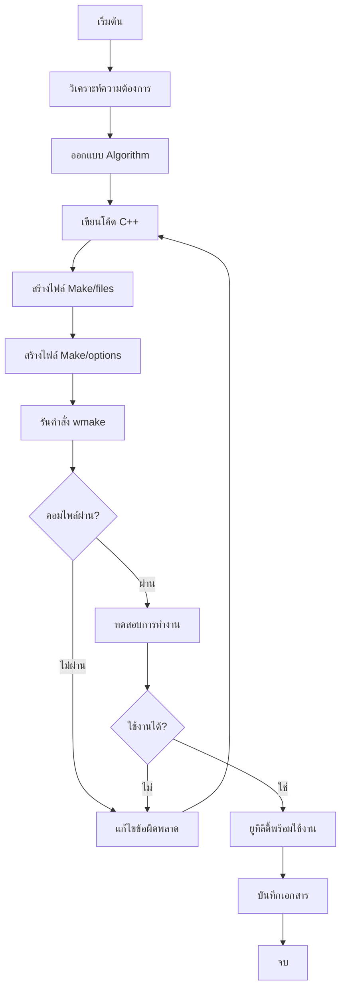

# การสร้าง Custom Utilities (Creating Custom Utilities)

การพัฒนา **Custom Utilities** ใน OpenFOAM เป็นกระบวนการขยายขีดความสามารถของซอฟต์แวร์ CFD เพื่อตอบโจทย์งานวิจัยและวิศวกรรมเฉพาะทางที่ไม่สามารถทำได้ด้วยเครื่องมือมาตรฐาน บทนี้จะกล่าวถึงหลักการพัฒนา โครงสร้างโค้ด และตัวอย่างการประยุกต์ใช้งานจริง

---

## 1. รากฐานทางทฤษฎี (Theoretical Foundation)

### 1.1 สถาปัตยกรรมของ OpenFOAM Utilities

ยูทิลิตี้ใน OpenFOAM ทำงานบนสถาปัตยกรรม **Time-Database** ซึ่งเป็นระบบจัดการข้อมูลที่ขึ้นกับเวลา (Temporal Data Management) โดยมีสมการพื้นฐานในการเข้าถึงข้อมูล:

$$
\mathcal{D}(t) = \left\{ \mathbf{\Phi}(\mathbf{x}, t), \quad \forall \mathbf{x} \in \Omega \right\}
$$

เมื่อ:
- $\mathcal{D}(t)$ = ชุดข้อมูลทั้งหมดในเวลา $t$
- $\mathbf{\Phi}$ = เวกเตอร์ของสนามต่าง ๆ (เช่น $p$, $U$, $T$)
- $\mathbf{x}$ = ตำแหน่งในโดเมน $\Omega$

### 1.2 การประมวลผลแบบขนาน (Parallel Processing)

ในการรันแบบขนานด้วย MPI (Message Passing Interface) การคำนวณค่าทางสถิติต้องใช้ฟังก์ชันการรวมค่า (Reduction Operation):

$$
\Phi_{\text{global}} = \bigoplus_{i=1}^{N_{proc}} \Phi_{i}
$$

เมื่อ $\bigoplus$ แทน operation ประเภท `maxOp`, `sumOp`, `avgOp` เป็นต้น

> [!INFO] ความสำคัญของการทำ Parallel Reduction
> หากไม่ใช้ `reduce()` ค่าที่ได้จะเป็นค่า **Local** เท่านั้น ซึ่งจะไม่ถูกต้องในกรณีรันแบบขนาน

---

## 2. โครงสร้างพื้นฐานของ Utility (Basic Template)

ยูทิลิตี้ทุกตัวต้องทำตามโครงสร้างมาตรฐาน (**Canonical Template**) เพื่อให้สามารถทำงานร่วมกับระบบ Time database และ Mesh ของ OpenFOAM ได้อย่างสมบูรณ์

### 2.1 โครงสร้างไฟล์และไดเรกทอรี

```
myCustomUtility/
├── myCustomUtility.C          # ไฟล์โค้ดหลัก
└── Make/
    ├── files                  # ระบุไฟล์ต้นฉบับและตำแหน่ง output
    └── options                # ระบุ header และ library ที่ต้องใช้
```

### 2.2 Template Code แบบสมบูรณ์

```cpp
// Include essential OpenFOAM headers for finite volume method
#include "fvCFD.H"
#include "IOobject.H"
#include "volFields.H"
#include "timeSelector.H"

// Use OpenFOAM namespace
using namespace Foam;

// * * * * * * * * * * * * * * * * * * * * * * * * * * * * * * * * * * * * * //

int main(int argc, char *argv[])
{
    // ========================================================================
    // PHASE 1: Initialization
    // ========================================================================

    // 1.1 Validate and set root case directory from command line arguments
    #include "setRootCase.H"

    // 1.2 Create Time object for temporal data management
    #include "createTime.H"

    // 1.3 Create Mesh object for spatial discretization
    #include "createMesh.H"

    // Display initialization information
    Info<< "\n==========================================\n"
        << "Starting Custom Utility Execution\n"
        << "Case: " << rootCase() << "\n"
        << "Mesh: " << mesh.nCells() << " cells\n"
        << "==========================================\n" << endl;

    // ========================================================================
    // PHASE 2: Time Loop Processing
    // ========================================================================

    // 2.1 Filter time directories based on command line selection
    instantList timeDirs = timeSelector::select
    (
        runTime.times(),
        args
    );

    // 2.2 Main loop over all selected time instances
    forAll(timeDirs, timeI)
    {
        // Set current time instance
        runTime.setTime(timeDirs[timeI], timeI);

        Info<< "\n--- Processing Time: " << runTime.timeName()
            << " ---" << endl;

        // ====================================================================
        // PHASE 3: Field Loading & Processing
        // ====================================================================

        // 3.1 Check if velocity field exists before loading
        if (!exists(runTime.timePath()/volVectorField::typeName/"U"))
        {
            WarningIn(args.executable())
                << "Velocity field U not found at time "
                << runTime.timeName() << nl
                << "Skipping this time directory..." << endl;
            continue;
        }

        // 3.2 Load velocity field from disk
        volVectorField U
        (
            IOobject
            (
                "U",
                runTime.timeName(),
                mesh,
                IOobject::MUST_READ,
                IOobject::AUTO_WRITE
            ),
            mesh
        );

        // 3.3 Load pressure field from disk
        volScalarField p
        (
            IOobject
            (
                "p",
                runTime.timeName(),
                mesh,
                IOobject::MUST_READ,
                IOobject::NO_WRITE
            ),
            mesh
        );

        // ====================================================================
        // PHASE 4: Mathematical Operations
        // ====================================================================

        // 4.1 Calculate velocity magnitude
        volScalarField magU = mag(U);

        // 4.2 Calculate statistical quantities
        scalar maxU = max(magU).value();
        scalar minU = min(magU).value();
        scalar avgU = average(magU).value();

        // 4.3 Parallel reduction - essential for parallel runs
        reduce(maxU, maxOp<scalar>());
        reduce(minU, minOp<scalar>());
        reduce(avgU, sumOp<scalar>());
        avgU /= Pstream::nProcs();

        // 4.4 Display statistics
        Info<< "Velocity Statistics:" << nl
            << "  Maximum: " << maxU << " m/s" << nl
            << "  Minimum: " << minU << " m/s" << nl
            << "  Average: " << avgU << " m/s" << endl;

        // ====================================================================
        // PHASE 5: Derived Field Computation
        // ====================================================================

        // 5.1 Calculate vorticity field (curl of velocity)
        volVectorField vorticity
        (
            IOobject
            (
                "vorticity",
                runTime.timeName(),
                mesh,
                IOobject::NO_READ,
                IOobject::AUTO_WRITE
            ),
            fvc::curl(U)
        );

        // 5.2 Calculate Q-criterion for vortex structure identification
        volScalarField QCriterion
        (
            IOobject
            (
                "Q",
                runTime.timeName(),
                mesh,
                IOobject::NO_READ,
                IOobject::AUTO_WRITE
            ),
            0.5 * (sqr(tr(fvc::grad(U))) - tr(sqr(fvc::grad(U))))
        );

        // 5.3 Write derived fields to disk
        vorticity.write();
        QCriterion.write();
    }

    // ========================================================================
    // PHASE 6: Finalization
    // ========================================================================

    Info<< "\n==========================================\n"
        << "Execution Completed Successfully!\n"
        << "Total processed times: " << timeDirs.size() << "\n"
        << "==========================================\n" << endl;

    return 0;
}

// ************************************************************************* //
```

**คำอธิบาย:**
- **แหล่งที่มา (Source):** โครงสร้างพื้นฐานของ Custom Utility ใน OpenFOAM อ้างอิงจาก `.applications/utilities/` ใน OpenFOAM source code
- **คำอธิบาย (Explanation):** โค้ดตัวอย่างนี้แสดงโครงสร้างแบบมาตรฐาน (Canonical Template) ที่ OpenFOAM utility ทุกตัวควรปฏิบัติตาม ประกอบด้วย 6 เฟสหลัก: การเริ่มต้น (Initialization), การประมวลผลแบบ Time Loop, การโหลดฟิลด์, การคำนวณทางคณิตศาสตร์, การคำนวณฟิลด์ที่ได้จากการดัดแปลง (Derived Field), และการจบการทำงาน (Finalization)
- **แนวคิดสำคัญ (Key Concepts):**
  - **Time-Database Architecture:** OpenFOAM ใช้ระบบจัดการข้อมูลแบบ Temporal Data Management ที่เชื่อมโยงข้อมูลกับเวลา
  - **Parallel Reduction:** การใช้ฟังก์ชัน `reduce()` จำเป็นมากสำหรับการรันแบบขนานเพื่อรวมค่าจากทุก processor
  - **Field Lifecycle:** การจัดการ IOobject กำหนดวิธีการอ่าน/เขียนฟิลด์ (MUST_READ, AUTO_WRITE)

---

## 3. การคอมไพล์ด้วย wmake (Compilation Process)

ในการสร้าง Custom Utility คุณต้องเตรียมไฟล์คอนฟิกูเรชันในโฟลเดอร์ `Make/` ตามโครงสร้างที่กำหนด

### 3.1 ไฟล์ `Make/files`

ระบุชื่อไฟล์ต้นฉบับ (`.C`) และตำแหน่งไฟล์ไบนารีที่จะถูกสร้าง:

```make
# Specify all source files
myCustomUtility.C

# Specify installation location for executable
EXE = $(FOAM_USER_APPBIN)/myCustomUtility

# Alternative: Install in current directory
# EXE = $(FOAM_RUN)/myCustomUtility
```

> [!TIP] ตำแหน่งการติดตั้ง
> - `$FOAM_USER_APPBIN`: สำหรับ utilities ส่วนบุคคล (ติดตั้งใน `~/OpenFOAM/.../platforms/linux64GccDPInt32Opt/bin`)
> - `$FOAM_APPBIN`: สำหรับ utilities ระดับระบบ (ต้องมีสิทธิ์ admin)

### 3.2 ไฟล์ `Make/options`

ระบุตำแหน่ง Header และไลบรารีที่จำเป็น:

```make
# Include paths for header files
EXE_INC = \
    -I$(LIB_SRC)/finiteVolume/lnInclude \
    -I$(LIB_SRC)/meshTools/lnInclude \
    -I$(LIB_SRC)/sampling/lnInclude \
    -I$(LIB_SRC)/transportModels \
    -I$(LIB_SRC)/turbulenceModels

# Library linking options
EXE_LIBS = \
    -lfiniteVolume \
    -lmeshTools \
    -lsampling \
    -lincompressibleTransportModels \
    -lincompressibleTurbulenceModels
```

**คำอธิบาย:**
- **แหล่งที่มา (Source):** Makefile configuration มาตรฐานสำหรับ OpenFOAM utilities
- **คำอธิบาย (Explanation):** ไฟล์ `Make/files` ใช้ระบุ source code และตำแหน่งที่จะติดตั้ง executable ส่วน `Make/options` ใช้กำหนด include paths และ libraries ที่จำเป็นสำหรับการคอมไพล์
- **แนวคิดสำคัญ (Key Concepts):**
  - **wmake Build System:** OpenFOAM ใช้ระบบ build แบบ wmake ที่พัฒนาขึ้นเอง
  - **Directory Structure:** โครงสร้าง `Make/` เป็นมาตรฐานที่ต้องปฏิบัติตาม
  - **Library Dependencies:** การระบุ libraries ที่ถูกต้องสำคัญต่อการ link สำเร็จ

### 3.3 ขั้นตอนการคอมไพล์

```bash
# Navigate to utility directory
cd $WM_PROJECT_USER_DIR/applications/utilities/myCustomUtility

# Execute wmake compilation
wmake

# Expected output:
# wmake LnInclude src
# wmake MkInclude src
# wmake Ctoo myCustomUtility.C
# wmake ld
# /home/user/OpenFOAM/user-v2206/platforms/linux64GccDPInt32Opt/bin/myCustomUtility
```

> [!WARNING] ข้อผิดพลาดที่พบบ่อย
> หากเจอ error: `fvCFD.H: No such file or directory` ให้ตรวจสอบว่าได้ source สภาพแวดล้อม OpenFOAM แล้ว:
> ```bash
> source /opt/openfoam/etc/bashrc
> ```

---

## 4. ตัวอย่างการใช้งานจริง (Practical Examples)

### 4.1 Example 1: Field Statistics Utility

เครื่องมือสำหรับวิเคราะห์สถิติของฟิลด์ความเร็วและความดัน:

```cpp
// Inside time loop

// 1. Load fields from disk
volVectorField U(IOobject("U", runTime.timeName(), mesh, IOobject::MUST_READ), mesh);
volScalarField p(IOobject("p", runTime.timeName(), mesh, IOobject::MUST_READ), mesh);

// 2. Calculate basic statistics
scalar maxU = max(mag(U)).value();
scalar minU = min(mag(U)).value();
scalar meanU = average(mag(U)).value();
scalar maxP = max(p).value();
scalar minP = min(p).value();

// 3. Perform parallel reduction for global values
reduce(maxU, maxOp<scalar>());
reduce(minU, minOp<scalar>());
reduce(meanU, sumOp<scalar>());
reduce(maxP, maxOp<scalar>());
reduce(minP, minOp<scalar>());

// Calculate global average
meanU /= Pstream::nProcs();

// 4. Display statistics
Info<< "Field Statistics at t = " << runTime.timeName() << ":" << nl
    << "  Velocity [m/s]:" << nl
    << "    Max: " << maxU << nl
    << "    Min: " << minU << nl
    << "    Mean: " << meanU << nl
    << "  Pressure [Pa]:" << nl
    << "    Max: " << maxP << nl
    << "    Min: " << minP << endl;
```

**คำอธิบาย:**
- **แหล่งที่มา (Source):** Field statistics calculation pattern ใช้ใน OpenFOAM utilities มาตรฐาน
- **คำอธิบาย (Explanation):** ตัวอย่างนี้แสดงวิธีการคำนวณค่าสถิติพื้นฐาน (maximum, minimum, average) ของฟิลด์ความเร็วและความดัน โดยมีการใช้ parallel reduction เพื่อให้ได้ค่าที่ถูกต้องในการรันแบบขนาน
- **แนวคิดสำคัญ (Key Concepts):**
  - **Global Reduction:** การใช้ `reduce()` จำเป็นสำหรับการรวมค่าจากทุก processor
  - **Field Algebra:** การใช้ฟังก์ชัน `mag()`, `max()`, `min()`, `average()` สำหรับการคำนวณ
  - **IOobject Management:** การระบุ `IOobject::MUST_READ` สำหรับฟิลด์ที่ต้องมีอยู่จริง

### 4.2 Example 2: Gradient & Divergence Computation

คำนวณปริมาณทางเวกเตอร์และเทนเซอร์ที่สำคัญในการวิเคราะห์การไหล:

```cpp
// Calculate velocity gradient tensor
volTensorField gradU = fvc::grad(U);

// Calculate symmetric gradient (Rate-of-Strain Tensor)
volSymmTensorField D = symm(gradU);

// Calculate skew-symmetric gradient (Vorticity Tensor)
volTensorField W = skew(gradU);

// Calculate velocity divergence (for incompressibility check)
volScalarField divU = fvc::div(U);

// Calculate shear rate magnitude
volScalarField magD = mag(D);

// Calculate mean kinetic energy
volScalarField ke = 0.5 * magSqr(U);

// Write all fields to disk
gradU.write();
D.write();
divU.write();
ke.write();
```

**คำอธิบาย:**
- **แหล่งที่มา (Source):** Finite volume calculus operations ใน OpenFOAM
- **คำอธิบาย (Explanation):** ตัวอย่างนี้แสดงการใช้ finite volume calculus (fvc) สำหรับการคำนวณปริมาณทางเวกเตอร์และเทนเซอร์ รวมถึง gradient, divergence, และ derived quantities ต่าง ๆ
- **แนวคิดสำคัญ (Key Concepts):**
  - **fvc vs fvm:** fvc (finite volume calculus) สำหรับ explicit calculations, fvm (finite volume method) สำหรับ implicit
  - **Tensor Decomposition:** การแยกส่วน symmetric (`symm()`) และ skew-symmetric (`skew()`) ของ gradient tensor
  - **Physical Quantities:** Shear rate, kinetic energy เป็นปริมาณสำคัญในการวิเคราะห์การไหล

### 4.3 Example 3: Force Calculation

คำนวณแรงที่กระทำต่อพื้นผิว (สำคัญสำหรับงาน Aerodynamics):

```cpp
// 1. Identify target patch
label wallPatchID = mesh.boundaryMesh().findPatchID("walls");

if (wallPatchID != -1)
{
    // 2. Access patch data
    const fvPatchVectorField& pPatch = p.boundaryField()[wallPatchID];
    const fvPatchVectorField& UPatch = U.boundaryField()[wallPatchID];
    const vectorField& Sf = mesh.Sf().boundaryField()[wallPatchID];

    // 3. Initialize force vectors
    vector pressureForce = vector::zero;
    vector viscousForce = vector::zero;

    // 4. Loop through all faces on the patch
    forAll(pPatch, faceI)
    {
        // Pressure force contribution
        pressureForce += pPatch[faceI] * Sf[faceI];

        // Viscous force contribution
        // Requires velocity gradient on patch
        tensorField gradUPatch = U.boundaryField()[wallPatchID].snGrad();
        viscousForce += mu * gradUPatch[faceI] * Sf[faceI].mag();
    }

    // 5. Parallel reduction
    reduce(pressureForce, sumOp<vector>());
    reduce(viscousForce, sumOp<vector>());

    // 6. Display results
    Info<< "Forces on 'walls' patch:" << nl
        << "  Pressure Force [N]: " << pressureForce << nl
        << "  Viscous Force [N]: " << viscousForce << nl
        << "  Total Force [N]: " << (pressureForce + viscousForce) << endl;
}
```

**คำอธิบาย:**
- **แหล่งที่มา (Source):** Force calculation pattern จาก OpenFOAM utilities เช่น `forces` function object
- **คำอธิบาย (Explanation):** ตัวอย่างนี้แสดงวิธีการคำนวณแรงที่กระทำต่อพื้นผิว โดยแบ่งเป็นสองส่วน: แรงเนื่องจากความดัน (pressure force) และแรงเนื่องจากความหนืด (viscous force)
- **แนวคิดสำคัญ (Key Concepts):**
  - **Patch Access:** การเข้าถึงข้อมูลบน patch ผ่าน `boundaryField()`
  - **Surface Integration:** การใช้ face area vector `Sf` สำหรับการ integrate บนพื้นผิว
  - **Force Decomposition:** การแยกแรงเป็น pressure และ viscous components

---

## 5. แผนผังการพัฒนา Utility


> **Figure 1:** แผนผังแสดงขั้นตอนการพัฒนา Custom Utility ตั้งแต่ขั้นตอนการออกแบบอัลกอริทึม การเขียนโค้ดภาษา C++ การตั้งค่าระบบการคอมไพล์ ไปจนถึงกระบวนการทดสอบและจัดทำเอกสารเพื่อให้ยูทิลิตี้พร้อมใช้งานในระดับมาตรฐาน

---

## 6. หลักการทางคณิตศาสตร์สำหรับ Utilities

### 6.1 การคำนวณ Gradient

ใน OpenFOAM การคำนวณ Gradient ใช้ **Gauss Theorem**:

$$
\int_{\Omega} \nabla \phi \, dV = \oint_{\partial \Omega} \phi \, \mathbf{n} \, dS
$$

เมื่อ:
- $\phi$ = สนามสเกลาร์
- $\mathbf{n}$ = เวกเตอร์หน่วยตั้งฉากกับพื้นผิว
- $dS$ = องค์ประกอบพื้นที่ผิว

### 6.2 การคำนวณ Divergence

การคำนวณ Divergence ใช้หลักการเดียวกัน:

$$
\int_{\Omega} \nabla \cdot \mathbf{u} \, dV = \oint_{\partial \Omega} \mathbf{u} \cdot \mathbf{n} \, dS
$$

เมื่อ $\mathbf{u}$ = เวกเตอร์ความเร็ว

### 6.3 การคำนวณ Laplacian

Laplacian ใช้แนวคิด **Gauss Divergence Theorem**:

$$
\int_{\Omega} \nabla^2 \phi \, dV = \oint_{\partial \Omega} \nabla \phi \cdot \mathbf{n} \, dS
$$

ใน OpenFOAM ใช้ฟังก์ชัน `fvc::laplacian(phi)`

### 6.4 การคำนวณ Curl (Vorticity)

สำหรับคำนวณ Vorticity $\boldsymbol{\omega} = \nabla \times \mathbf{u}$:

$$
\boldsymbol{\omega} = \nabla \times \mathbf{u} = \begin{bmatrix}
\frac{\partial w}{\partial y} - \frac{\partial v}{\partial z} \\
\frac{\partial u}{\partial z} - \frac{\partial w}{\partial x} \\
\frac{\partial v}{\partial x} - \frac{\partial u}{\partial y}
\end{bmatrix}
$$

ใน OpenFOAM ใช้: `fvc::curl(U)`

---

## 7. การจัดการ Boundary Conditions

เมื่อสร้าง Custom Utilities การเข้าใจและจัดการ Boundary Conditions ถือเป็นสิ่งสำคัญ

### 7.1 การตรวจสอบ Boundary Types

```cpp
// Access boundary mesh information
const fvBoundaryMesh& boundaries = mesh.boundary();

// Loop through all boundary patches
forAll(boundaries, patchI)
{
    const fvPatch& patch = boundaries[patchI];

    // Display patch information
    Info<< "Patch " << patchI << ": " << patch.name()
        << " (Type: " << patch.type() << ")" << nl
        << "  Faces: " << patch.size() << nl
        << "  Start Face: " << patch.start() << endl;
}
```

**คำอธิบาย:**
- **แหล่งที่มา (Source):** Boundary mesh access patterns ใน OpenFOAM
- **คำอธิบาย (Explanation):** ตัวอย่างนี้แสดงวิธีการเข้าถึงข้อมูล boundary patches ทั้งหมดใน mesh และแสดงข้อมูลพื้นฐานเช่น ชื่อ, ประเภท, และจำนวน faces
- **แนวคิดสำคัญ (Key Concepts):**
  - **Boundary Mesh:** `fvBoundaryMesh` เป็น container สำหรับ boundary patches
  - **Patch Information:** แต่ละ patch มีข้อมูลเกี่ยวกับ type, size, และ face indexing
  - **Iteration:** การใช้ `forAll` เป็นวิธีมาตรฐานในการ iterate ผ่าน OpenFOAM containers

### 7.2 การเข้าถึงข้อมูลบน Patch

```cpp
// Find specific patch by name
label patchID = mesh.boundaryMesh().findPatchID("inlet");

if (patchID != -1)
{
    // Access field data on the patch
    const fvPatchVectorField& Upatch = U.boundaryField()[patchID];

    // Calculate average velocity on patch
    vector avgU = vector::zero;
    forAll(Upatch, faceI)
    {
        avgU += Upatch[faceI];
    }
    avgU /= Upatch.size();

    // Display result
    Info<< "Average velocity at inlet: " << avgU << endl;
}
```

**คำอธิบาย:**
- **แหล่งที่มา (Source):** Patch field access patterns ใน OpenFOAM utilities
- **คำอธิบาย (Explanation):** ตัวอย่างนี้แสดงวิธีการค้นหา patch ด้วยชื่อและเข้าถึงข้อมูลฟิลด์บน patch นั้น ๆ จากนั้นคำนวณค่าเฉลี่ยของความเร็ว
- **แนวคิดสำคัญ (Key Concepts):**
  - **Patch Identification:** การใช้ `findPatchID()` สำหรับค้นหา patch ด้วยชื่อ
  - **Boundary Field Access:** การเข้าถึง `boundaryField()[patchID]` สำหรับดึงข้อมูลบน patch
  - **Face-wise Operations:** การ loop ผ่าน faces บน patch สำหรับการคำนวณ

---

## 8. การเขียนข้อมูล Output

### 8.1 การเขียนไฟล์ CSV

```cpp
// Create output file stream
OFstream outputFile("velocityStatistics.csv");

// Write CSV header
outputFile << "Time,MaxU,MinU,AvgU" << endl;

// Write data for current time step
outputFile << runTime.value() << ","
           << maxU << ","
           << minU << ","
           << avgU << endl;
```

**คำอธิบาย:**
- **แหล่งที่มา (Source):** File I/O patterns ใน OpenFOAM
- **คำอธิบาย (Explanation):** ตัวอย่างนี้แสดงวิธีการสร้างไฟล์ CSV สำหรับบันทึกข้อมูลทางสถิติ โดยใช้ `OFstream` ซึ่งเป็น output file stream ของ OpenFOAM
- **แนวคิดสำคัญ (Key Concepts):**
  - **OFstream:** OpenFOAM output file stream สำหรับการเขียนไฟล์
  - **CSV Format:** Comma-separated values เป็นรูปแบบที่นิยมสำหรับการ export ข้อมูล
  - **Data Export:** การเขียนข้อมูลเชิงสถิติสำหรับการวิเคราะห์เพิ่มเติม

### 8.2 การเขียนฟิลด์ใหม่

```cpp
// Create new derived field
volScalarField myDerivedField
(
    IOobject
    (
        "derivedField",
        runTime.timeName(),
        mesh,
        IOobject::NO_READ,      // Don't read from file
        IOobject::AUTO_WRITE    // Auto-write on destruction
    ),
    mesh,
    dimensionedScalar("zero", dimless, 0.0)
);

// Calculate field values
myDerivedField = mag(U) / mag(U.max());

// Write field to disk
myDerivedField.write();
```

**คำอธิบาย:**
- **แหล่งที่มา (Source):** Field creation and writing patterns ใน OpenFOAM
- **คำอธิบาย (Explanation):** ตัวอย่างนี้แสดงวิธีการสร้าง derived field ใหม่ โดยระบุ IOobject ที่เหมาะสม และเขียนลงดิสก์สำหรับการ post-processing
- **แนวคิดสำคัญ (Key Concepts):**
  - **IOobject Modes:** `NO_READ`, `AUTO_WRITE` ใช้สำหรับฟิลด์ที่สร้างขึ้นใหม่
  - **Dimensioned Types:** การระบุ dimensions สำคัญสำหรับ dimensional consistency
  - **Automatic Writing:** การใช้ `AUTO_WRITE` ช่วยให้ฟิลด์ถูกเขียนโดยอัตโนมัติ

---

## 9. การจัดการ Memory (Memory Management)

> [!WARNING] หลีกเลี่ยง Memory Leaks
> ใน OpenFOAM การใช้ `tmp<T>` ช่วยลดภาระการจัดการหน่วยความจำ

```cpp
// Not recommended (creates unnecessary copy)
volScalarField magU1 = mag(U);  // Copies entire field

// Recommended (uses tmp for efficiency)
tmp<volScalarField> tmagU = mag(U);
const volScalarField& magU2 = tmagU();  // Use reference
// tmagU automatically destroyed when leaving scope
```

**คำอธิบาย:**
- **แหล่งที่มา (Source):** Memory management best practices ใน OpenFOAM
- **คำอธิบาย (Explanation):** ตัวอย่างนี้แสดงความแตกต่างระหว่างการใช้วิธี copy และการใช้ `tmp<T>` ซึ่งเป็นกลไกที่ช่วยลดการใช้หน่วยความจำและเพิ่มประสิทธิภาพ
- **แนวคิดสำคัญ (Key Concepts):**
  - **tmp<T>:** Temporary field wrapper ที่ช่วยลดการ copy
  - **Memory Efficiency:** การใช้ reference แทนการ copy ช่วยประหยัด memory
  - **Automatic Cleanup:** `tmp` จะถูกทำลายอัตโนมัติเมื่อไม่ใช้งาน

---

## 10. การดีบักและแก้ไขข้อผิดพลาด (Debugging)

### 10.1 การใช้ Info และ Warning

```cpp
// Information level output
Info<< "Processing field: " << fieldName << endl;

// Warning level output
WarningInFunction
    << "Field " << fieldName << " not found. Using default value." << endl;

// Fatal error (terminates execution)
if (someCondition)
{
    FatalErrorInFunction
        << "Critical error: Cannot proceed without required field."
        << exit(FatalError);
}
```

**คำอธิบาย:**
- **แหล่งที่มา (Source):** Error handling and reporting patterns ใน OpenFOAM
- **คำอธิบาย (Explanation):** ตัวอย่างนี้แสดงระดับของการรายงานข้อผิดพลาดใน OpenFOAM ตั้งแต่ Info, Warning ไปจนถึง FatalError ซึ่งจะหยุดการทำงานของโปรแกรม
- **แนวคิดสำคัญ (Key Concepts):**
  - **Logging Levels:** `Info`, `Warning`, `FatalError` มีระดับความรุนแรงต่างกัน
  - **Error Context:** `InFunction` ให้ข้อมูลเกี่ยวกับตำแหน่งของ error
  - **Graceful Termination:** `FatalError` ช่วยให้โปรแกรมจบอย่างเป็นระบบ

### 10.2 การตรวจสอบ Field Existence

```cpp
// Method 1: Check with IOobject
IOobject fieldHeader
(
    "U",
    runTime.timeName(),
    mesh,
    IOobject::MUST_READ
);

if (fieldHeader.typeHeaderOk<volVectorField>(true))
{
    Info<< "Field U exists and can be read." << endl;
}
else
{
    Info<< "Field U not found." << endl;
}

// Method 2: Check with exists()
if (exists(runTime.timePath()/volVectorField::typeName/"U"))
{
    Info<< "Field U file exists." << endl;
}
```

**คำอธิบาย:**
- **แหล่งที่มา (Source):** Field validation patterns ใน OpenFOAM utilities
- **คำอธิบาย (Explanation):** ตัวอย่างนี้แสดงสองวิธีในการตรวจสอบการมีอยู่ของฟิลด์ โดยวิธีแรกใช้ IOobject และวิธีที่สองใช้ฟังก์ชัน `exists()`
- **แนวคิดสำคัญ (Key Concepts):**
  - **Field Validation:** การตรวจสอบการมีอยู่ของฟิลด์ก่อนอ่านเป็นสิ่งสำคัญ
  - **Type Safety:** `typeHeaderOk<T>()` ตรวจสอบทั้งการมีอยู่และประเภทข้อมูล
  - **File System:** `exists()` ตรวจสอบการมีอยู่ของไฟล์ในระบบไฟล์

---

## 11. ตัวอย่าง Utility แบบสมบูรณ์

### 11.1 Turbulence Kinetic Energy Analyzer

```cpp
// myTKEAnalyzer.C
#include "fvCFD.H"
#include "singlePhaseTransportModel.H"
#include "turbulentTransportModel.H"

using namespace Foam;

int main(int argc, char *argv[])
{
    #include "setRootCase.H"
    #include "createTime.H"
    #include "createMesh.H"

    // Create turbulence model
    autoPtr<incompressible::turbulenceModel> turbulence
    (
        incompressible::turbulenceModel::New(U, phi, laminarTransport)
    );

    instantList timeDirs = timeSelector::select(runTime.times(), args);

    forAll(timeDirs, timeI)
    {
        runTime.setTime(timeDirs[timeI], timeI);
        Info<< "Time: " << runTime.timeName() << endl;

        // Load velocity field
        volVectorField U
        (
            IOobject("U", runTime.timeName(), mesh, IOobject::MUST_READ),
            mesh
        );

        // Calculate TKE from velocity fluctuations
        volScalarField k
        (
            IOobject
            (
                "k",
                runTime.timeName(),
                mesh,
                IOobject::NO_READ,
                IOobject::AUTO_WRITE
            ),
            0.5 * magSqr(U)
        );

        // Calculate TKE production
        volTensorField gradU = fvc::grad(U);
        volSymmTensorField S = symm(gradU);
        volScalarField P
        (
            IOobject
            (
                "kProduction",
                runTime.timeName(),
                mesh,
                IOobject::NO_READ,
                IOobject::AUTO_WRITE
            ),
            turbulence->nuEff() * 2.0 * magSqr(S)
        );

        // Write fields to disk
        k.write();
        P.write();

        // Calculate and display global statistics
        scalar maxk = max(k).value();
        scalar maxP = max(P).value();

        reduce(maxk, maxOp<scalar>());
        reduce(maxP, maxOp<scalar>());

        Info<< "  Max TKE: " << maxk << " m²/s²" << nl
            << "  Max Production: " << maxP << " m²/s³" << endl;
    }

    Info<< "End\n" << endl;
    return 0;
}
```

**คำอธิบาย:**
- **แหล่งที่มา (Source):** Complete utility example สำหรับ Turbulence Kinetic Energy analysis
- **คำอธิบาย (Explanation):** ตัวอย่างนี้แสดง utility ที่สมบูรณ์สำหรับการวิเคราะห์ Turbulence Kinetic Energy (TKE) และอัตราการผลิต TKE โดยใช้ turbulence model ของ OpenFOAM
- **แนวคิดสำคัญ (Key Concepts):**
  - **Turbulence Modeling:** การใช้ `turbulenceModel` สำหรับการคำนวณปริมาณเชิงกำลังสอง
  - **TKE Calculation:** k = 0.5 * (u'² + v'² + w'²)
  - **Production Term:** P = ν_eff * 2 * ||S||²
  - **AutoPtr Management:** การใช้ `autoPtr` สำหรับ automatic memory management

---

## 12. การทดสอบและ Validation

### 12.1 การสร้าง Test Case

> [!TIP] แนวทางการทดสอบ
> ให้สร้าง Test Case ง่าย ๆ ที่มีคำตอบแน่นอน เช่น Channel Flow หรือ Cavity Flow

```cpp
// Gradient validation test
// If phi = x + y + z, then grad(phi) should equal (1, 1, 1)

volScalarField phi
(
    IOobject
    (
        "phi",
        runTime.timeName(),
        mesh,
        IOobject::NO_READ,
        IOobject::NO_WRITE
    ),
    mesh,
    dimensionedScalar("phi", dimless, 0.0)
);

// Initialize phi field
const vectorField& C = mesh.C();
forAll(phi, cellI)
{
    phi[cellI] = C[cellI].x() + C[cellI].y() + C[cellI].z();
}

// Calculate gradient
volVectorField gradPhi = fvc::grad(phi);

// Check against analytical solution
Info<< "Max deviation from expected gradient (1,1,1): "
    << max(mag(gradPhi - vector(1, 1, 1))).value() << endl;
```

**คำอธิบาย:**
- **แหล่งที่มา (Source):** Validation testing patterns ใน OpenFOAM development
- **คำอธิบาย (Explanation):** ตัวอย่างนี้แสดงวิธีการสร้าง test case สำหรับ validation โดยใช้ฟังก์ชันที่มีคำตอบแน่นอน (analytical solution) เพื่อตรวจสอบความถูกต้องของการคำนวณ
- **แนวคิดสำคัญ (Key Concepts):**
  - **Analytical Solutions:** การใช้ฟังก์ชันที่มีคำตอบแน่นอนสำหรับ validation
  - **Gradient Testing:** การตรวจสอบความถูกต้องของ gradient calculation
  - **Error Norms:** การใช้ maximum deviation สำหรับวัดความแม่นยำ

---

## 13. เอกสารและ Commenting

> [!TIP] หลักการเขียน Comment ที่ดี
> 1. อธิบายว่าทำไม (Why) ไม่ใช่ว่าทำอะไร (What)
> 2. ใช้ Comment เพื่ออธิบาย Algorithm ที่ซับซ้อน
> 3. ระบุ References ถ้าใช้สมการจากเอกสารวิชาการ

```cpp
// Calculate Q-criterion for vortex identification
// Reference: Hunt, J.C.R. et al. (1988)
// "Eddies, streams, and convergence zones in turbulent flows"
// Q = 0.5 * (||Ω||² - ||S||²)
// where Ω = vorticity tensor, S = strain rate tensor

volTensorField gradU = fvc::grad(U);
volSymmTensorField S = symm(gradU);  // Strain rate tensor
volTensorField Omega = skew(gradU);  // Vorticity tensor

// Q = 0.5 * (tr(Ω²) - tr(S²))
volScalarField Q
(
    IOobject
    (
        "Q",
        runTime.timeName(),
        mesh,
        IOobject::NO_READ,
        IOobject::AUTO_WRITE
    ),
    0.5 * (tr(Omega & Omega) - tr(S & S))
);
```

**คำอธิบาย:**
- **แหล่งที่มา (Source):** Code documentation best practices ใน OpenFOAM
- **คำอธิบาย (Explanation):** ตัวอย่างนี้แสดงการเขียน comment ที่ดี โดยอธิบายสมการที่ใช้ อ้างอิง source และอธิบายความหมายของแต่ละส่วน
- **แนวคิดสำคัญ (Key Concepts):**
  - **Academic References:** การอ้างอิงเอกสารวิชาการสำหรับสมการที่ใช้
  - **Why vs What:** Comment ควรอธิบายเหตุผล ไม่ใช่แค่สิ่งที่ทำ
  - **Mathematical Context:** การให้บริบททางคณิตศาสตร์ช่วยให้เข้าใจโค้ดได้ดีขึ้น

---

## 14. สรุป Best Practices

> [!SUCCESS] Checklist สำหรับการพัฒนา Utilities ที่ดี

### 14.1 โครงสร้างโค้ด
1. ✅ ใช้ Template มาตรฐาน (`setRootCase.H`, `createTime.H`, `createMesh.H`)
2. ✅ แยก Logic ออกเป็นฟังก์ชันย่อยที่ชัดเจน
3. ✅ ใช้ `const` reference เมื่อไม่ต้องการแก้ไขข้อมูล
4. ✅ ใช้ `tmp<T>` สำหรับ field ชั่วคราว

### 14.2 Parallel Support
5. ✅ ใช้ `reduce()` สำหรับทุก global reduction operations
6. ✅ ตรวจสอบ `Pstream::nProcs()` ก่อนทำ operation
7. ✅ หลีกเลี่ยงการใช้ I/O ภายใน loop ขนาน

### 14.3 Error Handling
8. ✅ ตรวจสอบการมีอยู่ของฟิลด์ก่อนอ่าน (`exists()`)
9. ✅ ใช้ `try-catch` สำหรับ operations ที่อาจล้มเหลว
10. ✅ ให้ข้อความ Error ที่ชัดเจนและเป็นประโยชน์

### 14.4 Performance
11. ✅ ลดการสร้าง field ชั่วคราวที่ไม่จำเป็น
12. ✅ ใช้ reference (`&`) แทนการ copy
13. ✅ ระมัดระวังการใช้ memory สำหรับ large meshes

### 14.5 Documentation
14. ✅ Comment อธิบาย Algorithm ที่ซับซ้อน
15. ✅ ระบุ References ถ้าใช้สมการจากเอกสารวิชาการ
16. ✅ สร้าง README อธิบายการใช้งาน

---

## 15. แหล่งอ้างอิงและการศึกษาเพิ่มเติม

1. **OpenFOAM Programmer's Guide**: https://www.openfoam.com/documentation/programmers-guide/
2. **OpenFOAM Source Code**: `$FOAM_SRC/applications/utilities/`
3. **CFD Online Wiki**: https://wiki.openfoam.com/

---

## 📋 สรุป (Summary)

ในบทนี้เราได้เรียนรู้:

- ✅ **โครงสร้างพื้นฐาน** ของ Custom Utilities
- ✅ **การคอมไพล์** ด้วย `wmake`
- ✅ **การประมวลผลฟิลด์** และการคำนวณปริมาณต่าง ๆ
- ✅ **Parallel Reduction** สำหรับการรันแบบขนาน
- ✅ **การจัดการ Boundary Conditions**
- ✅ **การเขียน Output** และการ Debug
- ✅ **Best Practices** สำหรับการพัฒนา Utilities ที่มีประสิทธิภาพ

---

**หัวข้อถัดไป**: [[07_Integration_with_Solver_Workflows]] เพื่อดูวิธีการรวม Custom Utility เข้ากับไปป์ไลน์การทำงานจริงและ Solver Workflows