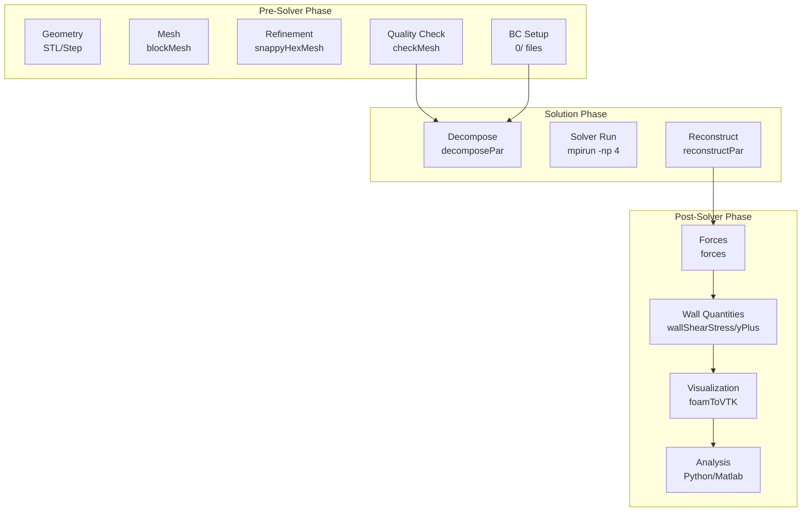

# การผสานรวมกับเวิร์กโฟลว์ของ Solver (Integration with Solver Workflows)

ยูทิลิตี้ของ OpenFOAM ถูกออกแบบมาให้ทำงานร่วมกับ Solver ได้อย่างราบรื่น เพื่อสร้างไปป์ไลน์การจำลองที่สมบูรณ์ตั้งแต่การเตรียมข้อมูล (Preprocessing) การคำนวณ (Solution) ไปจนถึงการประมวลผลหลังการจำลอง (Postprocessing)

---

## 1. การประมวลผลก่อนการจำลอง (Pre-Solver Processing)

ก่อนเริ่มรัน Solver ยูทิลิตี้ต่างๆ จะทำหน้าที่เตรียมโดเมนและกำหนดค่าเริ่มต้นที่จำเป็น ขั้นตอนนี้เป็น ==พื้นฐานที่สำคัญ== ของการจำลอง CFD ที่แม่นยำ

### 1.1 การสร้างและตรวจสอบ Mesh (Mesh Generation & Validation)

> [!INFO] ความสำคัญของ Mesh Quality
> Mesh ที่มีคุณภาพไม่ดีอาจทำให้ Solver แก้สมการไม่ลงตัว (Divergence) หรือให้ผลลัพธ์ที่ไม่ถูกต้อง แม้ว่าจะใช้รูปแบบสมการที่ถูกต้องก็ตาม

#### 1.1.1 การสร้าง Mesh พื้นฐานด้วย blockMesh

**blockMesh** เป็นยูทิลิตี้สำหรับสร้าง Mesh โครงสร้างจากการกำหนดจุดยอด (Vertices) และบล็อก (Blocks) ในไฟล์ `blockMeshDict`

<details>
<summary>📖 ทฤษฎี: โครงสร้าง Mesh พหุภาคย์ (Polyhedral Mesh)</summary>

ใน OpenFOAM Mesh ถูกกำหนดด้วย:
- **Cell (PCell)**: หน่วยพื้นที่ควบคุม (Control Volume) ที่ไม่จำเป็นต้องเป็นทรงเหลี่ยม
- **Face**: พื้นผิวระหว่าง Cell สองตัว
- **Point**: จุดยอดของ Mesh

คุณภาพของ Mesh ถูกวัดด้วย:
1. **Non-orthogonality** ($\alpha$): มุมระหว่างเวกเตอร์ปกติของ Face และเวกเตอร์เชื่อมระหว่างเซนตรอยด์ Cell

$$
\alpha = \arccos\left( \frac{\mathbf{S} \cdot \mathbf{d}}{|\mathbf{S}| |\mathbf{d}|} \right)
$$

เมื่อ $\mathbf{S}$ คือเวกเตอร์ปกติของ Face และ $\mathbf{d}$ คือเวกเตอร์เชื่อมระหว่างเซนตรอยด์

2. **Skewness**: อัตราส่วนของระยะห่างระหว่างเซนตรอยด์ของ Face กับเส้นเชื่อมต่อกึ่งกลาง Cell

</details>

#### ตัวอย่าง: blockMeshDict

```cpp
// NOTE: Synthesized by AI - Verify parameters
FoamFile
{
    version     2.0;
    format      ascii;
    class       dictionary;
    object      blockMeshDict;
}
// * * * * * * * * * * * * * * * * * * * * * * * * * * * * * * * * * * * * * //

convertToMeters 0.1;  // หน่วยตัวช่วยแปลงเป็นเมตร

vertices
(
    (0 0 0)    // จุดยอด 0
    (1 0 0)    // จุดยอด 1
    (1 1 0)    // จุดยอด 2
    (0 1 0)    // จุดยอด 3
    (0 0 0.5)  // จุดยอด 4 (ชั้นที่สอง)
    (1 0 0.5)  // จุดยอด 5
    (1 1 0.5)  // จุดยอด 6
    (0 1 0.5)  // จุดยอด 7
);

blocks
(
    hex (0 1 2 3 4 5 6 7) (20 20 10) simpleGrading (1 1 1)
);

edges
(
    // รูปแบบเส้นโค้งถ้าต้องการ
);

boundary
(
    inlet
    {
        type patch;
        faces ((0 4 7 3)); // หน้าด้านซ้าย
    }
    outlet
    {
        type patch;
        faces ((1 5 6 2)); // หน้าด้านขวา
    }
    walls
    {
        type wall;
        faces ((0 1 5 4) (3 7 6 2)); // ผนังบนและล่าง
    }
);
```

#### 1.1.2 การปรับปรุง Mesh ด้วย snappyHexMesh

สำหรับเรขาคณิตที่ซับซ้อน **snappyHexMesh** จะทำการ:
1. **Castellation**: แบ่ง Cell ที่อยู่ใกล้พื้นผิวเรขาคณิต
2. **Snap**: ปรับจุดยอดให้สอดคล้องกับพื้นผิว
3. **Layer Addition**: เพิ่มชั้น Cell บริเวณผนัง (Boundary Layer)

#### ตัวอย่าง: snappyHexMeshDict (ส่วนสำคัญ)

```cpp
// NOTE: Synthesized by AI - Verify parameters
castellatedMesh true;
snap true;
addLayers true;

geometry
{
    STL_File.stl  // ไฟล์ STL ของเรขาคณิต
    {
        type triSurfaceMesh;
        name geometry;
    }
}

castellatedMeshControls
{
    maxLocalCells 1000000;  // จำนวน Cell สูงสุด
    maxGlobalCells 2000000;

    refinementRegions
    {
        geometry
        {
            level (2 4);  // ระดับการละเอียด (min max)
        }
    }
}

snapControls
{
    nSmoothPatch 3;
    tolerance 2.0;  // ค่าความคลาดเคลื่อนในการปรับจุดยอด
}

addLayersControls
{
    relativeSizes true;
    layers
    {
        "walls.*"  // รูปแบบชื่อ Patch ที่ต้องการเพิ่มชั้น
        {
            nSurfaceLayers 3;  // จำนวนชั้น
        }
    }

    expansionRatio 1.2;  // อัตราส่วนการขยายระหว่างชั้น
    finalLayerThickness 0.3;  // ความหนาของชั้นสุดท้าย
}
```

#### 1.1.3 การตรวจสอบคุณภาพ Mesh ด้วย checkMesh

```bash
# รัน checkMesh เพื่อตรวจสอบคุณภาพ Mesh
checkMesh -allGeometry -allTopology

# ตรวจสอบเฉพาะค่า Non-orthogonality และ Skewness
checkMesh -meshQuality
```

**เกณฑ์การยอมรับ Mesh:**
- **Non-orthogonality** < 70° (สำหรับ Solver มาตรฐาน)
- **Skewness** < 2.0 (Mesh ที่ดีควร < 1.0)
- **Aspect Ratio** < 1000

> [!WARNING] การแก้ไข Mesh ที่มีปัญหา
> หากพบ Mesh ที่มีค่า Non-orthogorality สูงเกินไป ให้ลอง:
> - ลดระดับการละเอียดของ Refinement
> - ปรับค่า `nSmoothPatch` ใน snappyHexMesh
> - สร้าง Mesh ใหม่ด้วย blockMesh ที่มีการกระจาย Cell สม่ำเสมอขึ้น

---

### 1.2 การกำหนดค่าเริ่มต้นและเงื่อนไขขอบเขต (Initialization & BCs)

#### 1.2.1 การกำหนดค่าเริ่มต้นด้วย setFields

**setFields** ใช้สำหรับกำหนดค่าเริ่มต้นของฟิลด์ (เช่น $U$, $p$, $T$, $k$, $\epsilon$) ตามพื้นที่ทางเรขาคณิต

<details>
<summary>📖 ทฤษฎี: ค่าเริ่มต้นและความเสถียรของ Solver</summary>

สมการขนถ่ายมวลโมเมนตัมสำหรับการไหลแบบไม่อัดตัว:

$$
\frac{\partial (\rho \mathbf{U})}{\partial t} + \nabla \cdot (\rho \mathbf{U} \mathbf{U}) = -\nabla p + \nabla \cdot \left( \mu \left( \nabla \mathbf{U} + (\nabla \mathbf{U})^T \right) \right) + \rho \mathbf{g}
$$

ค่าเริ่มต้นที่เหมาะสมช่วยให้:
1. ลดจำนวน Iteration ที่ต้องการเพื่อ Convergence
2. หลีกเลี่ยงการเกิด Instability ในช่วงแรกของการจำลอง
3. ช่วยให้ Solver ผ่านช่วง Transient ที่มี Gradient สูง

</details>

#### ตัวอย่าง: setFieldsDict

```cpp
// NOTE: Synthesized by AI - Verify parameters
FoamFile
{
    version     2.0;
    format      ascii;
    class       dictionary;
    object      setFieldsDict;
}

defaultFieldValues
(
    volVectorFieldValue U (0 0 0)  // ความเร็วเริ่มต้น = 0 ทุกทิศทาง
    volScalarFieldValue p 0         // ความดันเกจ (Gauge Pressure) เริ่มต้น = 0
);

regions
(
    // กำหนดความเร็วในบริเวณ Inlet
    boxToCell
    {
        box (0 0 0) (0.1 1 1);  // (xMin yMin zMin) (xMax yMax zMax)
        fieldValues
        (
            volVectorFieldValue U (5 0 0)  // ความเร็ว 5 m/s ในทิศทาง x
        );
    }

    // กำหนดความดันสูงในบริเวณ Outlet
    boxToCell
    {
        box (0.9 0 0) (1 1 1);
        fieldValues
        (
            volScalarFieldValue p 1000  // ความดัน 1000 Pa
        );
    }
);
```

#### 1.2.2 ประเภทของเงื่อนไขขอบเขต (Boundary Conditions)

OpenFOAM รองรับเงื่อนไขขอบเขตที่หลากหลาย แบ่งตามประเภททางคณิตศาสตร์:

| ประเภท | ชนิด BC | คำอธิบาย | ตัวอย่างการใช้งาน |
|---|---|---|---|
| **Dirichlet** | `fixedValue` | กำหนดค่าคงที่ที่ขอบเขต | Inlet Velocity, Outlet Pressure |
| **Neumann** | `zeroGradient` | เกรเดียนต์เป็นศูนย์ | Outlet Velocity (พอท์งัดแร) |
| **Mixed** | `mixed` | ผสมระหว่าง Dirichlet และ Neumann | Wall Temperature (Convection) |
| **Wall Function** | `wallFunction` | ใช้ฟังก์ชันผนังสำหรับ Turbulence | Wall $k$, $\epsilon$, $\omega$ |

#### ตัวอย่าง: เงื่อนไขขอบเขตมาตรฐาน

<details>
<summary>📋 ไฟล์: 0/U (Velocity)</summary>

```cpp
// NOTE: Synthesized by AI - Verify parameters
dimensions      [0 1 -1 0 0 0 0];  // หน่วย: m/s

internalField   uniform (0 0 0);  // ค่าเริ่มต้นภายในโดเมน

boundaryField
{
    inlet
    {
        type            fixedValue;       // Dirichlet BC
        value           uniform (10 0 0); // ความเร็ว 10 m/s
    }

    outlet
    {
        type            zeroGradient;     // Neumann BC: ∂U/∂n = 0
    }

    walls
    {
        type            noSlip;           // ไม่มีการลื่นไถล
    }
}
```

</details>

<details>
<summary>📋 ไฟล์: 0/p (Pressure)</summary>

```cpp
// NOTE: Synthesized by AI - Verify parameters
dimensions      [1 -1 -2 0 0 0 0];  // หน่วย: kg/(m·s²) = Pa

internalField   uniform 0;

boundaryField
{
    inlet
    {
        type            zeroGradient;     // ∂p/∂n = 0
    }

    outlet
    {
        type            fixedValue;       // กำหนดความดันจลน์
        value           uniform 0;
    }

    walls
    {
        type            zeroGradient;
    }
}
```

</details>

<details>
<summary>📋 ไฟล์: 0/k (Turbulent Kinetic Energy) - สำหรับ k-ε Model</summary>

```cpp
// NOTE: Synthesized by AI - Verify parameters
dimensions      [0 2 -2 0 0 0 0];  // หน่วย: m²/s²

internalField   uniform 0.1;       // ค่า I0: I = 0.1 m²/s²

boundaryField
{
    inlet
    {
        type            fixedValue;
        value           uniform 0.375;  // k = 1.5 * (U * I)², I = 5%
    }

    outlet
    {
        type            zeroGradient;
    }

    walls
    {
        type            kqRWallFunction;  // ฟังก์ชันผนังสำหรับ k
        value           uniform 0;
    }
}
```

</details>

---

## 2. การประมวลผลหลังการจำลอง (Post-Solver Processing)

เมื่อ Solver คำนวณเสร็จสิ้น ข้อมูลดิบ (Raw Data) จะถูกประมวลผลเพื่อสกัดข้อมูลทางวิศวกรรม ขั้นตอนนี้เป็น ==สะพานเชื่อม== ระหว่างข้อมูล CFD ดิบและข้อมูลที่ใช้ตัดสินใจทางวิศวกรรม

### 2.1 การคำนวณปริมาณอนุพัทธ์ (Derived Quantity Computation)

ใช้ยูทิลิตี้เพื่อคำนวณค่าเพิ่มเติมโดยไม่ต้องรัน Solver ใหม่:

#### 2.1.1 การคำนวณแรงเสียดทานที่ผนัง (Wall Shear Stress)

> [!INFO] ความสำคัญของ Wall Shear Stress
> Wall Shear Stress ($\tau_w$) เป็นพารามิเตอร์สำคัญในการออกแบบระบบท่อ ช่วยคาดการณ์การสูญเสียพลังงานเนื่องจากแรงเสียดทาน (Friction Loss)

<details>
<summary>📖 ทฤษฎี: Wall Shear Stress ในการไหลแบบ Turbulent</summary>

Wall Shear Stress ถูกกำหนดจากเกรเดียนต์ของความเร็วที่ผนัง:

$$
\tau_w = \mu \left( \frac{\partial U_t}{\partial n} \right)_{n=0}
$$

เมื่อ:
- $\mu$ = ความหนืด (Dynamic Viscosity)
- $U_t$ = ความเร็วสัมผัส (Tangential Velocity)
- $n$ = ทิศทางปกติหน้าผนัง

สำหรับการไหลแบบ Turbulent สามารถใช้ Skin Friction Coefficient ($C_f$):

$$
C_f = \frac{\tau_w}{\frac{1}{2} \rho U_{\infty}^2}
$$

</details>

```bash
# คำนวณ Wall Shear Stress
wallShearStress

# ผลลัพธ์จะถูกบันทึกในไฟล์: latestTime/wallShearStress
# สามารถเปิดดูใน ParaView ได้
```

#### ตัวอย่าง: wallShearStressDict

```cpp
// NOTE: Synthesized by AI - Verify parameters
FoamFile
{
    version     2.0;
    format      ascii;
    class       dictionary;
    object      wallShearStressDict;
}

// กำหนด Patch ที่ต้องการคำนวณ
patches
(
    "walls.*"
);
```

#### 2.1.2 การประเมินความเหมาะสมของ Mesh ด้วย yPlus

**yPlus** ($y^+$) เป็นตัวชี้วัดความละเอียดของ Mesh บริเวณชั้นขอบเขต (Boundary Layer)

<details>
<summary>📖 ทฤษฎี: yPlus และความสำคัญต่อ Turbulence Modeling</summary>

$$
y^+ = \frac{u_* y}{\nu} = \frac{\tau_w^{1/2} y}{\rho^{1/2} \nu}
$$

เมื่อ:
- $u_* = \sqrt{\tau_w / \rho}$ = ความเร็วแรงเฉือน (Friction Velocity)
- $y$ = ระยะห่างจากผนังถึงเซนตรอยด์ Cell แรก
- $\nu = \mu / \rho$ = ความหนืดจลน์ (Kinematic Viscosity)

**เกณฑ์:**
- **$y^+ < 5$**: Mesh ละเอียดมาก (Low-Re Model) สำหรับ Direct Simulation
- **$5 < y^+ < 30$**: Buffer Zone (ควรหลีกเลี่ยง)
- **$30 < y^+ < 300$**: ใช้ Wall Function ได้ (High-Re Model)

</details>

```bash
# คำนวณ yPlus
yPlus

# สำหรับ Parallel Run
yPlus -parallel

# ผลลัพธ์จะถูกแสดงใน Terminal และบันทึกในไฟล์
```

> [!TIP] การปรับ Mesh หาก yPlus ไม่เหมาะสม
> หาก $y^+$ ต่ำเกินไป:
> - ลดจำนวนชั้น (nSurfaceLayers) ใน snappyHexMesh
> - ขยายความหนาชั้นสุดท้าย (finalLayerThickness)
>
> หาก $y^+$ สูงเกินไป:
> - เพิ่มจำนวนชั้น
> - ลดความหนาของชั้นสุดท้าย
> - ใช้ `expansionRatio` ที่ต่ำกว่า (เช่น 1.1 แทน 1.2)

#### 2.1.3 การคำนวณแรงลัพธ์และสัมประสิทธิ์ทางอากาศพลศาสตร์

**forces** เป็นยูทิลิตี้สำหรับคำนวณแรงและโมเมนต์ที่กระทำต่อวัตถุ ซึ่งเป็น ==พื้นฐานสำคัญ== ในการออกแบบอากาศยานและยานพาหนะ

<details>
<summary>📖 ทฤษฎี: แรงและสัมประสิทธิ์ทางอากาศพลศาสตร์</summary>

แรงลัพธ์ที่กระทำต่อวัตถุในกระแสไหล:

$$
\mathbf{F} = \mathbf{F}_p + \mathbf{F}_v = \sum_{i} \left( -p_i \mathbf{n}_i + \boldsymbol{\tau}_i \cdot \mathbf{n}_i \right) A_i
$$

เมื่อ:
- $\mathbf{F}_p$ = แรงดัน (Pressure Force)
- $\mathbf{F}_v$ = แรงเสียดทาน (Viscous Force)
- $p_i$ = ความดันที่ Face ที่ $i$
- $\mathbf{n}_i$ = เวกเตอร์ปกติของ Face
- $A_i$ = พื้นที่ของ Face

สัมประสิทธิ์แรงยก (Lift Coefficient, $C_L$) และแรงต้าน (Drag Coefficient, $C_D$):

$$
C_L = \frac{F_L}{\frac{1}{2} \rho U_{\infty}^2 A_{ref}}, \quad C_D = \frac{F_D}{\frac{1}{2} \rho U_{\infty}^2 A_{ref}}
$$

เมื่อ $A_{ref}$ คือพื้นที่อ้างอิง (Reference Area)

</details>

#### ตัวอย่าง: forcesDict

```cpp
// NOTE: Synthesized by AI - Verify parameters
FoamFile
{
    version     2.0;
    format      ascii;
    class       dictionary;
    object      forcesDict;
}

// กำหนด Patch ที่ต้องการคำนวณแรง
patches
(
    "airfoil.*"
);

// ความหนาแน่นของ Fluid (kg/m³)
rho             rhoInf;
rhoInf          1.225;  // อากาศที่สภาวะมาตรฐาน

// ความเร็วอ้างอิง (m/s)
CofR            (0 0 0);  // จุดศูนย์กลางการหมุน (Center of Rotation)
liftDir         (0 1 0);  // ทิศทางแรงยก (Y-axis)
dragDir         (1 0 0);  // ทิศทางแรงต้าน (X-axis)
pitchAxis       (0 0 1);  // แกน Pitch (Z-axis)

magUInf         50;       // ความเร็วอ้างอิง 50 m/s
lRef            1.0;      // ความยาวอ้างอิง (Chord Length)
Aref            0.5;      // พื้นที่อ้างอิง (Planform Area)
```

```bash
# คำนวณแรง
forces

# ผลลัพธ์จะถูกบันทึกในไฟล์: postProcessing/forces/0/coefficient.dat
# ซึ่งมีข้อมูลแรงยก แรงต้าน และโมเมนต์ตามเวลา
```

> **[MISSING DATA]**: แทรกกราฟแสดงค่า $C_L$ และ $C_D$ ตามเวลา หรือตาม Angle of Attack

### 2.2 การส่งออกข้อมูลเพื่อแสดงภาพ (Visualization Export)

หลังจากคำนวณปริมาณอนุพัทธ์แล้ว ข้อมูลจะถูกแปลงเพื่อแสดงภาพใน ParaView

#### 2.2.1 การแปลงข้อมูลเป็น VTK

```bash
# แปลงทุก Time Step
foamToVTK

# แปลงเฉพาะ Time Step ล่าสุด
foamToVTK -latestTime

# แปลงเฉพาะฟิลด์ที่ต้องการ
foamToVTK -latestTime -fields "(U p k epsilon wallShearStress)"
```

#### ตัวอย่าง: foamToVTKDict (Optional)

```cpp
// NOTE: Synthesized by AI - Verify parameters
FoamFile
{
    version     2.0;
    format      ascii;
    class       dictionary;
    object      foamToVTKDict;
}

// กำหนดฟิลด์ที่ต้องการส่งออก
fields
(
    U
    p
    k
    epsilon
    wallShearStress
);

// กำหนด Time Step ที่ต้องการ
timeStart       0;
timeEnd         latestTime;
```

#### 2.2.2 การแสดงภาพใน ParaView

หลังจากรัน `foamToVTK` แล้ว ข้อมูลจะถูกเก็บในโฟลเดอร์ `VTK/` ซึ่งสามารถเปิดใน ParaView:

1. **เปิด ParaView** และเลือก `File > Open > VTK/[CaseName]_[Time].vtk`
2. **สร้างภาพ**:
   - **Contour Plot**: แสดงการกระจายของความดันหรือความเร็ว
   - **Streamlines**: แสดงเส้นทางการไหลของ Fluid
   - **Vector Field**: แสดงเวกเตอร์ความเร็ว

> **[MISSING DATA]**: แทรกภาพ Contour Plot แสดงการกระจายของความเร็วบริเวณ Airfoil

---

## 3. การจัดการเวิร์กโฟลว์ (Workflow Management)

การใช้สคริปต์ (Bash/Python) เพื่อรันยูทิลิตี้ตามลำดับช่วยให้การทำงานเป็นมาตรฐานและทำซ้ำได้ ซึ่งเป็น ==แนวปฏิบัติที่ดี== ในการทำงาน CFD ระดับมืออาชีพ

### 3.1 สคริปต์ Bash สำหรับไปป์ไลน์อัตโนมัติ

```bash
#!/bin/bash
# NOTE: Synthesized by AI - Verify parameters
# สคริปต์ไปป์ไลน์ OpenFOAM อัตโนมัติ
# สำหรับ: Simple Foam (Steady-State Incompressible Flow)

set -e  # หยุดสคริปต์หากคำสั่งใดล้มเหลว

# ============================================
# ตัวแปรการตั้งค่า (Configuration Variables)
# ============================================
CASE_NAME="ChannelFlow"
NP=4  # จำนวน CPU Core สำหรับ Parallel Run
SOLVER="simpleFoam"
LOG_DIR="logs"

# สร้างโฟลเดอร์ Logs
mkdir -p $LOG_DIR

# ============================================
# 1. Preprocessing: Mesh Generation & Validation
# ============================================
echo "========== 1. Mesh Generation =========="

# สร้าง Mesh พื้นฐาน
blockMesh > $LOG_DIR/log.blockMesh 2>&1
echo "✓ blockMesh completed"

# ตรวจสอบคุณภาพ Mesh
checkMesh -allGeometry -allTopology > $LOG_DIR/log.checkMesh 2>&1
echo "✓ checkMesh completed"

# สร้าง Mesh ที่ละเอียดขึ้น (ถ้ามีไฟล์ snappyHexMeshDict)
if [ -f system/snappyHexMeshDict ]; then
    snappyHexMesh -overwrite > $LOG_DIR/log.snappyHexMesh 2>&1
    echo "✓ snappyHexMesh completed"
fi

# ============================================
# 2. Initialization: Set Initial Fields
# ============================================
echo "========== 2. Initialization =========="

# กำหนดค่าเริ่มต้นของฟิลด์ (ถ้ามีไฟล์ setFieldsDict)
if [ -f system/setFieldsDict ]; then
    setFields > $LOG_DIR/log.setFields 2>&1
    echo "✓ setFields completed"
fi

# ============================================
# 3. Decomposition: Prepare for Parallel Run
# ============================================
echo "========== 3. Decomposition =========="

# แบ่ง Mesh เพื่อรัน Parallel
decomposePar -force > $LOG_DIR/log.decomposePar 2>&1
echo "✓ decomposePar completed (NP = $NP)"

# ============================================
# 4. Solver Execution: Run CFD Calculation
# ============================================
echo "========== 4. Solver Execution =========="

# รัน Solver แบบ Parallel
mpirun -np $NP $SOLVER -parallel > $LOG_DIR/log.solver 2>&1
echo "✓ $SOLVER completed"

# ============================================
# 5. Reconstruction: Merge Parallel Data
# ============================================
echo "========== 5. Reconstruction =========="

# รวมผลลัพธ์จาก Parallel Run
reconstructPar > $LOG_DIR/log.reconstructPar 2>&1
echo "✓ reconstructPar completed"

# ============================================
# 6. Postprocessing: Derived Quantities
# ============================================
echo "========== 6. Postprocessing =========="

# คำนวณ Wall Shear Stress
wallShearStress > $LOG_DIR/log.wallShearStress 2>&1
echo "✓ wallShearStress completed"

# คำนวณ yPlus
yPlus > $LOG_DIR/log.yPlus 2>&1
echo "✓ yPlus completed"

# คำนวณแรงและสัมประสิทธิ์
if [ -f system/forcesDict ]; then
    forces > $LOG_DIR/log.forces 2>&1
    echo "✓ forces completed"
fi

# ============================================
# 7. Visualization Export: Convert to VTK
# ============================================
echo "========== 7. Visualization Export =========="

# แปลงข้อมูลเป็น VTK
foamToVTK -latestTime > $LOG_DIR/log.foamToVTK 2>&1
echo "✓ foamToVTK completed"

# ============================================
# 8. Summary: Display Key Results
# ============================================
echo "========== 8. Summary =========="

# แสดงสรุปผลลัพธ์
echo "Case Name: $CASE_NAME"
echo "Solver: $SOLVER"
echo "CPU Cores: $NP"
echo "Final Time Step: $(ls -t processor0 | grep -E '^[0-9]' | head -1)"
echo "VTK Export: VTK/$(ls -t VTK | head -1)"

echo "========== Pipeline Completed Successfully! =========="
```

### 3.2 การใช้ Allrun Script แบบมาตรฐาน

OpenFOAM มีรูปแบบ `Allrun` Script ที่ใช้ใน Tutorial ซึ่งเป็นมาตรฐานทั่วไป:

```bash
#!/bin/bash
# NOTE: Synthesized by AI - Verify parameters
# สคริปต์ Allrun แบบมาตรฐานสำหรับ OpenFOAM Tutorial

cd ${0%/*} || exit 1  # ไปที่ Directory ที่มีสคริปต์

# รัน Script ย่อยถ้ามี
if [ -f "Allmesh" ]; then
    . ./Allmesh
else
    blockMesh
    snappyHexMesh -overwrite
fi

# รัน Solver
if [ -f "Allrun.solver" ]; then
    . ./Allrun.solver
else
    simpleFoam
fi

# รัน Postprocessing
if [ -f "Allpost" ]; then
    . ./Allpost
else
    wallShearStress
    yPlus
    foamToVTK -latestTime
fi
```

### 3.3 การจัดการ Parameter Studies ด้วย Python Script

สำหรับการศึกษาผลของพารามิเตอร์ (Parameter Studies) สามารถใช้ Python เพื่อสร้างสคริปต์ที่ยืดหยุ่น:

```python
#!/usr/bin/env python3
# NOTE: Synthesized by AI - Verify parameters
"""
Parameter Study Script สำหรับ OpenFOAM
ตัวอย่าง: ศึกษาผลของความเร็ว Inlet (U_inlet) ต่อ Drag Coefficient
"""

import os
import subprocess
import shutil
import numpy as np
import pandas as pd

# ============================================
# ตัวแปรการตั้งค่า (Configuration)
# ============================================
BASE_CASE = "BaseCase"
RESULTS_DIR = "ParameterStudy"
PARAMETER_NAME = "U_inlet"
PARAMETER_VALUES = [5, 10, 15, 20, 25]  # ความเร็ว Inlet (m/s)

# ============================================
# ฟังก์ชันการทำงาน (Helper Functions)
# ============================================

def run_command(command, log_file):
    """รันคำสั่ง Bash และบันทึก Log"""
    with open(log_file, 'w') as f:
        result = subprocess.run(command, shell=True, stdout=f, stderr=subprocess.PIPE)
    return result.returncode == 0

def modify_boundary_condition(file_path, parameter_name, value):
    """แก้ไขค่า Boundary Condition ในไฟล์ OpenFOAM"""
    with open(file_path, 'r') as f:
        lines = f.readlines()

    with open(file_path, 'w') as f:
        for line in lines:
            if f"{parameter_name}" in line and "uniform" in line:
                # แก้ไขค่า (เช่น: uniform (5 0 0) -> uniform (10 0 0))
                old_line = line
                new_line = line.replace(str(float(lines[lines.index(line)-1].split()[1])), str(value))
                f.write(new_line)
            else:
                f.write(line)

def extract_forces_data(log_file):
    """ดึงค่า Drag Coefficient จากไฟล์ Log"""
    # ตัวอย่าง: อ่านค่า Cd จาก postProcessing/forces/0/coefficient.dat
    data_file = "postProcessing/forces/0/coefficient.dat"
    if os.path.exists(data_file):
        df = pd.read_csv(data_file, sep='\t', skiprows=4, names=['Time', 'Cd', 'Cl', 'Cm'])
        return df['Cd'].iloc[-1]  # ค่า Cd ล่าสุด
    return np.nan

# ============================================
# Main Script: Parameter Study Loop
# ============================================

results = []

for i, value in enumerate(PARAMETER_VALUES):
    print(f"\n{'='*50}")
    print(f"Running Case {i+1}/{len(PARAMETER_VALUES)}: {PARAMETER_NAME} = {value} m/s")
    print(f"{'='*50}")

    # สร้าง Directory สำหรับ Case นี้
    case_dir = f"{RESULTS_DIR}/Case_{PARAMETER_NAME}_{value}"
    if os.path.exists(case_dir):
        shutil.rmtree(case_dir)
    shutil.copytree(BASE_CASE, case_dir)
    os.chdir(case_dir)

    # แก้ไข Boundary Condition
    modify_boundary_condition("0/U", "U", value)

    # รัน Solver Pipeline
    log_files = {
        'blockMesh': 'log.blockMesh',
        'solver': 'log.simpleFoam',
        'reconstructPar': 'log.reconstructPar',
        'forces': 'log.forces'
    }

    # 1. Mesh Generation
    run_command("blockMesh", log_files['blockMesh'])
    print("✓ Mesh Generation Completed")

    # 2. Solver Execution
    run_command("simpleFoam", log_files['solver'])
    print("✓ Solver Completed")

    # 3. Postprocessing
    run_command("forces", log_files['forces'])
    print("✓ Postprocessing Completed")

    # 4. Extract Results
    cd = extract_forces_data(log_files['forces'])

    results.append({
        PARAMETER_NAME: value,
        'Cd': cd
    })

    print(f"Results: U_inlet = {value} m/s, Cd = {cd:.4f}")

    # กลับไป Base Directory
    os.chdir("../..")

# ============================================
# บันทึกผลลัพธ์ (Save Results)
# ============================================

df_results = pd.DataFrame(results)
df_results.to_csv(f"{RESULTS_DIR}/summary.csv", index=False)
print(f"\n{'='*50}")
print("Parameter Study Completed!")
print(f"Results saved to: {RESULTS_DIR}/summary.csv")
print(df_results)
print(f"{'='*50}")
```

---

## 4. การเชื่อมต่อกับ Solver ที่หลากหลาย (Integration with Various Solvers)

OpenFOAM มี Solver หลากหลาย และยูทิลิตี้สามารถเชื่อมต่อกับ Solver เหล่านี้ได้อย่างราบรื่น

### 4.1 แกนทางของ Solver ทั่วไป

| Solver ประเภท | ตัวอย่าง Solver | ประเภทการไหล | ยูทิลิตี้หลัก |
|---|---|---|---|
| **Incompressible Steady** | `simpleFoam` | การไหลไม่อัดตัว คงที่ | `wallShearStress`, `yPlus` |
| **Incompressible Transient** | `pimpleFoam` | การไหลไม่อัดตัว ขึ้นกับเวลา | `sample`, `probeLocations` |
| **Compressible** | `rhoSimpleFoam` | การไหลอัดตัว | `thermoCoupleFoam` utilities |
| **Multiphase** | `interFoam` | การไหล 2 เฟส (VOF) | `voftoSetField`, `interfaceProperties` |
| **Heat Transfer** | `buoyantSimpleFoam` | การไหลพร้อมการถ่ายเทความร้อน | `wallHeatFlux` |

### 4.2 การใช้ยูทิลิตี้กับ Solver แบบ Multiphase (interFoam)

สำหรับการจำลองการไหล 2 เฟส (เช่น นำ-อากาศ) ด้วย `interFoam`:

<details>
<summary>📖 ทฤษฎี: Volume of Fluid (VOF) Method</summary>

สมการ VOF สำหรับการติดตาม Interface ระหว่าง 2 เฟส:

$$
\frac{\partial \alpha}{\partial t} + \nabla \cdot (\alpha \mathbf{U}) + \nabla \cdot \left( \mathbf{U}_c \alpha (1 - \alpha) \right) = 0
$$

เมื่อ:
- $\alpha$ = สัดส่วนปริมาตร (Volume Fraction)
- $\alpha = 0$: เฟส 1 (เช่น อากาศ)
- $\alpha = 1$: เฟส 2 (เช่น น้ำ)
- $\mathbf{U}_c$ = ความเร็วบีบอัด (Compressive Velocity) สำหรับคง Interface

ความหนาแน่นและความหนืดผสม:

$$
\rho = \alpha \rho_2 + (1 - \alpha) \rho_1, \quad \mu = \alpha \mu_2 + (1 - \alpha) \mu_1
$$

</details>

#### ตัวอย่าง: setFieldsDict สำหรับ interFoam

```cpp
// NOTE: Synthesized by AI - Verify parameters
FoamFile
{
    version     2.0;
    format      ascii;
    class       dictionary;
    object      setFieldsDict;
}

defaultFieldValues
(
    volScalarFieldValue alpha.water 0  // เริ่มต้นด้วยอากาศทั้งหมด
);

regions
(
    // กำหนดบริเวณที่มีน้ำ
    boxToCell
    {
        box (0 0 0) (0.5 1 1);  // ครึ่งแรกของโดเมนเป็นน้ำ
        fieldValues
        (
            volScalarFieldValue alpha.water 1
        );
    }
);
```

#### ตัวอย่าง: transportProperties สำหรับ interFoam

```cpp
// NOTE: Synthesized by AI - Verify parameters
FoamFile
{
    version     2.0;
    format      ascii;
    class       dictionary;
    location    "constant";
    object      transportProperties;
}

phases (water air);

water
{
    transportModel  Newtonian;
    nu              [0 2 -1 0 0 0 0] 1e-06;  // ความหนืดจลน์ของน้ำ (m²/s)
    rho             [1 -3 0 0 0 0 0] 1000;  // ความหนาแน่นของน้ำ (kg/m³)
}

air
{
    transportModel  Newtonian;
    nu              [0 2 -1 0 0 0 0] 1.48e-05;  // ความหนืดจลน์ของอากาศ
    rho             [1 -3 0 0 0 0 0] 1.225;     // ความหนาแน่นของอากาศ
}

sigma           [1 0 -2 0 0 0 0] 0.07;  // ค่าแรงตึงผิว (Surface Tension, N/m)
```

### 4.3 การใช้ยูทิลิตี้กับ Solver แบบ Heat Transfer (buoyantSimpleFoam)

สำหรับการจำลองการไหลพร้อมการถ่ายเทความร้อน (Natural Convection):

<details>
<summary>📖 ทฤษฎี: สมการพลังงานสำหรับการถ่ายเทความร้อน</summary>

สมการพลังงาน:

$$
\frac{\partial (\rho h)}{\partial t} + \nabla \cdot (\rho \mathbf{U} h) = \nabla \cdot (\alpha \nabla h) + S_h
$$

เมื่อ:
- $h$ = เอนทัลปี (Enthalpy) = $\int c_p T$
- $\alpha = k / (\rho c_p)$ = การนำความร้อน (Thermal Diffusivity)
- $S_h$ = แหล่งกำเนิดความร้อน (Heat Source)

แรงลอยตัว (Buoyancy Force) ตามสมการ Boussinesq:

$$
\mathbf{F}_b = \rho \mathbf{g} \beta (T - T_{ref})
$$

เมื่อ $\beta$ = สัมประสิทธิ์การขยายตัวจากความร้อน (Thermal Expansion Coefficient)

</details>

#### ตัวอย่าง: wallHeatFlux สำหรับ Heat Transfer

```bash
# คำนวณ Flux ความร้อนที่ผนัง
wallHeatFlux

# ผลลัพธ์จะถูกบันทึกในไฟล์: latestTime/wallHeatFlux
# ซึ่งมีหน่วย: W/m²
```

#### ตัวอย่าง: wallHeatFluxDict

```cpp
// NOTE: Synthesized by AI - Verify parameters
FoamFile
{
    version     2.0;
    format      ascii;
    class       dictionary;
    object      wallHeatFluxDict;
}

// กำหนด Patch ที่ต้องการคำนวณ
patches
(
    "hotWall.*"
    "coldWall.*"
);

// กำหนดค่าความหนาแน่นและความจุความร้อน (Cp)
rho             rhoInf;
rhoInf          1.225;
Cp              CpInf;
CpInf           1006;  // J/(kg·K) สำหรับอากาศ
```

---

## 5. การแก้ปัญหาและ Debugging (Troubleshooting & Debugging)

เมื่อทำงานร่วมกับ Solver อาจพบปัญหาทั่วไปที่ต้องแก้ไข

### 5.1 ปัญหาเกี่ยวกับ Mesh

> [!WARNING] ปัญหา: Solver Diverge ทันทีหลังเริ่มต้น
> **สาเหตุที่เป็นไปได้:**
> - Mesh มี Non-orthogonality สูง (> 70°)
> - Skewness สูง (> 2.0)
> - มี Cell ที่มีปริมาตรต่ำผิดปกติ (Zero Volume Cells)
>
> **วิธีแก้ไข:**
> ```bash
> # ตรวจสอบ Mesh อย่างละเอียด
> checkMesh -allGeometry -allTopology
>
> # ถ้าพบปัญหา แก้ไขด้วย:
> # 1. ปรับ blockMeshDict ให้มีการกระจาย Cell สม่ำเสมอขึ้น
> # 2. ลดระดับ Refinement ใน snappyHexMesh
> # 3. ใช้ `mergeTolerance` ที่เหมาะสม
> ```

### 5.2 ปัญหาเกี่ยวกับ Boundary Conditions

> [!WARNING] ปัญหา: ความดันหรือความเร็ว Diverge ที่ Inlet/Outlet
> **สาเหตุที่เป็นไปได้:**
> - กำหนด BC แบบ `fixedValue` ทั้ง Inlet และ Outlet (ทำให้เกิด Over-specification)
> - เกรเดียนต์สูงเกินไปที่ขอบเขต
>
> **วิธีแก้ไข:**
> - กำหนด BC แบบ `fixedValue` ที่ Inlet และ `zeroGradient` ที่ Outlet (สำหรับความเร็ว)
> - กำหนด BC แบบ `zeroGradient` ที่ Inlet และ `fixedValue` ที่ Outlet (สำหรับความดัน)
> - ใช้ `inletOutlet` สำหรับการไหลย้อนกลับ (Backflow)

### 5.3 ปัญหาเกี่ยวกับ Solver Convergence

> [!WARNING] ปัญหา: Residuals ไม่ลดลง (Stagnate)
> **สาเหตุที่เป็นได้:**
> - Under-Relaxation Factors สูงเกินไป
> - Initial Conditions แย่มาก
> - Mesh ไม่สม่ำเสมอ (High Aspect Ratio)
>
> **วิธีแก้ไข:**
> ```cpp
> // ใน fvSolution: ลด Under-Relaxation Factors
> relaxationFactors
> {
>     fields
>     {
>         p               0.3;  // ลดจาก 0.5
>     }
>     equations
>     {
>         U               0.5;  // ลดจาก 0.7
>         k               0.5;
>         epsilon         0.5;
>     }
> }
> ```

---

## 🎓 สรุปไปป์ไลน์มาตรฐาน (Standard Pipeline Summary)

```mermaid
flowchart LR
    A[Preprocessing<br/>Mesh Generation<br/>blockMesh/snappyHexMesh] --> B[Mesh Validation<br/>checkMesh]
    B --> C[Initialization<br/>setFields/ICs]
    C --> D[Decomposition<br/>decomposePar]
    D --> E[Solver Execution<br/>simpleFoam/pimpleFoam]
    E --> F[Reconstruction<br/>reconstructPar]
    F --> G[Postprocessing<br/>wallShearStress/yPlus/forces]
    G --> H[Visualization Export<br/>foamToVTK]
    H --> I[Analysis<br/>ParaView/Python]

    style A fill:#e1f5ff
    style E fill:#ffe1e1
    style G fill:#e1ffe1
    style I fill:#fff5e1
```



### เวิร์กโฟลว์แบบละเอียด:



---

## 📚 แหล่งอ้างอิงเพิ่มเติม (Further Reading)

> [!INFO] แหล่งข้อมูลที่เกี่ยวข้อง
> - **OpenFOAM User Guide**: [https://www.openfoam.com/documentation/user-guide/](https://www.openfoam.com/documentation/user-guide/)
> - **OpenFOAM Programmer's Guide**: [https://www.openfoam.com/documentation/programmers-guide/](https://www.openfoam.com/documentation/programmers-guide/)
> - **CFD Online Wiki**: [https://wiki.openfoam.com/](https://wiki.openfoam.com/)
> - **OpenFOAM Tutorials**: ดูที่ `$FOAM_TUTORIALS`

---

**หัวข้อถัดไป**: [[08_Best_Practices]] เพื่อเรียนรู้แนวปฏิบัติที่เป็นเลิศในการทำงานจริง รวมถึงการจัดการ Case ขนาดใหญ่ และการเพิ่มประสิทธิภาพ Solver Performance
