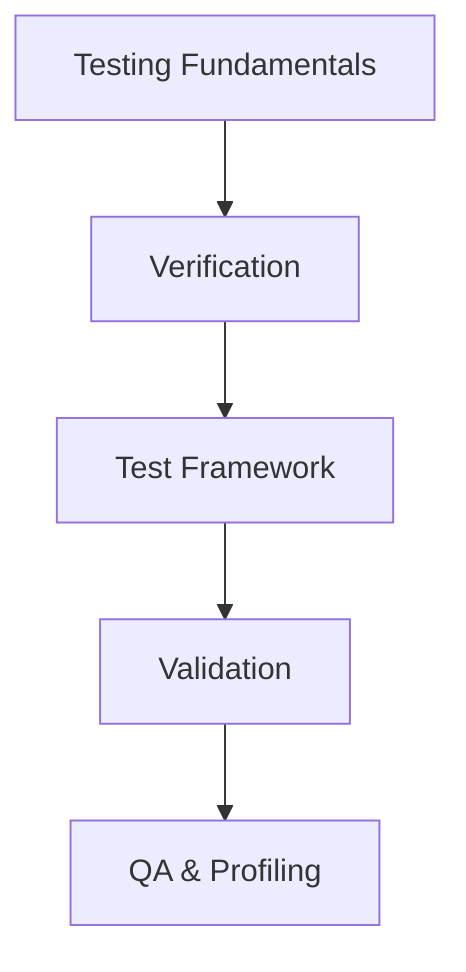

# 🗺️ Learning Navigator: Testing & Validation

> เส้นทางการเรียนรู้สำหรับ Testing และ Validation ใน OpenFOAM

---

## 📋 สารบัญ

1. [Testing Fundamentals](#1-testing-fundamentals)
2. [Verification Fundamentals](#2-verification-fundamentals)
3. [Test Framework Coding](#3-test-framework-coding)
4. [Validation Benchmarks](#4-validation-benchmarks)
5. [QA Automation Profiling](#5-qa-automation-profiling)

---

## 1. Testing Fundamentals

> **Domain:** Testing Basics

| เนื้อหา | คำอธิบาย |
|--------|----------|
| [00_Overview](CONTENT/01_TESTING_FUNDAMENTALS/00_Overview.md) | ภาพรวม Testing |

---

## 2. Verification Fundamentals

> **Domain:** Code Correctness

| เนื้อหา | คำอธิบาย |
|--------|----------|
| [00_Overview](CONTENT/02_VERIFICATION_FUNDAMENTALS/00_Overview.md) | ภาพรวม Verification |
| [01_Introduction](CONTENT/02_VERIFICATION_FUNDAMENTALS/01_Introduction.md) | Introduction |
| [02a_MMS](CONTENT/02_VERIFICATION_FUNDAMENTALS/02a_Method_of_Manufactured_Solutions_MMS.md) | Method of Manufactured Solutions |
| [02b_Richardson_GCI](CONTENT/02_VERIFICATION_FUNDAMENTALS/02b_Richardson_Extrapolation_GCI.md) | Richardson Extrapolation & GCI |
| [03_Architecture](CONTENT/02_VERIFICATION_FUNDAMENTALS/03_OpenFOAM_Architecture.md) | OpenFOAM Architecture |

---

## 3. Test Framework Coding

> **Domain:** Writing Tests

| เนื้อหา | คำอธิบาย |
|--------|----------|
| [00_Overview](CONTENT/03_TEST_FRAMEWORK_CODING/00_Overview.md) | ภาพรวม |
| [01_Unit_Testing](CONTENT/03_TEST_FRAMEWORK_CODING/01_Unit_Testing.md) | Unit Testing |
| [02_Validation](CONTENT/03_TEST_FRAMEWORK_CODING/02_Validation_Coding.md) | Validation Coding |
| [03_Automation](CONTENT/03_TEST_FRAMEWORK_CODING/03_Automation_Scripts.md) | Automation Scripts |

---

## 4. Validation Benchmarks

> **Domain:** Physical Validation

| เนื้อหา | คำอธิบาย |
|--------|----------|
| [00_Overview](CONTENT/04_VALIDATION_BENCHMARKS/00_Overview.md) | ภาพรวม |
| [01_Physical](CONTENT/04_VALIDATION_BENCHMARKS/01_Physical_Validation.md) | Physical Validation |
| [02_Mesh_BC](CONTENT/04_VALIDATION_BENCHMARKS/02_Mesh_BC_Verification.md) | Mesh & BC Verification |
| [03_Best_Practices](CONTENT/04_VALIDATION_BENCHMARKS/03_Best_Practices.md) | Best Practices |

---

## 5. QA Automation Profiling

> **Domain:** Performance & Debugging

| เนื้อหา | คำอธิบาย |
|--------|----------|
| [01_Profiling](CONTENT/05_QA_AUTOMATION_PROFILING/01_Performance_Profiling.md) | Performance Profiling |
| [02_Regression](CONTENT/05_QA_AUTOMATION_PROFILING/02_Regression_Testing.md) | Regression Testing |
| [03_Debugging](CONTENT/05_QA_AUTOMATION_PROFILING/03_Debugging_Troubleshooting.md) | Debugging |

---

## 🎯 Learning Path

---

*Last Updated: 2025-12-28*
