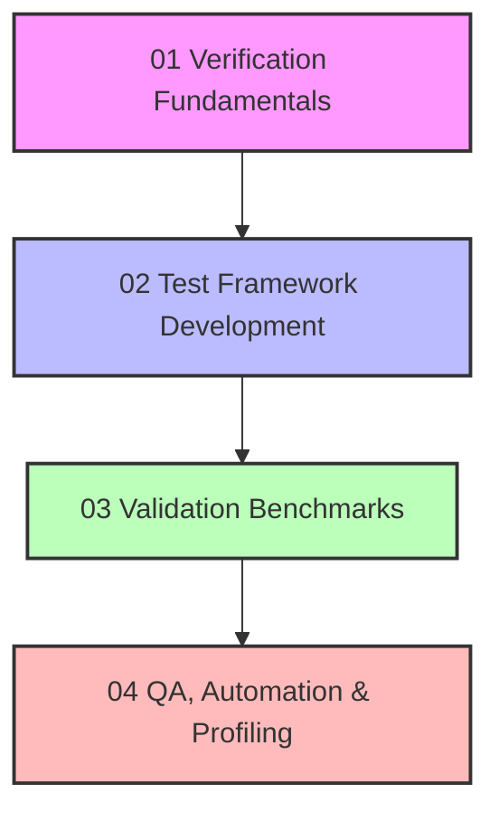

# 🧪 Module 08: การทดสอบและการตรวจสอบความถูกต้อง (Testing and Validation)

> [!TIP] "ความเชื่อถือได้คือหัวใจของ CFD"
> โมดูลนี้จะเปลี่ยนคุณจากผู้รันการจำลองทั่วไป ให้กลายเป็นวิศวกร CFD มืออาชีพที่สามารถพิสูจน์ความถูกต้องของผลลัพธ์ได้อย่างเป็นระบบ

## 🎯 ภาพรวมของโมดูล (Module Roadmap)

โครงสร้างการเรียนรู้ถูกออกแบบให้ครอบคลุมตั้งแต่พื้นฐานทางทฤษฎีไปจนถึงการปฏิบัติการจริงในระดับอุตสาหกรรม:

![[v_model_master_v_and_v.png]]
`A comprehensive V-Model diagram for CFD. The descending arm includes 'Physical Reality', 'Mathematical Model', and 'Discretized Code'. The ascending arm includes 'Numerical Results', 'Verified Code', and 'Validated Model'. Horizontal links connect 'Verification' to 'Math' and 'Validation' to 'Reality'. scientific textbook diagram, clean vector line art, white background, high definition, flat design, educational infographic --ar 16:9`

### 1. [[01_VERIFICATION_FUNDAMENTALS/00_Overview|01 Verification Fundamentals]]
- **เนื้อหา**: ปรัชญาการทดสอบ, MMS, Grid Convergence (GCI), Richardson Extrapolation
- **เป้าหมาย**: เข้าใจความถูกต้องเชิงคณิตศาสตร์ของโค้ด

### 2. [[02_TEST_FRAMEWORK_CODING/00_Overview|02 Test Framework Development]]
- **เนื้อหา**: การเขียน Unit Testing ใน C++, การสร้างระบบ Assertion, การจัดการ Numerical Tolerance
- **เป้าหมาย**: พัฒนาระบบทดสอบอัตโนมัติภายในโครงสร้าง OpenFOAM

### 3. [[03_VALIDATION_BENCHMARKS/00_Overview|03 Validation Benchmarks]]
- **เนื้อหา**: การเปรียบเทียบกับ Experimental Data, การตรวจสอบ Mesh & BC, มาตรฐาน Best Practices
- **เป้าหมาย**: ยืนยันความสอดคล้องระหว่างแบบจำลองทางคณิตศาสตร์กับฟิสิกส์จริง

### 4. [[04_QA_AUTOMATION_PROFILING/00_Overview|04 QA, Automation & Profiling]]
- **เนื้อหา**: Regression Testing, Performance Profiling, Advanced Debugging (GDB/Valgrind)
- **เป้าหมาย**: การประกันคุณภาพในระยะยาวและการเพิ่มประสิทธิภาพการคำนวณ

---

## 🚀 จุดเริ่มต้นการเรียนรู้
หากคุณเพิ่งเริ่มต้น แนะนำให้ศึกษาจาก **[[01_VERIFICATION_FUNDAMENTALS/00_Overview|บทที่ 1]]** เพื่อสร้างความเข้าใจใน "กระบวนการคิด" เบื้องหลังการตรวจสอบความถูกต้องก่อนเริ่มลงมือเขียนโค้ด