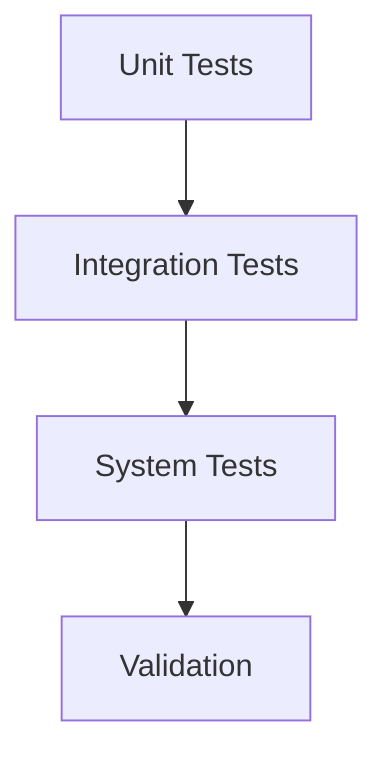

# Testing Fundamentals - Overview

ภาพรวม Testing Fundamentals

---

## Overview

> **Testing** = Verify code correctness และ physics accuracy

---

## 1. Verification vs Validation

| Concept | Question |
|---------|----------|
| **Verification** | Are we solving equations right? |
| **Validation** | Are we solving the right equations? |

---

## 2. Testing Levels



| Level | Scope |
|-------|-------|
| **Unit** | Single function |
| **Integration** | Component interaction |
| **System** | Complete solver |
| **Validation** | Physical accuracy |

---

## 3. OpenFOAM Testing

### Unit Test

```cpp
// Test vector operations
vector a(1, 0, 0);
vector b(0, 1, 0);
if (mag(a ^ b - vector(0,0,1)) > SMALL)
{
    FatalError << "Cross product failed";
}
```

### System Test

```bash
# Run standard case
cd cavity
blockMesh && icoFoam
# Check converged
```

---

## 4. Testing Workflow

1. **Write test** before/after code
2. **Run automatically** on commit
3. **Compare results** with expected
4. **Report** pass/fail

---

## 5. Module Contents

| Folder | Topic |
|--------|-------|
| 02_VERIFICATION | Code correctness |
| 03_TEST_FRAMEWORK | Coding tests |
| 04_VALIDATION | Physics accuracy |
| 05_QA_AUTOMATION | CI/profiling |

---

## Quick Reference

| Need | Use |
|------|-----|
| Test function | Unit test |
| Test solver | System test |
| Test physics | Validation |
| Auto-test | CI/CD |

---

## Concept Check

<details>
<summary><b>1. Verification vs Validation?</b></summary>

- **Verification**: Code does math right
- **Validation**: Results match reality
</details>

<details>
<summary><b>2. Unit test คืออะไร?</b></summary>

**Test single function/class** in isolation
</details>

<details>
<summary><b>3. ทำไมต้อง automate?</b></summary>

**Consistent, reproducible** testing on every change
</details>

---

## Related Documents

- **Verification:** [../02_VERIFICATION_FUNDAMENTALS/00_Overview.md](../02_VERIFICATION_FUNDAMENTALS/00_Overview.md)
- **Test Framework:** [../03_TEST_FRAMEWORK_CODING/00_Overview.md](../03_TEST_FRAMEWORK_CODING/00_Overview.md)