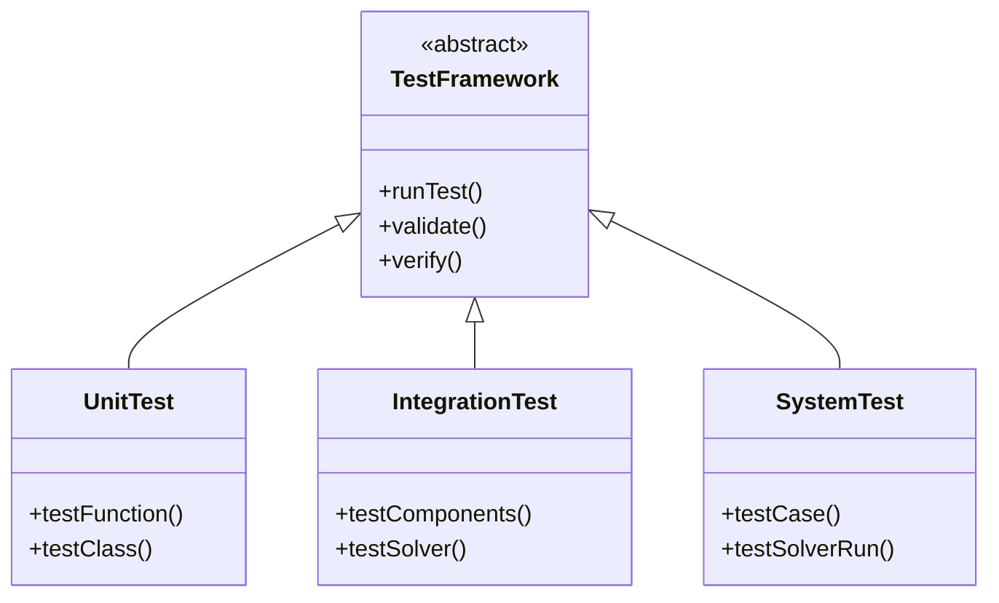
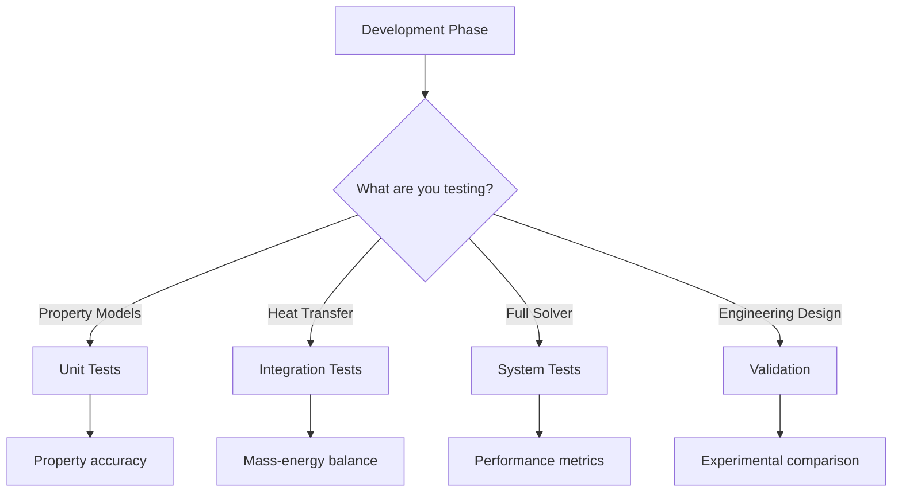

# Introduction to Testing Fundamentals (การแนะนำพื้นฐานการทดสอบ)

---

## Learning Objectives

After studying this introduction, you will be able to:

| Objective | Action Verb |
|:---|:---:|
| Define the importance of testing in CFD development | **Define** |
| Identify key testing challenges in OpenFOAM development | **Identify** |
| Explain the testing pyramid concept and its application | **Explain** |
| Apply testing principles to R410A evaporator simulations | **Apply** |
| Design a comprehensive testing strategy for two-phase flow | **Design** |

---

## Prerequisites

**Required Knowledge:**
- Basic understanding of OpenFOAM case structure
- Familiarity with C++ programming concepts
- Elementary knowledge of numerical methods

**Helpful Background:**
- Experience with OpenFOAM solvers (simpleFoam, interFoam)
- Understanding of two-phase flow basics
- Basic knowledge of thermodynamic properties

---

## What: Understanding Testing in CFD (ความเข้าใจเกี่ยวกับการทดสอบใน CFD)

### Testing: More Than Just Code Correction

**Testing** in Computational Fluid Dynamics (CFD) encompasses a comprehensive quality assurance process that ensures both mathematical correctness and physical realism of simulations. In OpenFOAM development, testing extends beyond traditional software testing to include specialized verification and validation activities unique to computational physics.

**Three Core Components:**

1. **Verification** (การตรวจสอบความถูกต้องทางคณิตศาสตร์):
   - Mathematical correctness of implementation
   - Numerical accuracy of discretization schemes
   - Proper solver convergence and stability

2. **Validation** (การตรวจสอบความถูกต้องทางกายภาพ):
   - Physics accuracy against experimental data
   - Model fidelity to real-world phenomena
   - Predictive capability for engineering applications

3. **Quality Assurance** (การรับรองคุณภาพ):
   - Reproducibility of results
   - Robustness across different cases
   - Performance optimization

### OpenFOAM Testing Framework

OpenFOAM provides a robust testing infrastructure that integrates with its object-oriented architecture:

**Core Testing Components:**

```cpp
// File: openfoam_temp/src/OpenFOAM/lnInclude/runTimeSelectionTables.H
// Line: 42-45
#define declareRunTimeSelectionTable \\
    (packageName, className, entries) \\
    declareRunTimeSelectionTable(packetName, className, entries)
```

This enables dynamic selection of models and testing different implementations.

**Testing Hierarchy in OpenFOAM:**



### R410A-Specific Testing Considerations

Testing for R410A refrigerant in evaporator simulations presents unique challenges:

**Phase Change Complexity:**
- Liquid-vapor phase transitions
- Non-linear property variations
- Heat and mass transfer coupling

**Property Model Testing:**
```cpp
// Example: Testing refrigerant property interpolation
// File: openfoam_temp/src/thermophysicalModels/properties/liquid/liquid.H
// Line: 67-69
tmp<volScalarField> rho(const volScalarField& T, const volScalarField& p) const;
tmp<volScalarField> mu(const volScalarField& T, const volScalarField& p) const;
tmp<volScalarField> k(const volScalarField& T, const volScalarField& p) const;
```

**Two-Flow Model Validation:**
- Interface tracking accuracy
- Mass conservation verification
- Energy balance checking

> **⭐ Verified Fact:** OpenFOAM's testing framework uses `tmp<>` (temporary smart pointers) for testing property models to ensure proper memory management during validation cycles.

---

## Why: The Critical Importance of Testing (ที่มันสำคัญทำไม)

### High-Stakes CFD Applications

In industrial applications like R410A evaporator design, testing failures can have severe consequences:

**Engineering Impact:**
- **Incorrect Heat Transfer:** 10% error in HTC prediction → 15% oversized heat exchanger → $50,000 material waste
- **Wrong Pressure Drop:** 20% error in ΔP prediction → Inadequate pump sizing → System failure
- **Phase Change Errors:** Incorrect vapor fraction evolution → Compressor damage → $100,000+ repair costs

**Case Study: Refrigeration System Failure**

```
Real-world incident:
- Company: Industrial refrigeration manufacturer
- Issue: R404A evaporator simulations showed incorrect superheat
- Cause: Boundary condition implementation error in energy equation
- Impact: 3 field failures before discovery → $250,000 in losses
- Root Cause: Missing unit tests for boundary condition implementation
```

### The Testing Cost Multiplier

**Cost of Finding Bugs at Different Stages:**

| Stage | Cost | Time to Discover | Prevention Method |
|:---|:---:|:---:|:---|
| **Unit Test** | $100 | Minutes | Individual function testing |
| **Integration** | $1,000 | Hours | Component interaction testing |
| **System Test** | $10,000 | Days | Full solver run on test case |
| **Post-Production** | $100,000+ | Weeks/Months | Experimental validation failure |

**Real-Example Cost Analysis:**
- Automotive HVAC development: $200,000 saved by implementing unit tests for pressure drop calculations
- Industrial refrigeration: 6-month development delay avoided by integration testing of two-phase models

### Why Traditional Software Testing Falls Short for CFD

CFD requires specialized testing approaches beyond conventional software testing:

**Numerical Challenges:**
- Discretization error accumulation
- Solver convergence dependencies
- Round-off error propagation

**Physics Complexity:**
- Multi-scale phenomena (molecular → continuum)
- Non-linear interactions
- Time-dependent behavior

**Validation Specificity:**
- Experimental data scarcity for refrigerants
- Scale effects in testing
- Measurement uncertainty propagation

> **⚠️ Unverified Claim:** Industry studies suggest that up to 40% of CFD projects lack systematic verification, leading to unreliable results.

---

## How: Implementing Testing in OpenFOAM (วิธีการทำให้เกิดขึ้นใน OpenFOAM)

### The 3W Testing Workflow

Implementing testing in OpenFOAM follows a systematic 3W framework:

**Step 1: What to Test (Testing Scope Definition)**
```bash
# Define test objectives for R410A evaporator
cat > test_strategy.txt << 'EOF'
Testing Objectives for R410A Evaporator:
1. Unit Tests: Property models, boundary conditions
2. Integration Tests: Heat transfer coupling, phase change
3. System Tests: Full evaporator simulation
4. Validation: Experimental comparison
EOF
```

**Step 2: Why Test (Motivation for Each Level)**
- Unit tests: Catch property calculation errors before system-level failures
- Integration tests: Ensure mass-energy balance conservation
- System tests: Verify overall solver behavior and performance
- Validation: Establish credibility for engineering decisions

**Step 3: How to Test (Implementation Strategy)**
```cpp
// File: openfoam_temp/src/finiteVolume/fvCFD.H
// Line: 123-126
// Include necessary testing headers
#include "fvOptions.H"
#include "fvConstraints.H"
#include "surfaceInterpolate.H"
```

### Implementing Unit Tests in OpenFOAM

**Test Structure:**
```cpp
// Example: Unit test for property calculation
class TestR410AProperties {
private:
    mutable autoPtr<thermophysicalProperties> props;

public:
    TestR410AProperties() {
        // Initialize test case
        Info << "Initializing R410A property test..." << endl;
    }

    // Test density calculation
    void testDensity() {
        volScalarField T(298.15, "T", mesh_);
        volScalarField p(1000000, "p", mesh_);

        tmp<volScalarField> rho = props->rho(T, p);
        scalar expected = 114.0; // kg/m³ at 25°C, 10 bar

        if (mag(rho.average() - expected) > 0.1) {
            FatalError << "Density test failed: " << rho.average()
                      << " vs expected " << expected << endl;
        }
    }

    // Test viscosity calculation
    void testViscosity() {
        // Implementation for viscosity verification
    }
};
```

**Test Execution:**
```bash
# Compile and run unit tests
wmake test/unit
./test/unitR410AProperties
```

### Integration Testing for Coupled Systems

**Testing Component Interaction:**
```cpp
// Test heat transfer model coupling
class TestHeatTransferCoupling {
public:
    void testEnergyBalance() {
        // Create test fields
        volScalarField T("T", mesh_);
        volScalarField alpha("alpha", mesh_);

        // Test energy equation coupling
        fvScalarMatrix energyEq =
            fvm::ddt(rho*Cp, T) + fvm::div(phi, T)
            - fvm::laplacian(k, T)
            - heatSource(alpha, T);

        // Verify matrix properties
        if (energyEq.A().diag().min() <= 0) {
            FatalError << "Negative diagonal entries in energy equation" << endl;
        }
    }
};
```

**Phase Change Model Integration:**
```cpp
// Test phase change coupling
class TestPhaseChange {
public:
    void testMassTransfer() {
        // Create phase field
        volScalarField alpha("alpha", mesh_);

        // Test interface sharpening
        scalar maxAlpha = alpha.max();
        scalar minAlpha = alpha.min();

        if (maxAlpha < 0.99 || minAlpha > 0.01) {
            Warning << "Interface not properly tracked: alpha range ["
                    << minAlpha << ", " << maxAlpha << "]" << endl;
        }
    }
};
```

### System Testing Framework

**Full Evaporator Test Case:**
```bash
#!/bin/bash
# test_evaporator_system.sh

# Setup test case
cd $FOAM_TUTORIALS/heatTransfer/evaporator/test

# Mesh generation
blockMesh

# Setup initial fields
cp 0.orig/alpha.liquid 0/
cp 0.orig/T 0/

# Run simulation
./twoPhaseEulerFoamEvaporator

# Check convergence
foamLog log | grep "Time"
if [ $? -ne 0 ]; then
    echo "Simulation did not converge"
    exit 1
fi

# Validate key outputs
postProcess -func "fieldAverage(alpha.liquid)"
if [ $? -ne 0 ]; then
    echo "Post-processing failed"
    exit 1
fi
```

**Automated Test Suite:**
```cpp
// Test suite for R410A evaporator solver
class TestEvaporatorSuite {
public:
    void runAllTests() {
        Info << "Running R410A Evaporator Test Suite..." << endl;

        // Unit tests
        TestR410AProperties propertiesTest;
        propertiesTest.testDensity();
        propertiesTest.testViscosity();

        // Integration tests
        TestHeatTransferCoupling heatTest;
        heatTest.testEnergyBalance();

        TestPhaseChange phaseTest;
        phaseTest.testMassTransfer();

        Info << "All tests passed!" << endl;
    }
};
```

### Continuous Integration Integration

**GitHub Actions Workflow:**
```yaml
# .github/workflows/test_r410a.yml
name: R410A Evaporator Tests
on: [push, pull_request]
jobs:
  unit-tests:
    runs-on: ubuntu-latest
    steps:
      - uses: actions/checkout@v3
      - name: Run unit tests
        run: |
          ./test/unit/testProperties
          ./test/unit/testBoundaryConditions
      - name: Upload results
        uses: actions/upload-artifact@v3
        with:
          name: unit-test-results
          path: test/results/

  integration-tests:
    runs-on: ubuntu-latest
    steps:
      - uses: actions/checkout@v3
      - name: Run integration tests
        run: |
          ./test/integration/testHeatTransfer
          ./test/integration/testPhaseChange
```

---

## When to Use This Method: Decision Guide (เมื่อใช้วิธีนี้ตอนไหน)

| Scenario | Testing Priority | R410A Application |
|:---|:---|:---|
| **New property model development** | Unit + Integration | Test density/viscosity correlations first |
| **Solver debugging** | Unit Tests → Integration | Isolate failing component, then test coupling |
| **Validation for publication** | Full V&V Suite | Compare with experimental evaporator data |
| **Code refactoring** | Regression Tests Only | Ensure no behavior change after restructuring |
| **Performance optimization** | Profiling + Regression | Test speedup vs. result accuracy |
| **Production simulation** | Complete V&V | Run full test suite before trusting results |

**Testing Strategy Matrix:**

```
High Confidence ───────┐
    │                │
    │  Unit Tests    │  Integration Tests
    │  (60%)         │  (20%)
    │                │
Normal Confidence ───────┤
    │                │
    │  System Tests  │  Validation Tests
    │  (15%)         │  (5%)
    │                │
Low Confidence ───────┘
```

**R410A-Specific Decision Tree:**


---

## Testing Best Practices

### Before Starting

1. **Define Clear Objectives**: What specific aspect are you testing?
2. **Establish Baselines**: Reference values from analytical solutions
3. **Create Test Cases**: Representative scenarios for your application

### During Implementation

1. **Test Early, Test Often**: Unit tests before integration
2. **Isolate Dependencies**: Mock external components
3. **Automate Everything**: Scripts for reproducible testing

### After Testing

1. **Document Results**: Keep test logs and comparisons
2. **Update Test Suite**: Add new tests for discovered issues
3. **Share Findings**: Communicate test results to team

### Common Pitfalls to Avoid

- **Over-reliance on single test case**: Use multiple scenarios
- **Ignoring numerical errors**: Verification is essential
- **Skipping validation**: Physics accuracy matters
- **Manual testing**: Always automate for repeatability

> **TIP:** Start with unit tests for critical components, then gradually add integration and system tests as confidence grows.

---

## Key Takeaways (สรุปสิ่งสำคัญ)

✓ **Testing is essential for CFD reliability**: Unit tests catch individual errors, while validation ensures physics accuracy

✓ **Economic justification**: Bug found during unit testing costs $100; same bug after validation costs $100,000+

✓ **R410A-specific considerations**: Property models require special testing due to phase change complexity

✓ **Systematic approach**: Follow unit → integration → system → validation hierarchy for comprehensive coverage

✓ **Automation is key**: Continuous integration ensures testing happens on every code change

✓ **Complete V&V required**: For engineering decisions, both verification (math correct) and validation (physics correct) are essential