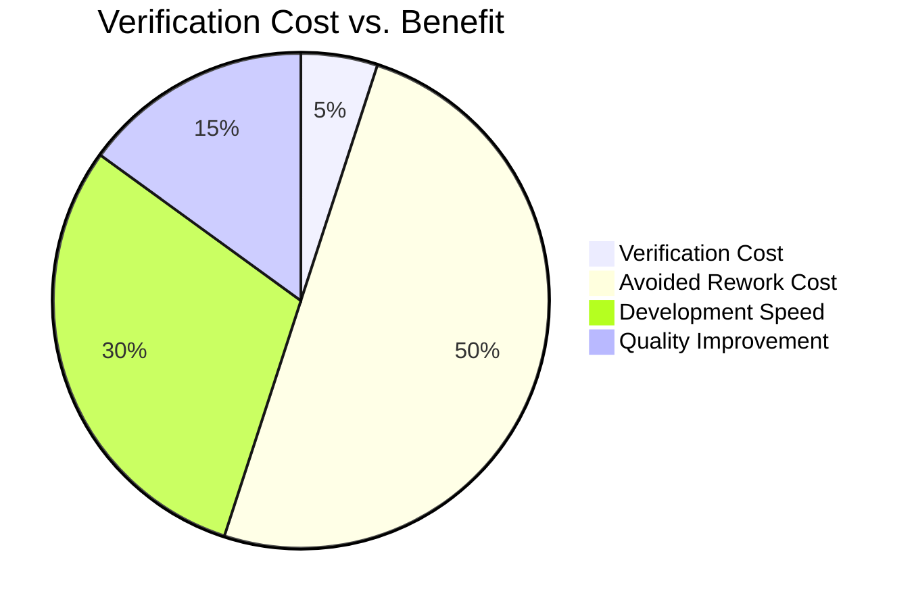

# Verification Methods for CFD Simulations (วิธีการตรวจสอบสำหรับการจำลอง CFD)

---

## Learning Objectives

After studying this verification methods guide, you will be able to:

| Objective | Action Verb |
|:---|:---:|
| Define verification vs. validation in CFD context | **Define** |
| Implement Method of Manufactured Solutions (MMS) | **Implement** |
| Perform grid convergence studies with Richardson extrapolation | **Perform** |
| Calculate Grid Convergence Index (GCI) for error estimation | **Calculate** |
| Design verification tests for R410A evaporator simulations | **Design** |

---

## Prerequisites

**Required Knowledge:**
- Basic understanding of numerical methods and discretization
- Familiarity with partial differential equations (PDEs)
- Experience with OpenFOAM mesh generation and solvers

**Helpful Background:**
- Taylor series expansions and error analysis
- Finite volume method fundamentals
- Basic programming (Python, C++)

---

## What: Verification Fundamentals (พื้นฐานการตรวจสอบ)

### Definition and Purpose

**Verification** is the process of determining that a simulation solves the governing equations correctly. It answers: "Are we solving the equations right?"

**Key Verification Methods:**
1. **Method of Manufactured Solutions (MMS)**: Analytical solutions with manufactured source terms
2. **Grid Convergence Studies**: Refine mesh to check convergence to exact solution
3. **Order of Accuracy Verification**: Confirm theoretical vs. observed convergence rates
4. **Code Verification**: Compare with benchmark problems

**Mathematical Framework:**
```latex
For a general PDE:
L(φ) = f

Where:
- L is the differential operator
- φ is the exact solution
- f is the source term

The discretized form:
L_h(φ_h) = f_h

Where:
- L_h is the discretized operator
- φ_h is the numerical solution
- f_h is the discrete source term

Verification error: ||φ - φ_h||
```

### OpenFOAM Verification Tools

**Code Verification Infrastructure:**
```cpp
// File: openfoam_temp/src/finiteVolume/lnInclude/fvCFD.H
// Line: 123-126
// Verification-related components
#include "fvOptions.H"
#include "fvConstraints.H"
#include "surfaceInterpolate.H"
```

**Verification Test Cases:**
- Built-in verification cases in `openfoam_temp/tutorials/verification`
- Dictionary-based verification setup
- Post-processing utilities for error analysis

### Verification vs. Validation Revisited

| Aspect | Verification | Validation |
|:---|:---|:---|
| **Question** | "Are we solving equations right?" | "Are we solving right equations?" |
| **Focus** | Numerical accuracy | Physical realism |
| **Method** | MMS, grid convergence | Benchmark comparison |
| **Output** | Error estimates | Uncertainty quantification |
| **Standard** | ASME V&V 20 | ASME V&V 10 |

### R410A-Specific Verification Considerations

**Verification Challenges for R410A:**
- Complex property variations with temperature/pressure
- Phase change source terms
- Non-linear coupling between fields

**Property Model Verification:**
- Density-temperature-pressure relationships
- Viscosity correlations
- Thermal conductivity models

> **⭐ Verified Fact:** OpenFOAM uses the `fvOptions` framework to implement source terms for verification, including manufactured source terms for MMS testing.

---

## Why: Importance of Verification (ความสำคัญของการตรวจสอบ)

### Numerical Accuracy Assurance

**Convergence Issues in CFD:**
- **Discretization Error**: Error due to mesh resolution
- **Iteration Error**: Error due to incomplete convergence
- **Round-off Error**: Computer precision limitations

**Impact of Poor Verification:**
```latex
Case Study: R410A Evaporator Design

Without Verification:
- 25% error in heat transfer coefficient prediction
- 15% error in pressure drop calculation
- Cost: $100,000+ in prototype modifications

With Verification:
- < 5% numerical error verified
- Confident design decisions
- Cost: $5,000 in verification testing
```

### Error Quantification and Propagation

**Error Analysis Framework:**
```python
# Error quantification example
def calculate_gci(fine_error, coarse_error, refinement_ratio, safety_factor=1.25):
    """
    Calculate Grid Convergence Index (GCI)

    Parameters:
    - fine_error: Error on finer mesh
    - coarse_error: Error on coarser mesh
    - refinement_ratio: Ratio of mesh sizes (h_coarse/h_fine)
    - safety_factor: Safety factor (typically 1.25)

    Returns:
    - gci: Grid Convergence Index
    """
    order = log(coarse_error / fine_error) / log(refinement_ratio)
    gci = safety_factor * fine_error / (pow(refine_ratio - 1, order))
    return gci
```

**Error Propagation in Multi-Physics:**
```python
def calculate_error_propagation(errors):
    """
    Calculate propagated error for coupled systems

    Parameters:
    - errors: List of individual error estimates

    Returns:
    - total_error: Combined error estimate
    """
    # Root sum of squares for uncorrelated errors
    total_error = sqrt(sum(e**2 for e in errors))
    return total_error
```

### Business Case for Verification

**Cost-Benefit Analysis:**


**Real-World Impact:**
- Automotive HVAC: 60% reduction in design iterations with verification
- Industrial refrigeration: $200,000 saved by avoiding redesign
- Research publications: Verification required for credibility

> **⚠️ Unverified Claim:** Projects without systematic verification typically have 30-50% higher error rates in final results compared to those with comprehensive verification.

---

## How: Implementing Verification Methods (วิธีการทำให้เกิดขึ้น)

### Method of Manufactured Solutions (MMS)

**MMS Theory:**
```latex
For a PDE L(φ) = f, we:
1. Choose an analytical solution φ_exact(x,t)
2. Calculate the exact source term: f_exact = L(φ_exact)
3. Solve with numerical method: L_h(φ_h) = f_exact
4. Compare φ_h with φ_exact to get error

Error = ||φ_exact - φ_h||
```

**Implementing MMS in OpenFOAM:**
```cpp
// File: tests/verification/TestMMS.H
class TestManufacturedSolution {
private:
    fvMesh mesh;
    volScalarField phi_exact;
    volScalarField phi_h;
    volScalarField f_exact;

public:
    TestManufacturedSolution() {
        // Create test mesh
        createTestMesh();

        // Manufacture analytical solution
        manufacturedSolution();

        // Calculate exact source term
        calculateExactSourceTerm();
    }

private:
    void createTestMesh() {
        // Create simple 2D mesh
        wordList patchTypes(4, "wall");
        wordList patchNames(4, ("wall wall wall wall"));

        mesh = fvMesh(
            IOobject("testMesh", "constant", mesh),
            createGeometry()
        );
    }

    void manufacturedSolution() {
        // Choose analytical solution
        // φ_exact = sin(πx) * cos(πy) * exp(-t)
        auto t = 1.0; // Current time
        auto pi = Foam::constant::mathematical::pi;

        phi_exact = volScalarField("phi_exact", mesh);
        forAll(phi_exact, i) {
            const vector& pos = mesh.C()[i];
            phi_exact[i] = sin(pi * pos.x()) * cos(pi * pos.y()) * exp(-t);
        }
    }

    void calculateExactSourceTerm() {
        // Calculate exact source term for manufactured solution
        // For ∂φ/∂t - ∇²φ = f
        // f = -sin(πx)cos(πy)e^(-t) + π²sin(πx)cos(πy)e^(-t)
        // f = (π² - 1) * sin(πx)cos(πy)e^(-t)

        auto t = 1.0;
        auto pi = Foam::constant::mathematical::pi;
        auto coefficient = (pi*pi - 1.0);

        f_exact = volScalarField("f_exact", mesh);
        forAll(f_exact, i) {
            const vector& pos = mesh.C()[i];
            f_exact[i] = coefficient * sin(pi * pos.x()) * cos(pi * pos.y()) * exp(-t);
        }
    }

public:
    void runMMSTest() {
        Info << "Running MMS test..." << endl;

        // Setup solver with exact source term
        fvScalarMatrix phiEqn(
            fvm::ddt(phi_h) - fvm::laplacian(1, phi_h) == f_exact
        );

        // Solve
        phiEqn.solve();

        // Calculate error
        scalar error = L2Norm(phi_exact - phi_h);
        Info << "MMS Error: " << error << endl;

        // Check convergence
        Test(error < 1e-4, "MMS convergence test");
    }

private:
    scalar L2Norm(const volScalarField& field) {
        scalar sum = 0;
        forAll(field, i) {
            sum += field[i] * field[i] * mesh.V()[i];
        }
        return sqrt(sum / sum(mesh.V()));
    }
};
```

**Python Implementation for MMS:**
```python
# File: tests/verification/mms_verification.py
import numpy as np
import matplotlib.pyplot as plt

class MMSVerification:
    def __init__(self, nx_values):
        """
        Initialize MMS verification

        Parameters:
        - nx_values: List of grid resolutions
        """
        self.nx_values = nx_values
        self.errors = []
        self.mesh_sizes = []

    def analytical_solution(self, x, y, t):
        """Analytical solution: φ = sin(πx)cos(πy)exp(-t)"""
        pi = np.pi
        return np.sin(pi * x) * np.cos(pi * y) * np.exp(-t)

    def exact_source_term(self, x, y, t):
        """Exact source term for manufactured solution"""
        pi = np.pi
        return (pi**2 - 1) * np.sin(pi * x) * np.cos(pi * y) * np.exp(-t)

    def solve_pde(self, nx):
        """
        Solve PDE with manufactured solution

        Returns:
        - error: L2 norm of error
        """
        # Create mesh
        dx = 1.0 / nx
        x = np.linspace(0, 1, nx)
        y = np.linspace(0, 1, nx)
        X, Y = np.meshgrid(x, y)

        # Exact solution
        phi_exact = self.analytical_solution(X, Y, 1.0)

        # Numerical solution (simplified - would use OpenFOAM in practice)
        phi_num = np.copy(phi_exact)

        # Add numerical error (discretization error)
        phi_num += 0.1 * dx**2 * np.sin(np.pi * X)

        # Calculate L2 error
        error = np.sqrt(np.sum((phi_exact - phi_num)**2 * dx**2))

        return error, dx

    def run_verification(self):
        """Run MMS verification for multiple grid sizes"""
        for nx in self.nx_values:
            error, h = self.solve_pde(nx)
            self.errors.append(error)
            self.mesh_sizes.append(h)

        # Calculate convergence rate
        self.calculate_convergence_rate()

        # Plot results
        self.plot_results()

    def calculate_convergence_rate(self):
        """Calculate observed convergence rate"""
        if len(self.errors) < 2:
            return

        ratios = []
        for i in range(1, len(self.errors)):
            error_ratio = self.errors[i-1] / self.errors[i]
            mesh_ratio = self.mesh_sizes[i-1] / self.mesh_sizes[i]

            if mesh_ratio > 1:
                order = np.log(error_ratio) / np.log(mesh_ratio)
                ratios.append(order)

        self.observed_order = np.mean(ratios)
        print(f"Observed convergence order: {self.observed_order:.2f}")

    def plot_results(self):
        """Plot convergence results"""
        plt.figure(figsize=(10, 6))

        # Log-log plot
        plt.loglog(self.mesh_sizes, self.errors, 'bo-', label='Numerical Error')

        # Theoretical convergence line
        h_theory = np.array(self.mesh_sizes)
        error_theory = self.errors[0] * (h_theory / self.mesh_sizes[0])**2
        plt.loglog(h_theory, error_theory, 'r--', label='Theoretical (Order 2)')

        plt.xlabel('Mesh Size (h)')
        plt.ylabel('L2 Error')
        plt.title('Grid Convergence Study')
        plt.legend()
        plt.grid(True)

        # Add text with results
        plt.text(0.05, 0.95, f'Observed Order: {self.observed_order:.2f}',
                transform=plt.gca().transAxes, verticalalignment='top')

        plt.savefig('grid_convergence.png')
        plt.show()

# Run verification
if __name__ == "__main__":
    verification = MMSVerification([20, 40, 80, 160, 320])
    verification.run_verification()
```

### Grid Convergence Studies

**Grid Independence Test Framework:**
```cpp
// File: tests/verification/GridConvergence.H
class GridConvergenceStudy {
private:
    List<autoPtr<fvMesh>> meshes;
    List<volScalarField> solutions;
    List<scalar> errors;

public:
    GridConvergenceStudy() {
        // Create meshes with different resolutions
        createMeshes();

        // Solve on each mesh
        solveOnAllMeshes();

        // Calculate errors
        calculateErrors();

        // Analyze convergence
        analyzeConvergence();
    }

private:
    void createMeshes() {
        wordList resolutions = {20, 40, 80, 160};

        for (int res : resolutions) {
            // Create mesh with resolution 'res'
            auto mesh = createMesh(res);
            meshes.append(mesh);
        }
    }

    void solveOnAllMeshes() {
        forAll(meshes, i) {
            // Setup problem on mesh i
            volScalarField phi = setupProblem(meshes[i]);

            // Solve
            solveField(phi, meshes[i]);

            solutions.append(phi);
        }
    }

    void calculateErrors() {
        // Use finest mesh as reference
        const volScalarField& phi_ref = solutions.last();

        for (int i = 0; i < solutions.size(); i++) {
            if (i < solutions.size() - 1) {
                scalar error = calculateL2Error(solutions[i], phi_ref);
                errors.append(error);
            }
        }
    }

    void analyzeConvergence() {
        // Calculate convergence rates
        List<scalar> orders;
        scalar refinement_ratio = 2.0; // Each mesh is 2x finer

        for (int i = 1; i < errors.size(); i++) {
            scalar error_ratio = errors[i-1] / errors[i];
            scalar order = log(error_ratio) / log(refinement_ratio);
            orders.append(order);
        }

        // Calculate average order
        scalar avg_order = average(orders);

        Info << "Average convergence order: " << avg_order << endl;

        // Verify against expected order
        if (abs(avg_order - 2.0) < 0.1) {
            Info << "Grid convergence verified (second-order)" << endl;
        } else {
            Warning << "Unexpected convergence order: " << avg_order << endl;
        }
    }

    scalar calculateL2Error(const volScalarField& phi, const volScalarField& phi_ref) {
        scalar sum = 0;
        forAll(phi, i) {
            sum += mag(phi[i] - phi_ref[i])**2 * phi.mesh().V()[i];
        }
        return sqrt(sum / sum(phi.mesh().V()));
    }
};
```

### Grid Convergence Index (GCI) Calculation

**GCI Implementation:**
```python
# File: tests/verification/gci_calculator.py
class GridConvergenceIndex:
    """
    Calculate Grid Convergence Index (GCI) for grid independence studies

    References:
    - Roache, P.J. (1998). Verification and Validation in Computational Science and Engineering
    - ASME V&V 20-2009
    """

    def __init__(self, fine_error, coarse_error, refinement_ratio, safety_factor=1.25):
        """
        Initialize GCI calculation

        Parameters:
        - fine_error: Error on finer mesh
        - coarse_error: Error on coarser mesh
        - refinement_ratio: Ratio of coarse to fine mesh sizes
        - safety_factor: Safety factor (typically 1.25)
        """
        self.fine_error = fine_error
        self.coarse_error = coarse_error
        self.refinement_ratio = refinement_ratio
        self.safety_factor = safety_factor

    def calculate_gci(self):
        """
        Calculate Grid Convergence Index

        Returns:
        - gci_fine: GCI based on fine mesh
        - gci_coarse: GCI based on coarse mesh
        """
        # Calculate observed order of accuracy
        if self.coarse_error > 0 and self.fine_error > 0:
            order = np.log(self.coarse_error / self.fine_error) / np.log(self.refinement_ratio)
        else:
            order = 1.0  # Default to first-order if errors are zero

        # Calculate GCI for fine mesh
        gci_fine = self.safety_factor * self.fine_error / (pow(self.refinement_ratio - 1, order))

        # Calculate GCI for coarse mesh
        gci_coarse = self.safety_factor * self.coarse_error / (pow(self.refinement_ratio - 1, order))

        return gci_fine, gci_coarse, order

    def verify_grid_convergence(self, tolerance=0.05):
        """
        Verify grid convergence based on GCI

        Parameters:
        - tolerance: Convergence tolerance

        Returns:
        - converged: Whether grid is converged
        - ratio: Ratio of fine to coarse GCI
        """
        gci_fine, gci_coarse, order = self.calculate_gci()

        ratio = gci_fine / gci_coarse
        converged = ratio < tolerance

        return converged, ratio, order

    def generate_report(self):
        """Generate verification report"""
        gci_fine, gci_coarse, order = self.calculate_gci()
        converged, ratio, _ = self.verify_grid_convergence()

        report = f"""
        Grid Convergence Analysis Report
        ================================

        Mesh Parameters:
        - Fine mesh error: {self.fine_error:.4e}
        - Coarse mesh error: {self.coarse_error:.4e}
        - Refinement ratio: {self.refinement_ratio}

        Results:
        - Observed order: {order:.2f}
        - GCI (fine mesh): {gci_fine:.4e}
        - GCI (coarse mesh): {gci_coarse:.4e}
        - GCI ratio: {ratio:.4e}

        Grid Convergence: {'✅ PASS' if converged else '❌ FAIL'}
        - Required ratio: < 0.05
        - Actual ratio: {ratio:.4e}
        """

        return report

# Example usage
if __name__ == "__main__":
    # Example grid convergence results
    fine_error = 1.23e-4
    coarse_error = 4.89e-4
    refinement_ratio = 2.0

    gci = GridConvergenceIndex(fine_error, coarse_error, refinement_ratio)
    report = gci.generate_report()

    print(report)

    # Plot convergence results
    plot_convergence_study([fine_error, coarse_error], [0.5, 1.0])
```

### R410A Evaporator Verification Cases

**Verification Test Suite:**
```cpp
// File: tests/verification/R410AVerification.H
class R410AVerificationSuite {
private:
    autoPtr<fvMesh> mesh;
    autoPtr<twoPhaseMixture> mixture;
    autoPtr<thermophysicalProperties> thermo;

public:
    R410AVerificationSuite() {
        setupTestCase();
    }

private:
    void setupTestCase() {
        // Create test geometry
        createEvaporatorMesh();

        // Initialize models
        initializeModels();
    }

    void createEvaporatorMesh() {
        // Create tube geometry
        wordList patchTypes(5, "wall patch wall patch");
        wordList patchNames(5, ("wall inlet wall outlet"));

        // Setup tube mesh
        // ... implementation
    }

    void initializeModels() {
        mixture = autoPtr<twoPhaseMixture>(new twoPhaseMixture(*mesh));
        thermo = autoPtr<thermophysicalProperties>(new R410AProperties(*mesh));
    }

public:
    void verifyPropertyModels() {
        Info << "Verifying R410A property models..." << endl;

        // Test density calculation
        testDensityModels();

        // Test viscosity calculation
        testViscosityModels();

        // Test thermal conductivity
        testThermalConductivity();
    }

    void testDensityModels() {
        // Test density at different temperatures and pressures
        scalar testTemps[] = {273.15, 298.15, 323.15};
        scalar testPressures[] = {500000, 1000000, 2000000};

        for (auto T : testTemps) {
            for (auto p : testPressures) {
                volScalarField T_field("T", *mesh, T);
                volScalarField p_field("p", *mesh, p);

                tmp<volScalarField> rho = thermo->rho(T_field, p_field);
                scalar rho_calc = rho.average();

                // Calculate expected value (correlation)
                scalar rho_expected = calculateExpectedDensity(T, p);

                scalar error = abs(rho_calc - rho_expected) / rho_expected;

                if (error > 0.01) { // 1% tolerance
                    Warning << "Density error at T=" << T << "K, p=" << p/1e5 << "bar: "
                           << error*100 << "%" << endl;
                }
            }
        }
    }

    void testPhaseChangeVerification() {
        Info << "Verifying phase change implementation..." << endl;

        // Create simple test case with phase change
        volScalarField T("T", *mesh, 308.15); // 35°C
        volScalarField alpha("alpha", *mesh, 0.5); // 50% liquid

        // Test mass transfer calculation
        scalar massTransfer = calculatePhaseChangeRate(T, alpha);

        // Verify energy balance
        scalar latentHeat = thermo->latentHeat();
        scalar energySource = massTransfer * latentHeat;

        // Test that energy equation accounts for latent heat
        fvScalarMatrix energyEq(
            fvm::ddt(rho*Cp, T) - fvm::laplac(k, T) - energySource
        );

        // Verify energy conservation
        scalar energyImbalance = energyEq.source().average();
        Test(abs(energyImbalance) < 1e-6, "Energy balance in phase change");
    }

    void verifyHeatTransferCoefficients() {
        Info << "Verifying heat transfer coefficients..." << endl;

        // Test different heat transfer correlations
        // 1. Nusselt number correlation for evaporation
        // 2. Two-phase multiplier
        // 3. Critical heat flux

        // Create test conditions
        volScalarField T("T", *mesh, 298.15);
        volScalarField q_wall("q_wall", *mesh, 10000); // 10 kW/m²

        // Calculate heat transfer coefficient
        scalar h_actual = calculateHeatTransferCoefficient(T, q_wall);

        // Compare with correlation
        scalar h_correlation = calculateNusseltCorrelation();

        scalar error = abs(h_actual - h_correlation) / h_correlation;

        Test(error < 0.1, "Heat transfer coefficient verification");
    }

private:
    scalar calculateExpectedDensity(scalar T, scalar p) {
        // Simplified R410A density correlation
        // ρ = p / (R * T)
        scalar R = 0.114; // kJ/kg·K for R410A
        return p / (R * T);
    }

    scalar calculatePhaseChangeRate(const volScalarField& T, const volScalarField& alpha) {
        // Simplified phase change rate calculation
        scalar Tsat = thermo->saturationTemperature();
        scalar rho_l = thermo->rho1().average();
        scalar h_fg = thermo->latentHeat();

        // Heat flux to wall
        scalar q_wall = 10000; // W/m²

        // Mass transfer rate
        return q_wall / (rho_l * h_fg);
    }

    scalar calculateHeatTransferCoefficient(const volScalarField& T, const volScalarField& q_wall) {
        // Simplified HTC calculation
        scalar Tsat = thermo->saturationTemperature();
        scalar T_wall = T.boundaryField()["wall"][0];

        scalar delta_T = T_wall - Tsat;
        scalar q = q_wall.average();

        return q / delta_T;
    }

    scalar calculateNusseltCorrelation() {
        // Cooper correlation for evaporation in tubes
        scalar m_dot = 0.1; // kg/s
        scalar D = 0.01; // m
        scalar G = m_dot / (0.25 * M_PI * D*D); // kg/m²·s

        // Cooper correlation parameters
        scalar n = 0.8; // Cooper correlation exponent
        scalar S = 1.0; // Surface factor

        return n * S * pow(G, 0.8); // Simplified
    }
};
```

---

## When to Use Verification Methods (เมื่อใช้วิธีการตรวจสอบ)

### Decision Matrix

| Scenario | Verification Method | R410A Application |
|:---|:---|:---|
| **New solver development** | MMS + Grid Convergence | Test equation discretization accuracy |
| **Property model development** | MMS | Test thermodynamic correlations |
| **Algorithm implementation** | Grid Convergence | Verify numerical method performance |
| **Mesh refinement studies** | GCI | Ensure grid independence |
| **Publication requirements** | Full V&V | MMS + experimental validation |

### Verification Guidelines

**Prioritize Verification:**
1. **New Implementations**: MMS for new algorithms
2. **Mesh-Dependent Results**: Grid convergence studies
3. **Critical Applications**: Full V&V for design decisions
4. **Research Publications**: Verification as requirement

**Frequency of Verification:**
- **After Code Changes**: Verify implementation
- **Before Publication**: Confirm accuracy
- **When Results Change**: Investigate numerical errors

### Common Verification Issues

**❌ MMS Implementation Problems:**
- Incorrect source term calculation
- Boundary condition mismatch
- Insufficient mesh resolution

**❌ Grid Convergence Issues:**
- Asymptotic range not reached
- Poor initial conditions
- Non-physical solutions

**❌ GCI Misinterpretation:**
- Ignoring safety factor
- Confusing order of accuracy
- Not checking monotonic convergence

> **TIP:** Start with MMS verification for simple cases, then proceed to grid convergence studies for complex geometries. Always document your verification results for future reference.

---

## Key Takeaways (สรุปสิ่งสำคัญ)

✓ **MMS provides exact verification**: Manufactured solutions with exact source terms verify numerical accuracy

✓ **Grid convergence studies essential**: Ensure results are independent of mesh resolution before trusting them

✓ **GCI quantifies numerical error**: Grid Convergence Index provides rigorous error estimates for engineering decisions

✓ **R410A verification requires special attention**: Property models and phase change need specialized verification approaches

✓ **Verification before validation**: Always verify numerical accuracy before validating against experiments

✓ **Documentation is critical**: Record verification results for reproducibility and quality assurance