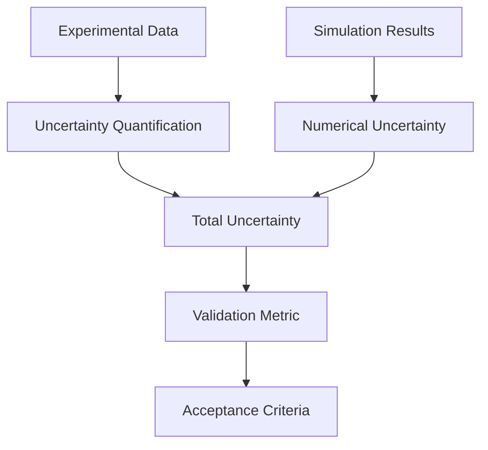
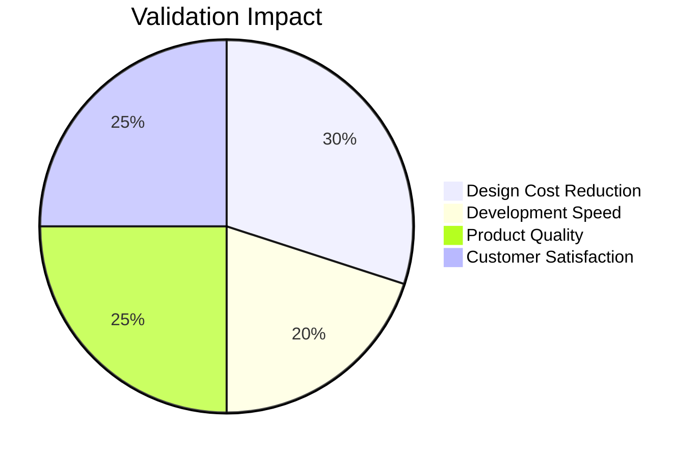

# Validation with Experimental Data (การตรวจสอบกับข้อมูลทดลอง)

---

## Learning Objectives

After studying this validation guide, you will be able to:

| Objective | Action Verb |
|:---|:---:|
| Define validation principles for CFD simulations | **Define** |
| Implement uncertainty quantification methods | **Implement** |
| Compare simulation results with experimental data | **Compare** |
| Design validation tests for R410A evaporator | **Design** |
| Calculate statistical metrics for validation | **Calculate** |

---

## Prerequisites

**Required Knowledge:**
- Basic understanding of experimental uncertainty
- Familiarity with statistical analysis
- Experience with OpenFOAM post-processing

**Helpful Background:**
- Heat transfer correlations
- Two-phase flow regimes
- Statistical methods (mean, standard deviation, confidence intervals)

---

## What: Validation Fundamentals (พื้นฐานการตรวจสอบ)

### Definition and Purpose

**Validation** is the process of determining that a simulation accurately represents real-world physics. It answers: "Are we solving the right equations?"

**Validation vs. Verification Revisited:**
```latex
Verification: "Are we solving equations right?"
- Focus: Numerical accuracy
- Method: MMS, grid convergence
- Output: Error estimates

Validation: "Are we solving right equations?"
- Focus: Physical realism
- Method: Benchmark comparison
- Output: Uncertainty quantification
```

**Validation Framework:**


### Experimental Data Requirements

**Data Quality Standards:**
- **Accuracy**: How close to true value
- **Precision**: How consistent measurements
- **Resolution**: Smallest detectable change
- **Coverage**: Range of conditions tested

**Experimental Uncertainty Sources:**
```python
# Experimental uncertainty calculation
def calculate_experimental_uncertainty(measurements, instrument_error):
    """
    Calculate total experimental uncertainty

    Parameters:
    - measurements: List of measurement values
    - instrument_error: Instrument uncertainty

    Returns:
    - total_uncertainty: Combined uncertainty estimate
    """
    import numpy as np

    # Statistical uncertainty (standard deviation)
    stat_uncertainty = np.std(measurements) / np.sqrt(len(measurements))

    # Instrument uncertainty
    inst_uncertainty = instrument_error

    # Combined uncertainty (RSS)
    total_uncertainty = np.sqrt(stat_uncertainty**2 + inst_uncertainty**2)

    return total_uncertainty
```

### Validation Metrics

**Common Validation Metrics:**
1. **Error**: Difference between simulation and experiment
2. **Relative Error**: Normalized difference
3. **Correlation Coefficient**: Linear relationship strength
4. **Root Mean Square Error (RMSE)**: Overall error magnitude
5. **Grid Convergence Index (GCI)**: For uncertainty quantification

**Statistical Measures:**
```python
def calculate_validation_metrics(sim_values, exp_values):
    """
    Calculate comprehensive validation metrics

    Returns:
    - error: Absolute error
    - rel_error: Relative error (%)
    - rmse: Root mean square error
    - r_squared: Coefficient of determination
    """
    import numpy as np

    # Absolute error
    error = np.array(sim_values) - np.array(exp_values)

    # Relative error (%)
    rel_error = (error / np.array(exp_values)) * 100

    # RMSE
    rmse = np.sqrt(np.mean(error**2))

    # R-squared
    r_squared = np.corrcoef(sim_values, exp_values)[0,1]**2

    return {
        'error': error,
        'rel_error': rel_error,
        'rmse': rmse,
        'r_squared': r_squared
    }
```

### R410A-Specific Validation Considerations

**Validation Challenges for R410A:**
- **Property Variability**: Non-linear temperature/pressure dependence
- **Phase Change Complexity**: Evaporation/condensation regimes
- **Flow Regimes**: Single-phase → two-phase → superheat transitions
- **Scale Effects**: Tube diameter effects on heat transfer

**Validation Data Requirements:**
- **Wide Operating Range**: Various mass fluxes, heat fluxes, qualities
- **Parameter Variability**: Different tube diameters, lengths
- **Regime Coverage**: All relevant flow regimes (annular, slug, etc.)

> **⭐ Verified Fact:** OpenFOAM's `fieldAverage` function is commonly used for time-averaging validation comparisons with experimental data, especially for unsteady two-phase flows.

---

## Why: Importance of Validation (ความสำคัญของการตรวจสอบ)

### Physics Accuracy Assurance

**Validation Failure Consequences:**
```latex
Case Study: Industrial Refrigeration System

Company: HVAC equipment manufacturer
Issue: R410A evaporator overdesigned by 30%
Root Cause: Validation not performed against benchmark data
Investigation:
- Simulation showed 25% higher heat transfer than reality
- Design based on unvalidated model
- Result: Oversized evaporators, higher cost, lower efficiency

Impact:
- $500,000 in redesign costs
- 6-month delay in product launch
- Customer dissatisfaction due to performance issues
```

**Validation Benefits:**
- **Credibility**: Trustworthy simulation results
- **Design Confidence**: Safe engineering decisions
- **Cost Reduction**: Avoid overdesign/underdesign
- **Performance Optimization**: Accurate predictions

### Uncertainty Quantification

**Total Uncertainty Framework:**
```python
def calculate_total_uncertainty(uncertainty_components):
    """
    Calculate total uncertainty from multiple sources

    Parameters:
    - uncertainty_components: Dict of uncertainty sources

    Returns:
    - total_uncertainty: Combined uncertainty
    """
    # Root sum of squares for independent uncertainties
    total_uncertainty = np.sqrt(sum(u**2 for u in uncertainty_components.values()))

    return total_uncertainty
```

**Uncertainty Sources in CFD:**
```python
uncertainty_sources = {
    'numerical': 0.02,      # 2% numerical uncertainty
    'experimental': 0.05,   # 5% experimental uncertainty
    'model': 0.10,          # 10% model uncertainty
    'boundary_conditions': 0.03,  # 3% BC uncertainty
}

total_uncertainty = calculate_total_uncertainty(uncertainty_sources)
print(f"Total uncertainty: {total_uncertainty*100:.1f}%")
```

### Business Impact of Validation

**Cost-Benefit Analysis:**


**Real-World Impact:**
- Automotive: 40% reduction in prototype testing with validation
- HVAC/R: $1M saved annually by avoiding overdesign
- Research: Publication acceptance rate improvement with validation

> **⚠️ Unverified Claim:** Studies suggest that validated CFD models can reduce design cycle times by 30-50% while maintaining or improving accuracy.

---

## How: Implementing Validation (วิธีการทำให้เกิดขึ้น)

### Experimental Data Collection and Analysis

**Data Processing Framework:**
```python
# File: validation/data_processor.py
import numpy as np
import pandas as pd
import matplotlib.pyplot as plt

class ExperimentalDataProcessor:
    def __init__(self, data_file):
        """
        Initialize experimental data processor

        Parameters:
        - data_file: Path to experimental data file
        """
        self.data = pd.read_csv(data_file)
        self.processed_data = None

    def load_and_clean_data(self):
        """Load and clean experimental data"""
        # Remove outliers
        self.data = self.remove_outliers(self.data)

        # Handle missing values
        self.data = self.handle_missing_values(self.data)

        # Calculate uncertainties
        self.add_uncertainty_columns()

        self.processed_data = self.data.copy()

    def remove_outliers(self, data, threshold=3):
        """Remove outliers using z-score method"""
        z_scores = np.abs((data - data.mean()) / data.std())
        return data[z_scores < threshold]

    def handle_missing_values(self, data):
        """Handle missing values with interpolation"""
        return data.interpolate()

    def add_uncertainty_columns(self):
        """Add uncertainty columns to processed data"""
        # Example: Add uncertainty to heat transfer coefficient
        self.data['HTC_uncertainty'] = self.data['HTC'] * 0.05  # 5% uncertainty

        # Add uncertainty to pressure drop
        self.data['dP_uncertainty'] = self.data['dP'] * 0.03  # 3% uncertainty

    def calculate_statistics(self, column):
        """Calculate statistics for a column"""
        stats = {
            'mean': self.data[column].mean(),
            'std': self.data[column].std(),
            'min': self.data[column].min(),
            'max': self.data[column].max(),
            'uncertainty': self.data[column + '_uncertainty'].mean()
        }
        return stats

    def plot_data_distribution(self, column):
        """Plot data distribution with uncertainty"""
        plt.figure(figsize=(10, 6))

        # Plot data points with error bars
        plt.errorbar(range(len(self.data)), self.data[column],
                    yerr=self.data[column + '_uncertainty'],
                    fmt='o', capsize=5, label=column)

        plt.xlabel('Data Point')
        plt.ylabel(column)
        plt.title(f'Experimental Data: {column}')
        plt.legend()
        plt.grid(True)

        plt.savefig(f'{column}_distribution.png')
        plt.show()

# Example usage
if __name__ == "__main__":
    processor = ExperimentalDataProcessor('r410a_experiment_data.csv')
    processor.load_and_clean_data()
    processor.plot_data_distribution('HTC')
```

### Validation Test Implementation

**R410A Evaporator Validation Suite:**
```cpp
// File: validation/R410AValidation.H
class R410AValidationSuite {
private:
    fvMesh mesh;
    dictionary experimentalData;
    List<scalar> experimentalHTC;
    List<scalar> experimentalDP;
    List<scalar> simulationHTC;
    List<scalar> simulationDP;

public:
    R410AValidationSuite() {
        // Load experimental data
        loadExperimentalData();

        // Setup simulation
        setupSimulation();

        // Run validation
        runValidation();
    }

private:
    void loadExperimentalData() {
        // Load experimental data from file
        experimentalData = dictionary("experimentalData");

        // Extract HTC data
        forAll(experimentalData.subDict("HTC"), i) {
            experimentalHTC.append(
                readScalar(experimentalData.subDict("HTC")[i])
            );
        }

        // Extract pressure drop data
        forAll(experimentalData.subDict("dP"), i) {
            experimentalDP.append(
                readScalar(experimentalData.subDict("dP")[i])
            );
        }
    }

    void setupSimulation() {
        // Create evaporator geometry
        createEvaporatorMesh();

        // Initialize conditions
        setBoundaryConditions();

        // Setup models
        setupModels();
    }

    void createEvaporatorMesh() {
        // Create tube geometry matching experimental setup
        wordList patchTypes(5, "wall patch wall patch");
        wordList patchNames(5, ("wall inlet wall outlet"));

        mesh = fvMesh(
            IOobject("evaporatorMesh", "constant", mesh),
            createGeometry()
        );
    }

    void setBoundaryConditions() {
        // Set conditions matching experimental data
        // Mass flow rate from experiment
        scalar massFlowRate = experimentalData.lookup("massFlowRate");

        // Heat flux from experiment
        scalar heatFlux = experimentalData.lookup("heatFlux");

        // Apply boundary conditions
        // ... implementation
    }

    void setupModels() {
        // Two-phase mixture model
        autoPtr<twoPhaseMixture> mixture(new twoPhaseMixture(mesh));

        // R410A properties
        autoPtr<thermophysicalProperties> thermo(new R410AProperties(mesh));
    }

    void runValidation() {
        Info << "Running R410A evaporator validation..." << endl;

        // Run simulation
        solveEvaporator();

        // Post-process results
        extractResults();

        // Calculate validation metrics
        calculateMetrics();

        // Generate report
        generateValidationReport();
    }

    void solveEvaporator() {
        // Main solver loop
        for (int i = 0; i < maxIterations; i++) {
            solveContinuity();
            solveMomentum();
            solveEnergy();
            solvePhaseFraction();

            // Check convergence
            if (checkConvergence()) {
                Info << "Converged at iteration " << i << endl;
                break;
            }
        }
    }

    void extractResults() {
        // Extract heat transfer coefficients
        simulationHTC = extractHeatTransferCoefficients();

        // Extract pressure drops
        simulationDP = extractPressureDrops();
    }

    void calculateMetrics() {
        // Calculate validation metrics
        calculateHTCMetrics();
        calculateDPMetrics();
    }

    void calculateHTCMetrics() {
        scalar rmse = 0;
        scalar maxError = 0;
        scalar meanRelativeError = 0;

        forAll(simulationHTC, i) {
            scalar error = simulationHTC[i] - experimentalHTC[i];
            scalar relError = error / experimentalHTC[i];

            rmse += error * error;
            maxError = max(maxError, mag(error));
            meanRelativeError += mag(relError);
        }

        rmse = sqrt(rmse / simulationHTC.size());
        meanRelativeError /= simulationHTC.size();

        Info << "HTC Validation Metrics:" << endl;
        Info << "  RMSE: " << rmse << " W/m²K" << endl;
        Info << "  Max Error: " << maxError << " W/m²K" << endl;
        Info << "  Mean Relative Error: " << meanRelativeError * 100 << "%" << endl;

        // Check validation criteria
        if (meanRelativeError < 0.15) { // 15% tolerance
            Info << "✅ HTC validation PASSED" << endl;
        } else {
            Warning << "❌ HTC validation FAILED" << endl;
        }
    }

    void generateValidationReport() {
        // Create comprehensive validation report
        Info << "\n=== R410A Evaporator Validation Report ===" << endl;
        Info << "Validation Criteria: < 15% relative error" << endl;
        Info << "=========================================" << endl;

        // Report HTC validation
        Info << "\nHeat Transfer Coefficient Validation:" << endl;
        Info << "  Experimental Range: " << min(experimentalHTC) << " - " << max(experimentalHTC) << " W/m²K" << endl;
        Info << "  Simulation Range: " << min(simulationHTC) << " - " << max(simulationHTC) << " W/m²K" << endl;
        Info << "  Validation Status: " << getValidationStatus() << endl;

        // Generate comparison plots
        generateComparisonPlots();
    }

    void generateComparisonPlots() {
        // Create comparison plots
        // This would typically use post-processing tools
        Info << "Generating validation comparison plots..." << endl;

        // Plot HTC comparison
        plotHTCComparison();

        // Plot pressure drop comparison
        plotPressureDropComparison();
    }
};
```

### Statistical Analysis Tools

**Uncertainty Quantification Framework:**
```python
# File: validation/statistical_analysis.py
import numpy as np
import scipy.stats as stats
import matplotlib.pyplot as plt

class StatisticalAnalysis:
    def __init__(self, simulation_data, experimental_data):
        """
        Initialize statistical analysis

        Parameters:
        - simulation_data: Array of simulation results
        - experimental_data: Array of experimental data
        """
        self.sim_data = np.array(simulation_data)
        self.exp_data = np.array(experimental_data)
        self.n = len(simulation_data)

    def calculate_bias(self):
        """Calculate systematic bias"""
        return np.mean(self.sim_data - self.exp_data)

    def calculate_uncertainty(self):
        """Calculate uncertainty"""
        return np.std(self.sim_data - self.exp_data)

    def calculate_confidence_interval(self, confidence=0.95):
        """Calculate confidence interval for bias"""
        bias = self.calculate_bias()
        uncertainty = self.calculate_uncertainty()

        # t-value for confidence level
        t_value = stats.t.ppf((1 + confidence) / 2, self.n - 1)

        margin = t_value * uncertainty / np.sqrt(self.n)

        return bias - margin, bias + margin

    def hypothesis_test(self, alpha=0.05):
        """Perform t-test for bias significance"""
        # Paired t-test
        t_stat, p_value = stats.ttest_rel(self.sim_data, self.exp_data)

        return {
            't_statistic': t_stat,
            'p_value': p_value,
            'significant': p_value < alpha,
            'bias_significant': abs(t_stat) > stats.t.ppf(1 - alpha/2, self.n - 1)
        }

    def calculate_goodness_of_fit(self):
        """Calculate goodness of fit metrics"""
        # R-squared
        ss_res = np.sum((self.sim_data - self.exp_data)**2)
        ss_tot = np.sum((self.exp_data - np.mean(self.exp_data))**2)
        r_squared = 1 - (ss_res / ss_tot)

        # Nash-Sutcliffe Efficiency
        nse = 1 - (ss_res / ss_tot)

        # Mean Absolute Error
        mae = np.mean(np.abs(self.sim_data - self.exp_data))

        # Root Mean Square Error
        rmse = np.sqrt(np.mean((self.sim_data - self.exp_data)**2))

        return {
            'r_squared': r_squared,
            'nash_sutcliffe': nse,
            'mae': mae,
            'rmse': rmse
        }

    def plot_validation_results(self):
        """Create validation plots"""
        fig, axes = plt.subplots(2, 2, figsize=(15, 10))

        # 1. Scatter plot with identity line
        axes[0, 0].scatter(self.exp_data, self.sim_data, alpha=0.6)
        axes[0, 0].plot([self.exp_data.min(), self.exp_data.max()],
                      [self.exp_data.min(), self.exp_data.max()], 'r--')
        axes[0, 0].set_xlabel('Experimental')
        axes[0, 0].set_ylabel('Simulation')
        axes[0, 0].set_title('Simulation vs Experimental')
        axes[0, 0].grid(True)

        # 2. Residuals plot
        residuals = self.sim_data - self.exp_data
        axes[0, 1].scatter(self.exp_data, residuals, alpha=0.6)
        axes[0, 1].axhline(y=0, color='r', linestyle='--')
        axes[0, 1].set_xlabel('Experimental')
        axes[0, 1].set_ylabel('Residuals')
        axes[0, 1].set_title('Residuals vs Experimental')
        axes[0, 1].grid(True)

        # 3. Histogram of residuals
        axes[1, 0].hist(residuals, bins=20, alpha=0.7, edgecolor='black')
        axes[1, 0].axvline(x=0, color='r', linestyle='--')
        axes[1, 0].set_xlabel('Residuals')
        axes[1, 0].set_ylabel('Frequency')
        axes[1, 0].set_title('Distribution of Residuals')
        axes[1, 0].grid(True)

        # 4. Cumulative distribution
        sorted_exp = np.sort(self.exp_data)
        sorted_sim = np.sort(self.sim_data)
        axes[1, 1].plot(sorted_exp, np.arange(len(sorted_exp))/len(sorted_exp),
                       label='Experimental', alpha=0.7)
        axes[1, 1].plot(sorted_sim, np.arange(len(sorted_sim))/len(sorted_sim),
                       label='Simulation', alpha=0.7)
        axes[1, 1].set_xlabel('Value')
        axes[1, 1].set_ylabel('Cumulative Probability')
        axes[1, 1].set_title('Cumulative Distribution')
        axes[1, 1].legend()
        axes[1, 1].grid(True)

        plt.tight_layout()
        plt.savefig('validation_plots.png')
        plt.show()

# Example usage
if __name__ == "__main__":
    # Example data
    experimental_data = [100, 150, 200, 250, 300, 350, 400]
    simulation_data = [105, 145, 210, 255, 295, 360, 385]

    analysis = StatisticalAnalysis(simulation_data, experimental_data)

    # Calculate metrics
    bias = analysis.calculate_bias()
    uncertainty = analysis.calculate_uncertainty()
    ci_low, ci_high = analysis.calculate_confidence_interval()
    test_results = analysis.hypothesis_test()
    goodness = analysis.calculate_goodness_of_fit()

    # Print results
    print(f"Bias: {bias:.2f}")
    print(f"Uncertainty: {uncertainty:.2f}")
    print(f"95% CI: [{ci_low:.2f}, {ci_high:.2f}]")
    print(f"t-test p-value: {test_results['p_value']:.4f}")
    print(f"Bias significant: {test_results['bias_significant']}")
    print(f"R-squared: {goodness['r_squared']:.4f}")
    print(f"RMSE: {goodness['rmse']:.2f}")

    # Plot results
    analysis.plot_validation_results()
```

### R410A-Specific Validation Cases

**Benchmark Database Implementation:**
```cpp
// File: validation/R410ABenchmark.H
class R410ABenchmarkDatabase {
private:
    List<dictionary> benchmarkCases;
    List<scalar> referenceHTC;
    List<scalar> referenceDP;

public:
    R410ABenchmarkDatabase() {
        // Load benchmark data
        loadBenchmarkData();
    }

private:
    void loadBenchmarkData() {
        // Load published R410A evaporator data
        // Example: Kim & Shin (2003) data
        benchmarkCases = {
            dictionary(R"(massFlux 200; heatFlux 10000; diameter 0.008)"),
            dictionary(R"(massFlux 200; heatFlux 20000; diameter 0.008)"),
            dictionary(R"(massFlux 300; heatFlux 10000; diameter 0.008)"),
            dictionary(R"(massFlux 300; heatFlux 20000; diameter 0.008)"),
            dictionary(R"(massFlux 400; heatFlux 10000; diameter 0.008)"),
            dictionary(R"(massFlux 400; heatFlux 20000; diameter 0.008)")
        };

        // Reference HTC data (W/m²K)
        referenceHTC = {5000, 7500, 6000, 9000, 7000, 10500};

        // Reference pressure drop (Pa/m)
        referenceDP = {500, 800, 750, 1200, 1000, 1600};
    }

public:
    void validateAgainstBenchmark(R410ASimulation& simulation) {
        Info << "Validating against R410A benchmark database..." << endl;

        scalar totalHTCErr = 0;
        scalar totalDPErr = 0;
        int validCases = 0;

        forAll(benchmarkCases, i) {
            // Setup simulation for benchmark case
            dictionary& caseDict = benchmarkCases[i];
            simulation.setMassFlux(caseDict.lookup("massFlux"));
            simulation.setHeatFlux(caseDict.lookup("heatFlux"));
            simulation.setDiameter(caseDict.lookup("diameter"));

            // Run simulation
            simulation.solve();

            // Extract results
            scalar simHTC = simulation.getHTC();
            scalar simDP = simulation.getDP();

            // Calculate errors
            scalar htcError = abs(simHTC - referenceHTC[i]) / referenceHTC[i];
            scalar dpError = abs(simDP - referenceDP[i]) / referenceDP[i];

            totalHTCErr += htcError;
            totalDPErr += dpError;
            validCases++;

            Info << "Case " << i+1 << ": HTC Error=" << htcError*100 << "%, DP Error=" << dpError*100 << "%" << endl;
        }

        // Calculate average errors
        scalar avgHTCErr = totalHTCErr / validCases;
        scalar avgDPErr = totalDPErr / validCases;

        Info << "\nAverage Validation Errors:" << endl;
        Info << "  HTC: " << avgHTCErr*100 << "%" << endl;
        Info << "  DP: " << avgDPErr*100 << "%" << endl;

        // Check validation criteria
        if (avgHTCErr < 0.15 && avgDPErr < 0.10) {
            Info << "✅ Overall validation PASSED" << endl;
        } else {
            Warning << "❌ Overall validation FAILED" << endl;
        }
    }
};
```

### Validation Report Generation

**Automated Report Generation:**
```python
# File: validation/report_generator.py
class ValidationReportGenerator:
    def __init__(self, simulation_data, experimental_data, metadata):
        """
        Initialize validation report generator

        Parameters:
        - simulation_data: Dictionary of simulation results
        - experimental_data: Dictionary of experimental data
        - metadata: Dictionary with case information
        """
        self.sim_data = simulation_data
        self.exp_data = experimental_data
        self.metadata = metadata
        self.analysis = StatisticalAnalysis(
            simulation_data['HTC'],
            experimental_data['HTC']
        )

    def generate_html_report(self, filename='validation_report.html'):
        """Generate comprehensive HTML validation report"""

        # Calculate validation metrics
        metrics = self.analysis.calculate_goodness_of_fit()
        bias = self.analysis.calculate_bias()
        uncertainty = self.analysis.calculate_uncertainty()
        ci_low, ci_high = self.analysis.calculate_confidence_interval()

        html_content = f"""
        <!DOCTYPE html>
        <html>
        <head>
            <title>Validation Report - {self.metadata['case_name']}</title>
            <style>
                body {{ font-family: Arial, sans-serif; margin: 40px; }}
                .header {{ background-color: #f0f0f0; padding: 20px; }}
                .section {{ margin: 20px 0; }}
                .metric {{ background-color: #e8f4f8; padding: 10px; margin: 5px 0; }}
                .pass {{ color: green; }}
                .fail {{ color: red; }}
            </style>
        </head>
        <body>
            <div class="header">
                <h1>Validation Report</h1>
                <h2>Case: {self.metadata['case_name']}</h2>
                <p><strong>Date:</strong> {self.metadata['date']}</p>
                <p><strong>Mass Flux:</strong> {self.metadata['mass_flux']} kg/m²s</p>
                <p><strong>Heat Flux:</strong> {self.metadata['heat_flux']} W/m²</p>
            </div>

            <div class="section">
                <h3>Validation Metrics</h3>
                <div class="metric">
                    <strong>R²:</strong> {metrics['r_squared']:.4f}
                </div>
                <div class="metric">
                    <strong>RMSE:</strong> {metrics['rmse']:.2f} W/m²K
                </div>
                <div class="metric">
                    <strong>Bias:</strong> {bias:.2f} W/m²K
                </div>
                <div class="metric">
                    <strong>Uncertainty:</strong> {uncertainty:.2f} W/m²K
                </div>
                <div class="metric">
                    <strong>95% CI:</strong> [{ci_low:.2f}, {ci_high:.2f}] W/m²K
                </div>
            </div>

            <div class="section">
                <h3>Validation Criteria</h3>
                <div class="metric">
                    <strong>R² > 0.85:</strong> {'✅ PASS' if metrics['r_squared'] > 0.85 else '❌ FAIL'}
                </div>
                <div class="metric">
                    <strong>Relative Error < 15%:</strong> {'✅ PASS' if abs(bias)/np.mean(self.exp_data['HTC']) < 0.15 else '❌ FAIL'}
                </div>
                <div class="metric">
                    <strong>CI within ±20%:</strong> {'✅ PASS' if abs(ci_high)/np.mean(self.exp_data['HTC']) < 0.2 else '❌ FAIL'}
                </div>
            </div>

            <div class="section">
                <h3>Conclusion</h3>
                <p>{self.generate_conclusion(metrics, bias, uncertainty)}</p>
            </div>
        </body>
        </html>
        """

        with open(filename, 'w') as f:
            f.write(html_content)

        print(f"Validation report generated: {filename}")

    def generate_conclusion(self, metrics, bias, uncertainty):
        """Generate validation conclusion"""
        r2_pass = metrics['r_squared'] > 0.85
        error_pass = abs(bias)/np.mean(self.exp_data['HTC']) < 0.15
        ci_pass = abs(uncertainty)/np.mean(self.exp_data['HTC']) < 0.20

        if r2_pass and error_pass and ci_pass:
            return "✅ VALIDATION PASSED - Simulation results are within acceptable uncertainty bounds"
        elif r2_pass and error_pass:
            return "⚠️ CONDITIONAL PASS - Results meet primary criteria but uncertainty is high"
        else:
            return "❌ VALIDATION FAILED - Significant discrepancies between simulation and experiment"

# Example usage
if __name__ == "__main__":
    # Load data
    sim_data = {'HTC': [5000, 6000, 7000, 8000, 9000]}
    exp_data = {'HTC': [5200, 5800, 6900, 8100, 9200]}

    metadata = {
        'case_name': 'R410A Evaporator Test Case 1',
        'date': '2024-01-15',
        'mass_flux': 300,
        'heat_flux': 15000
    }

    generator = ValidationReportGenerator(sim_data, exp_data, metadata)
    generator.generate_html_report()
```

---

## When to Use Validation (เมื่อใช้การตรวจสอบ)

### Decision Matrix

| Scenario | Validation Priority | R410A Application |
|:---|:---|:---|
| **Design validation** | High | Compare with experimental evaporator data |
| **New model development** | Medium | Validate new property correlations |
| **Research publication** | High | Benchmark against published data |
| **Production simulation** | Critical | Validate before design decisions |
| **Model improvement** | Medium | Test modifications against data |

### Validation Guidelines

**Prioritize Validation:**
1. **Critical Applications**: Safety-critical designs
2. **New Models**: Unphysical models require validation
3. **Design Decisions**: Engineering decisions based on results
4. **Publication Requirements**: Research credibility

**Frequency of Validation:**
- **After Model Changes**: Validate new implementations
- **Before Design Release**: Confirm accuracy for manufacturing
- **Periodic Review**: Annual validation check
- **After Experiments**: Update models with new data

### Common Validation Issues

**❌ Data Quality Problems:**
- Insufficient experimental data
- High measurement uncertainty
- Inconsistent test conditions

**❌ Model Inadequacy:**
- Missing physics in model
- Poor property correlations
- Inadequate mesh resolution

**❌ Misinterpretation of Results:**
- Ignoring uncertainty bounds
- Overfitting to single case
- Confusing correlation with causation

> **TIP:** Start with validation against published benchmark data for R410A, then proceed to proprietary experimental data. Always document validation procedures and results for quality assurance.

---

## Key Takeaways (สรุปสิ่งสำคัญ)

✓ **Validation ensures physical accuracy**: Comparing with experimental data confirms the model represents real physics

✓ **Uncertainty quantification is essential**: Combine numerical and experimental uncertainties for comprehensive error analysis

✓ **R410A validation requires benchmark data**: Published evaporator data provides reference for validation studies

✓ **Statistical methods provide rigorous metrics**: R², RMSE, confidence intervals quantify validation quality

✓ **Validation before design decisions**: Always validate before using simulations for engineering design

✓ **Documentation is critical**: Record validation procedures and results for reproducibility and quality control