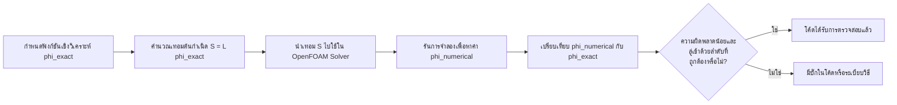

# 02 ระเบียบวิธีตรวจสอบความถูกต้องเชิงตัวเลข (Numerical Verification Methods)

การตรวจสอบความถูกต้องเชิงตัวเลข (Numerical Verification) มีวัตถุประสงค์เพื่อยืนยันว่าอัลกอริทึมและระเบียบวิธีเชิงตัวเลขได้รับการพิจารณาและนำไปใช้ในโค้ดอย่างถูกต้อง และบรรลุความแม่นยำตามที่ระบุไว้ในทฤษฎี

## 2.1 ระเบียบวิธีผลิตผลเฉลย (Method of Manufactured Solutions: MMS)

MMS เป็นวิธีที่มีประสิทธิภาพมากที่สุดในการตรวจสอบว่าโค้ดคำนวณได้อย่างถูกต้อง โดยเฉพาะอย่างยิ่งเมื่อเราขาดผลเฉลยเชิงวิเคราะห์ (Analytical Solutions) สำหรับปัญหาในโลกแห่งความเป็นจริง

### 2.1.1 หลักการพื้นฐานของ MMS (Basic Principles of MMS)

ระเบียบวิธีนี้ทำงานในทิศทางตรงกันข้ามกับการแก้ปัญหา CFD ทั่วไป:
- **การแก้ปัญหาทั่วไป**: ทราบสมการเชิงอนุพันธ์ → หาผลเฉลย $\phi$
- **MMS**: กำหนดผลเฉลยแม่นตรง $\phi_{exact}$ ล่วงหน้า → คำนวณเทอมต้นกำเนิด (Source Term) ที่จำเป็น



**คำอธิบาย:** แผนภาพด้านบนแสดงแนวทางการวิศวกรรมย้อนกลับของ MMS แทนที่จะแก้หาค่า $\phi$ ที่ไม่ทราบค่า เราจะกำหนด $\phi_{exact}$ และทำงานย้อนกลับเพื่อหาเทอมต้นกำเนิด $S$ ที่จะทำให้เกิดผลเฉลยนี้ วิธีนี้ช่วยให้สามารถตรวจสอบทุกเทอมในสมการที่ทำเป็นดิสครีต (Discretized Equation) ได้

**แนวคิดหลัก:**
- **ผลเฉลยที่ผลิตขึ้น (Manufactured Solution)**: ฟังก์ชันเชิงวิเคราะห์ที่ทราบค่าซึ่งเลือกให้เป็นผลเฉลย "จริง"
- **เทอมต้นกำเนิด (Source Term)**: เทอมเพิ่มเติมที่จำเป็นเพื่อให้ผลเฉลยที่ผลิตขึ้นสอดคล้องกับสมการควบคุม
- **การตรวจสอบโค้ด (Code Verification)**: ยืนยันว่าโค้ดนำแบบจำลองทางคณิตศาสตร์ไปใช้ได้อย่างถูกต้อง

### 2.1.2 ขั้นตอนการดำเนินการ MMS (MMS Implementation Steps)

**ขั้นตอนที่ 1: กำหนดผลเฉลยที่สมมติขึ้น ($\\phi_{exact}$)**

เลือกฟังก์ชันทางคณิตศาสตร์ที่ต่อเนื่องและง่ายต่อการหาอนุพันธ์ มักเลือกฟังก์ชันตรีโกณมิติเนื่องจาก:
- มีความต่อเนื่องและราบเรียบ
- ง่ายต่อการหาอนุพันธ์ในทุกลำดับ
- ครอบคลุมช่วงของค่าที่กว้าง

ตัวอย่างฟังก์ชันสมมติสำหรับปัญหา 2 มิติ:

$$\\phi_{exact}(x, y) = \\phi_0 \\sin(\\\\frac{\\\\pi x}{L})\\cos(\\\\frac{\\\\pi y}{L})$$

**ขั้นตอนที่ 2: คำนวณเทอมต้นกำเนิด ($S$)**

แทนค่า $\phi_{exact}$ ลงในสมการเชิงอนุพันธ์เพื่อหาเทอมต้นกำเนิดที่ทำให้สมการสมดุล

สำหรับ **สมการการแพร่สถานะคงตัว (Steady-State Diffusion Equation)**:

$$\\nabla \\cdot (D \\nabla \\phi) + S = 0$$

คำนวณลาพลาเซียน (Laplacian) ของ $\phi_{exact}$:

$$\\nabla \\cdot (D \\nabla \\phi_{exact}) = D (\\frac{\\\\partial^2 \\phi_{exact}}{\\\\partial x^2} + \\frac{\\\\partial^2 \\phi_{exact}}{\\\\partial y^2})$$

$$\\\\frac{\\\\partial \\phi_{exact}}{\\\\partial x} = \\phi_0 \\frac{\\\\pi}{L} \\cos(\\\\frac{\\\\pi x}{L})\\cos(\\\\frac{\\\\pi y}{L})$$

$$\\\\frac{\\\\partial^2 \\phi_{exact}}{\\\\partial x^2} = -\\phi_0 (\\frac{\\\\pi}{L})^2 \\sin(\\\\frac{\\\\pi x}{L})\\cos(\\\\frac{\\\\pi y}{L})$$

$$\\\\frac{\\\\partial^2 \\phi_{exact}}{\\\\partial y^2} = -\\phi_0 (\\frac{\\\\pi}{L})^2 \\sin(\\\\frac{\\\\pi x}{L})\\cos(\\\\frac{\\\\pi y}{L})$$

ดังนั้น เทอมต้นกำเนิดที่ต้องการคือ:

$$S = -\\nabla \\cdot (D \\nabla \\phi_{exact}) = \\phi_0 D \\frac{2\\pi^2}{L^2} \\sin(\\\\frac{\\\\pi x}{L})\\cos(\\\\frac{\\\\pi y}{L})$$

**ขั้นตอนที่ 3: การนำไปใช้ใน OpenFOAM**

```cpp
// สร้างฟิลด์สำหรับเก็บผลเฉลยเชิงวิเคราะห์
volScalarField phiExact
(
    IOobject
    (
        "phiExact",
        runTime.timeName(),
        mesh,
        IOobject::NO_READ,
        IOobject::AUTO_WRITE
    ),
    mesh,
    dimensionedScalar("phiExact", dimless, 0.0)
);

// กำหนดค่าคงที่
const scalar phi0 = 1.0;          // แอมพลิจูดของผลเฉลยที่ผลิตขึ้น
const scalar L = 1.0;             // สเกลความยาวลักษณะเฉพาะ
const scalar D = 0.1;             // สัมประสิทธิ์การแพร่

// คำนวณ phiExact ที่จุดเมชทั้งหมด
const volVectorField& C = mesh.C();
forAll(C, celli)
{
    scalar x = C[celli].x();
    scalar y = C[celli].y();
    phiExact[celli] = phi0 * Foam::sin( Foam::constant::mathematical::pi * x / L )
                          * Foam::cos( Foam::constant::mathematical::pi * y / L );
}

// คำนวณเทอมต้นกำเนิดโดยใช้ fvc::laplacian
volScalarField sourceTerm = D * fvc::laplacian(phiExact);

// แก้สมการการแพร่ด้วยเทอมต้นกำเนิด
solve(fvm::laplacian(D, phi) == sourceTerm);

// คำนวณค่าความผิดพลาด
volScalarField error = phi - phiExact;
scalar maxError = max(mag(error)).value();
scalar L2norm = Foam::sqrt(sum(magSqr(error) * mesh.V()).value());
```

**แหล่งที่มา:** 📂 `.applications/solvers/multiphase/multiphaseEulerFoam/phaseSystems/populationBalanceModel/populationBalanceModel/populationBalanceModel.C`

**คำอธิบาย:** โค้ดนี้สาธิตเวิร์กโฟลว์ MMS ที่สมบูรณ์ใน OpenFOAM ฟิลด์ `phiExact` จะเก็บผลเฉลยที่ผลิตขึ้นซึ่งคำนวณที่จุดศูนย์กลางเซลล์แต่ละเซลล์โดยใช้ฟังก์ชันตรีโกณมิติ เทอมต้นกำเนิดคำนวณโดยใช้โอเปอเรเตอร์แคลคูลัสไฟไนต์วอลุ่ม `fvc::laplacian` ซึ่งทำการดิสครีตโอเปอเรเตอร์ลาพลาเซียน จากนั้นจะเปรียบเทียบผลเฉลยเชิงตัวเลข `phi` กับ `phiExact` เพื่อคำนวณนอร์มความผิดพลาด (Error Norms)

**แนวคิดหลัก:**
- **volScalarField**: ฟิลด์ทางเรขาคณิตที่กำหนดที่จุดศูนย์กลางเซลล์ในเมชไฟไนต์วอลุ่ม
- **mesh.C()**: คืนค่าตำแหน่งจุดศูนย์กลางเซลล์สำหรับเซลล์ทั้งหมด
- **fvc::laplacian**: โอเปอเรเตอร์แคลคูลัสไฟไนต์วอลุ่มสำหรับการคำนวณลาพลาเซียนแบบชัดแจ้ง (Explicit)
- **fvm::laplacian**: โอเปอเรเตอร์ระเบียบวิธีไฟไนต์วอลุ่มสำหรับลาพลาเซียนแบบโดยนัย (Implicit) ในสมการเมทริกซ์
- **L2 Norm**: มาตรวัดความผิดพลาดรากที่สองของค่าเฉลี่ยกำลังสอง (RMS) ที่บูรณาการตลอดทั้งโดเมน

**ขั้นตอนที่ 4: ตรวจสอบลำดับความแม่นยำ (Verify Order of Accuracy)**

รันการจำลองด้วยขนาดเมชที่แตกต่างกัน 3-4 ระดับ และคำนวณความผิดพลาด:

$$L_2 \\text{ Error} = \\sqrt{\\\\