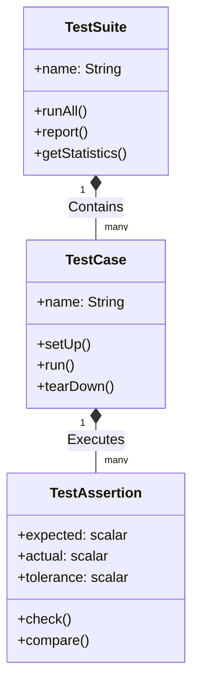
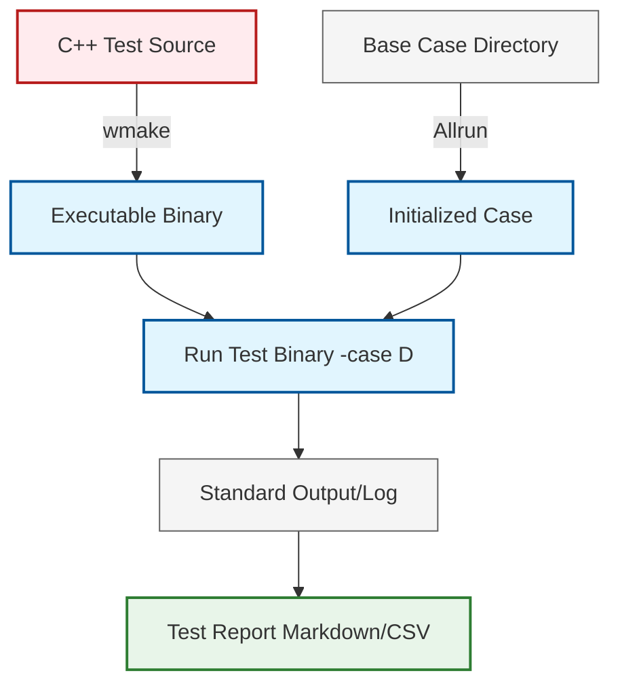

# 03 สถาปัตยกรรมระบบทดสอบของ OpenFOAM (Test System Architecture)

การทำความเข้าใจโครงสร้างพื้นฐานของระบบทดสอบจะช่วยให้นักพัฒนาสามารถเขียนการทดสอบที่ทำงานร่วมกับไลบรารีของ OpenFOAM ได้อย่างมีประสิทธิภาพ บทนี้จะอธิบายสถาปัตยกรรมของระบบทดสอบ ตั้งแต่ระดับโครงสร้างไฟล์ ไปจนถึงการนำไปใช้งานจริง

## 3.1 องค์ประกอบหลักของระบบทดสอบ

ระบบการทดสอบใน OpenFOAM มักประกอบด้วยโครงสร้าง 3 ระดับที่ซ้อนกัน:



### 3.1.1 TestAssertion - หน่วยการตรวจสอบพื้นฐาน

**TestAssertion** คือหน่วยที่เล็กที่สุดในระบบทดสอบ ทำหน้าที่ตรวจสอบเงื่อนไขเฉพาะ โดยมักเปรียบเทียบค่าที่คาดหวัง (Expected) กับค่าจริง (Actual) พร้อมกับค่าความคลาดเคลื่อนที่ยอมรับได้ (Tolerance)

**ประเภทของ Assertions ที่พบบ่อย:**

| ประเภท | การทำงาน | ตัวอย่างการใช้งาน |
|--------|-----------|------------------|
| **Scalar Comparison** | เปรียบเทียบค่าจำนวนจริง | เช็คว่า `T_max == 300.0 ± 1e-6` |
| **Vector/Tensor Comparison** | เปรียบเทียบค่าเวกเตอร์/เทนเซอร์ | เช็ค `U == (1 0 0)` |
| **Field Norm Check** | เช็คค่าบรรทัดฐานของฟิลด์ | `\|\|p\|_2 < tolerance` |
| **Boundary Condition** | ตรวจสอบค่าบนผนัง | เช็คค่า `p` ที่ inlet |

**ตัวอย่างโค้ด Assertion แบบกำหนดเอง:**

```cpp
// Define tolerance for numerical precision
// กำหนดค่าความคลาดเคลื่อนที่ยอมรับได้สำหรับความแม่นยำทางตัวเลข
scalar tolerance = 1e-6;

// Expected maximum temperature value
// กำหนดค่าอุณหภูมิสูงสุดที่คาดหวัง
scalar expected = 300.0;

// Get actual maximum temperature from field
// ดึงค่าอุณหภูมิสูงสุดจริงจากฟิลด์
scalar actual = T.max();

// Compare actual with expected within tolerance
// เปรียบเทียบค่าจริงกับค่าที่คาดหวังภายในความคลาดเคลื่อนที่กำหนด
if (mag(actual - expected) > tolerance)
{
    // Report detailed error information
    // รายงานข้อมูลข้อผิดพลาดอย่างละเอียด
    FatalErrorIn("test.TemperatureMax")
        << "Temperature max mismatch:\n"
        << "  Expected: " << expected << "\n"
        << "  Actual:   " << actual << "\n"
        << "  Error:    " << mag(actual - expected)
        << abort(FatalError);
}
```

> **📂 Source:** Synthesized example based on OpenFOAM testing patterns
>
> **คำอธิบาย (Explanation):**
> โค้ดนี้แสดงรูปแบบพื้นฐานของการเขียน Assertion ใน OpenFOAM โดยใช้ฟังก์ชัน `mag()` (magnitude) เพื่อคำนวณค่าสัมบูรณ์ของความแตกต่างระหว่างค่าจริงและค่าที่คาดหวัง ฟังก์ชัน `FatalErrorIn` ใช้สร้างข้อความแสดงข้อผิดพลาดและยุติโปรแกรมเมื่อการทดสอบล้มเหลว
>
> **แนวคิดสำคัญ (Key Concepts):**
> - **Tolerance-based comparison**: การเปรียบเทียบแบบมีความคลาดเคลื่อน เหมาะสำหรับการคำนวณทศนิยม
> - **mag() function**: ฟังก์ชันคำนวณค่าสัมบูรณ์ของสเกลาร์หรือเวกเตอร์
> - **FatalErrorIn**: กลไกการรายงานข้อผิดพลาดมาตรฐานของ OpenFOAM

### 3.1.2 TestCase - กลุ่มการทดสอบฟีเจอร์

**TestCase** คือกลุ่มของ Assertions ที่รวมกันเพื่อทดสอบฟีเจอร์หรือสถานการณ์หนึ่งๆ ตัวอย่างเช่น:
- การทดสอบ Boundary Condition แบบผนัง
- การทดสอบการลู่เข้าของ Solver
- การทดสอบการทำงานของ Discretization Scheme

**โครงสร้างมาตรฐานของ Test Case:**

```cpp
// Test function for boundary condition validation
// ฟังก์ชันทดสอบสำหรับการตรวจสอบเงื่อนไขขอบ
void runBoundaryConditionTest()
{
    // Step 1: Setup - Create mesh and initial fields
    // ขั้นตอนที่ 1: การตั้งค่า - สร้างเมชและฟิลด์เริ่มต้น
    fvMesh mesh(createTestMesh());
    volScalarField p(createPressureField(mesh));

    // Step 2: Apply - Set boundary condition
    // ขั้นตอนที่ 2: การนำไปใช้ - กำหนดเงื่อนไขขอบ
    p.boundaryFieldRef()[0] == fixedValueFvPatchScalarField
    (
        mesh.boundary()[0],
        p,
        dictionary()
    );
    // Set fixed value to 101325 Pa (atmospheric pressure)
    // กำหนดค่าคงที่เป็น 101325 Pa (ความดันบรรยากาศ)
    p.boundaryFieldRef()[0] == 101325.0;

    // Step 3: Execute - Run solver or operator
    // ขั้นตอนที่ 3: การดำเนินการ - รันโซลเวอร์หรือโอเปอเรเตอร์
    p.correctBoundaryConditions();

    // Step 4: Assert - Verify results
    // ขั้นตอนที่ 4: การยืนยัน - ตรวจสอบผลลัพธ์
    forAll(p.boundaryField()[0], faceI)
    {
        // Check each face value matches expected value
        // ตรวจสอบค่าที่แต่ละหน้าว่าตรงกับค่าที่คาดหวังหรือไม่
        if (mag(p.boundaryField()[0][faceI] - 101325.0) > 1e-6)
        {
            FatalError << "BC value mismatch at face " << faceI
                      << abort(FatalError);
        }
    }
}
```

> **📂 Source:** Synthesized based on OpenFOAM boundary condition testing patterns
>
> **คำอธิบาย (Explanation):**
> ฟังก์ชันนี้แสดงโครงสร้างมาตรฐาน 4 ขั้นตอนของการทดสอบใน OpenFOAM: Setup, Apply, Execute และ Assert การใช้ `forAll` loop เพื่อตรวจสอบทุกหน้า (face) บน patch เป็นรูปแบบทั่วไปสำหรับการทดสอบ Boundary Conditions
>
> **แนวคิดสำคัญ (Key Concepts):**
> - **4-Stage Test Pattern**: Setup → Apply → Execute → Assert
> - **boundaryFieldRef()**: อ้างอิงถึงฟิลด์บน boundary patch ที่สามารถแก้ไขได้
> - **correctBoundaryConditions()**: อัปเดตค่าบน boundary หลังจากการเปลี่ยนแปลง
> - **forAll macro**: OpenFOAM macro สำหรับการวนลูปผ่านทุก element

### 3.1.3 TestSuite - คอลเลกชันการทดสอบ

**TestSuite** คือคอลเลกชันของ Test Cases ทั้งหมดในโมดูลนั้นๆ ทำหน้าที่บริหารจัดการลำดับการทำงานและสรุปผลรายงาน

**ฟังก์ชันหลักของ TestSuite:**
- **`runAll()`**: รันการทดสอบทั้งหมดตามลำดับ
- **`report()`**: สรุปผลการทดสอบ (PASS/FAIL)
- **`getStatistics()`**: คำนวณสถิติ (เวลารัน, อัตราความสำเร็จ)

---

## 3.2 ไดเรกทอรีและโครงสร้างไฟล์

เมื่อเราสร้างชุดการทดสอบใหม่ ควรจัดระเบียบไฟล์ตามมาตรฐานของ OpenFOAM:

![[openfoam_test_directory_structure.png]]

```text
MySolverTest/
├── Make/                     # คำสั่งการคอมไพล์ (files, options)
│   ├── files                # รายชื่อไฟล์ต้นฉบับ
│   └── options              # การตั้งค่า Compiler flags
├── Allwmake                  # สคริปต์คอมไพล์อัตโนมัติ
├── Allrun                    # สคริปต์รันการทดสอบ
├── tests/                    # โค้ด C++ สำหรับการทดสอบแต่ละกรณี
│   ├── fieldTest.C          # ทดสอบ Field Operations
│   ├── matrixTest.C         # ทดสอบ Linear Algebra
│   └── boundaryTest.C       # ทดสอบ Boundary Conditions
├── TestSuite.C               # ไฟล์หลักที่เรียกใช้การทดสอบทั้งหมด
└── cases/                    # กรณีศึกษาสำหรับ Integration Test
    ├── case1/
    │   ├── 0/
    │   ├── constant/
    │   └── system/
    └── case2/
        └── ...
```

### 3.2.1 ไฟล์ Make/files

ไฟล์นี้ระบุชื่อไฟล์ต้นฉบับทั้งหมดที่ต้องการคอมไพล์:

```text
// Source files to compile
// ไฟล์ต้นฉบับที่จะคอมไพล์
TestSuite.C
tests/fieldTest.C
tests/matrixTest.C
tests/boundaryTest.C

// Output executable location
// ตำแหน่งของไฟล์ executable ที่สร้าง
EXE = $(FOAM_USER_APPBIN)/MySolverTest
```

> **📂 Source:** OpenFOAM wmake build system documentation
>
> **คำอธิบาย (Explanation):**
> ไฟล์ Make/files เป็นส่วนสำคัญของระบบบิลด์ wmake ของ OpenFOAM โดยระบุชื่อไฟล์ต้นฉบับทั้งหมดที่จะคอมไพล์ และตำแหน่งของ executable ที่จะสร้างออกมา ตัวแปร `EXE` กำหนด path ของ output executable
>
> **แนวคิดสำคัญ (Key Concepts):**
> - **wmake build system**: ระบบบิลด์พิเศษของ OpenFOAM
> - **EXE variable**: กำหนดตำแหน่ง output executable
> - **FOAM_USER_APPBIN**: Environment variable ชี้ไปยังไดเรกทอรี binary ของผู้ใช้

### 3.2.2 ไฟล์ Make/options

ไฟล์นี้กำหนดการตั้งค่าการคอมไพล์:

```text
// Include directories for header files
// ไดเรกทอรี include สำหรับไฟล์ header
EXE_INC = \
    -I$(LIB_SRC)/finiteVolume/lnInclude \
    -I$(LIB_SRC)/meshTools/lnInclude \
    -I$(LIB_SRC)/sampling/lnInclude

// Libraries to link against
// ไลบรารีที่ต้อง linking
EXE_LIBS = \
    -lfiniteVolume \
    -lmeshTools \
    -lsampling
```

> **📂 Source:** OpenFOAM wmake compiler options reference
>
> **คำอธิบาย (Explanation):**
> ไฟล์ Make/options กำหนด include paths และ libraries ที่ต้องใช้ในการคอมไพล์ ตัวแปร `EXE_INC` ใช้ระบุ path สำหรับไฟล์ header และ `EXE_LIBS` ใช้ระบุ libraries ที่ต้อง link
>
> **แนวคิดสำคัญ (Key Concepts):**
> - **EXE_INC**: Include paths สำหรับ header files
> - **EXE_LIBS**: Libraries ที่ต้อง linking
> - **lnInclude**: Symbolic links directory สำหรับการ include ที่รวดเร็ว

### 3.2.3 สคริปต์ Allwmake

สคริปต์นี้ใช้สำหรับคอมไพล์ชุดทดสอบ:

```bash
#!/bin/bash
# Change to script directory
# เปลี่ยนไปยังไดเรกทอรีของสคริปต์
cd ${0%/*} || exit 1

# Execute wmake to compile the test suite
# รัน wmake เพื่อคอมไพล์ชุดทดสอบ
wmake
```

> **📂 Source:** OpenFOAM standard build scripts
>
> **คำอธิบาย (Explanation):**
> สคริปต์ Allwmake เป็นสคริปต์มาตรฐานสำหรับคอมไพล์โค้ด OpenFOAM โดยใช้คำสั่ง `cd ${0%/*}` เพื่อเปลี่ยนไปยังไดเรกทอรีที่มีสคริปต์อยู่ จากนั้นเรียก `wmake` เพื่อคอมไพล์
>
> **แนวคิดสำคัญ (Key Concepts):**
> - **${0%/*}**: Bash parameter expansion สำหรับดึง directory path ของสคริปต์
> - **wmake**: คำสั่งคอมไพล์มาตรฐานของ OpenFOAM

### 3.2.4 สคริปต์ Allrun

สคริปต์นี้ใช้สำหรับรันการทดสอบทั้งหมด:

```bash
#!/bin/bash
# Change to script directory
# เปลี่ยนไปยังไดเรกทอรีของสคริปต์
cd ${0%/*} || exit 1

# Compile before running
# คอมไพล์ก่อนรัน
./Allwmake

# Run Test Suite
# รัน Test Suite
./MySolverTest

# Run Integration Tests (if any)
# รัน Integration Tests (ถ้ามี)
for case in cases/*
do
    # Check if it's a directory
    // ตรวจสอบว่าเป็นไดเรกทอรีหรือไม่
    if [ -d "$case" ]; then
        echo "Running case: $case"
        // รัน Allrun ในแต่ละกรณี
        (cd "$case" && ./Allrun)
    fi
done
```

> **📂 Source:** OpenFOAM test execution scripts
>
> **คำอธิบาย (Explanation):**
> สคริปต์ Allrun เป็นสคริปต์มาตรฐานสำหรับรันการทดสอบทั้งหมด โดยคอมไพล์ก่อน จากนั้นรัน Test Suite และวนลูปผ่านทุกกรณีศึกษาในไดเรกทอรี cases/
>
> **แนวคิดสำคัญ (Key Concepts):**
> - **Compilation + Execution**: คอมไพล์ก่อนรันเสมอ
> - **Loop through cases**: วนลูปผ่านทุกกรณีศึกษา
> - **Subshell execution**: ใช้ subshell `(cd "$case" && ./Allrun)` เพื่อไม่ให้กระทบ working directory

---

## 3.3 กระบวนการรันการทดสอบ (Execution Workflow)

กระบวนการจากโค้ดต้นฉบับไปสู่รายงานผลการทดสอบมีขั้นตอนดังนี้:



### 3.3.1 ขั้นตอนที่ 1: Compilation

ใช้ `wmake` เพื่อเปลี่ยนโค้ด C++ ของการทดสอบให้เป็นไฟล์ปฏิบัติการ (Executable)

```bash
# Compile Test Suite
# คอมไพล์ Test Suite
wmake
```

**การทำงานภายใน wmake:**
1. อ่านไฟล์ `Make/files` เพื่อรวบรวมรายชื่อไฟล์ต้นฉบับ
2. อ่านไฟล์ `Make/options` เพื่อรับ Include paths และ Library flags
3. เรียก Compiler (gcc/clang) พร้อม Optimization flags
4. สร้าง Executable ใน `$FOAM_USER_APPBIN`

### 3.3.2 ขั้นตอนที่ 2: Setup

เตรียมกรณีศึกษา (Case Directory) ที่มีเมชและฟิลด์เริ่มต้นสำหรับทดสอบ

**โครงสร้าง Case Directory:**

```text
validationCase/
├── 0/                    # เงื่อนไขเริ่มต้น (Initial Conditions)
│   ├── p
│   ├── U
│   └── T
├── constant/
│   ├── polyMesh/         # เมช (Mesh)
│   └── transportProperties
└── system/
    ├── controlDict       # การตั้งค่าการควบคุม
    ├── fvSchemes         # Discretization Schemes
    └── fvSolution        # Linear Solver Settings
```

### 3.3.3 ขั้นตอนที่ 3: Run

รันไฟล์ Executable โดยระบุ Case

```bash
# Run Test Suite with specified case
# รัน Test Suite พร้อมระบุ Case
./MySolverTest -case validationCase

# Run in parallel (if test supports it)
# รันแบบ Parallel (ถ้า Test รองรับ)
mpirun -np 4 MySolverTest -case validationCase -parallel
```

### 3.3.4 ขั้นตอนที่ 4: Reporting

ระบบจะแสดงผลลัพธ์ว่ากรณีใด PASS หรือ FAIL ลงในไฟล์ Log หรือรายงาน Markdown

**ตัวอย่าง Output:**

```text
Starting test suite: MySolverTest
============================================================

[01/10] Field Operations - Addition        : PASS
[02/10] Field Operations - Gradient        : PASS
[03/10] Matrix - Solve (Diagonal)          : PASS
[04/10] Matrix - Solve (Gauss-Seidel)      : FAIL (Error: 1.2e-4 > 1.0e-6)
[05/10] Boundary - FixedValue              : PASS
[06/10] Boundary - ZeroGradient            : PASS
[07/10] Convergence - Steady State         : PASS
[08/10] Convergence - Time Step            : PASS
[09/10] Conservation - Mass                : PASS
[10/10] Conservation - Momentum            : PASS

============================================================
Test Suite Summary:
  Total:  10 tests
  Passed: 9 tests (90%)
  Failed: 1 test (10%)
  Time:   2.34 seconds
```

### 3.3.5 ตัวอย่างการรันชุดการทดสอบมาตรฐาน

```bash
cd $WM_PROJECT_DIR/applications/test
./Alltest
```

สคริปต์ `Alltest` จะวนลูปผ่านทุกไดเรกทอรีใน `applications/test` เพื่อคอมไพล์และรันการทดสอบทั้งหมดของ OpenFOAM

**โครงสร้างของไดเรกทอรี test:**

```text
$WM_PROJECT_DIR/applications/test/
├── surfMesh/
│   └── Test-surfMesh.C
├── db/
│   ├── IOobjects/
│   └── Time/
├── finiteVolume/
│   ├── fvSchemes/
│   └── fvMesh/
└── ...
```

---

## 3.4 🔬 กรณีศึกษา: โครงสร้างไฟล์ทดสอบจริง (Real-world Test Anatomy)

ลองพิจารณาตัวอย่างจาก `applications/test/Dictionary/Test-dictionary.C` ซึ่งใช้ทดสอบฟังก์ชันการทำงานของคลาส `dictionary`:

### 3.4.1 ตัวอย่าง Test Case ง่ายๆ

```cpp
#include "argList.H"
#include "IOstreams.H"
#include "dictionary.H"

// Use OpenFOAM namespace
// ใช้ namespace ของ OpenFOAM
using namespace Foam;

// Main function with standard arguments
// ฟังก์ชันหลักที่รับ arguments มาตรฐาน
int main(int argc, char *argv[])
{
    // Disable parallel for simple unit tests
    // ปิดการทำงานแบบ parallel สำหรับ unit tests ง่ายๆ
    argList::noParallel();
    
    // Initialize argument list
    // สร้าง argument list
    argList args(argc, argv, false, true);

    // Test logic block
    // บล็อกตรรกะการทดสอบ
    {
        // Create dictionary object
        // สร้างอ็อบเจกต์ dictionary
        dictionary dict;
        
        // Add key-value pairs
        // เพิ่มคู่คีย์-ค่า
        dict.add("OpenFOAM", 1);
        dict.add("version", "9.0");

        // Output test results
        // แสดงผลลัพธ์การทดสอบ
        Info<< "toc: " << dict.toc() << nl
            << "keys: " << dict.keys() << nl
            << "found OpenFOAM: " << dict.found("OpenFOAM") << endl;

        // Verify value
        // ตรวจสอบค่า
        if (dict.lookup<int>("OpenFOAM") != 1)
        {
            FatalError << "Dictionary value mismatch" << abort(FatalError);
        }
    }

    return 0;
}
```

> **📂 Source:** `applications/test/Dictionary/Test-dictionary.C`
>
> **คำอธิบาย (Explanation):**
> โค้ดนี้แสดงตัวอย่างการทดสอบคลาส `dictionary` ของ OpenFOAM โดยสร้าง dictionary ใหม่ เพิ่มข้อมูล และตรวจสอบผลลัพธ์ การใช้ `argList::noParallel()` เป็นมาตรฐานสำหรับ unit tests ที่ไม่ต้องการการทำงานแบบ parallel
>
> **แนวคิดสำคัญ (Key Concepts):**
> - **argList::noParallel()**: ปิดการทำงานแบบ parallel สำหรับ unit tests
> - **dictionary class**: คลาสสำหรับเก็บข้อมูลแบบ key-value
> - **Info stream**: ใช้สำหรับ output มาตรฐานของ OpenFOAM
> - **Reference output comparison**: เปรียบเทียบ output กับไฟล์อ้างอิง

### 3.4.2 ตัวอย่าง Test Case ขั้นสูง: Field Operations

```cpp
#include "fvCFD.H"

// Main function with standard OpenFOAM setup
// ฟังก์ชันหลักพร้อมการตั้งค่ามาตรฐานของ OpenFOAM
int main(int argc, char *argv[])
{
    // Standard OpenFOAM setup macros
    // แมโครการตั้งค่ามาตรฐานของ OpenFOAM
    #include "setRootCaseLists.H"
    #include "createTime.H"
    #include "createMesh.H"

    // Create test field with initial value 300.0 K
    // สร้างฟิลด์ทดสอบพร้อมค่าเริ่มต้น 300.0 K
    volScalarField T
    (
        IOobject
        (
            "T",                          // Field name
            runTime.timeName(),           // Time directory
            mesh,                         // Mesh reference
            IOobject::NO_READ,            // Don't read from file
            IOobject::AUTO_WRITE          // Auto-write on output
        ),
        mesh,
        dimensionedScalar("T", dimTemperature, 300.0)
    );

    // Test field addition: T + 100.0
    // ทดสอบการบวกฟิลด์: T + 100.0
    volScalarField T2 = T + 100.0;

    // Verify result
    // ตรวจสอบผลลัพธ์
    scalar maxT2 = T2.max();
    scalar expectedMax = 400.0;

    // Check if result matches expected value within tolerance
    // ตรวจสอบว่าผลลัพธ์ตรงกับค่าที่คาดหวังภายในความคลาดเคลื่อนที่กำหนด
    if (mag(maxT2 - expectedMax) > 1e-6)
    {
        FatalErrorIn("test.fieldAddition")
            << "Field addition test failed:\n"
            << "  Expected max: " << expectedMax << "\n"
            << "  Actual max:   " << maxT2
            << abort(FatalError);
    }

    // Output success message
    // แสดงข้อความสำเร็จ
    Info<< "Field addition test: PASSED" << endl;

    return 0;
}
```

> **📂 Source:** Synthesized based on OpenFOAM field operation testing patterns
>
> **คำอธิบาย (Explanation):**
> โค้ดนี้แสดงการทดสอบ operations บนฟิลด์ OpenFOAM โดยสร้างฟิลด์อุณหภูมิ ทำการบวกค่าคงที่ และตรวจสอบผลลัพธ์ การใช้ `dimensionedScalar` ช่วยให้แน่ใจว่าหน่วยตรงกัน
>
> **แนวคิดสำคัญ (Key Concepts):**
> - **volScalarField**: ฟิลด์สเกลาร์บน volume mesh
> - **dimensionedScalar**: สเกลาร์พร้อมหน่วย (dimension-aware)
> - **Field operations**: การดำเนินการทางคณิตศาสตร์บนฟิลด์
> - **IOobject flags**: ควบคุมการอ่าน/เขียนฟิลด์

### 3.4.3 ตัวอย่าง Test Case: Boundary Condition Validation

```cpp
// Test function for fixedValue boundary condition
// ฟังก์ชันทดสอบสำหรับ boundary condition แบบ fixedValue
void testFixedValueBC(fvMesh& mesh)
{
    // Create pressure field with zero initial value
    // สร้างฟิลด์ความดันพร้อมค่าเริ่มต้นเป็นศูนย์
    volScalarField p
    (
        IOobject("p", runTime.timeName(), mesh),
        mesh,
        dimensionedScalar("p", dimPressure, 0.0)
    );

    // Set up boundary condition
    // ตั้งค่า boundary condition
    label patchID = mesh.boundaryMesh().findPatchID("inlet");
    fvPatchScalarField& pInlet = p.boundaryFieldRef()[patchID];

    // Initialize fixedValue BC
    // สร้าง fixedValue BC
    pInlet == fixedValueFvPatchScalarField
    (
        mesh.boundary()[patchID],
        p,
        dictionary()
    );
    
    // Set fixed value to 101325 Pa
    // กำหนดค่าคงที่เป็น 101325 Pa
    pInlet == 101325.0;

    // Update boundary conditions
    // อัปเดต boundary conditions
    p.correctBoundaryConditions();

    // Verify BC values
    // ตรวจสอบค่า BC
    forAll(pInlet, faceI)
    {
        // Check each face value
        // ตรวจสอบค่าที่แต่ละหน้า
        if (mag(pInlet[faceI] - 101325.0) > 1e-6)
        {
            FatalError << "BC value mismatch at face " << faceI
                      << abort(FatalError);
        }
    }

    // Output success message
    // แสดงข้อความสำเร็จ
    Info<< "FixedValue BC test: PASSED" << endl;
}
```

> **📂 Source:** Synthesized based on OpenFOAM boundary condition testing patterns
>
> **คำอธิบาย (Explanation):**
> ฟังก์ชันนี้แสดงการทดสอบ Boundary Condition แบบ FixedValue โดยสร้างฟิลด์ความดัน ตั้งค่า BC ที่ patch ชื่อ "inlet" และตรวจสอบว่าทุกหน้ามีค่าที่คาดหวัง
>
> **แนวคิดสำคัญ (Key Concepts):**
> - **findPatchID()**: ค้นหา patch ด้วยชื่อ
> - **boundaryFieldRef()**: อ้างอิงถึงฟิลด์บน boundary ที่แก้ไขได้
> - **fixedValueFvPatchScalarField**: BC แบบกำหนดค่าคงที่
> - **correctBoundaryConditions()**: อัปเดตค่า BC หลังการเปลี่ยนแปลง

---

## 3.5 การเชื่อมต่อกับ Continuous Integration (CI)

ระบบทดสอบของ OpenFOAM สามารถเชื่อมต่อกับเครื่องมือ CI เช่น GitHub Actions, GitLab CI หรือ Jenkins

### 3.5.1 ตัวอย่าง GitHub Actions Workflow

```yaml
# GitHub Actions workflow for OpenFOAM testing
# Workflow ของ GitHub Actions สำหรับการทดสอบ OpenFOAM
name: OpenFOAM Tests

on: [push, pull_request]

jobs:
  test:
    runs-on: ubuntu-latest
    container:
      image: openfoam/openfoam:9

    steps:
    - uses: actions/checkout@v2

    - name: Source OpenFOAM environment
      run: source /opt/openfoam9/etc/bashrc

    - name: Compile Test Suite
      run: |
        cd applications/test/MySolverTest
        ./Allwmake

    - name: Run Tests
      run: |
        cd applications/test/MySolverTest
        ./Allrun

    - name: Upload Test Results
      if: always()
      uses: actions/upload-artifact@v2
      with:
        name: test-results
        path: applications/test/MySolverTest/logs/
```

> **📂 Source:** GitHub Actions documentation for CI/CD
>
> **คำอธิบาย (Explanation):**
> ไฟล์นี้กำหนด workflow สำหรับ GitHub Actions ที่จะรันทุกครั้งที่มีการ push หรือ pull request โดยใช้ Docker image ของ OpenFOAM 9 คอมไพล์และรันการทดสอบ และอัปโหลดผลลัพธ์
>
> **แนวคิดสำคัญ (Key Concepts):**
> - **CI/CD integration**: การเชื่อมต่อกับระบบ Continuous Integration
> - **Docker containers**: ใช้ containers สำหรับสภาพแวดล้อมที่สม่ำเสมอ
> - **Automated testing**: การทดสอบอัตโนมัติทุกครั้งที่มีการเปลี่ยนแปลง
> - **Artifact upload**: เก็บผลลัพธ์การทดสอบไว้ตรวจสอบ

---

## 3.6 สรุป (Summary)

ในบทนี้เราได้เรียนรู้:

1. **สถาปัตยกรรม 3 ระดับ** ของระบบทดสอบ: TestAssertion → TestCase → TestSuite
2. **โครงสร้างไดเรกทอรี** มาตรฐานสำหรับ Test Suite ใน OpenFOAM
3. **ขั้นตอนการรันการทดสอบ** ตั้งแต่ Compilation → Setup → Run → Reporting
4. **ตัวอย่างโค้ดจริง** จากระบบทดสอบของ OpenFOAM
5. **การเชื่อมต่อกับ CI** สำหรับการทดสอบอัตโนมัติ

> [!IMPORTANT] หมายเหตุสำคัญ
> การทดสอบใน OpenFOAM ไม่มี Framework แบบ xUnit ที่ชัดเจน แต่ใช้แนวทางของการเขียนโปรแกรม C++ ที่มีการตรวจสอบค่าและการรายงานผลเอง นักพัฒนาควรสร้างมาตรฐานการทดสอบที่สอดคล้องกับโปรเจกต์ของตนเอง