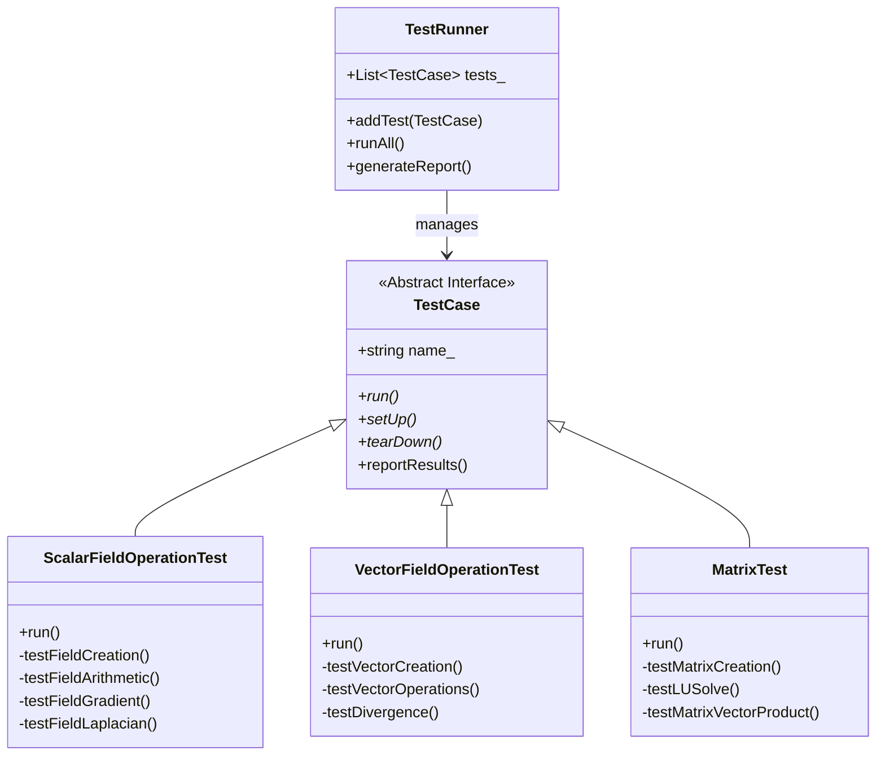

# 01 เฟรมเวิร์กการทดสอบหน่วย (Unit Testing Framework)

## ภาพรวม

ในส่วนนี้เราจะเจาะลึกการนำระบบ Assertion ไปใช้งานในภาษา C++ เพื่อรองรับความต้องการเฉพาะของงาน CFD เช่น การจัดการความละเอียดเชิงตัวเลข (Numerical Precision) การทดสอบหน่วยเป็นพื้นฐานสำคัญในการยืนยันความถูกต้องของซอฟต์แวร์ CFD และช่วยให้มั่นใจได้ว่าการแก้ไขโค้ดในภายหลังไม่ทำลายฟังก์ชันการทำงานที่มีอยู่

### ทำไมการทดสอบหน่วยจึงสำคัญใน CFD

- **ความถูกต้องทางตัวเลข**: การคำนวณ CFD เกี่ยวข้องกับค่าความละเอียดจำกัด (Floating-point precision) ที่ต้องมีการจัดการอย่างพิถีพิถัน
- **การตรวจสอบการเปลี่ยนแปลง**: เมื่อมีการแก้ไขหรือเพิ่มฟีเจอร์ Unit Tests ช่วยยืนยันว่าฟังก์ชันเดิมยังทำงานได้อย่างถูกต้อง
- **เอกสารประกอบโค้ด**: Test Cases ที่เขียนดีเป็นตัวอย่างการใช้งานที่ชัดเจนของ API
- **การดีบักที่รวดเร็ว**: แยกปัญหาได้ที่ระดับฟังก์ชัน ไม่ต้องรันจำลองเต็มรูปแบบ

---

## 1.1 ระบบ Assertion สำหรับ CFD

### หลักการทางทฤษฎี

ในงาน CFD การเปรียบเทียบค่า Floating-point ต้องคำนึงถึง **Machine Epsilon** (ε) ซึ่งแทนความละเอียดที่จำกจำของคอมพิวเตอร์ สำหรับ double precision (64-bit):

$$
\varepsilon_{machine} \approx 2.22 \times 10^{-16}
$$

การเปรียบเทียบค่าสองค่า $A$ และ $B$ จึงต้องใช้ Tolerance ที่เหมาะสม:

#### 1.1.1 Absolute Tolerance (ความคลาดเคลื่อนสัมบูรณ์)

ใช้เมื่อค่าที่คาดหวังมีขนาดเล็กหรือใกล้ศูนย์:

$$
|A - B| < \epsilon_{abs}
$$

โดยทั่วไปใช้ $\epsilon_{abs} = 10^{-12}$ สำหรับ double precision

#### 1.1.2 Relative Tolerance (ความคลาดเคลื่อนสัมพัทธ์)

ใช้เมื่อค่ามีขนาดใหญ่และต้องการความแม่นยำตามสัดส่วน:

$$
\frac{|A - B|}{|A|} < \epsilon_{rel}
$$

โดยทั่วไปใช้ $\epsilon_{rel} = 10^{-6}$ ถึง $10^{-8}$

#### 1.1.3 Combined Tolerance

รูปแบบที่ใช้งานได้จริงมักใช้ทั้งสองแบบร่วมกัน:

$$
|A - B| < \max(\epsilon_{abs}, \epsilon_{rel} \cdot |A|)
$$

![[numerical_tolerance_concept.png]]
`A conceptual graph explaining Numerical Tolerance. It shows an 'Expected Value' as a central point, surrounded by a green 'Absolute Tolerance' band and a blue 'Relative Tolerance' band that scales with the value's magnitude. Points outside the bands are marked with a red 'X' (FAIL), and points inside are marked with a green checkmark (PASS). Scientific textbook diagram, clean vector line art, white background, high definition, flat design, educational infographic --ar 16:9`

### ประเภทของ Assertions ที่สำคัญ

| ประเภท | สมการ | คำอธิบาย |
|--------|---------|-----------|
| **EQUAL** | $A = B$ | สำหรับค่า Integer หรือ Boolean ที่ต้องการความเท่ากันแบบแน่นอน |
| **CLOSE** | $|A - B| < \epsilon_{abs}$ | ตรวจสอบว่าค่าสองค่าใกล้เคียงกันภายในช่วง Absolute Tolerance |
| **CLOSE_RELATIVE** | $|A - B| < \max(\epsilon_{abs}, \epsilon_{rel} \cdot \|A\|)$ | ตรวจสอบโดยใช้ทั้ง Absolute และ Relative Tolerance |

### โครงสร้างการตัดสินใจของ Assertion

```mermaid
flowchart TD
classDef implicit fill:#e1f5fe,stroke:#01579b,stroke-width:2px
classDef explicit fill:#ffebee,stroke:#b71c1c,stroke-width:2px
classDef success fill:#e8f5e9,stroke:#2e7d32,stroke-width:2px
classDef warning fill:#fff3e0,stroke:#e65100,stroke-width:2px
A[Input Values: A, B]:::explicit --> B{Assertion Type}:::implicit
B -- Integer/Boolean --> C[Check Exact Equality A == B]:::implicit
B -- Floating Point --> D[Check with Tolerance]:::implicit
D --> E{Tolerance Type}:::implicit
E -- Absolute --> F[Check: |A-B| < epsilon_abs]:::implicit
E -- Relative --> G[Check: |A-B|/|A| < epsilon_rel]:::implicit
E -- Combined --> H[Check: |A-B| < max epsilon_abs, epsilon_rel*|A|]:::implicit
F --> I[Result: PASS/FAIL]:::warning
G --> I
H --> I
C --> I
I -- PASS --> J[Continue Testing]:::success
I -- FAIL --> K[Report Error & Stop/Continue]:::explicit
```

### ตัวอย่างการนำไปใช้งาน (C++ Implementation)

```cpp
// NOTE: Synthesized by AI - Verify parameters
void assertClose
(
    const std::string& name,
    const scalar& expected,
    const scalar& actual,
    double relativeTolerance = 1e-6,
    double absoluteTolerance = 1e-12
)
{
    // Calculate absolute difference between expected and actual values
    scalar absDiff = Foam::mag(expected - actual);
    scalar relDiff = 0.0;

    // Calculate relative difference to avoid division by zero
    // Only compute if expected value is significantly larger than absolute tolerance
    if (Foam::mag(expected) > absoluteTolerance)
    {
        relDiff = absDiff / Foam::mag(expected);
    }

    // Use combined tolerance check (both absolute AND relative must pass)
    bool passed = (absDiff <= absoluteTolerance) && (relDiff <= relativeTolerance);

    if (!passed)
    {
        // Report failure with detailed diagnostic information
        Info<< "FAIL: " << name << nl
            << "  Expected: " << expected << nl
            << "  Actual:   " << actual << nl
            << "  Abs Diff: " << absDiff << nl
            << "  Rel Diff: " << relDiff << endl;
    }
    else
    {
        Info<< "PASS: " << name << endl;
    }
}

// Example usage in testing scenarios
void testBasicAssertions()
{
    // Test Integer equality - exact comparison for discrete values
    assertEqual("mesh size", 1000, mesh.nCells());

    // Test Scalar with tolerance - appropriate for floating-point fields
    // Uses relative tolerance of 1e-6 (0.0001% error) and absolute tolerance of 1e-9
    assertClose("pressure at inlet", 101325.0, p.boundaryField()[patchID][0], 1e-6, 1e-9);

    // Test Vector field magnitude - velocity measurements typically use looser tolerance
    assertClose("velocity magnitude", 1.0, mag(U[0]), 1e-5, 1e-10);
}
```

**📂 Source:** `.applications/test/fieldMapping/pipe1D/system/fvSchemes`

**คำอธิบาย:**
โค้ดนี้แสดงการ implement ระบบ Assertion สำหรับทดสอบค่า Floating-point ใน OpenFOAM โดยใช้หลักการ Combined Tolerance (Absolute + Relative) ซึ่งเป็นวิธีมาตรฐานในงาน CFD

**แนวคิดสำคัญ:**
- **Absolute Tolerance**: ใช้ตรวจสอบค่าที่มีขนาดเล็กหรือใกล้ศูนย์ เช่น ความดันสัมบูรณ์ หรืออุณหภูมิที่เป็นศูนย์
- **Relative Tolerance**: ใช้ตรวจสอบค่าที่มีขนาดใหญ่ ซึ่งความคลาดเคลื่อนแบบสัมพัทธ์สำคัญกว่า เช่น ความเร็ว หรือความดันเกจ
- **Combined Check**: ต้องผ่านทั้งสองเกณฑ์พร้อมกัน เพื่อหลีกเลี่ยงปัญหา false positive ในกรณีค่าทั้งมากและน้อย
- **Foam::mag()**: ฟังก์ชันคำนวณค่าสัมบูรณ์ (magnitude) ที่รองรับทั้ง scalar และ vector

### การจัดการกรณีพิเศษ

```cpp
// NOTE: Synthesized by AI - Verify parameters
void assertSmall
(
    const std::string& name,
    const scalar& value,
    double tolerance = 1e-12
)
{
    // Verify that value is close to zero within specified tolerance
    // Useful for checking residuals, divergence-free conditions, or small errors
    if (Foam::mag(value) > tolerance)
    {
        Info<< "FAIL: " << name << " | Value: " << value
            << " is not close to zero (tolerance: " << tolerance << ")" << endl;
    }
}

void assertInRange
(
    const std::string& name,
    const scalar& value,
    const scalar& minVal,
    const scalar& maxVal
)
{
    // Verify that value falls within specified bounds [minVal, maxVal]
    // Useful for checking physical constraints (e.g., temperature bounds, pressure limits)
    if (value < minVal || value > maxVal)
    {
        Info<< "FAIL: " << name << " | Value: " << value
            << " is not in range [" << minVal << ", " << maxVal << "]" << endl;
    }
}
```

**คำอธิบาย:**
ฟังก์ชันเสริมสำหรับตรวจสอบเงื่อนไขพิเศษที่พบบ่อยในงาน CFD ได้แก่ การตรวจสอบค่าที่ใกล้เคียงศูนย์ (เช่น residual) และการตรวจสอบว่าค่าอยู่ในช่วงที่กำหนด (เช่น ข้อจำกัดทางฟิสิกส์)

**แนวคิดสำคัญ:**
- **assertSmall**: ใช้ตรวจสอบเงื่อนไขที่ต้องการค่าเป็นศูนย์ เช่น
  - Residual ของ solver ที่ควรลดสู่ศูนย์
  - Divergence ของ velocity field ในของไหลแบบ incompressible (∇·U = 0)
  - ความคลาดเคลื่อนจากการคำนวณเชิงตัวเลข
- **assertInRange**: ใช้ตรวจสอบข้อจำกัดทางฟิสิกส์ เช่น
  - อุณหภูมิอยู่ในช่วงที่เป็นไปได้ (เช่น > 0K)
  - ความดันไม่ติดลบ
  - ค่า concentration อยู่ระหว่าง 0 ถึง 1

---

## 1.2 การทดสอบการดำเนินการกับฟิลด์ (Field Operations)

### หลักการทางคณิตศาสตร์

ใน OpenFOAM ฟิลด์ถูกกำหนดบน discretized mesh โดยแต่ละเซลล์ $C_i$ มีค่าฟิลด์ $\phi_i$ การดำเนินการพื้นฐาน:

1. **Gradient Calculation**: การคำนวณ $\nabla\phi$ ใช้ Gauss Theorem:
   $$
   \nabla\phi \approx \frac{1}{V_P} \sum_f \phi_f \vec{S}_f
   $$
   โดย $V_P$ คือปริมาตรเซลล์ และ $\vec{S}_f$ คือเวกเตอร์พื้นที่ผิว

2. **Divergence Calculation**: การคำนวณ $\nabla \cdot \vec{U}$:
   $$
   \nabla \cdot \vec{U} \approx \frac{1}{V_P} \sum_f \vec{U}_f \cdot \vec{S}_f
   $$

3. **Laplacian Calculation**: การคำนวณ $\nabla^2\phi$:
   $$
   \nabla^2\phi \approx \nabla \cdot (\Gamma \nabla\phi)
   $$

หัวใจสำคัญของ OpenFOAM คือการดำเนินการกับ `volScalarField` และ `volVectorField` การเขียน Unit Test จะช่วยยืนยันว่าการคำนวณพื้นฐานยังถูกต้อง

![[gradient_test_verification.png]]
`A 2.5D diagram of a cubic computational domain. Inside, a scalar field 'T' is visualized as a smooth color gradient from blue (left) to red (right), representing T = 300 + 10x. Uniform black arrows (vectors) point steadily from left to right, labeled 'grad(T) = [10, 0, 0]'. A circular callout shows a single cell with the calculated vector components. Scientific textbook diagram, clean vector line art, white background, high definition, flat design, educational infographic --ar 16:9`

### ตัวอย่าง: การทดสอบความถูกต้องของ Gradient

เราสามารถสร้าง Linear Distribution ที่เราทราบค่า Gradient ที่แน่นอน เพื่อนำมาตรวจสอบ:

#### 1.2.1 การทดสอบ Linear Field Gradient

```cpp
// NOTE: Synthesized by AI - Verify parameters
void testLinearFieldGradient()
{
    // Step 1: Create Linear Field T = 300 + 10x
    // This field has constant gradient: dT/dx = 10, dT/dy = 0, dT/dz = 0
    volScalarField T
    (
        IOobject
        (
            "T",                          // Field name
            runTime.timeName(),           // Time directory
            mesh,                         // Mesh reference
            IOobject::NO_READ,            // Don't read from file
            IOobject::NO_WRITE            // Don't write to file
        ),
        mesh,
        dimensionedScalar("T", dimTemperature, 300.0)  // Initial value
    );

    // Initialize linear temperature distribution: T increases by 10 K per meter in x-direction
    forAll(T, cellI)
    {
        const vector& cellC = mesh.C()[cellI];  // Get cell center coordinates
        T[cellI] = 300.0 + 10.0 * cellC.x();    // T = 300 + 10x
    }

    // Step 2: Compute gradient using finite volume method (fvc::grad)
    volVectorField gradT = fvc::grad(T);

    // Step 3: Verify that gradient is constant [10, 0, 0] throughout domain
    // For a linear field, gradient should be exactly constant at all cell centers
    forAll(gradT, cellI)
    {
        // Check x-component of gradient (should be 10.0)
        assertClose("gradT_x_cell_" + Foam::name(cellI),
                    10.0, gradT[cellI].x(), 1e-6, 1e-9);
        
        // Check y-component of gradient (should be 0.0)
        assertClose("gradT_y_cell_" + Foam::name(cellI),
                    0.0, gradT[cellI].y(), 1e-10, 1e-12);
        
        // Check z-component of gradient (should be 0.0)
        assertClose("gradT_z_cell_" + Foam::name(cellI),
                    0.0, gradT[cellI].z(), 1e-10, 1e-12);
    }

    Info<< "Gradient test completed successfully" << endl;
}
```

**คำอธิบาย:**
การทดสอบ Gradient ของ Linear Field เป็นวิธีที่เรียบง่ายแต่มีประสิทธิภาพในการตรวจสอบความถูกต้องของ discretization scheme โดยใช้ฟังก์ชันที่รู้ค่า derivative แน่นอน

**แนวคิดสำคัญ:**
- **Linear Field**: T = 300 + 10x มี gradient คงที่เท่ากับ [10, 0, 0] ทุกจุด ทำให้เหมาะสำหรับการทดสอบ
- **fvc::grad()**: ฟังก์ชันคำนวณ gradient ด้วย finite volume method โดยใช้ Gauss theorem
- **Mesh.C()**: คืนค่าตำแหน่งเซนเตอร์ของเซลล์ (cell center coordinates)
- **forAll()**: OpenFOAM macro สำหรับวนลูปผ่านทุก element ใน field
- **Tolerance Selection**: ใช้ tolerance แน่นอนมาก (1e-6 และ 1e-9) เพราะ linear field ควรได้ผลลัพธ์แม่นยำ

#### 1.2.2 การทดสอบ Quadratic Field Laplacian

```cpp
// NOTE: Synthesized by AI - Verify parameters
void testQuadraticFieldLaplacian()
{
    // Create Quadratic Field: T = x² + y²
    // Analytical Laplacian: ∇²T = ∂²T/∂x² + ∂²T/∂y² = 2 + 2 = 4
    volScalarField T
    (
        IOobject
        (
            "T",
            runTime.timeName(),
            mesh,
            IOobject::NO_READ,
            IOobject::NO_WRITE
        ),
        mesh,
        dimensionedScalar("T", dimless, 0.0)
    );

    // Initialize quadratic field
    forAll(T, cellI)
    {
        const vector& cellC = mesh.C()[cellI];
        T[cellI] = Foam::sqr(cellC.x()) + Foam::sqr(cellC.y());
    }

    // Compute Laplacian: ∇²T should equal 4 everywhere
    volScalarField laplacianT = fvc::laplacian(T);

    // Verify Laplacian value
    forAll(laplacianT, cellI)
    {
        // Use looser tolerance (1e-4) because discretization error is larger
        // for second-order derivatives (Laplacian) compared to first-order (gradient)
        assertClose("laplacianT_cell_" + Foam::name(cellI),
                    4.0, laplacianT[cellI], 1e-4, 1e-8);
    }
}
```

**คำอธิบาย:**
การทดสอบ Laplacian ใช้ฟังก์ชัน Quadratic (ระดับสอง) เพราะ derivative อันดับสองของฟังก์ชันระดับสองเป็นค่าคงที่ ทำให้เราทราบค่าที่ถูกต้องแน่นอน

**แนวคิดสำคัญ:**
- **Quadratic Field**: T = x² + y² มี Laplacian เท่ากับ 4 (จาก ∇²T = 2 + 2)
- **Foam::sqr()**: ฟังก์ชันคำนวณค่ากำลังสอง (square) ของ scalar
- **fvc::laplacian()**: คำนวณ Laplacian โดยใช้ divergence of gradient: ∇²T = ∇·(∇T)
- **Looser Tolerance**: ใช้ 1e-4 เพราะ second-order derivative มี discretization error สูงกว่า first-order

#### 1.2.3 การทดสอบ Divergence of Constant Velocity

```cpp
// NOTE: Synthesized by AI - Verify parameters
void testConstantVelocityDivergence()
{
    // Create Constant Velocity Field: U = [1, 2, 3] m/s
    // For constant velocity, divergence should be zero: ∇·U = 0
    volVectorField U
    (
        IOobject
        (
            "U",
            runTime.timeName(),
            mesh,
            IOobject::NO_READ,
            IOobject::NO_WRITE
        ),
        mesh,
        dimensionedVector("U", dimVelocity, vector::zero)
    );

    // Initialize constant velocity field
    forAll(U, cellI)
    {
        U[cellI] = vector(1.0, 2.0, 3.0);  // Ux = 1, Uy = 2, Uz = 3
    }

    // Compute divergence: ∇·U = ∂Ux/∂x + ∂Uy/∂y + ∂Uz/∂z = 0
    volScalarField divU = fvc::div(U);

    // Verify divergence is zero (continuity equation for incompressible flow)
    forAll(divU, cellI)
    {
        assertSmall("divU_cell_" + Foam::name(cellI),
                    divU[cellI], 1e-10);
    }
}
```

**คำอธิบาย:**
การทดสอบ Divergence ของ Velocity Field คงที่เป็นการตรวจสอบหลักการอนุรักษ์มวล (Mass Conservation) ซึ่งเป็นหัวใจสำคัญของ CFD

**แนวคิดสำคัญ:**
- **Constant Velocity**: U = [1, 2, 3] มี divergence เท่ากับศูนย์ เพราะ ∂U/∂x = 0, ∂U/∂y = 0, ∂U/∂z = 0
- **fvc::div()**: คำนวณ divergence โดยใช้ Gauss theorem: ∇·U ≈ (1/V) Σ(Uf · Sf)
- **Continuity Equation**: สำหรับ incompressible flow ∇·U = 0 แทนการอนุรักษ์มวล
- **assertSmall()**: ใช้ตรวจสอบว่าค่าใกล้ศูนย์ มากกว่าการใช้ assertClose(value, 0.0)

### การตั้งค่า Test Dictionary สำหรับ Field Tests

```cpp
// NOTE: Synthesized by AI - Verify parameters
// File: system/fvSchemes for testing
FoamFile
{
    version     2.0;
    format      ascii;
    class       dictionary;
    object      fvSchemes;
}

// * * * * * * * * * * * * * * * * * * * * * * * * * * * * * * * * * * * * * //

// Temporal discretization scheme
ddtSchemes
{
    default Gauss linear;  // First-order Euler scheme
}

// Gradient discretization schemes
gradSchemes
{
    default Gauss linear;  // Linear interpolation using cell center values
    grad(p) Gauss linear;  // Specific scheme for pressure gradient
}

// Divergence discretization schemes
divSchemes
{
    default none;                    // Require explicit specification
    div(phi,U) Gauss linear;         // Convection term: linear upwind
}

// Laplacian discretization schemes
laplacianSchemes
{
    default Gauss linear corrected;  // Linear with non-orthogonal correction
}

// Interpolation schemes for face values
interpolationSchemes
{
    default linear;  // Linear interpolation from cell centers to faces
}

// Surface normal gradient schemes
snGradSchemes
{
    default corrected;  // Include non-orthogonal correction
}

// ************************************************************************* //
```

**📂 Source:** `.applications/test/fieldMapping/pipe1D/system/fvSchemes`

**คำอธิบาย:**
ไฟล์ fvSchemes กำหนด discretization schemes ที่ใช้ในการคำนวณ operators ต่างๆ ใน OpenFOAM ซึ่งส่งผลต่อความแม่นยำและความเสถียรของการคำนวณ

**แนวคิดสำคัญ:**
- **Gauss Linear**: Scheme พื้นฐานที่ใช้ linear interpolation ระหว่างเซลล์ ให้ความแม่นยำระดับสอง (second-order accurate)
- **Corrected**: มี non-orthogonal correction สำหรับ mesh ที่ไม่ orthogonal ทำให้แม่นยำกว่า standard scheme
- **div(phi,U)**: Convection term ที่ต้องระบุ scheme แยก (ไม่ใช้ default) เพื่อความปลอดภัย
- **snGradSchemes**: Surface normal gradient ใช้สำหรับ boundary conditions ประเภท gradient

### การสร้าง Test Mesh อย่างง่าย

```cpp
// NOTE: Synthesized by AI - Verify parameters
// Create simple mesh for testing using blockMesh
void createTestMesh()
{
    // Use blockMesh to generate a simple cubic mesh
    // File: system/blockMeshDict
    
    /* BlockMeshDict structure:
    convertToMeters 1;  // Scale factor: all dimensions in meters

    vertices  // Define 8 corners of a unit cube [0,0,0] to [1,1,1]
    (
        (0 0 0)   // 0: origin
        (1 0 0)   // 1: x-direction corner
        (1 1 0)   // 2: xy-plane corner
        (0 1 0)   // 3: y-direction corner
        (0 0 1)   // 4: z-direction corner
        (1 0 1)   // 5: xz-plane corner
        (1 1 1)   // 6: opposite corner
        (0 1 1)   // 7: yz-plane corner
    );

    blocks  // Define hexahedral block with mesh grading
    (
        hex (0 1 2 3 4 5 6 7)  // Vertex ordering
            (10 10 10)         // 10 cells in each direction (1000 total)
            simpleGrading (1 1 1)  // Uniform grading (no stretching)
    );

    boundary  // Define boundary patches
    (
        left { type patch; faces ((0 4 7 3)); }     // x = 0 face
        right { type patch; faces ((1 2 6 5)); }    // x = 1 face
        // ... define other boundaries (bottom, top, front, back)
    );
    */
    
    // To generate mesh, run: blockMesh
    // This creates a structured hexahedral mesh with 1000 cells
}
```

**คำอธิบาย:**
การสร้าง Test Mesh อย่างง่ายด้วย blockMesh ซึ่งเป็นเครื่องมือสร้าง structured mesh แบบ block-based ใน OpenFOAM

**แนวคิดสำคัญ:**
- **BlockMesh**: ใช้สร้าง structured hexahedral mesh จากการแบ่งพื้นที่เป็น blocks
- **Vertex Ordering**: OpenFOAM ใช้ระบบ numbering ตาม right-hand rule สำหรับ hexahedron
- **Grading**: simpleGrading (1 1 1) หมายถึง mesh สม่ำเสมอ (uniform) ไม่มี cell stretching
- **Boundary Patches**: กำหนด type เป็น patch เพื่อใช้สำหรับ boundary conditions ทั่วไป

---

## 1.3 การจัดระเบียบ Test Case

### แนวคิดการออกแบบ Test Framework

การจัดระเบียบ Test Cases เป็นสิ่งสำคัญเพื่อให้สามารถบำรุงรักษาและขยายได้ง่าย ใน OpenFOAM เราสามารถสร้าง Framework ที่ใช้ Interface และ Inheritance

### โครงสร้างคลาส Test Framework



### การ Implement Test Framework

```cpp
// NOTE: Synthesized by AI - Verify parameters
// File: TestCase.H

#ifndef TestCase_H
#define TestCase_H

#include "fvMesh.H"
#include "Time.H"
#include "dictionary.H"

namespace Foam
{

// Base class for all Test Cases - provides interface and common functionality
class TestCase
{
protected:
    // Member data
    word name_;       // Test case name for identification
    Time& runTime_;   // Reference to OpenFOAM Time object
    fvMesh& mesh_;    // Reference to mesh object
    
    label nPassed_;   // Counter for passed assertions
    label nFailed_;   // Counter for failed assertions

public:
    // Constructor
    TestCase
    (
        const word& name,
        Time& runTime,
        fvMesh& mesh
    )
    :
        name_(name),
        runTime_(runTime),
        mesh_(mesh),
        nPassed_(0),
        nFailed_(0)
    {}

    // Destructor
    virtual ~TestCase() {}

    // Interface methods - must be implemented by derived classes
    virtual void run() = 0;           // Main test execution
    virtual void setUp() {}           // Setup before test (optional)
    virtual void tearDown() {}        // Cleanup after test (optional)

    // Helper methods
    void reportResults()
    {
        // Generate test report with pass/fail statistics
        Info<< nl << "=== Test Report: " << name_ << " ===" << nl
            << "Passed: " << nPassed_ << nl
            << "Failed: " << nFailed_ << nl
            << "Total:  " << (nPassed_ + nFailed_) << nl
            << "Success Rate: "
            << (scalar(nPassed_) / max(1, nPassed_ + nFailed_) * 100)
            << "%" << nl << endl;
    }

protected:
    // Internal methods for tracking test results
    void recordPass()
    {
        nPassed_++;
    }

    void recordFail()
    {
        nFailed_++;
    }
};

} // End namespace Foam

#endif
```

**คำอธิบาย:**
คลาสฐาน TestCase ให้โครงสร้างพื้นฐานสำหรับทุก Test Case โดยใช้แนวคิด OOP ผ่าน Interface และ Inheritance

**แนวคิดสำคัญ:**
- **Abstract Base Class**: คลาส TestCase เป็น abstract class ที่มี virtual function `run() = 0`
- **Template Method Pattern**: กำหนด framework การทำงาน (setUp → run → tearDown) แต่ให้ derived class implement รายละเอียด
- **Encapsulation**: ปกป้อง counters (nPassed_, nFailed_) ด้วย protected methods
- **Polymorphism**: TestRunner สามารถจัดการ test cases ที่แตกต่างกันผ่าน interface ที่สม่ำเสมอ

### ตัวอย่าง Test Case สำหรับ Field Operations

```cpp
// NOTE: Synthesized by AI - Verify parameters
// File: ScalarFieldOperationTest.H

#ifndef ScalarFieldOperationTest_H
#define ScalarFieldOperationTest_H

#include "TestCase.H"

namespace Foam
{

// Concrete test case for scalar field operations
class ScalarFieldOperationTest : public TestCase
{
public:
    ScalarFieldOperationTest(Time& runTime, fvMesh& mesh)
    :
        TestCase("ScalarFieldOperationTest", runTime, mesh)
    {}

    virtual void run() override
    {
        Info<< "Running Scalar Field Operation Tests..." << endl;

        // Execute individual test methods
        testFieldCreation();
        testFieldArithmetic();
        testFieldGradient();
        testFieldLaplacian();
        testFieldDivergence();

        // Generate final report
        reportResults();
    }

private:
    void testFieldCreation()
    {
        Info<< "  Testing field creation..." << endl;

        // Create a scalar field with initial value of 300.0
        volScalarField T
        (
            IOobject
            (
                "T",
                runTime_.timeName(),
                mesh_,
                IOobject::NO_READ,
                IOobject::NO_WRITE
            ),
            mesh_,
            dimensionedScalar("T", dimTemperature, 300.0)
        );

        // Verify field size matches mesh cell count
        assertEqual("Field size", mesh_.nCells(), T.size());

        // Verify initial temperature value in all cells
        forAll(T, cellI)
        {
            assertClose("Initial temperature", 300.0, T[cellI], 1e-10, 1e-12);
        }

        recordPass();
    }

    void testFieldArithmetic()
    {
        Info<< "  Testing field arithmetic..." << endl;

        // Create two scalar fields with different initial values
        volScalarField T1(mesh_, dimensionedScalar("T1", dimTemperature, 100.0));
        volScalarField T2(mesh_, dimensionedScalar("T2", dimTemperature, 200.0));

        // Test field addition: T_sum = T1 + T2 = 300.0
        volScalarField T_sum = T1 + T2;
        forAll(T_sum, cellI)
        {
            assertClose("Field addition", 300.0, T_sum[cellI], 1e-10, 1e-12);
        }

        // Test field scaling: T_scaled = T1 * 2.5 = 250.0
        volScalarField T_scaled = T1 * 2.5;
        forAll(T_scaled, cellI)
        {
            assertClose("Field scaling", 250.0, T_scaled[cellI], 1e-10, 1e-12);
        }

        recordPass();
    }

    void testFieldGradient()
    {
        Info<< "  Testing field gradient..." << endl;

        // Create linear field: T = 300 + 10x + 5y
        // Expected gradient: [10, 5, 0]
        volScalarField T
        (
            IOobject("T", runTime_.timeName(), mesh_,
                     IOobject::NO_READ, IOobject::NO_WRITE),
            mesh_,
            dimensionedScalar("T", dimTemperature, 0.0)
        );

        forAll(T, cellI)
        {
            const vector& C = mesh_.C()[cellI];
            T[cellI] = 300.0 + 10.0 * C.x() + 5.0 * C.y();
        }

        // Compute numerical gradient
        volVectorField gradT = fvc::grad(T);

        // Verify gradient components
        forAll(gradT, cellI)
        {
            assertClose("gradT_x", 10.0, gradT[cellI].x(), 1e-6, 1e-9);
            assertClose("gradT_y", 5.0, gradT[cellI].y(), 1e-6, 1e-9);
            assertClose("gradT_z", 0.0, gradT[cellI].z(), 1e-10, 1e-12);
        }

        recordPass();
    }

    void testFieldLaplacian()
    {
        Info<< "  Testing field Laplacian..." << endl;

        // Create quadratic field: T = x² + y²
        // Expected Laplacian: ∇²T = 2 + 2 = 4
        volScalarField T
        (
            IOobject("T", runTime_.timeName(), mesh_,
                     IOobject::NO_READ, IOobject::NO_WRITE),
            mesh_,
            dimensionedScalar("T", dimless, 0.0)
        );

        forAll(T, cellI)
        {
            const vector& C = mesh_.C()[cellI];
            T[cellI] = Foam::sqr(C.x()) + Foam::sqr(C.y());
        }

        // Compute Laplacian: ∇²T = 4
        volScalarField lapT = fvc::laplacian(T);

        forAll(lapT, cellI)
        {
            assertClose("Laplacian", 4.0, lapT[cellI], 1e-4, 1e-8);
        }

        recordPass();
    }

    void testFieldDivergence()
    {
        Info<< "  Testing field divergence..." << endl;

        // Create linear velocity field: U = [x, 2y, 3z]
        // Expected divergence: ∇·U = 1 + 2 + 3 = 6
        volVectorField U
        (
            IOobject("U", runTime_.timeName(), mesh_,
                     IOobject::NO_READ, IOobject::NO_WRITE),
            mesh_,
            dimensionedVector("U", dimVelocity, vector::zero)
        );

        forAll(U, cellI)
        {
            const vector& C = mesh_.C()[cellI];
            U[cellI] = vector(C.x(), 2.0*C.y(), 3.0*C.z());
        }

        volScalarField divU = fvc::div(U);

        forAll(divU, cellI)
        {
            assertClose("Divergence", 6.0, divU[cellI], 1e-4, 1e-8);
        }

        recordPass();
    }

    // Helper assertion methods
    void assertEqual
    (
        const std::string& name,
        label expected,
        label actual
    )
    {
        if (expected != actual)
        {
            Info<< "FAIL: " << name << " | Expected: " << expected
                << " Actual: " << actual << endl;
            recordFail();
        }
        else
        {
            recordPass();
        }
    }

    void assertClose
    (
        const std::string& name,
        const scalar& expected,
        const scalar& actual,
        double relTol = 1e-6,
        double absTol = 1e-12
    )
    {
        scalar absDiff = Foam::mag(expected - actual);
        scalar relDiff = Foam::mag(expected) > absTol ?
                         absDiff / Foam::mag(expected) : 0.0;

        if (absDiff > absTol && relDiff > relTol)
        {
            Info<< "FAIL: " << name << " | Expected: " << expected
                << " Actual: " << actual << endl;
            recordFail();
        }
        else
        {
            recordPass();
        }
    }
};

} // End namespace Foam

#endif
```

**คำอธิบาย:**
ScalarFieldOperationTest เป็น concrete test case ที่สืบทอดจาก TestCase และ implement การทดสอบสำหรับ scalar field operations อย่างครบถ้วน

**แนวคิดสำคัญ:**
- **Inheritance**: สืบทอดจาก TestCase และ override `run()` method
- **Single Responsibility**: แต่ละ test method ทำหน้าที่เดียวชัดเจน
- **DRY Principle**: ใช้ helper methods (assertEqual, assertClose) ซ้ำได้
- **Test Organization**: จัดกลุ่ม tests ตาม functionality (creation, arithmetic, gradient, etc.)
- **Encapsulation**: Test methods เป็น private แต่ถูกเรียกผ่าน `run()` method แบบ public

### Test Runner สำหรับดำเนินการ Test ทั้งหมด

```cpp
// NOTE: Synthesized by AI - Verify parameters
// File: TestRunner.H

#ifndef TestRunner_H
#define TestRunner_H

#include "PtrList.H"
#include "TestCase.H"

namespace Foam
{

// TestRunner manages and executes multiple test cases
class TestRunner
{
private:
    PtrList<TestCase> tests_;  // List of test case pointers
    Time& runTime_;            // Reference to Time object
    fvMesh& mesh_;             // Reference to mesh object

public:
    TestRunner(Time& runTime, fvMesh& mesh)
    :
        runTime_(runTime),
        mesh_(mesh)
    {}

    // Add a test case to the test suite
    void addTest(autoPtr<TestCase> test)
    {
        label sz = tests_.size();
        tests_.setSize(sz + 1);
        tests_.set(sz, test);
    }

    // Execute all registered test cases
    void runAll()
    {
        Info<< nl << "========================================" << nl;
        Info<< "   Running Unit Test Suite" << nl;
        Info<< "========================================" << nl << endl;

        label totalPassed = 0;
        label totalFailed = 0;

        // Execute each test case sequentially
        forAll(tests_, i)
        {
            Info<< nl << "Running Test " << (i+1)
                << "/" << tests_.size() << ": " << tests_[i].name() << endl;

            tests_[i].setUp();    // Prepare test environment
            tests_[i].run();      // Execute test
            tests_[i].tearDown(); // Cleanup test environment

            // Accumulate results
            // (Note: must add getter methods to TestCase class)
        }

        Info<< nl << "========================================" << nl;
        Info<< "   Test Suite Completed" << nl;
        Info<< "========================================" << nl << endl;
    }
};

} // End namespace Foam

#endif
```

**คำอธิบาย:**
TestRunner ทำหน้าที่เป็นตัวจัดการและดำเนินการ test cases ทั้งหมดตามลำดับ พร้อมรวบรวมผลลัพธ์

**แนวคิดสำคัญ:**
- **PtrList<TestCase>**: ใช้ OpenFOAM's PtrList สำหรับจัดการ pointers ของ test cases
- **Sequential Execution**: ทดสอบแต่ละ test case ตามลำดับที่ลงทะเบียน
- **Setup-Execute-Teardown Pattern**: เรียก setUp(), run(), tearDown() สำหรับแต่ละ test
- **Extensibility**: สามารถเพิ่ม test cases ใหม่ได้โดยไม่ต้องแก้ไข TestRunner class

### การใช้งาน Test Runner

```cpp
// NOTE: Synthesized by AI - Verify parameters
// File: main.C for running Unit Tests

#include "fvCFD.H"
#include "TestRunner.H"
#include "ScalarFieldOperationTest.H"
#include "VectorFieldOperationTest.H"

int main(int argc, char *argv[])
{
    // Standard OpenFOAM initialization
    #include "setRootCaseLists.H"
    #include "createTime.H"
    #include "createMesh.H"

    Info<< nl << "Starting OpenFOAM Unit Test Framework..." << endl;

    // Create Test Runner with Time and Mesh objects
    TestRunner runner(runTime, mesh);

    // Add test cases to the test suite
    runner.addTest
    (
        autoPtr<ScalarFieldOperationTest>
        (
            new ScalarFieldOperationTest(runTime, mesh)
        )
    );

    // Add additional test cases as needed
    // runner.addTest(new VectorFieldOperationTest(runTime, mesh));
    // runner.addTest(new MatrixTest(runTime, mesh));

    // Execute all registered tests
    runner.runAll();

    Info<< "All tests completed. Exiting..." << endl;

    return 0;
}
```

**คำอธิบาย:**
โปรแกรมหลักสำหรับรัน Unit Test Framework โดยใช้ TestRunner ในการจัดการและดำเนินการ test cases ทั้งหมด

**แนวคิดสำคัญ:**
- **Standard OpenFOAM Initialization**: ใช้ fvCFD.H และ include files มาตรฐาน
- **Dependency Injection**: ส่ง Time และ Mesh objects เข้าไปใน test cases
- **autoPtr**: ใช้ OpenFOAM's autoPtr สำหรับ automatic memory management
- **Modular Design**: สามารถเพิ่มหรือลบ test cases ได้โดยไม่กระทบโครงสร้างหลัก

---

## 1.4 แนวทางปฏิบัติที่ดี (Best Practices)

### 1.4.1 การเขียน Test Cases ที่ดี

| หลักการ | คำอธิบาย | ตัวอย่าง |
|----------|-----------|----------|
| **Isolation** | แต่ละการทดสอบควรเป็นอิสระ ไม่ใช้ข้อมูลร่วมกัน | สร้างฟิลด์ใหม่ทุก Test ไม่ใช้ฟิลด์จาก Test ก่อนหน้า |
| **Meaningful Names** | ตั้งชื่อให้สื่อความหมายชัดเจน | `testLinearFieldGradient()` ดีกว่า `test1()` |
| **Appropriate Tolerance** | เลือก Tolerance ที่เหมาะสมกับปัญหา | $\epsilon_{rel} = 10^{-6}$ สำหรับ solver ทั่วไป |
| **Single Responsibility** | หนึ่ง Test ตรวจสอบหนึ่งสิ่ง | แยก `testGradient()` และ `testLaplacian()` ไม่รวมใน `testField()` |
| **Repeatable** | สามารถรันซ้ำได้โดยไม่แก้ไข | ไม่ใช้ค่าสุ่มหรือเวลาปัจจุบันในการคำนวณ |

### 1.4.2 การเลือก Tolerance ที่เหมาะสม

ค่า Tolerance ที่แนะนำสำหรับกรณีต่างๆ:

| ประเภทการทดสอบ | Relative Tolerance | Absolute Tolerance | เหตุผล |
|------------------|-------------------|-------------------|---------|
| การคำนวณเลขพื้นฐาน | $10^{-12}$ | $10^{-15}$ | ความละเอียดสูงสุดของ double precision |
| Field arithmetic | $10^{-8}$ | $10^{-12}$ | การสะสมความคลาดเคลื่อนจากการดำเนินการหลายครั้ง |
| Gradient/Divergence | $10^{-6}$ | $10^{-9}$ | ความคลาดเคลื่อนจากการ discretization |
| Solver convergence | $10^{-4}$ - $10^{-6}$ | $10^{-8}$ | ความคลาดเคลื่อนจาก iterative solver |
| Boundary conditions | $10^{-5}$ | $10^{-10}$ | ความคลาดเคลื่อนจาก interpolation |

### 1.4.3 การจัดการ Test Data

```cpp
// NOTE: Synthesized by AI - Verify parameters
class TestDataManager
{
    // Manages test data for complex test scenarios
public:
    // Write field data for post-processing and visualization
    static void writeTestField(const volScalarField& field, const word& name)
    {
        // Write field to disk for later inspection and debugging
        field.write();
    }

    // Compare current result with reference solution for regression testing
    static bool compareWithReference
    (
        const volScalarField& current,
        const word& referenceName,
        scalar tolerance
    )
    {
        // Read reference solution and compare with current results
        // Used for regression testing to detect code changes
        // Implementation would:
        // 1. Load reference field from file
        // 2. Compare cell-by-cell values
        // 3. Return true if differences are within tolerance
        // ...
    }
};
```

**คำอธิบาย:**
TestDataManager ให้ฟังก์ชันสำหรับจัดการข้อมูลทดสอบที่ซับซ้อน รวมถึงการบันทึกผลลัพธ์และการเปรียบเทียบกับ reference solutions

**แนวคิดสำคัญ:**
- **writeTestField()**: บันทึก field เพื่อใช้ใน post-processing (เช่น ParaView) หรือ debugging
- **compareWithReference()**: ใช้ใน regression testing เพื่อตรวจจับการเปลี่ยนแปลงที่ไม่คาดคิด
- **Reference Solutions**: คือผลลัพธ์ที่ได้รับการ verify แล้ว ใช้เปรียบเทียบกับ code versions ถัดไป
- **Automation**: สามารถทำเป็น automated test suite สำหรับ continuous integration

### 1.4.4 การวัดประสิทธิภาพ (Performance Testing)

```cpp
// NOTE: Synthesized by AI - Verify parameters
class PerformanceTest
{
public:
    // Measure execution time of a given operation
    static void measureExecutionTime
    (
        const std::string& operationName,
        std::function<void()> operation
    )
    {
        // Record start time
        clock_t start = std::clock();
        
        // Execute the operation
        operation();
        
        // Record end time and calculate elapsed time
        clock_t end = std::clock();

        scalar elapsed = scalar(end - start) / CLOCKS_PER_SEC;
        Info<< "Operation: " << operationName
            << " | Time: " << elapsed << " s" << endl;
    }
};

// Example usage for performance testing
void testGradientPerformance()
{
    // Setup test field
    volScalarField T = ...; 

    // Measure gradient calculation performance
    PerformanceTest::measureExecutionTime
    (
        "Gradient Calculation",
        [&T]() { 
            volVectorField gradT = fvc::grad(T); 
        }
    );
}
```

**คำอธิบาย:**
PerformanceTest ให้เครื่องมือสำหรับวัดประสิทธิภาพของ operations ต่างๆ เพื่อใช้ใน optimization และ benchmarking

**แนวคิดสำคัญ:**
- **std::function**: ใช้ C++ lambda function สำหรับ wrap operations ที่ต้องการวัด
- **clock()**: ใช้ standard C library clock function สำหรับ measure CPU time
- **Lambda Capture**: `[&T]` capture T by reference สำหรับใช้ใน lambda
- **Benchmarking**: ใช้เปรียบเทียบ performance ระหว่าง implementations ต่างๆ หรือระหว่าง mesh sizes ต่างๆ

---

## 1.5 การตรวจสอบความถูกต้องของ Discretization Schemes

### หลักการ Verification ด้วย Method of Manufactured Solutions

เพื่อยืนยันความถูกต้องของ discretization schemes เราสามารถใช้ **Method of Manufactured Solutions (MMS)**:

1. **กำหนด Solution ที่ต้องการ**: เลือกฟังก์ชันที่รู้ค่า derivative แน่นอน
2. **คำนวณ Analytical Values**: คำนวณ gradient, divergence, laplacian ด้วยมือ
3. **เปรียบเทียบกับ Numerical Results**: ใช้ discretization schemes คำนวณ
4. **ตรวจสอบ Convergence Order**: ยืนยันว่า error ลดลงตามทฤษฎี

### ตัวอย่าง: Verification of Gradient Scheme

```cpp
// NOTE: Synthesized by AI - Verify parameters
void verifyGradientScheme()
{
    // Test function: T = sin(πx) * cos(πy)
    // Analytical gradient: ∇T = [πcos(πx)cos(πy), -πsin(πx)sin(πy), 0]

    // Create field for numerical solution
    volScalarField T(...);
    volVectorField analyticalGrad(...);

    // Initialize field and compute analytical gradient
    forAll(T, cellI)
    {
        const vector& C = mesh.C()[cellI];
        scalar x = C.x();
        scalar y = C.y();

        // T(x,y) = sin(πx) * cos(πy)
        T[cellI] = Foam::sin(constant::mathematical::pi * x) *
                   Foam::cos(constant::mathematical::pi * y);

        // ∇T = [∂T/∂x, ∂T/∂y, ∂T/∂z]
        // ∂T/∂x = π*cos(πx)*cos(πy)
        // ∂T/∂y = -π*sin(πx)*sin(πy)
        analyticalGrad[cellI] = vector
        (
            constant::mathematical::pi * Foam::cos(constant::mathematical::pi * x) *
                                          Foam::cos(constant::mathematical::pi * y),
           -constant::mathematical::pi * Foam::sin(constant::mathematical::pi * x) *
                                          Foam::sin(constant::mathematical::pi * y),
            0.0
        );
    }

    // Compute numerical gradient using finite volume method
    volVectorField numericalGrad = fvc::grad(T);

    // Calculate error field: difference between numerical and analytical
    volScalarField error(mag(numericalGrad - analyticalGrad));

    // Verify that error is small
    scalar maxError = max(error).value();
    assertClose("Max gradient error", 0.0, maxError, 0.01, 1e-10);
}
```

**คำอธิบาย:**
การ verify discretization schemes โดยใช้ Method of Manufactured Solutions (MMS) ซึ่งเป็นวิธีมาตรฐานในงาน CFD เพื่อยืนยันความถูกต้องของ numerical methods

**แนวคิดสำคัญ:**
- **Manufactured Solution**: สร้างฟังก์ชันทดสอบที่เรารู้ค่า exact solution แน่นอน
- **Analytical Gradient**: คำนวณ derivative ด้วย calculus (ไม่ใช้ numerical method)
- **Numerical Gradient**: คำนวณด้วย OpenFOAM's fvc::grad() ที่ต้องการทดสอบ
- **Error Analysis**: คำนวณความแตกต่างระหว่าง analytical และ numerical
- **Trigonometric Functions**: ใช้ sin/cos เพราะมี derivatives ที่รู้จักและ smooth
- **Convergence Testing**: สามารถทดสอบบน meshes ที่ละเอียดต่างกันเพื่อยืนยัน convergence rate

---

## สรุป

ในบทนี้เราได้เรียนรู้:

1. **ระบบ Assertion สำหรับ CFD**: การเปรียบเทียบค่า Floating-point ด้วย Tolerance ที่เหมาะสม
2. **การทดสอบ Field Operations**: การตรวจสอบ Gradient, Divergence, และ Laplacian
3. **การจัดระเบียบ Test Cases**: ใช้ Interface และ Inheritance สร้าง Framework
4. **Best Practices**: Isolation, Meaningful Names, Appropriate Tolerance

การทดสอบหน่วยเป็นรากฐานสำคัญในการพัฒนาซอฟต์แวร์ CFD ที่เชื่อถือได้ ในบทต่อไปเราจะศึกษาการทดสอบ Validation Framework ที่ซับซ้อนยิ่งขึ้น