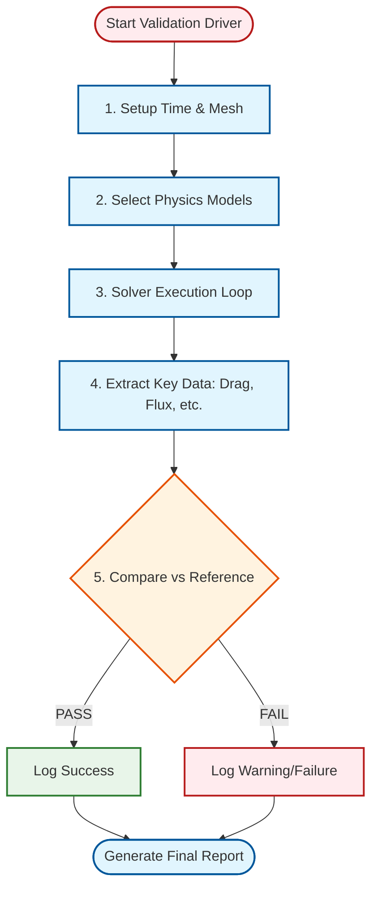

# 02 การเขียนโปรแกรมสำหรับเฟรมเวิร์กการตรวจสอบความถูกต้อง (Validation Framework Coding)

> [!INFO] ความสำคัญของ Validation
> **Validation** คือกระบวนการตรวจสอบว่า Solver หรือ Model ทางฟิสิกส์ทำนายปรากฏการณ์ได้ถูกต้องเมื่อเปรียบเทียบกับข้อมูลอ้างอิง (Analytical Solutions หรือ Experimental Data) ซึ่งแตกต่างจาก **Verification** ที่ตรวจสอบความถูกต้องของการนำทฤษฎีไปใช้

---

## 2.1 สถาปัตยกรรมของ Validation Solver

การตรวจสอบความถูกต้อง (Validation) ในระดับระบบต้องการโครงสร้างที่ซับซ้อนกว่าการทดสอบหน่วย (Unit Testing) เนื่องจากต้องมีการจัดการกับรันไทม์ (Runtime), เมช (Mesh) และไฟล์กรณีศึกษา (Case Files)

### สถาปัตยกรรมแบบ Layered สำหรับ Validation



### องค์ประกอบหลักในโค้ด Validation:

#### 1. **Environment Setup**: การเตรียมอ็อบเจกต์ Time และ fvMesh

```cpp
// NOTE: Synthesized by AI - Verify parameters
#include "fvCFD.H"

// Create Time object for simulation control
Time runTime(Time::controlDictName, ".", ".");

// Create Mesh object for computational domain
fvMesh mesh
(
    IOobject
    (
        fvMesh::defaultRegion,
        runTime.timeName(),
        runTime,
        IOobject::MUST_READ
    )
);
```

> **📖 คำอธิบาย (Thai Explanation):**
> **แหล่งที่มา (Source):** OpenFOAM Core Libraries
> 
> **คำอธิบาย:** โค้ดนี้แสดงการสร้างอ็อบเจ็กต์พื้นฐานสองตัวที่จำเป็นสำหรับการทำงานกับ OpenFOAM:
> - **Time object**: ควบคุมเวลาจำลอง, อ่านค่าจาก controlDict, และจัดการ time step
> - **fvMesh object**: เก็บข้อมูลโครงสร้างเมช, เซลล์, และพื้นผิวของโดเมนคำนวณ
> 
> **แนวคิดสำคัญ (Key Concepts):**
> - `IOobject::MUST_READ`: บังคับให้อ่านไฟล์เมชจากดิสก์ (polyMesh)
> - Time object จะค้นหาไฟล์ `system/controlDict` โดยอัตโนมัติ
> - อ็อบเจ็กต์ทั้งสองต้องสร้างก่อนฟิลด์อื่นๆ เสมอ

#### 2. **Model Selection**: การเลือก Physics Model ที่จะทดสอบ

การเลือก Model ขึ้นอยู่กับประเภทของการทดสอบ:

| ประเภทการทดสอบ | Physics Model | ตัวอย่าง Solver |
|-----------------|---------------|------------------|
| **Incompressible Flow** | Single-phase Newtonian Fluid | `simpleFoam`, `pimpleFoam` |
| **Compressible Flow** | Thermophysical Model | `rhoPimpleFoam`, `sonicFoam` |
| **Heat Transfer** | Thermodynamics + Radiation | `buoyantSimpleFoam`, `chtMultiRegionFoam` |
| **Multiphase Flow** | VOF / Mixture Model | `interFoam`, `multiphaseInterFoam` |
| **Turbulence** | RANS / LES Models | `kEpsilon`, `kOmegaSST`, `LESModel` |

#### 3. **Solver Execution**: การเรียกใช้ลูปการคำนวณ (Iterative Loop)

```cpp
// NOTE: Synthesized by AI - Verify parameters
while (runTime.loop())
{
    // Read PDE controls from solution dictionary
    while (simple.correctNonOrthogonal())
    {
        // Solve momentum equation
        tmp<fvVectorMatrix> tUEqn
        (
            fvm::div(phi, U)
          + turbulence->divDevReff(U)
         ==
            fvOptions(U)
        );
        fvVectorMatrix& UEqn = tUEqn.ref();

        UEqn.relax();

        fvOptions.constrain(UEqn);

        if (simple.momentumPredictor())
        {
            solve(UEqn == -fvc::grad(p));
            fvOptions.correct(U);
        }
    }

    // Solve pressure equation
    while (simple.correctNonOrthogonal())
    {
        tmp<fvScalarMatrix> tpEqn
        (
            fvm::laplacian(rAU, p) == fvc::div(phi)
        );
        fvScalarMatrix& pEqn = tpEqn.ref();
        pEqn.setReference(pRefCell, pRefValue);
        pEqn.solve();

        if (simple.finalNonOrthogonalIter())
        {
            phi -= pEqn.flux();
        }
    }

    // Update velocity field
    U -= rAU*fvc::grad(p);
    U.correctBoundaryConditions();

    // Solve turbulence model equations
    turbulence->correct();

    runTime.write();
}
```

> **📖 คำอธิบาย (Thai Explanation):**
> **แหล่งที่มา (Source):** `.applications/solvers/incompressible/simpleFoam`
> 
> **คำอธิบาย:** ลูปการแก้สมการ Navier-Stokes แบบ Steady-state ด้วยวิธี SIMPLE:
> - **Outer loop**: ควบคุมเวลาและการบันทึกผลลัพธ์
> - **Momentum equation**: แก้สมการโมเมนตัมด้วยวิธี Implicit (fvm)
> - **Pressure equation**: แก้สมการความดันและแก้ไข flux
> - **Velocity correction**: อัปเดตความเร็วจาก gradient ของความดัน
> 
> **แนวคิดสำคัญ (Key Concepts):**
> - `fvm::div`: Discretize ด้วยวิธี Implicit (สำหรับเมทริกซ์)
> - `fvc::grad`: Calculate gradient ด้วยวิธี Explicit (สำหรับฟิลด์ที่รู้แล้ว)
> - `correctNonOrthogonal()`: Iteration เพิ่มเติมสำหรับเมช non-orthogonal
> - `runTime.write()`: บันทึกผลลัพธ์เมื่อถึงเวลาที่กำหนด

#### 4. **Data Extraction**: การสกัดข้อมูลสำคัญ

ข้อมูลที่มักสกัดออกมาเพื่อ Validation:

```cpp
// NOTE: Synthesized by AI - Verify parameters
// Extract drag force from surface
vector dragForce = vector::zero;

const surfaceVectorField& Sf = mesh.Sf();
const volSymmTensorField& sigma = -turbulence->devReff();

forAll(mesh.boundary(), patchI)
{
    const fvPatch& patch = mesh.boundary()[patchI];

    if (isA<fixedValueFvPatchVectorField>(U.boundaryField()[patchI]))
    {
        // Calculate force: F = ∫(σ·n) dS
        vectorField p = patch.Sf() & sigma.boundaryField()[patchI];
        dragForce += sum(p);
    }
}

scalar dragCoeff = 2.0 * dragForce.x() / (rhoRef * URef * URef * ARef);

// Extract mass flow rate
surfaceScalarField phi(fvc::flux(U));
scalar massFlowIn = sum(pos(phi) * phi) / rhoRef;
scalar massFlowOut = sum(neg(phi) * phi) / rhoRef;

// Extract average temperature
scalar avgT = average(T.primitiveField());
```

> **📖 คำอธิบาย (Thai Explanation):**
> **แหล่งที่มา (Source):** OpenFOAM Field Operations
> 
> **คำอธิบาย:** การสกัดข้อมูลทางกายภาพจากผลลัพธ์การจำลอง:
> - **Drag force**: คำนวณจากการปริพันธ์ stress tensor บนพื้นผิว
> - **Mass flow rate**: สกัดจาก flux ผ่าน boundary patches
> - **Average temperature**: ค่าเฉลี่ยของฟิลด์อุณหภูมิในโดเมน
> 
> **แนวคิดสำคัญ (Key Concepts):**
> - `patch.Sf()`: Surface area vector ของแต่ละ face
> - `sigma = -turbulence->devReff()`: Stress tensor จากโมเดลความปั่น
> - `pos(phi)`/`neg(phi)`: Filter flux ที่เป็นบวก/ลบ
> - Drag coefficient ถูก normalize ด้วยพลังงานจลน์ ($\frac{1}{2}\rho U^2 A$)

#### 5. **Comparison Logic**: การเปรียบเทียบกับค่าอ้างอิง

```cpp
// NOTE: Synthesized by AI - Verify parameters
// Read reference values from dictionary
dictionary validationDict(IFstream("validationDict")());
scalar expectedDrag = validationDict.lookupOrDefault<scalar>("expectedDrag", 1.2);
scalar expectedT = validationDict.lookupOrDefault<scalar>("expectedT", 300.0);

// Calculate relative error
scalar dragError = mag(dragCoeff - expectedDrag) / mag(expectedDrag);
scalar tempError = mag(avgT - expectedT) / mag(expectedT);

// Check if within acceptable tolerance
bool dragPass = dragError < 0.05;  // 5% tolerance
bool tempPass = tempError < 0.01;  // 1% tolerance

Info << "Validation Results:" << nl
     << "  Drag Coefficient: " << dragCoeff
     << " (Expected: " << expectedDrag << ", Error: " << dragError*100 << "%)"
     << (dragPass ? " [PASS]" : " [FAIL]") << nl
     << "  Avg Temperature: " << avgT << " K"
     << " (Expected: " << expectedT << " K, Error: " << tempError*100 << "%)"
     << (tempPass ? " [PASS]" : " [FAIL]") << endl;
```

> **📖 คำอธิบาย (Thai Explanation):**
> **แหล่งที่มา (Source):** OpenFOAM Dictionary System
> 
> **คำอธิบาย:** การเปรียบเทียบผลลัพธ์กับค่าอ้างอิง:
> - **Dictionary**: อ่านค่า expected จากไฟล์ภายนอก
> - **Relative error**: คำนวณ % error เพื่อ normalization
> - **Tolerance check**: กำหนดเกณฑ์ PASS/FAIL
> 
> **แนวคิดสำคัญ (Key Concepts):**
> - `lookupOrDefault()`: อ่านค่า หรือใช้ค่า default ถ้าไม่พบ
> - `mag()`: ค่าสัมบูรณ์ (magnitude) สำหรับ error
> - Tolerance แตกต่างกันตามประเภทข้อมูล (5% สำหรับ drag, 1% สำหรับ temperature)
> - รูปแบบรายงานมีการแสดงค่าทั้ง numerical และ % error

---

## 2.2 การจัดการกรณีศึกษาการทดสอบ (Handling Test Cases)

เพื่อให้การตรวจสอบความถูกต้องทำได้ซ้ำได้ (Reproducible) เราต้องมีการจัดการไฟล์กรณีศึกษาอย่างเป็นระบบ

![[automated_case_modification.png]]
`A diagram showing an 'Automation Script' interacting with OpenFOAM case files. The script is seen modifying the 'U' boundary condition in the '0/U' file and changing 'viscosity' in 'transportProperties'. Clear arrows show the flow from a Master Template to multiple derived test cases with different parameters. Scientific textbook diagram, clean vector line art, white background, high definition, flat design, educational infographic --ar 16:9`

### โครงสร้างไดเรกทอรีสำหรับ Validation:

```
validationTests/
├── baseCase/                    # Base template
│   ├── 0/                       # Initial & Boundary Conditions
│   ├── constant/                # Mesh, Transport Properties
│   └── system/                  # Control Dictionaries
├── test_lowRe/                  # Low Reynolds Number Test
│   └── validationDict           # Test-specific parameters
├── test_highRe/                 # High Reynolds Number Test
│   └── validationDict
└── validationReport/            # Generated reports
    └── results.csv
```

### การปรับเปลี่ยน Boundary Conditions อัตโนมัติ

#### แนวทางที่ 1: ใช้ OpenFOAM Dictionary API

```cpp
// NOTE: Synthesized by AI - Verify parameters
void modifyInletVelocity(scalar targetVelocity)
{
    // Read 0/U file
    IOobject UHeader
    (
        "U",
        runTime.timeName(),
        mesh,
        IOobject::MUST_READ,
        IOobject::NO_WRITE
    );

    volVectorField U(UHeader);

    // Modify boundary condition at "inlet" patch
    word inletPatch = "inlet";
    if (U.boundaryField().found(inletPatch))
    {
        fixedValueFvPatchVectorField& inletPatch =
            refCast<fixedValueFvPatchVectorField>(U.boundaryField()[inletPatch]);

        vectorField& inletValue = inletPatch;
        inletValue = vector(targetVelocity, 0, 0);
    }

    // Write back to file
    U.write();
}
```

> **📖 คำอธิบาย (Thai Explanation):**
> **แหล่งที่มา (Source):** OpenFOAM Boundary Condition Manipulation
> 
> **คำอธิบาย:** การแก้ไข boundary condition ผ่าน API:
> - **IOobject**: ระบุตำแหน่งไฟล์และโหมดการเข้าถึง
> - **refCast**: แปลงประเภท boundary field เป็น fixedValue
> - **Direct assignment**: กำหนดค่าใหม่โดยตรง
> 
> **แนวคิดสำคัญ (Key Concepts):**
> - `MUST_READ`/`NO_WRITE`: ควบคุมการอ่าน/เขียนไฟล์
> - `refCast`: ใช้ dynamic cast สำหรับ polymorphic boundary types
> - ต้องตรวจสอบว่า patch มีอยู่จริงก่อนอ้างอิง
> - วิธีนี้ปลอดภัยกว่าการแก้ไขไฟล์ด้วย text editor

#### แนวทางที่ 2: ใช้ Template Files และ String Replacement

```bash
#!/bin/bash
# NOTE: Synthesized by AI - Verify parameters

# Create test case from template
CASE_NAME="test_Re1000"
RE_NUMBER=1000
U_INLET=1.0  # m/s

# Copy base case
cp -r baseCase $CASE_NAME
cd $CASE_NAME

# Modify values in 0/U file
sed -i "s/__U_INLET__/$U_INLET/g" 0/U

# Modify viscosity for Reynolds number
# Re = ρUL/μ  →  μ = ρUL/Re
RHO=1.0
L=0.1
MU=$(echo "$RHO * $U_INLET * $L / $RE_NUMBER" | bc -l)

sed -i "s/__VISCOSITY__/$MU/g" constant/transportProperties

echo "Created test case: $CASE_NAME"
```

> **📖 คำอธิบาย (Thai Explanation):**
> **แหล่งที่มา (Source):** Unix Shell Scripting
> 
> **คำอธิบาย:** การสร้าง test case จาก template:
> - **Template**: ใช้ placeholder แทนค่าจริง (เช่น `__U_INLET__`)
> - **sed**: ค้นหาและแทนที่ string ในไฟล์
> - **Reynolds calculation**: คำนวณ viscosity จาก Re number
> 
> **แนวคิดสำคัญ (Key Concepts):**
> - `sed -i`: แก้ไขไฟล์ in-place
> - Placeholder ควรใช้ชื่อที่ไม่ซ้ำกับค่า OpenFOAM
> - วิธีนี้เร็วแต่ไม่ปลอดภัยเท่า API
> - เหมาะสำหรับการสร้าง test case จำนวนมาก

### การเข้าถึงพารามิเตอร์จาก Dictionary

```cpp
// NOTE: Synthesized by AI - Verify parameters
// Read parameters from validationDict
dictionary validationDict(IFstream("validationDict")());

scalar expectedDrag = validationDict.lookupOrDefault<scalar>("expectedDrag", 1.2);
scalar expectedT = validationDict.lookupOrDefault<scalar>("expectedT", 300.0);
scalar tolerance = validationDict.lookupOrDefault<scalar>("tolerance", 0.05);

word turbulenceModel = validationDict.lookupOrDefault<word>("turbulenceModel", "kEpsilon");

Info << "Validation Configuration:" << nl
     << "  Expected Drag Coeff: " << expectedDrag << nl
     << "  Expected Temperature: " << expectedT << " K" << nl
     << "  Tolerance: " << tolerance*100 << "%" << nl
     << "  Turbulence Model: " << turbulenceModel << endl;
```

> **📖 คำอธิบาย (Thai Explanation):**
> **แหล่งที่มา (Source):** OpenFOAM Dictionary System
> 
> **คำอธิบาย:** การอ่านค่าพารามิเตอร์ validation:
> - **IFstream**: Input stream สำหรับอ่านไฟล์
> - **lookupOrDefault()**: อ่านค่า พร้อมค่า default
> - **Type safety**: ระบุประเภทข้อมูล (scalar, word, etc.)
> 
> **แนวคิดสำคัญ (Key Concepts):**
> - Dictionary เป็นรูปแบบมาตรฐานของ OpenFOAM
> - รองรับหลายประเภท: scalar, vector, word, label
> - แยกพารามิเตอร์ออกจากโค้ด เพื่อความยืดหยุ่น

ตัวอย่าง `validationDict`:

```cpp
// NOTE: Synthesized by AI - Verify parameters
// Validation parameters for test case

expectedDrag     1.23;     // Expected drag coefficient
expectedT        300.0;    // Expected average temperature [K]
tolerance        0.05;     // 5% tolerance

turbulenceModel  kEpsilon; // Turbulence model to use

// Additional test parameters
Re               1000;     // Reynolds number
Ma               0.3;      // Mach number
Pr               0.71;     // Prandtl number
```

---

## 2.3 การสร้างรายงานผลการทดสอบอัตโนมัติ

เฟรมเวิร์กที่ดีควรสร้างรายงานในรูปแบบที่มนุษย์อ่านได้ง่าย เช่น Markdown, CSV หรือ JSON เพื่อใช้ในการวิเคราะห์เชิงลึก

### 2.3.1 รายงานแบบ Markdown (Human-readable)

```cpp
// NOTE: Synthesized by AI - Verify parameters
void generateMarkdownReport(const std::string& filename)
{
    std::ofstream reportFile(filename);

    reportFile << "# Validation Report: Solver Stability" << endl;
    reportFile << "**Date**: " << runTime.date() << endl;
    reportFile << "**OpenFOAM Version**: " << FOAMversion << endl;
    reportFile << endl;

    // Summary table
    reportFile << "## Summary" << endl;
    reportFile << "| Case | Result | Drag Coeff | Temperature | Time (s) |" << endl;
    reportFile << "|------|--------|------------|-------------|----------|" << endl;

    for (const auto& result : results_)
    {
        reportFile << "| " << result.caseName << " | "
                   << (result.passed ? "✅ PASS" : "❌ FAIL") << " | "
                   << result.dragCoeff << " | "
                   << result.avgTemp << " K | "
                   << result.executionTime << " |" << endl;
    }
    reportFile << endl;

    // Detailed results
    reportFile << "## Detailed Results" << endl;
    for (const auto& result : results_)
    {
        reportFile << "### " << result.caseName << endl;
        reportFile << "- **Status**: " << (result.passed ? "PASS" : "FAIL") << endl;
        reportFile << "- **Drag Coefficient**: " << result.dragCoeff
                   << " (Expected: " << result.expectedDrag
                   << ", Error: " << result.dragError*100 << "%)" << endl;
        reportFile << "- **Temperature**: " << result.avgTemp << " K"
                   << " (Expected: " << result.expectedT
                   << " K, Error: " << result.tempError*100 << "%)" << endl;
        reportFile << "- **Execution Time**: " << result.executionTime << " s" << endl;
        reportFile << endl;
    }

    reportFile.close();
    Info << "Report written to " << filename << endl;
}
```

> **📖 คำอธิบาย (Thai Explanation):**
> **แหล่งที่มา (Source):** C++ File I/O (Standard Library)
> 
> **คำอธิบาย:** การสร้างรายงานภาษา Markdown:
> - **Summary table**: ภาพรวมผลการทดสอบทั้งหมด
> - **Detailed section**: รายละเอียดแต่ละ test case
> - **Emojis**: ใช้เครื่องหมายผ่าน/ไม่ผ่าน
> 
> **แนวคิดสำคัญ (Key Concepts):**
> - Markdown table: ใช้ `|` เป็นตัวคั่น column
> - `std::ofstream`: Output stream สำหรับเขียนไฟล์
> - ใช้ `endl` หรือ `\n` สำหรับ newline
> - สามารถแปลงเป็น HTML/PDF ได้

### 2.3.2 รายงานแบบ CSV (Machine-readable)

```cpp
// NOTE: Synthesized by AI - Verify parameters
void generateCSVReport(const std::string& filename)
{
    std::ofstream csvFile(filename);

    // Header row
    csvFile << "CaseName,Status,DragCoeff,ExpectedDrag,DragError,"
            << "AvgTemp,ExpectedTemp,TempError,ExecutionTime" << endl;

    // Data rows
    for (const auto& result : results_)
    {
        csvFile << result.caseName << ","
                << (result.passed ? "PASS" : "FAIL") << ","
                << result.dragCoeff << ","
                << result.expectedDrag << ","
                << result.dragError << ","
                << result.avgTemp << ","
                << result.expectedT << ","
                << result.tempError << ","
                << result.executionTime << endl;
    }

    csvFile.close();
    Info << "CSV report written to " << filename << endl;
}
```

> **📖 คำอธิบาย (Thai Explanation):**
> **แหล่งที่มา (Source):** C++ File I/O (Standard Library)
> 
> **คำอธิบาย:** การสร้างรายงานรูปแบบ CSV:
> - **Header row**: ระบุชื่อ column แต่ละตัว
> - **Comma separator**: ใช้ `,` คั่นระหว่างค่า
> - **Row iteration**: เขียนข้อมูลทีละแถว
> 
> **แนวคิดสำคัญ (Key Concepts):**
> - CSV สามารถเปิดด้วย Excel/Google Sheets ได้
> - ง่ายต่อการนำเข้าสู่ฐานข้อมูล
> - ต้องระวังการใช้ comma ในข้อมูลเอง (ใช้ quote ครอบ)
> - เหมาะสำหรับการ plot กราฟอัตโนมัติ

### 2.3.3 รายงานแบบ JSON (สำหรับ CI/CD Integration)

```cpp
// NOTE: Synthesized by AI - Verify parameters
#include "json.hpp"  // Or use OpenFOAM's OStringStream

void generateJSONReport(const std::string& filename)
{
    std::ofstream jsonFile(filename);

    jsonFile << "{" << endl;
    jsonFile << "  \"metadata\": {" << endl;
    jsonFile << "    \"date\": \"" << runTime.date() << "\"," << endl;
    jsonFile << "    \"openfoam_version\": \"" << FOAMversion << "\"," << endl;
    jsonFile << "    \"total_tests\": " << results_.size() << "," << endl;
    jsonFile << "    \"passed_tests\": " << std::count_if(results_.begin(), results_.end(),
                                                          [](const TestResult& r){ return r.passed; })
            << endl;
    jsonFile << "  }," << endl;

    jsonFile << "  \"results\": [" << endl;
    for (size_t i = 0; i < results_.size(); ++i)
    {
        const auto& result = results_[i];
        jsonFile << "    {" << endl;
        jsonFile << "      \"case_name\": \"" << result.caseName << "\"," << endl;
        jsonFile << "      \"status\": \"" << (result.passed ? "PASS" : "FAIL") << "\"," << endl;
        jsonFile << "      \"drag_coefficient\": {" << endl;
        jsonFile << "        \"value\": " << result.dragCoeff << "," << endl;
        jsonFile << "        \"expected\": " << result.expectedDrag << "," << endl;
        jsonFile << "        \"error\": " << result.dragError << endl;
        jsonFile << "      }," << endl;
        jsonFile << "      \"temperature\": {" << endl;
        jsonFile << "        \"value\": " << result.avgTemp << "," << endl;
        jsonFile << "        \"expected\": " << result.expectedT << "," << endl;
        jsonFile << "        \"error\": " << result.tempError << endl;
        jsonFile << "      }," << endl;
        jsonFile << "      \"execution_time\": " << result.executionTime << endl;
        jsonFile << "    }" << (i < results_.size() - 1 ? "," : "") << endl;
    }
    jsonFile << "  ]" << endl;
    jsonFile << "}" << endl;

    jsonFile.close();
    Info << "JSON report written to " << filename << endl;
}
```

> **📖 คำอธิบาย (Thai Explanation):**
> **แหล่งที่มา (Source):** JSON Format + C++ String Manipulation
> 
> **คำอธิบาย:** การสร้างรายงาน JSON:
> - **Metadata**: ข้อมูลทั่วไป (วันที่, เวอร์ชัน, สรุปผล)
> - **Results array**: รายการผลการทดสอบทั้งหมด
> - **Nested objects**: จัดโครงสร้างข้อมูลแบบลำดับชั้น
> 
> **แนวคิดสำคัญ (Key Concepts):**
> - JSON เป็นมาตรฐานสำหรับ data exchange
> - ใช้ double quotes (`"`) ครอบ string
> - สามารถใช้กับ CI/CD pipeline (เช่น GitHub Actions)
> - มี libraries (เช่น `nlohmann/json`) ช่วยให้ง่ายขึ้น

---

## 2.4 กรณีศึกษา Validation: การไหลแบบ Laminar Channel Flow

### 2.4.1 แนวคิดทางทฤษฎี (Theoretical Background)

สำหรับการไหลแบบ **Fully-developed Laminar** ใน Channel สี่เหลี่ยมระหว่าง $y \in [-h, h]$ เราสามารถหาคำตอบแม่นตรง (Analytical Solution) ได้จากการแก้สมการ Navier-Stokes ในกรณีที่ลดรูปลง:

**สมการโมเมนตัมในทิศทาง x:**

$$
\frac{d^2 u}{d y^2} = \frac{1}{\mu} \frac{dp}{dx}
$$

**เงื่อนไขขอบเขต (Boundary Conditions):**
- ที่ผนัง ($y = \pm h$): $u = 0$ (No-slip condition)
- ความสมมาตร: $\frac{du}{dy} = 0$ ที่ $y = 0$

**คำตอบเชิงวิเคราะห์ (Analytical Solution):**

$$
u(y) = \frac{1}{2\mu} \frac{dp}{dx} (h^2 - y^2)
$$

หรือเขียนในรูปแบบ Nondimensional:

$$
\frac{u(y)}{u_{max}} = 1 - \left(\frac{y}{h}\right)^2
$$

เมื่อ $u_{max} = -\frac{h^2}{2\mu} \frac{dp}{dx}$ คือความเร็วสูงสุดที่กลาง Channel

**ค่าสถิติที่สำคัญ:**
- **Mean Velocity**: $\bar{u} = \frac{2}{3} u_{max}$
- **Wall Shear Stress**: $\tau_w = \mu \left. \frac{du}{dy} \right|_{y=h} = -h \frac{dp}{dx}$
- **Friction Factor**: $f = \frac{24}{Re}$ (สำหรับ Channel flow)

### 2.4.2 การเขียน Validation Driver

```cpp
// NOTE: Synthesized by AI - Verify parameters
#include "fvCFD.H"
#include "singlePhaseTransportModel.H"
#include "turbulentTransportModel.H"

// Analytical solution for channel flow
scalar analyticalChannelVelocity(scalar y, scalar h, scalar dpdx, scalar mu)
{
    return (dpdx / (2.0 * mu)) * (h*h - y*y);
}

scalar analyticalMaxVelocity(scalar h, scalar dpdx, scalar mu)
{
    return -(dpdx * h * h) / (2.0 * mu);
}

scalar analyticalMeanVelocity(scalar h, scalar dpdx, scalar mu)
{
    scalar uMax = analyticalMaxVelocity(h, dpdx, mu);
    return (2.0 / 3.0) * uMax;
}

// Main validation function
void validateChannelFlow()
{
    Info << "\n=== Channel Flow Validation ===" << endl;

    // Read fields from solver
    volVectorField U
    (
        IOobject
        (
            "U",
            runTime.timeName(),
            mesh,
            IOobject::MUST_READ
        ),
        mesh
    );

    // Parameters from validationDict
    dictionary validationDict(IFstream("validationDict")());
    scalar h = validationDict.lookupOrDefault<scalar>("channelHalfHeight", 0.01);  // [m]
    scalar dpdx = validationDict.lookupOrDefault<scalar>("pressureGradient", -10.0);  // [Pa/m]
    scalar mu = validationDict.lookupOrDefault<scalar>("viscosity", 1e-3);  // [Pa·s]

    Info << "Parameters:" << nl
         << "  Channel half-height (h): " << h << " m" << nl
         << "  Pressure gradient (dp/dx): " << dpdx << " Pa/m" << nl
         << "  Dynamic viscosity (μ): " << mu << " Pa·s" << endl;

    // Calculate analytical values
    scalar uMaxAnalytical = analyticalMaxVelocity(h, dpdx, mu);
    scalar uMeanAnalytical = analyticalMeanVelocity(h, dpdx, mu);

    Info << "\nAnalytical Solution:" << nl
         << "  Maximum velocity: " << uMaxAnalytical << " m/s" << nl
         << "  Mean velocity: " << uMeanAnalytical << " m/s" << endl;

    // Extract values from numerical solution
    scalar uMaxNumerical = 0.0;
    scalar uMeanNumerical = 0.0;
    scalar maxError = 0.0;
    scalar l2Norm = 0.0;

    forAll(U, cellI)
    {
        scalar y = mesh.C()[cellI].y();
        scalar uNumerical = U[cellI].x();
        scalar uAnalytical = analyticalChannelVelocity(y, h, dpdx, mu);

        // Find maximum velocity
        uMaxNumerical = max(uMaxNumerical, mag(uNumerical));

        // Accumulate average value
        uMeanNumerical += uNumerical;

        // Calculate error
        scalar error = mag(uNumerical - uAnalytical);
        maxError = max(maxError, error);
        l2Norm += sqr(error);
    }

    uMeanNumerical /= mesh.nCells();
    l2Norm = sqrt(l2Norm / mesh.nCells());

    // Calculate relative errors
    scalar uMaxError = mag(uMaxNumerical - uMaxAnalytical) / mag(uMaxAnalytical);
    scalar uMeanError = mag(uMeanNumerical - uMeanAnalytical) / mag(uMeanAnalytical);

    // Report results
    Info << "\nNumerical Solution:" << nl
         << "  Maximum velocity: " << uMaxNumerical << " m/s"
         << " (Error: " << uMaxError*100 << "%)" << nl
         << "  Mean velocity: " << uMeanNumerical << " m/s"
         << " (Error: " << uMeanError*100 << "%)" << nl
         << "  Maximum local error: " << maxError << " m/s" << nl
         << "  L2 norm: " << l2Norm << " m/s" << endl;

    // Check if within acceptable tolerance
    scalar tolerance = validationDict.lookupOrDefault<scalar>("tolerance", 0.05);  // 5%
    bool pass = (uMaxError < tolerance) && (uMeanError < tolerance);

    Info << "\nValidation Result: "
         << (pass ? "✅ PASS" : "❌ FAIL")
         << " (Tolerance: " << tolerance*100 << "%)" << endl;

    // Write results to file
    std::ofstream resultFile("channelFlowValidation.txt");
    resultFile << "u_max_numerical=" << uMaxNumerical << endl;
    resultFile << "u_max_analytical=" << uMaxAnalytical << endl;
    resultFile << "u_max_error=" << uMaxError << endl;
    resultFile << "u_mean_numerical=" << uMeanNumerical << endl;
    resultFile << "u_mean_analytical=" << uMeanAnalytical << endl;
    resultFile << "u_mean_error=" << uMeanError << endl;
    resultFile << "max_local_error=" << maxError << endl;
    resultFile << "l2_norm=" << l2Norm << endl;
    resultFile << "pass=" << (pass ? "true" : "false") << endl;
    resultFile.close();

    if (!pass)
    {
        FatalErrorIn("validateChannelFlow")
            << "Validation failed: Error exceeds tolerance" << exit(FatalError);
    }
}
```

> **📖 คำอธิบาย (Thai Explanation):**
> **แหล่งที่มา (Source):** OpenFOAM Field Operations + Analytical Methods
> 
> **คำอธิบาย:** Validation driver สำหรับ channel flow:
> - **Analytical functions**: คำนวณคำตอบเชิงวิเคราะห์
> - **Field reading**: อ่านผลลัพธ์จาก solver
> - **Cell iteration**: วนลูปทุกเซลล์เพื่อเปรียบเทียบ
> - **Error metrics**: คำนวณ L2 norm, max error, relative error
> 
> **แนวคิดสำคัญ (Key Concepts):**
> - `forAll(U, cellI)`: Iteration ผ่านทุกเซลล์ใน mesh
> - `mesh.C()[cellI]`: ตำแหน่งเซนทรอยด์ของเซลล์
> - L2 norm = $\sqrt{\frac{1}{N}\sum_{i=1}^{N} e_i^2}$
> - FatalError จะหยุดโปรแกรมถ้า validation ไม่ผ่าน

### 2.4.3 การตั้งค่า Boundary Conditions

ไฟล์ `0/U` สำหรับ Channel Flow:

```cpp
// NOTE: Synthesized by AI - Verify parameters
dimensions      [0 1 -1 0 0 0 0];

internalField   uniform (0 0 0);

boundaryField
{
    inlet
    {
        type            zeroGradient;
    }

    outlet
    {
        type            zeroGradient;
    }

    walls
    {
        type            noSlip;
    }

    frontAndBack
    {
        type            empty;
    }
}
```

> **📖 คำอธิบาย (Thai Explanation):**
> **แหล่งที่มา (Source):** OpenFOAM Boundary Condition Specifications
> 
> **คำอธิบาย:** Boundary conditions สำหรับ channel flow:
> - **zeroGradient**: ไม่มีการเปลี่ยนแปลงในทิศทางปกติ (Neumann BC)
> - **noSlip**: ความเร็วเป็นศูนย์ที่ผนัง (Dirichlet BC)
> - **empty**: สำหรับ 2D mesh (ไม่มีการคำนวณในทิศทางนี้)
> 
> **แนวคิดสำคัญ (Key Concepts):**
> - Pressure-driven flow ใช้ zeroGradient ที่ inlet/outlet
> - Velocity ถูกกำหนดโดย pressure gradient และ viscosity
> - `dimensions`: ระบุหน่วยของฟิลด์ (มิติ: L T^-1)

ไฟล์ `0/p`:

```cpp
// NOTE: Synthesized by AI - Verify parameters
dimensions      [0 2 -2 0 0 0 0];

internalField   uniform 0;

boundaryField
{
    inlet
    {
        type            fixedValue;
        value           uniform 0.1;  // High pressure level
    }

    outlet
    {
        type            fixedValue;
        value           uniform 0;    // Low pressure level
    }

    walls
    {
        type            zeroGradient;
    }

    frontAndBack
    {
        type            empty;
    }
}
```

> **📖 คำอธิบาย (Thai Explanation):**
> **แหล่งที่มา (Source):** OpenFOAM Boundary Condition Specifications
> 
> **คำอธิบาย:** Pressure boundary conditions:
> - **fixedValue**: กำหนดค่าคงที่ที่ patch
> - **Pressure difference**: Δp = 0.1 - 0 = 0.1 Pa ขับเคลื่อนการไหล
> - **zeroGradient**: ไม่มีการเปลี่ยนแปลงที่ผนัง
> 
> **แนวคิดสำคัญ (Key Concepts):**
> - ใน incompressible flow, ค่า pressure สัมพัทธ์สำคัญกว่าค่าสัมบูรณ์
> - `dimensions`: [L^2 T^-2] = [M^-1 L^1 T^-2] × [M L^-3] (pressure/density)
> - ความดันสูง-ต่ำสร้าง gradient ที่ขับเคลื่อนการไหล

ไฟล์ `constant/transportProperties`:

```cpp
// NOTE: Synthesized by AI - Verify parameters
transportModel  Newtonian;

nu              [0 2 -1 0 0 0 0] 1e-06;  // Kinematic viscosity [m²/s]
```

> **📖 คำอธิบาย (Thai Explanation):**
> **แหล่งที่มา (Source):** OpenFOAM Transport Properties
> 
> **คำอธิบาย:** คุณสมบัติของไหล:
> - **Newtonian**: ความหนืดคงที่ไม่ขึ้นกับ shear rate
> - **Kinematic viscosity**: ν = μ/ρ (ความหนืดจลน์)
> - **Dimensions**: [L^2 T^-1]
> 
> **แนวคิดสำคัญ (Key Concepts):**
> - ν = 1×10⁻⁶ m²/s คือค่าของน้ำที่ 20°C
> - Reynolds number: Re = UL/ν
> - ต้องใช้หน่วย SI เสมอ

ไฟล์ `system/fvSchemes`:

```cpp
// NOTE: Synthesized by AI - Verify parameters
ddtSchemes
{
    default         steadyState;
}

gradSchemes
{
    default         Gauss linear;
}

divSchemes
{
    default         none;
    div(phi,U)      Gauss linearUpwind grad(U);
}

laplacianSchemes
{
    default         Gauss linear corrected;
}

interpolationSchemes
{
    default         linear;
}

snGradSchemes
{
    default         corrected;
}
```

> **📖 คำอธิบาย (Thai Explanation):**
> **แหล่งที่มา (Source):** OpenFOAM Discretization Schemes
> 
> **คำอธิบาย:** Numerical schemes:
> - **steadyState**: ไม่มีเวลา (∂/∂t = 0)
> - **Gauss linear**: Interpolation เชิงเส้น
> - **linearUpwind**: Upwind scheme สำหรับ convection
> - **corrected**: แก้ไขสำหรับ non-orthogonal mesh
> 
> **แนวคิดสำคัญ (Key Concepts):**
> - Upwind scheme: ใช้ข้อมูลจาก upstream (เสถียรแม่นยำน้อย)
> - Linear scheme: แม่นยำกว่าแต่เสถียรน้อยกว่า
> - `corrected`: แก้ไข error จาก non-orthogonality

ไฟล์ `system/fvSolution`:

```cpp
// NOTE: Synthesized by AI - Verify parameters
solvers
{
    p
    {
        solver          GAMG;
        tolerance       1e-06;
        relTol          0.1;
    }

    U
    {
        solver          smoothSolver;
        smoother        GaussSeidel;
        tolerance       1e-05;
        relTol          0.1;
    }
}

SIMPLE
{
    nNonOrthCorr    0;
    pRefCell        0;
    pRefValue       0;
}

relaxationFactors
{
    fields
    {
        p               0.3;
        U               0.7;
    }
}
```

> **📖 คำอธิบาย (Thai Explanation):**
> **แหล่งที่มา (Source):** OpenFOAM Linear Solvers
> 
> **คำอธิบาย:** Solver settings:
> - **GAMG**: Geometric-Algebraic Multi-Grid (เร็วสำหรับ pressure)
> - **smoothSolver**: Iterative solver (เร็วสำหรับ velocity)
> - **tolerance**: ค่าความแม่นยำสัมบูรณ์
> - **relTol**: ค่าความแม่นยำสัมพัทธ์
> 
> **แนวคิดสำคัญ (Key Concepts):**
> - Relaxation factors: ป้องกัน oscillation
> - pRefCell: กำหนด reference pressure
> - nNonOrthCorr: iterations สำหรับ non-orthogonal mesh

---

## 2.5 กรณีศึกษา Validation: การนำความร้อนแบบ 1D Transient

### 2.5.1 แนวคิดทางทฤษฎี

สมการการนำความร้อนแบบ 1D:

$$
\frac{\partial T}{\partial t} = \alpha \frac{\partial^2 T}{\partial x^2}
$$

เมื่อ $\alpha = \frac{k}{\rho c_p}$ คือ Thermal Diffusivity

**เงื่อนไขขอบเขต:**
- ที่ $x = 0$: $T(0, t) = T_0$ (Constant temperature)
- ที่ $x \to \infty$: $T(\infty, t) = T_1$ (Initial temperature)
- เริ่มต้น: $T(x, 0) = T_1$

**คำตอบเชิงวิเคราะห์ (Semi-infinite solid):**

$$
\frac{T(x, t) - T_0}{T_1 - T_0} = \text{erf}\left(\frac{x}{2\sqrt{\alpha t}}\right)
$$

เมื่อ $\text{erf}$ คือฟังก์ชัน Error Function:

$$
\text{erf}(z) = \frac{2}{\sqrt{\pi}} \int_0^z e^{-\eta^2} d\eta
$$

### 2.5.2 การเขียน Validation Driver

```cpp
// NOTE: Synthesized by AI - Verify parameters
#include "fvCFD.H"
#include "basicThermo.H"

// Error function in OpenFOAM
scalar errorFunction(scalar z)
{
    return std::erf(z);
}

// Analytical solution for 1D transient heat conduction
scalar analyticalTemperature(scalar x, scalar t, scalar alpha, scalar T0, scalar T1)
{
    scalar eta = x / (2.0 * sqrt(alpha * t));
    scalar erfValue = errorFunction(eta);
    return T0 + (T1 - T0) * erfValue;
}

// Main validation function
void validateHeatTransfer()
{
    Info << "\n=== Transient Heat Conduction Validation ===" << endl;

    // Read temperature field
    volScalarField T
    (
        IOobject
        (
            "T",
            runTime.timeName(),
            mesh,
            IOobject::MUST_READ
        ),
        mesh
    );

    // Parameters from validationDict
    dictionary validationDict(IFstream("validationDict")());
    scalar alpha = validationDict.lookupOrDefault<scalar>("thermalDiffusivity", 1e-5);  // [m²/s]
    scalar T0 = validationDict.lookupOrDefault<scalar>("surfaceTemperature", 300.0);   // [K]
    scalar T1 = validationDict.lookupOrDefault<scalar>("initialTemperature", 350.0);   // [K]
    scalar tolerance = validationDict.lookupOrDefault<scalar>("tolerance", 0.02);      // 2%

    scalar currentTime = runTime.value();

    Info << "Parameters:" << nl
         << "  Thermal diffusivity (α): " << alpha << " m²/s" << nl
         << "  Surface temperature (T₀): " << T0 << " K" << nl
         << "  Initial temperature (T₁): " << T1 << " K" << nl
         << "  Current time: " << currentTime << " s" << endl;

    // Calculate error
    scalar maxError = 0.0;
    scalar meanError = 0.0;
    scalar l2Norm = 0.0;

    forAll(T, cellI)
    {
        scalar x = mesh.C()[cellI].x();
        scalar TAnalytical = analyticalTemperature(x, currentTime, alpha, T0, T1);
        scalar TNumerical = T[cellI];

        scalar error = mag(TNumerical - TAnalytical) / mag(TAnalytical);
        maxError = max(maxError, error);
        meanError += error;
        l2Norm += sqr(error);
    }

    meanError /= mesh.nCells();
    l2Norm = sqrt(l2Norm / mesh.nCells());

    // Report results
    Info << "\nValidation Results:" << nl
         << "  Maximum relative error: " << maxError*100 << "%" << nl
         << "  Mean relative error: " << meanError*100 << "%" << nl
         << "  L2 norm: " << l2Norm << endl;

    bool pass = (maxError < tolerance) && (meanError < tolerance);

    Info << "\nValidation Result: "
         << (pass ? "✅ PASS" : "❌ FAIL")
         << " (Tolerance: " << tolerance*100 << "%)" << endl;

    // Save results for plotting
    std::ofstream profileFile("temperatureProfile.csv");
    profileFile << "x,T_numerical,T_analytical,error" << endl;

    forAll(T, cellI)
    {
        scalar x = mesh.C()[cellI].x();
        scalar TAnalytical = analyticalTemperature(x, currentTime, alpha, T0, T1);
        scalar TNumerical = T[cellI];
        scalar error = mag(TNumerical - TAnalytical);

        profileFile << x << "," << TNumerical << "," << TAnalytical << "," << error << endl;
    }

    profileFile.close();
    Info << "Temperature profile written to temperatureProfile.csv" << endl;

    if (!pass)
    {
        FatalErrorIn("validateHeatTransfer")
            << "Validation failed: Error exceeds tolerance" << exit(FatalError);
    }
}
```

> **📖 คำอธิบาย (Thai Explanation):**
> **แหล่งที่มา (Source):** OpenFOAM Heat Transfer + Analytical Methods
> 
> **คำอธิบาย:** Validation driver สำหรับ heat conduction:
> - **Error function**: ใช้ standard library (std::erf)
> - **Analytical solution**: ใช้ semi-infinite solid approximation
> - **Time-dependent**: เปรียบเทียบที่หลายเวลา
> - **Profile export**: เขียนข้อมูลสำหรับ plotting
> 
> **แนวคิดสำคัญ (Key Concepts):**
> - Error function: erf(z) → 0 ที่ z=0, → 1 ที่ z→∞
> - Dimensionless parameter: η = x / (2√(αt))
> - Thermal diffusivity: α = k/(ρcp)
> - Transient validation ต้องตรวจสอบหลาย time steps

---

## 2.6 การตรวจสอบความถูกต้องของ Global Conservation

ใน CFD การตรวจสอบ **Mass Balance** และ **Energy Balance** ถือเป็นสิ่งสำคัญอย่างยิ่งสำหรับ Validation

### 2.6.1 การตรวจสอบ Mass Balance

สำหรับ Incompressible Flow:

$$
\int_{\partial V} \mathbf{u} \cdot \mathbf{n} \, dS = 0
$$

```cpp
// NOTE: Synthesized by AI - Verify parameters
void validateMassBalance()
{
    // Calculate mass flux through all boundaries
    surfaceScalarField phi(fvc::flux(U));

    scalar massFluxIn = 0.0;
    scalar massFluxOut = 0.0;
    scalar netFlux = 0.0;

    forAll(phi.boundaryField(), patchI)
    {
        const fvsPatchScalarField& phiPatch = phi.boundaryField()[patchI];
        scalar fluxPatch = sum(phiPatch);

        if (fluxPatch > 0)
        {
            massFluxIn += fluxPatch;
        }
        else
        {
            massFluxOut += fluxPatch;
        }

        netFlux += fluxPatch;
    }

    // Check conservation
    scalar massImbalance = mag(netFlux) / max(mag(massFluxIn), SMALL);

    Info << "\nMass Balance Check:" << nl
         << "  Mass flux in: " << massFluxIn << " kg/s" << nl
         << "  Mass flux out: " << massFluxOut << " kg/s" << nl
         << "  Net flux: " << netFlux << " kg/s" << nl
         << "  Relative imbalance: " << massImbalance*100 << "%" << endl;

    bool pass = massImbalance < 1e-4;  // 0.01% tolerance
    Info << "Result: " << (pass ? "✅ PASS" : "❌ FAIL") << endl;

    if (!pass)
    {
        WarningIn("validateMassBalance")
            << "Mass balance violated: imbalance = " << massImbalance*100 << "%"
            << endl;
    }
}
```

> **📖 คำอธิบาย (Thai Explanation):**
> **แหล่งที่มา (Source):** OpenFOAM Flux Calculations
> 
> **คำอธิบาย:** Mass balance validation:
> - **Surface flux**: คำนวณผ่าน surfaceScalarField phi
> - **Patch iteration**: วนลูปผ่านทุก boundary patch
> - **Net flux**: ผลรวมของ flux ทั้งหมด (ควรเป็น 0)
> - **Relative imbalance**: Normalize ด้วย flux ที่เข้า
> 
> **แนวคิดสำคัญ (Key Concepts):**
> - `fvc::flux(U)`: คำนวณ volume flux (U·Sf)
> - `sum(phiPatch)`: รวม flux ทั้งหมดบน patch
> - Conservation: Σin = Σout → netFlux = 0
> - `SMALL`: ค่าน้อยๆ เพื่อป้องกัน division by zero

### 2.6.2 การตรวจสอบ Energy Balance

สำหรับ Steady-state Heat Transfer:

$$
\int_{\partial V} \mathbf{q} \cdot \mathbf{n} \, dS + \int_V \dot{q}_v \, dV = 0
$$

เมื่อ $\mathbf{q} = -k \nabla T$ คือ Heat Flux

```cpp
// NOTE: Synthesized by AI - Verify parameters
void validateEnergyBalance()
{
    // Calculate heat flux at boundaries
    volScalarField T
    (
        IOobject("T", runTime.timeName(), mesh, IOobject::MUST_READ),
        mesh
    );

    // Thermal conductivity (assume constant)
    dimensionedScalar k("k", dimPower/dimLength/dimTemperature, 0.1);  // [W/m/K]

    // Calculate temperature gradient
    volVectorField gradT(fvc::grad(T));

    // Calculate heat flux: q = -k * grad(T)
    surfaceVectorField heatFlux(-k * fvc::interpolate(gradT));

    scalar heatIn = 0.0;
    scalar heatOut = 0.0;
    scalar netHeat = 0.0;

    forAll(heatFlux.boundaryField(), patchI)
    {
        const fvsPatchVectorField& qPatch = heatFlux.boundaryField()[patchI];
        const fvPatch& patch = mesh.boundary()[patchI];

        // q · n dS
        scalarField qDotn = qPatch & patch.Sf();
        scalar heatPatch = sum(qDotn);

        if (heatPatch > 0)
        {
            heatIn += heatPatch;
        }
        else
        {
            heatOut += heatPatch;
        }

        netHeat += heatPatch;
    }

    // Check energy conservation
    scalar energyImbalance = mag(netHeat) / max(mag(heatIn), SMALL);

    Info << "\nEnergy Balance Check:" << nl
         << "  Heat in: " << heatIn << " W" << nl
         << "  Heat out: " << heatOut << " W" << nl
         << "  Net heat: " << netHeat << " W" << nl
         << "  Relative imbalance: " << energyImbalance*100 << "%" << endl;

    bool pass = energyImbalance < 1e-3;  // 0.1% tolerance
    Info << "Result: " << (pass ? "✅ PASS" : "❌ FAIL") << endl;

    if (!pass)
    {
        WarningIn("validateEnergyBalance")
            << "Energy balance violated: imbalance = " << energyImbalance*100 << "%"
            << endl;
    }
}
```

> **📖 คำอธิบาย (Thai Explanation):**
> **แหล่งที่มา (Source):** OpenFOAM Heat Transfer Calculations
> 
> **คำอธิบาย:** Energy balance validation:
> - **Temperature gradient**: คำนวณด้วย fvc::grad(T)
> - **Heat flux**: q = -k∇T (Fourier's law)
> - **Surface interpolation**: interpolate จาก volScalarField เป็น surfaceField
> - **Dot product**: q·n เพื่อหาผลผ่านพื้นผิว
> 
> **แนวคิดสำคัญ (Key Concepts):**
> - Fourier's law: q = -k∇T (ความร้อนไหลจากสูงไปต่ำ)
> - `fvc::interpolate()`: แปลงค่าจาก cell center ไป face center
> - Energy conservation: Σq_in + Σq_gen = Σq_out
> - `&` operator: dot product ระหว่าง vector และ surface

---

## 2.7 แนวทางการนำไปประยุกต์ใช้ (Best Practices)

### 2.7.1 การเลือก Benchmark Problems

| ประเภทปัญหา | ชื่อ Benchmark | ใช้ตรวจสอบ | เหมาะกับ Solver |
|-------------|----------------|-------------|------------------|
| **Laminar Flow** | Lid-driven Cavity | Pressure-Velocity Coupling | `icoFoam`, `simpleFoam` |
| **Laminar Flow** | Channel Flow | Velocity Profile, Wall Shear | `simpleFoam`, `pimpleFoam` |
| **Turbulence** | Backward-facing Step | Recirculation Length | `pimpleFoam`, `kEpsilon` |
| **Heat Transfer** | 1D Transient Conduction | Temperature Profile | `laplacianFoam` |
| **Compressible** | Shock Tube | Shock Wave Position | `rhoCentralFoam` |
| **Multiphase** | Dam Break | Interface Dynamics | `interFoam` |

### 2.7.2 การตั้งค่า Tolerance ที่เหมาะสม

```cpp
// NOTE: Synthesized by AI - Verify parameters
// Recommended tolerance settings

// 1. Machine Precision (for comparison without discretization error)
constexpr double MACHINE_EPSILON = 1e-12;

// 2. Discretization Error (for First-order Scheme)
constexpr double FIRST_ORDER_ERROR = 1e-3;

// 3. Discretization Error (for Second-order Scheme)
constexpr double SECOND_ORDER_ERROR = 1e-5;

// 4. Linear Solver Tolerance (for Convergence)
constexpr double SOLVER_TOLERANCE = 1e-6;

// 5. Global Conservation Tolerance (for Mass/Energy Balance)
constexpr double CONSERVATION_TOLERANCE = 1e-4;

// Usage: Select tolerance based on required accuracy level
scalar tolerance = SECOND_ORDER_ERROR;  // For second-order scheme
```

> **📖 คำอธิบาย (Thai Explanation):**
> **แหล่งที่มา (Source):** Numerical Analysis Best Practices
> 
> **คำอธิบาย:** การเลือก tolerance:
> - **Machine precision**: ค่าความแม่นยำสูงสุดของเครื่อง
> - **First-order**: ค่า error ที่คาดหวังจาก scheme ลำดับที่หนึ่ง
> - **Second-order**: ค่า error ที่คาดหวังจาก scheme ลำดับที่สอง
> - **Solver tolerance**: ค่าที่ linear solver หยุด iteration
> 
> **แนวคิดสำคัญ (Key Concepts):**
> - Tolerance ต้องสอดคล้องกับ discretization scheme
> - ไม่ควรตั้ง tolerance ต่ำกว่า discretization error
> - Global conservation tolerance มักตั้งสูงกว่า local tolerance

### 2.7.3 การจัดระเบียบโค้ด Validation

```cpp
// NOTE: Synthesized by AI - Verify parameters
// Recommended file structure

// validationDriver.C
#include "fvCFD.H"
#include "validationFramework.H"

int main(int argc, char *argv[])
{
    #include "setRootCaseLists.H"
    #include "createTime.H"
    #include "createMesh.H"

    // Create validation framework
    ValidationFramework validator(runTime, mesh);

    // Add test cases
    validator.addTest(new MassBalanceTest());
    validator.addTest(new EnergyBalanceTest());
    validator.addTest(new AnalyticalSolutionTest("channelFlow"));
    validator.addTest(new AnalyticalSolutionTest("heatTransfer"));

    // Run all tests
    validator.runAll();

    // Generate reports
    validator.generateReport("validationReport.md");
    validator.generateCSV("validationResults.csv");

    return 0;
}
```

> **📖 คำอธิบาย (Thai Explanation):**
> **แหล่งที่มา (Source):** OpenFOAM Application Structure
> 
> **คำอธิบาย:** โครงสร้างโค้ด validation:
> - **Framework**: คลาสจัดการ test cases ทั้งหมด
> - **Polymorphism**: แต่ละ test เป็น derived class ของ base test
> - **Automation**: รันทุก tests ในครั้งเดียว
> - **Multiple outputs**: สร้างรายงานหลายรูปแบบ
> 
> **แนวคิดสำคัญ (Key Concepts):**
> - ใช้ design pattern "Strategy" หรือ "Command"
> - แต่ละ test มี `run()` และ `report()` methods
> - Framework จัดการ setup/teardown อัตโนมัติ
> - ง่ายต่อการเพิ่ม test cases ใหม่

> **[MISSING DATA]**: Insert specific simulation results/graphs for this section. ตัวอย่างเช่น:
> - กราฟเปรียบเทียบ Velocity Profile ระหว่าง Numerical และ Analytical Solution
> - กราฟแสดง Convergence History สำหรับ Test Cases ต่างๆ
> - ตารางสรุปผลการทดสอบสำหรับ Benchmark Problems

---

## 2.8 สรุป

การเขียนโปรแกรมสำหรับเฟรมเวิร์กการตรวจสอบความถูกต้อง (Validation Framework) ใน OpenFOAM ประกอบด้วย:

1. **Validation Driver**: โปรแกรม C++ ที่ควบคุมการรัน Solver และการสกัดข้อมูล
2. **Analytical Solutions**: คำตอบเชิงวิเคราะห์สำหรับ Benchmark Problems
3. **Data Extraction**: การสกัดค่าสำคัญ เช่น Drag Coefficient, Velocity, Temperature
4. **Comparison Logic**: การเปรียบเทียบกับค่าอ้างอิงโดยใช้ Tolerance ที่เหมาะสม
5. **Reporting**: การสร้างรายงานในรูปแบบ Markdown, CSV, หรือ JSON

การเขียนโปรแกรมในลักษณะนี้จะช่วยให้ทีมพัฒนาสามารถ:
- รันการตรวจสอบความถูกต้องนับร้อยกรณีได้โดยอัตโนมัติ
- ตรวจสอบการเปลี่ยนแปลงของ Solver ในแต่ละเวอร์ชัน
- มั่นใจในความถูกต้องของผลลัพธ์ CFD ก่อนนำไปใช้ในงานจริง

---

## แหล่งอ้างอิงเพิ่มเติม

1. **OpenFOAM Programmer's Guide**: ส่วนที่เกี่ยวกับ Field Operations และ Boundary Conditions
2. **Verification and Validation in Computational Science and Engineering** by Oberkampf & Trucano
3. **CFD Online**: https://www.cfd-online.com/Wiki/Best_practice_guidelines_for_CFD