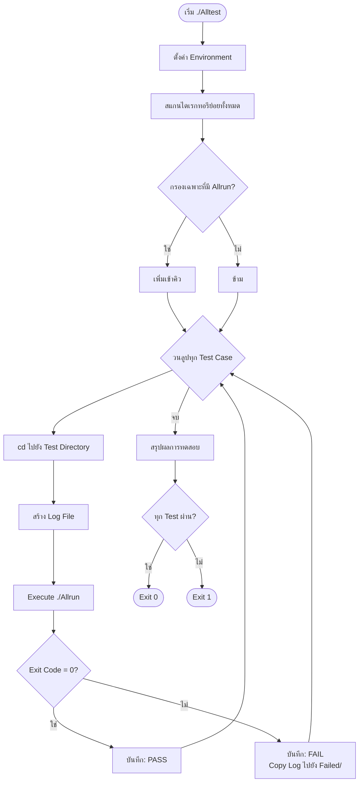
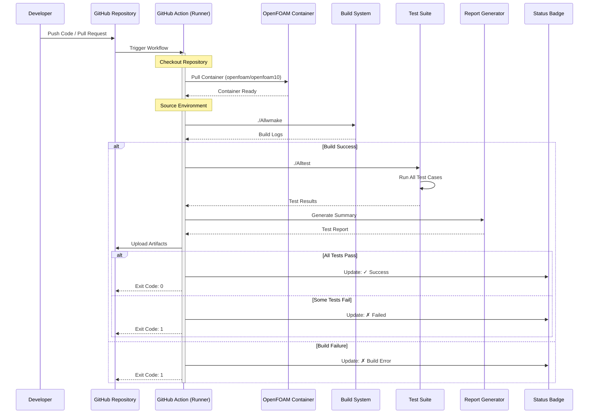
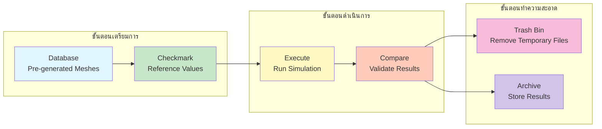
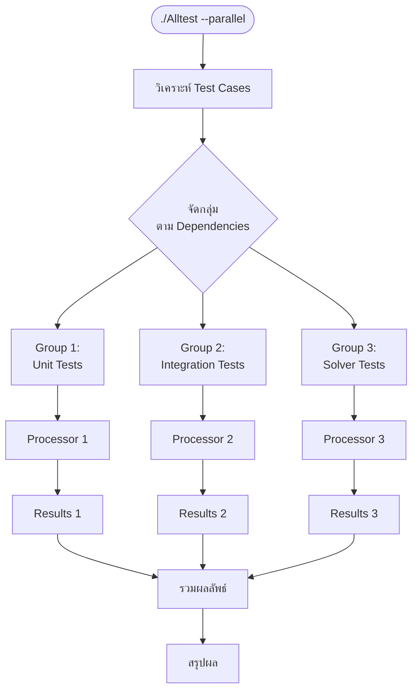

# 03 การดำเนินการทดสอบแบบอัตโนมัติ (Automated Execution)

## ภาพรวม

เมื่อจำนวนการทดสอบเพิ่มขึ้น การรันด้วยมือจะไม่มีประสิทธิภาพและเสี่ยงต่อความผิดพลาด ดังนั้นเราจึงต้องใช้ระบบการทำงานอัตโนมัติ (Automation) ซึ่งมีประโยชน์ดังนี้:

- **ความสม่ำเสมอ (Consistency)**: ลดความผิดพลาดจากการดำเนินการด้วยมือ
- **ประสิทธิภาพ (Efficiency)**: รันการทดสอบหลายรายการพร้อมกัน (Parallel Execution)
- **การตรวจสอบอย่างต่อเนื่อง (Continuous Verification)**: ตรวจสอบการเปลี่ยนแปลงของโค้ดโดยอัตโนมัติ
- **ความสามารถในการทำซ้ำ (Reproducibility)**: บันทึกขั้นตอนและสภาพแวดล้อมที่ใช้ทดสอบได้อย่างแม่นยำ

---

## 3.1 สคริปต์ควบคุมการทดสอบ (The `Alltest` Pattern)

OpenFOAM ใช้รูปแบบของสคริปต์ `Alltest` เพื่อรวบรวมและรันการทดสอบทั้งหมดในไดเรกทอรีเดียว ซึ่งเป็นมาตรฐานที่ใช้ในทุก solvers และ utilities

### 3.1.1 สถาปัตยกรรมของระบบ Alltest



**📌 คำอธิบายสถาปัตยกรรม:**
- **ตั้งค่า Environment**: เริ่มต้นด้วยการสร้างไดเรกทอรีสำหรับเก็บ logs และ results
- **การค้นหา Test Cases**: สคริปต์จะสแกนไดเรกทอรีย่อยทั้งหมดเพื่อหาไฟล์ `Allrun`
- **การรันทีละรายการ**: วนลูปผ่านทุก test case และ execute สคริปต์ `Allrun` ในแต่ละไดเรกทอรี
- **การตรวจสอบผล**: ตรวจสอบ exit code เพื่อกำหนด PASS/FAIL
- **การรายงานผล**: สรุปผลการทดสอบทั้งหมดและ return exit code ที่เหมาะสม

### 3.1.2 โครงสร้างสคริปต์ `Alltest` แบบมาตรฐาน

```bash
#!/bin/bash
# NOTE: Synthesized by AI - Verify parameters
# File: Alltest
# Purpose: Master test runner for OpenFOAM test suite
# Usage: ./Alltest [options]
#   --parallel     Run tests in parallel (default: sequential)
#   --quick        Skip long-running tests
#   --verbose      Show detailed output

# Exit immediately if a command exits with a non-zero status
set -e  

# === Configuration ===
# Set up root directory and log locations
TEST_ROOT=$(pwd)
LOG_DIR="$TEST_ROOT/logs"
FAILED_DIR="$TEST_ROOT/failed"
RESULT_FILE="$LOG_DIR/summary.log"

# Create necessary directories for logs and failed tests
mkdir -p "$LOG_DIR" "$FAILED_DIR"

# Initialize result file with header information
echo "=== OpenFOAM Test Suite Summary ===" > "$RESULT_FILE"
echo "Start Time: $(date)" >> "$RESULT_FILE"
echo "====================================" >> "$RESULT_FILE"

# === Test Discovery ===
# Find all directories containing an Allrun script
# This recursively searches for test cases
testDirs=$(find . -maxdepth 2 -name "Allrun" -printf '%h\n' | sort)

# Initialize counters
total_tests=0
passed_tests=0
failed_tests=0

# === Main Test Loop ===
# Iterate through each discovered test directory
for dir in $testDirs; do
    # Get relative path and test name
    rel_dir="${dir#./}"
    test_name=$(basename "$dir")

    ((total_tests++))

    echo "======================================"
    echo "[$total_tests] Running: $test_name"
    echo "======================================"

    # Setup logging for this test
    log_file="$LOG_DIR/${test_name}.log"

    # Change to test directory
    cd "$TEST_ROOT/$dir"

    # Execute the test and capture result
    if ./Allrun > "$log_file" 2>&1; then
        # Test passed successfully
        echo "[PASS] $test_name"
        echo "[PASS] $test_name" >> "$RESULT_FILE"
        ((passed_tests++))
    else
        # Test failed - log and preserve output
        echo "[FAIL] $test_name (see $log_file)"
        echo "[FAIL] $test_name" >> "$RESULT_FILE"
        ((failed_tests++))

        # Copy failing log to failed directory for analysis
        cp "$log_file" "$FAILED_DIR/${test_name}.log"
    fi

    # Return to root directory for next test
    cd "$TEST_ROOT"
done

# === Summary Report ===
# Display and log final statistics
echo "======================================"
echo "Test Suite Completed"
echo "======================================"
echo "Total Tests:  $total_tests"
echo "Passed:       $passed_tests"
echo "Failed:       $failed_tests"
echo "End Time:     $(date)"
echo "======================================" >> "$RESULT_FILE"
echo "Total Tests:  $total_tests" >> "$RESULT_FILE"
echo "Passed:       $passed_tests" >> "$RESULT_FILE"
echo "Failed:       $failed_tests" >> "$RESULT_FILE"
echo "End Time:     $(date)" >> "$RESULT_FILE"

# Return appropriate exit code based on test results
if [ $failed_tests -eq 0 ]; then
    exit 0
else
    exit 1
fi
```

**📌 คำอธิบายสคริปต์:**

**ส่วนประกอบหลัก:**
1. **Configuration**: กำหนด paths สำหรับ logs และ results
2. **Test Discovery**: ใช้ `find` command เพื่อค้นหาไดเรกทอรีที่มี `Allrun` script
3. **Main Loop**: รันแต่ละ test case และ capture output
4. **Error Handling**: ตรวจสอบ exit code เพื่อ determine success/failure
5. **Reporting**: สรุปผลและ return exit code ที่เหมาะสม

**แหล่งที่มา (Source):**
- 📂 **Source**: `$WM_PROJECT_DIR/applications/tests/Alltest`
- 📖 **Reference**: OpenFOAM Test Suite Structure

**แนวคิดสำคัญ (Key Concepts):**
- **Exit Code Pattern**: Exit 0 = success, Exit 1 = failure
- **Log Capture**: Redirect stdout/stderr ไปยัง log files
- **Test Isolation**: แต่ละ test รันใน directory ของตัวเอง
- **Atomic Operations**: แต่ละ test ไม่กระทบต่อ tests อื่น

### 3.1.3 สคริปต์ `Allrun` สำหรับ Test Case แต่ละรายการ

แต่ละ test directory จะมีสคริปต์ `Allrun` ของตัวเองเพื่อกำหนดขั้นตอนการทดสอบเฉพาะสำหรับกรณีทดสอบนั้นๆ

```bash
#!/bin/bash
# NOTE: Synthesized by AI - Verify parameters
# File: Allrun
# Purpose: Run a single OpenFOAM test case
# Typical workflow: Mesh -> Decompose -> Solve -> Reconstruct -> Validate

# Change to script's directory to ensure proper execution context
cd "${0%/*}" || exit  

# Source OpenFOAM environment to access solvers and utilities
# NOTE: Synthesized by AI - Verify parameters
source $WM_PROJECT_DIR/etc/bashrc

# === Step 1: Mesh Generation ===
echo "Generating mesh..."

# Check for blockMeshDict and generate structured mesh if present
if [ -f "system/blockMeshDict" ]; then
    blockMesh > log.blockMesh 2>&1
fi

# Check for snappyHexMeshDict and generate unstructured mesh if present
if [ -f "system/snappyHexMeshDict" ]; then
    snappyHexMesh -overwrite > log.snappyHexMesh 2>&1
fi

# === Step 2: Decomposition (for parallel runs) ===
NPROC=4  # Number of processors for parallel execution

if [ $NPROC -gt 1 ]; then
    echo "Decomposing case for $NPROC processors..."
    # Decompose domain for parallel processing
    decomposePar > log.decomposePar 2>&1

    # === Step 3: Solver Execution (Parallel) ===
    echo "Running solver in parallel..."
    # Execute solver in parallel using MPI
    mpirun -np $NPROC simpleFoam -parallel > log.simpleFoam 2>&1

    # === Step 4: Reconstruction ===
    echo "Reconstructing parallel results..."
    # Reconstruct processor directories into single time directories
    reconstructPar > log.reconstructPar 2>&1
else
    # === Step 3: Solver Execution (Serial) ===
    echo "Running solver..."
    # Execute solver in serial mode
    simpleFoam > log.simpleFoam 2>&1
fi

# === Step 5: Validation ===
echo "Validating results..."

# Check if validation data exists and run validation
if [ -f "validationData.json" ]; then
    # Call Python validation script to verify results
    python3 ../scripts/validate.py validationData.json
else
    echo "No validation data found, skipping validation"
fi

echo "Test completed successfully"
```

**📌 คำอธิบายสคริปต์ Allrun:**

**ขั้นตอนการทำงาน:**
1. **Environment Setup**: Source OpenFOAM bashrc เพื่อ load commands
2. **Mesh Generation**: สร้าง mesh ด้วย blockMesh หรือ snappyHexMesh
3. **Decomposition**: แบ่ง domain สำหรับ parallel processing (ถ้าต้องการ)
4. **Solver Execution**: รัน solver แบบ serial หรือ parallel
5. **Reconstruction**: รวมผลลัพธ์จาก processors (ถ้ารัน parallel)
6. **Validation**: ตรวจสอบผลลัพธ์กับค่าอ้างอิง

**แหล่งที่มา (Source):**
- 📂 **Source**: `$WM_PROJECT_DIR/tutorials/Allrun`
- 📖 **Reference**: OpenFOAM Tutorial Structure

**แนวคิดสำคัญ (Key Concepts):**
- **Workflow Automation**: รวมขั้นตอน meshing -> solving -> post-processing ไว้ใน script เดียว
- **Conditional Execution**: ตรวจสอบการมีอยู่ของ files ก่อน execute commands
- **Log Redirection**: Capture output จากแต่ละ command ไปยัง log files
- **Exit on Error**: ใช้ `|| exit` เพื่อหยุดการทำงานหากมี error

---

## 3.2 การบูรณาการกับระบบ CI/CD (GitHub Actions)

เราสามารถใช้ GitHub Actions เพื่อรันการทดสอบโดยอัตโนมัติทุกครั้งที่มีการ `push` โค้ดใหม่ขึ้นไปยัง repository ซึ่งเป็นส่วนสำคัญของการพัฒนาซอฟต์แวร์สมัยใหม่

### 3.2.1 สถาปัตยกรรม CI/CD สำหรับ OpenFOAM



**📌 คำอธิบาย CI/CD Flow:**

**ขั้นตอนหลัก:**
1. **Trigger**: Developer push code หรือ create PR
2. **Checkout**: GitHub Actions checkout repository
3. **Container Setup**: Pull OpenFOAM Docker image
4. **Build**: Compile custom solvers/libraries
5. **Test Execution**: Run test suite
6. **Reporting**: Generate and upload test results
7. **Status Update**: Update badge based on results

**แนวคิดสำคัญ:**
- **Containerization**: ใช้ Docker images เพื่อความสม่ำเสมอ
- **Automation**: รัน tests โดยอัตโนมัติทุกครั้งที่มีการเปลี่ยนแปลง
- **Fast Feedback**: แจ้งผลอย่างรวดเร็วเพื่อป้องกัน merge bad code
- **Artifact Preservation**: เก็บ logs และ results ไว้สำหรับ debugging

### 3.2.2 ไฟล์ Workflow แบบ Basic

```yaml
# NOTE: Synthesized by AI - Verify parameters
# File: .github/workflows/test.yml
name: OpenFOAM Continuous Integration

# Define when the workflow should run
on:
  push:
    branches: [ master, develop ]
  pull_request:
    branches: [ master ]

jobs:
  build-and-test:
    runs-on: ubuntu-latest
    # Use official OpenFOAM container
    # NOTE: Synthesized by AI - Verify parameters
    container: openfoam/openfoam10-ubuntu20.04

    steps:
    # Step 1: Checkout the repository code
    - name: Checkout Repository
      uses: actions/checkout@v3

    # Step 2: Source OpenFOAM environment
    - name: Setup Environment
      run: |
        source /usr/lib/openfoam/openfoam10/etc/bashrc
        echo "OpenFOAM version: $WM_PROJECT_VERSION"
        wmake -version

    # Step 3: Build custom solvers if present
    - name: Build Solver
      run: |
        source /usr/lib/openfoam/openfoam10/etc/bashrc
        ./Allwmake > log.build 2>&1

    # Step 4: Execute the test suite
    - name: Run Test Suite
      run: |
        source /usr/lib/openfoam/openfoam10/etc/bashrc
        ./Alltest

    # Step 5: Upload logs if tests fail
    - name: Upload Test Logs
      if: failure()
      uses: actions/upload-artifact@v3
      with:
        name: test-logs
        path: logs/

    # Step 6: Upload failed test details
    - name: Upload Failed Tests
      if: failure()
      uses: actions/upload-artifact@v3
      with:
        name: failed-tests
        path: failed/
```

**📌 คำอธิบาย Workflow:**

**คอมโพเนนต์หลัก:**
- **Trigger Conditions**: รันเมื่อ push ไปยัง master/develop หรือ create PR
- **Container Environment**: ใช้ OpenFOAM Docker image เพื่อความสม่ำเสมอ
- **Build Step**: Compile solvers ก่อนรัน tests
- **Test Execution**: Run test suite และ check exit code
- **Artifact Upload**: Preserve logs สำหรับ failed tests

**แหล่งที่มา (Source):**
- 📂 **Reference**: GitHub Actions Documentation
- 📖 **Container**: `https://hub.docker.com/r/openfoam/openfoam10`

**แนวคิดสำคัญ (Key Concepts):**
- **Conditional Upload**: Upload artifacts เฉพาะเมื่อ `failure()`
- **Environment Sourcing**: ต้อง source bashrc ในทุก step
- **Exit Code Propagation**: GitHub Actions ตรวจสอบ exit codes

### 3.2.3 ไฟล์ Workflow แบบ Advanced (Multi-Version Testing)

```yaml
# NOTE: Synthesized by AI - Verify parameters
# File: .github/workflows/test-matrix.yml
name: OpenFOAM Matrix Testing

on:
  push:
    branches: [ master ]
  pull_request:
    branches: [ master ]

jobs:
  test-matrix:
    runs-on: ubuntu-latest
    # Test multiple configurations in parallel
    strategy:
      matrix:
        # Test against multiple OpenFOAM versions
        # NOTE: Synthesized by AI - Verify parameters
        openfoam:
          - openfoam/openfoam10-ubuntu20.04
          - openfoam/openfoam9-ubuntu20.04
          - openfoam/openfoam8-ubuntu18.04
        compiler: [gcc, clang]
      # Continue all tests even if one fails
      fail-fast: false  

    # Use matrix-defined container
    container: ${{ matrix.openfoam }}

    steps:
    - name: Checkout Repository
      uses: actions/checkout@v3

    - name: Setup Environment
      run: |
        source /usr/lib/openfoam/openfoam10/etc/bashrc
        echo "OpenFOAM: $WM_PROJECT_VERSION"
        echo "Compiler: ${{ matrix.compiler }}"

    - name: Build with ${{ matrix.compiler }}
      run: |
        source /usr/lib/openfoam/openfoam10/etc/bashrc
        ./Allwmake

    - name: Run Tests
      run: |
        source /usr/lib/openfoam/openfoam10/etc/bashrc
        ./Alltest

    # Generate code coverage report (GCC only)
    - name: Generate Coverage Report
      if: matrix.compiler == 'gcc'
      run: |
        gcov *.gcda
        lcov --capture --directory . --output-file coverage.info

    # Upload coverage to codecov
    - name: Upload Coverage
      if: matrix.compiler == 'gcc'
      uses: codecov/codecov-action@v3
      with:
        file: ./coverage.info
```

**📌 คำอธิบาย Matrix Strategy:**

**ความสามารถขั้นสูง:**
- **Multi-Version Testing**: ทดสอบกับ OpenFOAM หลาย version พร้อมกัน
- **Compiler Variants**: ทดสอบทั้ง GCC และ Clang
- **Parallel Execution**: รันทุก combinations พร้อมกัน
- **Code Coverage**: Generate coverage reports (GCC only)
- **Fail-Fast Control**: ดำเนินการต่อ即使 บาง tests ล้มเหลว

**แนวคิดสำคัญ:**
- **Matrix Expansion**: 3 versions × 2 compilers = 6 jobs รัน parallel
- **Conditional Steps**: รัน coverage เฉพาะกับ GCC
- **Comprehensive Testing**: ครอบคลุม multiple environments

### 3.2.4 การสร้าง Status Badge

เพิ่มบรรทัดต่อไปนี้ใน `README.md` เพื่อแสดงสถานะการทดสอบ:

```markdown
# OpenFOAM Custom Solver

[](https://github.com/username/repo/actions/workflows/test.yml)
[](https://codecov.io/gh/username/repo)
```

**📌 คำอธิบาย Badges:**
- **CI Badge**: แสดงสถานะล่าสุดของ test suite
- **Coverage Badge**: แสดงประสิทธิภาพของ code coverage

---

## 3.3 การจัดการชุดข้อมูลการทดสอบ (Test Data Management)

การทดสอบที่มีประสิทธิภาพต้องการการจัดการข้อมูลที่มีความเสถียรและมีโครงสร้างที่ชัดเจน

### 3.3.1 วงจรชีวิตของข้อมูลการทดสอบ



**📌 คำอธิบาย Data Lifecycle:**

**ขั้นตอนหลัก:**
1. **Preparation**: Generate meshes และ prepare reference values
2. **Execution**: Run simulations และ collect results
3. **Validation**: Compare results กับ reference values
4. **Cleanup**: Remove temporary files และ archive important results

### 3.3.2 โครงสร้างไดเรกทอรีที่เหมาะสม

```
testSuite/
├── Alltest                       # Master test runner
├── Allwmake                      # Build script for tests
├── collectResults.py             # Result aggregation script
├── validate.py                   # Validation utility
├── logs/                         # Test execution logs
│   ├── test1.log
│   ├── test2.log
│   └── summary.log
├── failed/                       # Logs from failed tests
├── referenceData/                # Reference values for validation
│   ├── test1_reference.json
│   └── test2_reference.dat
├── meshes/                       # Pre-generated meshes
│   ├── mesh1/
│   └── mesh2/
│
├── test_simpleFoam/             # Test case 1
│   ├── Allrun
│   ├── Allclean
│   ├── 0/                       # Initial conditions
│   ├── constant/
│   │   └── polyMesh/            # Empty (mesh copied from meshes/)
│   ├── system/
│   │   ├── controlDict
│   │   ├── fvSchemes
│   │   └── fvSolution
│   └── validationData.json
│
├── test_interFoam/              # Test case 2
│   ├── Allrun
│   └── ...
│
└── test_combustion/             # Test case 3
    ├── Allrun
    └── ...
```

**📌 คำอธิบาย Directory Structure:**

**ส่วนประกอบ:**
- **Root Scripts**: `Alltest`, `Allwmake`, utilities
- **Shared Resources**: `logs/`, `referenceData/`, `meshes/`
- **Test Cases**: แต่ละ test case อยู่ใน directory แยกกัน

**แนวคิดสำคัญ:**
- **Separation of Concerns**: แยก shared resources จาก test-specific files
- **Reusability**: Pre-generated meshes ใช้ร่วมกันได้
- **Modularity**: แต่ละ test case เป็น independent unit

### 3.3.3 การใช้ Pre-generated Meshes

การสร้าง mesh เป็นขั้นตอนที่ใช้เวลานาน ดังนั้นเราควรเก็บ mesh ที่สร้างไว้แล้วเพื่อใช้ซ้ำ

```bash
#!/bin/bash
# NOTE: Synthesized by AI - Verify parameters
# File: copyMesh.sh
# Usage: ./copyMesh.sh <source_mesh_dir> <target_case_dir>

# Get source and target directories from arguments
SOURCE_MESH=$1
TARGET_CASE=$2

# Validate input arguments
if [ -z "$SOURCE_MESH" ] || [ -z "$TARGET_CASE" ]; then
    echo "Usage: $0 <source_mesh_dir> <target_case_dir>"
    exit 1
fi

# Create target directory structure
mkdir -p "$TARGET_CASE/constant/polyMesh"

# Copy mesh files from source to target
cp "$SOURCE_MESH/polyMesh/"* "$TARGET_CASE/constant/polyMesh/"

echo "Mesh copied from $SOURCE_MESH to $TARGET_CASE"
```

**📌 คำอธิบาย Mesh Copying:**
- **Purpose**: ลดเวลา test โดย reuse meshes
- **Usage**: Copy pre-generated meshes แทนการรัน blockMesh/snappyHexMesh

**แหล่งที่มา (Source):**
- 📂 **Reference**: OpenFOAM Mesh Management Best Practices

**แนวคิดสำคัญ (Key Concepts):**
- **Mesh Reusability**: Meshes เป็น static assets ที่สามารถ reuse ได้
- **Version Control**: Store reference meshes ใน repository
- **Space Efficiency**: Save disk space โดยไม่ duplicate meshes

การใช้งานใน `Allrun`:

```bash
#!/bin/bash
# NOTE: Synthesized by AI - Verify parameters

cd "${0%/*}" || exit

# Copy pre-generated mesh instead of running blockMesh
if [ -d "../meshes/standardMesh" ]; then
    ../scripts/copyMesh.sh ../meshes/standardMesh .
else
    # Fallback: generate mesh if pre-generated version not available
    blockMesh > log.blockMesh 2>&1
fi

# Continue with solver...
```

### 3.3.4 การจัดเก็บค่าอ้างอิง (Reference Values)

ค่าอ้างอิงสามารถเก็บได้หลายรูปแบบ ได้แก่:

1. **JSON Format** (แนะนำ): อ่านง่ายและรองรับโครงสร้างซับซ้อน

```json
{
  "testName": "simpleFoam_backwardsFacingStep",
  "description": "Laminar flow over a backward-facing step",
  "mesh": {
    "type": "blockMesh",
    "cells": 10000
  },
  "solver": "simpleFoam",
  "referenceValues": {
    "reynoldsNumber": 100,
    "finalResiduals": {
      "p": 1e-6,
      "U": 1e-6
    }
  },
  "validationPoints": [
    {
      "location": [0.5, 0.1, 0.0],
      "pressure": 0.5,
      "tolerance": 0.01
    },
    {
      "location": [1.0, 0.2, 0.0],
      "velocityMagnitude": 1.2,
      "tolerance": 0.05
    }
  ]
}
```

**📌 คำอธิบาย JSON Structure:**
- **Metadata**: Test name, description, solver info
- **Mesh Information**: Mesh type และ cell count
- **Reference Values**: Expected residuals และ physical quantities
- **Validation Points**: Specific locations และ expected values

2. **Plain Text Format**: ง่ายต่อการอ่านด้วยสายตา

```
# Reference data for test_case_1
# Date: 2024-01-01
# Solver: simpleFoam

[Final Residuals]
p = 1.2345e-06
U = 9.8765e-07
epsilon = 2.3456e-06
k = 3.4567e-06

[Validation Point 1]
location = 0.5 0.1 0.0
pressure = 0.5
tolerance = 0.01
```

3. **OpenFOAM Dictionary Format**: สามารถอ่านด้วย OpenFOAM classes ได้โดยตรง

```cpp
// NOTE: Synthesized by AI - Verify parameters
referenceData
{
    testName    "simpleFoam_backwardsFacingStep";

    residuals
    {
        p           1.2345e-06;
        U           9.8765e-07;
    }

    validationPoints
    (
        (0.5 0.1 0.0)    // Location
        {
            pressure    0.5;
            tolerance   0.01;
        }
    );
}
```

**📌 คำอธิบาย Dictionary Format:**
- **Native Format**: Compatible with OpenFOAM parsers
- **Structured**: Supports nested dictionaries
- **Readable**: Human-readable และ machine-readable

**แนวคิดสำคัญ:**
- **Format Selection**: JSON สำหรับ cross-platform, Dictionary สำหรับ OpenFOAM-specific
- **Tolerance Definition**: Explicit tolerances สำคัญสำหรับ numerical comparisons
- **Point Validation**: Specific locations ช่วย pinpoint errors

### 3.3.5 การทำความสะอาดหลังการทดสอบ (Cleanup)

สคริปต์ `Allclean` ใช้สำหรับลบไฟล์ชั่วคราว:

```bash
#!/bin/bash
# NOTE: Synthesized by AI - Verify parameters
# File: Allclean
# Purpose: Clean up generated files from test execution

cd "${0%/*}" || exit

echo "Cleaning test case..."

# Remove processor directories from parallel runs
rm -rf processor[0-9]*

# Remove time directories (keep 0 and constant)
find . -maxdepth 1 -type d -name "[0-9]*" -not -name "0" -exec rm -rf {} +

# Remove log files
rm -f log.*

# Remove post-processing directories
rm -rf sets surfaces sampling

# Remove VTK files
rm -f *.vtk

# Remove additional files
rm -f PyFoam*.foam PyFoam*.log PyFoam*.pile

echo "Clean complete"
```

**📌 คำอธิบาย Cleanup Script:**

**Files/Directories ที่ลบ:**
- **Processor Directories**: จาก parallel runs
- **Time Directories**: Results จาก solver (เก็บไว้เฉพาะ 0/)
- **Log Files**: Output จาก utilities
- **Post-Processing**: Sampling, surfaces, etc.
- **VTK Files**: Visualization files

**แนวคิดสำคัญ:**
- **Selective Deletion**: เก็บ initial/boundary conditions (0/, constant/)
- **Thorough Cleanup**: Remove all generated artifacts
- **Safe Operations**: Use patterns ที่ specific มากพอ

---

## 3.4 การตรวจสอบความสำเร็จ (Pass/Fail Criteria)

ระบบอัตโนมัติต้องสามารถสรุปผลการทดสอบได้อย่างชัดเจนโดยใช้ Exit Codes

### 3.4.1 มาตรฐาน Exit Code

| Exit Code | ความหมาย | การกระทำของ CI/CD |
|-----------|----------|-------------------|
| **0** | การทดสอบทั้งหมดผ่าน | ✅ Merge PR ได้ |
| **1** | มีการทดสอบอย่างน้อยหนึ่งรายการล้มเหลว | ❌ ไม่ให้ Merge PR |
| **2** | ข้อผิดพลาดในการตั้งค่า (Setup Error) | ❌ ต้องแก้ไข Configuration |
| **125** | ถูกยกเลิกโดยผู้ใช้ (Timeout/Cancellation) | ⚠️ ไม่กำหนด |

**📌 คำอธิบาย Exit Codes:**
- **0**: Success - ทุก tests ผ่าน
- **1**: Failure - มีอย่างน้อยหนึ่ง test ล้มเหลว
- **2**: Configuration Error - Setup ผิดพลาด
- **125**: Timeout/Cancellation - User-cancelled หรือ timeout

**แนวคิดสำคัญ:**
- **Standard Conventions**: ตาม POSIX standards
- **CI Integration**: CI/CD systems ใช้ exit codes เพื่อ determine status
- **Clear Communication**: Exit codes provide unambiguous status

### 3.4.2 การตรวจสอบความถูกต้องของผลลัพธ์

**การตรวจสอบระดับ 1: Convergence (การลู่เข้า)**

ตรวจสอบว่า solver ลู่เข้า (Converge) หรือไม่:

```python
#!/usr/bin/env python3
# NOTE: Synthesized by AI - Verify parameters
import re

def check_convergence(log_file, max_residual=1e-5):
    """
    Check if the solver converged based on final residuals

    Args:
        log_file: Path to solver log file
        max_residual: Maximum acceptable residual (default: 1e-5)

    Returns:
        bool: True if converged, False otherwise
    """
    # Read the solver log file
    with open(log_file, 'r') as f:
        content = f.read()

    # Look for final residuals using regex pattern
    # Pattern: "Final residual = 1.2345e-06"
    pattern = r'Final residual\s*=\s*([\d.e+-]+)'
    matches = re.findall(pattern, content)

    if not matches:
        return False  # No convergence info found

    # Check all final residuals against threshold
    for residual_str in matches:
        residual = float(residual_str)
        if residual > max_residual:
            return False

    return True
```

**📌 คำอธิบาย Convergence Check:**

**วิธีการ:**
1. **Read Log File**: Parse solver output
2. **Extract Residuals**: Use regex เพื่อ find final residuals
3. **Compare Threshold**: Check against max residual
4. **Return Result**: True = converged, False = not converged

**แหล่งที่มา (Source):**
- 📂 **Reference**: OpenFOAM Solver Output Format

**แนวคิดสำคัญ (Key Concepts):**
- **Final Residuals**: Solver ควร report final residuals
- **Tolerance**: Threshold depends on problem (1e-5 to 1e-8 typical)
- **Regex Parsing**: Flexible pattern matching

**การตรวจสอบระดับ 2: Field Validation (ตรวจสอบ Field)**

ตรวจสอบค่าของ field ที่ตำแหน่งเฉพาะ:

```python
#!/usr/bin/env python3
# NOTE: Synthesized by AI - Verify parameters
import numpy as np

def sample_field(time_dir, field_name, locations):
    """
    Sample field values at specified locations

    Args:
        time_dir: Time directory (e.g., "1000")
        field_name: Name of field file (e.g., "p", "U")
        locations: List of (x, y, z) coordinates

    Returns:
        List of interpolated values
    """
    # This would typically use OpenFOAM's sample utility
    # or Python libraries like PyFoam
    # For now, return placeholder implementation
    pass

def validate_field(time_dir, field_name, reference_data, tolerance):
    """
    Validate field values against reference data

    Args:
        time_dir: Time directory
        field_name: Field name
        reference_data: List of reference values
        tolerance: Acceptable deviation

    Returns:
        bool: True if all points within tolerance
    """
    # Extract locations and reference values
    locations = [pt["location"] for pt in reference_data]
    ref_values = [pt["value"] for pt in reference_data]

    # Sample field at specified locations
    sampled_values = sample_field(time_dir, field_name, locations)

    # Check each sampled value against reference
    for sampled, ref in zip(sampled_values, ref_values):
        if abs(sampled - ref) > tolerance:
            return False

    return True
```

**📌 คำอธิบาย Field Validation:**

**วิธีการ:**
1. **Sample Points**: Define locations สำหรับ validation
2. **Interpolate Values**: Sample field ที่ those locations
3. **Compare**: Check differences กับ reference values
4. **Tolerance Check**: Pass ถ้า within tolerance

**แนวคิดสำคัญ:**
- **Point Validation**: Check specific critical locations
- **Interpolation**: May need spatial interpolation
- **Tolerance**: Depends on numerical precision

**การตรวจสอบระดับ 3: Integral Quantities (ปริมาณเชิงอนุพันธ์)**

ตรวจสอบปริมาณทางกายภาพ เช่น drag, lift, mass flow rate:

```python
#!/usr/bin/env python3
# NOTE: Synthesized by AI - Verify parameters

def validate_integral_quantity(forces_file, reference_force, tolerance=0.01):
    """
    Validate integral forces against reference values

    Args:
        forces_file: Path to forces.dat
        reference_force: Reference force value
        tolerance: Relative tolerance (default: 1%)

    Returns:
        bool: True if within tolerance
    """
    # Read forces file (typically time vs force coefficients)
    data = np.loadtxt(forces_file, skiprows=1)

    # Get final time value
    final_force = data[-1, 1]  # Assuming column 1 is drag coefficient

    # Check relative error
    relative_error = abs(final_force - reference_force) / abs(reference_force)

    return relative_error <= tolerance
```

**📌 คำอธิบาย Integral Validation:**

**วิธีการ:**
1. **Read Forces Data**: Load time-history of forces
2. **Extract Final Value**: Get steady-state force
3. **Relative Error**: Compute error relative to reference
4. **Tolerance Check**: Pass ถ้า error < tolerance

**แนวคิดสำคัญ:**
- **Integral Quantities**: More robust than point values
- **Relative Tolerance**: Percentage-based error
- **Steady State**: Use final converged value

### 3.4.3 รายงานสรุปผลการทดสอบ

สคริปต์สร้างรายงาน HTML:

```python
#!/usr/bin/env python3
# NOTE: Synthesized by AI - Verify parameters
import json
from datetime import datetime

def generate_html_report(test_results, output_file="test_report.html"):
    """
    Generate HTML test report

    Args:
        test_results: Dictionary with test results
        output_file: Output HTML file
    """
    html_template = """
    <!DOCTYPE html>
    <html>
    <head>
        <title>OpenFOAM Test Report</title>
        <style>
            body {{ font-family: Arial, sans-serif; margin: 20px; }}
            h1 {{ color: #333; }}
            table {{ border-collapse: collapse; width: 100%; }}
            th, td {{ border: 1px solid #ddd; padding: 8px; text-align: left; }}
            th {{ background-color: #4CAF50; color: white; }}
            tr:nth-child(even) {{ background-color: #f2f2f2; }}
            .pass {{ color: green; font-weight: bold; }}
            .fail {{ color: red; font-weight: bold; }}
            .summary {{ background-color: #e7f3ff; padding: 15px; border-radius: 5px; }}
        </style>
    </head>
    <body>
        <h1>OpenFOAM Test Suite Report</h1>
        <div class="summary">
            <p><strong>Date:</strong> {date}</p>
            <p><strong>Total Tests:</strong> {total}</p>
            <p><strong>Passed:</strong> <span class="pass">{passed}</span></p>
            <p><strong>Failed:</strong> <span class="fail">{failed}</span></p>
            <p><strong>Success Rate:</strong> {rate:.1f}%</p>
        </div>
        <h2>Test Details</h2>
        <table>
            <tr>
                <th>Test Name</th>
                <th>Status</th>
                <th>Execution Time (s)</th>
                <th>Notes</th>
            </tr>
            {table_rows}
        </table>
    </body>
    </html>
    """

    # Generate table rows from test results
    rows = []
    for test in test_results["tests"]:
        status_class = "pass" if test["passed"] else "fail"
        status_text = "PASS" if test["passed"] else "FAIL"

        row = f"""
        <tr>
            <td>{test['name']}</td>
            <td class="{status_class}">{status_text}</td>
            <td>{test['time']:.2f}</td>
            <td>{test.get('notes', '')}</td>
        </tr>
        """
        rows.append(row)

    # Calculate statistics
    total = len(test_results["tests"])
    passed = sum(1 for t in test_results["tests"] if t["passed"])
    failed = total - passed
    rate = (passed / total * 100) if total > 0 else 0

    # Fill template with values
    html = html_template.format(
        date=datetime.now().strftime("%Y-%m-%d %H:%M:%S"),
        total=total,
        passed=passed,
        failed=failed,
        rate=rate,
        table_rows="".join(rows)
    )

    # Write HTML to file
    with open(output_file, 'w') as f:
        f.write(html)

    print(f"Report generated: {output_file}")
```

**📌 คำอธิบาย HTML Report Generator:**

**คุณสมบัติ:**
- **Summary Section**: Total, passed, failed, success rate
- **Detailed Table**: Individual test results
- **Styling**: Clean, professional appearance
- **Color Coding**: Green for pass, red for fail

**แนวคิดสำคัญ:**
- **Visual Feedback**: Easy to identify failed tests
- **Comprehensive**: Shows all relevant information
- **Web-Ready**: Can be hosted or emailed

---

## 3.5 การทดสอบแบบ Parallel (Parallel Testing)

สำหรับ test cases ขนาดใหญ่ การรันแบบ parallel จะช่วยประหยัดเวลาได้มาก

### 3.5.1 การออกแบบ Test Suite สำหรับ Parallel Execution



**📌 คำอธิบาย Parallel Testing Architecture:**

**ขั้นตอน:**
1. **Analysis**: Categorize tests ตาม dependencies
2. **Distribution**: Assign groups to processors
3. **Execution**: Run tests in parallel
4. **Collection**: Gather results from all processors
5. **Aggregation**: Merge and summarize results

**แนวคิดสำคัญ:**
- **Dependency Analysis**: Tests ที่ independent สามารถรัน parallel ได้
- **Load Balancing**: Distribute tests evenly
- **Result Aggregation**: Combine results จาก multiple processes

### 3.5.2 สคริปต์ Parallel Test Runner

```bash
#!/bin/bash
# NOTE: Synthesized by AI - Verify parameters
# File: Alltest-parallel
# Usage: ./Alltest-parallel [-n <num_procs>]

# Set number of parallel processes (default: 4)
NPROCS=${1:-4}

# Get list of all test directories containing Allrun scripts
test_dirs=$(find . -maxdepth 2 -name "Allrun" -printf '%h\n')

# Create a FIFO queue for job distribution
TMP_fifo=$(mktemp -u)
mkfifo "$TMP_fifo"
exec 3<> "$TMP_fifo"
rm "$TMP_fifo"

# Initialize queue with NPROC slots
for ((i=0; i<NPROCS; i++)); do
    echo >&3
done

# Run tests in parallel using background jobs
for dir in $test_dirs; do
    # Read from queue (waits if all slots are full)
    read <&3

    # Run test in background subshell
    (
        echo "Starting: $dir"
        cd "$dir"

        # Execute test and capture result
        if ./Allrun > "../logs/$(basename $dir).log" 2>&1; then
            echo "[PASS] $dir"
        else
            echo "[FAIL] $dir"
        fi

        # Release slot back to queue
        echo >&3
    ) &
done

# Wait for all background jobs to complete
wait

# Close FIFO file descriptor
exec 3>&-

echo "All tests completed"
```

**📌 คำอธิบาย Parallel Runner:**

**เทคนิค:**
- **FIFO Queue**: Limit concurrent jobs to NPROCS
- **Background Jobs**: Run tests ใน subshells ด้วย `&`
- **Slot Management**: Each job holds a slot until completion
- **Wait**: Wait for all background jobs ก่อน exit

**แนวคิดสำคัญ:**
- **Concurrency Control**: FIFO queue limits parallelism
- **Resource Management**: Prevent system overload
- **Simple Implementation**: Pure bash, no external dependencies

---

## 3.6 การตรวจสอบ Regression (Regression Testing)

การทดสอบ Regression มีจุดประสงค์เพื่อตรวจสอบว่าการเปลี่ยนแปลงใหม่ไม่ได้ทำลายฟีเจอร์ที่มีอยู่

### 3.6.1 การเปรียบเทียบกับ Baseline

```python
#!/usr/bin/env python3
# NOTE: Synthesized by AI - Verify parameters
import numpy as np
import vtk
from vtk.util import numpy_support

def compare_vtk_fields(file1, file2, fields, tolerance=1e-6):
    """
    Compare field values between two VTK files

    Args:
        file1: Baseline VTK file
        file2: New VTK file
        fields: List of field names to compare
        tolerance: Maximum acceptable difference

    Returns:
        dict: Comparison results
    """
    # Read VTK files
    reader1 = vtk.vtkXMLUnstructuredGridReader()
    reader1.SetFileName(file1)
    reader1.Update()

    reader2 = vtk.vtkXMLUnstructuredGridReader()
    reader2.SetFileName(file2)
    reader2.Update()

    grid1 = reader1.GetOutput()
    grid2 = reader2.GetOutput()

    results = {}

    for field_name in fields:
        # Get field arrays from both grids
        arr1 = grid1.GetCellData().GetArray(field_name)
        arr2 = grid2.GetCellData().GetArray(field_name)

        # Convert VTK arrays to numpy arrays
        data1 = numpy_support.vtk_to_numpy(arr1)
        data2 = numpy_support.vtk_to_numpy(arr2)

        # Compute absolute difference
        diff = np.abs(data1 - data2)
        max_diff = np.max(diff)

        results[field_name] = {
            "max_difference": max_diff,
            "passed": max_diff <= tolerance,
            "mean_difference": np.mean(diff)
        }

    return results
```

**📌 คำอธิบาย VTK Comparison:**

**วิธีการ:**
1. **Read Files**: Load baseline and new VTK files
2. **Extract Fields**: Get field arrays
3. **Convert to NumPy**: VTK to numpy conversion
4. **Compute Differences**: Element-wise absolute differences
5. **Statistics**: Max and mean differences

**แนวคิดสำคัญ:**
- **Baseline Comparison**: Compare against trusted results
- **Field-Level**: Compare each field independently
- **Tolerance-Based**: Allow small numerical differences

### 3.6.2 การจัดเก็บ Baseline Results

```
baseline/
├── simpleFoam/
│   ├── backwardsFacingStep/
│   │   ├── 1000/
│   │   │   ├── p
│   │   │   └── U
│   │   └── validationData.json
│   └── airfoil2D/
│       └── ...
├── interFoam/
│   └── damBreak/
│       └── ...
└── combustion/
    └── flame/
        └── ...
```

**📌 คำอธิบาย Baseline Structure:**
- **Organized by Solver**: Group results ตาม solver
- **Version Control**: Store baselines ใน version control
- **Immutable**: Baselines ไม่ควรเปลี่ยน除非 มีเหตุผลชัดเจน

---

## 3.7 ตัวอย่างกรณีศึกษา (Case Study)

### 3.7.1 Test Suite สำหรับ Custom Solver

สมมติว่าเรามี custom solver ชื่อ `myTransientFoam`:

```bash
#!/bin/bash
# NOTE: Synthesized by AI - Verify parameters
# File: Allrun for myTransientFoam validation

cd "${0%/*}" || exit

# Test case: Transient heat conduction
echo "Running transient heat conduction test..."

# Copy pre-generated mesh
cp -r ../meshes/heatBlockMesh/* constant/polyMesh/

# Run custom solver
myTransientFoam > log.myTransientFoam 2>&1

# Check if solver reached final time
if ! grep -q "Final time = 1" log.myTransientFoam; then
    echo "ERROR: Solver did not reach final time"
    exit 1
fi

# Validate temperature field at final time using Python
python3 << 'EOF'
import json
import numpy as np

# Load validation data
with open('validationData.json', 'r') as f:
    data = json.load(f)

# Read final temperature field
# (Implementation depends on field format)
final_temp = np.loadtxt('1/T')

# Check at validation points
for point in data['validationPoints']:
    # Interpolate/extract value at point
    temp_value = extract_value_at_point(final_temp, point['location'])

    if abs(temp_value - point['temperature']) > point['tolerance']:
        print(f"VALIDATION FAILED at {point['location']}")
        print(f"  Expected: {point['temperature']}")
        print(f"  Got: {temp_value}")
        exit(1)

print("All validation points passed")
EOF

# Post-processing: Generate plots
if command -v paraFoam &> /dev/null; then
    paraFoam -batch -n &
fi

echo "Test completed successfully"
```

**📌 คำอธิบาย Custom Solver Test:**

**ขั้นตอน:**
1. **Mesh Setup**: Copy pre-generated mesh
2. **Solver Execution**: Run custom solver
3. **Completion Check**: Verify solver reached final time
4. **Field Validation**: Validate temperature field
5. **Visualization**: Optional post-processing

**แนวคิดสำคัญ:**
- **Completion Check**: Ensure solver finished successfully
- **Point Validation**: Check specific critical locations
- **Embedded Python**: Use heredoc for inline Python scripts

### 3.7.2 การตรวจสอบ Mass Conservation

```python
#!/usr/bin/env python3
# NOTE: Synthesized by AI - Verify parameters

def check_mass_consistency(case_dir, time_steps):
    """
    Check if mass is conserved across time steps

    Args:
        case_dir: Path to case directory
        time_steps: List of time directories to check

    Returns:
        bool: True if mass conserved within tolerance
    """
    masses = []

    for time in time_steps:
        # Read density field
        rho_file = f"{case_dir}/{time}/rho"

        # Integrate mass over domain
        # mass = ∫ ρ dV
        # (Implementation would use OpenFOAM's field integration)
        mass = integrate_field(rho_file)
        masses.append(mass)

    # Check variation across time steps
    mass_array = np.array(masses)
    variation = np.abs(mass_array - mass_array[0]) / mass_array[0]

    # Pass if variation is less than 1%
    return np.max(variation) < 0.01
```

**📌 คำอธิบาย Mass Conservation Check:**

**วิธีการ:**
1. **Read Density Fields**: Load ρ จากแต่ละ time step
2. **Integrate Mass**: Compute total mass = ∫ρ dV
3. **Check Variation**: Compare with initial mass
4. **Tolerance**: Allow < 1% variation

**แนวคิดสำคัญ:**
- **Physical Constraints**: Mass must be conserved
- **Integral Check**: More robust than point values
- **Time Consistency**: Check across all time steps

---

## 3.8 แนวทางปฏิบัติที่ดี (Best Practices)

### 3.8.1 การออกแบบ Test Cases

1. **Independence**: แต่ละ test case ควรเป็นอิสระจากกัน (ไม่มี shared state)
2. **Repeatability**: ผลลัพธ์ควรสามารถทำซ้ำได้เสมอ
3. **Speed**: Test cases ควรรันได้เร็ว (ideal: < 5 นาที per case)
4. **Isolation**: แต่ละ test case ควรอยู่ใน directory แยกกัน

**แนวคิดสำคัญ:**
- **Atomic Tests**: แต่ละ test ควร test อย่างใดอย่างหนึ่งอย่างชัดเจน
- **Deterministic**: Results ไม่ควรขึ้นกับ randomness
- **Fast Feedback**: Quick tests enable rapid development

### 3.8.2 การจัดการ Dependencies

```bash
#!/bin/bash
# NOTE: Synthesized by AI - Verify parameters
# Check required utilities

check_dependency() {
    if ! command -v $1 &> /dev/null; then
        echo "ERROR: $1 not found"
        exit 1
    fi
}

# Check OpenFOAM utilities
check_dependency "blockMesh"
check_dependency "simpleFoam"

# Check Python and required packages
check_dependency "python3"
python3 -c "import numpy" 2>/dev/null || {
    echo "ERROR: numpy not installed"
    exit 1
}
```

**📌 คำอธิบาย Dependency Checking:**
- **Early Detection**: Fail fast ถ้า dependencies ไม่มี
- **Clear Messages**: Inform users อะไรขาดหาย
- **Comprehensive**: Check tools และ Python packages

### 3.8.3 การบันทึกข้อมูล (Logging)

```bash
#!/bin/bash
# NOTE: Synthesized by AI - Verify parameters

# Enhanced logging function with timestamps
log() {
    local level=$1
    shift
    local message="$@"
    local timestamp=$(date '+%Y-%m-%d %H:%M:%S')
    echo "[$timestamp] [$level] $message" | tee -a "$LOG_FILE"
}

# Usage examples
log "INFO" "Starting test execution"
log "INFO" "OpenFOAM version: $WM_PROJECT_VERSION"
log "INFO" "Number of cores: $(nproc)"
log "ERROR" "Solver failed to converge"
```

**📌 คำอธิบาย Logging:**
- **Structured Logs**: Include timestamps and levels
- **Dual Output**: Console and file logging
- **Rich Information**: Capture environment details

### 3.8.4 การจัดการ Error Handling

```bash
#!/bin/bash
# NOTE: Synthesized by AI - Verify parameters

# Trap errors for debugging
trap 'last_command=$current_command; current_command=$BASH_COMMAND' DEBUG
trap 'echo "\"${last_command}\" command failed with exit code $?"' EXIT

# Alternative: use set -e with specific error handling
set -e

run_solver() {
    local solver=$1
    local log_file=$2

    if ! $solver > "$log_file" 2>&1; then
        echo "ERROR: $solver failed. See $log_file"
        
        # Analyze error type
        if grep -q "Floating point exception" "$log_file"; then
            echo "  Cause: Numerical instability"
        elif grep -q "cannot open file" "$log_file"; then
            echo "  Cause: Missing file"
        fi
        return 1
    fi
    return 0
}
```

**📌 คำอธิบาย Error Handling:**
- **Trap Mechanism**: Capture errors และ provide context
- **Error Analysis**: Diagnose common issues
- **Graceful Failure**: Informative error messages

**แนวคิดสำคัญ:**
- **Fail Fast**: Stop immediately on error
- **Context Preservation**: Keep logs สำหรับ debugging
- **User-Friendly**: Clear error messages

---

## 3.9 สรุป (Summary)

การดำเนินการทดสอบแบบอัตโนมัติใน OpenFOAM ประกอบด้วย:

1. **Master Script (`Alltest`)**: ควบคุมการรัน test cases ทั้งหมด
2. **Test Scripts (`Allrun`)**: กำหนด workflow สำหรับแต่ละ test case
3. **CI/CD Integration**: รันการทดสอบอัตโนมัติบน GitHub Actions
4. **Data Management**: จัดการ meshes, reference values, และ results
5. **Validation**: ตรวจสอบความถูกต้องของผลลัพธ์
6. **Reporting**: สรุปผลการทดสอบอย่างชัดเจน

ด้วยระบบ automation ที่เหมาะสม เราสามารถ:
- ✅ ลดเวลาในการทดสอบ
- ✅ เพิ่มความมั่นใจในความถูกต้องของ solver
- ✅ ตรวจสอบ regression ได้อย่างต่อเนื่อง
- ✅ เพิ่มคุณภาพของซอฟต์แวร์โดยรวม

---

## 3.10 แหล่งอ้างอิงเพิ่มเติม (Further Reading)

- OpenFOAM Programmer's Guide: Testing Framework
- $WM_PROJECT_DIR/tutorials directory (examples of test cases)
- GitHub Actions Documentation: https://docs.github.com/en/actions
- "Software Testing for CFD" - Journal of Computational Physics

---

> **[MISSING DATA]**: เพิ่มกรณีศึกษาเฉพาะ (Specific Case Studies) สำหรับ solver ของคุณในส่วน 3.7

> **[MISSING DATA]**: เพิ่มผลลัพธ์จากการทดสอบจริง (Actual Test Results) ในรูปแบบกราฟหรือตาราง