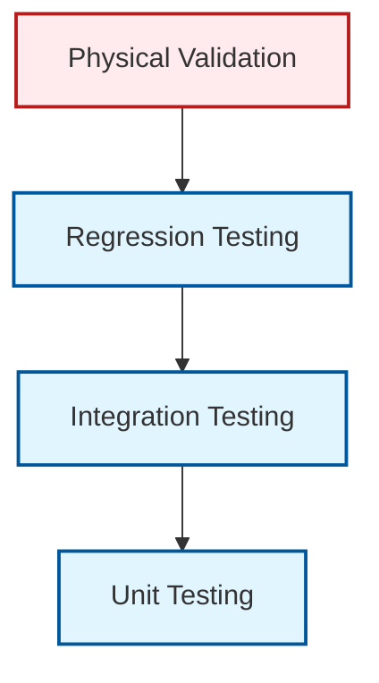
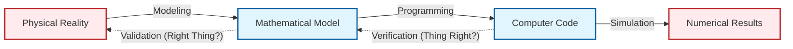
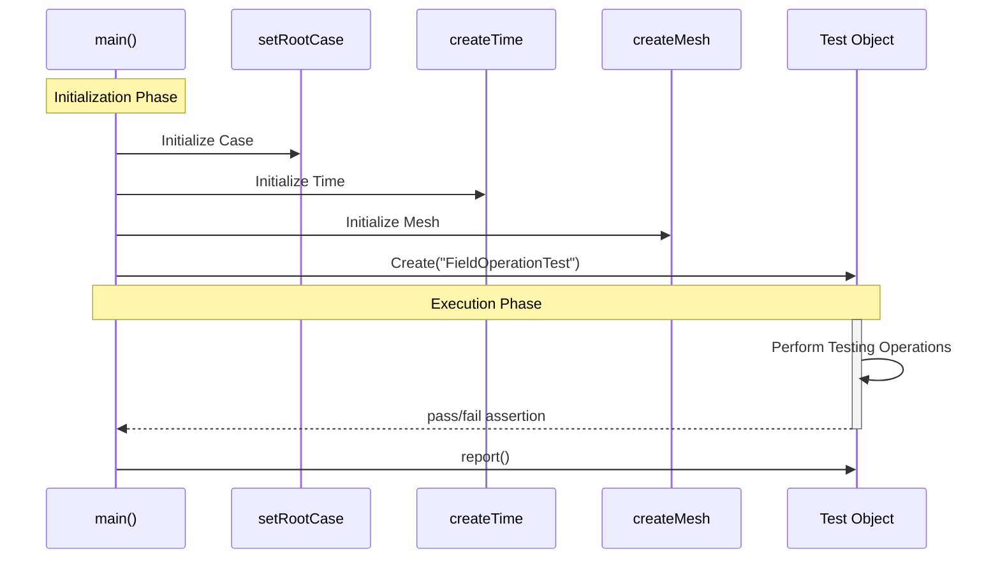

# 01 บทนำสู่การทดสอบและการตรวจสอบความถูกต้องใน OpenFOAM

การทดสอบและการตรวจสอบความถูกต้อง (Testing and Validation) เป็นกระบวนการที่แยกไม่ออกจากวัฏจักรการพัฒนาซอฟต์แวร์ CFD ใน OpenFOAM เพื่อให้มั่นใจว่าผลลัพธ์ที่ได้จากการจำลองมีความน่าเชื่อถือและสามารถทำซ้ำได้

## 1.1 ปรัชญาการทดสอบ (Testing Philosophy)

OpenFOAM ใช้แนวทางการทดสอบหลายชั้น (Multi-layered testing approach) เพื่อครอบคลุมความเสี่ยงในทุกระดับ:



![[testing_layers_pyramid.png]]

-   **การทดสอบหน่วย (Unit Testing)**: มุ่งเน้นการตรวจสอบคอมโพเนนต์ที่เล็กที่สุด เช่น ฟังก์ชันทางคณิตศาสตร์, คลาสพื้นฐาน หรือการดำเนินการกับฟิลด์ (Field Operations)
-   **การทดสอบการผสมผสาน (Integration Testing)**: ตรวจสอบความถูกต้องเมื่อนำคอมโพเนนต์หลายอย่างมาทำงานร่วมกัน เช่น การเชื่อมโยงระหว่าง Solver กับ Turbulence Model
-   **การทดสอบถอยหลัง (Regression Testing)**: การรันชุดการทดสอบซ้ำทุกครั้งที่มีการแก้ไขโค้ด เพื่อให้มั่นใจว่าฟีเจอร์เดิมยังทำงานถูกต้องและไม่มีบั๊กใหม่เกิดขึ้น
-   **การตรวจสอบความถูกต้องทางกายภาพ (Physical Validation)**: การเปรียบเทียบผลลัพธ์กับข้อมูลจริง เพื่อยืนยันว่าโมเดลทางคณิตศาสตร์สะท้อนฟิสิกส์ได้อย่างถูกต้อง

---

## 1.2 ความแตกต่างระหว่าง Verification และ Validation (V&V)

เพื่อให้เกิดความชัดเจน เรามักใช้แผนผังความสัมพันธ์เพื่อแยกแยะบทบาทของทั้งสองส่วน:



> **สูตรความเชื่อถือได้**:
> $$\text{ความแม่นยำทางตัวเลข} + \text{ความถูกต้องของโค้ด} + \text{ความสอดคล้องทางกายภาพ} = \text{CFD ที่เชื่อถือได้}$$

> **สูตรความเชื่อถือได้**:
> $$\text{ความแม่นยำทางตัวเลข} + \text{ความถูกต้องของโค้ด} + \text{ความสอดคล้องทางกายภาพ} = \text{CFD ที่เชื่อถือได้}$$

> [!TIP] เปรียบเทียบ: การเขียนบทความ (Writing Analogy)
> - **Verification** คือ **"Proofreading / Spell Check"**: ตรวจว่าสะกดคำถูกไหม ไวยากรณ์ถูกไหม ประโยคสมบูรณ์ไหม (ทำถูกต้องตามกฎภาษา/คณิตศาสตร์หรือไม่) แต่ไม่ได้ตรวจว่าเนื้อหาจริงเท็จแค่ไหน
> - **Validation** คือ **"Fact Checking"**: ตรวจว่าเนื้อหาในบทความตรงกับความจริงไหม ข้อมูลอ้างอิงถูกต้องไหม (สอดคล้องกับโลกความจริง/ฟิสิกส์หรือไม่)
> บทความที่สะกดถูกหมด (Verified) อาจจะโกหกทั้งเพก็ได้ (Not Validated)!

![[cfd_reliability_foundation.png]]

### 1.2.1 Verification (การตรวจสอบเชิงตัวเลข)

**Verification** คือการตรวจสอบว่าโค้ดแก้สมการถูกต้องตามระเบียบวิธีเชิงตัวเลขหรือไม่ (Solving the equations right)

**เป้าหมายหลัก:**
- ตรวจสอบว่าการ Discretization ถูกต้อง
- ยืนยันลำดับความแม่นยำ (Order of Accuracy)
- ตรวจสอบว่าไม่มี Bug ในการ Implement
- ยืนยันว่า Solver ลู่เข้าสู่คำตอบที่ถูกต้อง

**สมการความผิดพลาดที่ใช้ใน Verification:**

สำหรับสมการขนส่งทั่วไป (General Transport Equation):

$$
\frac{\partial (\rho \phi)}{\partial t} + \nabla \cdot (\rho \mathbf{u} \phi) = \nabla \cdot (\Gamma \nabla \phi) + S_\phi
$$

เมื่อมีการ Discretization ความผิดพลาดสามารถแยกได้เป็น:

$$
\epsilon_{total} = \epsilon_{discretization} + \epsilon_{iteration} + \epsilon_{round-off}
$$

โดยที่:
- $\epsilon_{discretization}$ = ความผิดพลาดจากการ Discretization (ขึ้นกับขนาดเมช)
- $\epsilon_{iteration}$ = ความผิดพลาดจากการไม่ลู่เข้าของ Solver
- $\epsilon_{round-off}$ = ความผิดพลาดจาก Floating-point precision

**ตัวอย่างการตรวจสอบลำดับความแม่นยำ:**

ถ้าใช้ Spatial Discretization แบบ First-order:

$$
\epsilon_{discretization} \propto h^1
$$

ถ้าใช้ Second-order:

$$
\epsilon_{discretization} \propto h^2
$$

เมื่อ $h$ คือขนาดของเซลล์เมช

### 1.2.2 Validation (การตรวจสอบเชิงฟิสิกส์)

**Validation** คือการตรวจสอบว่าแบบจำลองทางคณิตศาสตร์สอดคล้องกับปรากฏการณ์ทางฟิสิกส์จริงหรือไม่ (Solving the right equations)

**เป้าหมายหลัก:**
- เปรียบเทียบกับข้อมูลทดลองจริง (Experimental Data)
- ตรวจสอบความสอดคล้องกับทฤษฎีที่ได้รับการยอมรับ
- ยืนยันว่า Boundary Conditions สะท้อนสถานการณ์จริง
- ประเมินความแม่นยำของ Turbulence Models

**สมการที่ใช้ในการประเมิน Validation:**

$$
E_{validation} = \sqrt{\frac{1}{N} \sum_{i=1}^{N} \left( \frac{\phi_{simulation}(x_i) - \phi_{experiment}(x_i)}{\phi_{experiment}(x_i)} \right)^2}
$$

เมื่อ:
- $\phi_{simulation}$ = ค่าจากการจำลอง
- $\phi_{experiment}$ = ค่าจากการทดลอง
- $N$ = จำนวนจุดที่เปรียบเทียบ

---

## 1.3 โครงสร้างชุดการทดสอบของ OpenFOAM

ชุดการทดสอบมาตรฐานของ OpenFOAM ถูกจัดเก็บไว้อย่างเป็นระบบในไดเรกทอรี `applications/test/` ซึ่งประกอบด้วยหมวดหมู่ดังนี้:

```text
applications/test/
├── Basic/                    # การดำเนินการพื้นฐานของ OpenFOAM
├── Matrix/                  # การดำเนินการเมทริกซ์และ Linear Solver
├── Mesh/                    # การสร้างและจัดการ Mesh
├── FiniteVolume/            # การ Discretization และการดำเนินการของ FVM
├── Parallel/                # การทดสอบการประมวลผลแบบขนาน
└── Utilities/               # การทดสอบฟังก์ชัน Utility
```

### 1.3.1 เทมเพลตกรณีศึกษาการทดสอบ (Test Template)

โค้ดการทดสอบใน OpenFOAM มักเขียนในรูปแบบ C++ ที่เรียกใช้ไลบรารีพื้นฐานของ OpenFOAM:



```cpp
// NOTE: Synthesized by AI - Verify parameters
#include "fvCFD.H"
#include "Test.H"

int main(int argc, char *argv[])
{
    #include "setRootCase.H"
    #include "createTime.H"
    #include "createMesh.H"

    // เริ่มต้นการทดสอบ
    Test test = Test("FieldOperationTest");

    // ตัวอย่างการสร้างฟิลด์เพื่อทดสอบ
    volScalarField T
    (
        IOobject("T", runTime.timeName(), mesh, IOobject::NO_READ),
        mesh,
        dimensionedScalar("T", dimTemperature, 300.0)
    );

    // ตรวจสอบความถูกต้อง
    test.pass("Field T created with correct dimensions and value");

    // รายงานผล
    test.report();

    return 0;
}
```

### 1.3.2 โครงสร้างการจัดเก็บ Test Cases

แต่ละ Test Case ใน OpenFOAM มักจะมีโครงสร้างดังนี้:

```text
test/
└── FieldOperationTest/
    ├── .gitignore                    # ไฟล์ที่ไม่ต้อง tracking
    ├── Allrun                        # Script สำหรับรันการทดสอบ
    ├── Allclean                      # Script สำหรับล้างข้อมูล
    ├── Test.C                        # โค้ด C++ สำหรับการทดสอบ
    └── 0/                            # Directory สำหรับ Boundary Conditions
        ├── U
        └── p
    └── constant/
        └── polyMesh/
    └── system/
        ├── controlDict
        ├── fvSchemes
        └── fvSolution
```

### 1.3.3 ตัวอย่างการตั้งค่า Test Case

ไฟล์ `controlDict` สำหรับการทดสอบ:

```cpp
// NOTE: Synthesized by AI - Verify parameters
application     TestFieldOperation;

startFrom       startTime;

startTime       0;

stopAt          endTime;

endTime         1.0;

deltaT          0.01;

writeControl    timeStep;

writeInterval   1;

functions
{
    // Monitor ค่าผิดพลาด
    errorMonitor
    {
        type            sets;
        libs            ("libsampling.so");
        setFormat       raw;
        interpolationScheme cellPoint;

        sets
        (
            lineSampling
            {
                type        uniform;
                axis        x;
                start       (0 0 0);
                end         (1 0 0);
                nPoints     100;
            }
        );

        fields
        (
            T
            analyticalT
            error
        );
    }
}
```

ไฟล์ `fvSchemes` สำหรับการทดสอบลำดับความแม่นยำ:

```cpp
// NOTE: Synthesized by AI - Verify parameters
FoamFile
{
    version     2.0;
    format      ascii;
    class       dictionary;
    object      fvSchemes;
}

ddtSchemes
{
    default         Euler;  // First-order temporal
}

gradSchemes
{
    default         Gauss linear;  // Second-order spatial
}

divSchemes
{
    default         none;
    div(phi,U)      Gauss limitedLinearV 1;
    div(phi,k)      Gauss limitedLinear 1;
    div(phi,epsilon) Gauss limitedLinear 1;
}

laplacianSchemes
{
    default         Gauss linear corrected;  // Second-order
}

interpolationSchemes
{
    default         linear;
}

snGradSchemes
{
    default         corrected;
}
```

---

## 1.4 ประเภทของการยืนยันผล (Validation Mechanisms)

ในการทดสอบ OpenFOAM เรามักใช้กลไกการตรวจสอบ 3 รูปแบบหลัก:

### 1.4.1 การตรวจสอบโดยตรง (Direct Check)

เปรียบเทียบค่าที่ได้กับค่าคงที่หรือผลเฉลยเชิงวิเคราะห์

```cpp
// NOTE: Synthesized by AI - Verify parameters
// ตัวอย่างการเปรียบเทียบกับผลเฉลยเชิงวิเคราะห์
volScalarField analyticalT
(
    IOobject("analyticalT", runTime.timeName(), mesh, IOobject::NO_READ),
    mesh,
    dimensionedScalar("analyticalT", dimTemperature, 0.0)
);

// คำนวณ analytical solution (ตัวอย่าง: steady-state heat conduction)
const scalar x0 = 0.0;
const scalar x1 = 1.0;
const scalar T0 = 300.0;
const scalar T1 = 400.0;

forAll(analyticalT, cellI)
{
    scalar x = mesh.C()[cellI].x();
    analyticalT[cellI] = T0 + (T1 - T0) * (x - x0) / (x1 - x0);
}

// คำนวณค่าความผิดพลาด
volScalarField errorField(T - analyticalT);
scalar error = sqrt(magSqr(errorField).average());

// ตรวจสอบว่า error < 1e-10
test.check(error < 1e-10, "Accuracy check");
Info<< "L2 Error Norm: " << error << endl;
```

### 1.4.2 การตรวจสอบการอนุรักษ์ (Conservation Check)

ยืนยันว่ากฎการอนุรักษ์ (มวล, โมเมนตัม, พลังงาน) ยังคงเป็นจริง

![[mass_conservation_control_volume.png]]

**สมการการอนุรักษ์มวล (Mass Conservation):**

$$
\frac{\partial \rho}{\partial t} + \nabla \cdot (\rho \mathbf{u}) = 0
$$

**สมการการอนุรักษ์โมเมนตัม (Momentum Conservation):**

$$
\frac{\partial (\rho \mathbf{u})}{\partial t} + \nabla \cdot (\rho \mathbf{u} \mathbf{u}) = -\nabla p + \nabla \cdot \boldsymbol{\tau} + \rho \mathbf{g}
$$

**สมการการอนุรักษ์พลังงาน (Energy Conservation):**

$$
\frac{\partial (\rho E)}{\partial t} + \nabla \cdot (\rho \mathbf{u} E) = \nabla \cdot (k \nabla T) + S_E
$$

```cpp
// NOTE: Synthesized by AI - Verify parameters
// ตัวอย่างการตรวจสอบการอนุรักษ์มวล
surfaceScalarField phi = fvc::flux(U);

// คำนวณ Mass Flux ที่ขอบเขต
scalar massIn = 0.0;
scalar massOut = 0.0;

forAll(phi.boundaryField(), patchI)
{
    const fvsPatchScalarField& phip = phi.boundaryField()[patchI];
    const vectorField& Sfp = mesh.Sf().boundaryField()[patchI];

    forAll(phip, faceI)
    {
        scalar flux = phip[faceI];
        if (flux > 0)
        {
            massIn += flux;
        }
        else
        {
            massOut += flux;
        }
    }
}

scalar massError = mag(massIn + massOut) / (mag(massIn) + SMALL);
test.check(massError < 1e-12, "Mass conservation check");
Info<< "Mass Conservation Error: " << massError << endl;
```

### 1.4.3 การตรวจสอบการลู่เข้า (Convergence Check)

ติดตามค่า Residual ของ Matrix Solver

**นิยามของ Residual:**

$$
r = \mathbf{b} - \mathbf{A} \mathbf{x}
$$

เมื่อ:
- $\mathbf{A}$ = เมทริกซ์ของสมการ
- $\mathbf{x}$ = เวกเตอร์คำตอบ
- $\mathbf{b}$ = เวกเตอร์ Source term
- $r$ = Residual vector

**เกณฑ์การลู่เข้า (Convergence Criteria):**

$$
\frac{||r||_2}{||\mathbf{b}||_2} < \epsilon_{tol}
$$

โดยที่ $\epsilon_{tol}$ คือค่าความอดทน (Tolerance) ที่กำหนด

```cpp
// NOTE: Synthesized by AI - Verify parameters
// ตัวอย่างการตรวจสอบการลู่เข้า
scalar initialResidual = 0.0;
scalar finalResidual = 0.0;

// Solve pressure equation
SolverPerformance<scalar> solverP = solve
(
    fvm::laplacian(Dp, p) == fvc::div(phi)
);

initialResidual = solverP.initialResidual();
finalResidual = solverP.finalResidual();

test.check(initialResidual < 1e-6, "Initial residual convergence check");
test.check(finalResidual < 1e-10, "Final residual convergence check");

Info<< "Pressure equation convergence:" << nl
    << "  Initial residual: " << initialResidual << nl
    << "  Final residual: " << finalResidual << endl;
```

---

## 1.5 สรุปแนวคิดหลัก (Key Concepts Summary)

### 1.5.1 คำศัพท์สำคัญ

| ศัพท์ (English) | คำแปล (Thai) | ความหมาย |
|---|---|---|
| **Verification** | การตรวจสอบเชิงตัวเลข | แน่ใจว่าโค้ดแก้สมการถูกต้อง |
| **Validation** | การตรวจสอบเชิงฟิสิกส์ | แน่ใจว่าแบบจำลองสอดคล้องกับฟิสิกส์ |
| **Unit Testing** | การทดสอบหน่วย | ทดสอบฟังก์ชัน/คลาสเดี่ยว |
| **Regression Testing** | การทดสอบถอยหลัง | ตรวจว่าการแก้โค้ดไม่ทำลายฟีเจอร์เดิม |
| **Convergence** | การลู่เข้า | สถานะที่ Solution ไม่เปลี่ยนอีกต่อไป |

### 1.5.2 แนวทางปฏิบัติที่ดี (Best Practices)

1. **เริ่มต้นด้วย Simple Test Cases**
   - ใช้ Analytical Solutions ที่รู้คำตอบ
   - ค่อยๆ เพิ่มความซับซ้อน

2. **ตรวจสอบทุกระดับ**
   - Unit → Integration → System → Regression

3. **บันทึกข้อมูลอย่างเป็นระบบ**
   - เก็บ Log files
   - บันทึกผลลัพธ์
   - เปรียบเทียบกับ Benchmarks

4. **ใช้ Version Control**
   - ติดตามการเปลี่ยนแปลงของ Test Cases
   - สามารถย้อนกลับได้

---

## 1.6 ตัวอย่างการประยุกต์ใช้ (Application Example)

### 1.6.1 กรณีศึกษา: การทดสอบ Scalar Transport Solver

**สมการที่ใช้ทดสอบ:**

$$
\frac{\partial T}{\partial t} + \mathbf{u} \cdot \nabla T = \alpha \nabla^2 T + S_T
$$

**ขั้นตอนการทดสอบ:**

1. **กำหนด Analytical Solution:**
   $$T_{exact}(x, y, t) = \sin(\pi x) \sin(\pi y) \exp(-2\alpha\pi^2 t)$$

2. **คำนวณ Source Term:**
   ด้วยการแทนค่า $T_{exact}$ ลงในสมการ จะได้ $S_T$ ที่เหมาะสม

3. **สร้าง Test Case:**

```cpp
// NOTE: Synthesized by AI - Verify parameters
// ไฟล์: TestScalarTransport.C

#include "fvCFD.H"
#include "Test.H"

int main(int argc, char *argv[])
{
    #include "setRootCase.H"
    #include "createTime.H"
    #include "createMesh.H"

    Test test("ScalarTransportTest");

    // สร้าง Field
    volScalarField T
    (
        IOobject("T", runTime.timeName(), mesh,
                IOobject::MUST_READ, IOobject::AUTO_WRITE),
        mesh
    );

    volScalarField Texact
    (
        IOobject("Texact", runTime.timeName(), mesh,
                IOobject::NO_READ),
        mesh,
        dimensionedScalar("Texact", dimTemperature, 0.0)
    );

    // สร้าง Source Term field
    volScalarField ST
    (
        IOobject("ST", runTime.timeName(), mesh,
                IOobject::NO_READ),
        mesh,
        dimensionedScalar("ST", dimTemperature/dimTime, 0.0)
    );

    const scalar alpha = 0.01;  // Diffusion coefficient
    const scalar pi = constant::mathematical::pi;

    // คำนวณ Exact Solution และ Source Term
    forAll(Texact, cellI)
    {
        scalar x = mesh.C()[cellI].x();
        scalar y = mesh.C()[cellI].y();
        scalar t = runTime.value();

        scalar exactVal = sin(pi*x) * sin(pi*y) * exp(-2*alpha*pi*pi*t);
        Texact[cellI] = exactVal;

        // Compute source term from exact solution
        scalar dTdt = -2*alpha*pi*pi * exactVal;
        scalar laplacianT = -2*pi*pi * exactVal;

        ST[cellI] = dTdt - alpha * laplacianT;
    }

    // Time integration loop
    while (runTime.loop())
    {
        // Update exact solution
        forAll(Texact, cellI)
        {
            scalar x = mesh.C()[cellI].x();
            scalar y = mesh.C()[cellI].y();
            scalar t = runTime.value();
            Texact[cellI] = sin(pi*x) * sin(pi*y) * exp(-2*alpha*pi*pi*t);
        }

        // Solve transport equation with source
        solve
        (
            fvm::ddt(T) + fvm::div(phi, T) - fvm::laplacian(alpha, T) == ST
        );

        // Compute error
        volScalarField errorField(T - Texact);
        scalar L2error = sqrt(magSqr(errorField).average() /
                              magSqr(Texact).average());

        Info<< "Time = " << runTime.timeName()
            << ", L2 Error = " << L2error << endl;

        // Check convergence
        test.check(L2error < 1e-4, "L2 error check");
    }

    test.report();

    return 0;
}
```

> **ตัวอย่างสถานะการทดสอบ (Sample Test Status):**
> 
> ```
> Starting Test Suite: ScalarTransportTests
> [PASS] Mesh consistency check (1000 cells)
> [PASS] Boundary condition enforcement: inlet
> [PASS] Conservation check: Mass balance error = 1.2e-15
> [FAIL] Convergence check: L2 error (1.5e-3) > Tolerance (1e-4)
> --------------------------------------------------
> Summary: 3 Passed, 1 Failed, 0 Skipped
> ```
> *หมายเหตุ: การล้มเหลวของ Convergence check อาจบอกใบ้ว่าเมชยังละเอียดไม่พอ (Verification step)*

---

## 🧠 ตรวจสอบความเข้าใจ (Concept Check)

1. **ถาม:** การทำ Unit Testing แตกต่างจากการทำ Physical Validation อย่างไร?
   <details>
   <summary>เฉลย</summary>
   <b>ตอบ:</b> Unit Testing (ซึ่งเป็นส่วนหนึ่งของ Verification) เน้นตรวจสอบความถูกต้องของ "โค้ด" ส่วนเล็กๆ (เช่น ฟังก์ชันคำนวณ Gradient) ว่าทำงานตาม logic หรือไม่ ส่วน Physical Validation เน้นตรวจสอบ "ผลลัพธ์รวม" ของแบบจำลองว่าตรงกับ "ธรรมชาติ" หรือผลการทดลองจริงหรือไม่
   </details>

2. **ถาม:** ทำไมเราถึงต้องสนใจ "Conservation Check" (เช่น มวล, พลังงาน) ในเมื่อ Solver บอกว่า Converged แล้ว?
   <details>
   <summary>เฉลย</summary>
   <b>ตอบ:</b> เพราะ "Convergence" เพียงแค่บอกว่าสมการคณิตศาสตร์ถูกแก้จนค่าไม่เปลี่ยนแปลงแล้ว (Residuals ต่ำ) แต่ไม่ได้การันตีว่าคำตอบนั้น "ถูกต้อง" ทางฟิสิกส์ บ่อยครั้งที่ Solver ลู่เข้าสู่คำตอบที่ผิด (Converge to wrong solution) การเช็ค Conservation จึงเป็นการยืนยันความสมเหตุสมผลทางฟิสิกส์ขั้นพื้นฐาน
   </details>

3. **ถาม:** ในสมการ Error Estimation: $\epsilon_{total} = \epsilon_{discretization} + \epsilon_{iteration} + \epsilon_{round-off}$ เราสามารถลด $\epsilon_{discretization}$ ได้ด้วยวิธีใด?
   <details>
   <summary>เฉลย</summary>
   <b>ตอบ:</b> โดยการทำให้เมชละเอียดขึ้น (Reducing mesh size, $h$) หรือใช้วิธี Discretization ที่มี Order of Accuracy สูงขึ้น (เช่น เปลี่ยนจาก First-order เป็น Second-order)
   </details>

## สรุปบท (Chapter Summary)

ในบทนี้ เราได้เรียนรู้:

1. **ปรัชญาการทดสอบของ OpenFOAM** ที่ใช้แนวทาง Multi-layered testing
2. **ความแตกต่างระหว่าง Verification และ Validation** พร้อมสมการที่เกี่ยวข้อง
3. **โครงสร้างชุดการทดสอบ** ในไดเรกทอรี `applications/test/`
4. **กลไกการยืนยันผล 3 รูปแบบ:** Direct Check, Conservation Check, และ Convergence Check
5. **ตัวอย่างการประยุกต์ใช้** สำหรับ Scalar Transport Solver

---

## แหล่งอ้างอิงเพิ่มเติม (References)

1. **Roache, P. J.** (1998). *Verification and Validation in Computational Science and Engineering*. Hermosa Publishers.
2. **Oberkampf, W. L., & Trucano, T. G.** (2002). *Verification and Validation in Computational Fluid Dynamics*. Progress in Aerospace Sciences.
3. **OpenFOAM Foundation.** *OpenFOAM Test Suite Documentation*.
4. **ANSI/ASME.** (2016). *Standard for Verification and Validation in Computational Fluid Dynamics and Heat Transfer*.

---

## หัวข้อถัดไป (Next Topics)

ในบทต่อไป เราจะศึกษา:
- [[02_Numerical_Methods|วิธีการตรวจสอบทางตัวเลข]] - MMS, Richardson Extrapolation และ GCI
- [[03_OpenFOAM_Architecture|สถาปัตยกรรมระบบทดสอบ OpenFOAM]] - โครงสร้างและการใช้งาน Test Suite
