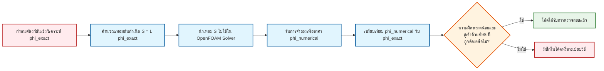

# 02 ระเบียบวิธีตรวจสอบความถูกต้องเชิงตัวเลข (Numerical Verification Methods)

> [!TIP] ทำไมต้องตรวจสอบความถูกต้องเชิงตัวเลข?
> **Numerical Verification** คือการยืนยันว่าโค้ด OpenFOAM แกะสมการคณิตศาสตร์ได้อย่างถูกต้องตามทฤษฎี ไม่ใช่แค่ "รันได้" แต่ต้อง "รันถูกต้องตาม Order of Accuracy" ที่กำหนด เช่น ถ้าใช้ Second-order scheme ความผิดพลาดต้องลดลง 4 เท่าเมื่อลดขนาดเมชลงครึ่งหนึ่ง หากไม่ผ่านการตรวจสอบนี้ ผลลัพธ์ CFD ทั้งหมดจะไม่น่าเชื่อถือ ไม่ว่าจะดูเป็นธรรมชาติแค่ไหนก็ตาม
>
> **🔧 ผลกระทบต่อ OpenFOAM Case:**
> - กระบวนการนี้มีผลโดยตรงต่อการเลือก Numerical Schemes ใน `system/fvSchemes`
> - มีผลต่อการตั้งค่า Solver tolerances ใน `system/fvSolution`
> - จำเป็นต้องใช้ Custom Code หรือ `codedFixedValue` boundary conditions สำหรับ MMS
> - ต้องบันทึกผลลัพธ์รายละเอียดผ่าน `system/controlDict` เพื่อวิเคราะห์ความลู่เข้า

การตรวจสอบความถูกต้องเชิงตัวเลข (Numerical Verification) มีวัตถุประสงค์เพื่อยืนยันว่าอัลกอริทึมและระเบียบวิธีเชิงตัวเลขได้รับการพิจารณาและนำไปใช้ในโค้ดอย่างถูกต้อง และบรรลุความแม่นยำตามที่ระบุไว้ในทฤษฎี

## 2.1 ระเบียบวิธีผลิตผลเฉลย (Method of Manufactured Solutions: MMS)

> [!NOTE] **📂 OpenFOAM Context**
> **Domain:** Coding/Customization (Domain E)
>
> MMS ต้องการการดัดแปลงโค้ด Solver หรือใช้ `codedFixedValue` boundary condition เพื่อ:
> 1. สร้าง **Source Term** ในสมการควบคุม ผ่าน `fvOptions` (ไฟล์: `constant/fvOptions`)
> 2. กำหนด **Manufactured Solution** เป็น boundary condition ผ่าน `0/<field>` (ใช้ `codedFixedValue`)
> 3. บันทึก **Error Norms** ผ่าน `functionObjects` ใน `system/controlDict`:
>    ```cpp
>    libs ("libfieldFunctionObjects.so");
>    // ใช้ powe​​rLog หรือ custom functionObject เพื่อคำนวณ L2 norm
>    ```
>
> **🔑 คำสำคัญ:** `fvOptions`, `codedFixedValue`, `functionObjects`, `sources`, `scalarSemiImplicitSource`

MMS เป็นวิธีที่มีประสิทธิภาพมากที่สุดในการตรวจสอบว่าโค้ดคำนวณได้อย่างถูกต้อง โดยเฉพาะอย่างยิ่งเมื่อเราขาดผลเฉลยเชิงวิเคราะห์ (Analytical Solutions) สำหรับปัญหาในโลกแห่งความเป็นจริง

### 2.1.1 หลักการพื้นฐานของ MMS (Basic Principles of MMS)

ระเบียบวิธีนี้ทำงานในทิศทางตรงกันข้ามกับการแก้ปัญหา CFD ทั่วไป:
- **การแก้ปัญหาทั่วไป**: ทราบสมการเชิงอนุพันธ์ → หาผลเฉลย $\phi$
- **MMS**: กำหนดผลเฉลยแม่นตรง $\phi_{exact}$ ล่วงหน้า → คำนวณเทอมต้นกำเนิด (Source Term) ที่จำเป็น



**คำอธิบาย:** แผนภาพด้านบนแสดงแนวทางการวิศวกรรมย้อนกลับของ MMS แทนที่จะแก้หาค่า $\phi$ ที่ไม่ทราบค่า เราจะกำหนด $\phi_{exact}$ และทำงานย้อนกลับเพื่อหาเทอมต้นกำเนิด $S$ ที่จะทำให้เกิดผลเฉลยนี้ วิธีนี้ช่วยให้สามารถตรวจสอบทุกเทอมในสมการที่ทำเป็นดิสครีต (Discretized Equation) ได้

**แนวคิดหลัก:**
- **ผลเฉลยที่ผลิตขึ้น (Manufactured Solution)**: ฟังก์ชันเชิงวิเคราะห์ที่ทราบค่าซึ่งเลือกให้เป็นผลเฉลย "จริง"
- **เทอมต้นกำเนิด (Source Term)**: เทอมเพิ่มเติมที่จำเป็นเพื่อให้ผลเฉลยที่ผลิตขึ้นสอดคล้องกับสมการควบคุม
- **การตรวจสอบโค้ด (Code Verification)**: ยืนยันว่าโค้ดนำแบบจำลองทางคณิตศาสตร์ไปใช้ได้อย่างถูกต้อง

### 2.1.2 ขั้นตอนการดำเนินการ MMS (MMS Implementation Steps)

> [!NOTE] **📂 OpenFOAM Context**
> **Domain:** Coding/Customization (Domain E)
>
> การนำ MMS ไปใช้ใน OpenFOAM ต้องแก้ไข Solver code โดยตรง:
> - **แก้ไขไฟล์:** `.C` ใน `applications/solvers/<solverCategory>/`
> - **เพิ่มโค้ด:**
>   ```cpp
>   // สร้าง volScalarField สำหรับ phiExact
>   volScalarField phiExact(...);
>
>   // คำนวณ Source Term ด้วย fvc::laplacian
>   volScalarField sourceTerm = D * fvc::laplacian(phiExact);
>
>   // ใช้ใน solve equation
>   solve(fvm::laplacian(D, phi) == sourceTerm);
>   ```
> - **Compile ใหม่:** ใช้ `wmake` ใน `Make/` directory
>
> **🔑 คำสำคัญ:** `volScalarField`, `fvc::laplacian`, `fvm::laplacian`, `solve()`, `wmake`

**ขั้นตอนที่ 1: กำหนดผลเฉลยที่สมมติขึ้น ($\\phi_{exact}$)**

เลือกฟังก์ชันทางคณิตศาสตร์ที่ต่อเนื่องและง่ายต่อการหาอนุพันธ์ มักเลือกฟังก์ชันตรีโกณมิติเนื่องจาก:
- มีความต่อเนื่องและราบเรียบ
- ง่ายต่อการหาอนุพันธ์ในทุกลำดับ
- ครอบคลุมช่วงของค่าที่กว้าง

ตัวอย่างฟังก์ชันสมมติสำหรับปัญหา 2 มิติ:

$$\\phi_{exact}(x, y) = \\phi_0 \\sin(\\\\frac{\\\\pi x}{L})\\cos(\\\\frac{\\\\pi y}{L})$$

**ขั้นตอนที่ 2: คำนวณเทอมต้นกำเนิด ($S$)**

แทนค่า $\phi_{exact}$ ลงในสมการเชิงอนุพันธ์เพื่อหาเทอมต้นกำเนิดที่ทำให้สมการสมดุล

สำหรับ **สมการการแพร่สถานะคงตัว (Steady-State Diffusion Equation)**:

$$\\nabla \\cdot (D \\nabla \\phi) + S = 0$$

คำนวณลาพลาเซียน (Laplacian) ของ $\phi_{exact}$:

$$\\nabla \\cdot (D \\nabla \\phi_{exact}) = D (\\frac{\\\\partial^2 \\phi_{exact}}{\\\\partial x^2} + \\frac{\\\\partial^2 \\phi_{exact}}{\\\\partial y^2})$$

$$\\\\frac{\\\\partial \\phi_{exact}}{\\\\partial x} = \\phi_0 \\frac{\\\\pi}{L} \\cos(\\\\frac{\\\\pi x}{L})\\cos(\\\\frac{\\\\pi y}{L})$$

$$\\\\frac{\\\\partial^2 \\phi_{exact}}{\\\\partial x^2} = -\\phi_0 (\\frac{\\\\pi}{L})^2 \\sin(\\\\frac{\\\\pi x}{L})\\cos(\\\\frac{\\\\pi y}{L})$$

$$\\\\frac{\\\\partial^2 \\phi_{exact}}{\\\\partial y^2} = -\\phi_0 (\\frac{\\\\pi}{L})^2 \\sin(\\\\frac{\\\\pi x}{L})\\cos(\\\\frac{\\\\pi y}{L})$$

ดังนั้น เทอมต้นกำเนิดที่ต้องการคือ:

$$S = -\\nabla \\cdot (D \\nabla \\phi_{exact}) = \\phi_0 D \\frac{2\\pi^2}{L^2} \\sin(\\\\frac{\\\\pi x}{L})\\cos(\\\\frac{\\\\pi y}{L})$$

**ขั้นตอนที่ 3: การนำไปใช้ใน OpenFOAM**

```cpp
// สร้างฟิลด์สำหรับเก็บผลเฉลยเชิงวิเคราะห์
volScalarField phiExact
(
    IOobject
    (
        "phiExact",
        runTime.timeName(),
        mesh,
        IOobject::NO_READ,
        IOobject::AUTO_WRITE
    ),
    mesh,
    dimensionedScalar("phiExact", dimless, 0.0)
);

// กำหนดค่าคงที่
const scalar phi0 = 1.0;          // แอมพลิจูดของผลเฉลยที่ผลิตขึ้น
const scalar L = 1.0;             // สเกลความยาวลักษณะเฉพาะ
const scalar D = 0.1;             // สัมประสิทธิ์การแพร่

// คำนวณ phiExact ที่จุดเมชทั้งหมด
const volVectorField& C = mesh.C();
forAll(C, celli)
{
    scalar x = C[celli].x();
    scalar y = C[celli].y();
    phiExact[celli] = phi0 * Foam::sin( Foam::constant::mathematical::pi * x / L )
                          * Foam::cos( Foam::constant::mathematical::pi * y / L );
}

// คำนวณเทอมต้นกำเนิดโดยใช้ fvc::laplacian
volScalarField sourceTerm = D * fvc::laplacian(phiExact);

// แก้สมการการแพร่ด้วยเทอมต้นกำเนิด
solve(fvm::laplacian(D, phi) == sourceTerm);

// คำนวณค่าความผิดพลาด
volScalarField error = phi - phiExact;
scalar maxError = max(mag(error)).value();
scalar L2norm = Foam::sqrt(sum(magSqr(error) * mesh.V()).value());
```

**แหล่งที่มา:** 📂 `.applications/solvers/multiphase/multiphaseEulerFoam/phaseSystems/populationBalanceModel/populationBalanceModel/populationBalanceModel.C`

**คำอธิบาย:** โค้ดนี้สาธิตเวิร์กโฟลว์ MMS ที่สมบูรณ์ใน OpenFOAM ฟิลด์ `phiExact` จะเก็บผลเฉลยที่ผลิตขึ้นซึ่งคำนวณที่จุดศูนย์กลางเซลล์แต่ละเซลล์โดยใช้ฟังก์ชันตรีโกณมิติ เทอมต้นกำเนิดคำนวณโดยใช้โอเปอเรเตอร์แคลคูลัสไฟไนต์วอลุ่ม `fvc::laplacian` ซึ่งทำการดิสครีตโอเปอเรเตอร์ลาพลาเซียน จากนั้นจะเปรียบเทียบผลเฉลยเชิงตัวเลข `phi` กับ `phiExact` เพื่อคำนวณนอร์มความผิดพลาด (Error Norms)

**แนวคิดหลัก:**
- **volScalarField**: ฟิลด์ทางเรขาคณิตที่กำหนดที่จุดศูนย์กลางเซลล์ในเมชไฟไนต์วอลุ่ม
- **mesh.C()**: คืนค่าตำแหน่งจุดศูนย์กลางเซลล์สำหรับเซลล์ทั้งหมด
- **fvc::laplacian**: โอเปอเรเตอร์แคลคูลัสไฟไนต์วอลุ่มสำหรับการคำนวณลาพลาเซียนแบบชัดแจ้ง (Explicit)
- **fvm::laplacian**: โอเปอเรเตอร์ระเบียบวิธีไฟไนต์วอลุ่มสำหรับลาพลาเซียนแบบโดยนัย (Implicit) ในสมการเมทริกซ์
- **L2 Norm**: มาตรวัดความผิดพลาดรากที่สองของค่าเฉลี่ยกำลังสอง (RMS) ที่บูรณาการตลอดทั้งโดเมน

**ขั้นตอนที่ 4: ตรวจสอบลำดับความแม่นยำ (Verify Order of Accuracy)**

> [!NOTE] **📂 OpenFOAM Context**
> **Domain:** Simulation Control (Domain C)
>
> การตรวจสอบลำดับความแม่นยำต้องการ:
> - **ไฟล์:** `system/controlDict`
> - **ตั้งค่า Write Interval:** เพื่อบันทึกผลลัพธ์ทุก time step
>   ```cpp
>   writeControl    timeStep;
>   writeInterval   1;
>   ```
> - **ใช้ functionObjects:** คำนวณ Error norms และส่งออกข้อมูล:
>   ```cpp
>   functions
>   {
>       errorCalc
>       {
>           type            sets;
>           // หรือใช้ probes, samples เพื่อเก็บข้อมูล
>       }
>   }
>   ```
> - **Post-processing:** ใช้ Python หรือ MATLAB วิเคราะห์ไฟล์ output
>
> **🔑 คำสำคัญ:** `writeControl`, `writeInterval`, `functions`, `sets`, `probes`

รันการจำลองด้วยขนาดเมชที่แตกต่างกัน 3-4 ระดับ และคำนวณความผิดพลาด:

$$L_2 \text{ Error} = \sqrt{\frac{1}{V_{total}} \sum_{i=1}^{N} V_i (\phi_i - \phi_{exact, i})^2}$$

จากนั้นพล็อต $\log(L_2 \text{ Error})$ เทียบกับ $\log(\Delta x)$ ความชันของกราฟควรตรงกับ Order of Accuracy ที่คาดหวัง (เช่น ความชัน = 2 สำหรับ 2nd order)

---

## 2.2 การประมาณค่าของริชาร์ดสัน (Richardson Extrapolation)

> [!NOTE] **📂 OpenFOAM Context**
> **Domain:** Numerics & Linear Algebra (Domain B) และ Meshing (Domain D)
>
> Richardson Extrapolation ใช้กับผลลัพธ์จากเมชหลายขนาด:
> - **เตรียมเมช:** สร้าง 3 เคส (Coarse, Medium, Fine) ใน `constant/polyMesh/`
>   - เปลี่ยนค่า `nx`, `ny`, `nz` ใน `blockMeshDict` หรือ
>   - เปลี่ยน `levels` ใน `snappyHexMeshDict`
> - **รันการจำลอง:** เก็บผลลัพธ์จากแต่ละเมช
> - **วิเคราะห์ข้อมูล:** ใช้ Python/MATLAB ประมาณค่า Exact Solution
> - **ตั้งค่า Schemes:** ต้องใช้ Scheme เดียวกันใน `system/fvSchemes` ทุกเคส
>
> **🔑 คำสำคัญ:** `blockMeshDict`, `snappyHexMeshDict`, `nx`, `ny`, `nz`, `levels`, `refinementLevels`

เมื่อเราไม่มี Analytical Solution (ซึ่งเป็นกรณีปกติของปัญหาจริง) เราสามารถใช้ผลลัพธ์จากเมชที่มีความละเอียดต่างกันเพื่อประมาณค่า "Exact Solution" ทางอ้อมได้

### 2.2.1 หลักการ (Principles)

สมมติว่าผลเฉลยเชิงตัวเลข $f$ ขึ้นอยู่กับขนาดเมช $h$ ตามสมการ:

$$
f(h) \approx f_{exact} + C \cdot h^p + \mathcal{O}(h^{p+1})
$$

เมื่อเรามีผลลัพธ์จากเมช 2 ขนาดที่มีอัตราส่วนความละเอียด (Grid Refinement Ratio) $r = h_2 / h_1 > 1$ โดยที่ $h_1$ คือเมชละเอียด และ $h_2$ คือเมชหยาบ เราสามารถประมาณค่า $f_{exact}$ ได้ดังนี้:

$$
f_{exact} \approx f_1 + \frac{f_1 - f_2}{r^p - 1}
$$

> [!TIP] เปรียบเหมือนกล้องจุลทรรศน์
> ลองนึกภาพว่าคุณกำลังดูภาพที่พิกเซลแตก (Coarse mesh) และภาพที่ชัดขึ้นเล็กน้อย (Fine mesh) Richardson Extrapolation คือการใช้สมการคณิตศาสตร์เพื่อ "เดา" ว่าภาพที่ชัดที่สุด (Infinite resolution) หน้าตาเป็นอย่างไร

### 2.2.2 เงื่อนไขการใช้งาน (Conditions)
1. เมชต้องอยู่ในช่วง Asymptotic Range (ลู่เข้าแล้ว)
2. อัตราส่วน $r$ ควรจะคงที่ (แนะนำ $r = 2$ หรืออย่างน้อย $\sqrt{2}$)
3. รูปทรงของเมชต้องคล้ายกัน (Geometrically Similar)

---

## 2.3 ดัชนีการลู่เข้าของกริด (Grid Convergence Index - GCI)

> [!NOTE] **📂 OpenFOAM Context**
> **Domain:** Numerics & Linear Algebra (Domain B) และ Meshing (Domain D)
>
> GCI คือมาตรฐานทองคำในการรายงาน Uncertainty จากเมช:
> - **เตรียมเมช 3 ขนาด:** แก้ไข `system/blockMeshDict` หรือ `system/snappyHexMeshDict`
>   ```cpp
>   // ใน blockMeshDict
>   nx   20;   // Coarse
>   nx   40;   // Medium
>   nx   80;   // Fine
>   ```
> - **ตั้งค่า Schemes:** ใช้ Scheme เดียวกันใน `system/fvSchemes`:
>   ```cpp
>   d2Schemes  default none;
>   // สำคัญมาก: อย่าเปลี่ยน scheme ข้ามเคส
>   ```
> - **วัดปริมาณที่สนใจ:** ใช้ `forces` functionObject วัด Cd, Cl:
>   ```cpp
>   functions { forces1 { type forces; ... } }
>   ```
> - **คำนวณ GCI:** ใช้ Python/MATLAB กับ output จาก `postProcessing/`
>
> **🔑 คำสำคัญ:** `blockMeshDict`, `snappyHexMeshDict`, `nx`, `d2Schemes`, `forces`, `postProcessing`

GCI เป็นวิธีการมาตรฐานที่นำเสนอโดย Roache เพื่อระบุแถบความผิดพลาด (Error Band) จากผลของเมช ช่วยให้เราสามารถรายงานผลลัพธ์พร้อมช่วงความเชื่อมั่นได้ เช่น "ค่า Drag Coefficient อยู่ที่ $0.345 \pm 0.002$"

### 2.3.1 ขั้นตอนการคำนวณ GCI (GCI Calculation Steps)

**ขั้นตอนที่ 1: เตรียมเมช 3 ขนาด**
$h_1 < h_2 < h_3$ โดยมีอัตราส่วน $r_{21} = h_2/h_1$ และ $r_{32} = h_3/h_2$ (ควร > 1.3)

**ขั้นตอนที่ 2: คำนวณลำดับความแม่นยำปรากฏ (Apparent Order, $p$)**

$$p = \frac{1}{\ln(r_{21})} |\ln| \varepsilon_{32} / \varepsilon_{21} | + q(p)|$$

โดยที่ $\varepsilon_{21} = f_2 - f_1$ และ $\varepsilon_{32} = f_3 - f_2$

**ขั้นตอนที่ 3: คำนวณ GCI**
สำหรับเมชละเอียด (Fine Grid):

$$GCI_{fine} = \frac{F_s \cdot |\varepsilon_{rel}|}{r^p - 1}$$

โดยที่ $\varepsilon_{rel} = \frac{f_2 - f_1}{f_1}$

*   **$F_s$ (Safety Factor)**:
    *   $F_s = 3.0$ สำหรับเมช 2 ขนาด (ไม่แนะนำ)
    *   $F_s = 1.25$ สำหรับเมช 3 ขนาดขึ้นไป

### 2.3.2 ตัวอย่างโค้ด Python สำหรับคำนวณ GCI

> [!NOTE] **📂 OpenFOAM Context**
> **Domain:** Simulation Control (Domain C)
>
> การใช้ Python คำนวณ GCI ต้องการข้อมูลจาก OpenFOAM:
> - **ไฟล์ input:** อ่านค่าจาก `postProcessing/forces/0/coeffs`
> - **OpenFOAM output format:**
>   ```cpp
>   # Time        Cd          Cl          Cm
>   1000          0.345       0.123       0.045
>   ```
> - **Automation:** สามารถรัน Python script ผ่าน `system/controlDict`:
>   ```cpp
>   functions
>   {
>       runPythonScript
>       {
>           type            coded;
>           functionObjectLibs ("libutilityFunctionObjects.so");
>           code
>           #{
>               system("python3 $FOAM_CASE/scripts/calculate_gci.py");
>           #};
>       }
>   }
>   ```
>
> **🔑 คำสำคัญ:** `postProcessing`, `forces`, `coeffs`, `coded`, `functionObjectLibs`

```python
import numpy as np

def calculate_gci(f1, f2, f3, r=2.0):
    """
    คำนวณ Grid Convergence Index (GCI)
    f1: ผลลัพธ์จากเมชละเอียด (Fine)
    f2: ผลลัพธ์จากเมชปานกลาง (Medium)
    f3: ผลลัพธ์จากเมชหยาบ (Coarse)
    r: อัตราส่วน Grid Refinement
    """
    epsilon21 = f2 - f1
    epsilon32 = f3 - f2

    # ตรวจสอบการลู่เข้า (Convergence Check)
    oscillatory = False
    if epsilon21 * epsilon32 < 0:
        oscillatory = True

    # คำนวณ Apparent Order (p) แบบ Iterative หรือใช้สูตรประมาณ
    # สำหรับ r คงที่:
    p = np.log(abs(epsilon32 / epsilon21)) / np.log(r)

    # คำนวณ GCI สำหรับเมชละเอียด
    Fs = 1.25
    GCI_fine = (Fs * abs((f2 - f1) / f1)) / (r**p - 1)

    return p, GCI_fine, oscillatory

# ตัวอย่างการใช้งาน
Cd_fine = 0.345
Cd_med = 0.352
Cd_coarse = 0.368

p, gci, osc = calculate_gci(Cd_fine, Cd_med, Cd_coarse)

print(f"Apparent Order (p): {p:.2f}")
print(f"GCI (Fine mesh): {gci*100:.2f}%")
print(f"Reported Value: {Cd_fine} +/- {Cd_fine*gci:.4f}")
```

> **📊 ผลลัพธ์ที่คาดหวัง:**
> โค้ดจะคำนวณค่า $p$ ซึ่งควรใกล้เคียงกับ Theoretical Order ของ Scheme (เช่น 2.0) และบอกค่า GCI ซึ่งเป็น % ความไม่แน่นอน

---

## 2.4 สรุปและแนวทางการเลือกวิธี (Summary and Selection Guide)

| สถานการณ์ | วิธีที่แนะนำ | ข้อดี | ข้อเสีย |
| :--- | :--- | :--- | :--- |
| **ทดสอบ Solver ใหม่** | **MMS** | แม่นยำที่สุด, เช็คได้ทุกเทอม | ยากในการสร้าง Analytical Solution ที่ซับซ้อน |
| **ทำโปรเจกต์ทั่วไป** | **GCI (3 Grids)** | เป็นมาตรฐาน, ไม่ต้องรู้ Exact Solution | ต้องรัน 3 เคส, เปลืองทรัพยากร |
| **ทรัพยากรจำกัด** | **2-Grid Check** | เร็ว | ไม่แม่นยำ, บอกค่าความไม่แน่นอนไม่ได้ |

> [!TIP] คำแนะนำจากมืออาชีพ
> สำหรับงานวิจัยหรือวิศวกรรมขั้นสูง **ต้อง** ทำ Grid Convergence Study (GCI) เสมอ มิฉะนั้นผลลัพธ์ของคุณอาจถูกปฏิเสธเนื่องจากไม่ทราบระดับความไม่แน่นอน

---

## 🧠 ตรวจสอบความเข้าใจ (Concept Check)

1. **ถาม:** ทำไม MMS ถึงต้องการ "Source Term" เพิ่มเติมในสมการ?
   <details>
   <summary>เฉลย</summary>
   <b>ตอบ:</b> เพราะ "Manufactured Solution" ที่เราสมมติขึ้นมักจะไม่ได้เป็นคำตอบตามธรรมชาติของสมการดั้งเดิม (เช่น ไม่ได้สอดคล้องกับ Conservation Laws จริงๆ) ดังนั้นเราจึงต้องเพิ่ม Source Term เข้าไปเพื่อชดเชยความไม่สมดุลนั้น และบังคับให้สมการเป็นจริงสำหรับ Solution ที่เรากำหนด
   </details>

2. **ถาม:** ถ้าคำนวณ GCI แล้วได้ค่า $p$ (Apparent Order) เป็น 0.5 ทั้งที่ใช้ Scheme แบบ Second-order ($p=2$) เกิดจากอะไรได้บ้าง?
   <details>
   <summary>เฉลย</summary>
   <b>ตอบ:</b> อาจเกิดจากหลายสาเหตุ เช่น (1) เมชยังไม่อยู่ใน Asymptotic Range (หยาบเกินไป), (2) มี Discontinuity ในการไหล (เช่น Shock wave) ที่ลด Order ของ Scheme, หรือ (3) มีบั๊กใน Boundary Conditions
   </details>

3. **ถาม:** Safety Factor ($F_s$) ใน GCI มีไว้เพื่ออะไร?
   <details>
   <summary>เฉลย</summary>
   <b>ตอบ:</b> เพื่อเผื่อความไม่แน่นอนในการประมาณค่า เพราะ GCI เป็นเพียงการประมาณการลู่เข้า ไม่ใช่การวัด Error ที่แท้จริง การใช้ $F_s = 1.25$ (สำหรับ 3 grids) หรือ $3.0$ (สำหรับ 2 grids) ช่วยให้กรอบความผิดพลาดที่รายงานมีความระมัดระวัง (Conservative) และน่าเชื่อถือมากขึ้น
   </details>

$$L_2 \text{ Error} = \sqrt{\frac{1}{N} \sum_{i=1}^{N} (\phi_i^{numerical} - \phi_i^{exact})^2}$$