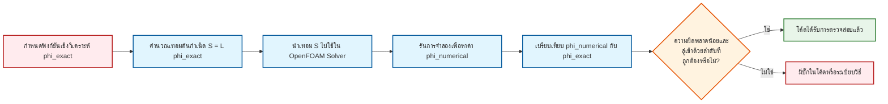

# 02a ระเบียบวิธีผลิตผลเฉลย (Method of Manufactured Solutions: MMS)

> [!TIP] ทำไมต้องตรวจสอบความถูกต้องเชิงตัวเลข?
> **Numerical Verification** คือการยืนยันว่าโค้ด OpenFOAM แกะสมการคณิตศาสตร์ได้อย่างถูกต้องตามทฤษฎี ไม่ใช่แค่ "รันได้" แต่ต้อง "รันถูกต้องตาม Order of Accuracy" ที่กำหนด เช่น ถ้าใช้ Second-order scheme ความผิดพลาดต้องลดลง 4 เท่าเมื่อลดขนาดเมชลงครึ่งหนึ่ง หากไม่ผ่านการตรวจสอบนี้ ผลลัพธ์ CFD ทั้งหมดจะไม่น่าเชื่อถือ ไม่ว่าจะดูเป็นธรรมชาติแค่ไหนก็ตาม
>
> **🔧 ผลกระทบต่อ OpenFOAM Case:**
> - กระบวนการนี้มีผลโดยตรงต่อการเลือก Numerical Schemes ใน `system/fvSchemes`
> - มีผลต่อการตั้งค่า Solver tolerances ใน `system/fvSolution`
> - จำเป็นต้องใช้ Custom Code หรือ `codedFixedValue` boundary conditions สำหรับ MMS
> - ต้องบันทึกผลลัพธ์รายละเอียดผ่าน `system/controlDict` เพื่อวิเคราะห์ความลู่เข้า

การตรวจสอบความถูกต้องเชิงตัวเลข (Numerical Verification) มีวัตถุประสงค์เพื่อยืนยันว่าอัลกอริทึมและระเบียบวิธีเชิงตัวเลขได้รับการพิจารณาและนำไปใช้ในโค้ดอย่างถูกต้อง และบรรลุความแม่นยำตามที่ระบุไว้ในทฤษฎี

---

## 🎯 วัตถุประสงค์การเรียนรู้ (Learning Objectives)

หลังจากศึกษาบทนี้ คุณควรจะสามารถ:

1. **เข้าใจหลักการของ MMS**: อธิบายแนวคิดการวิศวกรรมย้อนกลับ (Reverse Engineering) ในการตรวจสอบโค้ด OpenFOAM และเหตุผลที่ต้องใช้วิธีนี้เมื่อขาดผลเฉลยเชิงวิเคราะห์

2. **ดำเนินการ MMS 4 ขั้นตอน**: กำหนดฟังก์ชันผลเฉลย, คำนวณ Source Term, นำไปใช้ใน OpenFOAM ด้วย `fvc::laplacian` และ `fvm::laplacian`, และตรวจสอบลำดับความแม่นยำ

3. **เขียนโค้ด MMS ใน OpenFOAM**: ใช้ `volScalarField`, `mesh.C()`, และ `solve()` เพื่อสร้าง Custom Solver ที่คำนวณความผิดพลาดเทียบกับผลเฉลยที่ผลิตขึ้น

4. **วิเคราะห์ผลลัพธ์**: คำนวณ L2 Norm, พล็อตกราฟความสัมพันธ์ระหว่างความผิดพลาดและขนาดเมช, และยืนยันลำดับความแม่นยำที่ได้จากการทดสอบ

---

## 2.1 หลักการพื้นฐานของ MMS (Basic Principles of MMS)

> [!NOTE] **📂 OpenFOAM Context**
> **Domain:** Coding/Customization (Domain E)
>
> MMS ต้องการการดัดแปลงโค้ด Solver หรือใช้ `codedFixedValue` boundary condition เพื่อ:
> 1. สร้าง **Source Term** ในสมการควบคุม ผ่าน `fvOptions` (ไฟล์: `constant/fvOptions`)
> 2. กำหนด **Manufactured Solution** เป็น boundary condition ผ่าน `0/<field>` (ใช้ `codedFixedValue`)
> 3. บันทึก **Error Norms** ผ่าน `functionObjects` ใน `system/controlDict`:
>    ```cpp
>    libs ("libfieldFunctionObjects.so");
>    // ใช้ powerLog หรือ custom functionObject เพื่อคำนวณ L2 norm
>    ```
>
> **🔑 คำสำคัญ:** `fvOptions`, `codedFixedValue`, `functionObjects`, `sources`, `scalarSemiImplicitSource`

MMS เป็นวิธีที่มีประสิทธิภาพมากที่สุดในการตรวจสอบว่าโค้ดคำนวณได้อย่างถูกต้อง โดยเฉพาะอย่างยิ่งเมื่อเราขาดผลเฉลยเชิงวิเคราะห์ (Analytical Solutions) สำหรับปัญหาในโลกแห่งความเป็นจริง

ระเบียบวิธีนี้ทำงานในทิศทางตรงกันข้ามกับการแก้ปัญหา CFD ทั่วไป:
- **การแก้ปัญหาทั่วไป**: ทราบสมการเชิงอนุพันธ์ → หาผลเฉลย $\phi$
- **MMS**: กำหนดผลเฉลยแม่นตรง $\phi_{exact}$ ล่วงหน้า → คำนวณเทอมต้นกำเนิด (Source Term) ที่จำเป็น



**คำอธิบาย:** แผนภาพด้านบนแสดงแนวทางการวิศวกรรมย้อนกลับของ MMS แทนที่จะแก้หาค่า $\phi$ ที่ไม่ทราบค่า เราจะกำหนด $\phi_{exact}$ และทำงานย้อนกลับเพื่อหาเทอมต้นกำเนิด $S$ ที่จะทำให้เกิดผลเฉลยนี้ วิธีนี้ช่วยให้สามารถตรวจสอบทุกเทอมในสมการที่ทำเป็นดิสครีต (Discretized Equation) ได้

**แนวคิดหลัก:**
- **ผลเฉลยที่ผลิตขึ้น (Manufactured Solution)**: ฟังก์ชันเชิงวิเคราะห์ที่ทราบค่าซึ่งเลือกให้เป็นผลเฉลย "จริง"
- **เทอมต้นกำเนิด (Source Term)**: เทอมเพิ่มเติมที่จำเป็นเพื่อให้ผลเฉลยที่ผลิตขึ้นสอดคล้องกับสมการควบคุม
- **การตรวจสอบโค้ด (Code Verification)**: ยืนยันว่าโค้ดนำแบบจำลองทางคณิตศาสตร์ไปใช้ได้อย่างถูกต้อง

---

## 2.2 ขั้นตอนการดำเนินการ MMS (MMS Implementation Steps)

> [!NOTE] **📂 OpenFOAM Context**
> **Domain:** Coding/Customization (Domain E)
>
> การนำ MMS ไปใช้ใน OpenFOAM ต้องแก้ไข Solver code โดยตรง:
> - **แก้ไขไฟล์:** `.C` ใน `applications/solvers/<solverCategory>/`
> - **เพิ่มโค้ด:**
>   ```cpp
>   // สร้าง volScalarField สำหรับ phiExact
>   volScalarField phiExact(...);
>
>   // คำนวณ Source Term ด้วย fvc::laplacian
>   volScalarField sourceTerm = D * fvc::laplacian(phiExact);
>
>   // ใช้ใน solve equation
>   solve(fvm::laplacian(D, phi) == sourceTerm);
>   ```
> - **Compile ใหม่:** ใช้ `wmake` ใน `Make/` directory
>
> **🔑 คำสำคัญ:** `volScalarField`, `fvc::laplacian`, `fvm::laplacian`, `solve()`, `wmake`

### ขั้นตอนที่ 1: กำหนดผลเฉลยที่สมมติขึ้น ($\\phi_{exact}$)

เลือกฟังก์ชันทางคณิตศาสตร์ที่ต่อเนื่องและง่ายต่อการหาอนุพันธ์ มักเลือกฟังก์ชันตรีโกณมิติเนื่องจาก:
- มีความต่อเนื่องและราบเรียบ
- ง่ายต่อการหาอนุพันธ์ในทุกลำดับ
- ครอบคลุมช่วงของค่าที่กว้าง

ตัวอย่างฟังก์ชันสมมติสำหรับปัญหา 2 มิติ:

$$\\phi_{exact}(x, y) = \\phi_0 \\sin(\\frac{\\pi x}{L})\\cos(\\frac{\\pi y}{L})$$

### ขั้นตอนที่ 2: คำนวณเทอมต้นกำเนิด ($S$)

แทนค่า $\phi_{exact}$ ลงในสมการเชิงอนุพันธ์เพื่อหาเทอมต้นกำเนิดที่ทำให้สมการสมดุล

สำหรับ **สมการการแพร่สถานะคงตัว (Steady-State Diffusion Equation)**:

$$\\nabla \\cdot (D \\nabla \\phi) + S = 0$$

คำนวณลาพลาเซียน (Laplacian) ของ $\phi_{exact}$:

$$\\nabla \\cdot (D \\nabla \\phi_{exact}) = D (\\frac{\\partial^2 \\phi_{exact}}{\\partial x^2} + \\frac{\\partial^2 \\phi_{exact}}{\\partial y^2})$$

$$\\frac{\\partial \\phi_{exact}}{\\partial x} = \\phi_0 \\frac{\\pi}{L} \\cos(\\frac{\\pi x}{L})\\cos(\\frac{\\pi y}{L})$$

$$\\frac{\\partial^2 \\phi_{exact}}{\\partial x^2} = -\\phi_0 (\\frac{\\pi}{L})^2 \\sin(\\frac{\\pi x}{L})\\cos(\\frac{\\pi y}{L})$$

$$\\frac{\\partial^2 \\phi_{exact}}{\\partial y^2} = -\\phi_0 (\\frac{\\pi}{L})^2 \\sin(\\frac{\\pi x}{L})\\cos(\\frac{\\pi y}{L})$$

ดังนั้น เทอมต้นกำเนิดที่ต้องการคือ:

$$S = -\\nabla \\cdot (D \\nabla \\phi_{exact}) = \\phi_0 D \\frac{2\\pi^2}{L^2} \\sin(\\frac{\\pi x}{L})\\cos(\\frac{\\pi y}{L})$$

### ขั้นตอนที่ 3: การนำไปใช้ใน OpenFOAM

```cpp
// สร้างฟิลด์สำหรับเก็บผลเฉลยเชิงวิเคราะห์
volScalarField phiExact
(
    IOobject
    (
        "phiExact",
        runTime.timeName(),
        mesh,
        IOobject::NO_READ,
        IOobject::AUTO_WRITE
    ),
    mesh,
    dimensionedScalar("phiExact", dimless, 0.0)
);

// กำหนดค่าคงที่
const scalar phi0 = 1.0;          // แอมพลิจูดของผลเฉลยที่ผลิตขึ้น
const scalar L = 1.0;             // สเกลความยาวลักษณะเฉพาะ
const scalar D = 0.1;             // สัมประสิทธิ์การแพร่

// คำนวณ phiExact ที่จุดเมชทั้งหมด
const volVectorField& C = mesh.C();
forAll(C, celli)
{
    scalar x = C[celli].x();
    scalar y = C[celli].y();
    phiExact[celli] = phi0 * Foam::sin( Foam::constant::mathematical::pi * x / L )
                          * Foam::cos( Foam::constant::mathematical::pi * y / L );
}

// คำนวณเทอมต้นกำเนิดโดยใช้ fvc::laplacian
volScalarField sourceTerm = D * fvc::laplacian(phiExact);

// แก้สมการการแพร่ด้วยเทอมต้นกำเนิด
solve(fvm::laplacian(D, phi) == sourceTerm);

// คำนวณค่าความผิดพลาด
volScalarField error = phi - phiExact;
scalar maxError = max(mag(error)).value();
scalar L2norm = Foam::sqrt(sum(magSqr(error) * mesh.V()).value());
```

**แหล่งที่มา:** 📂 `.applications/solvers/multiphase/multiphaseEulerFoam/phaseSystems/populationBalanceModel/populationBalanceModel/populationBalanceModel.C`

**คำอธิบาย:** โค้ดนี้สาธิตเวิร์กโฟลว์ MMS ที่สมบูรณ์ใน OpenFOAM ฟิลด์ `phiExact` จะเก็บผลเฉลยที่ผลิตขึ้นซึ่งคำนวณที่จุดศูนย์กลางเซลล์แต่ละเซลล์โดยใช้ฟังก์ชันตรีโกณมิติ เทอมต้นกำเนิดคำนวณโดยใช้โอเปอเรเตอร์แคลคูลัสไฟไนต์วอลุ่ม `fvc::laplacian` ซึ่งทำการดิสครีตโอเปอเรเตอร์ลาพลาเซียน จากนั้นจะเปรียบเทียบผลเฉลยเชิงตัวเลข `phi` กับ `phiExact` เพื่อคำนวณนอร์มความผิดพลาด (Error Norms)

**แนวคิดหลัก:**
- **volScalarField**: ฟิลด์ทางเรขาคณิตที่กำหนดที่จุดศูนย์กลางเซลล์ในเมชไฟไนต์วอลุ่ม
- **mesh.C()**: คืนค่าตำแหน่งจุดศูนย์กลางเซลล์สำหรับเซลล์ทั้งหมด
- **fvc::laplacian**: โอเปอเรเตอร์แคลคูลัสไฟไนต์วอลุ่มสำหรับการคำนวณลาพลาเซียนแบบชัดแจ้ง (Explicit)
- **fvm::laplacian**: โอเปอเรเตอร์ระเบียบวิธีไฟไนต์วอลุ่มสำหรับลาพลาเซียนแบบโดยนัย (Implicit) ในสมการเมทริกซ์
- **L2 Norm**: มาตรวัดความผิดพลาดรากที่สองของค่าเฉลี่ยกำลังสอง (RMS) ที่บูรณาการตลอดทั้งโดเมน

### ขั้นตอนที่ 4: ตรวจสอบลำดับความแม่นยำ (Verify Order of Accuracy)

> [!NOTE] **📂 OpenFOAM Context**
> **Domain:** Simulation Control (Domain C)
>
> การตรวจสอบลำดับความแม่นยำต้องการ:
> - **ไฟล์:** `system/controlDict`
> - **ตั้งค่า Write Interval:** เพื่อบันทึกผลลัพธ์ทุก time step
>   ```cpp
>   writeControl    timeStep;
>   writeInterval   1;
>   ```
> - **ใช้ functionObjects:** คำนวณ Error norms และส่งออกข้อมูล:
>   ```cpp
>   functions
>   {
>       errorCalc
>       {
>           type            sets;
>           // หรือใช้ probes, samples เพื่อเก็บข้อมูล
>       }
>   }
>   ```
> - **Post-processing:** ใช้ Python หรือ MATLAB วิเคราะห์ไฟล์ output
>
> **🔑 คำสำคัญ:** `writeControl`, `writeInterval`, `functions`, `sets`, `probes`

รันการจำลองด้วยขนาดเมชที่แตกต่างกัน 3-4 ระดับ และคำนวณความผิดพลาด:

$$L_2 \text{ Error} = \sqrt{\frac{1}{V_{total}} \sum_{i=1}^{N} V_i (\phi_i - \phi_{exact, i})^2}$$

จากนั้นพล็อต $\log(L_2 \text{ Error})$ เทียบกับ $\log(\Delta x)$ ความชันของกราฟควรตรงกับ Order of Accuracy ที่คาดหวัง (เช่น ความชัน = 2 สำหรับ 2nd order)

---

## 🧠 ตรวจสอบความเข้าใจ (Concept Check)

1. **ถาม:** ทำไม MMS ถึงต้องการ "Source Term" เพิ่มเติมในสมการ?
   <details>
   <summary>เฉลย</summary>
   <b>ตอบ:</b> เพราะ "Manufactured Solution" ที่เราสมมติขึ้นมักจะไม่ได้เป็นคำตอบตามธรรมชาติของสมการดั้งเดิม (เช่น ไม่ได้สอดคล้องกับ Conservation Laws จริงๆ) ดังนั้นเราจึงต้องเพิ่ม Source Term เข้าไปเพื่อชดเชยความไม่สมดุลนั้น และบังคับให้สมการเป็นจริงสำหรับ Solution ที่เรากำหนด
   </details>

2. **ถาม:** ทำไมต้องใช้ฟังก์ชันตรีโกณมิติสำหรับ Manufactured Solution?
   <details>
   <summary>เฉลย</summary>
   <b>ตอบ:</b> เพราะฟังก์ชันตรีโกณมิติ (sin, cos) มีความต่อเนื่องสูง (infinitely differentiable) ทำให้เราสามารถหาอนุพันธ์ได้ทุกลำดับ และครอบคลุมช่วงค่าที่หลากหลาย ทำให้เหมาะสำหรับทดสอบทุกเทอมในสมการ
   </details>

3. **ถาม:** ถ้าพล็อตกราฟแล้วได้ความชัน (slope) = 1.5 แต่คาดหวังว่าจะเป็น 2.0 แปลว่าอะไร?
   <details>
   <summary>เฉลย</summary>
   <b>ตอบ:</b> อาจเกิดจาก (1) เมชยังไม่ละเอียดพอ (ไม่อยู่ใน Asymptotic Range), (2) มี Numerical Dissipation จาก scheme ที่ใช้, หรือ (3) มีบั๊กในการดิสครีตซึ่งควรตรวจสอบเพิ่มเติม
   </details>

---

## 📝 สรุปสิ่งสำคัญ (Key Takeaways)

**เวิร์กโฟลว์ MMS 4 ขั้นตอน:**

1. **กำหนดฟังก์ชัน $\phi_{exact}$**: เลือกฟังก์ชันตรีโกณมิติที่ต่อเนื่องและหาอนุพันธ์ได้ง่าย เช่น $\sin(\pi x/L)\cos(\pi y/L)$

2. **คำนวณ Source Term $S$**: แทนค่า $\phi_{exact}$ ลงในสมการเชิงอนุพันธ์และหาอนุพันธ์เพื่อให้ได้ $S = -L(\phi_{exact})$

3. **Implement ใน OpenFOAM**: ใช้ `volScalarField` สร้างฟิลด์ `phiExact` และคำนวณ `sourceTerm` ด้วย `fvc::laplacian` แล้วแก้สมการด้วย `solve(fvm::laplacian(D, phi) == sourceTerm)`

4. **ตรวจสอบ Order of Accuracy**: รันการจำลองด้วยเมช 3-4 ระดับ คำนวณ L2 Error และพล็อตกราฟ $\log(\text{Error})$ เทียบ $\log(\Delta x)$ เพื่อยืนยันลำดับความแม่นยำ

**แนวคิดสำคัญ:**
- MMS ใช้ **Reverse Engineering Approach**: กำหนดคำตอบก่อนแล้วหาคำถาม (Source Term) ที่ทำให้คำตอบนั้นถูกต้อง
- **Source Term** ทำหน้าที่ชดเชยความไม่สมดุลของสมการเมื่อบังคับใช้ Manufactured Solution ที่ไม่ได้เป็นผลเฉลยตามธรรมชาติ
- **L2 Norm** วัดความผิดพลาดเชิงบูรณาการทั่วทั้งโดเมน ให้ค่าที่เชื่อถือได้กว่า Max Error
- **Grid Convergence Study** จำเป็นเพื่อยืนยันว่าโค้ดมีความแม่นยำตามทฤษฎี (เช่น slope = 2 สำหรับ Second-order scheme)

**OpenFOAM Implementation Highlights:**
- ใช้ `fvc::` (finite volume calculus) สำหรับ explicit calculations และ `fvm::` (finite volume method) สำหรับ implicit terms
- `mesh.C()` ให้ตำแหน่งจุดศูนย์กลางเซลล์สำหรับคำนวณฟังก์ชัน analytical
- `functionObjects` ใน `controlDict` ช่วยบันทึก Error norms โดยอัตโนมัติ

---

## 📖 เอกสารที่เกี่ยวข้อง

- **ภาพรวม:** [00_Overview.md](00_Overview.md) — ภาพรวม Verification Fundamentals
- **บทถัดไป:** [02b_Richardson_Extrapolation_GCI.md](02b_Richardson_Extrapolation_GCI.md) — การประมาณค่าของริชาร์ดสันและดัชนีการลู่เข้าของกริด