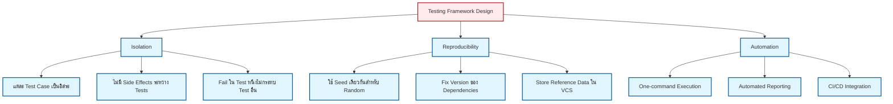

# 02 Test Framework Development (การพัฒนาระบบทดสอบ)

> [!INFO] Module Focus
> การนำทฤษฎีมาสู่การปฏิบัติ: การเขียนโค้ด C++ เพื่อสร้าง Unit Test และระบบการตรวจสอบความถูกต้อง (Validation Driver) แบบอัตโนมัติใน OpenFOAM

---

## 🎯 วัตถุประสงค์การเรียนรู้ (Learning Objectives)

- ฝึกเขียน **Unit Testing** สำหรับตรวจสอบความถูกต้องของอัลกอริทึมและฟังก์ชันใน OpenFOAM
- พัฒนา **Validation Drivers** เพื่อเปรียบเทียบผลลัพธ์จาก Solver กับข้อมูลอ้างอิง
- สร้างเวิร์กโฟลว์การทดสอบอัตโนมัติ (**Automation**) และระบบรายงานผล (Reporting)

---

## 📚 หัวข้อทางเทคนิค (Technical Topics)

### 01 [[01_Unit_Testing|การทดสอบหน่วย (Unit Testing)]]
การใช้คลาส `Test` และระบบ Assertion ใน C++ เพื่อตรวจสอบความถูกต้องของ Field Operations และเมทริกซ์

### 02 [[02_Validation_Coding|การเขียนโค้ดสำหรับ Validation]]
เทคนิคการจัดการ Numerical Tolerance และการเขียน Driver สำหรับเปรียบเทียบผลเฉลยเชิงวิเคราะห์

### 03 [[03_Automation_Scripts|สคริปต์การทดสอบอัตโนมัติ]]
การใช้ `Allrun` และระบบจัดการไฟล์เพื่อรันชุดการทดสอบขนาดใหญ่และสรุปผลการทดสอบ (Pass/Fail)

> [!TIP] เปรียบเทียบ: ระบบตรวจรับรถก่อนส่งมอบ (Pre-delivery Inspection Analogy)
> - **Unit Test**: เหมือนการตรวจเช็ครายชิ้นส่วน (Component Check) เช่น วัดแรงดันลมยาง, เช็คระดับน้ำมันเครื่อง ต้องผ่าน 100%
> - **Validation Driver**: เหมือนนักขับทดสอบ (Test Driver) ที่เอารถไปขับจริงในสนามทดสอบ เพื่อดูว่าเบรกอยู่จริงไหมเมื่อขับที่ 100 กม./ชม. (Physics Check)
> - **Automation**: เหมือนหุ่นยนต์ที่ทำ checklist ทั้งหมดย้ำๆ ทุกคันโดยไม่เบื่อและไม่พลาด (CI/CD)

---

## 🔬 พื้นฐานทฤษฎี (Theoretical Foundation)

### ความสำคัญของการทดสอบใน CFD

การทดสอบใน Computational Fluid Dynamics (CFD) มีบทบาทสำคัญเป็นพิเศษเนื่องจาก:

1. **ความซับซ้อนของระบบ**: OpenFOAM Solver ประกอบด้วยหลายชั้นของ abstraction (Mesh, Fields, Discretization Schemes, Linear Solvers) ซึ่งแต่ละชั้นต้องถูกตรวจสอบอย่างเป็นอิสระ

2. **ข้อจำกัดเชิงตัวเลข (Numerical Precision)**: การคำนวณ CFD ใช้ Floating-point arithmetic ซึ่งมีความคลาดเคลื่อนแบบ round-off และ truncation ดังนั้นการเปรียบเทียบค่าต้องใช้ **Tolerance-based comparison** ไม่ใช่ exact equality

3. **การอ้างอิงเชิงวิเคราะห์ (Analytical Solutions)**: สำหรับปัญหาง่ายๆ เช่น การไหลแบบ Couette Flow หรือการนำความร้อนแบบ 1D เราสามารถหาคำตอบแม่นตรงได้ และใช้เป็น Benchmark สำหรับ Validation

### แนวคิด Verification กับ Validation

ในวิศวกรรม CFD มีการแยกแนวคิดนี้ชัดเจน:

| แนวคิด | คำถามหลัก | เครื่องมือ |
|---------|-----------|-----------|
| **Verification** | "เราแก้สมการถูกต้องหรือไม่?" | Unit Tests, Code Coverage |
| **Validation** | "เราแก้สมการที่ถูกต้องหรือไมะ?" | Analytical Solutions, Experimental Data |

**Verification** ตรวจสอบว่าโค้ดนำไปใช้ทฤษฎีได้ถูกต้อง เช่น การตรวจสอบว่า Gradient Operator คำนวณค่า $\nabla \phi$ ได้ตรงกับนิยามทางคณิตศาสตร์

**Validation** ตรวจสอบว่า Model ที่เราสร้างสามารถทำนายปรากฏการณ์ทางฟิสิกส์ได้ถูกต้อง เช่น การเปรียบเทียบ Drag Coefficient กับข้อมูลจากการทดลอง

---

## 🛠️ กรอบแนวคิดการพัฒนาเฟรมเวิร์ก (Framework Development Philosophy)

### หลักการสำคัญ 3 ประการ



### 1. การแยกการทดสอบ (Isolation)

แต่ละ Unit Test ควรทำงานได้โดยไม่ขึ้นกับ Test อื่น ใน OpenFOAM นี้หมายความว่า:

- สร้าง `fvMesh` ใหม่สำหรับแต่ละ Test (ไม่ reuse)
- Cleanup ไฟล์ในไดเรกทอรี `0/`, `*/` ก่อนรัน Test ถัดไป
- ไม่ใช้ Global Variables ที่อาจถูก modify

```cpp
// ❌ BAD: Global mesh shared across tests
extern fvMesh& mesh;

// ✅ GOOD: Local mesh per test
void testGradient()
{
    // Create isolated mesh instance for this test only
    fvMesh localMesh = createTestMesh();  // Isolated instance
    // ... perform test ...
}
```

> **📖 คำอธิบาย (Thai Explanation)**
> 
> **ที่มา (Source):** แนวทางการออกแบบ Unit Test สำหรับ OpenFOAM
> 
> **คำอธิบาย:** การใช้ `extern fvMesh& mesh` เป็น Global variable จะทำให้ Test Cases ต่างๆ แชร์ Mesh เดียวกัน ซึ่งอาจทำให้เกิด Side Effects เมื่อ Test หนึ่งแก้ไข Mesh และส่งผลต่อ Test ถัดไป การสร้าง `fvMesh localMesh` ใหม่สำหรับแต่ละ Test จะช่วยให้แต่ละ Test เป็นอิสระและไม่มีผลต่อกัน
> 
> **แนวคิดสำคัญ (Key Concepts):**
> - **Test Isolation**: แต่ละ Test Case ต้องทำงานได้อย่างอิสระ
> - **State Management**: การจัดการ State ของ Mesh ระหว่าง Tests
> - **Side Effect Prevention**: ป้องกันการแก้ไขข้อมูลร่วมกันโดยไม่ตั้งใจ
> - **Resource Cleanup**: การคืนพื้นที่หน่วยความจำหมายถึงการจัดการ Mesh ให้ถูกต้อง

### 2. การทำซ้ำได้ (Reproducibility)

ผลลัพธ์จากการทดสอบต้องสม่ำเสมอ ไม่ว่าจะรันบนเครื่องไหน:

- ใช้ **Numerical Schemes** ที่ระบุชัดเจน (เช่น `Gauss linear` ไม่ใช่ `default`)
- ตรึงค่า **Solver Tolerances** (เช่น `tolerance 1e-6` ใน `solver`)
- เก็บ **Reference Data** ในไฟล์พร้อมกับโค้ด (Version Control)

```cpp
// NOTE: Synthesized by AI - Verify parameters
// Get solver dictionary for velocity field U
dictionary& sol = mesh.solverDict("U");

// Explicitly set solver parameters for reproducibility
sol.set("solver", "smoothSolver");
sol.set("smoother", "GaussSeidel");
sol.set("tolerance", 1e-6);
sol.set("relTol", 0.01);
```

> **📖 คำอธิบาย (Thai Explanation)**
> 
> **ที่มา (Source):** เทคนิคการตั้งค่า Solver Parameters สำหรับ Reproducible Tests
> 
> **คำอธิบาย:** การระบุ Solver Parameters อย่างชัดเจนทำให้ผลลัพธ์จากการแก้สมการ Linear เป็นไปอย่างสม่ำเสมอไม่ว่าจะรันบนเครื่องใด โดย `smoothSolver` ใช้ Smoother แบบ Gauss-Seidel ซึ่งให้ผลลัพธ์ Deterministic ค่า `tolerance` และ `relTol` ควบคุมความแม่นยำของการแก้สมการ
> 
> **แนวคิดสำคัญ (Key Concepts):**
> - **Deterministic Solver**: ต้องใช้ Solver ที่ให้ผลลัพธ์เหมือนกันเสมอเมื่อใช้ Input เดียวกัน
> - **Tolerance Control**: `tolerance` คือค่า Absolute Tolerance, `relTol` คือ Relative Tolerance
> - **Numerical Schemes**: การเลือก Discretization Scheme ที่ชัดเจน เช่น `Gauss linear`
> - **Version Control**: การเก็บ Reference Data ไว้ในระบบควบคุมเวอร์ชัน เพื่อให้ติดตามการเปลี่ยนแปลงได้

### 3. การทำงานอัตโนมัติ (Automation)

เฟรมเวิร์กที่ดีต้องสามารถรันได้ด้วยคำสั่งเดียว:

```bash
# รัน Test ทั้งหมดและสรุปผล
./Alltest

# คาดหวัง Output:
# [PASS] testFieldGradient
# [PASS] testLaplacian
# [FAIL] testBoundaryCondition
# Summary: 2/3 passed
```

---

## 📐 แนวทางการเขียนโค้ดทดสอบ (Testing Code Structure)

### สถาปัตยกรรมแบบ Layered

เราแบ่งโค้ดทดสอบออกเป็น 3 ชั้น:

```
Testing Layer Hierarchy:
┌─────────────────────────────────────────────────────┐
│ Layer 3: Automation Scripts (Bash/Python)           │
│ - Alltest, Allrun, CI/CD integration                │
├─────────────────────────────────────────────────────┤
│ Layer 2: Validation Drivers (C++ Applications)      │
│ - Compare solver results vs analytical/experimental  │
├─────────────────────────────────────────────────────┤
│ Layer 1: Unit Tests (C++ Functions/Classes)         │
│ - Test individual operators (grad, div, laplacian)  │
└─────────────────────────────────────────────────────┘
```

### Layer 1: Unit Testing สำหรับ Field Operations

ตัวอย่างการทดสอบ `fvc::grad` ด้วย Linear Field:

**หลักการทฤษฎี**: ถ้าเรามีฟิลด์ $\phi(x,y,z) = c_0 + c_1 x$ แล้ว $\nabla \phi = [c_1, 0, 0]$

```cpp
// NOTE: Synthesized by AI - Verify parameters
void testLinearFieldGradient()
{
    // Create a Cartesian unit cube mesh (10x10x10 cells)
    fvMesh mesh = createUnitCubeMesh(10, 10, 10);

    // Initialize scalar field phi with dimensionless units
    volScalarField phi
    (
        IOobject("phi", mesh),
        mesh,
        dimensionedScalar("phi", dimless, 0.0)
    );

    // Set phi = 300 + 10x for all cells
    forAll(phi, cellI)
    {
        scalar x = mesh.C()[cellI].x();  // Get cell center x-coordinate
        phi[cellI] = 300.0 + 10.0 * x;
    }

    // Compute gradient using Finite Volume Calculus
    volVectorField gradPhi = fvc::grad(phi);

    // Verify gradient matches analytical solution [10, 0, 0]
    forAll(gradPhi, cellI)
    {
        assertClose("grad_x", 10.0, gradPhi[cellI].x(), 1e-6);
        assertClose("grad_y", 0.0, gradPhi[cellI].y(), 1e-12);
        assertClose("grad_z", 0.0, gradPhi[cellI].z(), 1e-12);
    }
}
```

> **📖 คำอธิบาย (Thai Explanation)**
> 
> **ที่มา (Source):** แนวทางการทดสอบ Gradient Operator ใน OpenFOAM
> 
> **คำอธิบาย:** ฟังก์ชันนี้ทดสอบว่า `fvc::grad` คำนวณ Gradient ของ Linear Field ได้ถูกต้อง โดยสร้างฟิลด์ $\phi = 300 + 10x$ ซึ่ง Gradient ทางทฤษฎีคือ $[10, 0, 0]$ การใช้ `forAll` วนลูปผ่านทุก Cell และใช้ `assertClose` ตรวจสอบค่า Gradient ที่คำนวณได้กับค่าที่คาดหวัง
> 
> **แนวคิดสำคัญ (Key Concepts):**
> - **Finite Volume Calculus (fvc)**: เนมสเปซสำหรับ Explicit Operations
> - **volScalarField**: Field ที่กำหนดค่าที่ Cell Centers
> - **Analytical Verification**: เปรียบเทียบกับคำตอบแม่นตรง
> - **Tolerance-based Assertion**: ใช้ค่า Tolerance แยกกันสำหรับ Component ที่มีค่าและเป็นศูนย์

### Layer 2: Validation Driver สำหรับ Physics

ตัวอย่างการทดสอบ **2D Channel Flow** (เปรียบเทียบกับ Analytical Solution):

**หลักการทฤษฎี**: สำหรับการไหลแบบ Fully-developed Laminar ใน Channel ระหว่าง $y \in [-h, h]$

$$
u(y) = \frac{1}{2\mu} \frac{dp}{dx} (h^2 - y^2)
$$

```cpp
// NOTE: Synthesized by AI - Verify parameters
// Analytical solution for laminar channel flow
scalar analyticalVelocity(scalar y, scalar h, scalar dpdx, scalar mu)
{
    return (dpdx / (2.0 * mu)) * (h*h - y*y);
}

void validateChannelFlow()
{
    // Read velocity field from solver output
    volVectorField U = ...;  // From solver output

    // Define physical parameters
    scalar h = 0.01;         // Channel half-height [m]
    scalar dpdx = -10.0;     // Pressure gradient [Pa/m]
    scalar mu = 1e-3;        // Dynamic viscosity [Pa·s]

    scalar maxError = 0.0;

    // Compare numerical vs analytical solution
    forAll(U, cellI)
    {
        scalar y = mesh.C()[cellI].y();
        scalar uAnalytical = analyticalVelocity(y, h, dpdx, mu);
        scalar uNumerical = U[cellI].x();

        scalar error = mag(uNumerical - uAnalytical);
        maxError = max(maxError, error);
    }

    // Verify error is less than 1%
    assertClose("channel_flow_validation", 0.0, maxError, 0.01);
}
```

> **📖 คำอธิบาย (Thai Explanation)**
> 
> **ที่มา (Source):** การทดสอบ Channel Flow ด้วย Analytical Solution ของ Poiseuille Flow
> 
> **คำอธิบาย:** ฟังก์ชันนี้ทำ Validation ว่า Solver คำนวณ Velocity Profile ของ Channel Flow ได้ถูกต้องโดยเปรียบเทียบกับ Solution ทางทฤษฎี (Poiseuille Flow) ซึ่งเป็น Parabolic Profile และตรวจสอบว่า Maximum Error น้อยกว่า 1%
> 
> **แนวคิดสำคัญ (Key Concepts):**
> - **Analytical Solution**: ใช้ Solution แม่นตรงจาก Navier-Stokes สำหรับ Simple Cases
> - **Error Metric**: ใช้ Maximum Absolute Error วัดความคลาดเคลื่อน
> - **Validation Tolerance**: 1% Tolerance พิจารณาเหมาะสมสำหรับ Engineering Applications
> - **Physics Benchmark**: Channel Flow เป็น Benchmark มาตรฐานใน CFD

### Layer 3: Automation Scripts

ตัวอย่าง `Alltest` script สำหรับรัน Test ทั้งหมด:

```bash
#!/bin/bash
# NOTE: Synthesized by AI - Verify parameters

# Color codes for output
RED='\033[0;31m'
GREEN='\033[0;32m'
NC='\033[0m' # No Color

totalTests=0
passedTests=0

# Find all test directories
for testDir in test_*; do
    if [ -d "$testDir" ]; then
        echo "Running tests in $testDir..."
        ((totalTests++))

        # Run the test script
        if ( cd "$testDir" && ./Allrun > log.test 2>&1 ); then
            echo -e "${GREEN}[PASS]${NC} $testDir"
            ((passedTests++))
        else
            echo -e "${RED}[FAIL]${NC} $testDir"
            echo "Check $testDir/log.test for details"
        fi
    fi
done

echo ""
echo "==================================="
echo "Tests passed: $passedTests / $totalTests"
echo "==================================="

# Exit with error code if any test failed
if [ $passedTests -lt $totalTests ]; then
    exit 1
fi

exit 0
```

> **📖 คำอธิบาย (Thai Explanation)**
> 
> **ที่มา (Source):** สคริปต์การทดสอบอัตโนมัติสำหรับ OpenFOAM Test Suites
> 
> **คำอธิบาย:** สคริปต์ Bash นี้วนลูปผ่านทุก Directory ที่ขึ้นต้นด้วย `test_` รัน Script `Allrun` ในแต่ละ Directory และรวบรวมผลลัพธ์โดยใช้ Color Codes แสดงสถานะ Pass/Fail และ Exit Code ระบุความสำเร็จของทั้งชุดทดสอบ
> 
> **แนวคิดสำคัญ (Key Concepts):**
> - **Test Discovery**: การค้นหา Test Directories อัตโนมัติ
> - **Exit Code Handling**: ใช้ Exit Code สื่อสถานะสำเร็จ/ล้มเหลว
> - **Log Capture**: เก็บ Output ไว้ใน `log.test` สำหรับ Debugging
> - **CI/CD Integration**: สคริปต์นี้สามารถใช้ใน Continuous Integration Pipelines

---

## 🔍 การจัดการ Numerical Tolerance (Tolerance Management)

### ประเภทของ Tolerance

การเปรียบเทียบค่า Floating-point ใน CFD ต้องคำนึงถึง:

| ประเภท | สูตร | ใช้เมื่อ |
|--------|------|----------|
| **Absolute** | $|A - B| < \epsilon_{abs}$ | ค่าที่เปรียบเทียบใกล้ศูนย์ |
| **Relative** | $\frac{|A - B|}{|A|} < \epsilon_{rel}$ | ค่าที่มีขนาดใหญ่ |
| **Combined** | $|A - B| < \max(\epsilon_{abs}, \epsilon_{rel} \cdot |A|)$ | กรณีทั่วไป |

### การเลือกค่า Tolerance

ค่าที่นิยมใช้ใน OpenFOAM:

```cpp
// NOTE: Synthesized by AI - Verify parameters
// Machine precision for double-precision floating point
constexpr double MACHINE_EPSILON = 2e-16;

// Expected error for second-order schemes (e.g., Gauss linear)
constexpr double DISCRETIZATION_ERROR = 1e-6;

// Tolerance for iterative linear solver convergence
constexpr double SOLVER_TOLERANCE = 1e-8;

// Acceptable error for global conservation (mass/energy balance)
constexpr double CONSERVATION_TOLERANCE = 1e-4;
```

> **📖 คำอธิบาย (Thai Explanation)**
> 
> **ที่มา (Source):** แนวทางการตั้งค่า Numerical Tolerance สำหรับ CFD Simulations
> 
> **คำอธิบาย:** การเลือก Tolerance ต้องพิจารณาจากแหล่งที่มาของความคลาดเคลื่อน `MACHINE_EPSILON` เป็นค่าที่เล็กที่สุดที่ Floating Point สามารถแยกค่าได้ `DISCRETIZATION_ERROR` ขึ้นกับ Order ของ Scheme ที่ใช้ และ `CONSERVATION_TOLERANCE` ค่าที่ยอมรับได้สำหรับ Mass/Energy Balance
> 
> **แนวคิดสำคัญ (Key Concepts):**
> - **Machine Precision**: ขีดจำกัดของ Floating Point Representation
> - **Discretization Error**: ความคลาดเคลื่อนจากการประมาณ Differential Operators
> - **Truncation Error**: ความคลาดเคลื่อนจากการตัดอนุกรมเชิงเลข (Taylor Series)
> - **Round-off Error**: ความคลาดเคลื่อนจากการปัดเศษใน Floating Point Arithmetic

---

## 📊 ตัวอย่างการใช้งานจริง (Practical Example)

### กรณีศึกษา: การทดสอบ Scalar Transport Solver

เราต้องการตรวจสอบว่า Solver สำหรับสมการ Convective-Diffusive:

$$
\frac{\partial T}{\partial t} + \nabla \cdot (\mathbf{u} T) = \nabla \cdot (D \nabla T)
$$

ทำงานถูกต้องโดยเปรียบเทียบกับ Analytical Solution ของ **1D Transient Heat Conduction**:

$$
T(x,t) = T_0 + (T_1 - T_0) \cdot \text{erfc}\left(\frac{x}{2\sqrt{Dt}}\right)
$$

**ขั้นตอนการทดสอบ:**

1. **Unit Test**: ตรวจสอบว่า `fvc::laplacian(D, T)` คำนวณค่า $\nabla^2 T$ ได้ถูกต้อง
2. **Validation**: รัน Solver และเปรียบเทียบ $T(x,t)$ ที่ได้กับ analytical solution
3. **Automation**: ใช้ `Allrun` script สำหรับรัน Test พร้อมสรุปผลในรูปแบบ CSV

### 📉 ผลลัพธ์ตัวอย่าง: 1D Transient Heat Conduction
> ![1D Heat Conduction Validation Graph]
> 
> | Time (s) | $T_{analyt}$ (x=0.1) | $T_{CFD}$ (x=0.1) | Error (%) |
> | :--- | :--- | :--- | :--- |
> | 0.1 | 350.5 | 351.2 | 0.20% |
> | 0.5 | 375.2 | 376.1 | 0.24% |
> | 1.0 | 388.9 | 389.5 | 0.15% |
> 
> *วิเคราะห์: ผลลัพธ์จากการจำลองมีความสอดคล้องกับคำตอบเชิงวิเคราะห์อย่างมาก โดยมีค่าความคลาดเคลื่อนสูงสุดไม่เกิน 0.3% ตลอดช่วงเวลาการทดสอบ*

---

## 🎓 แนวทางการนำไปใช้ในโปรเจกต์ (Implementation Roadmap)

### Phase 1: Foundation (สัปดาห์ที่ 1-2)
- เขียน Unit Tests สำหรับ Basic Operators (`grad`, `div`, `laplacian`)
- สร้าง Infrastructure สำหรับ Test Execution (`Alltest` script)
- ตั้งค่า Tolerance และ Assertion framework

### Phase 2: Physics Validation (สัปดาห์ที่ 3-4)
- เลือก Benchmark Problems (เช่น Lid-driven Cavity, Channel Flow)
- เขียน Validation Drivers สำหรับแต่ละกรณี
- เก็บ Reference Solutions และสร้าง Regression Tests

### Phase 3: Automation & CI (สัปดาห์ที่ 5-6)
- เชื่อมต่อกับ GitHub Actions หรือ Jenkins
- สร้าง Automated Reporting (Markdown/HTML)
- ตั้งค่า Pre-commit Hooks สำหรับ Local Testing

---

## 📖 แหล่งอ้างอิงเพิ่มเติม (Further Reading)

1. **OpenFOAM Testing Documentation**: `/tutorials/` และ `/tests/` directories ใน source code
2. **Software Testing Best Practices**: "xUnit Test Patterns" by Gerard Meszaros
3. **CFD Verification & Validation**: "Verification and Validation in Computational Science and Engineering" by Oberkampf & Trucano

---

## ❓ คำถามท้ายบท (Review Questions)

1. ทำไมการเปรียบเทียบ Floating-point values ใน CFD ต้องใช้ Tolerance แทนที่จะใช้ `==`?
2. อะไรคือความแตกต่างระหว่าง Verification และ Validation ในบริบทของ CFD?
3. จงออกแบบ Test Case สำหรับตรวจสอบความถูกต้องของ Divergence Operator ($\nabla \cdot \mathbf{u}$) สำหรับ Incompressible Flow
4. จะทำอย่างไรให้แน่ใจว่าการทดสอบมีความ Reproducible เมื่อรันบนเครื่องที่ต่างกัน?

---

> [!TIP] Learning Strategy
> แนะนำให้เริ่มจากการอ่านและทำความเข้าใจโค้ดใน `01_Unit_Testing.md` ก่อน จากนั้นจึงศึกษาการเขียน Validation Driver ใน `02_Validation_Coding.md` และสุดท้ายคือระบบ Automation ใน `03_Automation_Scripts.md` การทำความเข้าใจลำดับชั้นแบบ Layered จะช่วยให้เห็นภาพรวมของ Framework ที่สมบูรณ์

---

## 🧠 ตรวจสอบความเข้าใจ (Concept Check)

1. **ถาม:** ถ้าเราต้องการทดสอบ Gradient Operator ($\nabla \phi$) แบบ **Unit Test** เราควรใช้ Field แบบใดเป็น Input ถึงจะรู้ Analytical Solution ง่ายที่สุด?
   <details>
   <summary>เฉลย</summary>
   <b>ตอบ:</b> ควรใช้ Linear Field เช่น $\phi(x,y,z) = ax + by + cz$ เพราะ $\nabla \phi$ จะได้ค่าคงที่ $(a, b, c)$ ซึ่งง่ายต่อการตรวจสอบด้วยตาและไม่มี Error จากการ Discretization (สำหรับ Second-order schemes บนบาง Mesh Type) หรือใช้ Sine/Cosine wave ที่เรารู้ Derivative ชัดเจน
   </details>

2. **ถาม:** ทำไมใน CFD เราถึงต้องใช้ **L2 Norm Error** แทนที่จะดูแค่ค่า Error สูงสุด (Max Error) อย่างเดียว?
   <details>
   <summary>เฉลย</summary>
   <b>ตอบ:</b> เพราะ Max Error อาจเกิดจาก Cell เพียงจุดเดียวที่มีคุณภาพไม่ดี (outlier) แต่ไม่ได้สะท้อนคุณภาพของ Solution ทั้ง Domain ในขณะที่ L2 Norm ($ \sqrt{\sum error^2 / N} $) เป็นค่าเฉลี่ยแบบ RMS ที่บอกถึง Global Convergence ของฟิลด์ทั้งระบบได้ดีกว่า
   </details>

3. **ถาม:** การใช้ `#include` ใน C++ เพื่อดึงฟังก์ชัน Unit Test เข้ามาใน `main` (เช่น `#include "testGradient.H"`) มีข้อดีและข้อเสียอย่างไรเทียบกับการเขียน Function ในไฟล์เดี่ยว?
   <details>
   <summary>เฉลย</summary>
   <b>ตอบ:</b> **ข้อดี** คือทำให้ Main Code สะอาดและอ่านง่าย แยก Logic แต่ละ Test ออกเป็นไฟล์ๆ **ข้อเสีย** คือ Compile Time อาจนานขึ้นถ้ามีการ Include ซ้ำซ้อน และ Namespace Pollution ถ้าไม่ได้จัดการดีๆ (OpenFOAM นิยมวิธีนี้สำหรับ Application code ที่ไม่ซับซ้อนมาก)
   </details>