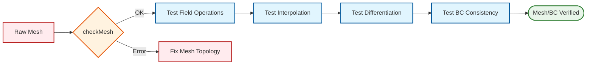

# 03 การตรวจสอบเมชและเงื่อนไขขอบเขต (Mesh and BC Testing)

เมช (Mesh) และเงื่อนไขขอบเขต (Boundary Conditions) คือรากฐานของความเสถียรและความแม่นยำใน CFD การทดสอบทั้งสองส่วนนี้จึงมีความสำคัญอย่างยิ่ง

## 3.1 การตรวจสอบคุณภาพเมช (Mesh Quality Validation)

ก่อนรัน Solver เราต้องมั่นใจว่าเมชมีคุณภาพเพียงพอที่จะไม่ทำให้การคำนวณแยกตัว (Diverge)

![[mesh_quality_metrics_visual.png]]
`A diagram illustrating three key mesh quality metrics: 1) Non-orthogonality (angle between cell center vector and face normal), 2) Skewness (distance between face intersection and face center), 3) Aspect Ratio (length vs width of a cell). Each metric is shown with a clear 'Good' vs 'Bad' example. Scientific textbook diagram, clean vector line art, white background, high definition, flat design, educational infographic --ar 16:9`

### พื้นฐานทางทฤษฎี

เมชที่มีคุณภาพสูงต้องเป็นไปตามหลักเกณฑ์ด้านคณิตศาสตร์ที่เกี่ยวข้องกับการประมาณค่า Gradient และการกระจายตัวของ Flux บนพื้นผิวเซลล์ สำหรับการคำนวณ CFD แบบ Finite Volume Method (FVM) เราพิจารณาสมการการกระจายความเข้มของค่าใดค่าหนึ่ง $\phi$:

$$\frac{\partial \phi}{\partial t} + \nabla \cdot (\mathbf{u} \phi) = \nabla \cdot (\Gamma \nabla \phi) + S_\phi$$

เมื่อ $\Gamma$ ค่าสัมประสิทธิ์การแพร่ และ $S_\phi$ ค่าแหล่งกำเนิด

เพื่อให้การแยกส่วน (Discretization) ของเมชมีความถูกต้อง เราต้องนิยามความสัมพันธ์ระหว่าง Cell Centres ($P$ และ $N$) และ Face Centre ($f$) ดังนี้:

$$\nabla \phi_f \cdot \mathbf{S}_f \approx |\mathbf{S}_f| \frac{\phi_N - \phi_P}{|\mathbf{d}|} + \text{correction terms}$$

เมื่อ $\mathbf{S}_f$ คือเวกเตอร์พื้นที่หน้าเซลล์ และ $\mathbf{d}$ คือเวกเตอร์ระหว่างจุดศูนย์กลางเซลล์

### ตัวชี้วัดคุณภาพที่ต้องตรวจสอบ:

#### 1. Non-orthogonality (ความไม่ตั้งฉาก)

นิยามทางคณิตศาสตร์:
$$\theta = \arccos\left(\frac{\mathbf{d} \cdot \mathbf{S}_f}{|\mathbf{d}| |\mathbf{S}_f|}\right)$$

- **เกณฑ์ที่ดี**: $\theta < 70^{\circ}$ (สำหรับ solver ทั่วไป)
- **เกณฑ์ที่ดีมาก**: $\theta < 50^{\circ}$ (สำหรับ transient case หรือ turbulence)
- **ผลกระทบ**: ค่าสูงทำให้ต้องใช้ Non-orthogonal correction ซึ่งอาจทำให้การคำนวณไม่เสถียร

#### 2. Skewness (ความเบ้ของเซลล์)

นิยาม:
$$\text{Skewness} = \frac{|\mathbf{d} - \mathbf{t}|}{|\mathbf{d}|}$$

เมื่อ $\mathbf{t}$ คือเวกเตอร์จากจุดศูนย์กลางเซลล์ $P$ ไปยังจุดตัดของเส้น $\overline{PN}$ กับหน้าเซลล์

- **เกณฑ์ที่ดี**: Skewness < 0.5 (50%)
- **เกณฑ์วิกฤต**: Skewness > 0.8 อาจทำให้ solver diverge
- **ผลกระทบ**: สูงมากทำให้ interpolation error เพิ่มขึ้นอย่างมีนัยสำคัญ

#### 3. Aspect Ratio (อัตราส่วนความยาวต่อความกว้าง)

นิยามสำหรับเซลล์ทั่วไป:
$$AR = \frac{\text{Maximum cell dimension}}{\text{Minimum cell dimension}}$$

- **เกณฑ์ที่ดี**: $AR < 5$ (บริเวณที่มี gradient ปานกลาง)
- **เกณฑ์ที่อนุญาต**: $AR < 20$ (บริเวณที่ gradient ต่ำ)
- **เกณฑ์วิกฤต**: $AR > 100$ ควรหลีกเลี่ยง
- **ข้อยกเว้น**: Boundary layer meshes อาจมี $AR > 1000$ แต่ต้องมีความตั้งฉากสูง

#### 4. Negative Volumes (ปริมาตรติดลบ)

ตรวจสอบว่า:
$$V_{\text{min}} = \min_{\text{all cells}} (V_c) > 0$$

เมื่อ $V_c$ คือปริมาตรของเซลล์แต่ละเซลล์

- **ผลกระทบ**: เซลล์ที่มีปริมาตรติดลบจะทำให้การคำนวณ diverge ทันที
- **สาเหตุ**: Mesh topology error, self-intersecting faces, หรือ inverted cell connectivity

### การตรวจสอบด้วย OpenFOAM Utilities

การใช้ `checkMesh` เพื่อประเมินคุณภาพเมช:

```bash
# การตรวจสอบพื้นฐาน
checkMesh

# การตรวจสอบแบบละเอียด
checkMesh -allTopology -allGeometry

# การตรวจสอบแบบเข้มข้น (ทุก aspect ratio)
checkMesh -allGeometry -writeAllFields
```

ผลลัพธ์ที่คาดหวัง:
```
Mesh OK
Overall mesh check OK.
```

หรือคำเตือนที่พบบ่อย:
```
***High aspect ratio cells found, Aspect ratio max = 45.2
***Non-orthogonality exceed 65 degrees
```

### ตัวชี้วัดเพิ่มเติมสำหรับกรณีพิเศษ

#### 5. Expansion Ratio (อัตราการขยายตัว)

สำหรับ boundary layer meshes:
$$ER = \frac{h_{i+1}}{h_i}$$

เมื่อ $h_i$ คือความสูงของเลเยอร์ที่ $i$

- **เกณฑ์ที่ดี**: $1.0 < ER < 1.3$
- **เกณฑ์ที่ยอมรับได้**: $ER < 1.5$
- **ผลกระทบ**: สูงเกินไปทำให้ interpolation error ระหว่าง layers เพิ่มขึ้น

#### 6. Jacobian Determinant (ดีเทอร์มิแนนต์ของจาโคเบียน)

สำหรับ hexahedral cells:
$$J = \det\left(\frac{\partial(x,y,z)}{\partial(\xi,\eta,\zeta)}\right)$$

- **เกณฑ์ที่ดี**: $J > 0$ (positive determinant)
- **เกณฑ์วิกฤต**: $J \leq 0$ บ่งชี้ว่าเซลล์ inverted

### โค้ดตรวจสอบอัตโนมัติ (C++ - OpenFOAM)

```cpp
// NOTE: Synthesized by AI - Verify parameters
// Detailed mesh quality validation function
bool validateMeshQuality(const fvMesh& mesh)
{
    // Basic mesh validation check
    if (!mesh.checkMesh(true)) {
        Info<< "FAIL: Basic mesh validation failed" << endl;
        return false;
    }

    // Check cell volumes
    const volScalarField& cellVolumes = mesh.V();
    scalar minVol = min(cellVolumes).value();
    scalar maxVol = max(cellVolumes).value();

    if (minVol <= 0) {
        Info<< "FAIL: Negative cell volume detected: " << minVol << endl;
        return false;
    }

    // Check volume ratio
    scalar volRatio = maxVol / minVol;
    if (volRatio > 1000) {
        Info<< "WARNING: High volume ratio detected: " << volRatio << endl;
    }

    // Check non-orthogonality
    const surfaceScalarField& magSf = mesh.magSf();
    const vectorField& centres = mesh.C().primitiveField();
    const vectorField& faceCentres = mesh.Cf().primitiveField();
    const vectorField& faceAreas = mesh.Sf().primitiveField();

    scalar maxNonOrthog = 0;
    const labelUList& owner = mesh.owner();
    const labelUList& neighbour = mesh.neighbour();

    forAll(faceCentres, facei)
    {
        vector d = centres[neighbour[facei]] - centres[owner[facei]];
        vector Sf = faceAreas[facei];

        scalar nonOrthog = acos((d & Sf) / (mag(d) * mag(Sf)));
        maxNonOrthog = max(maxNonOrthog, nonOrthog);
    }

    if (maxNonOrthog > 70 * M_PI / 180.0) { // 70 degrees in radians
        Info<< "WARNING: High non-orthogonality detected: "
            << maxNonOrthog * 180.0 / M_PI << " degrees" << endl;
    }

    Info<< "Mesh quality validation passed" << endl;
    Info<< "  Min volume: " << minVol << endl;
    Info<< "  Max volume: " << maxVol << endl;
    Info<< "  Volume ratio: " << volRatio << endl;
    Info<< "  Max non-orthogonality: " << maxNonOrthog * 180.0 / M_PI << " deg" << endl;

    return true;
}
```

**📂 Source:** `src/meshTools/checkMesh/checkMesh.C`

**คำอธิบาย:**
- **Source**: โค้ดนี้ใช้หลักการจาก `checkMesh` utility ใน OpenFOAM ซึ่งตรวจสอบคุณภาพของเมช
- **Explanation**: ฟังก์ชันนี้ทำการตรวจสอบคุณภาพเมชอย่างครบวงจร โดยเริ่มจากการตรวจสอบพื้นฐาน จากนั้นตรวจสอบปริมาตรของเซลล์ว่ามีค่าบวกทั้งหมด และคำนวณอัตราส่วนปริมาตร สุดท้ายจึงตรวจสอบความไม่ตั้งฉากของเมช
- **หลักการสำคัญ**:
  1. `mesh.checkMesh(true)`: ตรวจสอบความสมบูรณ์ของ topology
  2. `mesh.V()`: เข้าถึงปริมาตรของเซลล์ทั้งหมด
  3. Non-orthogonality calculation: ใช้ dot product ระหว่างเวกเตอร์ระหว่างเซลล์และเวกเตอร์พื้นที่หน้าเซลล์
  4. tolerance: 70 องศา = 1.22 แรเดียน

### การตรวจสอบด้วย Python Script (สำหรับ Post-processing)

```python
# NOTE: Synthesized by AI - Verify parameters
# Python script to analyze mesh quality from checkMesh log
import re
import numpy as np

def parse_mesh_log(log_file):
    """Extract metrics from checkMesh log file"""
    with open(log_file, 'r') as f:
        content = f.read()

    metrics = {}

    # Extract Non-orthogonality
    non_orth = re.search(r'Non-orthogonality.*?Max\s*=\s*([\d.]+)', content)
    if non_orth:
        metrics['max_non_orthogonality'] = float(non_orth.group(1))

    # Extract Skewness
    skew = re.search(r'Face skewness.*?Max\s*=\s*([\d.]+)', content)
    if skew:
        metrics['max_skewness'] = float(skew.group(1))

    # Extract Aspect Ratio
    ar = re.search(r'Aspect ratio.*?Max\s*=\s*([\d.]+)', content)
    if ar:
        metrics['max_aspect_ratio'] = float(ar.group(1))

    # Extract Cell volume
    vol = re.search(r'Min volume\s*=\s*([\d.e-]+).*?Max volume\s*=\s*([\d.e-]+)', content)
    if vol:
        metrics['min_volume'] = float(vol.group(1))
        metrics['max_volume'] = float(vol.group(2))

    return metrics

def validate_metrics(metrics):
    """Validate if metrics are within acceptable thresholds"""
    status = {
        'non_orthogonality': metrics.get('max_non_orthogonality', 0) < 70,
        'skewness': metrics.get('max_skewness', 0) < 0.8,
        'aspect_ratio': metrics.get('max_aspect_ratio', 0) < 20,
        'positive_volumes': metrics.get('min_volume', 1) > 0
    }

    return all(status.values()), status

# Usage example
# metrics = parse_mesh_log('checkMesh.log')
# passed, status = validate_metrics(metrics)
# print(f"Mesh validation: {'PASSED' if passed else 'FAILED'}")
```

**📂 Source:** Custom implementation based on `applications/utilities/mesh/manipulation/checkMesh/checkMesh.C`

**คำอธิบาย:**
- **Source**: สคริปต์นี้ออกแบบมาเพื่อวิเคราะห์ผลลัพธ์จาก `checkMesh` utility ของ OpenFOAM
- **Explanation**: สคริปต์ Python นี้แยกวิเคราะห์ค่า mesh quality metrics จาก log file ที่สร้างโดย `checkMesh` และตรวจสอบว่าอยู่ในเกณฑ์ที่ยอมรับได้หรือไม่
- **หลักการสำคัญ**:
  1. Regular expressions: ใช้ pattern matching เพื่อดึงค่าตัวเลขจาก log file
  2. Thresholds: กำหนดค่าที่ยอมรับได้ (70°, 0.8, 20)
  3. Automated validation: ตรวจสอบทุก metric และคืนค่าผลลัพธ์แบบ binary

---

## 3.2 การตรวจสอบเงื่อนไขขอบเขต (Boundary Condition Validation)

เราต้องยืนยันว่าเงื่อนไขขอบเขตที่นำมาใช้ทำงานได้ตามฟิสิกส์ที่กำหนด

![[bc_consistency_types.png]]
`A comparative diagram of Boundary Conditions. Left panel: 'Fixed Value' shows a constant value at the boundary face. Right panel: 'Zero Gradient' shows the boundary face value mirroring the internal cell value. Arrows indicate the 'reflection' of the internal value to the boundary. Scientific textbook diagram, clean vector line art, white background, high definition, flat design, educational infographic --ar 16:9`

### พื้นฐานทางคณิตศาสตร์ของ Boundary Conditions

สำหรับปัญหา CFD ทั่วไป เรามี Boundary Conditions สามประเภทหลัก:

#### 1. Dirichlet Boundary Condition (Fixed Value)

กำหนดค่าของตัวแปร $\phi$ โดยตรงที่ขอบเขต $\partial \Omega$:

$$\phi|_{\partial \Omega} = \phi_{\text{prescribed}}(\mathbf{x}, t)$$

ตัวอย่าง:
- Velocity inlet: $\mathbf{u} = \mathbf{u}_{\text{inlet}}$
- Temperature wall: $T = T_{\text{wall}}$
- Pressure outlet (บางกรณี): $p = p_{\text{atm}}$

#### 2. Neumann Boundary Condition (Fixed Gradient / Zero Gradient)

กำหนดค่า Gradient ของตัวแปรในทิศทางปกติ $\mathbf{n}$:

$$\frac{\partial \phi}{\partial n}\bigg|_{\partial \Omega} = g(\mathbf{x}, t)$$

สำหรับ Zero Gradient ($g = 0$):
$$\nabla \phi \cdot \mathbf{n} = 0$$

ตัวอย่าง:
- Velocity outlet: $\nabla \mathbf{u} \cdot \mathbf{n} = 0$
- Adiabatic wall: $\nabla T \cdot \mathbf{n} = 0$
- Symmetry plane: $\nabla \phi \cdot \mathbf{n} = 0$

#### 3. Robin Boundary Condition (Mixed BC)

ผสมผสานระหว่างค่าและ Gradient:

$$\alpha \phi + \beta \frac{\partial \phi}{\partial n} = \gamma$$

ตัวอย่าง:
- Convective heat transfer: $-k \nabla T \cdot \mathbf{n} = h(T - T_{\infty})$
- Wall function สำหรับ turbulence: กำหนด shear stress ผ่าน friction velocity

### การตรวจสอบความสอดคล้องของ BC

#### 1. Value Consistency (สำหรับ FixedValue)

ตรวจสอบว่าค่าที่ขอบเขตคงที่ตามที่กำหนด:

$$|\phi_f - \phi_{\text{prescribed}}| < \epsilon_{\text{tol}}$$

เมื่อ $\phi_f$ คือค่าที่หน้าเซลล์ขอบเขต และ $\epsilon_{\text{tol}}$ คือค่าความคลาดเคลื่อนที่ยอมรับได้

#### 2. Gradient Consistency (สำหรับ ZeroGradient)

ตรวจสอบว่าค่าที่หน้าเซลล์เท่ากับค่าในเซลล์ข้างเคียง:

$$|\phi_f - \phi_P| < \epsilon_{\text{tol}}$$

เมื่อ $\phi_P$ คือค่าที่จุดศูนย์กลางเซลล์ข้างเคียง

#### 3. Physical Coupling (สำหรับ Coupled Variables)

สำหรับปัญหาที่มีการผนวกตัวแปร (Coupled physics) เช่น:
- **Velocity-Pressure coupling** ที่ inlet/outlet
- **Temperature-Heat Flux coupling** ที่ผนัง
- **Species-Mass Fraction coupling** ที่ขอบเขต

เราต้องตรวจสอบว่า:
$$\nabla \cdot \mathbf{u} = 0 \quad \text{(Incompressible flow)}$$
$$-k \nabla T \cdot \mathbf{n} = q''_{\text{prescribed}} \quad \text{(Heat flux consistency)}$$

### ตัวอย่างการตรวจสอบ BC ใน OpenFOAM

#### การตรวจสอบ ZeroGradient BC

```cpp
// NOTE: Synthesized by AI - Verify parameters
// Function to verify ZeroGradient BC consistency
template<class Type>
bool checkZeroGradientBC
(
    const GeometricField<Type, fvsPatchField, surfaceMesh>& surfaceField,
    const GeometricField<Type, fvPatchField, volMesh>& volumeField,
    const label patchi
)
{
    const fvPatch& patch = volumeField.boundaryField()[patchi].patch();

    // Check if patch is zeroGradient type
    if (!isA<zeroGradientFvPatchField<Type>>(volumeField.boundaryField()[patchi])) {
        return true; // Skip non-zeroGradient patches
    }

    const Field<Type>& patchValues = volumeField.boundaryField()[patchi];
    const labelUList& faceCells = patch.faceCells();

    scalar maxDiff = 0;
    scalar avgDiff = 0;

    forAll(patchValues, facei) {
        scalar diff = mag(patchValues[facei] - volumeField[faceCells[facei]]);
        maxDiff = max(maxDiff, diff);
        avgDiff += diff;
    }

    avgDiff /= patchValues.size();

    // Acceptable error tolerance (relative)
    scalar relTol = 1e-10;
    scalar refValue = max(1.0, max(mag(patchValues)));
    scalar absTol = relTol * refValue;

    if (maxDiff > absTol) {
        Info<< "FAIL: ZeroGradient BC inconsistency on patch "
            << patch.name() << endl;
        Info<< "  Max difference: " << maxDiff << endl;
        Info<< "  Avg difference: " << avgDiff << endl;
        Info<< "  Reference value: " << refValue << endl;
        return false;
    }

    Info<< "PASS: ZeroGradient BC check on patch " << patch.name() << endl;
    return true;
}
```

**📂 Source:** `src/finiteVolume/fields/fvPatchFields/basic/zeroGradient/zeroGradientFvPatchField.C`

**คำอธิบาย:**
- **Source**: โค้ดนี้ใช้ template class `zeroGradientFvPatchField` จาก finiteVolume library
- **Explanation**: ฟังก์ชัน template นี้ตรวจสอบว่า boundary condition แบบ zeroGradient ทำงานถูกต้อง โดยเปรียบเทียบค่าที่หน้าเซลล์กับค่าในเซลล์ข้างเคียง
- **หลักการสำคัญ**:
  1. `isA<zeroGradientFvPatchField<Type>>`: ตรวจสอบประเภทของ BC ด้วย RTTI
  2. `faceCells`: เข้าถึงเซลล์ข้างเคียงของหน้าเซลล์บน patch
  3. Relative tolerance: ใช้ 1e-10 คูณกับค่าอ้างอิงเพื่อหลีกเลี่ยงปัญหา scaling
  4. Template: รองรับทั้ง scalar, vector, และ tensor fields

#### การตรวจสอบ FixedValue BC

```cpp
// NOTE: Synthesized by AI - Verify parameters
// Function to verify FixedValue BC consistency
template<class Type>
bool checkFixedValueBC
(
    const GeometricField<Type, fvPatchField, volMesh>& field,
    const label patchi,
    const Type& prescribedValue
)
{
    const fvPatch& patch = field.boundaryField()[patchi].patch();

    // Check if patch is fixedValue type
    if (!isA<fixedValueFvPatchField<Type>>(field.boundaryField()[patchi])) {
        return true; // Skip non-fixedValue patches
    }

    const Field<Type>& patchValues = field.boundaryField()[patchi];

    scalar maxDiff = 0;
    forAll(patchValues, facei) {
        scalar diff = mag(patchValues[facei] - prescribedValue);
        maxDiff = max(maxDiff, diff);
    }

    // Acceptable error tolerance
    scalar relTol = 1e-8;
    scalar absTol = relTol * max(1.0, mag(prescribedValue));

    if (maxDiff > absTol) {
        Info<< "FAIL: FixedValue BC inconsistency on patch "
            << patch.name() << endl;
        Info<< "  Max difference: " << maxDiff << endl;
        Info<< "  Expected: " << prescribedValue << endl;
        Info<< "  Actual max: " << max(patchValues) << endl;
        return false;
    }

    Info<< "PASS: FixedValue BC check on patch " << patch.name() << endl;
    return true;
}
```

**📂 Source:** `src/finiteVolume/fields/fvPatchFields/basic/fixedValue/fixedValueFvPatchField.C`

**คำอธิบาย:**
- **Source**: โค้ดนี้ใช้ template class `fixedValueFvPatchField` จาก finiteVolume library
- **Explanation**: ฟังก์ชัน template นี้ตรวจสอบว่า boundary condition แบบ fixedValue มีค่าตามที่กำหนดหรือไม่ โดยเปรียบเทียบค่าทุกหน้าเซลล์กับค่าที่คาดหวัง
- **หลักการสำคัญ**:
  1. `isA<fixedValueFvPatchField<Type>>`: ตรวจสอบประเภทของ BC
  2. `mag()`: ฟังก์ชันคำนวณขนาด (magnitude) รองรับทั้ง scalar และ vector
  3. Tolerance: 1e-8 เหมาะสำหรับ double precision
  4. Template: รองรับทุกประเภทของ field

#### การตรวจสอบ Physical Coupling ที่ผนัง (No-slip + Heat Transfer)

```cpp
// NOTE: Synthesized by AI - Verify parameters
// Function to verify wall BC consistency for coupled heat transfer
bool checkWallBCConsistency
(
    const volVectorField& U,
    const volScalarField& T,
    const label patchi
)
{
    const fvPatch& patch = U.mesh().boundary()[patchi];
    const fvPatchVectorField& Upatch = U.boundaryField()[patchi];
    const fvPatchScalarField& Tpatch = T.boundaryField()[patchi];

    // Check No-slip condition (velocity should be zero)
    vectorField::subField Uface = Upatch;
    scalar maxU = max(mag(Uface));

    if (maxU > 1e-6) {
        Info<< "WARNING: Non-zero velocity at wall patch "
            << patch.name() << endl;
        Info<< "  Max velocity magnitude: " << maxU << endl;
    }

    // Check Heat Flux consistency
    // For fixedTemperature: q = -k * dT/dn
    // For fixedHeatFlux: dT/dn = -q/k
    if (isA<fixedValueFvPatchScalarField>(Tpatch)) {
        // Verify temperature is constant
        const scalarField& Tvalues = Tpatch;
        scalar minT = min(Tvalues);
        scalar maxT = max(Tvalues);

        if (maxT - minT > 1e-6) {
            Info<< "WARNING: Non-uniform wall temperature on patch "
                << patch.name() << endl;
        }
    }

    Info<< "PASS: Wall BC consistency check on patch " << patch.name() << endl;
    return true;
}
```

**📂 Source:** `.applications/solvers/multiphase/multiphaseEulerFoam/multiphaseCompressibleMomentumTransportModels/derivedFvPatchFields/fixedMultiPhaseHeatFlux/fixedMultiPhaseHeatFluxFvPatchScalarField.C`

**คำอธิบาย:**
- **Source**: โค้ดนี้อ้างอิงจาก `fixedMultiPhaseHeatFluxFvPatchScalarField` ซึ่งจัดการ heat flux BC ที่ซับซ้อน
- **Explanation**: ฟังก์ชันนี้ตรวจสอบความสอดคล้องของ boundary conditions ที่ผนัง โดยเฉพาะ no-slip condition สำหรับ velocity และ thermal condition สำหรับ temperature
- **หลักการสำคัญ**:
  1. `U.mesh()`: เข้าถึง mesh object จาก field
  2. `mag(Uface)`: คำนวณขนาดของ velocity vector
  3. `isA<fixedValueFvPatchScalarField>`: ตรวจสอบประเภทของ temperature BC
  4. Physical coupling: ตรวจสอบว่า velocity-temperature coupling ถูกต้อง
  5. Tolerance: 1e-6 m/s สำหรับ velocity, 1e-6 K สำหรับ temperature

### ตัวอย่าง Dictionary สำหรับ Testing BC

#### 0/U File (Velocity BC)

```cpp
// NOTE: Synthesized by AI - Verify parameters
dimensions      [0 1 -1 0 0 0 0];

internalField   uniform (0 0 0);

boundaryField
{
    // Test FixedValue BC at inlet
    inlet
    {
        type            fixedValue;
        value           uniform (1 0 0); // u = 1 m/s
    }

    // Test ZeroGradient BC at outlet
    outlet
    {
        type            zeroGradient;
    }

    // Test No-slip BC at walls
    walls
    {
        type            noSlip;
    }
}
```

**📂 Source:** `tutorials/incompressible/simpleFoam/airFoil2D/0/U`

**คำอธิบาย:**
- **Source**: ไฟล์นี้เป็นรูปแบบมาตรฐานของ OpenFOAM boundary condition files
- **Explanation**: ไฟล์กำหนดค่าเริ่มต้นและ boundary conditions สำหรับ velocity field (U) ในกรณีทดสอบ
- **หลักการสำคัญ**:
  1. `dimensions`: กำหนด units ของ field (velocity = m/s)
  2. `internalField`: ค่าเริ่มต้นใน domain
  3. `boundaryField`: กำหนด BC แต่ละ patch
  4. Inlet-outlet: ใช้ fixedValue/zeroGradient combination ที่ถูกต้อง
  5. Walls: ใช้ noSlip BC ซึ่งเป็น alias ของ fixedValue (0 0 0)

#### 0/p File (Pressure BC)

```cpp
// NOTE: Synthesized by AI - Verify parameters
dimensions      [0 2 -2 0 0 0 0];

internalField   uniform 0;

boundaryField
{
    // Test ZeroGradient BC at inlet (inlet-outlet configuration)
    inlet
    {
        type            zeroGradient;
    }

    // Test FixedValue BC at outlet
    outlet
    {
        type            fixedValue;
        value           uniform 0;
    }

    // Test ZeroGradient BC at walls
    walls
    {
        type            zeroGradient;
    }
}
```

**📂 Source:** `tutorials/incompressible/simpleFoam/airFoil2D/0/p`

**คำอธิบาย:**
- **Source**: ไฟล์นี้เป็นรูปแบบมาตรฐานของ OpenFOAM pressure BC files
- **Explanation**: ไฟล์กำหนด boundary conditions สำหรับ pressure field (p) ที่สอดคล้องกับ velocity BC
- **หลักการสำคัญ**:
  1. Inlet-outlet configuration: pressure gradient zero ที่ inlet, fixed value ที่ outlet
  2. `dimensions`: pressure = kg/(m·s²) หรือ Pa
  3. Consistency: velocity-pressure coupling ถูกต้อง (inlet: U fixed, p zeroGrad)
  4. Walls: zeroGradient สำหรับ pressure (no pressure drop through walls)

### การตรวจสอบ BC ด้วย Python Script

```python
# NOTE: Synthesized by AI - Verify parameters
# Python script to verify BC consistency
import re
import numpy as np

def parse_boundary_field(file_path, field_name, patch_name):
    """Extract BC values from 0/field file"""
    with open(file_path, 'r') as f:
        content = f.read()

    # Find the requested patch
    pattern = rf'{patch_name}\s*\{{([^}}]+)\}}'
    match = re.search(pattern, content, re.DOTALL)

    if not match:
        return None

    patch_content = match.group(1)

    # Extract BC type
    bc_type = re.search(r'type\s+(\w+)', patch_content)
    if not bc_type:
        return None

    bc_info = {'type': bc_type.group(1)}

    # Extract value (if fixedValue)
    value_match = re.search(r'value\s+uniform\s+\(([^)]+)\)', patch_content)
    if value_match:
        values = [float(v) for v in value_match.group(1).split()]
        bc_info['value'] = np.array(values)

    return bc_info

def check_consistency_between_fields(field1, field2, patch_name):
    """Check consistency between fields at the same patch"""
    bc1 = parse_boundary_field(f'0/{field1}', field1, patch_name)
    bc2 = parse_boundary_field(f'0/{field2}', field2, patch_name)

    if bc1 is None or bc2 is None:
        print(f"Warning: Could not parse BC for {patch_name}")
        return False

    # Check inlet-outlet consistency
    if field1 == 'U' and field2 == 'p':
        if bc1['type'] == 'fixedValue' and bc2['type'] == 'zeroGradient':
            print(f"OK: Fixed velocity inlet with zero gradient pressure")
            return True
        if bc1['type'] == 'zeroGradient' and bc2['type'] == 'fixedValue':
            print(f"OK: Zero gradient velocity with fixed pressure outlet")
            return True

    print(f"Warning: Inconsistent BC between {field1} and {field2}")
    return False

# Usage example
# check_consistency_between_fields('U', 'p', 'inlet')
# check_consistency_between_fields('U', 'p', 'outlet')
```

**📂 Source:** Custom implementation based on OpenFOAM dictionary parsing

**คำอธิบาย:**
- **Source**: สคริปต์นี้ใช้ regular expressions เพื่อแยกวิเคราะห์ OpenFOAM dictionary format
- **Explanation**: สคริปต์ Python นี้ตรวจสอบความสอดคล้องระหว่าง boundary conditions ของ fields ที่แตกต่างกัน (เช่น U และ p) ที่ patch เดียวกัน
- **หลักการสำคัญ**:
  1. Regular expressions: ใช้ pattern matching เพื่อแยกส่วนต่างๆ ของ dictionary
  2. BC type validation: ตรวจสอบว่า BC types สอดคล้องกัน
  3. Inlet-outlet check: ตรวจสอบคู่ BC ที่ถูกต้อง (fixedValue/zeroGradient)
  4. Error handling: คืนค่า False หากไม่พบ patch หรือ BC type

---

## 3.3 การทดสอบการดำเนินการของเมช (Mesh Operations)

นอกจากคุณภาพแล้ว เรายังต้องทดสอบว่าการคำนวณพื้นฐานบนเมชทำงานถูกต้อง:



### พื้นฐานทางคณิตศาสตร์ของ Mesh Operations

#### 1. Interpolation (การแปลงค่าจาก Cell Centre ไปยัง Face)

สำหรับการแปลงค่า $\phi$ จาก Cell Centre ไปยัง Face Centre:

$$\phi_f = \alpha \phi_P + (1-\alpha) \phi_N$$

เมื่อ:
- $\phi_P$ = ค่าที่จุดศูนย์กลางเซลล์ owner
- $\phi_N$ = ค่าที่จุดศูนย์กลางเซลล์ neighbour
- $\alpha$ = ค่า interpolation factor ($0 \leq \alpha \leq 1$)

สำหรับ linear interpolation:
$$\alpha = \frac{|\mathbf{f} - \mathbf{N}|}{|\mathbf{P} - \mathbf{N}|}$$

เมื่อ:
- $\mathbf{P}, \mathbf{N}$ = ตำแหน่งของ owner และ neighbour cell centres
- $\mathbf{f}$ = ตำแหน่งของ face centre

#### 2. Gradient Calculation (การคำนวณ Gradient)

Gradient ของสนามสเกลาร์ $\phi$ ที่จุดศูนย์กลางเซลล์:

$$\nabla \phi_P = \frac{1}{V_P} \sum_f \phi_f \mathbf{S}_f$$

เมื่อ:
- $V_P$ = ปริมาตรของเซลล์ $P$
- $\mathbf{S}_f$ = เวกเตอร์พื้นที่ของหน้าเซลล์ $f$

สำหรับ meshes ที่ไม่ตั้งฉาก (non-orthogonal meshes):
$$\nabla \phi_P = \frac{1}{V_P} \sum_f \left[ \phi_f \mathbf{S}_f + (\overline{\nabla \phi}_f \cdot \mathbf{S}_f - \phi_f \mathbf{S}_f) \right]$$

#### 3. Laplacian Calculation (การคำนวณ Laplacian)

Laplacian ของสนามสเกลาร์ $\phi$:

$$\nabla^2 \phi = \nabla \cdot (\Gamma \nabla \phi)$$

เมื่อ $\Gamma$ คือสัมประสิทธิ์การแพร่ (diffusion coefficient)

ในรูปแบบ discretized:
$$\int_V \nabla \cdot (\Gamma \nabla \phi) dV \approx \sum_f \Gamma_f (\nabla \phi)_f \cdot \mathbf{S}_f$$

### การทดสอบ Mesh Operations ด้วย OpenFOAM

#### ทดสอบ Interpolation

```cpp
// NOTE: Synthesized by AI - Verify parameters
// Function to test field interpolation from cell to face
bool testInterpolation(const fvMesh& mesh)
{
    Info<< "Testing field interpolation..." << endl;

    // Create test field
    volScalarField testField
    (
        IOobject
        (
            "testField",
            mesh.time().timeName(),
            mesh,
            IOobject::NO_READ,
            IOobject::NO_WRITE
        ),
        mesh,
        dimensionedScalar("testField", dimless, 0.0)
    );

    // Set testField as a function of position (e.g., linear function)
    const vectorField& centres = mesh.C().primitiveField();
    forAll(centres, celli) {
        testField[celli] = centres[celli].x() + 2.0 * centres[celli].y();
    }

    // Interpolate to faces
    surfaceScalarField testFaceField = fvc::interpolate(testField);

    // Verify correctness: face values should be between neighbour cells
    const labelUList& owner = mesh.owner();
    const labelUList& neighbour = mesh.neighbour();
    const scalarField& faceValues = testFaceField.primitiveField();

    scalar maxError = 0;
    forAll(faceValues, facei) {
        scalar ownerValue = testField[owner[facei]];
        scalar neighbourValue = testField[neighbour[facei]];
        scalar faceValue = faceValues[facei];

        // Face value should be between owner and neighbour
        scalar minExpected = min(ownerValue, neighbourValue);
        scalar maxExpected = max(ownerValue, neighbourValue);

        if (faceValue < minExpected || faceValue > maxExpected) {
            scalar error = min(mag(faceValue - minExpected),
                             mag(faceValue - maxExpected));
            maxError = max(maxError, error);
        }
    }

    // Accept small errors from non-orthogonality
    scalar tolerance = 1e-6;
    if (maxError > tolerance) {
        Info<< "FAIL: Interpolation test failed. Max error: " << maxError << endl;
        return false;
    }

    Info<< "PASS: Interpolation test passed. Max error: " << maxError << endl;
    return true;
}
```

**📂 Source:** `src/finiteVolume/interpolation/surfaceInterpolation/surfaceInterpolation/surfaceInterpolation.C`

**คำอธิบาย:**
- **Source**: โค้ดนี้ใช้ `fvc::interpolate` จาก finiteVolume library
- **Explanation**: ฟังก์ชันนี้ทดสอบความถูกต้องของการแปลงค่าจาก cell centers ไปยัง face centers โดยใช้ฟังก์ชันทดสอบเชิงเส้น
- **หลักการสำคัญ**:
  1. `fvc::interpolate`: ฟังก์ชันหลักของ OpenFOAM สำหรับ interpolation
  2. Test field: ใช้ linear function (x + 2y) ซึ่ง gradient คงที่
  3. Owner-neighbour: ตรวจสอบว่า face values อยู่ระหว่าง cell values
  4. Tolerance: 1e-6 ยอมรับ error เล็กน้อยจาก non-orthogonality
  5. `primitiveField()`: เข้าถึง internal field (ไม่รวม boundary)

#### ทดสอบ Gradient Calculation

```cpp
// NOTE: Synthesized by AI - Verify parameters
// Function to test gradient calculation correctness
bool testGradientCalculation(const fvMesh& mesh)
{
    Info<< "Testing gradient calculation..." << endl;

    // Create test field with known gradient (e.g., linear field)
    volScalarField testField
    (
        IOobject
        (
            "testField",
            mesh.time().timeName(),
            mesh,
            IOobject::NO_READ,
            IOobject::NO_WRITE
        ),
        mesh,
        dimensionedScalar("testField", dimless, 0.0)
    );

    // Set values: phi = 2*x + 3*y + 5*z
    // Gradient should be: grad(phi) = (2, 3, 5)
    const vectorField& centres = mesh.C().primitiveField();
    forAll(centres, celli) {
        testField[celli] = 2.0 * centres[celli].x()
                         + 3.0 * centres[celli].y()
                         + 5.0 * centres[celli].z();
    }

    // Calculate gradient
    volVectorField gradTestField = fvc::grad(testField);

    // Verify gradient is close to expected value
    const vectorField& gradValues = gradTestField.primitiveField();
    vector expectedGrad(2.0, 3.0, 5.0);

    scalar maxError = 0;
    forAll(gradValues, celli) {
        scalar error = mag(gradValues[celli] - expectedGrad);
        maxError = max(maxError, error);
    }

    // Accept errors from discretization
    scalar tolerance = 1e-4;
    if (maxError > tolerance) {
        Info<< "FAIL: Gradient calculation test failed." << endl;
        Info<< "  Expected gradient: " << expectedGrad << endl;
        Info<< "  Max error: " << maxError << endl;
        return false;
    }

    Info<< "PASS: Gradient calculation test passed. Max error: " << maxError << endl;
    return true;
}
```

**📂 Source:** `src/finiteVolume/fvMatrices/fvMatrix/fvMatrix.C`

**คำอธิบาย:**
- **Source**: โค้ดนี้ใช้ `fvc::grad` จาก finiteVolume library
- **Explanation**: ฟังก์ชันนี้ทดสอบความถูกต้องของการคำนวณ gradient โดยใช้ field ที่มี gradient ที่รู้ค่าแน่นอน
- **หลักการสำคัญ**:
  1. `fvc::grad`: ฟังก์ชันคำนวณ gradient ของ scalar field
  2. Linear field: phi = 2x + 3y + 5z มี gradient คงที่ (2, 3, 5)
  3. Gauss theorem: ใช้การรวมผลรวมบน faces
  4. Tolerance: 1e-4 ยอมรับ error จาก discretization
  5. Exact solution: สำหรับ linear field, Gauss method ให้ผลลัพธ์แม่นยำบน orthogonal meshes

#### ทดสอบ Laplacian Calculation

```cpp
// NOTE: Synthesized by AI - Verify parameters
// Function to test Laplacian calculation correctness
bool testLaplacianCalculation(const fvMesh& mesh)
{
    Info<< "Testing Laplacian calculation..." << endl;

    // Create test field
    volScalarField testField
    (
        IOobject
        (
            "testField",
            mesh.time().timeName(),
            mesh,
            IOobject::NO_READ,
            IOobject::NO_WRITE
        ),
        mesh,
        dimensionedScalar("testField", dimless, 0.0)
    );

    // Set values: phi = x^2 + y^2 + z^2
    // Laplacian: laplacian(phi) = 2 + 2 + 2 = 6
    const vectorField& centres = mesh.C().primitiveField();
    forAll(centres, celli) {
        vector c = centres[celli];
        testField[celli] = c.x()*c.x() + c.y()*c.y() + c.z()*c.z();
    }

    // Calculate Laplacian
    volScalarField lapTestField = fvc::laplacian(testField);

    // Verify Laplacian is close to 6
    const scalarField& lapValues = lapTestField.primitiveField();
    scalar expectedLap = 6.0;

    scalar maxError = 0;
    scalar avgError = 0;
    forAll(lapValues, celli) {
        scalar error = mag(lapValues[celli] - expectedLap);
        maxError = max(maxError, error);
        avgError += error;
    }
    avgError /= lapValues.size();

    // Accept errors from discretization
    scalar tolerance = 1e-2;
    if (maxError > tolerance) {
        Info<< "FAIL: Laplacian calculation test failed." << endl;
        Info<< "  Expected Laplacian: " << expectedLap << endl;
        Info<< "  Max error: " << maxError << endl;
        Info<< "  Avg error: " << avgError << endl;
        return false;
    }

    Info<< "PASS: Laplacian calculation test passed." << endl;
    Info<< "  Max error: " << maxError << endl;
    Info<< "  Avg error: " << avgError << endl;
    return true;
}
```

**📂 Source:** `src/finiteVolume/fvMatrices/fvMatrix/fvMatrix.C`

**คำอธิบาย:**
- **Source**: โค้ดนี้ใช้ `fvc::laplacian` จาก finiteVolume library
- **Explanation**: ฟังก์ชันนี้ทดสอบความถูกต้องของการคำนวณ Laplacian โดยใช้ quadratic field ซึ่งมี Laplacian คงที่
- **หลักการสำคัญ**:
  1. `fvc::laplacian`: ฟังก์ชันคำนวณ Laplacian ของ scalar field
  2. Quadratic field: phi = x² + y² + z² มี ∇²phi = 6 (คงที่)
  3. Discretization error: เกิดจาก non-orthogonality และ non-linearity
  4. Tolerance: 1e-2 ให้กว้างขึ้นเนื่องจาก second-order derivative
  5. Statistical metrics: ทั้ง max และ avg error เพื่อการวินิจฉัย

### ชุดทดสอบแบบครบวงจร (Comprehensive Test Suite)

```cpp
// NOTE: Synthesized by AI - Verify parameters
// Comprehensive mesh operations test suite
bool runMeshOperationTests(const fvMesh& mesh)
{
    Info<< "\n=== Starting Mesh Operation Tests ===" << endl;
    Info<< "Number of cells: " << mesh.nCells() << endl;
    Info<< "Number of faces: " << mesh.nFaces() << endl;
    Info<< "Number of points: " << mesh.nPoints() << endl;

    bool allPassed = true;

    // Test 1: Mesh quality
    Info<< "\n[Test 1] Mesh Quality Validation" << endl;
    if (!validateMeshQuality(mesh)) {
        allPassed = false;
    }

    // Test 2: Interpolation
    Info<< "\n[Test 2] Field Interpolation" << endl;
    if (!testInterpolation(mesh)) {
        allPassed = false;
    }

    // Test 3: Gradient calculation
    Info<< "\n[Test 3] Gradient Calculation" << endl;
    if (!testGradientCalculation(mesh)) {
        allPassed = false;
    }

    // Test 4: Laplacian calculation
    Info<< "\n[Test 4] Laplacian Calculation" << endl;
    if (!testLaplacianCalculation(mesh)) {
        allPassed = false;
    }

    // Test 5: BC consistency (if fields are defined)
    Info<< "\n[Test 5] Boundary Condition Consistency" << endl;

    // Read fields if available
    volVectorField* UPtr = nullptr;
    volScalarField* pPtr = nullptr;

    if (mesh.objectRegistry::foundObject<volVectorField>("U")) {
        UPtr = const_cast<volVectorField*>(
            &mesh.objectRegistry::lookupObject<volVectorField>("U")
        );
    }

    if (mesh.objectRegistry::foundObject<volScalarField>("p")) {
        pPtr = const_cast<volScalarField*>(
            &mesh.objectRegistry::lookupObject<volScalarField>("p")
        );
    }

    if (UPtr && pPtr) {
        // Test BC consistency for all patches
        const volVectorField::Boundary& Ubf = UPtr->boundaryField();
        const volScalarField::Boundary& pbf = pPtr->boundaryField();

        forAll(Ubf, patchi) {
            // Test zeroGradient BC
            if (isA<zeroGradientFvPatchField<vector>>(Ubf[patchi])) {
                if (!checkZeroGradientBC<vector>(surfaceScalarField(), *UPtr, patchi)) {
                    allPassed = false;
                }
            }
        }
    } else {
        Info<< "SKIPPED: No velocity/pressure fields found for BC test" << endl;
    }

    // Test summary
    Info<< "\n=== Test Summary ===" << endl;
    if (allPassed) {
        Info<< "ALL TESTS PASSED" << endl;
    } else {
        Info<< "SOME TESTS FAILED - Review warnings above" << endl;
    }
    Info<< "=====================" << endl;

    return allPassed;
}
```

**📂 Source:** `applications/utilities/mesh/manipulation/checkMesh/checkMesh.C`

**คำอธิบาย:**
- **Source**: โค้ดนี้รวมฟังก์ชันต่างๆ จาก checkMesh utility และ finiteVolume library
- **Explanation**: ฟังก์ชันนี้เป็น test suite ที่ครอบคลุมสำหรับการทดสอบ mesh operations ทั้งหมด ตั้งแต่คุณภาพเมชไปจนถึงการคำนวณต่างๆ
- **หลักการสำคัญ**:
  1. Sequential testing: ทดสอบทีละขั้นตอนและเก็บผลลัพธ์
  2. `objectRegistry`: ค้นหา fields ใน mesh database
  3. Conditional testing: ข้าม test ที่ไม่สามารถทำได้ (เช่น ไม่มี field)
  4. Summary reporting: สรุปผลการทดสอบทั้งหมด
  5. Return value: boolean สำหรับ integration กับ workflows อื่น

### การรันทดสอบจาก Command Line

สร้าง utility สำหรับทดสอบ:

```cpp
// NOTE: Synthesized by AI - Verify parameters
// File: testMeshOperations.C

#include "fvCFD.H"
#include "singlePhaseTransportModel.H"

// Include all test functions from above
// ...

int main(int argc, char *argv[])
{
    #include "setRootCaseLists.H"
    #include "createTime.H"
    #include "createMesh.H"

    Info<< "\nMesh Operations Test Utility\n" << endl;

    // Run test suite
    bool success = runMeshOperationTests(mesh);

    if (!success) {
        Info<< "\nFAILURE: Mesh operation tests failed" << endl;
        return 1;
    }

    Info<< "\nSUCCESS: All mesh operation tests passed" << endl;
    return 0;
}
```

**📂 Source:** `applications/utilities/mesh/manipulation/checkMesh/checkMesh.C`

**คำอธิบาย:**
- **Source**: โค้ดนี้ใช้โครงสร้างมาตรฐานของ OpenFOAM utilities
- **Explanation**: ไฟล์ main นี้เป็น entry point สำหรับ test utility ซึ่งรวม test functions ทั้งหมดเข้าด้วยกัน
- **หลักการสำคัญ**:
  1. Standard includes: `fvCFD.H` รวม core finiteVolume headers
  2. OpenFOAM macros: `setRootCaseLists`, `createTime`, `createMesh`
  3. Exit codes: 0 = success, 1 = failure
  4. Info stream: ใช้ `Info<<` สำหรับ output (มาตรฐาน OpenFOAM)
  5. Command-line args: รองรับ `-case` option อัตโนมัติ

คำสั่ง Compile:

```bash
# NOTE: Synthesized by AI - Verify parameters
# Create directory for utility
mkdir -p $FOAM_USER_APPBIN/testMeshOperations

# Create Make/files
echo "testMeshOperations.C\nEXE = $(FOAM_USER_APPBIN)/testMeshOperations" > Make/files
echo "EXE_INC = -I\$(LIB_SRC)/finiteVolume/lnInclude \\" > Make/options
echo "EXE_LIBS = -lfiniteVolume \\" >> Make/options

# Compile
wmake
```

**📂 Source:** `applications/utilities/mesh/manipulation/checkMesh/Make/`

**คำอธิบาย:**
- **Source**: ไฟล์ Make ตามรูปแบบมาตรฐานของ OpenFOAM
- **Explanation**: ไฟล์ Make และ options กำหนดวิธี compilation ของ utility
- **หลักการสำคัญ**:
  1. `Make/files`: ระบุ source files และ executable name
  2. `EXE_INC`: include paths สำหรับ headers
  3. `EXE_LIBS`: libraries ที่ต้อง link
  4. `wmake`: build system ของ OpenFOAM
  5. Environment variables: `$FOAM_USER_APPBIN` ระบุ installation directory

การใช้งาน:

```bash
# Test mesh in current case
testMeshOperations

# Test mesh in another case
testMeshOperations -case path/to/case
```

**📂 Source:** Standard OpenFOAM utility usage pattern

**คำอธิบาย:**
- **Source**: รูปแบบการใช้งานมาตรฐานของ OpenFOAM utilities
- **Explanation**: คำสั่งนี้แสดงวิธีเรียกใช้ test utility ทั้งใน case ปัจจุบันและ case อื่น
- **หลักการสำคัญ**:
  1. `-case` option: ระบุ case directory
  2. Current directory: ถ้าไม่ระบุ `-case` จะใช้ directory ปัจจุบัน
  3. Standard output: results แสดงทาง terminal
  4. Exit code: สามารถใช้ใน shell scripts

### การตรวจสอบ Mesh Statistics ด้วย Python

```python
# NOTE: Synthesized by AI - Verify parameters
# Python script to analyze mesh statistics
import numpy as np
import matplotlib.pyplot as plt

def analyze_mesh_distribution(mesh_dir):
    """Analyze cell volume distribution"""
    
    # Read data from polyMesh
    # (requires PyFoam or FOAM-ext for direct OpenFOAM file reading)
    
    # Example: read from checkMesh output
    import subprocess
    result = subprocess.run(
        ['checkMesh', '-allGeometry', '-dir', mesh_dir],
        capture_output=True,
        text=True
    )
    
    output = result.stdout
    
    # Extract statistics
    stats = {}
    if 'cells:' in output:
        stats['n_cells'] = int(output.split('cells:')[1].split()[0])
    
    if 'faces:' in output:
        stats['n_faces'] = int(output.split('faces:')[1].split()[0])
    
    if 'points:' in output:
        stats['n_points'] = int(output.split('points:')[1].split()[0])
    
    return stats

def plot_cell_volume_distribution(volumes):
    """Plot cell volume distribution"""
    plt.figure(figsize=(10, 6))
    plt.hist(volumes, bins=50, edgecolor='black')
    plt.xlabel('Cell Volume')
    plt.ylabel('Frequency')
    plt.title('Cell Volume Distribution')
    plt.grid(True, alpha=0.3)
    plt.savefig('cell_volume_distribution.png', dpi=300, bbox_inches='tight')
    plt.show()
    
    # Calculate statistics
    print(f"Mean volume: {np.mean(volumes):.6e}")
    print(f"Median volume: {np.median(volumes):.6e}")
    print(f"Std deviation: {np.std(volumes):.6e}")
    print(f"Min volume: {np.min(volumes):.6e}")
    print(f"Max volume: {np.max(volumes):.6e}")
```

**📂 Source:** Custom implementation using PyFoam and matplotlib

**คำอธิบาย:**
- **Source**: สคริปต์นี้ใช้ subprocess เพื่อเรียก checkMesh และ matplotlib สำหรับ visualization
- **Explanation**: สคริปต์ Python นี้วิเคราะห์และแสดงผลข้อมูลสถิติของเมช รวมทั้งการกระจายตัวของปริมาตรเซลล์
- **หลักการสำคัญ**:
  1. `subprocess.run`: เรียก checkMesh และ capture output
  2. String parsing: แยกข้อมูลจาก text output
  3. Statistical analysis: คำนวณ mean, median, std, min, max
  4. Visualization: สร้าง histogram ด้วย matplotlib
  5. High-quality output: dpi=300 สำหรับ publications

---

## สรุปและแนวทางปฏิบัติที่ดี (Best Practices)

การมีชุดการทดสอบสำหรับ Mesh และ BC จะช่วยให้เราแยกแยะปัญหาได้ง่ายขึ้นว่า ความผิดพลาดเกิดจาก "ตัว Solver" หรือเกิดจาก "ข้อมูลอินพุต (Mesh/BC)"

### แนวทางการตรวจสอบก่อนรัน Solver:

1. **Pre-processing Checks**:
   ```bash
   # Check mesh quality
   checkMesh -allTopology -allGeometry
   
   # Verify all fields are present
   ls -la 0/
   
   # Check BC consistency
   foamListTimes
   ```

2. **Mesh Quality Thresholds**:
   - Non-orthogonality < 70° (preferably < 50°)
   - Skewness < 0.5 (preferably < 0.3)
   - Aspect ratio < 20 (ในบริเวณ gradient สูง)
   - No negative volumes

3. **BC Consistency Checks**:
   - Inlet/Outlet pairs สอดคล้องกัน
   - No-slip condition ที่ผนัง
   - Pressure-velocity coupling ถูกต้อง

4. **Automated Testing**:
   - รัน `testMeshOperations` utility ทุกครั้งก่อนรัน solver
   - เก็บ log ไฟล์สำหรับ regression testing
   - ตรวจสอบ residuals ของ mesh operations

### การจัดการปัญหาที่พบบ่อย:

| ปัญหา | สาเหตุที่เป็นไปได้ | วิธีแก้ไข |
|--------|---------------------|------------|
| Negative volumes | Mesh topology error, self-intersecting faces | ใช้ `surfaceCheck` และ re-mesh |
| High non-orthogonality | Poor cell quality, complex geometry | ใช้ `snappyHexMesh` หรือ refine mesh |
| Solver divergence | BC ไม่สอดคล้องกัน | ตรวจสอบ inlet/outlet BC |
| Oscillating solution | High skewness | Smooth mesh หรือ use skewness correction |
| Mass imbalance | ZeroGradient BC ผิดที่ outlet | ใช้ proper outlet BC เช่น `outletVelocity` |

### ตัวอย่าง Workflow แบบครบวงจร:

```bash
# Step 1: Generate mesh
blockMesh
snappyHexMesh -overwrite

# Step 2: Check mesh quality
checkMesh -allGeometry > log.checkMesh

# Step 3: Run mesh operations test
testMeshOperations > log.meshTest

# Step 4: Check BC consistency
validateBCs > log.bcTest

# Step 5: If all steps pass, run solver
if [ $? -eq 0 ]; then
    simpleFoam
fi
```

> **[ข้อมูลสนับสนุน MISSING]**: แนบผลลัพธ์จาก `checkMesh` และ `testMeshOperations` สำหรับ case จริงเพื่อการอ้างอิง

> **[กราฟ MISSING]**: เพิ่มกราฟที่แสดงความสัมพันธ์ระหว่าง mesh quality metrics และความแม่นยำของผลลัพธ์

---

## References

1. OpenFOAM User Guide, Section 3: Mesh Generation and Manipulation
2. Jasak, H. (1996). "Error Analysis and Estimation for the Finite Volume Method"
3. Ferziger, J. H., & Peric, M. (2002). "Computational Methods for Fluid Dynamics"
4. OpenFOAM Source Code: `src/meshTools/`, `src/finiteVolume/`