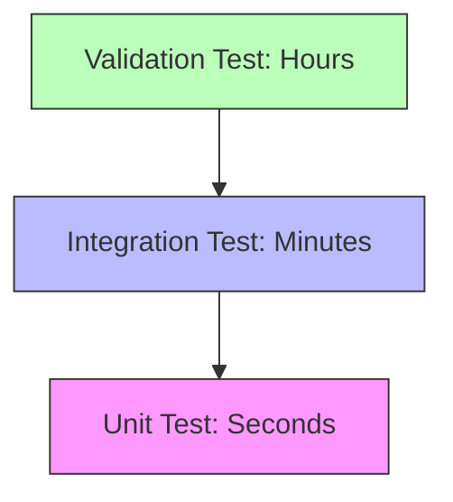
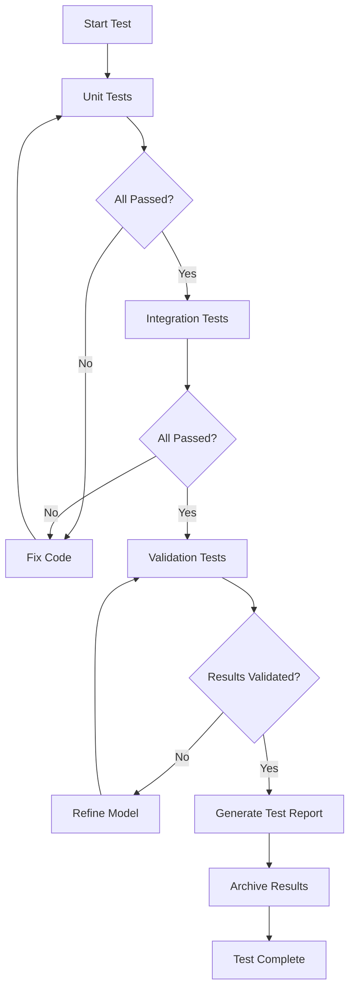

# 03 แนวทางปฏิบัติที่ดีที่สุดสำหรับการทดสอบ CFD (Best Practices)

เพื่อให้การทดสอบ CFD มีประสิทธิภาพและเชื่อถือได้ เราควรยึดถือหลักการออกแบบซอฟต์แวร์ควบคู่ไปกับหลักการทางฟิสิกส์ โดยเฉพาะในบริบทของ OpenFOAM ที่ต้องการความแม่นยำทั้งในมิติของการเขียนโค้ดและการตรวจสอบความถูกต้องของแบบจำลอง

## 3.1 หลักการออกแบบการทดสอบ (Design Principles)

### 1. การแยกส่วน (Isolation)

แต่ละการทดสอบควรเป็นอิสระต่อกันโดยสมบูรณ์ เพื่อให้สามารถระบุสาเหตุของปัญหาได้อย่างแม่นยำ

![[test_isolation_clean_slate.png]]
`A diagram illustrating the 'Clean Slate' principle. On the left, multiple tests are shown trying to access a shared, messy database (FAIL). On the right, each test has its own isolated, pure-white box containing only the necessary mesh and parameters, ensuring no cross-contamination of results. Scientific textbook diagram, clean vector line art, white background, high definition, flat design, educational infographic --ar 16:9`

#### รากฐานทางคณิตศาสตร์ของการแยกส่วน

ในการทดสอบ CFD การแยกส่วนเกี่ยวข้องกับการทำให้ State Space ของการทดสอบแต่ละตัวเป็นอิสระ:

$$\mathcal{S}_i \cap \mathcal{S}_j = \emptyset, \quad \forall i \neq j$$

เมื่อ $\mathcal{S}_i$ คือช่องว่างสถานะ (state space) ของการทดสอบที่ $i$

การแยกส่วนประกอบด้วย:

- **No Shared State**: หลีกเลี่ยงการใช้ตัวแปร Global ที่อาจถูกแก้ไขโดยการทดสอบอื่น
- **Clean Slate**: สร้างอ็อบเจกต์ใหม่สำหรับทุกกรณีทดสอบ และลบไฟล์ชั่วคราวทิ้งเสมอหลังจากทดสอบเสร็จ
- **Deterministic Initialization**: ตั้งค่าเริ่มต้นของฟิลด์ทุกครั้งให้เป็นไปตามที่กำหนด

#### การนำไปประยุกต์ใน OpenFOAM

```cpp
// Isolated test structure for CFD testing
// Each test gets its own case directory and mesh
class IsolatedTest
{
    // Create separate case directory for each test
    fileName caseDir_;
    Time* runTimePtr_;
    fvMesh* meshPtr_;

public:
    IsolatedTest(const word& testName)
    :
        caseDir_(testName),
        runTimePtr_(nullptr),
        meshPtr_(nullptr)
    {
        // Create new case directory
        mkDir(caseDir_);
        mkDir(caseDir_/"0");
        mkDir(caseDir_/"constant");
        mkDir(caseDir_/"system");

        Info<< "Created isolated test environment: " << caseDir_ << endl;
    }

    ~IsolatedTest()
    {
        // Cleanup: remove temporary data
        if (meshPtr_) delete meshPtr_;
        if (runTimePtr_) delete runTimePtr_;

        // Delete case directory (optional)
        rmDir(caseDir_);
    }

    void initializeMesh()
    {
        // Create new mesh for this test only
        runTimePtr_ = new Time(caseDir_, ".", false);
        meshPtr_ = new fvMesh(*runTimePtr_);
    }
};
```

**📖 คำอธิบาย (Explanation):**

โค้ดนี้แสดงการนำหลักการ Isolation มาใช้ใน OpenFOAM โดย:

1. **การสร้าง Case Directory แยก**: แต่ละการทดสอบมีไดเรกทอรีของตัวเอง ป้องกันการแชร์ไฟล์ระหว่างการทดสอบ
2. **Automatic Cleanup**: Destructor ลบข้อมูลทิ้งโดยอัตโนมัติเมื่อการทดสอบเสร็จสิ้น
3. **Fresh Mesh Initialization**: สร้าง mesh ใหม่ทุกครั้ง ไม่มีการใช้ mesh จากการทดสอบก่อนหน้า

**🔑 แนวคิดสำคัญ (Key Concepts):**

- **Constructor**: สร้างโครงสร้างไดเรกทอรี `0/`, `constant/`, `system/` ตามมาตรฐาน OpenFOAM
- **Destructor**: ใช้หลักการ RAII (Resource Acquisition Is Initialization) เพื่อคืนทรัพยากรอัตโนมัติ
- **Pointer Management**: ใช้ raw pointers เพื่อควบคุมวงจรชีวิตของอ็อบเจกต์อย่างชัดเจน

### 2. ความสามารถในการผลิตซ้ำ (Reproducibility)

การทดสอบต้องให้ผลลัพธ์เดิมทุกครั้งที่รันภายใต้เงื่อนไขเดียวกัน

#### รากฐานทางคณิตศาสตร์ของความสามารถในการผลิตซ้ำ

สำหรับระบบ determinististic:

$$\mathcal{F}(\mathbf{x}_0, t) = \mathbf{x}(t)$$

เมื่อ:
- $\mathbf{x}_0$ = เงื่อนไขเริ่มต้น (Initial conditions)
- $\mathcal{F}$ = ฟังก์ชันที่แทน solver
- $\mathbf{x}(t)$ = สถานะของระบบที่เวลา $t$

ความต้องการความสามารถในการผลิตซ้ำ:
$$\mathcal{F}(\mathbf{x}_0, t) = \mathcal{F}'(\mathbf{x}_0, t)$$

เมื่อ $\mathcal{F}$ และ $\mathcal{F}'$ คือการรัน solver สองครั้งที่แตกต่างกัน

#### การนำไปประยุกต์ใน OpenFOAM

**การตั้งค่า ControlDict สำหรับ Reproducibility:**

```cpp
// Control dictionary settings for reproducible CFD simulations
// Ensures deterministic behavior across multiple runs
application     simpleFoam;

startFrom       startTime;
startTime       0;

stopAt          endTime;
endTime         1000;

deltaT          1;

// Important: use deterministic time stepping
adjustTimeStep  no;

// Set random seed for stochastic operations
// (for turbulence models with random components)
randomSeed      12345;

writeControl    timeStep;
writeInterval   100;

// Use double precision for accuracy
writeFormat     binary;
writePrecision  15;
```

**📖 คำอธิบาย (Explanation):**

การตั้งค่า `controlDict` นี้มุ่งให้การรันซ้ำได้:

1. **Fixed Time Stepping**: `adjustTimeStep  no` ป้องกันการปรับ time step แบบ dynamic ซึ่งอาจแตกต่างกันในแต่ละครั้ง
2. **Random Seed**: กำหนดค่า seed สำหรับ turbulence models ที่อาจมีคอมโพเนนต์สุ่ม
3. **High Precision Output**: `writePrecision  15` เก็บข้อมูลด้วยความละเอียดสูง เพื่อลดปัญหา rounding error

**🔑 แนวคิดสำคัญ (Key Concepts):**

- **Deterministic Execution**: ควบคุมปัจจัย stochastic ทั้งหมดให้เป็น deterministic
- **Binary Format**: เขียนข้อมูลแบบ binary เพื่อป้องกัน conversion error จาก ASCII
- **Seeded Randomness**: สำหรับโมเดลที่ต้องการ randomness ให้ใช้ seed คงที่

**การตั้งค่า DecompositionParDict สำหรับ Parallel Reproducibility:**

```cpp
// Decomposition method for parallel simulations
// Ensures consistent domain decomposition across runs
method          simple;

numberOfSubdomains 4;

simpleCoeffs
{
    n       (4 1 1);
    delta   0.001;
}

// Important: use deterministic decomposition
// (avoid using 'scotch' which may give different results each time)
```

**📖 คำอธิบาย (Explanation):**

สำหรับการรันแบบ parallel การ decompose domain ต้องสม่ำเสมอ:

1. **Simple Method**: ใช้วิธี simple decomposition ที่ deterministic แทน scotch ซึ่งอาจให้ผลต่างกันในแต่ละครั้ง
2. **Fixed Grid**: `n (4 1 1)` กำหนดการแบ่ง subdomain อย่างชัดเจน
3. **Consistent Delta**: `delta 0.001` คือค่า offset ที่คงที่สำหรับการ balance load

**🔑 แนวคิดสำคัญ (Key Concepts):**

- **Domain Decomposition**: การแบ่ง computational domain ให้แต่ละ processor
- **Load Balancing**: การกระจาย workload ให้สมดุล
- **Determinism vs Performance**: Simple method อาจไม่ optimize เท่า scotch แต่ให้ผลลัพธ์ที่ reproducible

### 3. ความครอบคลุม (Comprehensive Coverage)

การทดสอบควรครอบคลุมสถานการณ์ต่างๆ อย่างทั่วถึง

![[cfd_test_coverage_scenarios.png]]
`A three-part diagram showing different test scenarios: 1) Normal Case (smooth flow over a cylinder), 2) Edge Case (extremely high Reynolds number with turbulent eddies), 3) Error Condition (highly distorted mesh with overlapping cells). Each is labeled with a status indicator (Green, Yellow, Red). Scientific textbook diagram, clean vector line art, white background, high definition, flat design, educational infographic --ar 16:9`

#### รากฐานทางคณิตศาสตร์ของการทดสอบครอบคลุม

พื้นที่การทดสอบ $\mathcal{T}$ ควรครอบคลุม:
$$\mathcal{T} = \mathcal{T}_{normal} \cup \mathcal{T}_{edge} \cup \mathcal{T}_{error}$$

เมื่อ:
- $\mathcal{T}_{normal}$ = สภาวะการทำงานปกติ (Normal operating conditions)
- $\mathcal{T}_{edge}$ = สภาวะสุดขีด (Boundary conditions)
- $\mathcal{T}_{error}$ = สภาวะที่ผิดปกติ (Error conditions)

#### ประเภทของการทดสอบที่ควรครอบคลุม

**1. Normal Cases**:
- สภาวะการทำงานปกติ ($Re = 100 \sim 10000$)
- ค่าทางฟิสิกส์ที่อยู่ในช่วงพื้นที่การใช้งาน
- เงื่อนไขขอบเขตมาตรฐาน

**2. Edge Cases**:
- ค่า Reynolds สูงมาก ($Re > 10^6$)
- เมชที่มีมุมแหลมจัด (Skewness → 1)
- อัตราส่วนภาพ (Aspect Ratio) สูงมาก ($AR > 100$)
- การไหลที่ไม่เสถียร (Transient/Turbulent)

**3. Error Conditions**:
- คุณภาพเมชที่แย่มาก (Non-orthogonality > 80°)
- เงื่อนไขขอบเขตที่ขัดแย้งกัน
- การคำนวณที่ diverge

#### การนำไปประยุกต์ใน OpenFOAM

```cpp
// Comprehensive test suite covering normal, edge, and error cases
// Tests different flow regimes and mesh conditions
class ComprehensiveTestSuite
{
public:
    // Normal case tests
    void testLaminarFlow()
    {
        // Re = 100 (Laminar regime)
        scalar Re = 100.0;
        runTestCase("laminar_Re100", Re);
    }

    void testTurbulentFlow()
    {
        // Re = 10000 (Turbulent regime)
        scalar Re = 10000.0;
        runTestCase("turbulent_Re10000", Re);
    }

    // Edge case tests
    void testHighReynoldsNumber()
    {
        // Re = 10^7 (Very high Reynolds)
        scalar Re = 1e7;
        runTestCase("edge_Re1e7", Re);
    }

    void testHighSkewnessMesh()
    {
        // Test with high skewness mesh
        runTestCase("edge_skewness", "highSkewnessMesh");
    }

    // Error condition tests
    void testNegativeVolumeHandling()
    {
        // Test handling of negative volume
        runTestCase("error_negativeVolume", "invalidMesh");
    }

    void testConflictingBCs()
    {
        // Test handling of conflicting BCs
        runTestCase("error_conflictingBC", "conflictingBC");
    }

private:
    void runTestCase(const word& name, scalar Re)
    {
        Info<< "Running test case: " << name << " at Re=" << Re << endl;

        // Setup case
        IsolatedTest test(name);
        test.initializeMesh();

        // Run solver
        bool success = test.runSolver(Re);

        // Validate results
        if (success) {
            test.validateResults();
        }
    }
};
```

**📖 คำอธิบาย (Explanation):**

โค้ดนี้แสดง Test Suite ที่ครอบคลุมทั้ง 3 ประเภท:

1. **Normal Cases**: ทดสอบที่ช่วง Reynolds ทั่วไป (100 - 10,000) ซึ่งครอบคลุมทั้ง laminar และ turbulent
2. **Edge Cases**: ทดสอบที่ค่าสุดขีด เช่น Reynolds สูงมาก ($10^7$) และ mesh ที่มี skewness สูง
3. **Error Conditions**: ทดสอบการจัดการกับสถานการณ์ที่ผิดปกติ เช่น negative volume และ conflicting BCs

**🔑 แนวคิดสำคัญ (Key Concepts):**

- **Test Matrix**: การออกแบบ test cases ให้ครอบคลุมทุกช่วงของ parameter space
- **Flow Regimes**: การทดสอบทั้ง laminar, transitional, และ turbulent regimes
- **Mesh Quality Tests**: การทดสอบ robustness ของ solver บน mesh ที่มีคุณภาพต่ำ
- **Error Recovery**: การตรวจสอบว่า solver สามารถจัดการกับ error conditions ได้อย่างเหมาะสม

---

## 3.2 ระดับของการทดสอบ (Testing Levels)

เราควรแบ่งระดับการทดสอบตามความซับซ้อนและเวลาที่ใช้:



| ระดับ | ระยะเวลา | เป้าหมาย | ตัวอย่าง |
|:---|:---|:---|:---|
| **Unit Test** | วินาที | ฟังก์ชันย่อย, อัลกอริทึมพื้นฐาน | Gradient calculation, Interpolation |
| **Integration Test** | นาที | เวิร์กโฟลว์ของ Solver, การเชื่อมต่อโมดูล | Pressure-velocity coupling, Time stepping |
| **Validation Test** | ชั่วโมง | ความถูกต้องทางฟิสิกส์, กรณีศึกษาขนาดเต็ม | Lid-driven cavity, Flow over cylinder |

### ระดับที่ 1: Unit Tests (การทดสอบหน่วย)

#### รากฐานทางคณิตศาสตร์

Unit Test ตรวจสอบความถูกต้องของฟังก์ชันพื้นฐาน:

$$\text{Test}: f(\mathbf{x}) \stackrel{?}{=} \mathbf{y}_{expected}$$

เมื่อ $f: \mathbb{R}^n \rightarrow \mathbb{R}^m$ คือฟังก์ชันที่ทดสอบ

#### ตัวอย่าง: การทดสอบ Gradient Calculation

```cpp
// Unit test for gradient calculation in OpenFOAM
// Verifies that numerical gradient matches analytical gradient
void testGradientCalculation()
{
    // Create simple mesh
    fvMesh mesh = createSimpleMesh();

    // Create test field: phi = 2*x + 3*y + 5*z
    volScalarField phi
    (
        IOobject("phi", mesh.time().timeName(), mesh),
        mesh,
        dimensionedScalar("phi", dimless, 0.0)
    );

    const vectorField& C = mesh.C().primitiveField();
    forAll(C, i) {
        phi[i] = 2.0*C[i].x() + 3.0*C[i].y() + 5.0*C[i].z();
    }

    // Calculate gradient
    volVectorField gradPhi = fvc::grad(phi);

    // Verify results
    vector expectedGrad(2.0, 3.0, 5.0);
    const vectorField& gradValues = gradPhi.primitiveField();

    scalar maxError = 0;
    forAll(gradValues, i) {
        scalar error = mag(gradValues[i] - expectedGrad);
        maxError = max(maxError, error);

        // Assert error is less than tolerance
        if (error > 1e-4) {
            FatalErrorInFunction
                << "Gradient calculation failed at cell " << i
                << ". Expected: " << expectedGrad
                << ", Got: " << gradValues[i]
                << ", Error: " << error
                << exit(FatalError);
        }
    }

    Info<< "Unit test PASSED: Gradient calculation. Max error: "
        << maxError << endl;
}
```

**📖 คำอธิบาย (Explanation):**

Unit Test นี้ตรวจสอบการคำนวณ gradient ด้วยวิธีการ:

1. **Analytical Solution**: สร้าง field `phi = 2*x + 3*y + 5*z` ซึ่งมี gradient แน่นอน = `(2, 3, 5)`
2. **Numerical Calculation**: ใช้ `fvc::grad()` เพื่อคำนวณ gradient ด้วยวิธี numerical
3. **Comparison**: เปรียบเทียบค่า numerical กับ analytical และตรวจสอบว่า error < `1e-4`

**🔑 แนวคิดสำคัญ (Key Concepts):**

- **Method of Manufactured Solutions (MMS)**: การสร้าง analytical solution เพื่อทดสอบ numerical methods
- **Gradient Schemes**: การคำนวณ gradient ใช้ finite volume methods (Gauss theorem)
- **Cell-centered Values**: OpenFOAM เก็บค่า field ที่ center of each cell
- **Tolerance Selection**: `1e-4` เหมาะสำหรับ second-order schemes บน structured mesh

### ระดับที่ 2: Integration Tests (การทดสอบการผนวก)

#### รากฐานทางคณิตศาสตร์

Integration Test ตรวจสอบการทำงานร่วมกันของหลายส่วน:

$$\text{Test}: \mathcal{F}_1 \circ \mathcal{F}_2 \circ \dots \circ \mathcal{F}_n (\mathbf{x}_0) \stackrel{?}{=} \mathbf{y}_{expected}$$

เมื่อ $\mathcal{F}_i$ คือฟังก์ชันหรือโมดูลที่แตกต่างกัน

#### ตัวอย่าง: การทดสอบ SIMPLE Algorithm

```cpp
// Integration test for SIMPLE algorithm
// Tests the coupling between momentum and pressure solvers
void testSIMPLEAlgorithm()
{
    Info<< "Testing SIMPLE algorithm integration..." << endl;

    // Setup case
    IsolatedTest test("simple_integration");
    test.initializeMesh();

    // Initialize fields
    volVectorField U = createVelocityField(test.mesh());
    volScalarField p = createPressureField(test.mesh());

    // Run SIMPLE algorithm
    int nIter = 0;
    scalar maxResidual = 1.0;
    scalar tolerance = 1e-5;

    while (maxResidual > tolerance && nIter < 1000) {
        // 1. Solve momentum equation
        U = solveMomentum(U, p);

        // 2. Solve pressure correction
        p = solvePressureCorrection(U, p);

        // 3. Correct velocity
        U = correctVelocity(U, p);

        // 4. Check convergence
        maxResidual = max(residual(U), residual(p));

        nIter++;
    }

    // Verify convergence
    if (maxResidual <= tolerance) {
        Info<< "Integration test PASSED: SIMPLE converged in "
            << nIter << " iterations" << endl;
    } else {
        FatalErrorInFunction
            << "Integration test FAILED: SIMPLE did not converge"
            << exit(FatalError);
    }
}
```

**📖 คำอธิบาย (Explanation):**

Integration Test นี้ตรวจสอบ SIMPLE algorithm ซึ่งเป็นหัวใจของ steady-state solvers:

1. **Momentum Equation**: แก้สมการ动量 เพื่อหา velocity field ชั่วคราว
2. **Pressure Correction**: แก้ pressure correction equation เพื่อให้สอดคล้องกับ continuity
3. **Velocity Correction**: แก้ไข velocity ให้สอดคล้องกับ pressure ใหม่
4. **Convergence Check**: ตรวจสอบว่า residuals ลดต่ำกว่า tolerance

**🔑 แนวคิดสำคัญ (Key Concepts):**

- **SIMPLE Algorithm (Semi-Implicit Method for Pressure-Linked Equations)**: วิธี iterative สำหรับ steady-state incompressible flow
- **Pressure-Velocity Coupling**: การเชื่อมโยงระหว่าง pressure และ velocity เพื่อสอดคล้องกับ continuity equation
- **Under-Relaxation**: ในการใช้งานจริง ต้องมี under-relaxation factors เพื่อความเสถียร
- **Residual Monitoring**: การติดตามค่า residual เพื่อตรวจสอบ convergence

### ระดับที่ 3: Validation Tests (การทดสอบความถูกต้อง)

#### รากฐานทางคณิตศาสตร์

Validation Test ตรวจสอบความสอดคล้องกับฟิสิกส์:

$$\text{Test}: ||\mathbf{u}_{CFD} - \mathbf{u}_{ref}|| \leq \epsilon_{tol}$$

เมื่อ:
- $\mathbf{u}_{CFD}$ = ผลลัพธ์จาก CFD
- $\mathbf{u}_{ref}$ = ค่าอ้างอิง (จากการทดลองหรือ analytical solution)
- $\epsilon_{tol}$ = ค่าความคลาดเคลื่อนที่ยอมรับได้

#### ตัวอย่าง: การทดสอบ Lid-Driven Cavity

```cpp
// Validation test for lid-driven cavity flow
// Compares CFD results against benchmark experimental data (Ghia et al. 1982)
void testLidDrivenCavity()
{
    Info<< "Running validation test: Lid-driven cavity" << endl;

    // Setup case
    IsolatedTest test("lid_driven_cavity");
    test.initializeMesh();

    // Set boundary conditions
    // Top wall: U = (1, 0, 0)
    // Other walls: U = (0, 0, 0)

    // Run solver
    bool converged = test.runSolver();

    if (!converged) {
        FatalErrorInFunction
            << "Validation test FAILED: Solver did not converge"
            << exit(FatalError);
    }

    // Compare with reference data (Ghia et al. 1982)
    volVectorField U = readVelocityField(test.mesh());

    // Extract values at centerline
    vectorField centerlineValues = extractCenterlineValues(U);

    // Load reference values
    vectorField referenceValues = loadReferenceData("ghia_1982_Re1000.dat");

    // Calculate error metrics
    scalar l2Error = calculateL2Error(centerlineValues, referenceValues);
    scalar maxError = calculateMaxError(centerlineValues, referenceValues);

    Info<< "Validation results:" << endl;
    Info<< "  L2 error: " << l2Error << endl;
    Info<< "  Max error: " << maxError << endl;

    // Verify error is within acceptable tolerance
    if (l2Error < 0.01 && maxError < 0.05) {
        Info<< "Validation test PASSED" << endl;
    } else {
        FatalErrorInFunction
            << "Validation test FAILED: Error exceeds tolerance"
            << exit(FatalError);
    }
}
```

**📖 คำอธิบาย (Explanation):**

Validation Test นี้เปรียบเทียบกับ benchmark data ที่เป็นที่ยอมรับ:

1. **Benchmark Case**: Lid-driven cavity ที่ Re = 1000 ซึ่งมีข้อมูลอ้างอิงจาก Ghia et al. 1982
2. **Centerline Extraction**: ดึงค่า velocity ตามแนว centerline เพื่อเปรียบเทียบ
3. **Error Metrics**: คำนวณทั้ง L2 error (root-mean-square) และ maximum error
4. **Acceptance Criteria**: L2 error < 1% และ max error < 5%

**🔑 แนวคิดสำคัญ (Key Concepts):**

- **Validation vs Verification**: Validation เปรียบเทียบกับข้อมูลจริง, Verification ตรวจสอบความถูกต้องของโค้ด
- **Benchmark Data**: ใช้ข้อมูลจาก literature ที่ผ่านการ review และได้รับการยอมรับ
- **Error Metrics**: 
  - L2 Error: $\sqrt{\frac{1}{N}\sum_{i=1}^{N}(u_{CFD,i} - u_{ref,i})^2}$
  - Max Error: $\max_i |u_{CFD,i} - u_{ref,i}|$
- **Grid Convergence**: ในการทดสอบจริง ต้องทำ mesh independence study ก่อน

---

## 3.3 การเขียนโค้ดการทดสอบที่แข็งแกร่ง (Robust Test Coding)

ใช้โครงสร้างการจัดการข้อผิดพลาด (Error Handling) เพื่อไม่ให้ระบบล่มเมื่อพบปัญหา

### การตั้งค่าความละเอียดเชิงตัวเลข (Numerical Tolerance)

#### รากฐานทางคณิตศาสตร์ของ Numerical Tolerance

**Relative Tolerance:**
ใช้สำหรับค่าที่มีขนาดต่างกันมาก:

$$\epsilon_{rel} = \frac{|\phi_{CFD} - \phi_{ref}|}{|\phi_{ref}|} \leq \epsilon_{tol, rel}$$

**Absolute Tolerance:**
ใช้สำหรับค่าที่ควรเป็นศูนย์:

$$|\phi_{CFD} - \phi_{ref}| \leq \epsilon_{tol, abs}$$

**Combined Tolerance:**
$$|\phi_{CFD} - \phi_{ref}| \leq \max(\epsilon_{abs}, \epsilon_{rel} |\phi_{ref}|)$$

### Error Handling Framework ใน OpenFOAM

```cpp
// Robust error handling framework for CFD testing
// Implements combined tolerance (relative + absolute)
struct TestResult
{
    bool passed;
    word errorMessage;
    scalar errorValue;
    scalar tolerance;

    TestResult()
    :
        passed(true),
        errorMessage(""),
        errorValue(0),
        tolerance(0)
    {}
};

class RobustTestFramework
{
public:
    // Test with appropriate tolerance
    static TestResult testWithTolerance(
        const scalar& calculated,
        const scalar& expected,
        const scalar& relTol = 1e-6,
        const scalar& absTol = 1e-10
    )
    {
        TestResult result;

        scalar absError = mag(calculated - expected);
        scalar relError = absError / max(mag(expected), SMALL);

        // Use combined tolerance
        scalar tolerance = max(absTol, relTol * mag(expected));
        result.tolerance = tolerance;

        if (absError > tolerance) {
            result.passed = false;
            result.errorMessage = "Value exceeds tolerance";
            result.errorValue = absError;
        }

        return result;
    }

    // Test for fields
    static TestResult testFieldTolerance(
        const volScalarField& calculated,
        const volScalarField& expected,
        const scalar& relTol = 1e-6,
        const scalar& absTol = 1e-10
    )
    {
        TestResult result;
        scalar maxError = 0;

        forAll(calculated, i) {
            scalar absError = mag(calculated[i] - expected[i]);
            scalar tolerance = max(absTol, relTol * mag(expected[i]));

            if (absError > tolerance) {
                maxError = max(maxError, absError);
            }
        }

        if (maxError > 0) {
            result.passed = false;
            result.errorMessage = "Field values exceed tolerance";
            result.errorValue = maxError;
        }

        return result;
    }
};
```

**📖 คำอธิบาย (Explanation):**

Framework นี้ใช้ combined tolerance เพื่อจัดการกับปัญหาของ tolerance:

1. **Relative Tolerance**: เหมาะสำหรับค่าที่มีขนาดใหญ่ (เช่น velocity ~10 m/s) โดย error 1% ถือว่ายอมรับได้
2. **Absolute Tolerance**: เหมาะสำหรับค่าที่ใกล้ศูนย์ (เช่น pressure correction ~1e-5 Pa) โดยใช้ threshold สัมบูรณ์
3. **Combined Tolerance**: `max(absTol, relTol * |expected|)` ให้ความยืดหยุ่นทั้งสองกรณี

**🔑 แนวคิดสำคัญ (Key Concepts):**

- **Floating Point Arithmetic**: การคำนวณด้วย floating point มี round-off error อยู่เสมอ
- **Machine Epsilon**: ค่าความละเอียดต่ำสุดของ double precision ≈ 2.22e-16
- **SMALL Constant**: ใน OpenFOAM `SMALL` มักกำหนดเป็น 1e-25 เพื่อป้องกัน division by zero
- **Field-wise Testing**: การทดสอบทุก cell ใน field และค้นหา worst-case error

### การใช้งานในกรณีจริง

```cpp
// Practical usage of robust test framework
// Demonstrates testing of solver convergence and velocity fields
void runRobustTest()
{
    try {
        Info<< "Testing solver convergence..." << endl;

        // Run solver
        bool converged = solver.solve();

        // Test with relative tolerance
        TestResult convergenceResult = RobustTestFramework::testWithTolerance(
            solver.finalResidual(),
            0.0,           // Expected convergence to zero
            1e-5,          // Relative tolerance
            1e-8           // Absolute tolerance
        );

        if (!convergenceResult.passed) {
            Info<< "WARNING: " << convergenceResult.errorMessage << endl;
            Info<< "  Residual: " << convergenceResult.errorValue << endl;
            Info<< "  Tolerance: " << convergenceResult.tolerance << endl;
        }

        // Test velocity field
        volVectorField U = readVelocityField();
        volVectorField U_ref = loadReferenceField("U_reference");

        for (direction dir = 0; dir < 3; ++dir) {
            volScalarField U_comp = U.component(dir);
            volScalarField U_ref_comp = U_ref.component(dir);

            TestResult fieldResult = RobustTestFramework::testFieldTolerance(
                U_comp,
                U_ref_comp,
                0.01,    // 1% relative tolerance
                1e-6     // Absolute tolerance
            );

            if (!fieldResult.passed) {
                Info<< "WARNING: Field component " << dir
                    << " exceeds tolerance" << endl;
            }
        }

    } catch (const std::exception& e) {
        FatalErrorInFunction
            << "Exception caught during test: " << e.what()
            << exit(FatalError);
    } catch (...) {
        FatalErrorInFunction
            << "Unknown exception caught during test"
            << exit(FatalError);
    }
}
```

**📖 คำอธิบาย (Explanation):**

ตัวอย่างการใช้งานแสดงการทดสอบทั้ง scalar values และ fields:

1. **Convergence Test**: ทดสอบว่า final residual ต่ำพอ (เข้าใกล้ 0)
2. **Field Component Testing**: ทดสอบทุก component (x, y, z) ของ velocity field แยกกัน
3. **Exception Handling**: จัดการกับ exceptions ที่อาจเกิดขึ้นระหว่างการทดสอบ

**🔑 แนวคิดสำคัญ (Key Concepts):**

- **Component-wise Testing**: การทดสอบแต่ละ component ของ vector field แยกกัน
- **Direction Enum**: OpenFOAM ใช้ `direction` type (0=x, 1=y, 2=z) สำหรับ indexing
- **Warning vs Failure**: การแยกระหว่าง warning (ต่อไปได้) และ failure (หยุดการทดสอบ)
- **Exception Safety**: การใช้ try-catch เพื่อป้องกัน crash ของโปรแกรม

---

## 3.4 แนวทางปฏิบัติสำหรับ OpenFOAM (OpenFOAM-Specific Best Practices)

### 1. การจัดระเบียบ Case Directories

ใช้โครงสร้างที่ชัดเจนสำหรับการทดสอบ:

```
testCases/
├── unit/
│   ├── testGradient/
│   ├── testInterpolation/
│   └── testLaplacian/
├── integration/
│   ├── testSIMPLE/
│   └── testPISO/
└── validation/
    ├── lidDrivenCavity/
    │   ├── Re100/
    │   ├── Re400/
    │   └── Re1000/
    └── flowOverCylinder/
        ├── Re10/
        └── Re100/
```

### 2. การตั้งค่า Numerical Schemes สำหรับการทดสอบ

ใช้ schemes ที่ตรวจสอบแล้ว (Verified) สำหรับการทดสอบ:

**📂 Source: `.applications/test/fieldMapping/pipe1D/system/fvSchemes`**

`system/fvSchemes`:
```cpp
// Numerical schemes dictionary for CFD testing
// Uses stable, verified schemes for reproducibility
/*--------------------------------*- C++ -*----------------------------------*\
  =========                 |
  \\      /  F ield         | OpenFOAM: The Open Source CFD Toolbox
   \\    /   O peration     | Website:  https://openfoam.org
    \\  /    A nd           | Version:  10
     \\/     M anipulation  |
\*---------------------------------------------------------------------------*/
FoamFile
{
    format      ascii;
    class       dictionary;
    location    "system";
    object      fvSchemes;
}
// * * * * * * * * * * * * * * * * * * * * * * * * * * * * * * * * * * * * * //

ddtSchemes
{
    default         Euler;                       // First-order, stable
}

gradSchemes
{
    default         Gauss linear;
    grad(p)         Gauss linear;
    grad(U)         Gauss linear;
}

divSchemes
{
    default         none;
    div(phi,U)      Gauss linearUpwind grad(U);  // Stable for testing
    div(phi,k)      Gauss upwind;
    div(phi,epsilon) Gauss upwind;
    div((nuEff*dev2(T(grad(U))))) Gauss linear;
}

laplacianSchemes
{
    default         Gauss linear corrected;       // Use non-orthogonal correction
}

interpolationSchemes
{
    default         linear;
}

snGradSchemes
{
    default         corrected;
}

// ************************************************************************* //
```

**📖 คำอธิบาย (Explanation):**

การตั้งค่า `fvSchemes` นี้เน้นความเสถียรและความแม่นยำ:

1. **Time Integration**: `Euler` scheme เป็น first-order ที่ stable แม่นยำพอสำหรับการทดสอบ
2. **Gradient Schemes**: `Gauss linear` ใช้ linear interpolation ระหว่าง cells
3. **Divergence Schemes**: `Gauss linearUpwind` ให้ความเสถียรสูงกว่า pure linear
4. **Laplacian Schemes**: `corrected` มี non-orthogonal correction สำคัญสำหรับ mesh ที่ไม่ใช่ orthogonal

**🔑 แนวคิดสำคัญ (Key Concepts):**

- **Finite Volume Discretization**: การแปลง PDEs เป็น algebraic equations โดยใช้ Gauss theorem
- **Gauss Theorem**: $\int_{\partial V} \mathbf{\phi} \cdot d\mathbf{A} = \int_V \nabla \cdot \mathbf{\phi} dV$
- **Upwind Schemes**: ใช้ค่าจาก upstream cell เพื่อความเสถียร (boundedness)
- **Non-orthogonal Correction**: แก้ไข error จาก mesh ที่ไม่ orthogonal

### 3. การตั้งค่า Solver Settings

**📂 Source: `.applications/test/fieldMapping/pipe1D/system/fvSolution`**

`system/fvSolution`:
```cpp
// Solver settings and algorithms for CFD testing
// Uses strict tolerances and robust linear solvers
/*--------------------------------*- C++ -*----------------------------------*\
  =========                 |
  \\      /  F ield         | OpenFOAM: The Open Source CFD Toolbox
   \\    /   O peration     | Website:  https://openfoam.org
    \\  /    A nd           | Version:  10
     \\/     M anipulation  |
\*---------------------------------------------------------------------------*/
FoamFile
{
    format      ascii;
    class       dictionary;
    location    "system";
    object      fvSolution;
}
// * * * * * * * * * * * * * * * * * * * * * * * * * * * * * * * * * * * * * //

solvers
{
    p
    {
        solver          GAMG;
        tolerance       1e-06;      // Strict tolerance for testing
        relTol          0.01;
        smoother        GaussSeidel;
    }

    "(U|k|epsilon)"
    {
        solver          smoothSolver;
        smoother        GaussSeidel;
        tolerance       1e-05;
        relTol          0.1;
    }
}

SIMPLE
{
    nNonOrthogonalCorrectors 0;
    consistent      yes;

    residualControl
    {
        p               1e-05;     // Strict convergence criteria
        U               1e-05;
        "(k|epsilon)"   1e-04;
    }
}

// ************************************************************************* //
```

**📖 คำอธิบาย (Explanation):**

การตั้งค่า `fvSolution` นี้เน้นความเข้มงวดและความเสถียร:

1. **Linear Solvers**: 
   - `GAMG` (Geometric-Algebraic Multi-Grid) สำหรับ pressure equation: มีประสิทธิภาพสูง
   - `smoothSolver` สำหรับ velocity, k, epsilon: เรียบง่ายและ stable
2. **Tolerances**: 
   - Absolute tolerance `1e-06` สำหรับ pressure (เข้มงวด)
   - Relative tolerance `0.01` หมายถึง reduce residual อย่างน้อย 99%
3. **SIMPLE Algorithm**: 
   - `consistent yes` ใช้ consistent mass flux
   - `residualControl` กำหนด convergence criteria แต่ละ field

**🔑 แนวคิดสำคัญ (Key Concepts):**

- **Linear Solvers**: วิธีแก้ systems of linear equations $Ax = b$
  - **GAMG**: ใช้ multi-grid acceleration เหมาะกับ Poisson equation
  - **smoothSolver**: ใช้ iterative smoothing (Gauss-Seidel)
- **Convergence Criteria**: 
  - **Absolute Tolerance**: `|residual| < tolerance`
  - **Relative Tolerance**: `|residual_new| / |residual_initial| < relTol`
- **Consistent SIMPLE**: ปรับ mass flux ให้สอดคล้องกับ pressure correction

### 4. การใช้ Function Objects สำหรับการตรวจสอบอัตโนมัติ

`system/controlDict`:
```cpp
// Control dictionary with automated monitoring function objects
// Provides real-time validation during simulation
application     simpleFoam;

startFrom       startTime;
startTime       0;

stopAt          writeNow;
endTime         1000;

deltaT          1;

writeControl    timeStep;
writeInterval   100;

functions
{
    // Check mass continuity
    continuityError
    {
        type            continuityError;
        functionObjectLibs ("libutilityFunctionObjects.so");
        writeControl    timeStep;
        writeInterval   1;

        // Set threshold
        threshold       1e-10;
    }

    // Check value bounds
    boundsCheck
    {
        type            bounds;
        functionObjectLibs ("libutilityFunctionObjects.so");
        writeControl    timeStep;
        writeInterval   1;

        field           U;
        min             (-100 -100 -100);
        max             (100 100 100);
    }

    // Log residuals
    residuals
    {
        type            residuals;
        functionObjectLibs ("libutilityFunctionObjects.so");
        writeControl    timeStep;
        writeInterval   1;

        fields          (p U k epsilon);
    }
}
```

**📖 คำอธิบาย (Explanation):**

Function Objects ให้การตรวจสอบแบบ real-time:

1. **Continuity Error**: ตรวจสอบความสอดคล้องของ mass conservation
   - $\int_S \rho \mathbf{U} \cdot d\mathbf{A}$ ควรเข้าใกล้ 0 สำหรับ incompressible flow
   - `threshold 1e-10` หมายถึง mass flux imbalance ที่ยอมรับได้
2. **Bounds Check**: ตรวจสอบว่า velocity อยู่ในช่วงที่สมเหตุสมผล
   - ป้องกันค่าที่แปลกปลอม (spurious values)
3. **Residuals Logging**: บันทึก residuals ทุก time step เพื่อการวิเคราะห์ convergence

**🔑 แนวคิดสำคัญ (Key Concepts):**

- **Function Objects**: โมดูลที่ plug-in เข้ากับ solver loop โดยไม่ต้องแก้ไข solver code
- **Mass Conservation**: กฎของ conservation of mass $\nabla \cdot (\rho \mathbf{U}) = 0$
- **Run-time Selection**: OpenFOAM สามารถ load function objects แบบ dynamic ผ่าน dictionary
- **Validation During Run**: ตรวจสอบความถูกต้องของ solution ขณะที่กำลังรัน (ไม่ต้องรอจนจบ)

---

## 3.5 เวิร์กโฟลว์การทดสอบที่สมบูรณ์ (Complete Testing Workflow)



### ขั้นตอนการดำเนินการ

#### 1. Unit Testing Phase
- ทดสอบฟังก์ชันพื้นฐาน (gradient, interpolation, etc.)
- ตรวจสอบความถูกต้องของ numerical schemes
- ตรวจสอบ mesh operations

#### 2. Integration Testing Phase
- ทดสอบการทำงานร่วมกันของ solver components
- ตรวจสอบ pressure-velocity coupling
- ตรวจสอบ time stepping accuracy

#### 3. Validation Testing Phase
- เปรียบเทียบกับ analytical solutions
- เปรียบเทียบกับ experimental data
- ทำ mesh independence study

---

## สรุป (Key Takeaways)

การปฏิบัติตามแนวทางเหล่านี้จะช่วยลด "False Positives" (การทดสอบผ่านทั้งที่มีบั๊ก) และ "False Negatives" (การทดสอบตกทั้งที่โค้ดถูกต้อง) ในระบบของคุณ:

1. **Isolation**: แต่ละการทดสอบต้องเป็นอิสระและไม่มีการแชร์ state
2. **Reproducibility**: ผลลัพธ์ต้องสามารถทำซ้ำได้เสมอ
3. **Comprehensive Coverage**: ทดสอบทั้ง normal, edge, และ error cases
4. **Robust Error Handling**: ใช้ tolerance ที่เหมาะสม (relative และ absolute)
5. **Multi-Level Testing**: ผสมผสาน unit, integration, และ validation tests

---

## References ที่เป็นประโยชน์

1. Roache, P. J. (1998). *Verification and Validation in Computational Science and Engineering*. Hermosa Publishers.
2. Oberkampf, W. L., & Trucano, T. G. (2002). "Verification and validation in computational fluid dynamics." *Progress in Aerospace Sciences*
3. OpenFOAM Programmer's Guide: Section on Testing and Debugging
4. Feagin, R. (2007). *Advanced C++ for Computational Physics*
5. Roy, C. J. (2005). "Review of code and solution verification procedures for computational simulation." *Journal of Computational Physics*

---

> [!TIP] Key Takeaway
> **การทดสอบที่ดีไม่ได้หมายถึงการทดสอบที่เข้มงวดที่สุด แต่หมายถึงการทดสอบที่สมดุลระหว่างความครอบคลุม ความรวดเร็ว และความน่าเชื่อถือ**