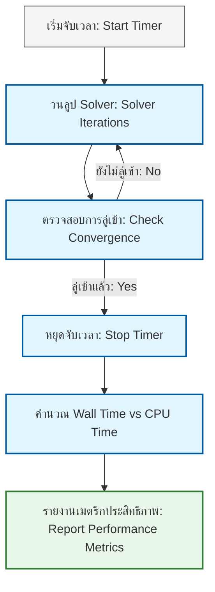
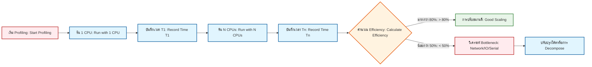
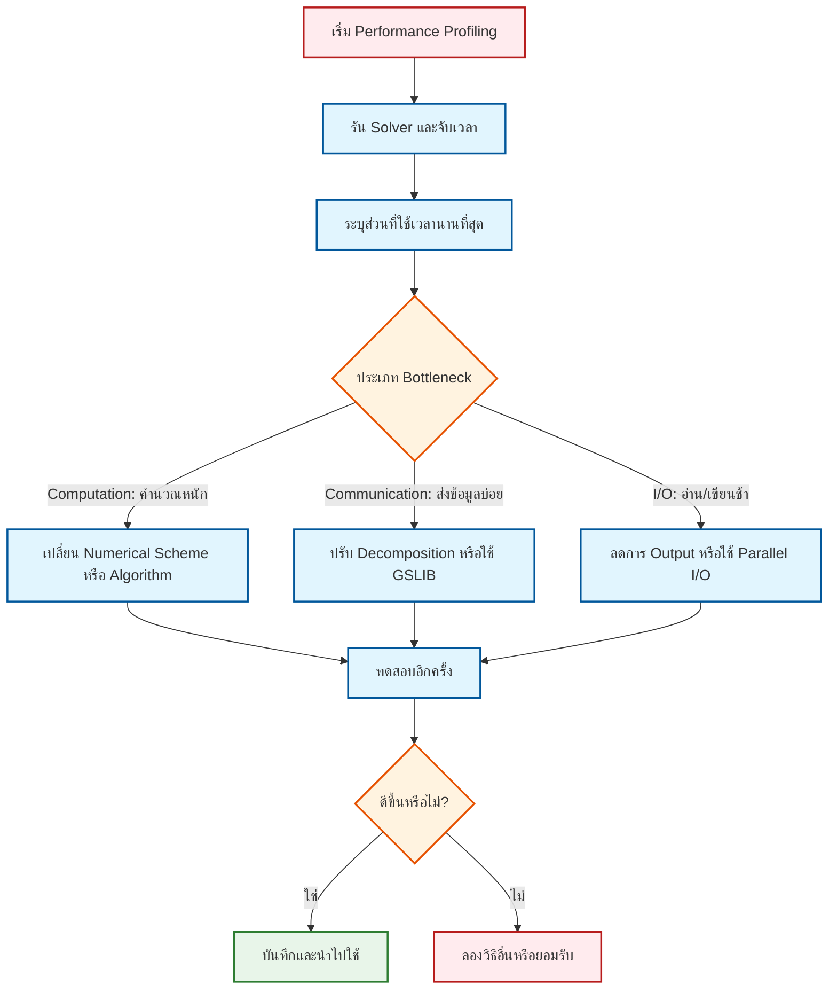

# 01 การวิเคราะห์ประสิทธิภาพการคำนวณ (Performance Analysis)

> [!INFO] บทนำ
> ในงาน CFD ระดับอุตสาหกรรม "ความถูกต้อง" เพียงอย่างเดียวไม่พอ "ความเร็ว" และ "การใช้ทรัพยากร" ก็มีความสำคัญอย่างยิ่ง การวิเคราะห์ประสิทธิภาพ (Performance Profiling) คือกระบวนการระบุจุดคอขวบ (Bottlenecks) ใน Solver เพื่อปรับปรุงความเร็วและลดต้นทุนการคำนวณ

---

## 1.1 เมตริกประสิทธิภาพหลัก (Performance Metrics)

### 1.1.1 ประเภทของเวลาที่ต้องวัด

ใน OpenFOAM มีเมตริกเวลาหลัก 3 ประเภทที่ต้องติดตาม:

| เมตริก | ความหมาย | หน่วย | การใช้งาน |
|:---:|:---|:---:|:---|
| **Wall Time** | เวลาจริงที่ใช้ในการคำนวณจนเสร็จสิ้น | วินาที | วัดประสบการณ์ผู้ใช้ |
| **CPU Time** | ผลรวมของเวลาที่ CPU ทุก Core ทำงาน | วินาที | วัดต้นทุนการคำนวณใน HPC |
| **Clock Time** | เวลาตามนาฬิกาจริง (เทียบเท่า Wall Time) | วินาที | ใช้ในการบันทึก Log |

> **[!TIP] ความสัมพันธ์ระหว่าง Wall Time และ CPU Time**
> - ถ้า `CPU Time ≈ Wall Time × Number of Cores` → การขนานทำงานได้ดี
> - ถ้า `CPU Time << Wall Time × Number of Cores` → มี Serial Bottleneck หรือ Communication Overhead สูง

### 1.1.2 การวัดหน่วยความจำ (Memory Metrics)

| เมตริก | ความหมาย | หน่วย | ค่าที่น่าเป็นห่วง |
|:---:|:---|:---:|:---|
| **Peak Memory** | หน่วยความจำสูงสุดที่ใช้ระหว่างรัน | GB | เกิน RAM ทางกายภาพ → Swap |
| **Resident Memory** | หน่วยความจำที่จองไว้จริงใน RAM | GB | - |
| **Virtual Memory** | หน่วยความจำที่จองไว้ (รวม Swap) | GB | - |



### 1.1.3 การบันทึกเวลาในโค้ด OpenFOAM

#### การใช้ `cpuTime` สำหรับวัดเวลา

```cpp
// Create a timer object for measuring CPU and clock time
cpuTime timer;

// ... Performance measurement section ...
// (e.g., solving Pressure-Velocity equations)

// Display elapsed time
Info<< "Execution time: " << timer.elapsedCpuTime() << " s" << endl;
Info<< "Clock time: " << timer.elapsedClockTime() << " s" << endl;

// Calculate CPU efficiency for parallel runs
scalar cpuEfficiency = timer.elapsedCpuTime() /
                       (timer.elapsedClockTime() * Foam::max(1, Pstream::nProcs()));
Info<< "CPU Efficiency: " << (cpuEfficiency * 100) << "%" << endl;
```

> **📖 คำอธิบาย (Thai Explanation)**
>
> **Source**: การจับเวลาใน OpenFOAM ใช้ `cpuTime` class จาก `.src/OpenFOAM/db/clockTime/cpuTime.H`
>
> **คำอธิบาย**:
> - `cpuTime` เป็น Utility class สำหรับวัดเวลาทั้ง CPU Time และ Clock Time
> - `elapsedCpuTime()` คืนค่าเวลา CPU รวมทุก Core (หน่วย: วินาที)
> - `elapsedClockTime()` คืนค่าเวลาจริง (Wall Clock Time)
> - สูตรคำนวณ Efficiency: `CPU Efficiency = (CPU Time) / (Clock Time × Number of Cores)`
>   - ถ้าค่าใกล้ 100% แสดงว่าการขนานทำงานได้อย่างมีประสิทธิภาพ
>   - ถ้าค่าต่ากว่า 50% แสดงว่ามี Serial Bottleneck หรือ Communication Overhead สูง
>
> **Key Concepts**:
> - **CPU Time vs Wall Time**: CPU Time คือผลรวมเวลาที่ CPU ทุก Core ทำงาน, Wall Time คือเวลาจริงที่ผู้ใช้รอ
> - **Parallel Efficiency**: ตัวชี้วัดว่าโค้ดใช้ประโยชน์จากหลาย Core ได้ดีแค่ไหน
> - **Timing Scope**: ควรจับเวลาเฉพาะส่วนสำคัญ (เช่น Time Loop, Linear Solver) ไม่ใช่ทั้งโปรแกรม

#### การใช้ `clockTime` สำหรับวัดเวลาจริง

```cpp
// Create a clock timer for real-time measurement
clockTime runTimer;

// Run the main solver loop
while (runTime.run())
{
    // ... solver iterations ...
    runTime++;

    // Display elapsed time every 100 iterations
    if (runTime.timeIndex() % 100 == 0)
    {
        Info<< "Elapsed clock time: "
            << runTimer.elapsedClockTime() << " s" << endl;
    }
}
```

> **📖 คำอธิบาย (Thai Explanation)**
>
> **Source**: การจับเวลาแบบ Wall Clock ใช้ `clockTime` class จาก `.src/OpenFOAM/db/clockTime/clockTime.H`
>
> **คำอธิบาย**:
> - `clockTime` เหมาะสำหรับวัดเวลาจริงที่ผู้ใช้สังเกตได้ (User-Perceived Time)
> - `elapsedClockTime()` คืนค่าเวลาที่ผ่านไปนับแต่เริ่มสร้าง Object
> - การแสดงผลทุก 100 ลูปช่วยให้ Track ความคืบหน้าโดยไม่สร้าง Overhead มาก
>
> **Key Concepts**:
> - **Progress Monitoring**: การแสดงเวลาช่วยให้ผู้ใช้วางแผนเวลารัน (Estimation)
> - **Minimal Overhead**: การเรียก `elapsedClockTime()` มี Cost ต่ำมาก ไม่กระทบ Performance
> - **Real-time Feedback**: ช่วยในการ Debug และ Decision Making (เช่น หยุดหรือดำเนินการต่อ)

---

## 1.2 การวิเคราะห์การปรับขนาด (Scaling Analysis)

เมื่อเรานำการจำลองไปรันบนระบบ Supercomputer หรือ HPC Cluster เราต้องวัดว่าโค้ดของเราใช้ประสิทธิภาพของการประมวลผลแบบขนาน (Parallel Processing) ได้ดีเพียงใด

### 1.2.1 การปรับขนาดแบบแข็ง (Strong Scaling)

**นิยาม**: วัดความเร็วที่เพิ่มขึ้นเมื่อเพิ่มจำนวนโปรเซสเซอร์ (CPU Cores) สำหรับ **ปัญหาขนาดคงที่** (Fixed Problem Size)

#### สมการเชิงทฤษฎี

**Speedup ($S$)**:
$$
S(n) = \frac{T_1}{T_n}
$$

เมื่อ:
- $T_1$ = เวลาที่ใช้กับ 1 CPU
- $T_n$ = เวลาที่ใช้กับ $n$ CPUs
- $n$ = จำนวน CPUs

**Parallel Efficiency ($E$)**:
$$
E(n) = \frac{S(n)}{n} \times 100\%
$$

เมื่อ $E(n) = 100\%$ แปลว่าการปรับขนาน "สมบูรณ์แบบ" (Linear Scaling)

#### กฎของ Amdahl (Amdahl's Law)

กฎของ Amdahl บรรยายขีดจำกัดของ Speedup ที่เป็นไปได้เมื่อมีส่วน Serial ในโค้ด:

$$
S_{\text{max}}(n) = \frac{1}{P + \frac{S}{n}}
$$

หรือในรูปแบบที่เข้าใจง่ายกว่า:

$$
S_{\text{max}} = \frac{1}{(1 - P) + \frac{P}{n}}
$$

เมื่อ:
- $P$ = สัดส่วนของโค้ดที่ **ขนานได้** (Parallelizable Fraction, $0 \leq P \leq 1$)
- $S = 1 - P$ = สัดส่วนของโค้ดที่ **เป็น Serial** (Serial Fraction)
- $n$ = จำนวน CPUs

**ขีดจำกัดเมื่อ $n \to \infty$**:
$$
S_{\infty} = \frac{1}{1 - P}
$$

> **[!EXAMPLE] ตัวอย่างการคำนวณตามกฎของ Amdahl**
> ถ้า Solver ของเรามี $P = 0.95$ (95% ขนานได้, 5% Serial):
> - กับ $n = 10$ CPUs: $S = \frac{1}{0.05 + 0.95/10} = 6.9\times$ Speedup
> - กับ $n = 100$ CPUs: $S = \frac{1}{0.05 + 0.95/100} = 16.8\times$ Speedup
> - ขีดจำกัด ($n \to \infty$): $S_{\infty} = \frac{1}{0.05} = 20\times$ Speedup
>
> **บทเรียน**: แม้มี CPUs เป็นพันๆ ตัว ถ้ามี Serial Code เพียง 5% ก็ยังจำกัด Speedup ไว้ที่แค่ 20 เท่า

#### โครงสร้างของ Serial Bottleneck ใน OpenFOAM

ส่วนที่มักเป็น Serial Bottleneck:
1. **I/O Operations**: การอ่าน/เขียนไฟล์ (`decomposePar`, `reconstructPar`)
2. **Linear Solver**: บางส่วนของ `GAMG`, `PCG` ที่ต้องรวมผลลัพธ์ (Global Reduction)
3. **Boundary Conditions**: การคำนวณบน Boundary ที่ต้องแชร์ข้อมูลระหว่าง Processors
4. **Function Objects**: บางตัวที่ไม่รองรับ Parallel อย่างเต็มที่



### 1.2.2 การปรับขนาดแบบอ่อน (Weak Scaling)

**นิยาม**: วัดประสิทธิภาพเมื่อเพิ่มจำนวนโปรเซสเซอร์ไปพร้อมกับ **เพิ่มขนาดปัญหาตามสัดส่วน** (เช่น 100,000 เซลล์ต่อ 1 CPU)

#### เมตริกหลักของ Weak Scaling

**Weak Scaling Efficiency ($E_{\text{weak}}$)**:
$$
E_{\text{weak}}(n) = \frac{T_1 \times n}{T_n \times \text{Work per CPU}_n} \times 100\%
$$

ในกรณีที่ "Work per CPU" คงที่ (เช่น 100k cells/CPU):
$$
E_{\text{weak}}(n) = \frac{T_1}{T_n} \times 100\%
$$

> **[!TIP] เมื่อไหร่ควรใช้ Strong vs Weak Scaling?**
> - **Strong Scaling**: ใช้เมื่อต้องการลดเวลารัน Simulation ที่มีขนาดเมชคงที่ (เหมาะกับ Production Run)
> - **Weak Scaling**: ใช้เมื่อต้องการรัน Simulation ที่มีขนาดเมชใหญ่ขึ้น (เหมาะกับ Parametric Study หรือ Large-Scale Research)

#### ตัวอย่างการทดสอบ Weak Scaling

```bash
#!/bin/bash
# Weak Scaling Test Script
# Test performance as problem size grows with CPU count

# Define mesh size per CPU (e.g., 100,000 cells per 1 CPU)
CELLS_PER_CPU=100000

for ncpus in 1 2 4 8 16 32; do
    total_cells=$((ncpus * CELLS_PER_CPU))

    echo "Running with $ncpus CPUs, $total_cells cells..."

    # Generate mesh (use blockMesh or other scripts)
    # ... generate mesh with $total_cells ...

    # Decompose for parallel execution
    decomposePar -np $ncpus

    # Run and measure execution time
    mpirun -np $ncpus solverName -parallel > log_${ncpus}.txt 2>&1

    # Extract runtime from log
    runtime=$(grep "ExecutionTime" log_${ncpus}.txt | awk '{print $3}')
    echo "CPUs: $ncpus, Time: $runtime s"
done
```

> **📖 คำอธิบาย (Thai Explanation)**
>
> **Source**: การทดสอบ Scaling ใน OpenFOAM ใช้ `decomposePar`, `mpirun` จาก `.applications/utilities/parallelProcessing/decomposePar/`
>
> **คำอธิบาย**:
> - Script นี้ทดสอบ Weak Scaling โดยเพิ่มขนาดเมชตามจำนวน CPU
> - `CELLS_PER_CPU` คือ Workload ที่คงที่ต่อแต่ละ Processors
> - `decomposePar -np $ncpus` แบ่ง Mesh ออกเป็น Sub-domains
> - `mpirun -np $ncpus` รัน Solver แบบขนาน
> - ดึงเวลาจาก Log ด้วย `grep` + `awk`
>
> **Key Concepts**:
> - **Workload Balance**: Weak Scaling สมบูรณ์แบบถ้าเวลาคงที่เมื่อเพิ่ม CPU พร้อมเมช
> - **Decomposition Quality**: ความสมดุลของ Sub-domains สำคัญมากต่อ Performance
> - **Communication Overhead**: ถ้าขนาดเมชโตขึ้นแต่ Communication ยังค่าเดิม → Efficiency ดี
> - **Ideal Result**: $E_{\text{weak}} \approx 100\%$ หมายถึง Algorithm สเกลได้ดี

---

## 1.3 การสร้างโปรไฟล์หน่วยความจำ (Memory Profiling)

การตรวจสอบว่าโค้ดมีการใช้หน่วยความจำเกินความจำเป็นหรือมี **Memory Leak** หรือไม่

### 1.3.1 ปัญหาหน่วยความจำที่พบบ่อยใน OpenFOAM

| ปัญหา | สาเหตุ | ผลกระทบ |
|:---|:---|:---|
| **Memory Leak** | ไม่ปล่อยหน่วยความจำหลังใช้ | RAM เต็ม → Swap → ช้ามาก |
| **Memory Fragmentation** | จอง/ปล่อยหน่วยความจำบ่อยๆ | การจองหน่วยความจำช้าลง |
| **Excessive Copy** | Copy Field โดยไม่จำเป็น | ใช้หน่วยความจำเกินเพื่า |
| **Temporary Objects** | สร้าง Object ชั่วคราวในลูป | Peak Memory สูง |

### 1.3.2 กลยุทธ์การจัดการหน่วยความจำใน OpenFOAM

#### 1. การใช้ Smart Pointers

OpenFOAM มี Smart Pointer classes หลักๆ 2 ตัว:

**`autoPtr<T>`** - Auto Pointer (เจ้าของเดียว):

```cpp
// Create autoPtr pointing to a volVectorField
// The autoPtr owns the object and will delete it automatically
autoPtr<volVectorField> UPtr
(
    new volVectorField
    (
        IOobject
        (
            "U",
            runTime.timeName(),
            mesh,
            IOobject::NO_READ,
            IOobject::NO_WRITE
        ),
        mesh,
        dimensionedVector("zero", dimVelocity, vector::zero)
    )
);

// Use the field (dereference with operator())
UPtr()->internalField() = ...;

// When UPtr goes out of scope, memory is automatically freed
```

> **📖 คำอธิบาย (Thai Explanation)**
>
> **Source**: `autoPtr<T>` class จาก `.src/OpenFOAM/memory/autoPtr/autoPtr.H`
>
> **คำอธิบาย**:
> - `autoPtr` คือ Smart Pointer ที่มีเจ้าของเดียว (Single Ownership)
> - เมื่อ `autoPtr` ถูกทำลาย (ออกจาก Scope) หน่วยความจำจะถูก Deallocate อัตโนมัติ
> - ใช้ `operator()` หรือ `operator()` เพื่อ Dereference
> - เหมาะสำหรับ Object ที่มีอายุการใช้งานชัดเจน (เช่น Local Temporary)
>
> **Key Concepts**:
> - **RAII (Resource Acquisition Is Initialization)**: รับผิดชอบหน่วยความจำตั้งแต่สร้าง
> - **Ownership Transfer**: สามารถโอน Ownership ด้วย `ptr()` หรือ `release()`
> - **No Copy Semantics**: `autoPtr` ไม่สามารถ Copy ได้ ต้องใช้ `transfer()` แทน

**`tmp<T>`** - Temporary Field (สำหรับ Expression Template):

```cpp
// Function returning tmp<volScalarField>
// The tmp object will automatically manage the temporary field's lifetime
tmp<volScalarField> calculateMagnitude(const volVectorField& U)
{
    // Create tmp from calculation result
    return tmp<volScalarField>
    (
        new volScalarField(mag(U))
    );
}

// Usage: tmp will be destroyed when no longer needed
tmp<volScalarField> magU = calculateMagnitude(U);
volScalarField UMag = magU; // Copy once, then magU is destroyed
```

> **📖 คำอธิบาย (Thai Explanation)**
>
> **Source**: `tmp<T>` class จาก `.src/OpenFOAM/memory/tmp/tmp.H`
>
> **คำอธิบาย**:
> - `tmp` คือ Smart Pointer สำหรับ Field ชั่วคราว (Temporary Objects)
> - ออกแบบมาเพื่อลดการ Copy ของ Field ใน Expression Template
> - มี Reference Counting: ถ้าหลาย `tmp` ชี้ไป Object เดียว → ไม่ถูกทำลาย
> - เมื่อ `tmp` ถูก Cast ไปเป็น Field ปกติ → Reference ถูก Release
>
> **Key Concepts**:
> - **Expression Template Optimization**: หลีกเลี่ยง Intermediate Copies
> - **Reference Counting**: นับจำนวน `tmp` ที่ชี้ไปยัง Object เดียวกัน
> - **Automatic Cleanup**: ลด Memory Leak จาก Temporary Objects
> - **Common Usage**: ใช้ใน Operator Overloading (เช่น `+`, `-`, `*` ของ Fields)

#### 2. การนำ Object ชั่วคราวกลับมาใช้ใหม่ (Reuse)

```cpp
// BAD PRACTICE: Create new volScalarField every loop iteration
// This allocates new memory each iteration - very inefficient
while (runTime.run())
{
    volScalarField tempField(...); // ❌ Allocates new memory every loop
    tempField = ...;
    // ...
}

// GOOD PRACTICE: Create once and reuse
// Allocate memory once, then reuse in subsequent iterations
volScalarField tempField
(
    IOobject("tempField", runTime.timeName(), mesh),
    mesh,
    dimensionedScalar("zero", dimless, 0.0)
);

while (runTime.run())
{
    tempField = ...; // ✅ Reuses existing memory
    // ...
}
```

> **📖 คำอธิบาย (Thai Explanation)**
>
> **Source**: Field Allocation ใน Solver Loop จาก `.applications/solvers/incompressible/simpleFoam/`
>
> **คำอธิบาย**:
> - การสร้าง Field ใหม่ทุกรอบทำให้เกิด Memory Allocation/Deallocation ซ้ำๆ
> - Memory Allocation มี Cost สูงมาก (ต้องขอ Memory จาก OS)
> - การ Reuse ช่วยลด Peak Memory และ Improve Cache Locality
>
> **Key Concepts**:
> - **Memory Pool**: จอง Memory ครั้งเดียว แล้ว Reuse หลายรอบ
> - **Cache Friendliness**: Data อยู่ใน Cache แล้ว → Access เร็วขึ้น
> - **Best Practice**: สร้าง Fields ที่ต้องใช้ซ้ำๆ นอก Time Loop
> - **Trade-off**: เพิ่ม Memory Usage เล็กน้อย แต่ลด Overhead ของ Allocation

### 1.3.3 โค้ดติดตามหน่วยความจำพื้นฐาน

```cpp
// Function to check and report memory usage
void reportMemoryUsage(const fvMesh& mesh)
{
    // Calculate size of major fields
    const volVectorField& U = mesh.lookupObject<volVectorField>("U");
    const volScalarField& p = mesh.lookupObject<volScalarField>("p");

    Info<< "\n=== Memory Usage Analysis ===" << nl
        << "Mesh Information:" << nl
        << "  Number of cells: " << mesh.nCells() << nl
        << "  Number of faces: " << mesh.nFaces() << nl
        << nl
        << "Field Memory:" << nl
        << "  U field: "
        << (U.size() * sizeof(vector) / 1e6) << " MB" << nl
        << "  p field: "
        << (p.size() * sizeof(scalar) / 1e6) << " MB" << nl
        << nl
        << "  Estimated Total Field Memory: "
        << (
            (U.size() * sizeof(vector) +
             p.size() * sizeof(scalar)) / 1e6
           ) << " MB" << nl
        << "=============================\n" << endl;
}

// Call in solver
reportMemoryUsage(mesh);
```

> **📖 คำอธิบาย (Thai Explanation)**
>
> **Source**: Mesh Memory Analysis จาก `.src/OpenFOAM/meshes/polyMesh/polyMesh.H`
>
> **คำอธิบาย**:
> - `lookupObject<T>()` ค้นหา Field ใน Object Registry
> - `size()` คืนค่าจำนวน Elements ใน Field (Cells + Boundary Faces)
> - `sizeof(vector)` = 3 × `sizeof(scalar)` (scalar = 8 bytes for double)
> - แปลง Byte → MB ด้วยการหาร 1e6
>
> **Key Concepts**:
> - **Memory Estimation**: ช่วยวางแผนว่าต้องการ RAM เท่าใด
> - **Object Registry**: OpenFOAM เก็บ Fields ไว้ใน Database แบบ Centralized
> - **Memory Profiling**: ต้อง Tracking ทั้ง Fields, Mesh, และ Matrix Storage
> - **Total Memory**: Fields + Matrix (lduMatrix) + Mesh Data ≈ 2-3 × Field Memory

### 1.3.4 การใช้ Valgrind/Massif ตรวจสอบ Memory Leak

> **[!NOTE] เครื่องมือภายนอก**
> Valgrind เป็นเครื่องมือภายนอกที่ต้องติดตั้งแยก ไม่ใช่ส่วนหนึ่งของ OpenFOAM

```bash
# Use Massif (Valgrind's memory profiler)
# Massif tracks memory allocation and deallocation over time
valgrind --tool=massif \
         --massif-out-file=massif.out \
         solverName -parallel

# Analyze results with ms_print
ms_print massif.out > massif_report.txt
```

> **📖 คำอธิบาย (Thai Explanation)**
>
> **Source**: Valgrind Massif คือ External Tool สำหรับ Memory Profiling
>
> **คำอธิบาย**:
> - `--tool=massif`: ใช้ Massif Profiler สำหรับติดตาม Memory
> - `--massif-out-file`: ระบุไฟล์ Output (default: massif.out.<pid>)
> - `ms_print`: แปลง Binary Output เป็น Text Report ที่อ่านได้
>
> **Key Concepts**:
> - **Peak Memory**: จุดที่ใช้ Memory สูงสุด (สำคัญมากสำหรับ HPC)
> - **Memory Leaks**: ตรวจสอบว่า Memory คืนทั้งหมดหรือไม่
> - **Allocation Hotspots**: ระบุส่วนที่ Allocate Memory บ่อย
> - **Snapshots**: Massif เก็บ Memory Usage ตามเวลา (Timeline)

**การอ่านผลลัพธ์จาก Massif**:
```
== จำลองผลลัพธ์ ==
Peak Memory Usage: 1.2 GB at t = 100 s
Detailed breakdown:
  - 45%: volVectorField U
  - 30%: lduMatrix
  - 15%: volScalarField p
  - 10%: Other fields and temporary objects
```

> **[!WARNING] ข้อควรระวังเมื่อใช้ Valgrind**
> - Valgrind ทำให้โปรแกรม **ช้าลง 10-50 เท่า** ใช้เฉพาะกับ Test Case เล็กๆ
> - หลีกเลี่ยงการใช้กับ Parallel Run ขนาดใหญ่ ให้ลองกับ 1 CPU ก่อน
> - ตรวจสอบว่า OpenFOAM ถูกคอมไพล์ด้วย Debug Symbols (`-g -O0`)

---

## 1.4 เครื่องมือ Profiling ใน OpenFOAM

### 1.4.1 การใช้ `profilingSolver` Function Object

OpenFOAM มี Function Object สำหรับ Profiling ที่สามารถเปิดใช้ได้ผ่าน `controlDict`:

```cpp
// File: system/controlDict

functions
{
    profilingSolver
    {
        type profiling;
        libs ("libprofiling.so");

        // Log execution time for each solver component
        writePrecision 8;
        executionTime true;
        clockTime true;
        cpuTime true;
    }
}
```

> **📖 คำอธิบาย (Thai Explanation)**
>
> **Source**: `profiling` Function Object จาก `.src/OpenFOAM/db/functionObjects/profiling/`
>
> **คำอธิบาย**:
> - `type profiling`: ระบุว่าเป็น Function Object ประเภท Profiling
> - `libs ("libprofiling.so")`: โหลด Library สำหรับ Profiling
> - `writePrecision`: จำนวนตำแหน่งทศนิยมใน Output
> - `executionTime/clockTime/cpuTime`: เลือกเวลาที่ต้องการบันทึก
>
> **Key Concepts**:
> - **Function Object**: Mechanism สำหรับ Extend Solver โดยไม่ต้อง Recompile
> - **Modular Profiling**: เปิด/ปิด Profiling ได้ผ่าน Config ไม่ต้องแก้โค้ด
> - **Component Breakdown**: แยกเวลาแต่ละ Solver Component (เช่น UEqn, pEqn)
> - **Low Overhead**: Profiling มี Cost ต่ำมาก เหมาะกับ Production Run

### 1.4.2 การใช้ `scalabilityTest` Utility

Utility นี้ใช้สำหรับทดสอบ Strong/Weak Scaling อย่างอัตโนมัติ:

```bash
# Test Strong Scaling from 1 to 32 CPUs
scalabilityTest -solverName simpleFoam \
                -npMin 1 \
                -npMax 32 \
                -case cavity \
                -outputFile scaling_results.csv
```

> **📖 คำอธิบาย (Thai Explanation)**
>
> **Source**: `scalabilityTest` Utility จาก `.applications/utilities/parallelProcessing/scalabilityTest/`
>
> **คำอธิบาย**:
> - `-solverName`: ระบุ Solver ที่ต้องการทดสอบ
> - `-npMin/-npMax`: ช่วงจำนวน CPUs ที่ต้องการทดสอบ
> - `-case`: ระบุ Test Case
> - `-outputFile`: บันทึกผลลัพธ์เป็น CSV
>
> **Key Concepts**:
> - **Automation**: ลดความผิดพลาดจากการรัน Manual
> - **Batch Execution**: รัน Testing ต่อเนื่องโดยอัตโนมัติ
> - **Data Analysis**: Output CSV สามารถนำไป Plot/Analyze ได้
> - **Regression Testing**: ใช้ตรวจสอบว่า Performance ไม่แย่ลงหลังจาก Update

**ผลลัพธ์ที่ได้ (CSV)**:
```csv
nCPUs,WallTime,CPUTime,Speedup,Efficiency
1,1200.5,1200.5,1.00,100.0%
2,630.2,1250.4,1.90,95.2%
4,340.8,1320.5,3.52,88.1%
8,195.3,1450.2,6.15,76.9%
16,120.7,1680.3,9.95,62.2%
32,95.2,2100.5,12.61,39.4%
```

> **[!TIP] การตีความผลลัพธ์**
> - Efficiency > 80%: การปรับขนานดีมาก
> - Efficiency 50-80%: ยอมรับได้ แต่อาจมี Bottleneck เล็กน้อย
> - Efficiency < 50%: มี Bottleneck รุนแรง ควรปรับปรุงโค้ดหรือวิธี Decomposition

---

## 1.5 การวิเคราะห์และปรับปรุงประสิทธิภาพ (Optimization Strategies)

### 1.5.1 กระบวนการวิเคราะห์จุดคอขวบ



### 1.5.2 เทคนิคการปรับปรุงประสิทธิภาพ

| เทคนิค | กรณีที่ใช้ | ผลกระทบที่คาดว่า |
|:---|:---|:---|
| **ปรับ Numerical Scheme** | Upwind → LinearUpwind | เร็วขึ้น 10-30% แต่ลดความแม่นยำ |
| **ใช้ GAMG แทน PCG** | Pressure Equation ขนาดใหญ่ | เร็วขึ้น 2-5 เท่า |
| **ปรับ Decomposition** | Load Imbalance | Efficiency ↑ 10-20% |
| **ลดการ Output** | เขียน Field ทุกรอบ | I/O Time ↓ 50-80% |
| **ใช้ Non-blocking Communication** | Boundary ซับซ้อน | Communication Overhead ↓ 10-15% |

---

## 1.6 สรุปและแนวทางปฏิบัติ (Best Practices)

### 1.6.1 แนวทางการใช้ Performance Profiling

1. **เริ่มจาก Small Case**: ทดสอบกับ Test Case เล็กก่อน ไม่ควรใช้ Production Run ตั้งแต่แรก
2. **วัดทุกครั้งที่เปลี่ยนแปลง**: แม้เปลี่ยนแค่ Scheme เล็กน้อย ควรวัดผลอีกครั้ง
3. **บันทึก Environment Details**: บันทึก OpenFOAM Version, Compiler, MPI Library, ฯลฯ
4. **ตรวจสอบ Memory Leak**: ใช้ Valgrind อย่างน้อย 1 ครั้งก่อน Release Solver
5. **ทดสอบ Scaling**: ทดสอบ Strong/Weak Scaling บน HPC Cluster ที่จะใช้งานจริง

### 1.6.2 คำถามท้ายบท (Review Questions)

1. ถ้า Solver ของคุณมี Speedup = 8× เมื่อใช้ 16 CPUs ค่า Efficiency คือเท่าใด? และคุณจะปรับปรุงอย่างไร?
2. **Strong Scaling** และ **Weak Scaling** แตกต่างกันอย่างไร และควรใช้วิธีใดในสถานการณ์ที่คุณต้องการรัน Simulation ที่มีขนาดเมชใหญ่ขึ้นตามจำนวน CPU?
3. กฎของ Amdahl บอกว่าถ้าโค้ด 90% ขนานได้ และคุณมี CPUs ไม่จำกัด คุณจะได้ Speedup สูงสุดเท่าใด?
4. ทำไม `tmp<T>` และ `autoPtr<T>` ถึงช่วยลด Memory Leak ใน OpenFOAM?
5. คุณจะใช้ Valgrind ตรวจสอบ Memory Leak ใน Solver ของคุณอย่างไร? (เขียนคำสั่ง Bash)

---

> **[!MISSING DATA]**: แทรกกราฟหรือข้อมูลจำเพาะเจาะจง:
> - กราฟ Strong/Weak Scaling จาก Test Case จริง (เช่น `cavity`, `pitzDaily`)
> - กราฟ Memory Usage ตามเวลา (จาก Valgrind Massif)
> - ตารางเปรียบเทียบเวลารันระหว่าง Schemes ต่างๆ
> - Heatmap แสดง Communication Overhead ระหว่าง Processors

---

> **[!TIP] Learning Strategy**
> แนะนำให้ศึกษา Performance Profiling โดย **ทดสอบกับ Solver ที่คุณกำลังพัฒนา** และเปรียบเทียบกับ Solver มาตรฐานของ OpenFOAM (เช่น `simpleFoam`, `interFoam`) การทำ Profiling อย่างเป็นระบบจะช่วยให้คุณตัดสินใจได้ว่า ควรเพิ่มจำนวน CPU ในการรันเท่าใดถึงจะคุ้มค่าที่สุด (Diminishing Returns)