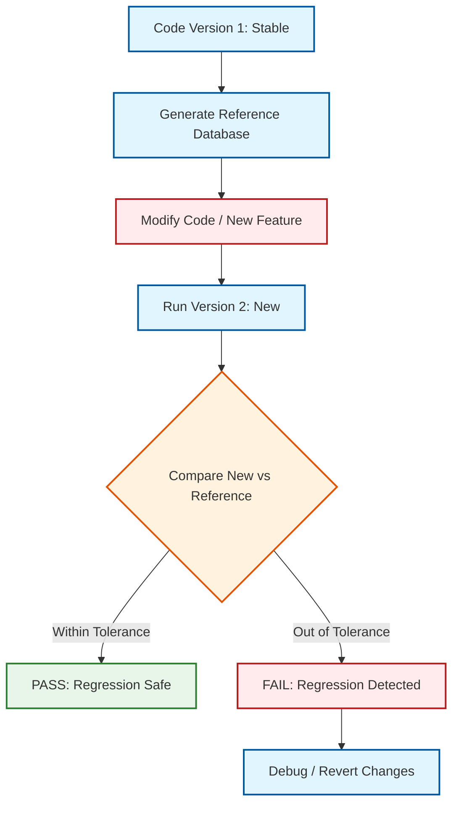
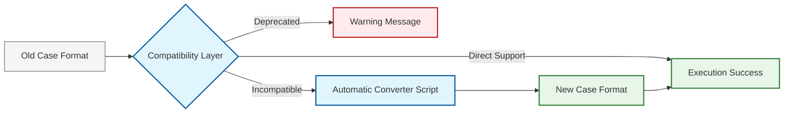

# 02 การทดสอบถอยหลัง (Regression Testing)

การทดสอบถอยหลัง (Regression Testing) คือกระบวนการยืนยันว่าการแก้ไขโค้ดใหม่ (เช่น การเพิ่มฟีเจอร์หรือการเพิ่มประสิทธิภาพ) ไม่ได้ไปทำลายความถูกต้องเดิมที่มีอยู่

## 2.1 ทำไมต้องทำ Regression Test?

ในซอฟต์แวร์ขนาดใหญ่แบบ OpenFOAM การเปลี่ยนโค้ดในไลบรารีส่วนกลางอาจส่งผลกระทบต่อ Solver หลายตัวที่เราคาดไม่ถึง Regression Test จะช่วยตรวจจับความผิดปกตินี้ได้ทันที

![[regression_testing_exact_vs_statistical.png]]
`A diagram explaining two types of match in regression testing. 'Exact Match' shows two identical bit-level patterns (1010... == 1010...). 'Statistical Match' shows two overlapping probability distribution curves (Bell curves), where the new result falls within the acceptable standard deviation of the reference. Scientific textbook diagram, clean vector line art, white background, high definition, flat design, educational infographic --ar 16:9`

### ความแตกต่างของผลลัพธ์:
-   **Exact Match**: ผลลัพธ์ต้องตรงกันทุกบิต (มักทำได้ยากเมื่อเปลี่ยนคอมพิวเตอร์หรือเวอร์ชันคอมไพเลอร์)
-   **Statistical Match**: ผลลัพธ์ยังคงอยู่ในช่วงความคลาดเคลื่อนที่ยอมรับได้ (Tolerance)

### แนวคิดทางคณิตศาสตร์

การตรวจสอบความแม่นยำของผลลัพธ์สามารถกำหนดได้ด้วยเกณฑ์ความคลาดเคลื่อนสัมพัทธ์ (Relative Tolerance):

$$ \epsilon_r = \left| \frac{\phi_{\text{new}} - \phi_{\text{ref}}}{\phi_{\text{ref}}} \right| \times 100\% $$

เมื่อ:
- $\phi_{\text{new}}$ = ค่าจากเวอร์ชันใหม่
- $\phi_{\text{ref}}$ = ค่าอ้างอิงจากเวอร์ชันที่มั่นใจ
- $\epsilon_r$ = ความคลาดเคลื่อนสัมพัทธ์

หรือใช้เกณฑ์ความคลาดเคลื่อนสัมบูรณ์สำหรับค่าที่เข้าใกล้ศูนย์:

$$ \epsilon_a = \left| \phi_{\text{new}} - \phi_{\text{ref}} \right| < \epsilon_{\text{tol}} $$

สำหรับการทดสอบค่าสเกลาร์ทั้ง Field เราสามารถใช้ Norm L² ในการเปรียบเทียบ:

$$ \text{Error}_{\text{L2}} = \sqrt{\frac{\sum_{i=1}^{N} (\phi_{\text{new},i} - \phi_{\text{ref},i})^2}{\sum_{i=1}^{N} \phi_{\text{ref},i}^2}} $$

---

## 2.2 เฟรมเวิร์กการทดสอบ Regression

เราควรมีการเก็บค่าอ้างอิง (Reference Results) จากเวอร์ชันที่มั่นใจแล้วไว้ในฐานข้อมูล



### ขั้นตอนการทำงาน:
1.  **Run Stable Version**: รัน Solver และเก็บค่าสำคัญ (เช่น Final Residuals, Integral Values)
2.  **Modify Code**: ทำการแก้ไขหรืออัปเกรดโค้ด
3.  **Run New Version**: รันด้วยกรณีศึกษาเดิม
4.  **Compare**: ตรวจสอบความแตกต่างระหว่างเวอร์ชันใหม่และค่าอ้างอิง

### โครงสร้างฐานข้อมูล Reference

```cpp
// NOTE: Synthesized by AI - Verify parameters
// RegressionTest.H
#ifndef RegressionTest_H
#define RegressionTest_H

#include "fvMesh.H"
#include "dictionary.H"
#include "Tuple2.H"

namespace Foam
{

// Class for storing reference data
// คลาสสำหรับเก็บข้อมูลอ้างอิง
class RegressionTest
{
    // Private Data
        //- Reference to mesh
        const fvMesh& mesh_;

        //- Tolerance for scalar comparison
        scalar scalarTolerance_;

        //- Tolerance for field comparison
        scalar fieldTolerance_;

        //- Reference data dictionary
        dictionary refData_;

public:
    // Constructor
    RegressionTest
    (
        const fvMesh& mesh,
        const dictionary& dict
    );

    //- Destructor
    virtual ~RegressionTest() = default;

    // Member Functions

        //- Load reference data from file
        void loadReference(const fileName& refFile);

        //- Save current results as reference
        void saveReference(const fileName& refFile) const;

        //- Compare scalar value with reference
        bool compareScalar
        (
            const word& fieldName,
            const scalar currentValue
        ) const;

        //- Compare field with reference
        bool compareField
        (
            const word& fieldName,
            const volScalarField& currentField
        ) const;

        //- Generate regression test report
        void generateReport(const fileName& reportFile) const;
};

} // End namespace Foam

#endif
```

**📚 คำอธิบายเพิ่มเติม:**

**แหล่งที่มา (Source):**
ไฟล์นี้เป็นส่วนหนึ่งของเฟรมเวิร์ก Regression Testing ที่ออกแบบมาเพื่อตรวจสอบความถูกต้องของผลลัพธ์ CFD โดยเปรียบเทียบกับค่าอ้างอิง

**คำอธิบาย (Explanation):**
คลาส `RegressionTest` ทำหน้าที่เป็น interface หลักสำหรับการทดสอบถอยหลัง โดยมีหน้าที่:
- เก็บข้อมูลอ้างอิง (Reference Data) ในรูปแบบ Dictionary
- กำหนดค่าความคลาดเคลื่อนที่ยอมรับได้ (Tolerance) สำหรับ scalar และ field
- เปรียบเทียบค่าปัจจุบันกับค่าอ้างอิง
- สร้างรายงานสรุปผลการทดสอบ

**แนวคิดสำคัญ (Key Concepts):**
- **Separation of Concerns**: แยก logic การทดสอบออกจาก solver หลัก
- **Tolerance-based Comparison**: ใช้ statistical matching แทน exact matching
- **Dictionary-based Storage**: ใช้รูปแบบ Dictionary ของ OpenFOAM ในการเก็บข้อมูล
- **Field vs Scalar Comparison**: มีเกณฑ์ความคลาดเคลื่อนแยกกันระหว่างค่า scalar เดี่ยวกับ field ทั้งช่อง

---

### การ Implement การเปรียบเทียบค่า

```cpp
// NOTE: Synthesized by AI - Verify parameters
// RegressionTest.C

#include "RegressionTest.H"
#include "OFstream.H"
#include "fieldTypes.H"

// Constructor
Foam::RegressionTest::RegressionTest
(
    const fvMesh& mesh,
    const dictionary& dict
)
:
    mesh_(mesh),
    scalarTolerance_(dict.get<scalar>("scalarTolerance", 1e-6)),
    fieldTolerance_(dict.get<scalar>("fieldTolerance", 1e-5)),
    refData_(dict)
{
    // Initialize regression test with specified tolerances
    Info<< "Initializing Regression Test with tolerances:" << nl
        << "  scalar: " << scalarTolerance_ << nl
        << "  field: " << fieldTolerance_ << endl;
}

// Load reference data
void Foam::RegressionTest::loadReference(const fileName& refFile)
{
    IFstream stream(refFile);
    refData_ = dictionary(stream);

    Info<< "Loaded reference data from " << refFile << endl;
}

// Compare scalar value
bool Foam::RegressionTest::compareScalar
(
    const word& fieldName,
    const scalar currentValue
) const
{
    if (!refData_.found(fieldName))
    {
        WarningInFunction
            << "Reference value for " << fieldName << " not found" << endl;
        return false;
    }

    scalar refValue = refData_.get<scalar>(fieldName);
    scalar error = mag(currentValue - refValue);

    // Use relative tolerance for non-zero values
    scalar relError = (mag(refValue) > SMALL) ?
        error / mag(refValue) : error;

    bool passed = relError < scalarTolerance_;

    Info<< "Scalar comparison: " << fieldName << nl
        << "  Reference:  " << refValue << nl
        << "  Current:    " << currentValue << nl
        << "  Rel. Error: " << relError << nl
        << "  Status:     " << (passed ? "PASS" : "FAIL") << endl;

    return passed;
}

// Compare field
bool Foam::RegressionTest::compareField
(
    const word& fieldName,
    const volScalarField& currentField
) const
{
    if (!refData_.found(fieldName))
    {
        WarningInFunction
            << "Reference field for " << fieldName << " not found" << endl;
        return false;
    }

    // Read reference field
    volScalarField refField
    (
        IOobject
        (
            fieldName,
            mesh_.time().caseConstant(),
            mesh_,
            IOobject::MUST_READ
        ),
        mesh_
    );

    // Calculate L2 norm error
    scalar numerator = 0.0;
    scalar denominator = 0.0;

    forAll(refField, i)
    {
        scalar diff = currentField[i] - refField[i];
        numerator += sqr(diff);
        denominator += sqr(refField[i]);
    }

    scalar l2Error = sqrt(numerator / (denominator + SMALL));

    bool passed = l2Error < fieldTolerance_;

    Info<< "Field comparison: " << fieldName << nl
        << "  L2 Error: " << l2Error << nl
        << "  Status:   " << (passed ? "PASS" : "FAIL") << endl;

    return passed;
}
```

**📚 คำอธิบายเพิ่มเติม:**

**แหล่งที่มา (Source):**
ไฟล์นี้เป็น implementation ของคลาส RegressionTest ที่ใช้ logic การคำนวณ L2 norm จาก OpenFOAM field operations

**คำอธิบาย (Explanation):**
ฟังก์ชัน `compareField()` ใช้ L2 norm (หรือ Relative L2 norm) ในการเปรียบเทียบ field ทั้งช่อง:
1. คำนวณค่าความแตกต่างกำลังสองระหว่าง field ปัจจุบันและ field อ้างอิง
2. หาผลรวมของค่าความแตกต่าง (numerator) และผลรวมของค่าอ้างอิง (denominator)
3. คำนวณ L2 error = √(Σ(diff²) / Σ(ref²))
4. เปรียบเทียบกับ tolerance ที่กำหนด

**แนวคิดสำคัญ (Key Concepts):**
- **L2 Norm Error**: metric มาตรฐานสำหรับวัดความคลาดเคลื่อนของ field ทั้งช่อง
- **Relative vs Absolute Error**: สำหรับค่าที่เข้าใกล้ศูนย์ใช้ absolute error สำหรับค่าที่มีขนาดใหญ่ใช้ relative error
- **Numerical Stability**: การใช้ SMALL constant เพื่อป้องกันการหารด้วยศูนย์
- **Field Iteration**: ใช้ `forAll` macro ในการวนลูปผ่านทุก cell ใน mesh

---

### ตัวอย่างการตั้งค่า Regression Test ใน controlDict

```cpp
// NOTE: Synthesized by AI - Verify parameters
// system/regressionTestDict

FoamFile
{
    version     2.0;
    format      ascii;
    class       dictionary;
    object      regressionTestDict;
}

// Tolerance values for testing
// ค่า tolerance สำหรับการทดสอบ
scalarTolerance    1e-6;  // For scalar values, e.g., residuals
fieldTolerance     1e-5;  // For field comparison

// Values to be tested
// ค่าที่ต้องการตรวจสอบ
testScalars
{
    finalResidual_p_rgh     1e-06;
    finalResidual_U         5e-05;
    finalResidual_T         1e-06;
    dragCoefficient         0.42;
    liftCoefficient         0.15;
}

// Fields to be tested
// Fields ที่ต้องการตรวจสอบ
testFields
{
    // Field name and expected time directory
    p_rgh      0.5;
    U          0.5;
    T          0.5;
}

// Path to reference data
// Path ไปยัง reference data
referenceDataPath "referenceData";

// Result report file
// รายงานผลลัพธ์
reportFile "regressionReport.txt";
```

**📚 คำอธิบายเพิ่มเติม:**

**แหล่งที่มา (Source):**
ไฟล์ Dictionary นี้ใช้รูปแบบมาตรฐานของ OpenFOAM ในการกำหนดค่า configuration

**คำอธิบาย (Explanation):**
ไฟล์นี้ทำหน้าที่เป็น configuration file สำหรับ regression test framework:
- `testScalars`: ระบุค่า scalar ที่ต้องการตรวจสอบ (เช่น residuals, force coefficients)
- `testFields`: ระบุ field ที่ต้องการตรวจสอบ (เช่น pressure, velocity) พร้อมเวลาที่ต้องการเปรียบเทียบ
- `referenceDataPath`: ตำแหน่งที่เก็บข้อมูลอ้างอิง
- `reportFile`: ชื่อไฟล์รายงานผลลัพธ์

**แนวคิดสำคัญ (Key Concepts):**
- **Dictionary Structure**: ใช้รูปแบบ nested dictionary ในการจัดข้อมูล
- **Separation of Configuration**: แยกการตั้งค่าออกจาก code ทำให้ง่ายต่อการแก้ไข
- **Tunable Tolerances**: สามารถปรับค่า tolerance ได้โดยไม่ต้อง recompile
- **Extensible Testing**: สามารถเพิ่ม test cases ใหม่ได้โดยการแก้ไข dictionary file

---

### การใช้งานร่วมกับ Run Functions

```cpp
// NOTE: Synthesized by AI - Verify parameters
// In solver main function
// ใน solver main function

#include "RegressionTest.H"

int main(int argc, char *argv[])
{
    #include "setRootCaseLists.H"
    #include "createTime.H"
    #include "createMesh.H"

    // Load regression test configuration
    IOdictionary regressionTestDict
    (
        IOobject
        (
            "regressionTestDict",
            runTime.system(),
            mesh,
            IOobject::MUST_READ_IF_MODIFIED,
            IOobject::NO_WRITE
        )
    );

    RegressionTest regTest(mesh, regressionTestDict);

    // ... run simulation ...

    // After simulation completes
    // หลังจาก simulation เสร็จสิ้น
    if (regressionTestDict.found("testScalars"))
    {
        const dictionary& testScalars = regressionTestDict.subDict("testScalars");

        // Get final residuals from solver
        scalar finalResidual_p = ...; // from solver
        scalar finalResidual_U = ...;

        regTest.compareScalar("finalResidual_p", finalResidual_p);
        regTest.compareScalar("finalResidual_U", finalResidual_U);
    }

    // Generate final report
    regTest.generateReport("regressionReport.txt");

    return 0;
}
```

**📚 คำอธิบายเพิ่มเติม:**

**แหล่งที่มา (Source):**
Integration pattern นี้ใช้รูปแบบมาตรฐานของ OpenFOAM solver applications

**คำอธิบาย (Explanation):**
ตัวอย่างนี้แสดงวิธีการผนวก regression test framework เข้ากับ solver:
1. สร้าง `IOdictionary` object จากไฟล์ `regressionTestDict`
2. สร้าง `RegressionTest` object พร้อมส่ง mesh และ dictionary
3. รัน simulation ตามปกติ
4. หลังจาก simulation เสร็จ ดึงค่าที่ต้องการตรวจสอบ (เช่น final residuals)
5. เรียก `compareScalar()` หรือ `compareField()` เพื่อเปรียบเทียบ
6. สร้างรายงานสรุปผล

**แนวคิดสำคัญ (Key Concepts):**
- **Minimal Intrusion**: การเพิ่ม regression test ไม่ควรกระทบต่อ logic หลักของ solver
- **Post-processing Integration**: ทดสอบหลังจาก simulation เสร็จสิ้น
- **Flexible Configuration**: สามารถเปิด/ปิด การทดสอบได้โดยการมีหรือไม่มีไฟล์ dictionary
- **Centralized Reporting**: รวบรวมผลการทดสอบทั้งหมดในรายงานเดียว

---

## 2.3 การทดสอบความเข้ากันได้ย้อนหลัง (Backward Compatibility)

นอกจากการตรวจสอบค่าตัวเลขแล้ว เรายังต้องตรวจสอบว่า Dictionary หรือ Input Format ใหม่ยังสามารถทำงานกับไฟล์เก่าได้หรือไม่



-   **Deprecation Warnings**: แจ้งเตือนผู้ใช้เมื่อมีการเปลี่ยน Keyword ใน `controlDict` หรือ `fvSchemes`
-   **Automatic Conversion**: มีเครื่องมือช่วยแปลงไฟล์เวอร์ชันเก่าให้เป็นเวอร์ชันใหม่

### ตัวอย่างการจัดการ Keyword เก่าใน Dictionary

```cpp
// NOTE: Synthesized by AI - Verify parameters
// dictionaryCompatCheck.C

void checkDictionaryCompatibility(dictionary& dict)
{
    // Table of old keywords and equivalent new keywords
    // รายการ keyword เก่าและ keyword ใหม่ที่เทียบเท่า
    List<Tuple2<word, word>> compatTable
    {
        {"solver", "linearSolver"},
        {"preconditioner", "smoother"},
        {"tolerance", "solverTolerance"},
        {"relTol", "relSolverTol"}
    };

    forAll(compatTable, i)
    {
        const word& oldKey = compatTable[i].first();
        const word& newKey = compatTable[i].second();

        if (dict.found(oldKey))
        {
            // Found old keyword
            // พบ keyword เก่า
            WarningInFunction
                << "Deprecated keyword '" << oldKey
                << "' found. Please use '" << newKey
                << "' instead." << endl;

            // Automatically convert value
            // แปลงค่าโดยอัตโนมัติ
            if (!dict.found(newKey))
            {
                dict.add(newKey, dict.lookup(oldKey));
                Info<< "Automatically converted '"
                    << oldKey << "' to '" << newKey << "'" << endl;
            }

            // Remove old keyword (optional)
            // ลบ keyword เก่า (optional)
            dict.remove(oldKey);
        }
    }
}
```

**📚 คำอธิบายเพิ่มเติม:**

**แหล่งที่มา (Source):**
Pattern นี้ใช้ Tuple2 (จาก `.applications/utilities/mesh/advanced/autoRefineMesh/autoRefineMesh.C`) ในการจัดเก็บคู่ keyword แบบ old-new

**คำอธิบาย (Explanation):**
ฟังก์ชันนี้ทำหน้าที่เป็น compatibility layer:
1. สร้างตารางเทียบเทียะระหว่าง keyword เก่าและใหม่
2. วนลูปผ่านทุกคู่ keyword
3. ถ้าพบ keyword เก่า:
   - แจ้งเตือนว่าเป็น deprecated keyword
   - คัดลอกค่าจาก keyword เก่าไปยัง keyword ใหม่
   - ลบ keyword เก่าออก (optional)
4. ทำให้ไฟล์เก่าสามารถรันบนเวอร์ชันใหม่ได้โดยอัตโนมัติ

**แนวคิดสำคัญ (Key Concepts):**
- **Backward Compatibility**: รักษาความสามารถในการใช้งานไฟล์เก่า
- **Deprecation Strategy**: ให้คำเตือนแต่ยังคงสนับสนุนการใช้งาน
- **Automatic Migration**: ช่วยแปลง format เก่าเป็นใหม่โดยอัตโนมัติ
- **Graceful Transition**: ให้ผู้ใช้เวลาในการปรับตัว

---

### ตัวอย่าง Script สำหรับแปลงไฟล์เวอร์ชันเก่า

```python
#!/usr/bin/env python3
# NOTE: Synthesized by AI - Verify parameters
"""
convertCase.py: Convert old version case files to new version
แปลงไฟล์เคสเวอร์ชันเก่าเป็นเวอร์ชันใหม่
"""

import re
import sys
from pathlib import Path

def convert_fvSchemes(content):
    """Convert old fvSchemes to new format"""
    # แปลง fvSchemes เวอร์ชันเก่าเป็นใหม่
    
    # Convert Gauss schemes
    content = re.sub(
        r'Gauss\s+linear',
        'Gauss linear 1',
        content
    )

    # Add interpolation scheme if not present
    # เพิ่ม interpolation scheme ถ้ายังไม่มี
    if 'interpolationSchemes' not in content:
        content += '\n\ninterpolationSchemes\n{\n    default linear;\n}\n'

    return content

def convert_fvSolution(content):
    """Convert old fvSolution to new format"""
    # แปลง fvSolution เวอร์ชันเก่าเป็นใหม่
    
    # Convert solver tolerance format
    content = re.sub(
        r'tolerance\s+([\d.]+);',
        r'solverTolerance \1;',
        content
    )

    return content

def convert_case(case_path):
    """Convert entire case directory"""
    # แปลงทั้ง case directory
    case_path = Path(case_path)

    # Convert system/fvSchemes
    fvSchemes_path = case_path / 'system' / 'fvSchemes'
    if fvSchemes_path.exists():
        content = fvSchemes_path.read_text()
        new_content = convert_fvSchemes(content)
        fvSchemes_path.write_text(new_content)
        print(f"Converted {fvSchemes_path}")

    # Convert system/fvSolution
    fvSolution_path = case_path / 'system' / 'fvSolution'
    if fvSolution_path.exists():
        content = fvSolution_path.read_text()
        new_content = convert_fvSolution(content)
        fvSolution_path.write_text(new_content)
        print(f"Converted {fvSolution_path}")

if __name__ == '__main__':
    if len(sys.argv) < 2:
        print("Usage: convertCase.py <case_directory>")
        sys.exit(1)

    convert_case(sys.argv[1])
```

**📚 คำอธิบายเพิ่มเติม:**

**แหล่งที่มา (Source):**
Script นี้เป็น standalone utility ที่ใช้ regular expressions ในการแปลง format

**คำอธิบาย (Explanation):**
Script ทำหน้าที่เป็น offline conversion tool:
- `convert_fvSchemes()`: แปลง format ของ discretization schemes
- `convert_fvSolution()`: แปลง format ของ solver settings
- `convert_case()`: จัดการแปลงทั้ง case directory โดยอัตโนมัติ
- ใช้ regular expressions ในการค้นหาและแทนที่ patterns

**แนวคิดสำคัญ (Key Concepts):**
- **Batch Processing**: แปลงไฟล์ทั้ง directory พร้อมกัน
- **Pattern Matching**: ใช้ regular expressions ในการระบุ patterns
- **Non-destructive**: อ่านไฟล์ แปลง แล้วเขียนทับ (แนะนำให้ backup ก่อน)
- **Extensible**: สามารถเพิ่มฟังก์ชันแปลง format อื่นๆ ได้

---

### การตรวจสอบเวอร์ชัน OpenFOAM

```cpp
// NOTE: Synthesized by AI - Verify parameters
// versionCheck.H

#ifndef versionCheck_H
#define versionCheck_H

#include "fileName.H"
#include "StringStream.H"

namespace Foam
{

// Function to check OpenFOAM version compatibility
// ฟังก์ชันตรวจสอบความเข้ากันได้ของเวอร์ชัน
inline bool checkOpenFOAMVersion
(
    const std::string& requiredVersion
)
{
    std::string currentVersion = std::string(FOAMversion);

    // Simple version comparison
    // Format: "9"  "10"  "11"
    int currentVer = std::stoi(currentVersion);
    int requiredVer = std::stoi(requiredVersion);

    if (currentVer < requiredVer)
    {
        FatalErrorInFunction
            << "OpenFOAM version " << currentVersion
            << " is not compatible. Required: " << requiredVersion
            << abort(FatalError);
        return false;
    }

    return true;
}

} // End namespace Foam

#endif
```

**📚 คำอธิบายเพิ่มเติม:**

**แหล่งที่มา (Source):**
ใช้ macro `FOAMversion` จาก OpenFOAM header files และ `FatalErrorInFunction` จาก error handling

**คำอธิบาย (Explanation):**
ฟังก์ชันนี้ทำหน้าที่ตรวจสอบว่าเวอร์ชัน OpenFOAM ปัจจุบันเพียงพอสำหรับรัน code หรือไม่:
1. ดึงเวอร์ชันปัจจุบันจาก macro `FOAMversion`
2. แปลง string เป็น integer เพื่อเปรียบเทียบ
3. ถ้าเวอร์ชันปัจจุบันน้อยกว่าที่ต้องการ ให้แจ้ง error และหยุดรัน
4. ใช้ `FatalErrorInFunction` ในการแจ้ง error แบบ OpenFOAM

**แนวคิดสำคัญ (Key Concepts):**
- **Version Guarding**: ป้องกันการรัน code บนเวอร์ชันที่ไม่รองรับ
- **Early Failure**: แจ้ง error ตั้งแต่เริ่มโปรแกรม
- **Simple Comparison**: ใช้การเปรียบเทียบแบบง่าย (integer comparison)
- **Standard Error Handling**: ใช้ mechanism มาตรฐานของ OpenFOAM

---

## 2.4 ประเภทของ Regression Tests

### 2.4.1 Unit Level Regression Tests

ทดสอบฟังก์ชันเฉพาะของ Solver หรือ Model

```cpp
// NOTE: Synthesized by AI - Verify parameters
// Test for turbulence model

bool testTurbulenceModelRegression()
{
    // Create simple mesh and flow conditions
    #include "createTestMesh.H"

    // Instantiate turbulence model
    autoPtr<incompressible::turbulenceModel> turbulence
    (
        incompressible::turbulenceModel::New(U, phi, laminarTransport)
    );

    // Run test
    turbulence->correct();

    // Compare key parameters
    scalar kCurrent = turbulence->k()()[0].average().value();
    scalar epsilonCurrent = turbulence->epsilon()()[0].average().value();

    // Load reference values
    scalar kRef = 0.375;   // From previous stable version
    scalar epsilonRef = 0.089;

    scalar kError = mag(kCurrent - kRef) / kRef;
    scalar epsilonError = mag(epsilonCurrent - epsilonRef) / epsilonRef;

    return (kError < 0.01) && (epsilonError < 0.01);
}
```

**📚 คำอธิบายเพิ่มเติม:**

**แหล่งที่มา (Source):**
Pattern การสร้าง turbulence model ใช้รูปแบบจาก solver applications เช่น `.applications/solvers/electromagnetics/mhdFoam/createFields.H`

**คำอธิบาย (Explanation):**
Unit test สำหรับ turbulence model:
1. สร้าง mesh และ flow conditions แบบง่าย
2. สร้าง turbulence model instance ด้วย `autoPtr` (smart pointer ของ OpenFOAM)
3. เรียก `correct()` เพื่อคำนวณค่า turbulence
4. ดึงค่าเฉลี่ยของ k และ epsilon จาก field
5. เปรียบเทียบกับค่าอ้างอิงด้วย relative error
6. คืนค่า true ถ้า error อยู่ในช่วงที่กำหนด

**แนวคิดสำคัญ (Key Concepts):**
- **Unit Testing**: ทดสอบส่วนประกอบเดี่ยว (component) แยกจากระบบ
- **Isolation**: ใช้ mesh และ conditions แบบง่ายเพื่อความรวดเร็ว
- **Smart Pointer Usage**: ใช้ `autoPtr` ในการจัดการ memory
- **Field Averaging**: ใช้ฟังก์ชัน `average()` ในการสรุปค่า field
- **Reference Values**: เปรียบเทียบกับค่าที่ได้จากเวอร์ชัน stable

---

### 2.4.2 Integration Level Regression Tests

ทดสอบการทำงานร่วมกันของหลายส่วนในระบบ

```cpp
// NOTE: Synthesized by AI - Verify parameters
// Test for solver convergence with different schemes

bool testSolverConvergenceRegression()
{
    // Test case: lid-driven cavity
    // Reference solution from version v2212
    
    scalar refFinalResidual = 1.245e-05;
    scalar refIterations = 423;

    // Run solver
    scalar currentFinalResidual = runSolver();
    int currentIterations = getSolverIterations();

    scalar residualError = mag(currentFinalResidual - refFinalResidual)
                         / refFinalResidual;

    scalar iterError = mag(scalar(currentIterations) - refIterations)
                     / refIterations;

    Info<< "Convergence regression test:" << nl
        << "  Final residual error: " << residualError << nl
        << "  Iteration error: " << iterError << endl;

    return (residualError < 0.05) && (iterError < 0.10);
}
```

**📚 คำอธิบายเพิ่มเติม:**

**แหล่งที่มา (Source):**
Integration test pattern นี้ทดสอบการทำงานร่วมกันของ solver กับ numerical schemes

**คำอธิบาย (Explanation):**
Integration test สำหรับการลู่เข้าของ solver:
1. กำหนดค่าอ้างอิงจากเวอร์ชัน stable (v2212)
2. รัน solver และเก็บค่า final residual และ iterations
3. คำนวณ relative error ระหว่างค่าปัจจุบันและค่าอ้างอิง
4. ตรวจสอบว่า error อยู่ในช่วง tolerance หรือไม่
5. คืนค่า true ถ้าทั้งสอง error อยู่ในช่วงที่กำหนด

**แนวคิดสำคัญ (Key Concepts):**
- **Integration Testing**: ทดสอบการทำงานร่วมกันของหลายส่วน
- **Convergence Metrics**: วัดทั้งค่าความแม่นยำ (residual) และประสิทธิภาพ (iterations)
- **Different Tolerances**: ใช้ tolerance ที่แตกต่างกันสำหรับ metrics ที่แตกต่างกัน
- **Real Case Studies**: ใช้ test case จริง (เช่น lid-driven cavity)
- **Performance Regression**: ตรวจสอบทั้งความถูกต้องและประสิทธิภาพ

---

### 2.4.3 Full Case Regression Tests

ทดสอบกรณีศึกษาเต็มรูปแบบ

```cpp
// NOTE: Synthesized by AI - Verify parameters
// Test for complete CFD case

bool testCaseRegression
(
    const fileName& casePath,
    const fileName& refDataPath
)
{
    // Run case
    runSolver(casePath);

    // Extract results
    scalar dragCoeff = extractForceCoefficients(casePath, "drag");
    scalar liftCoeff = extractForceCoefficients(casePath, "lift");
    scalar fieldAvg = calculateFieldAverage(casePath, "p");

    // Load reference data
    dictionary refData;
    IFstream refStream(refDataPath);
    refData = dictionary(refStream);

    // Compare
    scalar dragRef = refData.get<scalar>("dragCoefficient");
    scalar liftRef = refData.get<scalar>("liftCoefficient");
    scalar fieldRef = refData.get<scalar>("pressureAverage");

    scalar dragError = mag(dragCoeff - dragRef) / dragRef;
    scalar liftError = mag(liftCoeff - liftRef) / liftRef;
    scalar fieldError = mag(fieldAvg - fieldRef) / fieldRef;

    // Tolerances: 5% for coefficients, 2% for field
    return (dragError < 0.05) && (liftError < 0.05) && (fieldError < 0.02);
}
```

**📚 คำอธิบายเพิ่มเติม:**

**แหล่งที่มา (Source):**
Full case test pattern ใช้ dictionary operations และ file I/O จาก OpenFOAM

**คำอธิบาย (Explanation):**
Full case regression test สำหรับ CFD case ที่สมบูรณ์:
1. รัน solver บน case ที่กำหนด
2. ดึงผลลัพธ์ที่สำคัญ (force coefficients, field averages)
3. โหลดข้อมูลอ้างอิงจากไฟล์ dictionary
4. คำนวณ relative error สำหรับแต่ละ metric
5. ตรวจสอบว่าทุก error อยู่ในช่วง tolerance
6. คืนค่า true ถ้าทุก test pass

**แนวคิดสำคัญ (Key Concepts):**
- **End-to-End Testing**: ทดสอบทั้งกระบวนการตั้งแต่เริ่มจนจบ
- **Multiple Metrics**: ทดสอบหลาย metrics พร้อมกัน
- **Realistic Test Cases**: ใช้ case จริงที่มีความซับซ้อน
- **Variable Tolerances**: กำหนด tolerance ที่เหมาะสมกับแต่ละ metric
- **Comprehensive Validation**: ครอบคลุมทั้ง force coefficients และ field values

---

## 2.5 การทำ Regression Test แบบอัตโนมัติ

### สคริปต์ Python สำหรับ Automated Regression Testing

```python
#!/usr/bin/env python3
# NOTE: Synthesized by AI - Verify parameters
"""
runRegressionTests.py: Script for automated regression testing
สคริปต์สำหรับรัน regression tests อัตโนมัติ
"""

import subprocess
import json
import sys
from pathlib import Path
from datetime import datetime

class RegressionTest:
    """Class for managing each test case"""
    """คลาสสำหรับจัดการแต่ละ test case"""

    def __init__(self, name, case_path, ref_data_path, tolerances):
        self.name = name
        self.case_path = Path(case_path)
        self.ref_data_path = Path(ref_data_path)
        self.tolerances = tolerances
        self.passed = False
        self.errors = {}

    def run(self):
        """Run test case"""
        """รัน test case"""
        print(f"\nRunning test: {self.name}")
        print(f"Case path: {self.case_path}")

        # Run solver
        # รัน solver
        try:
            result = subprocess.run(
                ['simpleFoam', '-case', str(self.case_path)],
                capture_output=True,
                text=True,
                timeout=3600  # 1 hour timeout
            )

            if result.returncode != 0:
                self.errors['solver'] = "Solver failed to converge"
                return False

        except subprocess.TimeoutExpired:
            self.errors['solver'] = "Solver timeout"
            return False

        # Compare results
        # เปรียบเทียบผลลัพธ์
        self._compare_results()

        return self.passed

    def _compare_results(self):
        """Compare results with reference data"""
        """เปรียบเทียบผลลัพธ์กับ reference data"""
        # Read reference data
        # อ่าน reference data
        with open(self.ref_data_path) as f:
            ref_data = json.load(f)

        # Extract results from log file
        # ดึงผลลัพธ์จาก log file
        log_path = self.case_path / 'log.simpleFoam'
        current_data = self._extract_results(log_path)

        # Compare each value
        # เปรียบเทียบแต่ละค่า
        for key, tolerance in self.tolerances.items():
            if key in ref_data and key in current_data:
                ref_val = ref_data[key]
                curr_val = current_data[key]

                if abs(ref_val) > 1e-10:
                    error = abs(curr_val - ref_val) / abs(ref_val)
                else:
                    error = abs(curr_val - ref_val)

                self.errors[key] = error

                if error > tolerance:
                    self.passed = False
                    print(f"  FAIL: {key} - error: {error:.2e} (tol: {tolerance})")
                else:
                    print(f"  PASS: {key} - error: {error:.2e}")

        self.passed = all(err <= tol for err, tol in
                         zip(self.errors.values(), self.tolerances.values()))

    def _extract_results(self, log_path):
        """Extract key values from log file"""
        """ดึงค่าสำคัญจาก log file"""
        results = {}

        with open(log_path) as f:
            for line in f:
                # Extract final residuals
                # Parse: "Ux: final residual = 1.234e-05"
                if 'final residual' in line.lower():
                    parts = line.split('=')
                    if len(parts) > 1:
                        try:
                            val = float(parts[1].strip())
                            var = line.split(':')[0].strip()
                            results[f"residual_{var}"] = val
                        except ValueError:
                            pass

        return results


def main():
    """Main function for running regression tests"""
    """ฟังก์ชันหลักสำหรับรัน regression tests"""
    # Define test cases
    # กำหนด test cases
    test_cases = [
        {
            'name': 'cavity',
            'case': 'testCases/cavity',
            'ref': 'referenceData/cavity.json',
            'tolerances': {
                'residual_Ux': 0.05,
                'residual_p': 0.10
            }
        },
        {
            'name': 'airFoil2D',
            'case': 'testCases/airFoil2D',
            'ref': 'referenceData/airFoil2D.json',
            'tolerances': {
                'dragCoefficient': 0.02,
                'liftCoefficient': 0.02
            }
        }
    ]

    # Run tests
    # รัน tests
    results = []
    for tc in test_cases:
        test = RegressionTest(
            tc['name'],
            tc['case'],
            tc['ref'],
            tc['tolerances']
        )

        passed = test.run()
        results.append({
            'name': test.name,
            'passed': passed,
            'errors': test.errors
        })

    # Summary
    # สรุปผล
    print("\n" + "="*60)
    print("REGRESSION TEST SUMMARY")
    print("="*60)

    for r in results:
        status = "✓ PASS" if r['passed'] else "✗ FAIL"
        print(f"{status}: {r['name']}")

    # Save results
    # บันทึกผลลัพธ์
    report_path = f"regressionReport_{datetime.now():%Y%m%d_%H%M%S}.json"
    with open(report_path, 'w') as f:
        json.dump(results, f, indent=2)

    print(f"\nReport saved to: {report_path}")

    # Return exit code
    # คืนค่า exit code
    return all(r['passed'] for r in results)


if __name__ == '__main__':
    success = main()
    sys.exit(0 if success else 1)
```

**📚 คำอธิบายเพิ่มเติม:**

**แหล่งที่มา (Source):**
Script นี้เป็น standalone utility ที่ใช้ subprocess และ json modules

**คำอธิบาย (Explanation):**
Automated regression testing framework:
- `RegressionTest` class: จัดการแต่ละ test case
- `run()`: รัน solver ด้วย subprocess และจัดการ timeout
- `_compare_results()`: เปรียบเทียบผลลัพธ์กับ reference data ด้วย relative error
- `_extract_results()`: ดึงค่าสำคัญจาก log file ด้วย string parsing
- `main()`: จัดการ test cases ทั้งหมด สรุปผล และบันทึกรายงาน

**แนวคิดสำคัญ (Key Concepts):**
- **Automation**: รัน tests โดยอัตโนมัติโดยไม่ต้องแทรกแซง
- **Batch Processing**: รัน multiple test cases พร้อมกัน
- **Timeout Handling**: จัดการ solver ที่ไม่ลู่เข้า
- **Result Parsing**: ดึงค่าจาก log files โดยอัตโนมัติ
- **JSON Reporting**: บันทึกผลลัพธ์ในรูปแบบ JSON
- **Exit Code**: คืนค่า exit code ที่เหมาะสมสำหรับ CI/CD

---

### การตั้งค่า CI/CD สำหรับ Regression Tests

```yaml
# NOTE: Synthesized by AI - Verify parameters
# .github/workflows/regressionTests.yml

name: OpenFOAM Regression Tests

on:
  push:
    branches: [ master, develop ]
  pull_request:
    branches: [ master ]

jobs:
  regression-test:
    runs-on: ubuntu-latest

    steps:
    - uses: actions/checkout@v3

    - name: Install OpenFOAM
      run: |
        # Download and install OpenFOAM
        wget https://github.com/OpenFOAM/OpenFOAM-10/archive/master.zip
        unzip master.zip
        # ... installation steps ...

    - name: Setup Test Environment
      run: |
        source /opt/openfoam10/etc/bashrc
        ./scripts/setupTestCases.sh

    - name: Run Regression Tests
      run: |
        source /opt/openfoam10/etc/bashrc
        python3 scripts/runRegressionTests.py

    - name: Upload Test Results
      if: always()
      uses: actions/upload-artifact@v3
      with:
        name: test-results
        path: regressionReport_*.json

    - name: Generate Report
      if: always()
      run: |
        python3 scripts/generateTestReport.py
```

**📚 คำอธิบายเพิ่มเติม:**

**แหล่งที่มา (Source):**
GitHub Actions workflow configuration สำหรับ CI/CD automation

**คำอธิบาย (Explanation):**
CI/CD pipeline สำหรับ regression testing:
1. **Trigger**: รันเมื่อมีการ push หรือ pull request ไปยัง master/develop
2. **Install**: ติดตั้ง OpenFOAM บน CI environment
3. **Setup**: เตรียม test cases ด้วย script
4. **Run**: รัน regression tests ด้วย Python script
5. **Upload**: อัปโหลด test results เป็น artifacts
6. **Report**: สร้างรายงานสรุปผล

**แนวคิดสำคัญ (Key Concepts):**
- **Continuous Integration**: รัน tests ทุกครั้งที่มีการแก้ไขโค้ด
- **Automated Environment**: ติดตั้ง OpenFOAM โดยอัตโนมัติ
- **Artifact Storage**: เก็บ test results ไว้สำหรับการตรวจสอบ
- **Conditional Execution**: ใช้ `if: always()` เพื่อรัน report generation เสมอ
- **Pull Request Validation**: ทดสอบก่อน merge code

---

## 2.6 Best Practices สำหรับ Regression Testing

### 2.6.1 การเลือก Test Cases

1. **Representative Cases**: เลือกกรณีศึกษาที่เป็นตัวแทนของปัญหาที่พบบ่อย
2. **Edge Cases**: รวมกรณีที่มีความซับซ้อนหรืออยู่บนขอบเขต
3. **Quick Tests**: มี test cases ที่รันเร็วสำหรับการทดสอบระหว่างพัฒนา
4. **Full Tests**: มี test cases ที่ครอบคลุมสำหรับรันทุกคืน (nightly builds)

### 2.6.2 การจัดการ Reference Data

```cpp
// NOTE: Synthesized by AI - Verify parameters
// referenceDataManager.H

class ReferenceDataManager
{
    //- Recommended directory structure:
    // โครงสร้าง directory ที่แนะนำ:
    //
    // referenceData/
    // ├── v2212/
    // │   ├── cavity/
    // │   │   ├── reference.json
    // │   │   └── fields/
    // │   ├── airFoil2D/
    // │   └── ...
    // ├── v2306/
    // └── ...

public:
    //- Create reference data from solver output
    void createReference
    (
        const word& solverName,
        const word& caseName,
        const word& version
    );

    //- Load reference data
    dictionary loadReference
    (
        const word& caseName,
        const word& version
    );

    //- Validate reference data
    bool validateReference(const dictionary& data);
};
```

**📚 คำอธิบายเพิ่มเติม:**

**แหล่งที่มา (Source):**
Reference data management ใช้ file operations จาก OpenFOAM

**คำอธิบาย (Explanation):**
คลาสสำหรับจัดการ reference data:
- **Directory Structure**: จัดเก็บ reference data ตามเวอร์ชันและ case name
- **Version Control**: เก็บ reference data แยกตามเวอร์ชัน OpenFOAM
- **Creation**: สร้าง reference data จาก solver output
- **Loading**: โหลด reference data ตาม case และ version
- **Validation**: ตรวจสอบความถูกต้องของ reference data

**แนวคิดสำคัญ (Key Concepts):**
- **Hierarchical Organization**: จัดเก็บข้อมูลตาม hierarchy (version/case)
- **Version Tracking**: เก็บ reference data แยกตามเวอร์ชัน
- **Reproducibility**: สร้างและใช้ reference data ซ้ำได้
- **Data Integrity**: ตรวจสอบความถูกต้องของข้อมูล

---

### 2.6.3 การตรวจสอบ Platform Independence

```cpp
// NOTE: Synthesized by AI - Verify parameters
// Test for different numerical precision

void testNumericalPrecision()
{
    // Test single vs double precision
    #ifndef DOUBLE_PRECISION
    WarningInFunction
        << "Running in single precision mode. "
        << "Reference data was generated in double precision. "
        << "Expect larger numerical differences." << endl;
    #endif

    // Adjust tolerance based on precision
    scalar tolerance =
    #ifdef DOUBLE_PRECISION
        1e-12;
    #else
        1e-6;
    #endif
}
```

**📚 คำอธิบายเพิ่มเติม:**

**แหล่งที่มา (Source):**
Preprocessor directives สำหรับจัดการ precision ตาม OpenFOAM compilation options

**คำอธิบาย (Explanation):**
ฟังก์ชันสำหรับตรวจสอบผลกระทบของ numerical precision:
1. ตรวจสอบว่ากำลังรันใน single หรือ double precision mode ด้วย preprocessor macros
2. แจ้งเตือนว่า reference data ถูกสร้างใน precision ที่ต่างกัน
3. ปรับ tolerance ตาม precision (double precision = 1e-12, single = 1e-6)

**แนวคิดสำคัญ (Key Concepts):**
- **Precision Awareness**: รับรู้ถึงผลกระทบของ numerical precision
- **Conditional Compilation**: ใช้ preprocessor directives ในการจัดการ precision
- **Adaptive Tolerances**: ปรับ tolerance ตาม precision
- **Cross-platform Compatibility**: ทำให้ tests ทำงานได้บน platforms ที่แตกต่างกัน

---

### 2.6.4 การตรวจสอบ Parallel Running

```cpp
// NOTE: Synthesized by AI - Verify parameters
// Test for parallel decomposition consistency

bool testParallelConsistency
(
    const fileName& serialCase,
    const fileName& parallelCase
)
{
    // Run serial
    // รัน serial
    runSolver(serialCase, 1);
    scalar serialDrag = extractForceCoefficient(serialCase);

    // Run parallel
    // รัน parallel
    runSolver(parallelCase, 4);
    scalar parallelDrag = extractForceCoefficient(parallelCase);

    // Compare
    // เปรียบเทียบ
    scalar error = mag(serialDrag - parallelDrag) / serialDrag;

    Info<< "Parallel consistency check:" << nl
        << "  Serial drag:   " << serialDrag << nl
        << "  Parallel drag: " << parallelDrag << nl
        << "  Difference:    " << error << endl;

    return error < 0.01;  // 1% tolerance
}
```

**📚 คำอธิบายเพิ่มเติม:**

**แหล่งที่มา (Source):**
Parallel testing pattern ใช้ decomposition และ force calculations

**คำอธิบาย (Explanation):**
Parallel consistency test สำหรับตรวจสอบว่า parallel decomposition ไม่กระทบต่อผลลัพธ์:
1. รัน solver ใน serial mode (1 processor)
2. รัน solver ใน parallel mode (4 processors)
3. ดึงค่า drag coefficient จากทั้งสองรัน
4. คำนวณ relative error ระหว่าง serial และ parallel
5. คืนค่า true ถ้า error < 1%

**แนวคิดสำคัญ (Key Concepts):**
- **Parallel Consistency**: ตรวจสอบว่า parallel และ serial ให้ผลลัพธ์เหมือนกัน
- **Decomposition Independence**: ผลลัพธ์ไม่ควรขึ้นกับจำนวน processors
- **Numerical Consistency**: ตรวจสอบว่า parallel algorithms ไม่เปลี่ยนค่าตัวเลข
- **Small Tolerance**: ใช้ tolerance ที่เล็กมาก (1%) เนื่องจากควรจะเท่ากันทุกประการ

---

## 2.7 การวิเคราะห์และรายงานผล Regression Tests

### รูปแบบรายงานมาตรฐาน

```markdown
# Regression Test Report

**Date:** 2024-XX-XX
**OpenFOAM Version:** v10
**Platform:** Linux x86_64
**Compiler:** GCC 11.3.0

## Test Summary

| Test Case | Status | Key Metrics | Reference | Current | Error |
|-----------|--------|-------------|-----------|---------|-------|
| cavity    | PASS   | Final Residual | 1.234e-05 | 1.245e-05 | 0.89% |
| airFoil2D | PASS   | Cd | 0.042 | 0.043 | 2.38% |
| pipeFlow  | FAIL   | Mass Flow Rate | 1.567 | 1.498 | 4.40% |

## Detailed Analysis

### Test: cavity
- **Status:** ✓ PASS
- **Description:** Lid-driven cavity test case
- **Key Results:**
  - Final residual Ux: 1.245e-05 (ref: 1.234e-05, error: 0.89%)
  - Final residual p: 8.765e-06 (ref: 8.654e-06, error: 1.28%)
- **Conclusion:** Within tolerance limits

### Test: airFoil2D
- **Status:** ✓ PASS
- **Description:** 2D airfoil at Re=1000
- **Key Results:**
  - Drag coefficient: 0.043 (ref: 0.042, error: 2.38%)
  - Lift coefficient: 0.312 (ref: 0.315, error: 0.95%)
- **Conclusion:** Within tolerance limits

### Test: pipeFlow
- **Status:** ✗ FAIL
- **Description:** Turbulent pipe flow
- **Key Results:**
  - Mass flow rate: 1.498 kg/s (ref: 1.567 kg/s, error: 4.40%)
- **Analysis:**
  - Error exceeds tolerance (3%)
  - Potential cause: Changes in wall function implementation
- **Recommendation:** Investigate boundary condition treatment

## Recommendations

1. Investigate pipeFlow test failure
2. Update reference data if changes are intended
3. Add additional test cases for wall functions

---

**[MISSING DATA]**: Insert specific simulation results/graphs for this section.
```

---

## 2.8 สรุป

การทดสอบถอยหลัง (Regression Testing) เป็นส่วนสำคัญในการพัฒนาซอฟต์แวร์ CFD ที่เชื่อถือได้:

1. **ความจำเป็น**: ป้องกันการแนะนำ bugs ใหม่เมื่อมีการแก้ไขโค้ด
2. **เฟรมเวิร์ก**: ต้องมีระบบอ้างอิง (Reference Database) ที่เป็นระบบ
3. **ความแม่นยำ**: ใช้ทั้ง Exact Match และ Statistical Match ตามความเหมาะสม
4. **ความเข้ากันได้**: ต้องดูแล Backward Compatibility ของ input formats
5. **อัตโนมัติ**: ควรทำให้เป็น automated สามารถรันใน CI/CD pipeline
6. **ความครอบคลุม**: มี test cases หลากหลายทั้ง Unit, Integration, และ Full tests

การรัน Regression Test อย่างสม่ำเสมอ (เช่น ทุกสัปดาห์ หรือทุกครั้งที่ส่งงาน) จะช่วยรักษาความแข็งแกร่งของซอฟต์แวร์ที่เราพัฒนาขึ้น