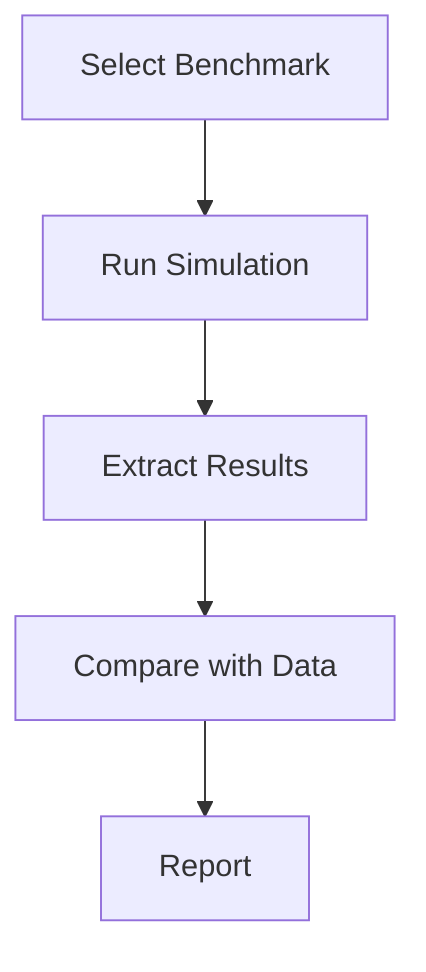

# Validation Benchmarks - Overview

ภาพรวม Validation Benchmarks

---

## Overview

> **Benchmarks** = Standard cases สำหรับ validate solvers

---

## 1. Why Benchmarks?

| Benefit | Description |
|---------|-------------|
| **Standard** | Documented, reproducible |
| **Comparable** | Others use same case |
| **Trusted** | Experimental data available |

---

## 2. Common Benchmarks

| Case | Physics | Source |
|------|---------|--------|
| Lid-driven cavity | Laminar | Ghia et al. |
| Backward step | Separation | Driver & Seegmiller |
| Turbulent channel | Wall flow | Kim et al. |
| Ahmed body | External aero | Ahmed et al. |

---

## 3. Validation Process

---

## 4. Module Contents

| File | Topic |
|------|-------|
| 01_Physical | Validation methods |
| 02_Mesh_BC | Verification checks |
| 03_Best_Practices | Guidelines |

---

## 5. Key Metrics

| Metric | Use |
|--------|-----|
| RMSE | Overall error |
| Max error | Worst point |
| R² | Correlation |
| Profile comparison | Visual check |

---

## Quick Reference

| Need | Action |
|------|--------|
| Standard case | Use benchmark |
| Compare | Extract profiles |
| Quantify | Compute metrics |
| Report | Document results |

---

## Concept Check

<b>1. ทำไมใช้ benchmarks?</b>

**Standard**, documented, comparable

<b>2. Profile comparison ทำอย่างไร?</b>

**Extract data**, plot vs experimental

<b>3. R² คืออะไร?</b>

**Coefficient of determination** — 1.0 = perfect

---

## Related Documents

- **Physical Validation:** [01_Physical_Validation.md](01_Physical_Validation.md)
- **Best Practices:** [03_Best_Practices.md](03_Best_Practices.md)