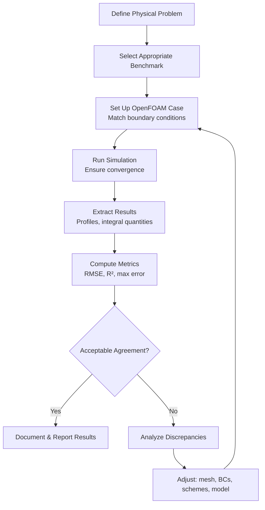

# Validation Benchmarks - Overview

ภาพรวม Validation Benchmarks

---

## Learning Objectives

After completing this section, you will be able to:

- **Define** what validation benchmarks are and why they are essential in CFD workflows
- **Distinguish** between validation (physical correctness) and verification (code correctness)
- **Select** appropriate benchmarks for different flow physics and applications
- **Apply** quantitative metrics to compare simulation results with experimental data
- **Design** a validation workflow for your own OpenFOAM simulations

---

## What Are Validation Benchmarks?

**Validation benchmarks** are well-documented, reproducible test cases with available experimental or high-fidelity numerical data. They serve as standard reference problems that the CFD community uses to assess the accuracy of solvers and turbulence models.

> **Key Insight:** Benchmarks provide a "ground truth" against which we can validate that our simulations capture the correct physical phenomena.

### Why Do We Need Benchmarks?

| Benefit | Why It Matters | Practical Impact |
|---------|----------------|------------------|
| **Standardized** | Documented setup, reproducible by anyone | Results can be compared across studies |
| **Validated** | Has experimental/high-fidelity data | Physical correctness can be measured |
| **Community-accepted** | Widely used in literature | Your work gains credibility |
| **Physics-focused** | Each benchmark targets specific phenomena | Select relevant test for your application |

### Validation vs. Verification: What's the Difference?

| Aspect | **Validation** | **Verification** |
|--------|----------------|------------------|
| **Question** | Are we solving the *right* equations? | Are we solving the equations *right*? |
| **Focus** | Physical correctness | Code correctness |
| **Comparison** | Simulation vs. Experiment | Simulation vs. Exact/Analytical Solution |
| **Tools** | Benchmarks, experimental data | Method of Manufactured Solutions, grid convergence |
| **Module** | Covered in this module | Covered in Module 02 |

> **Important:** Both validation and verification are essential components of a complete CFD quality assurance process. This module focuses on validation; verification is covered in `02_Mesh_BC.md`.

---

## How to Use Validation Benchmarks

### Step 1: Select an Appropriate Benchmark

Choose a benchmark that matches the physics of your application:

| Case | Physics Type | Source | Typical Use Case |
|------|--------------|--------|------------------|
| **Lid-driven cavity** | Incompressible laminar flow | Ghia et al. (1982) | Testing basic solver accuracy, transient behavior |
| **Backward-facing step** | Flow separation, reattachment | Driver & Seegmiller (1985) | Validating separation prediction, turbulence models |
| **Turbulent channel flow** | Wall-bounded turbulence | Kim et al. (1987) | Testing near-wall treatment, RANS/LES models |
| **Ahmed body** | External aerodynamics, 3D separation | Ahmed et al. (1984) | Automotive/external aerodynamics, wake modeling |
| **Flow past a cylinder** | Vortex shedding, bluff bodies | Norberg (1994) | Unsteady flows, vortex dynamics |
| **Turbulent jet** | Free shear flow | Hussein et al. (1994) | Free turbulence, mixing layers |

### Step 2: Understand Key Comparison Metrics

When comparing your simulation with benchmark data, use these metrics:

#### Quantitative Metrics

| Metric | Formula/Definition | When to Use | Interpretation |
|--------|-------------------|-------------|----------------|
| **RMSE** (Root Mean Square Error) | $\sqrt{\frac{1}{N}\sum(y_i - \hat{y}_i)^2}$ | Overall error assessment | Lower = better; gives average error magnitude |
| **Maximum Error** | $\max|y_i - \hat{y}_i|$ | Identify worst prediction | Critical for safety-critical applications |
| **R²** (Coefficient of Determination) | $1 - \frac{SS_{res}}{SS_{tot}}$ | Correlation quality | 1.0 = perfect match; 0 = no correlation |
| **Relative Error** | $|\frac{y - \hat{y}}{y}| \times 100\%$ | Local error magnitude | Expressed as percentage |

#### Qualitative Assessment

- **Profile comparison**: Plot simulation and experimental profiles at key locations
- **Flow visualization**: Compare streamline patterns, separation zones
- **Integral quantities**: Compare drag, lift, pressure drop (when available)

> **Best Practice:** Always use multiple metrics. A single metric can be misleading—for example, R² can be high even if local errors are large in critical regions.

### Step 3: Follow the Validation Workflow

> **Cross-Reference:** Detailed validation methodology is covered in `01_Physical_Validation.md`. Mesh and boundary condition verification is covered in `02_Mesh_BC.md`.

---

## Module Structure

This module is organized to guide you from fundamental concepts to practical application:

| File | Focus | Key Content |
|------|-------|-------------|
| **00_Overview.md** (this file) | What, why, and how of benchmarks | Benchmark selection, metrics, workflow |
| **01_Physical_Validation.md** | Detailed validation methodology | Profile extraction, statistical methods, visualization |
| **02_Mesh_BC.md** | Verification of numerical setup | Grid convergence studies, boundary condition verification |
| **03_Best_Practices.md** | Professional validation practices | Documentation standards, common pitfalls, reporting |

**Recommended Learning Path:**
1. Start here → Understand what benchmarks are and why they matter
2. Read `01_Physical_Validation.md` → Learn specific validation techniques
3. Review `02_Mesh_BC.md` → Ensure your numerical setup is correct before validation
4. Apply `03_Best_Practices.md` → Follow professional standards in your work

---

## Quick Reference

| Need | Action |
|------|--------|
| **Choose a benchmark** | Match physics: laminar vs. turbulent, internal vs. external flow |
| **Compare results** | Extract profiles at same locations as experimental data |
| **Quantify error** | Compute RMSE for overall error, max error for worst case |
| **Visual comparison** | Plot profiles overlay; streamlines for flow patterns |
| **Document findings** | Include setup, metrics, visualizations, interpretation |

---

## Concept Check

<b>1. Scenario: Your simulation of turbulent channel flow shows R² = 0.95 but maximum error of 40% near the wall. Is this validation acceptable? Explain your reasoning.</b>

**Not fully acceptable.** While R² = 0.95 indicates good overall correlation, a 40% error near the wall is critical because:
- The wall region is where turbulence production occurs
- Many engineering applications (drag, heat transfer) depend on near-wall accuracy
- You would need to investigate mesh resolution, wall functions, or turbulence model choice
- This illustrates why multiple metrics must be used together

<b>2. You're validating a new solver for external aerodynamics. Which benchmark would you choose and why?</b>

**Ahmed body** is the appropriate choice because:
- It features 3D separation and wake formation—key phenomena in external aerodynamics
- Extensive experimental data exists for multiple slant angles
- It's widely accepted in the automotive community
- Alternative: Flow past a cylinder if focusing on vortex shedding dynamics
- This demonstrates matching benchmark physics to your application

<b>3. Your boss asks: "Is our solver verified?" You respond with validation results from lid-driven cavity. Is this correct? Why or why not?</b>

**No, this is not correct.** You've responded with validation, not verification:
- Validation compares with experiments (physical correctness)
- Verification compares with analytical solutions or through grid convergence (code correctness)
- You should explain the difference and provide grid convergence studies or MMS results for verification
- Both are needed—your boss is asking a different question than what you answered

<b>4. Scenario: Two simulations of the same benchmark both show RMSE = 0.05. Simulation A has consistent error across the domain; Simulation B has very low error in most places but 30% error in one small region. Which is preferable? Why?</b>

**Simulation A is preferable.** Even though total RMSE is identical:
- Simulation B's localized high error could indicate a missed physical phenomenon
- That small region might be critical (e.g., separation point, shock location)
- Localized errors can grow and affect the overall solution in unsteady simulations
- Consistent moderate error is often more trustworthy than patchy excellent-poor performance
- This shows why RMSE alone is insufficient—always examine error distribution

<b>5. When should you use the backward-facing step benchmark instead of lid-driven cavity?</b>

**Backward-facing step** when:
- Your application involves flow separation and reattachment
- Testing turbulence models for separated flows
- Need to validate prediction of reattachment length
- Interested in shear layer development

**Lid-driven cavity** when:
- Testing basic incompressible solver functionality
- Validating transient behavior and vortex formation
- Benchmark is simpler, faster to run
- No separation physics in your application

---

## Key Takeaways

- **Benchmarks are essential standards** that provide experimental data for validating physical correctness of CFD simulations
- **Validation ≠ Verification**: Validation compares with experiments (physics); verification compares with exact solutions (code)
- **Choose benchmarks that match your physics**: laminar vs. turbulent, internal vs. external, steady vs. unsteady
- **Use multiple metrics**: RMSE for overall error, maximum error for worst case, R² for correlation, plus visual comparisons
- **Follow the complete workflow**: select benchmark → run simulation → extract results → compute metrics → document thoroughly
- **Validation is iterative**: poor agreement requires systematic investigation of mesh, BCs, numerical schemes, and turbulence models
- **Documentation matters**: A validation is only useful if it's reproducible and clearly communicated

---

## Related Documents

- **Physical Validation Methods:** [01_Physical_Validation.md](01_Physical_Validation.md) — Detailed validation techniques, profile extraction, statistical analysis
- **Mesh & BC Verification:** [02_Mesh_BC.md](02_Mesh_BC.md) — Grid convergence, boundary condition verification
- **Best Practices:** [03_Best_Practices.md](03_Best_Practices.md) — Documentation standards, common pitfalls, professional workflow
- **Module 02 (Verification):** [../../MODULE_02_VERIFICATION_FUNDAMENTALS/](../../MODULE_02_VERIFICATION_FUNDAMENTALS/) — MMS, Richardson extrapolation, OpenFOAM architecture