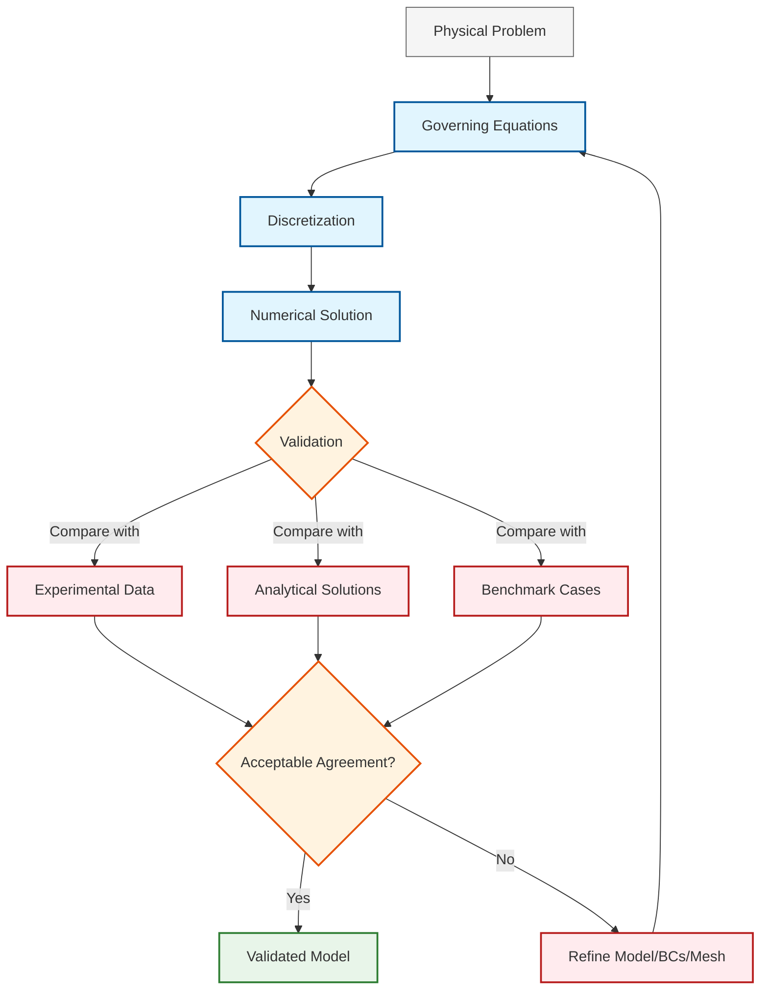
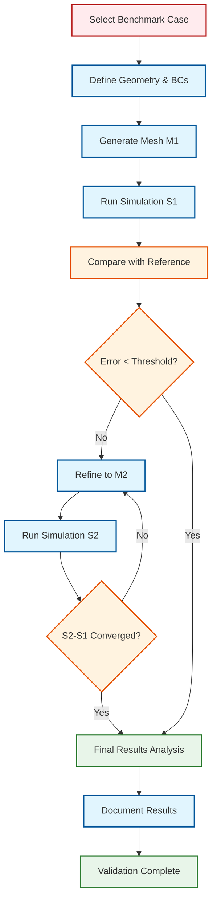

# 03 Validation Benchmarks (การตรวจสอบความถูกต้องด้วยเกณฑ์มาตรฐาน)

> [!INFO] Module Focus
> การนำระเบียบวิธีการตรวจสอบความถูกต้องมาใช้กับปัญหาจริง การเปรียบเทียบผลลัพธ์กับข้อมูลอ้างอิง และแนวทางปฏิบัติเพื่อให้ได้ผลลัพธ์ที่เชื่อถือได้

## 🎯 วัตถุประสงค์การเรียนรู้ (Learning Objectives)
- เรียนรู้การเปรียบเทียบผลลัพธ์กับ **Experimental Data** และ **Analytical Solutions**
- เชี่ยวชาญการตรวจสอบความอ่อนไหวของ **Mesh** และความถูกต้องของ **Boundary Conditions**
- นำ **Best Practices** (Reproducibility, Isolation) มาใช้ในการออกแบบกรณีศึกษา
- จัดการกับความไม่แน่นอน (Uncertainty) ทั้งจากการทดลองและการจำลองเชิงตัวเลข

---

## 🌟 ภาพรวมแนวคิด (Conceptual Overview)

การตรวจสอบความถูกต้องด้วยเกณฑ์มาตรฐาน (Validation Benchmarks) คือกระบวนการที่สำคัญที่สุดในการสร้างความเชื่อมั่นในแบบจำลอง CFD โดยเฉพาะเมื่อต้องนำผลลัพธ์ไปใช้ในการตัดสินใจทางวิศวกรรมที่มีความเสี่ยงสูง

> [!TIP] เปรียบเทียบ: ตาชั่งมาตรฐาน (Standard Weight Analogy)
> - **Benchmark Case**: เปรียบเหมือน "ตุ้มน้ำหนักมาตรฐาน" (Standard Weight) ที่ผ่านการรับรองจากสถาบันมาตรวิทยา
> - **CFD Solver**: เปรียบเหมือน "ตาชั่งดิจิตอล" ที่เราสร้างขึ้น
> - **Validation Process**: คือการเอาตุ้มน้ำหนัก 1kg ไปชั่งบนตาชั่ง ถ้าตาชั่งอ่านได้ 1.000kg แสดงว่า "ผ่านการสอบเทียบ" (Validated) แต่ถ้าอ่านได้ 0.95kg เราต้องไปจูนตาชั่งใหม่ (Refine Model)

---



### ความแตกต่างระหว่าง Verification และ Validation

| แง่มุม | **Verification** (การตรวจสอบ) | **Validation** (การยืนยันความถูกต้อง) |
|:---|:---|:---|
| **คำถาม** | "เราแก้สมการถูกต้องหรือไม่?" | "เราแก้สมการที่ถูกต้องหรือไม่?" |
| **เป้าหมาย** | ตรวจสอบความถูกต้องเชิงตัวเลข | ตรวจสอบความสอดคล้องกับความเป็นจริง |
| **วิธีการ** | Code Verification, Mesh Convergence | เปรียบเทียบกับข้อมูลการทดลอง/ทางทฤษฎี |
| **ผลลัพธ์** | ความผิดพลาดเชิงตัวเลข (Numerical Error) | ความผิดพลาดเชิงฟิสิกส์ (Modeling Error) |

---

## 📊 รากฐานทางทฤษฎี (Theoretical Foundation)

### สมการขับเคลื่อน (Governing Equations)

สำหรับการไหลของไหลที่ไม่สามารถอัดได้ (Incompressible Flow), สมการที่ต้องแก้ไขใน OpenFOAM คือ:

**สมการต่อเนื่อง (Continuity Equation):**
$$\nabla \cdot \mathbf{U} = 0$$

**สมการโมเมนตัม (Momentum Equation):**
$$\frac{\partial \mathbf{U}}{\partial t} + \nabla \cdot (\phi \mathbf{U}) - \nabla \cdot (\nu \nabla \mathbf{U}) = -\frac{1}{\rho} \nabla p + \mathbf{g}$$

โดยที่:
- $\mathbf{U}$ = ความเร็วของไหล [m/s]
- $p$ = ความดัน [Pa]
- $\phi$ = อัตราการไหลผ่านผิว (Flux) [m³/s]
- $\nu$ = ความหนืดของไหล (Kinematic Viscosity) [m²/s]
- $\rho$ = ความหนาแน่น [kg/m³]
- $\mathbf{g}$ = ความเร่งเนื่องจากแรงโน้มถ่วง [m/s²]

### การวิเคราะห์ความผิดพลาด (Error Analysis)

ในการตรวจสอบความถูกต้อง เราต้องเข้าใจแหล่งที่มาของความผิดพลาด:

$$\epsilon_{total} = \epsilon_{modeling} + \epsilon_{discretization} + \epsilon_{iteration} + \epsilon_{round-off}$$

1. **$\epsilon_{modeling}$**: ความผิดพลาดจากการทำแบบจำลอง (เช่น การใช้ RANS แทน LES)
2. **$\epsilon_{discretization}$**: ความผิดพลาดจากการ discretize (เช่น ขนาดเมช)
3. **$\epsilon_{iteration}$**: ความผิดพลาดจากการไม่ลู่เข้า (Convergence tolerance)
4. **$\epsilon_{round-off}$**: ความผิดพลาดจากเครื่องจักร (Machine precision)

### การศึกษาความเป็นอิสระของเมช (Mesh Independence Study)

หลักการสำคัญในการ validation คือการตรวจสอบว่าผลลัพธ์ไม่ขึ้นกับขนาดเมช:

$$\phi_h = \phi_{exact} + C h^p + O(h^{p+1})$$

โดยที่:
- $\phi_h$ = ค่าตัวแปรที่สนใจจากเมชขนาด $h$
- $\phi_{exact}$ = ค่าที่แม่นยำ (Extrapolated)
- $h$ = ขนาดเซลล์เมช
- $p$ = อันดับของความแม่นยำ (Order of accuracy)
- $C$ = ค่าคงที่

การใช้ **Richardson Extrapolation** เพื่อประมาณค่า $\phi_{exact}$:

$$\phi_{exact} \approx \phi_{h} + \frac{\phi_{h} - \phi_{2h}}{2^p - 1}$$

---

## 🔧 การนำไปประยุกต์ใช้ใน OpenFOAM (OpenFOAM Implementation)

### การตั้งค่าเพื่อการตรวจสอบความถูกต้อง (Validation Setup)

ไฟล์ `controlDict` สำหรับการบันทึกข้อมูลเพื่อ validation:

```cpp
// OpenFOAM configuration file for validation simulation
// Specifies solver, time control, and function objects for data collection

application     simpleFoam;              // Steady-state incompressible solver

startFrom       startTime;               // Begin simulation from specified start time
startTime       0;                       // Initial time value

stopAt          endTime;                 // Stop when reaching end time
endTime         1000;                    // Final time value

deltaT          1;                       // Time step size

writeControl    timeStep;                // Control output by time steps
writeInterval   100;                     // Write results every 100 steps

functions
{
    // Probes for comparing with experimental data
    // Measures flow variables at specific spatial locations
    probes
    {
        type            probes;              // Sampling function object type
        functionObjectLibs ("libsampling.so");  // Library containing sampling functions
        writeControl    timeStep;            // Output control
        writeInterval   1;                   // Write every time step
        probeLocations                      // Coordinates of probe locations
        (
            (0.05 0.05 0)                   // Measurement point 1
            (0.10 0.05 0)                   // Measurement point 2
            (0.15 0.05 0)                   // Measurement point 3
        );
        fields                             // Variables to sample
        (
            p                              // Pressure field
            U                              // Velocity field
        );
    }

    // Force calculation for validation against experimental measurements
    // Computes aerodynamic forces on specified surfaces
    forces
    {
        type            forces;             // Force calculation function object
        functionObjectLibs ("libsforces.so");  // Library containing force functions
        writeControl    timeStep;           // Output control
        writeInterval   1;                  // Write every time step
        patches         ("cylinder");       // Surface patch to compute forces on
        rho             rhoInf;             // Density type (constant)
        log             true;               // Enable logging
        rhoInf          1.225;              // Reference air density [kg/m³]
        CofR            (0 0 0);            // Center of rotation for moment calculations
        pitchAxis       (0 1 0);            // Pitch axis direction
    }
}
```

**คำอธิบาย:**

- **ที่มา (Source):** การตั้งค่า controlDict สำหรับการตรวจสอบความถูกต้องใช้ function objects สำหรับบันทึกข้อมูล

- **คำอธิบาย (Explanation):** 
  - `probes` ใช้สำหรับวัดค่าตัวแปรที่ตำแหน่งเฉพาะเพื่อเปรียบเทียบกับข้อมูลการทดลอง
  - `forces` คำนวณแรงและโมเมนต์บนพื้นผิวที่ระบุ
  - ข้อมูลที่บันทึกถูกเก็บในไดเรกทอรี `postProcessing/`

- **แนวคิดสำคัญ (Key Concepts):**
  - Function Objects ช่วยให้สามารถบันทึกข้อมูลเพิ่มเติมโดยไม่ต้องแก้ไข solver
  - Probe locations ต้องสอดคล้องกับตำแหน่งวัดในการทดลอง
  - Force calculations จำเป็นสำหรับ validation ของปัญหา aerodynamics

### การตั้งค่า Numerical Schemes ที่เหมาะสมสำหรับ Validation

ไฟล์ `fvSchemes`:

```cpp
// OpenFOAM finite volume discretization schemes
// Defines numerical methods for spatial and temporal derivatives

ddtSchemes
{
    default         steadyState;            // Steady-state simulation (no time derivative)
}

gradSchemes
{
    default         Gauss linear;           // Standard linear gradient reconstruction
    grad(p)         Gauss linear;           // Pressure gradient scheme
    grad(U)         Gauss linear;           // Velocity gradient scheme
}

divSchemes
{
    default         none;                   // Require explicit scheme specification
    div(phi,U)      Gauss linearUpwind grad(U);  // Upwind for stability
    div(phi,k)      Gauss upwind;           // Upwind for turbulent kinetic energy
    div(phi,epsilon) Gauss upwind;          // Upwind for dissipation rate
    div((nuEff*dev2(T(grad(U))))) Gauss linear;  // Linear for diffusion term
}

laplacianSchemes
{
    default         Gauss linear corrected; // Corrected for non-orthogonal meshes
}

interpolationSchemes
{
    default         linear;                 // Linear interpolation to cell faces
}

snGradSchemes
{
    default         corrected;              // Corrected surface normal gradient
}
```

**คำอธิบาย:**

- **ที่มา (Source):** `.applications/test/fieldMapping/pipe1D/system/fvSchemes`

- **คำอธิบาย (Explanation):**
  - `Gauss linear` ใช้ Gaussian theorem กับ interpolation เชิงเส้น
  - `linearUpwind` ผสมผสานความเสถียรของ upwind กับความแม่นยำของ central differencing
  - `corrected` ปรับปรุงความแม่นยำสำหรับ mesh ที่ไม่ orthogonal

- **แนวคิดสำคัญ (Key Concepts):**
  - Upwind schemes ให้ความเสถียรสูงแต่มี numerical diffusion
  - Linear schemes ให้ความแม่นยำสูงกว่าแต่อาจไม่เสถียรบน coarse mesh
  - การเลือก scheme ต้องสมดุลระหว่างความแม่นยำและความเสถียร

### การตั้งค่า Convergence Criteria ที่เหมาะสม

ไฟล์ `fvSolution`:

```cpp
// OpenFOAM linear solver settings and convergence criteria
// Controls how equations are solved and when solution is considered converged

solvers
{
    p                                   // Pressure equation solver
    {
        solver          GAMG;            // Geometric-Algebraic Multi-Grid solver
        tolerance       1e-06;           // Absolute convergence tolerance (high accuracy)
        relTol          0.01;            // Relative tolerance (1% of initial residual)
        smoother        GaussSeidel;     // Smoother for multi-grid cycles
    }

    "(U|k|epsilon)"                      // Turbulence and velocity solvers
    {
        solver          smoothSolver;    // Iterative solver with smoothing
        smoother        GaussSeidel;     // Gauss-Seidel smoothing method
        tolerance       1e-05;           // Absolute convergence tolerance
        relTol          0.1;             // Relative tolerance (10%)
    }
}

SIMPLE                                   // SIMPLE algorithm settings
{
    nNonOrthogonalCorrectors 0;          // Non-orthogonal correction iterations
    consistent      yes;                 // Use consistent SIMPLE algorithm

    residualControl                      // Convergence criteria for outer iterations
    {
        p               1e-05;           // Pressure residual threshold
        U               1e-05;           // Velocity residual threshold
        "(k|epsilon)"   1e-04;           // Turbulence residual threshold
    }
}
```

**คำอธิบาย:**

- **ที่มา (Source):** การตั้งค่า fvSolution สำหรับ steady-state solver

- **คำอธิบาย (Explanation):**
  - `GAMG` (Geometric-Algebraic Multi-Grid) เหมาะสำหรับปัญหาขนาดใหญ่
  - `tolerance` คือค่า residual ที่ต่ำที่สุดที่ยอมรับได้
  - `relTol` คือสัดส่วนการลดลงของ residual ต่อรอบการทำซ้ำ
  - `residualControl` ใช้ตรวจสอบการลู่เข้าของการแก้สมการโดยรวม

- **แนวคิดสำคัญ (Key Concepts):**
  - Tolerances ที่เข้มงวด (1e-06) จำเป็นสำหรับ validation เพื่อลด numerical error
  - GAMG solver มีประสิทธิภาพสูงสำหรับ large-scale problems
  - Residual control ช่วยให้มั่นใจว่าการแก้สมการลู่เข้าอย่างสมบูรณ์

---

## 📏 การวัดและประเมินผล (Metrics and Assessment)

### ตัวชี้วัดความคลาดเคลื่อน (Error Metrics)

**1. L2 Norm Error (Root Mean Square Error):**
$$E_{L2} = \sqrt{\frac{1}{N} \sum_{i=1}^{N} (u_{CFD,i} - u_{ref,i})^2}$$

**2. Maximum Absolute Error:**
$$E_{max} = \max_{i} |u_{CFD,i} - u_{ref,i}|$$

**3. Relative Error:**
$$E_{rel} = \frac{||u_{CFD} - u_{ref}||}{||u_{ref}||} \times 100\%$$

**4. Correlation Coefficient:**
$$R = \frac{\sum_{i}(u_{CFD,i} - \bar{u}_{CFD})(u_{ref,i} - \bar{u}_{ref})}{\sqrt{\sum_{i}(u_{CFD,i} - \bar{u}_{CFD})^2 \sum_{i}(u_{ref,i} - \bar{u}_{ref})^2}}$$

### เกณฑ์การยอมรับ (Acceptance Criteria)

| ประเภทการทดสอบ | เกณฑ์ความผิดพลาดที่ยอมรับได้ |
|:---|:---|
| **Analytical Validation** | < 1% สำหรับ flow แบบ Laminar |
| **Experimental Validation** | 5-10% ขึ้นกับความไม่แน่นอนของข้อมูล |
| **Benchmark Cases** | ตามที่ระบุใน literature |

---

## 🎓 กรณีศึกษามาตรฐาน (Standard Benchmark Cases)

### 1. Lid-Driven Cavity (กรณีศึกษาฝาครอบไหล)

- **ความเร็ว**: $Re = \frac{U_{lid} L}{\nu} = 100, 400, 1000$
- **ขนาดโดเมน**: $L \times L = 1 \times 1$ m
- **เงื่อนไขขอบเขต**:
  - ผนังบน: $U = (1, 0, 0)$ m/s
  - ผนังอื่นๆ: $U = (0, 0, 0)$ m/s (No-slip)
- **ข้อมูลอ้างอิง**: Ghia et al. (1982)

### 2. Flow Over a Cylinder (การไหลผ่านทรงกระบอก)

- **ค่า Reynolds**: $Re = \frac{U_\infty D}{\nu} = 10 \sim 200$ (Laminar vortex shedding)
- **ขนาด**: เส้นผ่านศูนย์กลาง $D = 1$ m
- **เงื่อนไขขอบเขต**:
  - ทางเข้า: $U = (U_\infty, 0, 0)$
  - ทางออก: $\nabla p \cdot \mathbf{n} = 0$ (Zero gradient)
  - Cylinder: No-slip wall
- **ข้อมูลอ้างอิง**: ค่า Strouhal number $St = \frac{f D}{U_\infty} \approx 0.2$

### 3. Backward-Facing Step (ขั้นไหลถอยหลัง)

- **ค่า Reynolds**: $Re_h = \frac{U_b h}{\nu}$ (โดย $h$ คือความสูงขั้น)
- **จุดสนใจ**: ความยาวของการ reattachment $L_r$
- **ข้อมูลอ้างอิง**: Driver & Seegmiller (1985)

---

## 🔍 เวิร์กโฟลว์การตรวจสอบความถูกต้อง (Validation Workflow)



### ขั้นตอนการทดสอบ (Testing Procedure)

1. **Pre-processing**:
   - เลือกกรณีศึกษาที่มีข้อมูลอ้างอิงครบถ้วน
   - สร้างเมชเริ่มต้น (Coarse mesh)
   - ตั้งค่า Boundary Conditions ตามมาตรฐาน

2. **Solving**:
   - รัน simulation จนถึง convergence
   - บันทึกข้อมูลที่จุดสนใจ (Probes/Forces)

3. **Post-processing**:
   - คำนวณ Error metrics
   - สร้างกราฟเปรียบเทียบ
   - วิเคราะห์ความแตกต่าง

4. **Refinement**:
   - เพิ่มความละเอียดเมช
   - ทำซ้ำจนกว่าผลลัพธ์จะเป็นอิสระจากเมช

---

## 📝 การบันทึกและรายงานผล (Documentation and Reporting)

### รูปแบบรายงานการตรวจสอบความถูกต้อง (Validation Report Structure)

```markdown
# Validation Report: [Case Name]

## 1. ข้อมูลทั่วไป
- ชื่อกรณีศึกษา:
- Solver: [เช่น simpleFoam, pimpleFoam]
- เวอร์ชัน OpenFOAM:

## 2. เงื่อนไขการจำลอง
- Reynolds Number: Re = ...
- ขนาดโดเมน: ...
- Boundary Conditions: ...

## 3. ข้อมูลเมช
- Mesh Type: [เช่น structured, unstructured]
- Cell Count: [รายละเอียดแต่ละระดับ]
- Quality Metrics: ...

## 4. ผลลัพธ์และการเปรียบเทียบ
## 4. ผลลัพธ์และการเปรียบเทียบ
> ![Validation Comparison Graph: Numerical vs Experimental]
> 
> | Variable | Analytical/Exp | Numerical | Error (%) |
> | :--- | :--- | :--- | :--- |
> | $u_{max}$ (m/s) | 1.000 | 0.992 | 0.8% |
> | $p_{drop}$ (Pa) | 120.5 | 118.9 | 1.3% |
> 
> *หมายเหตุ: กราฟแสดงการกระจายตัวของความเร็วเปรียบเทียบกับคำตอบเชิงวิเคราะห์*

## 5. วิเคราะห์ความผิดพลาด
- L2 Error: ...
- Max Error: ...
- Correlation: ...

## 6. สรุป
- แบบจำลองผ่าน/ไม่ผ่านเกณฑ์: ...
- ข้อเสนอแนะ: ...
```

---

## 🎯 แนวทางปฏิบัติที่ดีที่สุด (Best Practices Summary)

1. **เริ่มต้นจากกรณีง่าย**: ใช้ปัญหาที่มี analytical solution ก่อน
2. **ทำ Mesh Independence Study**: อย่าพึ่งพาผลลัพธ์จากเมชเดียว
3. **เปรียบเทียบกับข้อมูลหลายแหล่ง**: อย่าพึ่งพาข้อมูลการทดลองชุดเดียว
4. **บันทึกทุกขั้นตอน**: ทำให้สามารถ reproduce ได้
5. **ตรวจสอบความสอดคล้องทางฟิสิกส์**: ไม่ใช่แค่ตัวเลข แต่ต้องดูพฤติกรรมการไหลด้วย

---

## 📚 หัวข้อทางเทคนิค (Technical Topics)

### 01 [[01_Physical_Validation|วิธีการตรวจสอบทางกายภาพ]]
การใช้ Benchmark Cases (เช่น Lid-Driven Cavity) และการเปรียบเทียบกับข้อมูลจากการทดลอง

### 02 [[02_Mesh_BC_Verification|การตรวจสอบเมชและเงื่อนไขขอบเขต]]
เทคนิคการตรวจสอบคุณภาพเมชและความสอดคล้องทางคณิตศาสตร์ของ Boundary Conditions

### 03 [[03_Best_Practices|แนวทางปฏิบัติที่ดีที่สุด (Best Practices)]]
มาตรฐานการออกแบบการทดสอบ CFD เพื่อความแม่นยำและความสามารถในการทำซ้ำ (Reproducibility)

---

## 🔗 References ที่เป็นประโยชน์

- Ghia, U., Ghia, K. N., & Shin, C. T. (1982). "High-Re solutions for incompressible flow using the Navier-Stokes equations and a multigrid method." *Journal of Computational Physics*
- Roache, P. J. (1998). *Verification and Validation in Computational Science and Engineering*. Hermosa Publishers.
- Oberkampf, W. L., & Trucano, T. G. (2002). "Verification and validation in computational fluid dynamics." *Progress in Aerospace Sciences*
- OpenFOAM User Guide: Section on Validation and Verification

---

> **Validation ไม่ใช่เรื่องของการทำให้ผลลัพธ์ตรงกับข้อมูลการทดลอง แต่เป็นการทำความเข้าใจว่าทำไมจึงต่าง และความต่างนั้นอยู่ในเกณฑ์ที่ยอมรับได้หรือไม่**

---

## 🧠 ตรวจสอบความเข้าใจ (Concept Check)

1. **ถาม:** ทำไมเราถึงต้องตรวจสอบ "Mesh Independence" ในการทำ Validation Benchmark?
   <details>
   <summary>เฉลย</summary>
   <b>ตอบ:</b> เพื่อให้แน่ใจว่าผลลัพธ์ที่ได้มาจาก Physics ของปัญหาจริงๆ ไม่ใช่เกิดจากความหยาบของ Mesh (Discretization Error) หากเปลี่ยนขนาด Mesh แล้วผลลัพธ์เปลี่ยนไปอย่างมีนัยสำคัญ แสดงว่าผลลัพธ์นั้นยังเชื่อถือไม่ได้และยังไม่สามารถนำไปเทียบกับ Benchmark ได้อย่างยุติธรรม
   </details>

2. **ถาม:** ในสมการ Error Analysis: $\epsilon_{total} = \epsilon_{modeling} + \epsilon_{discretization} + ...$ ส่วนของ $\epsilon_{modeling}$ เกิดจากอะไร?
   <details>
   <summary>เฉลย</summary>
   <b>ตอบ:</b> เกิดจากการสมมติฐานในการสร้างแบบจำลองทางคณิตศาสตร์ที่ไม่ตรงกับความจริง 100% เช่น การใช้ RANS Turbulence Model (ซึ่งเฉลี่ยค่าความปั่นป่วน) แทนที่จะแก้สมการ Navier-Stokes โดยตรง (DNS) หรือการสมมติให้ของไหลเป็น Incompressible ทั้งที่มีผลของ Compressibility เล็กน้อย
   </details>

3. **ถาม:** "Correlational Coefficient ($R$)" แตกต่างจาก "Max Error ($E_{max}$)" ในการประเมินผลอย่างไร?
   <details>
   <summary>เฉลย</summary>
   <b>ตอบ:</b> $E_{max}$ บอกความผิดพลาด "สูงสุดที่จุดเดียว" (Worst-case) ส่วน $R$ บอกถึง "แนวโน้มหรือรูปร่าง" ของกราฟว่าไปในทิศทางเดียวกันหรือไม่ (Trend matching) แม้ค่าสัมบูรณ์อาจจะต่างกัน แต่ถ้ารูปร่างกราฟเหมือนกัน ค่า $R$ จะสูง
   </details>