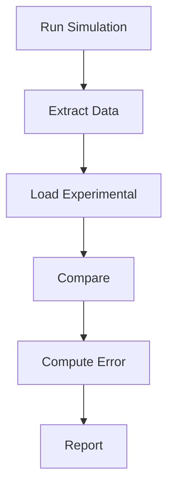

# Physical Validation

การ Validate กับข้อมูลทางฟิสิกส์

---

## Overview

> **Validation** = Compare simulation กับ physical data

---

## 1. Validation Sources

| Source | Example |
|--------|---------|
| **Experiment** | Wind tunnel data |
| **Analytical** | Exact solutions |
| **Benchmark** | NASA cases |
| **Literature** | Published results |

---

## 2. Standard Benchmarks

| Case | Physics |
|------|---------|
| Lid-driven cavity | Laminar flow |
| Backward-facing step | Separation |
| Turbulent pipe | Wall-bounded |
| Ahmed body | External aero |

---

## 3. Comparison Workflow



---

## 4. Data Extraction

```cpp
// Sample profiles
functions
{
    sample
    {
        type    sets;
        fields  (U p);
        sets
        (
            centerline
            {
                type    uniform;
                axis    y;
                start   (0.5 0 0);
                end     (0.5 1 0);
                nPoints 50;
            }
        );
    }
}
```

---

## 5. Comparison Script

```python
import numpy as np
import matplotlib.pyplot as plt

# Load data
sim = np.loadtxt('postProcessing/sample/0/centerline_U.xy')
exp = np.loadtxt('experimental/profile.csv', delimiter=',')

# Plot
plt.figure()
plt.plot(sim[:,0], sim[:,1], label='CFD')
plt.plot(exp[:,0], exp[:,1], 'o', label='Experiment')
plt.legend()
plt.savefig('validation.png')

# Error
error = np.sqrt(np.mean((sim[:,1] - exp[:,1])**2))
print(f'RMSE: {error:.4f}')
```

---

## 6. Acceptance Criteria

| Quantity | Threshold |
|----------|-----------|
| Velocity | < 5% |
| Pressure | < 10% |
| Cf (friction) | < 10% |
| Nu (heat) | < 15% |

---

## Quick Reference

| Step | Action |
|------|--------|
| 1 | Run simulation |
| 2 | Extract profiles |
| 3 | Load experimental |
| 4 | Compare |
| 5 | Report error |

---

## Concept Check

<details>
<summary><b>1. Validation vs Verification?</b></summary>

- **Validation**: Matches physics?
- **Verification**: Code correct?
</details>

<details>
<summary><b>2. Benchmark cases ดีอย่างไร?</b></summary>

**Standard, documented** — others can compare
</details>

<details>
<summary><b>3. RMSE คืออะไร?</b></summary>

**Root Mean Square Error** — วัด overall difference
</details>

---

## Related Documents

- **ภาพรวม:** [00_Overview.md](00_Overview.md)
- **Mesh Verification:** [02_Mesh_BC_Verification.md](02_Mesh_BC_Verification.md)