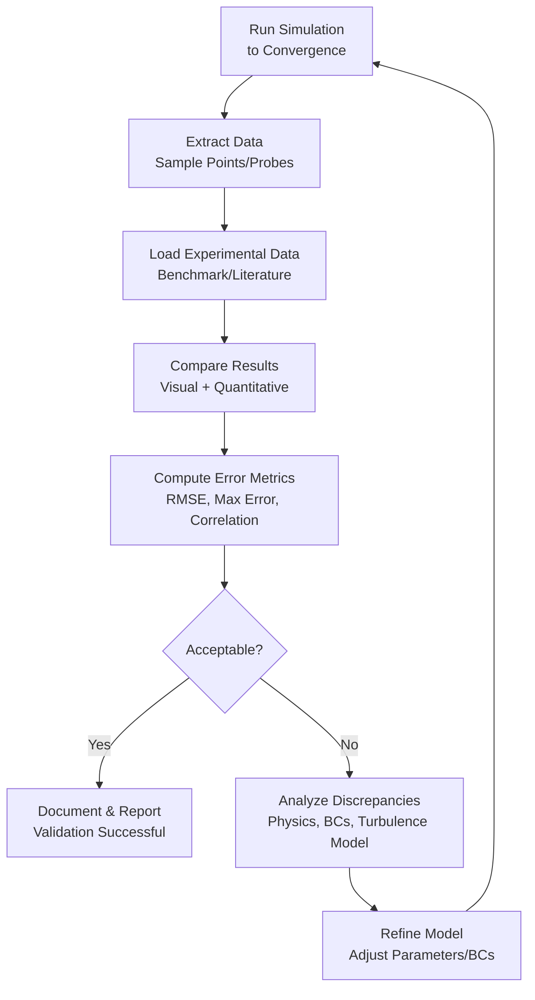

# Physical Validation

---

## Learning Objectives

After completing this section, you will be able to:

- **Distinguish** between validation (physical correctness) and verification (code correctness)
- **Identify** appropriate validation data sources for different flow problems
- **Apply** the systematic validation workflow from simulation to error reporting
- **Extract** simulation data using OpenFOAM sampling functions
- **Compare** CFD results with experimental data using Python analysis scripts
- **Evaluate** simulation accuracy against standard acceptance criteria
- **Troubleshoot** common validation failures and discrepancies

---

## 1. What is Physical Validation?

> **Validation** answers: *Are we solving the right equations?*
> 
> **Verification** answers: *Are we solving the equations right?*

| Aspect | **Validation** | **Verification** |
|--------|---------------|------------------|
| **Purpose** | Physical correctness | Code correctness |
| **Comparison** | Simulation vs Reality | Simulation vs Exact Solution |
| **Focus** | Model accuracy | Numerical accuracy |
| **Outcome** | Model credibility | Code reliability |
| **Example** | CFD vs Wind Tunnel | CFD vs Manufactured Solution |

**Why Validate?**

- **Establish credibility** — stakeholders trust validated results
- **Quantify uncertainty** — understand prediction limits
- **Identify model deficiencies** — turbulence models, boundary conditions
- **Regulatory requirements** — certification often demands validation
- **Optimization confidence** — trust design decisions

**How Validation Works:**

1. **Select reference data** (experiment, literature, benchmark)
2. **Run simulation** with matched conditions
3. **Extract comparable data** from both sources
4. **Quantify differences** using error metrics
5. **Assess acceptability** against criteria
6. **Document findings** for reproducibility

---

## 2. Validation Data Sources

### 2.1 Primary Sources

| Source | **What It Provides** | **When to Use** | **Limitations** |
|--------|---------------------|-----------------|-----------------|
| **Wind Tunnel Tests** | High-quality velocity/pressure fields | External aerodynamics, detailed validation | Expensive, limited geometry, wall effects |
| **PIV/LDV Measurements** | Full-field velocity data | Complex flow regions, separation zones | Optical access required, sparse data |
| **Analytical Solutions** | Exact mathematical solutions | Simple geometries, code verification | Limited to simple physics |
| **Benchmark Databases** | Standardized reference cases | Method validation, comparison | May not match your application |

### 2.2 Standard Benchmark Cases

| **Case** | **Physics** | **Validation Target** | **Key Metrics** |
|----------|-------------|----------------------|-----------------|
| **Lid-Driven Cavity** | Laminar recirculation | Steady vortex structure, corner behavior | Velocity profiles, vortex center location |
| **Backward-Facing Step** | Flow separation, reattachment | Separation length, recirculation zone | Reattachment point, pressure recovery |
| **Turbulent Pipe Flow** | Wall-bounded turbulence | Law of the wall, Reynolds stress | Velocity profile, friction factor |
| **Ahmed Body** | External aerodynamics | Wake structure, drag coefficient | Cd, wake velocity deficit |
| **NACA Airfoils** | Lift/drag prediction | Pressure distribution, separation | Cl, Cd, pressure coefficients |
| **Turbulent Channel** | Wall turbulence modeling | Near-wall resolution, turbulence statistics | u+, y+, Reynolds stresses |

### 2.3 Literature Sources

- **ERCOFTAC Classic Collection** — Well-documented test cases
- **NASA Turbulence Modeling Resource** — Standardized turbulence cases
- **AIAA Journal** — Peer-reviewed validation studies
- **Journal of Fluid Mechanics** — High-quality experimental data
- **Conference proceedings** (AIAA, ERCOFTAC) — Recent benchmarks

**Selection Criteria:**

1. **Relevance** — Similar physics to your application
2. **Documentation** — Complete geometry, BCs, conditions
3. **Quality** — Estimated experimental uncertainty
4. **Accessibility** — Data available in usable format

---

## 3. Validation Workflow

The validation workflow provides a systematic path from simulation to quantitative validation.



<!-- IMAGE: IMG_08_004 -->
<!-- 
Purpose: เพื่อแสดงกระบวนการ Validation อย่างเป็นระบบ. ไม่ใช่แค่วัดตาเปล่า แต่ต้องวัด Error. ภาพนี้ต้องโชว์การนำข้อมูลจาก 2 แหล่ง (Simulation vs Experiment) มาซ้อนทับกัน (Overlay) และคำนวณ Metric ความผิดพลาด
Prompt: "Standard CFD Validation Workflow Diagram. **Parallel Inputs:** 1. **Simulation Data:** Line Probes/Contours from OpenFOAM. 2. **Experimental Data:** PIV Laser Data/Wind Tunnel Sensors (with Error Bars). **Convergence Point:** A 'Comparison Plot' showing Simulation Line overlapping with Experimental Dots. **Metric Calculation:** An equation box showing `Error % = |Sim - Exp| / Exp`. **Outcome:** Pass/Fail Stamp. STYLE: Scientific methodology chart, clean data plots, logical arrows."
-->


### 3.1 Workflow Steps

**Step 1: Define Validation Requirements**
- Identify quantities to validate (velocity, pressure, forces)
- Specify acceptance criteria (tolerance levels)
- Document experimental uncertainty

**Step 2: Match Conditions**
- Reynolds number (within ±5%)
- Boundary conditions (inlet profiles, wall treatment)
- Geometry (exact dimensions, roughness)

**Step 3: Run Simulation**
- Ensure solution convergence
- Monitor residuals and integral quantities
- Save time-averaged statistics for turbulent flows

**Step 4: Extract Comparable Data**
- Sample at experimental locations
- Use same coordinate system
- Match data format (point locations, fields)

**Step 5: Compare and Analyze**
- Visual comparison (profiles, contours)
- Quantitative error metrics
- Statistical analysis

**Step 6: Report Findings**
- Document methodology
- Present error analysis
- State acceptance/rejection with justification

---

## 4. Data Extraction from OpenFOAM

### 4.1 Sampling Functions

The sampling functions in OpenFOAM allow you to extract data along lines, surfaces, or points for comparison with experimental data.

**What this code does:**
This configuration defines a post-processing function that samples velocity (`U`) and pressure (`p`) fields along a vertical line through the domain center. It creates uniformly distributed sample points and writes the results to files.

```cpp
// system/postProcessing/sample/sampleDict
functions
{
    sample
    {
        type            sets;
        functionObjectLibs ("libsampling.so");
        outputControl   timeStep;
        outputInterval  100;
        
        fields          (U p);
        sets
        (
            centerline
            {
                type    uniform;
                axis    y;                      // Sample along Y direction
                start   (0.5 0 0);              // Line start point
                end     (0.5 1 0);              // Line end point
                nPoints 50;                     // Number of sample points
            }
        );
    }
}
```

**Alternative Sampling Types:**

```cpp
// Surface sampling (2D slice)
surfaceSample
{
    type        surfaces;
    surfaces
    (
        midPlane
        {
            type        plane;
            plane       (0 0 1)(0 0 0.5);      // Z-normal plane at Z=0.5
        }
    );
}

// Point probes (specific locations)
probes
{
    type        probes;
    probeLocations
    (
        (0.1 0.1 0)
        (0.2 0.1 0)
        (0.3 0.1 0)
    );
}

// Cloud of points (import from file)
cloud
{
    type        cloud;
    points      ((0.1 0.1 0)(0.2 0.2 0));
}
```

### 4.2 Running the Sampler

```bash
# Run during simulation (automatic)
simpleFoam

# Run post-simulation on existing case
postProcess -func sample -latestTime

# Specify custom dictionary
postProcess -dict system/postProcessing/sample/sampleDict
```

**Output location:**
```
postProcessing/sample/<time>/centerline_U.xy
postProcessing/sample/<time>/centerline_p.xy
```

**File format:**
```
# x  y  z  Ux  Uy  Uz
0.5  0.0  0.0  0.001  0.023  0.000
0.5  0.02  0.0  0.003  0.067  0.000
...
```

### 4.3 Extraction Best Practices

1. **Match experimental locations exactly** — use same coordinates
2. **Sample at converged time** — use `latestTime` or average over final periods
3. **Include enough points** — resolve gradients (typically 50-100 per line)
4. **Document sampling strategy** — reproducible validation
5. **Validate extraction** — plot raw data before comparison

---

## 5. Data Comparison and Analysis

### 5.1 Python Comparison Script

**What this script does:**
This Python script loads simulation data from OpenFOAM and experimental data from a CSV file, creates visual comparisons, and calculates quantitative error metrics (RMSE, max error, correlation coefficient).

```python
#!/usr/bin/env python3
"""
Validation: Compare OpenFOAM results with experimental data
Usage: python3 validate_comparison.py <sim_file> <exp_file>
"""

import numpy as np
import matplotlib.pyplot as plt
import sys

def load_data(sim_file, exp_file):
    """Load simulation and experimental data"""
    # OpenFOAM sample format: x y z Ux Uy Uz
    sim_data = np.loadtxt(sim_file, skiprows=0)
    sim_x = sim_data[:, 0]      # X coordinate
    sim_u = sim_data[:, 4]      # Uy component
    
    # Experimental format: x, u, u_uncertainty
    exp_data = np.loadtxt(exp_file, delimiter=',', skiprows=1)
    exp_x = exp_data[:, 0]
    exp_u = exp_data[:, 1]
    exp_err = exp_data[:, 2] if exp_data.shape[1] > 2 else None
    
    return sim_x, sim_u, exp_x, exp_u, exp_err

def interpolate_to_common_points(sim_x, sim_u, exp_x):
    """Interpolate simulation to experimental x-locations"""
    return np.interp(exp_x, sim_x, sim_u)

def calculate_metrics(sim_u_interp, exp_u):
    """Calculate error metrics"""
    # Root Mean Square Error
    rmse = np.sqrt(np.mean((sim_u_interp - exp_u)**2))
    
    # Maximum absolute error
    max_err = np.max(np.abs(sim_u_interp - exp_u))
    
    # Mean absolute percentage error
    mape = np.mean(np.abs((sim_u_interp - exp_u) / (exp_u + 1e-10))) * 100
    
    # Correlation coefficient
    correlation = np.corrcoef(sim_u_interp, exp_u)[0, 1]
    
    return {
        'RMSE': rmse,
        'Max_Error': max_err,
        'MAPE_%': mape,
        'Correlation': correlation
    }

def plot_comparison(sim_x, sim_u, exp_x, exp_u, exp_err=None, metrics=None):
    """Create comparison plot"""
    plt.figure(figsize=(10, 6))
    
    # Simulation line
    plt.plot(sim_x, sim_u, 'b-', linewidth=2, label='OpenFOAM Simulation')
    
    # Experimental points with error bars
    if exp_err is not None:
        plt.errorbar(exp_x, exp_u, yerr=exp_err, fmt='ro', 
                    markersize=6, capsize=5, label='Experiment')
    else:
        plt.plot(exp_x, exp_u, 'ro', markersize=6, label='Experiment')
    
    plt.xlabel('X Position [m]', fontsize=12)
    plt.ylabel('Velocity U [m/s]', fontsize=12)
    plt.title('Validation: Simulation vs Experimental Data', fontsize=14)
    plt.legend(fontsize=10)
    plt.grid(True, alpha=0.3)
    
    # Add metrics text box
    if metrics:
        textstr = '\n'.join([
            f'RMSE: {metrics["RMSE"]:.4f}',
            f'Max Error: {metrics["Max_Error"]:.4f}',
            f'MAPE: {metrics["MAPE_%"]:.2f}%',
            f'Correlation: {metrics["Correlation"]:.3f}'
        ])
        plt.gca().text(0.05, 0.95, textstr, transform=plt.gca().transAxes,
                      fontsize=10, verticalalignment='top',
                      bbox=dict(boxstyle='round', facecolor='wheat', alpha=0.5))
    
    plt.tight_layout()
    plt.savefig('validation_comparison.png', dpi=150)
    print("✓ Plot saved: validation_comparison.png")
    plt.show()

def main():
    if len(sys.argv) < 3:
        print("Usage: python validate_comparison.py <sim_file> <exp_file>")
        sys.exit(1)
    
    sim_file = sys.argv[1]
    exp_file = sys.argv[2]
    
    # Load data
    sim_x, sim_u, exp_x, exp_u, exp_err = load_data(sim_file, exp_file)
    
    # Interpolate to common points
    sim_u_interp = interpolate_to_common_points(sim_x, sim_u, exp_x)
    
    # Calculate metrics
    metrics = calculate_metrics(sim_u_interp, exp_u)
    
    # Print results
    print("\n" + "="*50)
    print("VALIDATION METRICS")
    print("="*50)
    for key, value in metrics.items():
        print(f"{key:15s}: {value:.6f}" if key != "MAPE_%" else f"{key:15s}: {value:.2f}%")
    print("="*50 + "\n")
    
    # Create plot
    plot_comparison(sim_x, sim_u, exp_x, exp_u, exp_err, metrics)

if __name__ == '__main__':
    main()
```

### 5.2 Advanced Error Metrics

```python
# L2 Norm (integrated error)
l2_error = np.sqrt(np.trapz((sim_u_interp - exp_u)**2, exp_x))

# L-infinity Norm (maximum local error)
linf_error = np.max(np.abs(sim_u_interp - exp_u) / (np.abs(exp_u) + 1e-10))

# Normalized RMSE (relative to range)
nrmse = rmse / (np.max(exp_u) - np.min(exp_u))

# Uncertainty-weighted error
if exp_err is not None:
    weighted_error = np.sqrt(np.mean(((sim_u_interp - exp_u) / exp_err)**2))
```

### 5.3 Acceptance Criteria

| **Quantity** | **Typical Threshold** | **Strict** | **Engineering** |
|--------------|----------------------|------------|-----------------|
| **Velocity Magnitude** | < 5% | < 3% | < 10% |
| **Pressure Coefficient (Cp)** | < 10% | < 5% | < 15% |
| **Wall Shear (Cf)** | < 10% | < 5% | < 20% |
| **Force Coefficients (Cl, Cd)** | < 5% | < 3% | < 10% |
| **Nusselt Number (Nu)** | < 15% | < 10% | < 25% |
| **Separation Location** | < 10% body length | < 5% | < 20% |

**Application-specific criteria:**
- **Aerospace:** Often < 5% for drag coefficient
- **Automotive:** < 10% for surface pressures
- **HVAC:** < 15% for room-averaged velocity
- **Chemical process:** Depends on safety margins

---

## 6. Common Validation Failures and Troubleshooting

### 6.1 Systematic Errors

| **Symptom** | **Likely Cause** | **Solution** |
|-------------|------------------|--------------|
| Uniform offset in all values | Calibration error | Check reference values, units |
| Correct trend, wrong magnitude | Reynolds number mismatch | Verify properties (ρ, μ), boundary conditions |
| Poor near-wall prediction | Inadequate Y+ | Refine mesh, adjust wall treatment |
| Wrong separation location | Turbulence model deficiency | Try alternative model (kωSST, LES) |

### 6.2 Local Discrepancies

| **Symptom** | **Likely Cause** | **Solution** |
|-------------|------------------|--------------|
| Errors only at boundaries | Boundary condition mismatch | Review inlet profiles, wall roughness |
| Discrepancies in recirculation zones | Unsteady flow effects | Run transient simulation, use DES/LES |
| Errors at high gradients | Insufficient resolution | Refine mesh in critical regions |
| Scattered random errors | Experimental uncertainty | Compare with uncertainty bounds |

### 6.3 Troubleshooting Checklist

**Geometry and Conditions:**
- [ ] Exact dimensions match experimental setup
- [ ] Reynolds number within ±5%
- [ ] Boundary conditions match (inlet profile, outlet type)
- [ ] Fluid properties correct (temperature-dependent)

**Numerical Settings:**
- [ ] Solution fully converged (residuals < 1e-5)
- [ ] Time-averaged statistics collected (10+ flow-through times for unsteady)
- [ ] Y+ appropriate for wall treatment (y+ ≈ 1 for low-Re, 30-300 for wall functions)
- [ ] Grid independence verified (see *Mesh Verification*)

**Turbulence Modeling:**
- [ ] Model appropriate for flow physics (RANS, LES, DES)
- [ ] Model constants standard or calibrated
- [ ] Inlet turbulence quantities specified (I, k, ω, ε)

**Data Comparison:**
- [ ] Sample locations match exactly
- [ ] Coordinate systems aligned
- [ ] Same physical quantities compared (e.g., U vs U)
- [ ] Uncertainty considered in acceptance

### 6.4 When Validation Fails

**If errors exceed acceptance criteria:**

1. **Verify input setup** — geometry, BCs, properties
2. **Check mesh quality** — resolution, orthogonality, aspect ratio
3. **Review numerical settings** — schemes, tolerances, under-relaxation
4. **Consider alternative models** — turbulence, multiphase, compressibility
5. **Assess experimental uncertainty** — data quality, measurement error
6. **Document discrepancies** — explain physics of failure

**Possible outcomes:**
- **Accept with caveats** — valid within limited range
- **Model modification** — calibrate constants, adjust BCs
- **Method improvement** — higher-order schemes, finer mesh
- **Experimental re-examination** — uncertain reference data

---

## 7. Validation Documentation

### 7.1 Validation Report Template

```markdown
# Validation Report: [Case Name]

## 1. Objective
Validate OpenFOAM simulation against [experimental reference]

## 2. Reference Data
- Source: [citation]
- Experimental conditions: Re, geometry, uncertainty
- Data availability: [quantities measured]

## 3. Simulation Setup
- Solver: [solver name]
- Turbulence model: [model]
- Mesh: [cells, Y+, refinement regions]
- Boundary conditions: [detailed description]

## 4. Validation Metrics
| Quantity | Error | Acceptance | Status |
|----------|-------|------------|--------|
| Velocity profile | 4.2% | < 5% | ✓ Pass |
| Cp distribution | 7.8% | < 10% | ✓ Pass |
| Drag coefficient | 8.5% | < 5% | ✗ Fail |

## 5. Discussion
- [Explain any failures or discrepancies]
- [Identify likely causes]
- [Propose improvements]

## 6. Conclusion
Validation [SUCCESSFUL/PARTIAL/FAILED] with following limitations:
- [List validated conditions]
- [List excluded conditions]
```

### 7.2 Reproducibility

**For reproducible validation, document:**
- Complete case files (Allrun, Allclean, dictionaries)
- OpenFOAM version and compiler
- System specifications (CPU, memory)
- Random seeds (for stochastic simulations)
- Data processing scripts

**Version control:**
```bash
git add .
git commit -m "Validation: lid-driven cavity Re=1000, RMSE=0.023"
```

---

## 8. Cross-References

- **Validation Overview:** [00_Overview.md](00_Overview.md) — Validation vs Verification distinction
- **Mesh Verification:** [02_Mesh_BC_Verification.md](02_Mesh_BC_Verification.md) — Grid convergence and mesh quality
- **Method of Manufactured Solutions:** [../02_VERIFICATION_FUNDAMENTALS/02a_Method_of_Manufactured_Solutions_MMS.md](../02_VERIFICATION_FUNDAMENTALS/02a_Method_of_Manufactured_Solutions_MMS.md) — Code verification techniques
- **Richardson Extrapolation:** [../02_VERIFICATION_FUNDAMENTALS/02b_Richardson_Extrapolation_GCI.md](../02_VERIFICATION_FUNDAMENTALS/02b_Richardson_Extrapolation_GCI.md) — Uncertainty quantification

---

## Key Takeaways

✓ **Validation vs Verification:** Validation compares with physical reality (experiments), verification confirms code correctness (exact solutions)

✓ **Data Sources:** Use experimental data, benchmark databases, or analytical solutions — prioritize documented cases with known uncertainty

✓ **Systematic Workflow:** Follow structured process from simulation → extraction → comparison → error metrics → acceptance decision

✓ **Quantitative Metrics:** Report multiple error measures (RMSE, max error, correlation, MAPE) rather than visual comparison alone

✓ **Match Conditions:** Ensure Reynolds number, boundary conditions, and geometry match within acceptable tolerance (±5%)

✓ **Standard Benchmarks:** Use established cases (lid-driven cavity, backward step, turbulent pipe) for method validation before applying to new problems

✓ **Acceptance Criteria:** Define thresholds before validation — typical values are < 5% for velocity, < 10% for pressure, < 15% for heat transfer

✓ **Troubleshoot Systematically:** Geometry → mesh → numerics → turbulence models → experimental uncertainty when validation fails

✓ **Document Thoroughly:** Validation is only useful if reproducible — preserve all inputs, scripts, and analysis methods

✓ **Uncertainty Matters:** Always consider experimental uncertainty — perfect agreement is not expected or required

---

## Concept Check

<details>
<summary><b>1. Scenario: Your drag coefficient prediction is 12% higher than wind tunnel data. The experimental uncertainty is ±8%. Should you accept or reject the simulation? Explain your reasoning.</b></summary>

**Answer:** This should be **conditional acceptance or re-examination**. The 12% error exceeds typical engineering thresholds (< 10%), but the experimental uncertainty (±8%) means the true difference could be as low as 4% or as high as 20%. Next steps: (1) Check if Y+ is appropriate for wall shear prediction, (2) Verify Reynolds number matches within ±5%, (3) Review turbulence model for separated flow accuracy, (4) Consider grid independence in wake region, (5) Assess whether other quantities (pressure distribution, velocity profiles) show better agreement. Make decision based on overall validation picture, not just drag coefficient.
</details>

<details>
<summary><b>2. You're validating a turbulent pipe flow simulation. The velocity profile matches perfectly in the log-law region but deviates in the viscous sublayer (y+ < 5). What's the likely cause and how would you fix it?</b></summary>

**Answer:** This indicates **inadequate near-wall resolution**. The log-law agreement suggests the turbulence model and outer flow are correct, but the viscous sublayer deviation means Y+ is too large for low-Reynolds number wall treatment. To fix: (1) Check current Y+ values — if Y+ > 5 with low-Re model, mesh is too coarse near wall, (2) Refine boundary layer mesh to achieve Y+ ≈ 1, (3) Verify boundary layer inflation layer height is 20-30 layers with growth ratio 1.1-1.2, (4) Alternative: switch to wall functions if Y+ is 30-300 and engineering accuracy is acceptable. After refinement, re-run simulation and verify Y+ distribution using `yPlusRAS` or `yPlusLES` utility.
</details>

<details>
<summary><b>3. A colleague validates their simulation using only visual contour comparison and claims "it looks right." Why is this insufficient, and what metrics would you recommend they report?</b></summary>

**Answer:** Visual comparison is **subjective and unreliable** because human perception is poor at quantifying small differences (5-10% errors may look acceptable). Minimum quantitative metrics to report: (1) **RMSE** (Root Mean Square Error) for overall deviation, (2) **Maximum absolute error** for worst-case local discrepancy, (3) **Correlation coefficient** for pattern matching, (4) **MAPE** (Mean Absolute Percentage Error) for relative error, (5) **Location-specific errors** at critical points (separation, reattachment, peak values). Additionally: plot simulation and experimental data on same axes with error bars, report experimental uncertainty bounds, and perform statistical significance testing if multiple samples exist. Quantitative metrics enable objective acceptance decisions and reproducible validation.
</details>

<details>
<summary><b>4. When validating against literature data, you find the paper reports velocity profiles but not the exact inlet boundary condition used in their experiment. How would you proceed?</b></summary>

**Answer:** This is a **common validation challenge** requiring systematic approximation: (1) **Contact authors** if recent — many will share detailed data, (2) **Infer inlet profile** from reported measurements upstream of test section, (3) **Sensitivity analysis** — run cases with reasonable inlet variations (uniform, fully-developed profile, turbulence intensity 1-10%) to quantify impact on results, (4) **Focus on regions** where inlet effects are minimal (far downstream, recirculation zones), (5) **Document assumptions** — state inlet profile is estimated and provide uncertainty bounds, (6) **Validate multiple quantities** — even if inlet is approximate, agreement in separation location, pressure recovery, or force coefficients still provides meaningful validation. The goal is to establish model credibility for similar physics, not exact replication.
</details>

<details>
<summary><b>5. Your validation shows RMSE of 0.02 m/s for velocity, but your boss asks "is that good or bad?" How would you contextualize this error metric?</b></summary>

**Answer:** **RMSE alone is meaningless** without reference scale. Provide contextual interpretation: (1) **Normalize by characteristic velocity** — if U_inlet = 10 m/s, relative error = 0.02/10 = 0.2% (excellent), but if U_inlet = 0.1 m/s, error = 20% (unacceptable), (2) **Compare with experimental uncertainty** — if measurement uncertainty is ±0.05 m/s, simulation error is smaller than experimental error, (3) **Reference to acceptance criteria** — typical threshold is < 5% of characteristic velocity, (4) **Examine error distribution** — is error uniform or concentrated in specific regions (boundary layers, separation zones), (5) **Assess impact on design decisions** — will this error level affect conclusion confidence? Report both absolute RMSE (0.02 m/s) and relative error (e.g., 2% of inlet velocity) for meaningful interpretation.
</details>