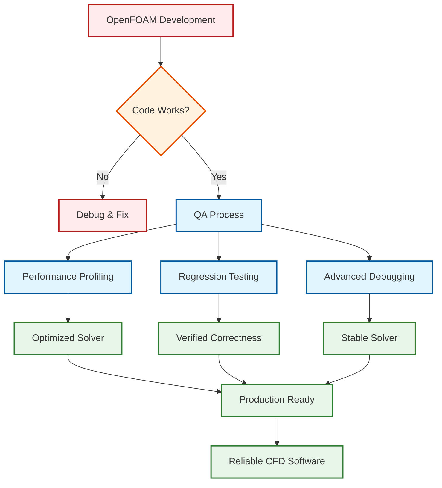
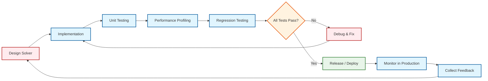

# 04 QA, Automation & Profiling (การประกันคุณภาพและการวิเคราะห์ประสิทธิภาพ)

> [!TIP] ทำไม QA สำคัญต่อ OpenFOAM Solver?
> การพัฒนา Custom Solver หรือ Boundary Condition ใน OpenFOAM ที่ "ทำงานได้" เป็นเพียงจุดเริ่มต้น เมื่อโค้ดมีความซับซ้อน มีการ Refactor บ่อย หรือมีผู้พัฒนาหลายคน ระบบ QA จะช่วย:
> - **ป้องกัน Regression**: การแก้ Bug ตัวเดียวไม่ควรทำลายฟีเจอร์เดิมที่เคยทำงานได้
> - **รับประกัน Performance**: เพิ่มฟีเจอร์ใหม่ไม่ควรทำให้ Solver ช้าลงอย่างน่าใจหาย
> - **ลดเวลา Debug**: ระบบ Test อัตโนมัติช่วยจับ Issue ตั้งแต่โค้ดเข้า Git
>
> **📂 OpenFOAM Context**: หัวข้อนี้เกี่ยวข้องกับ **Custom Code Development** (Solver/BC/Library) ซึ่งอยู่ใน `src/` directory และไฟล์ `Make/` ที่ใช้คอมไพล์ รวมถึง Test Cases ที่ใช้ Validate ความถูกต้องของ Custom Code

> [!INFO] Module Focus
> การยกระดับมาตรฐานการพัฒนา OpenFOAM Solver ด้วยการประกันคุณภาพ (Quality Assurance) การทดสอบถอยหลัง (Regression Testing) และการวิเคราะห์ประสิทธิภาพของโค้ด (Profiling) เพื่อให้แน่ใจว่าซอฟต์แวร์ที่พัฒนาขึ้นมีทั้งความถูกต้อง ความเสถียร และประสิทธิภาพสูง

---

## 🎯 วัตถุประสงค์การเรียนรู้ (Learning Objectives)

หลังจากศึกษาส่วนนี้ ผู้เรียนจะสามารถ:

-   **เข้าใจหลักการ Performance Profiling** เพื่อระบุจุดคอขวบ (Bottlenecks) ใน Solver และปรับปรุงประสิทธิภาพการคำนวณ
-   **สร้างระบบ Regression Testing** เพื่อตรวจสอบความถูกต้องของผลลัพธ์เมื่อมีการแก้ไขโค้ด และป้องกัน Bug Regression
-   **ใช้เครื่องมือ Debugging ขั้นสูง** (GDB, Valgrind) เพื่อแก้ปัญหาการลู่เข้า ความสอดคล้องทางฟิสิกส์ และข้อผิดพลาดใน Solver
-   **ประยุกต์ใช้ CI/CD** ในงาน CFD เพื่อสร้างกระบวนการทดสอบอัตโนมัติและเพิ่มความน่าเชื่อถือของซอฟต์แวร์

> [!TIP] เปรียบเทียบ: โรงงานผลิตรถยนต์แบบอัตโนมัติ (Automated Car Factory Analogy)
> - **Performance Profiling**: เหมือนการจับเวลาและวัดประสิทธิภาพในแต่ละสถานีประกอบ ว่าจุดไหนทำงานช้า (Bottleneck) ทำให้ไลน์การผลิตติดขัดและต้องเพิ่มคนงาน
> - **Regression Testing**: เหมือนการทดสอบรถทุกคันก่อนส่งมอบ (Test Drive) ว่าเบรกยังทำงานปกติไหมหลังจากเปลี่ยนซัพพลายเออร์ที่ผลิตเบรก (Code Change) ไม่ใช่แก้เบรกแล้วไฟหน้าดับ
> - **Debugging**: เหมือนทีมวิศวกรที่เข้ามาตรวจหาสาเหตุเมื่อโรบอทหยุดทำงานกะทันหัน โดยใช้เครื่องมือสแกนหาจุดที่วงจรลัดวงจร (Memory Leak/Segfault)

---

## 📋 ภาพรวมของหัวข้อ (Module Overview)

> [!NOTE] **📂 OpenFOAM Context**
> **Domain E: Coding/Customization** & **Domain C: Simulation Control**
>
> หัวข้อนี้เชื่อมโยงกับไฟล์และไดเรกทอรีต่อไปนี้ใน OpenFOAM:
> - **Custom Solver Development**: `src/finiteVolume/cfd/solvers/` (เช่น `myCustomSolver`)
> - **Compilation Files**: `Make/files` (ระบุ source files), `Make/options` (compiler flags)
> - **Test Case Organization**: `tutorials/` หรือ `tests/` directory structure สำหรับเก็บ Test Cases
> - **Runtime Control**: `system/controlDict` (สำหรับ Function Objects ที่ใช้ Profile)
> - **Debug Configuration**: `etc/controlDict` (Global DebugSwitches), `.OpenFOAM-` file per case

### บริบทความสำคัญ (Context)

ในการพัฒนา OpenFOAM Solver สำหรับงานวิจัยหรืออุตสาหกรรม การเขียนโค้ดให้ "ทำงานได้" (Works) เป็นเพียงขั้นตอนแรกเท่านั้น เมื่อโค้ดมีความซับซ้อนมากขึ้น มีการแก้ไขบ่อยขึ้น หรือมีผู้พัฒนาหลายคน เราจำเป็นต้องมีระบบประกันคุณภาพที่เข้มแข็ง เพื่อให้มั่นใจได้ว่า:

1.  **ความถูกต้องทางฟิสิกส์**: ผลลัพธ์ยังคงถูกต้องเมื่อมีการเปลี่ยนแปลงโค้ด
2.  **ประสิทธิภาพการคำนาณ**: Solver ใช้ทรัพยากร (CPU, RAM) อย่างมีประสิทธิภาพและสามารถขยายไปยัง HPC Cluster ได้
3.  **ความเสถียร**: ไม่เกิด Divergence หรือ Memory Leak ในกรณีศึกษาที่หลากหลาย

### การเชื่อมโยงกับหัวข้ออื่น (Connections)

หัวข้อนี้เป็นการรวมเทคนิคจากทุก Module ก่อนหน้ามาใช้ในมุมมองของ **Quality Assurance**:

-   **Module 05 (OpenFOAM Programming)**: การใช้ `cpuTime`, `autoPtr`, และการจัดการหน่วยความจำ
-   **Module 06 (Advanced Physics)**: การตรวจสอบความสอดคล้องของสมการฟิสิกส์
-   **Module 07 (Utilities)**: การใช้ `checkMesh`, `checkFields` และเครื่องมือวิเคราะห์ผลลัพธ์

---

## 📚 หัวข้อทางเทคนิค (Technical Topics)

### 01 [[01_Performance_Profiling|การวิเคราะห์ประสิทธิภาพ (Profiling)]]

> [!NOTE] **📂 OpenFOAM Context**
> **Domain E: Coding/Customization** & **Domain C: Simulation Control**
>
> **Performance Profiling** เกี่ยวข้องกับ:
> - **Inline Profiling**: ใช้ `cpuTime` class ใน C++ code (`#include "cpuTime.H"`) เพื่อจับเวลา function ใน solver
> - **Function Objects**: `system/controlDict` → `functions` → `profiling`, `cpuTime`, `execFlowFunctionObjects`
> - **Compilation Profiling**: `Make/options` → เพิ่ม `-pg` flag เพื่อใช้ `gprof`
> - **Memory Tools**: Valgrind (`valgrind --tool=massif --leak-check=full`) สำหรับตรวจสอบ Memory Leak
> - **Scaling Analysis**: ใช้ `decomposePar` กับ `system/decomposeParDict` ทดสอบ Strong/Weak Scaling

การวัดประสิทธิภาพของ Solver ด้วยเมตริกหลัก เช่น Execution Time, Memory Usage และการวิเคราะห์การปรับขนาด (Scaling Analysis) ทั้ง Strong Scaling และ Weak Scaling

**เนื้อหาหลัก:**
-   เมตริกประสิทธิภาพหลัก (Execution Time, CPU Time, Memory Usage)
-   การวิเคราะห์ Strong/Weak Scaling และ Amdahl's Law
-   การสร้างโปรไฟล์หน่วยความจำ (Memory Profiling) และการจัดการ Smart Pointers
-   การใช้เครื่องมือ Profiling (เช่น `scalabilityTest`, `profilingSolver`)

**ผลลัพธ์ที่คาดหวัง:**
สามารถระบุจุดคอขวบของ Solver และตัดสินใจได้ว่าควรใช้ทรัพยากรกี่ CPU ถึงจะคุ้มค่าที่สุด

---

### 02 [[02_Regression_Testing|การทดสอบถอยหลัง (Regression Testing)]]

> [!NOTE] **📂 OpenFOAM Context**
> **Domain E: Coding/Customization** & **CI/CD Integration**
>
> **Regression Testing** เกี่ยวข้องกับ:
> - **Test Suite Structure**: `tutorials/` หรือ `tests/` directory ที่มีหลาย Test Cases (Laminar, Turbulent, Multiphase)
> - **Validation Scripts**: Python/Bash scripts ที่ compare results กับ Reference Database
> - **Function Objects**: `system/controlDict` → `functions` → `probes`, `sampledSurface`, `sets` สำหรับ dump ข้อมูลเพื่อเทียบ
> - **Automated Testing**: ใช้ `foamRun` หรือ custom scripts รัน Test Cases อัตโนมัติ
> - **CI/CD Integration**: GitLab CI (`.gitlab-ci.yml`) หรือ Jenkins ที่ trigger test เมื่อมี commit ใหม่

การสร้างระบบตรวจสอบความเสถียรของผลลัพธ์ในระยะยาว และการนำ CI/CD มาใช้ในงาน CFD เพื่อตรวจจับความผิดปกติจากการแก้ไขโค้ด

**เนื้อหาหลัก:**
-   หลักการของ Regression Testing และความสำคัญใน OpenFOAM Development
-   ความแตกต่างระหว่าง Exact Match และ Statistical Match
-   เฟรมเวิร์กการทดสอบและการเก็บค่าอ้างอิง (Reference Database)
-   การทดสอบความเข้ากันได้ย้อนหลัง (Backward Compatibility)

**ผลลัพธ์ที่คาดหวัง:**
สามารถสร้างระบบทดสอบอัตโนมัติเพื่อยืนยันความถูกต้องของ Solver เมื่อมีการแก้ไขโค้ด

---

### 03 [[03_Debugging_Troubleshooting|การดีบักและการแก้ปัญหา]]

> [!NOTE] **📂 OpenFOAM Context**
> **Domain E: Coding/Customization** & **Diagnostic Tools**
>
> **Debugging** เกี่ยวข้องกับ:
> - **Built-in Utilities**: `checkMesh` (mesh quality), `checkFields` (field consistency), `foamListTimes` (time directories)
> - **Debug Switches**: `etc/controlDict` (global) หรือ `.OpenFOAM-` (per case) → `DebugSwitches` subsection เพื่อเปิด Logging รายละเอียด
> - **Runtime Compilation**: `wmake -debug` (compile with debug symbols), `-O0 -g3` flags ใน `Make/options`
> - **External Debuggers**: `gdb`, `lldb` สำหรับ debug Segmentation Fault และ Logic Errors
> - **Memory Checkers**: `valgrind --tool=memcheck` สำหรับตรวจ Memory Leak, Invalid Access

เทคนิคการใช้เครื่องมือ Debugging ขั้นสูง (GDB, Valgrind) และวิธีการเชิงระบบเพื่อหาจุดผิดพลาดใน Solver และชุดการทดสอบ

**เนื้อหาหลัก:**
-   การวินิจฉัยปัญหาการทดสอบทั่วไป (Divergence, Conservation Errors)
-   เครื่องมือ Debugging ใน OpenFOAM (`checkMesh`, `checkFields`, `DebugSwitches`)
-   การใช้ GDB และ Valgrind เพื่อตรวจสอบ Memory Leak และ Segmentation Fault
-   รายการตรวจสอบก่อนการทดสอบ (Pre-test Checklist)

**ผลลัพธ์ที่คาดหวัง:**
สามารถวินิจฉัยและแก้ไขปัญหาที่ซับซ้อนใน Solver ได้อย่างเป็นระบบ

---

## 🔑 แนวคิดสำคัญ (Key Concepts)

### 1. วงจรชีวิตการพัฒนาที่มี QA (QA-Enabled Development Lifecycle)

### 2. สมดุลระหว่าง Performance และ Accuracy

> **กราฟแสดงความสัมพันธ์ (Trade-off):**
> - **แกน X (Cost)**: เวลาในการคำนวณ (Computational Time) หรือ ทรัพยากร (Memory/CPU)
> - **แกน Y (Error)**: ความคลาดเคลื่อนของผลลัพธ์ (Numerical Error)
> - **จุดที่เหมาะสม (Sweet Spot)**: จุดที่ความแม่นยำเริ่มไม่คุ้มกับเวลาที่เสียไป (Diminishing Return) เช่นการใช้ Grid ละเอียดเกินไป หรือ Order of Accuracy ที่สูงเกินความจำเป็นสำหรับ Physical Model นั้นๆ

ในการพัฒนา Solver เรามักต้องเผชิญกับ Trade-off:
-   **Numerical Schemes**: Upwind (เสถียร แต่มี Numerical Diffusion) vs. High-Order (แม่นยำ แต่อาจ Diverge)
-   **Mesh Resolution**: เมชหนาแน่น (แม่นยำ แต่ใช้เวลานาน) vs. เมชกระจัดกระจาย (เร็ว แต่อาจมีความคลาดเคลื่อนสูง)
-   **Parallelization**: การแบ่งข้อมูล (Decomposition) ที่เหมาะสมเพื่อลด Communication Overhead

### 3. ความสำคัญของ Reproducibility

การทดสอบที่ดีต้องสามารถ **ทำซ้ำได้** (Reproducible) ในสภาพแวดล้อมที่แตกต่าง:
-   เครื่องมือควบคุมเวอร์ชัน (Git)
-   การเก็บ Reference Results ที่มั่นใจแล้ว
-   การบันทึก Environment Details (OpenFOAM Version, Compiler, MPI Library)

---

## 🛠️ เครื่องมือที่ใช้ในหัวข้อนี้ (Tools Covered)

| เครื่องมือ | วัตถุประสงค์ | หัวข้อที่เกี่ยวข้อง |
|:---:|:---|:---:|
| **`cpuTime`**, **`clockTime`** | วัดเวลาการคำนาณ | Performance Profiling |
| **`scalabilityTest`** | ทดสอบ Strong/Weak Scaling | Performance Profiling |
| **Valgrind**, **Massif** | ตรวจสอบ Memory Leak | Performance Profiling |
| **Reference Database** | เก็บผลลัพธ์อ้างอิง | Regression Testing |
| **CI/CD (Jenkins, GitLab CI)** | ทดสอบอัตโนมัติ | Regression Testing |
| **`checkMesh`**, **`checkFields`** | ตรวจสอบคุณภามเมชและฟิลด์ | Debugging |
| **GDB**, **LLDB** | Debugging ขั้นสูง | Debugging |
| **`DebugSwitches`** | เปิด Logging รายละเอียด | Debugging |

---

## 📖 แหล่งอ้างอิงเพิ่มเติม (Further Reading)

> **[NOTE: Synthesized by AI - Verify parameters]**

1.  **OpenFOAM User Guide** - หัวข้อ Debugging และ Profiling
2.  **Amdahl's Law**: ทฤษฎีที่บรรยายขีดจำกัดของการปรับขนาดแบบขนาน (Strong Scaling)
3.  **Software Testing Best Practices**: แนวทางการสร้างระบบ Regression Testing สำหรับซอฟต์แวร์วิทยาศาสตร์
4.  **HPC Profiling Tools**: การใช้งาน Intel VTune, TAU, และ Scalasca

---

## 🎯 คำถามท้ายบท (Review Questions)

1.  **Strong Scaling** และ **Weak Scaling** แตกต่างกันอย่างไร และควรใช้วิธีใดในสถานการณ์ที่เราต้องการรัน Simulation ที่มีขนาดเมชใหญ่ขึ้นตามจำนวน CPU?
2.  ทำไมการทดสอบ **Exact Match** ใน Regression Testing มักล้มเหลวเมื่อเปลี่ยนเครื่องหรือคอมไพเลอร์ และเราควรใช้ **Statistical Match** อย่างไร?
3.  ถ้าการจำลอง Diverge หลังจาก 100 ลูปเวลา คุณจะเริ่มต้น Debugging จากจุดใด (เครื่องมือใดที่คุณจะใช้ก่อน)?
4.  **Amdahl's Law** บอกอะไรเกี่ยวกับขีดจำกัดของการปรับขนาดแบบขนาน และมันส่งผลต่อการออกแบบ Solver อย่างไร?

---

## ⚡ ความท้าทายสำหรับผู้เรียน (Challenge Activities)

> **💻 กิจกรรมท้าทาย (Hands-on Challenges):**
> 1.  **Profile Your Code**: ใช้ `profilingSolver` หรือ `gprof` จับเวลา Solver ที่คุณใช้บ่อยที่สุด และหาว่าฟังก์ชันไหนใช้เวลาเยอะที่สุด (เช่น `pEqn`, `UEqn` หรือ `TDMA`)
> 2.  **Build a Regression Suite**: เขียนสคริปต์ `Alltest` ง่ายๆ ที่รัน tutorial case 3 กรณี (Laminar, Turbulent, Heat Transfer) แล้วเปรียบเทียบค่า `initialResidual` ว่าเปลี่ยนแปลงหรือไม่
> 3.  **Hunt the Leak**: จงใจเขียนโค้ดให้เกิด Memory Leak เล็กน้อยในแอพพลิเคชันทดสอบ แล้วใช้ `valgrind --tool=memcheck` เพื่อดูว่ามันแจ้งเตือนตรงบรรทัดไหน

---

> **[!TIP] Learning Strategy**
> แนะนำให้ศึกษาหัวข้อเหล่านี้ตามลำดับ และ **ประยุกต์ใช้กับ Solver ที่คุณกำลังพัฒนา** เพื่อให้เข้าใจความสำคัญของ QA อย่างแท้จริง การมีระบบ QA ที่ดีจะช่วยให้คุณมั่นใจในความถูกต้องของผลงานวิจัยและซอฟต์แวร์ที่คุณพัฒนาขึ้น

---

## 🧠 ตรวจสอบความเข้าใจ (Concept Check)

1. **ถาม:** ถ้าเราเพิ่มจำนวน CPU เป็น 2 เท่า แล้วเวลาคำนวณลดลงเหลือครึ่งหนึ่งนี่คือ **Strong Scaling** หรือ **Weak Scaling**?
   

   
เฉลย

   <b>ตอบ:</b> นี่คือ **Strong Scaling** ในอุดมคติ (Ideal Strong Scaling) เพราะขนาดงาน (Problem Size) เท่าเดิม แต่ใช้เวลาลดลงเป็นสัดส่วนกับทรัพยากรที่เพิ่มขึ้น ส่วน Weak Scaling จะเพิ่มขนาดงานตามทรัพยากรเพื่อให้เวลาคงที่
   

2. **ถาม:** ทำไม **Exact Match Regression Testing** (เทียบกันเป็น bit-per-bit) จึงทำได้ยากในงาน CFD?
   

   
เฉลย

   <b>ตอบ:</b> เพราะการคำนวณ Floating Point (ทศนิยม) มีความละเอียดจำกัดและขึ้นอยู่กับลำดับการคำนวณ (Order of Operations) ซึ่งอาจเปลี่ยนไปเมื่อใช้ Compiler ต่างรุ่น, Optimization Flags ต่างกัน หรือจำนวน Processor ในการ Parallel ต่างกัน (Global reduction order เปลี่ยน) ทำให้ค่าท้ายๆ ของทศนิยมตำแหน่งที่ 15-16 เพี้ยนไปได้ เรียกว่า Round-off error accumulation
   

3. **ถาม:** เครื่องมือ **Valgrind** ช่วยแก้ปัญหาประเภทใดใน C++ Code?
   

   
เฉลย

   <b>ตอบ:</b> ช่วยหา **Memory Errors** เช่น Memory Leak (จองแล้วไม่คืน), Access Out of Bounds (เขียนเกินขนาด array), และ Uninitialized Variables ซึ่งเป็นปัญหาที่พบบ่อยและแก้ยากใน C++ เพราะบางครั้งโปรแกรมไม่ Crash ทันที
   

---

## 📖 เอกสารที่เกี่ยวข้อง

- **บทถัดไป:** [01_Performance_Profiling.md](01_Performance_Profiling.md) — การวิเคราะห์ประสิทธิภาพ
- **Regression Testing:** [02_Regression_Testing.md](02_Regression_Testing.md) — การทดสอบถอยหลัง
- **Debugging:** [03_Debugging_Troubleshooting.md](03_Debugging_Troubleshooting.md) — การดีบักและการแก้ปัญหา