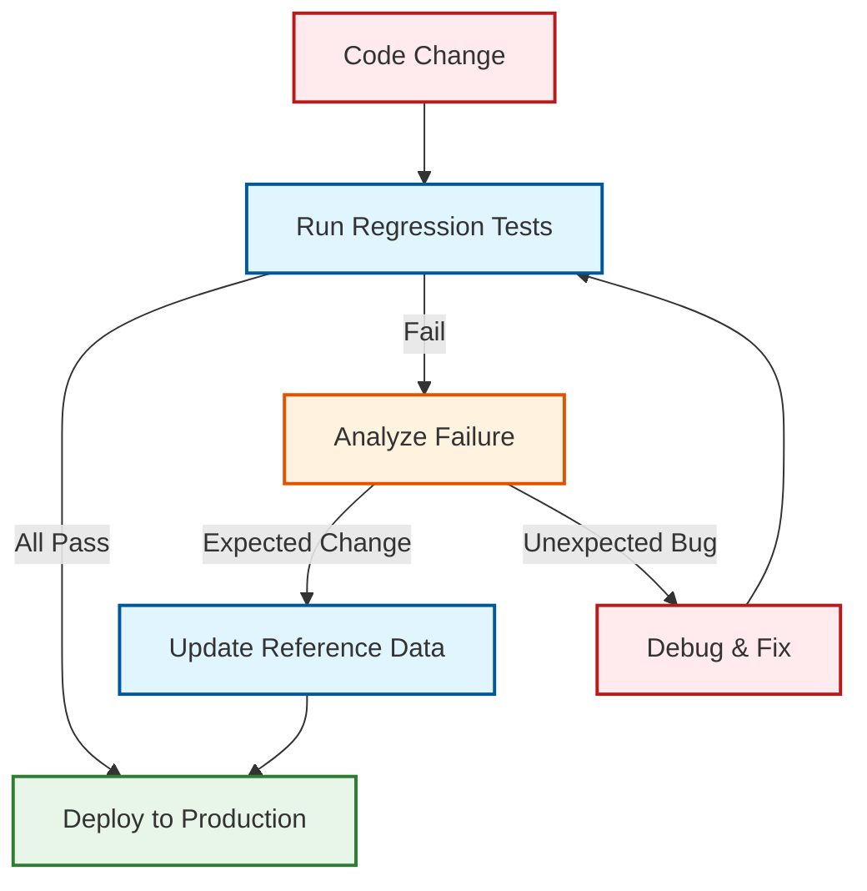
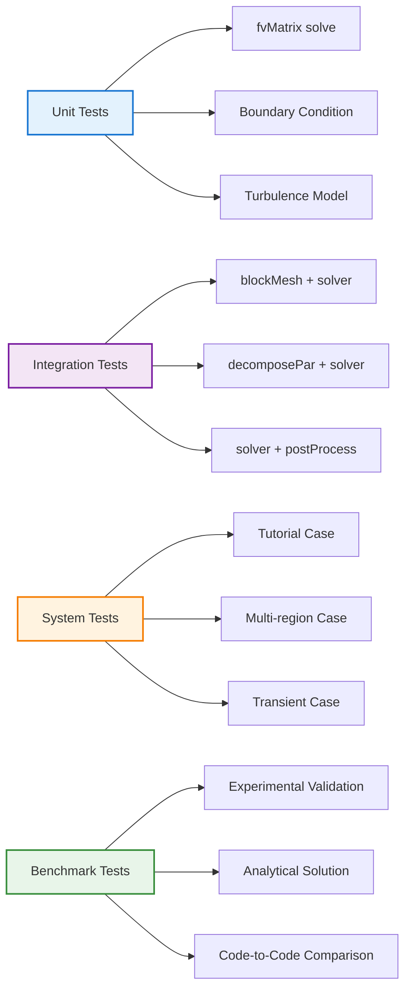
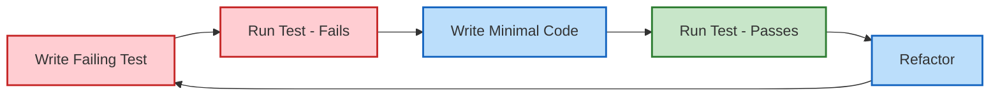
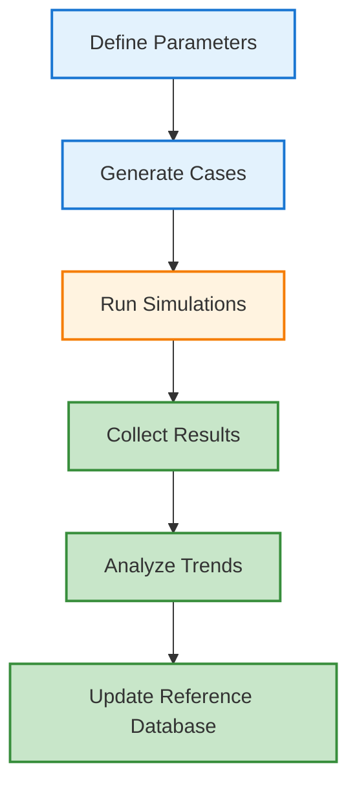
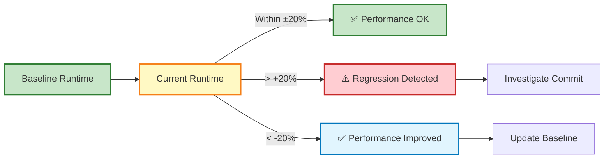

# 02 การทดสอบถอยหลัง (Regression Testing)

> [!TIP] ทำไมต้อง Regression Testing?
> **Regression Testing** คือการทดสอบเพื่อให้มั่นใจว่าการเปลี่ยนแปลงใหม่ (Code Changes, Solver Updates, Boundary Condition Modifications) ไม่ได้ทำลาย Functionality ที่เคยทำงานได้อยู่แล้ว ใน OpenFOAM แม้การเปลี่ยนแปลงเล็กน้อย เช่น ปรับ Tolerance ใน `system/fvSolution` หรืออัปเดต OpenFOAM Version ก็อาจทำให้ Results เปลี่ยนแปลงอย่างน่าใจหาย
>
> **🔧 ผลกระทบต่อ OpenFOAM Case:**
> - มีผลโดยตรงต่อ **Continuous Integration (CI)** ใน Development Workflow
> - มีผลต่อการตั้งค่า Tolerances ใน Validation Scripts
> - มีผลต่อ Reference Database Management (เก็บ Benchmark Results)
> - ช่วยตรวจสอบ Consistency ของ Results ข้าม OpenFOAM Versions
> - จำเป็นสำหรับ **Verification & Validation (V&V)** ใน Industrial Applications

---

## 🎯 Learning Objectives (เป้าหมายการเรียนรู้)

หลังจากอ่านบทนี้ คุณควรจะสามารถ:

1. **อธิบาย (Explain)** หลักการ Regression Testing และความสำคัญต่อ OpenFOAM Development Workflow
2. **ออกแบบ (Design)** Test Case Structure ที่เหมาะสมสำหรับ OpenFOAM Solvers และ Utilities
3. **ใช้ (Use)** Tolerance-Based Comparison สำหรับ Floating-Point Results
4. **จัดระเบียบ (Organize)** Reference Database สำหรับ Benchmark Results
5. **ปรับใช้ (Deploy)** Regression Tests ใน CI/CD Pipelines (GitHub Actions, GitLab CI, Jenkins)
6. **วิเคราะห์ (Analyze)** Test Results และ **ตัดสินใจ (Decide)** เมื่อ Tests Fail
7. **สร้าง (Create)** Automated Test Scripts สำหรับ Multiple Test Cases

---

## 2.1 แนวคิดพื้นฐาน (Fundamental Concepts)

> [!NOTE] **📂 OpenFOAM Context**
> **Domain:** Simulation Control (Domain C) & Coding/Customization (Domain E)
>
> Regression Testing ใน OpenFOAM ใช้:
> - **Allrun/Allclean Scripts:** สำหรับ Standard Test Case Structure
> - **functionObjects:** `system/controlDict` → `functions` → `probes`, `samples`, `sets`
> - **postProcess Utilities:** เปรียบเทียบ Results กับ Reference Data
> - **Python/Bash Scripts:** Tolerance-based validation และ batch testing
>
> **🔑 คำสำคัญ:** `Allrun`, `Allclean`, `probes`, `postProcess`, `tolerance`, `CI/CD`

### 2.1.1 What is Regression Testing? (คืออะไร?)

**What (คืออะไร):**
Regression Testing คือกระบวนการทดสอบอัตโนมัติเพื่อยืนยันว่า:
- ✅ **New Features** ทำงานถูกต้อง
- ✅ **Existing Features** ยังคงทำงานเหมือนเดิม
- ✅ **Bug Fixes** ไม่ได้สร้าง Bugs ใหม่
- ✅ **Performance** ไม่แย่ลงกว่าเดิม

**Why (ทำไมสำคัญ):**

**ใน OpenFOAM Context:**
- **Version Updates:** เวลาอัปเกรดจาก OpenFOAM v9 → v10 ต้องมั่นใจว่า Results ไม่เปลี่ยน
- **Solver Modifications:** แก้ Bug ใน Custom Solver ต้องเช็คว่า Benchmark Cases ยังผ่าน
- **Mesh Changes:** ปรับ Mesh Quality ต้องเช็คว่า Convergence ไม่แย่ลง
- **Boundary Conditions:** เปลี่ยน BC Type ต้อง verify ว่า Physical behavior ถูกต้อง

**Impact Analysis:**


**How (ทำอย่างไร):**
1. **สร้าง Test Cases:** เลือก Cases ที่เป็น Representative ของ Workflow
2. **เก็บ Reference Data:** ผลลัพธ์ที่ Verify แล้วว่าถูกต้อง
3. **Run Automated Tests:** Script เปรียบเทียบ Results กับ Reference
4. **Fail Fast:** CI ต้อง Stop ถ้า Tests Fail

### 2.1.2 Test Hierarchy (ลำดับชั้นการทดสอบ)

ใน OpenFOAM มี 4 ระดับของ Regression Tests:

| Level | จุดประสงค์ | ตัวอย่างใน OpenFOAM | Run Time | ตำแหน่งไฟล์ |
|:------|:------------|:----------------------|:---------|:--------------|
| **Unit** | ทดสอบ Function/Class เดี่ยว | `fvMatrix::solve()` ให้ผลลัพธ์ถูกต้อง | < 1 min | `src/finiteVolume/` |
| **Integration** | ทดสอบ Components ร่วมกัน | `blockMesh` + `simpleFoam` workflow | 1-5 min | `tutorials/` |
| **System** | ทดสอบ Complete Case | ตลอดจนกระบวนการ Mesh → Solve → Post-process | 5-30 min | `tutorials/incompressible/` |
| **Benchmark** | ทดสอบกับ Experimental Data | NACA Airfoil vs Wind Tunnel Data | 30 min - 2 hr | `cases/validation/` |

> [!TIP] การเลือก Test Level
> - **Unit Tests:** ใช้สำหรับ Custom Functions ใน Solvers
> - **Integration Tests:** ใช้ทดสอบ Utilities Chain (เช่น `snappyHexMesh` + `solver`)
> - **System Tests:** ใช้ทดสอบ Standard Tutorials (เช่น `tutorials/incompressible/simpleFoam/airFoil2D`)
> - **Benchmark Tests:** ใช้สำหรับ Validation Cases ที่มี Experimental Data

**ตัวอย่างการทดสอบแต่ละระดับ:**



### 2.1.3 When to Run Regression Tests? (เมื่อไหร่ควรทดสอบ?)

**Before (ก่อน):**
- **Code Commits:** ก่อน Push ไป Git Repository
- **Version Upgrades:** ก่อนอัปเกรด OpenFOAM Version
- **Major Refactoring:** ก่อน Reorganize Code Structure

**During (ระหว่าง):**
- **Every Commit:** CI/CD รัน Automatic Tests
- **Pull Requests:** Reviewers ต้องเห็น Green Build
- **Feature Branches:** ทดสอบ Feature Isolation

**After (หลัง):**
- **Bug Fixes:** ยืนยันว่า Fix แล้วไม่ Break อย่างอื่น
- **Performance Changes:** ยืนยันว่า Optimization ไม่ทำลาย Accuracy
- **Documentation:** เก็บ Test Results ไว้เป็น Evidence

---

## 2.2 Test Case Structure (โครงสร้าง Test Case)

> [!NOTE] **📂 OpenFOAM Context**
> **Directory Structure & Files**
>
> Test Case ใน OpenFOAM ปฏิบัติตาม Standard Structure:
> - **`system/controlDict`:** กำหนด `functions` → `probes`, `samples` สำหรับ dump data
> - **`system/fvSolution`:** กำหนด Solver Tolerances และ Algorithm
> - **`Allrun`:** Script ที่รัน Mesh → Solve → Post-process → Validate
> - **`expected/`:** Directory เก็บ Reference Data (benchmark results)
>
> **🔑 คำสำคัญ:** `controlDict`, `probes`, `Allrun`, `Allclean`, `expected/`

### 2.2.1 Standard OpenFOAM Test Layout

**What (คืออะไร):**
โครงสร้าง Directory มาตรฐานสำหรับ Regression Test Case ใน OpenFOAM

**Why (ทำไมต้องมาตรฐาน):**
- **Reproducibility:** ใครก็ได้สามารถ Run ซ้ำได้
- **Automation:** CI Scripts สามารถ Execute ได้โดยอัตโนมัติ
- **Maintenance:** ง่ายต่อการ Update Reference Data

**How (วิธีจัดโครงสร้าง):**

```
regressionTests/
├── test_001_laminarCavity/
│   ├── Allrun              # Main test script
│   ├── Allclean            # Cleanup script
│   ├── README.md           # Test description
│   ├── system/
│   │   ├── controlDict     # Solver settings + functionObjects
│   │   ├── fvSchemes       # Discretization schemes
│   │   ├── fvSolution      # Linear solver settings
│   │   ├── blockMeshDict   # Mesh definition
│   │   └── decomposeParDict # Parallel decomposition
│   ├── constant/
│   │   └── polyMesh/       # Mesh files (generated)
│   │       └── boundary    # Boundary definitions
│   ├── 0/                  # Initial conditions
│   │   ├── p               # Pressure field
│   │   └── U               # Velocity field
│   ├── expected/           # Reference results
│   │   ├── probes.csv      # Probe data
│   │   ├── forces.dat      # Force coefficients
│   │   ├── final_time/     # Final field data
│   │   │   ├── p
│   │   │   └── U
│   │   └── log.simpleFoam  # Expected log output
│   ├── validation/
│   │   ├── tolerances.json # Acceptable tolerances
│   │   ├── metadata.json   # Test metadata
│   │   └── validation_rules.json # Custom validation rules
│   └── tests/
│       ├── test_convergence.py
│       └── test_mass_balance.py
├── test_002_turbulentPipe/
│   └── ... (same structure)
├── test_003_heatTransfer/
│   └── ... (same structure)
├── runAllTests.sh          # Batch test runner
├── config/
│   ├── global_tolerances.json
│   └── ci_settings.json
└── reports/
    └── templates/
        └── test_report.html
```

### 2.2.2 Allrun Script with Validation

**What (คืออะไร):**
Script อัตโนมัติสำหรับ Run Test และ Validate Results

**Why (ทำไมสำคัญ):**
- เป็น **Standard Entry Point** ที่ CI ใช้ Execute
- Encapsulate ทั้ง Setup → Run → Validate ใน Script เดียว
- Return **Exit Codes** ที่ CI เข้าใจ (0 = Pass, 1 = Fail)

**How (วิธีเขียน):**

```bash
#!/bin/bash
# Allrun - Regression test script with full validation
cd ${0%/*} || exit 1    # Change to test directory
source $WM_PROJECT_DIR/bin/tools/RunFunctions

# ========================================
# TEST METADATA
# ========================================
TEST_NAME="Laminar Cavity Flow"
EXPECTED_DIR="expected"
VALIDATION_DIR="validation"
LOG_DIR="testLogs"

# ========================================
# CLEANUP
# ========================================
echo "=========================================="
echo "Test: $TEST_NAME"
echo "Cleaning previous run..."
echo "=========================================="
./Allclean

# ========================================
# MESH GENERATION
# ========================================
echo "Generating mesh..."
runApplication blockMesh

# Check mesh quality
echo "Checking mesh quality..."
runApplication checkMesh

# ========================================
# SOLVER RUN
# ========================================
echo "Running solver..."
runApplication simpleFoam

# Extract execution time
EXEC_TIME=$(grep "ExecutionTime" log.simpleFoam | awk '{print $3}')
echo "Solver execution time: $EXEC_TIME s"

# ========================================
# POST-PROCESSING
# ========================================
echo "Extracting probe data..."
runApplication postProcess -func 'probes' -noZero

echo "Extracting force coefficients..."
runApplication postProcess -func 'forces' -noZero

echo "Sampling along line..."
runApplication postProcess -func 'cuttingPlane' -noZero

# ========================================
# VALIDATION
# ========================================
echo "=========================================="
echo "Validating results..."
echo "==========================================

# Check if probes output exists
if [ ! -d "postProcessing/probes" ]; then
    echo "ERROR: No probes output found"
    exit 1
fi

# Compare with reference data
LATEST_TIME=$(ls -t postProcessing/probes | head -1)
ACTUAL_FILE="postProcessing/probes/$LATEST_TIME/p"
REFERENCE_FILE="$EXPECTED_DIR/probes.csv"

# Use Python for tolerance-based comparison
python3 << EOF
import numpy as np
import sys
import json

# Load data
try:
    actual = np.loadtxt('$ACTUAL_FILE', skiprows=1)
    reference = np.loadtxt('$REFERENCE_FILE', skiprows=1)
except Exception as e:
    print(f"ERROR: Failed to load data: {e}")
    sys.exit(1)

# Load tolerances
with open('$VALIDATION_DIR/tolerances.json', 'r') as f:
    tolerances = json.load(f)

RTOL = tolerances.get('relative_tolerance', 1e-6)
ATOL = tolerances.get('absolute_tolerance', 1e-9)

# Check shape
if actual.shape != reference.shape:
    print(f"ERROR: Shape mismatch: actual {actual.shape} vs reference {reference.shape}")
    sys.exit(1)

# Compare
if np.allclose(actual, reference, rtol=RTOL, atol=ATOL):
    print(f"✓ PASSED: Max difference = {np.max(np.abs(actual - reference)):.2e}")
    sys.exit(0)
else:
    max_diff = np.max(np.abs(actual - reference))
    max_rel_diff = np.max(np.abs((actual - reference) / (reference + 1e-12)))
    print(f"✗ FAILED:")
    print(f"  Max absolute difference: {max_diff:.2e}")
    print(f"  Max relative difference: {max_rel_diff:.2%}")
    print(f"  Tolerance: rtol={RTOL:.2e}, atol={ATOL:.2e}")

    # Show where it failed
    diff_indices = np.where(np.abs(actual - reference) > ATOL + RTOL * np.abs(reference))[0]
    if len(diff_indices) > 0:
        print(f"  First failure at index {diff_indices[0]}:")
        print(f"    Actual:   {actual[diff_indices[0]]:.6e}")
        print(f"    Expected: {reference[diff_indices[0]]:.6e}")

    sys.exit(1)
EOF

# Capture exit code
EXIT_CODE=$?

if [ $EXIT_CODE -eq 0 ]; then
    echo "=========================================="
    echo "✓ TEST PASSED"
    echo "=========================================="
else
    echo "=========================================="
    echo "✗ TEST FAILED"
    echo "=========================================="
fi

exit $EXIT_CODE
```

### 2.2.3 Allclean Script

```bash
#!/bin/bash
# Allclean - Clean test artifacts
cd ${0%/*} || exit 1

echo "Cleaning test case: $(basename $(pwd))"

# Remove time directories
find . -maxdepth 1 -type d -name "[0-9]*" -exec rm -rf {} + 2>/dev/null

# Remove post-processing
rm -rf postProcessing/

# Remove logs
rm -f log.*

# Remove processor directories
rm -rf processor*

# Remove auxiliary files
rm -f *.obj

echo "Clean complete."
```

### 2.2.4 controlDict with Function Objects

**What (คืออะไร):**
การใช้ `functionObjects` ใน `system/controlDict` เพื่อ dump ข้อมูลสำหรับ Validation

**Why (ทำสำคัญ):**
- **Automated Data Extraction:** Function objects run automatically
- **Consistent Output:** Format เหมือนกันทุก run
- **Flexible:** เลือก dump ได้หลาย formats (CSV, raw, VTK)

**ตัวอย่าง `system/controlDict`:**

```cpp
application simpleFoam;
startFrom latestTime;
stopAt endTime;
endTime 1000;
deltaT 1;
writeControl timeStep;
writeInterval 100;

// ============================================
// FUNCTION OBJECTS FOR REGRESSION TESTING
// ============================================
functions
{
    // Probe points for validation
    probes
    {
        type            probes;
        functionObjectLibs ("libsampling.so");
        writeControl    writeTime;
        writeFields     true;

        probeLocations
        (
            (0.05 0.05 0)
            (0.05 0.05 0.001)
            (0.05 0.05 0.002)
        );

        fields
        (
            p
            U
        );
    }

    // Sample along line
    centerlineSample
    {
        type            sets;
        functionObjectLibs ("libsampling.so");
        writeControl    writeTime;

        set             uniform;
        axis            distance;

        start           (0.05 0 0.001);
        end             (0.05 0.1 0.001);
        nPoints         100;

        fields
        (
            p
            U
        );
    }

    // Force coefficients
    forces
    {
        type            forces;
        functionObjectLibs ("libforces.so");
        writeControl    writeTime;
        writeFields     true;

        patches         ("movingWall");

        rho             rhoInf;
        log             true;
        rhoInf          1.0;

        CofR            (0.05 0.05 0);
        pitchAxis       (0 0 1);
    }

    // Execution time profiling
    cpuTime
    {
        type            cpuTime;
        functionObjectLibs ("libutilityFunctionObjects.so");
        writeControl    writeTime;
        writeInterval   1;
    }
}
```

---

## 2.3 Tolerance-Based Comparison (การเปรียบเทียบแบบ Tolerance)

> [!NOTE] **📂 OpenFOAM Context**
> **Numerical Precision & Floating-Point**
>
> OpenFOAM ใช้ `double` precision (64-bit) โดยค่าเริ่มต้น:
> - **Machine Epsilon:** ε ≈ 2.22×10⁻¹⁶
> - **Significant Digits:** ~15-16 decimal places
> - **Compiler Flags:** `-DP64` ใน `Make/options` สำหรับ double precision
>
> **🔑 คำสำคัญ:** `Machine Epsilon`, `Round-off Error`, `Double Precision`, `Floating-Point Arithmetic`

### 2.3.1 Why Tolerances Matter (ทำไมต้อง Tolerance?)

**What (คืออะไร):**
Floating-Point Arithmetic ใน Computers มี **Finite Precision** → ผลลัพธ์ไม่เคย exact เท่ากัน 100% แม้ Run ในเครื่องเดิม

**Why (ทำไมสำคัญใน OpenFOAM):**
- **Machine Epsilon:** `double` precision มีค่า ≈ 2.22×10⁻¹⁶
- **Round-off Errors:** สะสมทุกครั้งที่คำนวณ
- **Compiler Optimizations:** ต่าง Compiler อาจให้ผลลัพธ์ต่างกันเล็กน้อย
- **Parallel Computing:** MPI Reduction Order ส่งผลต่อ Results

**แนวคิดหลัก:**
```
Exact Equality (❌ ใช้ไม่ได้):
    actual == reference  →  ใช้ไม่ได้กับ floating-point

Tolerance-Based (✅ ถูกต้อง):
    |actual - reference| ≤ atol + rtol × |reference|

ตัวอย่าง:
    actual   = 1.000000000000001
    reference = 1.000000000000002

    ❌ actual == reference  →  FALSE (ผิด!)
    ✅ |actual - reference| ≤ 1e-12  →  TRUE (ถูก!)
```

### 2.3.2 Absolute vs Relative Tolerance

| Tolerance Type | สูตร | ใช้เมื่อ | ค่าตัวอย่าง | OpenFOAM Example |
|:---------------|:-----|:----------|:--------------|:-----------------|
| **Absolute** | `|a - b| ≤ atol` | ค่าใกล้ศูนย์ | `atol = 1e-9` | Pressure difference near wall |
| **Relative** | `|a - b| / |b| ≤ rtol` | ค่าขนาดใหญ่ | `rtol = 1e-6` | Velocity magnitude |
| **Combined** | `|a - b| ≤ atol + rtol×|b|` | ทั่วไป | `atol=1e-9, rtol=1e-6` | Most fields |

> [!TIP] การเลือก Tolerance Values
> - **Geometry/Mesh:** `rtol = 1e-12` (ต้องแม่นยำมาก)
> - **Velocity/Pressure:** `rtol = 1e-6` (ค่าพื้นฐาน)
> - **Turbulence Quantities (k, ω, ε):** `rtol = 1e-4` (มีความไม่แน่นอนสูง)
> - **Forces/Coefficients:** `rtol = 1e-5` (engineering accuracy)
> - **Temperature:** `rtol = 1e-5` (thermal fields)

### 2.3.3 Validation Script (Python)

**What (คืออะไร):**
Python Script ที่ใช้ `numpy.allclose()` สำหรับ Tolerance-Based Comparison

**Why (ทำไมใช้ Python):**
- **Numerical Computing:** `numpy` มีฟังก์ชันสำหรับ Floating-Point Comparison
- **Flexibility:** Custom Validation Logic ง่าย
- **Integration:** ใช้กับ CI/CD ได้ง่าย

**How (วิธีใช้งาน):**

```python
#!/usr/bin/env python3
"""
validateResults.py - Tolerance-based validation for OpenFOAM results

Usage:
    python validateResults.py actual.csv reference.csv tolerances.json
"""

import numpy as np
import json
import sys
import argparse
from pathlib import Path

def load_data(filename):
    """Load OpenFOAM probe/sample data."""
    try:
        # Handle CSV files (probe output)
        if filename.suffix == '.csv':
            data = np.loadtxt(filename, delimiter=',', skiprows=1)
            return data
        # Handle raw files (space-separated)
        else:
            data = np.loadtxt(filename, skiprows=1)
            return data
    except Exception as e:
        print(f"ERROR: Failed to load {filename}: {e}")
        sys.exit(1)

def validate(actual, reference, rtol=1e-6, atol=1e-9):
    """
    Validate actual vs reference with tolerances.

    Returns:
        (passed, max_diff, max_rel_diff, failure_indices)
    """
    # Check shape
    if actual.shape != reference.shape:
        print(f"ERROR: Shape mismatch: actual {actual.shape} vs reference {reference.shape}")
        return False, None, None, None

    # Calculate differences
    abs_diff = np.abs(actual - reference)
    rel_diff = np.abs((actual - reference) / (reference + atol))

    max_diff = np.max(abs_diff)
    max_rel_diff = np.max(rel_diff)

    # Find failures
    tolerance_mask = abs_diff > (atol + rtol * np.abs(reference))
    failure_indices = np.where(tolerance_mask)

    # Check tolerance
    passed = np.allclose(actual, reference, rtol=rtol, atol=atol)

    return passed, max_diff, max_rel_diff, failure_indices

def generate_report(actual, reference, failure_indices):
    """Generate detailed failure report."""
    if failure_indices is None or len(failure_indices[0]) == 0:
        return

    print("\n" + "=" * 50)
    print("FAILURE DETAILS")
    print("=" * 50)
    print(f"{'Index':<10} {'Actual':<20} {'Expected':<20} {'Abs Diff':<15} {'Rel Diff':<15}")
    print("-" * 50)

    # Show first 10 failures
    for i, idx in enumerate(zip(*failure_indices)):
        if i >= 10:
            break
        row, col = idx[0], idx[1] if len(idx) > 1 else 0

        act_val = actual[row] if actual.ndim == 1 else actual[row, col]
        ref_val = reference[row] if reference.ndim == 1 else reference[row, col]

        abs_diff = abs(act_val - ref_val)
        rel_diff = abs_diff / (abs(ref_val) + 1e-12)

        print(f"{row:<10} {act_val:<20.6e} {ref_val:<20.6e} {abs_diff:<15.4e} {rel_diff:<15.4%}")

    if len(failure_indices[0]) > 10:
        print(f"... and {len(failure_indices[0]) - 10} more failures")

def main():
    parser = argparse.ArgumentParser(description='Validate OpenFOAM results')
    parser.add_argument('actual', type=Path, help='Actual results file')
    parser.add_argument('reference', type=Path, help='Reference results file')
    parser.add_argument('--tolerances', type=Path, default='tolerances.json',
                        help='Tolerance configuration file')
    parser.add_argument('--verbose', '-v', action='store_true',
                        help='Print detailed statistics')

    args = parser.parse_args()

    # Load data
    actual_data = load_data(args.actual)
    reference_data = load_data(args.reference)

    # Load tolerances
    if args.tolerances.exists():
        with open(args.tolerances, 'r') as f:
            config = json.load(f)
        rtol = config.get('relative_tolerance', 1e-6)
        atol = config.get('absolute_tolerance', 1e-9)
    else:
        rtol = 1e-6
        atol = 1e-9

    # Validate
    passed, max_diff, max_rel_diff, failure_indices = validate(
        actual_data, reference_data, rtol=rtol, atol=atol
    )

    # Print results
    print("=" * 50)
    print("VALIDATION RESULTS")
    print("=" * 50)
    print(f"Actual file:     {args.actual}")
    print(f"Reference file:  {args.reference}")
    print(f"Tolerances:      rtol={rtol:.2e}, atol={atol:.2e}")
    print("-" * 50)

    if passed:
        print(f"✓ PASSED")
        print(f"  Max absolute difference: {max_diff:.4e}")
        print(f"  Max relative difference: {max_rel_diff:.4%}")
        print("=" * 50)
        sys.exit(0)
    else:
        print(f"✗ FAILED")
        print(f"  Max absolute difference: {max_diff:.4e}")
        print(f"  Max relative difference: {max_rel_diff:.4%}")
        print(f"  Allowed: {rtol:.2%} relative, {atol:.2e} absolute")

        if args.verbose:
            generate_report(actual_data, reference_data, failure_indices)

        print("=" * 50)
        sys.exit(1)

if __name__ == '__main__':
    main()
```

---

## 2.4 Reference Database Management (การจัดการ Reference Database)

> [!NOTE] **📂 OpenFOAM Context**
> **Reference Data Storage**
>
> Reference Database ใน OpenFOAM ปกติเก็บใน:
> - **`tutorials/`:** Tutorial cases ที่มี Verified Results
> - **`tests/`:** Custom Test Suite
> - **Validation Directory:** Organization-specific storage
>
> **🔑 คำสำคัญ:** `Reference Data`, `Benchmark`, `Validation`, `Metadata`

### 2.4.1 What is Reference Database? (คืออะไร?)

**What (คืออะไร):**
Reference Database คือ Collection ของ **Verified Results** ที่ใช้เปรียบเทียบกับ Future Runs

**Why (ทำจำเป็น):**
- **Baseline:** ใช้เป็นจุดอ้างอิงสำหรับ Regression Testing
- **Version Control:** Track ว่า Results เปลี่ยนอย่างไรระหว่าง OpenFOAM Versions
- **Debugging:** ช่วย Identify ว่า Change ไหนทำให้ Results แตกต่าง
- **Documentation:** เป็น Evidence สำหรับ Validation Reports

**How (วิธีจัดระเบียบ):**

```
referenceDatabase/
├── openfoam_v2312/
│   ├── laminar_cases/
│   │   ├── cavity_Re10/
│   │   │   ├── probes.csv
│   │   │   ├── forces.dat
│   │   │   ├── final_time/
│   │   │   │   ├── p
│   │   │   │   └── U
│   │   │   └── metadata.json
│   │   ├── cavity_Re100/
│   │   └── cavity_Re1000/
│   ├── turbulent_cases/
│   │   ├── airfoil_NACA0012/
│   │   │   ├── lift_drag_coefficients.dat
│   │   │   ├── pressure_distribution.csv
│   │   │   └── metadata.json
│   │   ├── pipe_flow/
│   │   └── backward_facing_step/
│   ├── multiphase_cases/
│   │   ├── damBreak/
│   │   └── risingBubble/
│   └── heat_transfer/
│       ├── natural_convection/
│       └── forced_convection/
├── openfoam_v2306/
│   └── ... (same structure)
├── openfoam_v2212/
│   └── ... (same structure)
├── validation_metadata/
│   ├── experimental_data/
│   │   ├── naca_airfoil_windtunnel.csv
│   │   ├── pipe_flow_exp_data.csv
│   │   └── ghia_cavity_benchmark.csv
│   ├── analytical_solutions/
│   │   ├── couette_flow_exact.csv
│   │   ├── poisuelle_flow_exact.csv
│   │   └── rayleigh_benard_exact.csv
│   └── code_to_code_comparison/
│       ├── ansys_fluent_results/
│       └── starccm_results/
└── CHANGELOG.md
```

### 2.4.2 Metadata Schema

**What (คืออะไร):**
Metadata คือข้อมูลเกี่ยวกับ Test Case ที่บันทึกไว้พร้อม Reference Data

**Why (ทำสำคัญ):**
- **Reproducibility:** ทราบว่าใช้ Settings อะไร
- **Debugging:** ช่วย Identify ว่าอะไรเปลี่ยนไป
- **Documentation:** Evidence สำหรับ Reports

**ตัวอย่าง `metadata.json`:**

```json
{
    "case_id": "cavity_laminar_Re1000",
    "description": "Lid-driven cavity flow at Re=1000",
    "category": "laminar_internal_flow",

    "openfoam_metadata": {
        "version": "v2312",
        "git_commit": "a1b2c3d4e5f6",
        "build_date": "2024-01-15T10:30:00Z",
        "compiler": "gcc-11.3.0",
        "mpi_library": "OpenMPI-4.1.4"
    },

    "hardware_metadata": {
        "hostname": "hpc-cluster-01",
        "cpu_architecture": "x86_64",
        "cores_used": 4,
        "memory_gb": 32,
        "os": "Ubuntu 22.04 LTS"
    },

    "solver": {
        "name": "simpleFoam",
        "version": "2312",
        "type": "steady-state"
    },

    "mesh": {
        "type": "blockMesh",
        "total_cells": 2500,
        "grading": "uniform",
        "non_orthogonality": 0.0,
        "aspect_ratio": 1.0
    },

    "boundary_conditions": {
        "lid": {
            "type": "movingWallVelocity",
            "value": "(1 0 0)"
        },
        "walls": {
            "type": "noSlip"
        }
    },

    "numerical_schemes": {
        "time_scheme": "steadyState",
        "div_schemes": {
            "div(phi,U)": "Gauss upwind grad(U)"
        },
        "laplacian_schemes": {
            "laplacian(nu,U)": "Gauss linear corrected"
        },
        "interpolation_schemes": {
            "interpolate(U)": "linear"
        },
        "sn_grad_schemes": {
            "snGrad(p)": "corrected"
        }
    },

    "solver_settings": {
        "pressure_solver": {
            "solver": "GAMG",
            "preconditioner": "DIC",
            "tolerance": 1e-6,
            "rel_tol": 0.01
        },
        "momentum_solver": {
            "solver": "smoothSolver",
            "smoother": "GaussSeidel",
            "tolerance": 1e-6,
            "rel_tol": 0.1
        }
    },

    "convergence": {
        "final_initial_residual": 4.52e-7,
        "n_iterations": 425,
        "execution_time_s": 12.34,
        "clock_time_s": 13.67
    },

    "results": {
        "max_u_velocity": 0.12345,
        "min_pressure": -0.00567,
        "max_pressure": 0.01234,
        "drag_coefficient": 0.0234,
        "lift_coefficient": 0.0
    },

    "validation_status": {
        "converged": true,
        "mass_balance_checked": true,
        "comparison_with_exp": "good_agreement",
        "benchmark_reference": "Ghia et al. (1982)",
        "validation_method": "numerical_benchmark"
    },

    "references": {
        "ghia_1982": {
            "citation": "Ghia, U., Ghia, K. N., & Shin, C. T. (1982). High-Re solutions for incompressible flow using the Navier-Stokes equations and a multigrid method. Journal of Computational Physics, 48(3), 387-411.",
            "doi": "10.1016/0021-9991(82)90058-4",
            "benchmark_data_available": true
        }
    },

    "files": {
        "probes": "expected/probes.csv",
        "forces": "expected/forces.dat",
        "final_fields": "expected/final_time/"
    },

    "tolerances": {
        "relative": 1e-6,
        "absolute": 1e-9
    },

    "date_created": "2024-01-15T10:30:00Z",
    "last_verified": "2024-01-15T10:30:00Z",
    "verified_by": "automatic_regression_test"
}
```

---

## 2.5 Batch Testing & CI/CD Integration (การทดสอบเป็นชุดและ CI/CD)

> [!NOTE] **📂 OpenFOAM Context**
> **CI/CD with OpenFOAM**
>
> Continuous Integration สำหรับ OpenFOAM ใช้:
> - **Docker Containers:** `openfoam/openfoam-v2312` image
> - **Environment Setup:** Source `.bashrc` ใน `/opt/openfoam-v2312/etc/`
> - **Parallel Execution:** `mpirun -np <cores> <solver> -parallel`
> - **Test Scripts:** `Allrun` returns exit codes for CI
>
> **🔑 คำสำคัญ:** `Docker`, `GitHub Actions`, `GitLab CI`, `MPI`, `Exit Codes`

### 2.5.1 Batch Test Runner

**What (คืออะไร):**
Script สำหรับ Run Multiple Tests และ Generate Summary Report

**Why (ทำจำเป็น):**
- **Efficiency:** Run หลาย Tests พร้อมกัน (Parallel)
- **Overview:** เห็นภาพรวมของ Test Suite
- **CI Integration:** Return Exit Code ที่เหมาะสม

**How (วิธีเขียน):**

```bash
#!/bin/bash
# runAllTests.sh - Batch regression test runner

set -e  # Exit on error

# ========================================
# CONFIGURATION
# ========================================
TEST_DIR="./regressionTests"
LOG_DIR="./testLogs"
REPORT_FILE="$LOG_DIR/test_report.txt"
HTML_REPORT="$LOG_DIR/test_report.html"
PARALLEL_TESTS=4  # Number of concurrent tests
TEST_TIMEOUT=600  # 10 minutes per test

# Colors for output
RED='\033[0;31m'
GREEN='\033[0;32m'
YELLOW='\033[1;33m'
BLUE='\033[0;34m'
NC='\033[0m' # No Color

# ========================================
# SETUP
# ========================================
mkdir -p "$LOG_DIR"
rm -f "$REPORT_FILE"

echo -e "${BLUE}========================================${NC}"
echo -e "${BLUE}OpenFOAM Regression Test Suite${NC}"
echo -e "${BLUE}Start time: $(date)${NC}"
echo -e "${BLUE}========================================${NC}"
echo ""

echo "========================================" | tee "$REPORT_FILE"
echo "OpenFOAM Regression Test Suite" | tee -a "$REPORT_FILE"
echo "Start time: $(date)" | tee -a "$REPORT_FILE"
echo "========================================" | tee -a "$REPORT_FILE"
echo "" | tee -a "$REPORT_FILE"

# Find all test directories
TESTS=($(find "$TEST_DIR" -maxdepth 1 -type d -name "test_*" | sort))

if [ ${#TESTS[@]} -eq 0 ]; then
    echo -e "${RED}ERROR: No test directories found in $TEST_DIR${NC}"
    exit 1
fi

echo -e "${BLUE}Found ${#TESTS[@]} test(s)${NC}"
echo "Found ${#TESTS[@]} test(s)" | tee -a "$REPORT_FILE"
echo "" | tee -a "$REPORT_FILE"

# ========================================
# RUN TESTS
# ========================================
PASSED=0
FAILED=0
TIMEOUT=0
TOTAL=${#TESTS[@]}

# Run tests in parallel
for TEST in "${TESTS[@]}"; do
    TEST_NAME=$(basename "$TEST")
    LOG_FILE="$LOG_DIR/${TEST_NAME}.log"

    # Limit parallel execution
    while [ $(jobs -r | wc -l) -ge $PARALLEL_TESTS ]; do
        sleep 1
    done

    (
        echo "[$TEST_NAME] Running..." >> "$REPORT_FILE"

        cd "$TEST"

        # Run test with timeout
        timeout $TEST_TIMEOUT ./Allrun > "$LOG_FILE" 2>&1
        EXIT_CODE=$?

        cd - > /dev/null

        if [ $EXIT_CODE -eq 0 ]; then
            echo -e "${GREEN}✓${NC} $TEST_NAME ${GREEN}PASSED${NC}"
            echo "[$TEST_NAME] PASSED" >> "$REPORT_FILE"
        elif [ $EXIT_CODE -eq 124 ]; then
            echo -e "${YELLOW}✗${NC} $TEST_NAME ${YELLOW}TIMEOUT${NC}"
            echo "[$TEST_NAME] TIMEOUT (${TEST_TIMEOUT}s)" >> "$REPORT_FILE"
        else
            echo -e "${RED}✗${NC} $TEST_NAME ${RED}FAILED${NC} (exit $EXIT_CODE)"
            echo "[$TEST_NAME] FAILED (exit code $EXIT_CODE)" >> "$REPORT_FILE"
            echo "  See log: $LOG_FILE" | tee -a "$REPORT_FILE"
        fi
    ) &

done

# Wait for all tests to complete
wait

# ========================================
# GENERATE SUMMARY
# ========================================
echo "" | tee -a "$REPORT_FILE"
echo "========================================" | tee -a "$REPORT_FILE"
echo "Test Summary" | tee -a "$REPORT_FILE"
echo "========================================" | tee -a "$REPORT_FILE"

# Count results
PASSED=$(grep -c "PASSED" "$REPORT_FILE" || echo "0")
FAILED=$(grep -c "FAILED" "$REPORT_FILE" || echo "0")
TIMEOUT=$(grep -c "TIMEOUT" "$REPORT_FILE" || echo "0")

echo "Total tests: $TOTAL" | tee -a "$REPORT_FILE"
echo -e "  ${GREEN}Passed:${NC}  $PASSED" | tee -a "$REPORT_FILE"
echo -e "  ${RED}Failed:${NC}  $FAILED" | tee -a "$REPORT_FILE"
echo -e "  ${YELLOW}Timeout:${NC} $TIMEOUT" | tee -a "$REPORT_FILE"
echo "End time: $(date)" | tee -a "$REPORT_FILE"
echo "========================================" | tee -a "$REPORT_FILE"

# ========================================
# EXIT
# ========================================
if [ $FAILED -gt 0 ] || [ $TIMEOUT -gt 0 ]; then
    echo ""
    echo -e "${RED}Some tests failed. Please review the logs.${NC}"
    exit 1
else
    echo ""
    echo -e "${GREEN}All tests passed!${NC}"
    exit 0
fi
```

### 2.5.2 GitHub Actions Integration

**What (คืออะไร):**
CI/CD Pipeline บน GitHub ที่รัน Tests อัตโนมัติทุกครั้งที่ Push/PR

**Why (ทำสำคัญ):**
- **Automated:** ไม่ต้องรัน Tests Manual
- **Fast Feedback:** รู้ผลภายในไม่กี่นาที
- **Blocking:** ป้องกัน Merge รหัสที่ Break Tests

**`.github/workflows/regression.yml`:**

```yaml
name: OpenFOAM Regression Tests

on:
  push:
    branches: [ main, develop ]
  pull_request:
    branches: [ main, develop ]
  schedule:
    # Run nightly at 2 AM UTC
    - cron: '0 2 * * *'
  workflow_dispatch:  # Allow manual trigger

env:
  OPENFOAM_VERSION: '2312'
  WM_PROJECT: OpenFOAM
  WM_PROJECT_VERSION: v2312

jobs:
  # ========================================
  # QUICK TESTS (< 5 min)
  # ========================================
  quick-tests:
    name: Quick Regression Tests
    runs-on: ubuntu-latest

    container:
      image: openfoam/openfoam-v2312

    steps:
      - name: Checkout repository
        uses: actions/checkout@v4
        with:
          submodules: recursive

      - name: Setup OpenFOAM environment
        run: |
          source /opt/openfoam-v2312/etc/bashrc
          echo "OPENFOAM_PATH=/opt/openfoam-v2312" >> $GITHUB_ENV
          echo "WM_PROJECT=$WM_PROJECT" >> $GITHUB_ENV
          foamVersion

      - name: Verify OpenFOAM installation
        run: |
          source /opt/openfoam-v2312/etc/bashrc
          which simpleFoam
          simpleFoam -help | head -5

      - name: Install Python dependencies
        run: |
          python3 -m pip install --upgrade pip
          python3 -m pip install numpy matplotlib scipy

      - name: Run quick regression tests
        run: |
          source /opt/openfoam-v2312/etc/bashrc
          ./runAllTests.sh --quick
        continue-on-error: false

      - name: Upload test logs
        if: always()
        uses: actions/upload-artifact@v3
        with:
          name: quick-test-logs
          path: testLogs/
          retention-days: 30

      - name: Upload test report
        if: always()
        uses: actions/upload-artifact@v3
        with:
          name: quick-test-report
          path: testLogs/test_report.html
          retention-days: 90

  # ========================================
  # FULL TEST SUITE
  # ========================================
  full-tests:
    name: Full Regression Test Suite
    runs-on: ubuntu-latest

    container:
      image: openfoam/openfoam-v2312

    steps:
      - name: Checkout repository
        uses: actions/checkout@v4

      - name: Setup OpenFOAM environment
        run: |
          source /opt/openfoam-v2312/etc/bashrc
          foamVersion

      - name: Install dependencies
        run: |
          python3 -m pip install numpy matplotlib scipy jinja2

      - name: Run full regression tests
        run: |
          source /opt/openfoam-v2312/etc/bashrc
          ./runAllTests.sh
        continue-on-error: false

      - name: Upload test logs
        if: always()
        uses: actions/upload-artifact@v3
        with:
          name: full-test-logs
          path: testLogs/
          retention-days: 30

      - name: Comment PR with results
        if: github.event_name == 'pull_request'
        uses: actions/github-script@v7
        with:
          script: |
            const fs = require('fs');
            const reportPath = 'testLogs/test_report.txt';

            if (fs.existsSync(reportPath)) {
              const report = fs.readFileSync(reportPath, 'utf8');
              const body = `## 🧪 Regression Test Results\n\n\`\`\`\n${report}\n\`\`\``;

              github.rest.issues.createComment({
                issue_number: context.issue.number,
                owner: context.repo.owner,
                repo: context.repo.repo,
                body: body
              });
            }
```

### 2.5.3 GitLab CI Integration

**What (คืออะไร):**
CI/CD Pipeline บน GitLab สำหรับ OpenFOAM Projects

**Why (ทำสำคัญ):**
- **Integrated:** GitLab CI built-in กับ Git Repository
- **Docker Support:** ใช้ OpenFOAM Containers ง่าย
- **Artifacts:** เก็บ Test Results ไว้ Review

**`.gitlab-ci.yml`:**

```yaml
stages:
  - build
  - test
  - report
  - deploy

variables:
  OPENFOAM_VERSION: "v2312"
  TEST_PARALLEL: 4
  GIT_SUBMODULE_STRATEGY: recursive

# ========================================
# TEMPLATES
# ========================================
.image:openfoam:
  image: openfoam/openfoam-v2312
  before_script:
    - source /opt/openfoam-${OPENFOAM_VERSION}/etc/bashrc
    - foamVersion
    - which simpleFoam

.artifacts:reports:
  artifacts:
    when: always
    paths:
      - testLogs/
    expire_in: 30 days
    reports:
      junit: testLogs/junit.xml

# ========================================
# BUILD STAGE
# ========================================
build:solver:
  extends: .image:openfoam
  stage: build
  script:
    - echo "Building custom solvers..."
    - wmake libso customLibraries
    - wmake customSolvers
  artifacts:
    paths:
      - platforms/
    expire_in: 1 day
  only:
    changes:
      - src/**/*
      - customLibraries/**/*
      - customSolvers/**/*

# ========================================
# TEST STAGE
# ========================================
test:regression:
  extends:
    - .image:openfoam
    - .artifacts:reports
  stage: test
  script:
    - python3 -m pip install numpy scipy matplotlib
    - ./runAllTests.sh
  coverage: '/Passed:\s+(\d+)/'

test:quick:
  extends: .image:openfoam
  stage: test
  script:
    - ./runAllTests.sh --quick
  only:
    - merge_requests
  artifacts:
    when: always
    paths:
      - testLogs/
    expire_in: 7 days

test:performance:
  extends: .image:openfoam
  stage: test
  script:
    - ./runPerformanceTests.sh
  allow_failure: true
  artifacts:
    reports:
      metrics: performanceLogs/metrics.txt
  only:
    - main
    - develop

# ========================================
# REPORT STAGE
# ========================================
report:html:
  extends: .image:openfoam
  stage: report
  script:
    - python3 scripts/generateTestReport.py --format html --output testReports/index.html
  artifacts:
    paths:
      - testReports/
    expire_in: 90 days
  only:
    - main
    - develop
```

---

## 2.6 Advanced Topics (หัวข้อขั้นสูง)

### 2.6.1 Test Driven Development (TDD) for OpenFOAM

**What (คืออะไร):**
TDD คือการ **เขียน Tests ก่อน** แล้วค่อยเขียน Code เพื่อให้ Tests ผ่าน

**Why (ทำสำคัญ):**
- **Better Design:** บังคับให้คิดเรื่อง Interface ก่อน
- **Safety Net:** Tests คุ้มครอง Code ตลอดเวลา
- **Documentation:** Tests เป็น Examples การใช้งาน

**TDD Cycle:**


### 2.6.2 Parametric Studies

**What (คืออะไร):**
Test ผลลัพธ์ข้าม **Parameter Space** (เช่น Reynolds Number, Mesh Density)

**Why (ทำสำคัญ):**
- **Comprehensive:** Cover หลาย Scenarios
- **Optimization:** หา Configuration ที่ดีที่สุด
- **Robustness:** ทดสอบ Stability ข้าม Parameters

**ตัวอย่าง Parametric Study Workflow:**



### 2.6.3 Performance Regression Testing

**What (คืออะไร):**
Track **Runtime Performance** ข้าม Commits เพื่อ Detect Performance Degradation

**Why (ทำสำคัญ):**
- **Early Detection:** พบ Performance Issues ก่อน Production
- **Accountability:** Track ว่า Commit ไหนทำให้ช้าลง
- **Optimization:** Verify ว่า Optimization ใช้ได้จริง

**Performance Tracking Flow:**



---

## 🏋️‍♂️ แบบฝึกหัดปฏิบัติ (Practical Exercise)

### Exercise 1: Create Basic Regression Test

**ภารกิจ:** สร้าง Test Case สำหรับ `pitzDaily` Tutorial

**Step 1:** สร้าง Test Directory
```bash
cd $WM_PROJECT_DIR/tutorials/incompressible/simpleFoam
mkdir -p ~/regressionTests/test_pitzDaily
cp -r pitzDaily/* ~/regressionTests/test_pitzDaily/
cd ~/regressionTests/test_pitzDaily
```

**Step 2:** สร้าง `Allrun`
```bash
#!/bin/bash
cd ${0%/*} || exit 1
source $WM_PROJECT_DIR/bin/tools/RunFunctions

echo "Running pitzDaily regression test..."

runApplication blockMesh
runApplication simpleFoam

# Extract data for validation
echo "Extracting probe data..."
runApplication postProcess -func probes -noZero

echo "Extracting force coefficients..."
runApplication postProcess -func forces -noZero

echo "Test run complete."
```

**Step 3:** Run และ Generate Reference
```bash
chmod +x Allrun
./Allrun
mkdir -p expected

# Copy post-processing results
LATEST_TIME=$(ls -t postProcessing/probes | head -1)
cp -r postProcessing/probes/$LATEST_TIME expected/probes
cp log.simpleFoam expected/
```

**Step 4:** เพิ่ม Validation ใน `Allrun`

### Exercise 2: Implement Tolerance-Based Validation

**ภารกิจ:** เขียน Python Script ตรวจสอบ Results ด้วย Tolerances

**ไฟล์:** `validate.py`
```python
#!/usr/bin/env python3
import numpy as np
import sys
from pathlib import Path

def validate_results(actual_file, reference_file, rtol=1e-6, atol=1e-9):
    """Validate with relative and absolute tolerance."""

    # Load data
    try:
        actual = np.loadtxt(actual_file)
        reference = np.loadtxt(reference_file)
    except Exception as e:
        print(f"ERROR: Failed to load data: {e}")
        return 1

    # Check shape
    if actual.shape != reference.shape:
        print(f"ERROR: Shape mismatch: actual {actual.shape} vs reference {reference.shape}")
        return 1

    # Calculate differences
    abs_diff = np.abs(actual - reference)
    rel_diff = np.abs((actual - reference) / (reference + atol))

    max_abs = np.max(abs_diff)
    max_rel = np.max(rel_diff)

    # Check tolerance
    passed = np.allclose(actual, reference, rtol=rtol, atol=atol)

    print(f"{'='*50}")
    print(f"VALIDATION RESULTS")
    print(f"{'='*50}")
    print(f"Actual file:    {actual_file}")
    print(f"Reference file: {reference_file}")
    print(f"")
    print(f"Max absolute difference: {max_abs:.4e}")
    print(f"Max relative difference: {max_rel:.4%}")
    print(f"Tolerance: rtol={rtol:.2e}, atol={atol:.2e}")
    print(f"{'='*50}")

    if passed:
        print(f"✓ PASSED")
        return 0
    else:
        print(f"✗ FAILED")
        print(f"")
        print(f"Failure details:")

        # Show first few failures
        failures = np.where(abs_diff > atol + rtol * np.abs(reference))[0]
        for i in failures[:5]:
            print(f"  Index {i}:")
            print(f"    Actual:   {actual[i]:.6e}")
            print(f"    Expected: {reference[i]:.6e}")
            print(f"    Diff:     {abs_diff[i]:.4e} ({rel_diff[i]:.2%})")

        return 1

if __name__ == '__main__':
    if len(sys.argv) != 3:
        print(f"Usage: {sys.argv[0]} <actual> <reference>")
        sys.exit(1)

    sys.exit(validate_results(sys.argv[1], sys.argv[2]))
```

**ใช้งาน:**
```bash
python3 validate.py \
    postProcessing/probes/latest/p \
    expected/probes/p
```

### Exercise 3: Setup CI Pipeline

**ภารกิจ:** สร้าง GitHub Actions Workflow

**สร้าง:** `.github/workflows/regression.yml`
```yaml
name: OpenFOAM Tests

on:
  push:
    branches: [ main, develop ]
  pull_request:
    branches: [ main, develop ]

jobs:
  test:
    runs-on: ubuntu-latest
    container: openfoam/openfoam-v2312

    steps:
      - name: Checkout repository
        uses: actions/checkout@v4

      - name: Setup OpenFOAM
        run: |
          source /opt/openfoam-v2312/etc/bashrc
          foamVersion

      - name: Run tests
        run: |
          source /opt/openfoam-v2312/etc/bashrc
          ./runAllTests.sh

      - name: Upload logs
        if: always()
        uses: actions/upload-artifact@v3
        with:
          name: test-logs
          path: testLogs/
```

**Push และ Monitor:**
```bash
git add .github/workflows/regression.yml
git commit -m "Add CI pipeline"
git push
```

---

## 📋 Key Takeaways (สรุปสาระสำคัญ)

### What (อะไรคือ Regression Testing?)
Regression Testing คือการทดสอบอัตโนมัติเพื่อยืนยันว่าการเปลี่ยนแปลงใหม่ไม่ได้ทำลาย Functionality ที่มีอยู่

### Why (ทำไมต้องทำ?)
- **Catch Bugs Early** - พบปัญหาก่อนไป Production
- **Enable Safe Refactoring** - Refactor Code โดยไม่กลัวผิดพลาด
- **Version Upgrades** - มั่นใจว่า OpenFOAM Upgrade ไม่ทำลาย Cases
- **Documentation** - Test Results เป็น Evidence สำหรับ Validation
- **Performance Tracking** - รู้ว่า Performance เปลี่ยนอย่างไรข้าม Commits

### How (ทำอย่างไร?)

**1. สร้าง Test Structure**
- ใช้ `Allrun`/`Allclean` เป็น Standard Interface
- เก็บ Reference Data ใน `expected/` directory
- Define Tolerances ใน JSON Config
- Add Function Objects ใน `controlDict`

**2. เขียน Validation Scripts**
- ใช้ Python/Numpy สำหรับ Numerical Comparison
- ใช้ `np.allclose()` สำหรับ Floating-Point Tolerances
- Return Exit Codes ที่ CI เข้าใจ (0 = Pass, 1 = Fail)
- Generate Detailed Failure Reports

**3. จัดการ Reference Database**
- เก็บ Results ต่อ OpenFOAM Version
- Track Metadata (Solver, Schemes, Mesh, BCs)
- Version Control ด้วย Git
- Update References Carefully (Verify First!)

**4. Integrate with CI/CD**
- GitHub Actions / GitLab CI / Jenkins
- Run Tests ทุก Commit/PR
- Generate HTML Reports
- Fail Build ถ้า Tests Fail
- Use Docker Containers สำหรับ Consistency

### Best Practices
- ✅ **Test Early** - เริ่มตั้งแต่ Development Phase
- ✅ **Test Often** - Run Tests ทุกครั้งที่มีการเปลี่ยนแปลง
- ✅ **Use Tolerances** - อย่าใช้ Exact Equality กับ Floating-Point
- ✅ **Automate** - ไม่ควร Run Tests เอง Manual
- ✅ **Version Control** - เก็บ Reference Data ใน Git/GitLab
- ✅ **Monitor Performance** - Track Runtime ข้าม Commits
- ❌ **Don't Ignore Failing Tests** - Fix หรือ Update Reference เท่านั้น
- ❌ **Don't Commit Broken Code** - CI ต้อง Block
- ❌ **Don't Use Too Strict Tolerances** - อย่าใช้ `rtol=1e-12` กับ Turbulence

---

## 🧠 ตรวจสอบความเข้าใจ (Concept Check)

1. **ถาม:** ทำไมต้องใช้ Tolerance แทน Exact Equality?
   <details>
   <summary>เฉลย</summary>
   <b>ตอบ:</b> เพราะ Floating-Point Arithmetic มี Round-off Errors และ Machine Epsilon ≈ 2.22×10⁻¹⁶ สำหรับ double precision แม้ Run ในเครื่องเดิม ผลลัพธ์ก็อาจต่างกันเล็กน้อย เช่น จาก Compiler Optimization หรือ MPI Reduction Order ดังนั้นต้องใช้ `|actual - reference| ≤ atol + rtol × |reference|` แทน
   </details>

2. **ถาม:** Unit Test vs Integration Test ใน OpenFOAM Context ต่างกันอย่างไร?
   <details>
   <summary>เฉลย</summary>
   <b>ตอบ:</b> <b>Unit Test</b> ทดสอบ Function/Class เดี่ยว เช่น `lduMatrix::solve()` ให้ผลลัพธ์ถูกต้องสำหรับ Matrix ที่รู้คำตอบ (เช่น Identity Matrix) <b>Integration Test</b> ทดสอบ Components ร่วมกัน เช่น `blockMesh` + `simpleFoam` workflow ว่าทำงานร่วมกันได้สมบูรณ์ ตัวอย่างเช่น ทดสอบว่า `snappyHexMesh` Output สามารถใช้กับ Solver ได้โดยไม่ Crash
   </details>

3. **ถาม:** ถ้า Test Fail ต้องทำอย่างไร?
   <details>
   <summary>เฉลย</summary>
   <b>ตอบ:</b> มี 2 ทาง: (1) <b>ถ้าเป็น Bug</b> → Debug และ Fix Code โดยดูจาก Failure Report ว่าค่าไหนแตกต่าง (2) <b>ถ้าเป็น Expected Change</b> (เช่น เปลี่ยน Numerical Scheme, Improved Algorithm) → Update Reference Data และ Document เหตุผลใน `CHANGELOG.md` และ Metadata อย่า Ignore เพราะจะทำให้ Loss Trust ใน Test Suite
   </details>

4. **ถาม:** CI Pipeline ควร Trigger เมื่อไหร่?
   <details>
   <summary>เฉลย</summary>
   <b>ตอบ:</b> (1) <b>ทุก Commit/PR</b> → Catch Bugs ให้เร็วที่สุด ใช้ Quick Tests (< 5 min) (2) <b>ทุกคืน (Nightly)</b> → Run Full Test Suite ที่ใช้เวลานาน (30 min - 2 hr) (3) <b>ก่อน Release</b> → Final Validation โดย PR/Nightly Tests ควรใช้ Fast Tests ส่วน Nightly ใช้ Comprehensive Tests + Performance Tests
   </details>

5. **ถาม:** จะเลือก Tolerance Values อย่างไร?
   <details>
   <summary>เฉลย</summary>
   <b>ตอบ:</b> ขึ้นกับ (1) <b>Precision ของ Quantities</b> — Geometry ต้องแม่นยำมาก (`rtol=1e-12`) Turbulence (k, ω, ε) สามารถหละหลวมได้ (`rtol=1e-4` ถึง `1e-3`) เพราะมี Physical Uncertainty สูง (2) <b>Numerical Schemes</b> — Upwind มี Numerical Diffusion Error มากกว่า Linear ดังนั้น Tolerance อาจหละหลวมกว่า (3) <b>Experimental Uncertainty</b> — ถ้า Compare กับ Exp Data ที่ ±5% ไม่จำเป็นต้องใช้ `rtol=1e-6` (4) <b>Engineering Requirements</b> — Drag Coefficient ที่ ±0.001 อาจเพียงพอแล้วสำหรับ Engineering
   </details>

6. **ถาม:** Reference Database ควรจัดเก็บอย่างไร?
   <details>
   <summary>เฉลย</summary>
   <b>ตอบ:</b> ควรจัดแบบ Hierarchical: (1) <b>Per OpenFOAM Version</b> — `v2312/`, `v2306/`, `v2212/` เพราะ Results อาจต่างกันระหว่าง Versions (2) <b>Per Category</b> — `laminar/`, `turbulent/`, `multiphase/`, `heat_transfer/` (3) <b>Per Case</b> — แต่ละ Test Case มี Directory ของตัวเอง (4) <b>Metadata</b> — ทุก Case ต้องมี `metadata.json` ที่บันทึก Solver Settings, Mesh Details, Numerical Schemes, และ Validation Status (5) <b>Version Control</b> — เก็บใน Git เพื่อ Track การเปลี่ยนแปลง
   </details>

---

## 📖 เอกสารที่เกี่ยวข้อง

- **ภาพรวม:** [00_Overview.md](00_Overview.md) — ภาพรวม QA, Automation & Profiling
- **Performance Profiling:** [01_Performance_Profiling.md](01_Performance_Profiling.md) — การวิเคราะห์ประสิทธิภาพ
- **Debugging:** [03_Debugging_Troubleshooting.md](03_Debugging_Troubleshooting.md) — การดีบักและแก้ปัญหา
- **Testing Fundamentals:** [../01_TESTING_FUNDAMENTALS/00_Overview.md](../01_TESTING_FUNDAMENTALS/00_Overview.md) — พื้นฐานการทดสอบ
- **Verification:** [../02_VERIFICATION_FUNDAMENTALS/00_Overview.md](../02_VERIFICATION_FUNDAMENTALS/00_Overview.md) — หลักการ Verification
- **Validation:** [../04_VALIDATION_BENCHMARKS/00_Overview.md](../04_VALIDATION_BENCHMARKS/00_Overview.md) — การทดสอบกับ Experimental Data