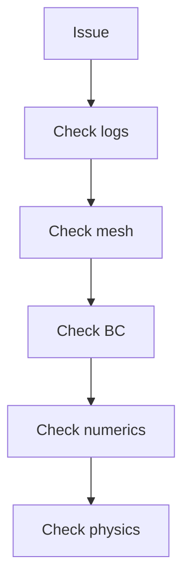

# Debugging and Troubleshooting

การ Debug และแก้ไขปัญหา

---

## Overview

> Systematic approach to **finding and fixing** issues

---

## 1. Common Issues

| Symptom | Likely Cause |
|---------|--------------|
| Divergence | CFL, BC, mesh |
| Wrong result | BC, scheme, model |
| Crash | Memory, divide by 0 |
| Slow | Mesh, solver settings |

---

## 2. Debugging Steps



<!-- IMAGE: IMG_08_005 -->
<!-- 
Purpose: เพื่อเสนอแผนที่นำทาง (Roadmap) สำหรับการแก้ปัญหา Simulation พัง (Divergence/Crash). ภาพนี้ต้องแยกแยะอาการให้ออก: 1. พังทันที (Setup ผิด) 2. พังกลางทาง (Numerics/Physics) 3. ผลลัพธ์ผิด (Model/BCs). และเสนอวิธีแก้ในแต่ละกิ่ง
Prompt: "Troubleshooting Decision Tree for OpenFOAM. **Root Node:** 'Simulation Fails'. **Branch 1:** 'Dies Immediately' $\rightarrow$ Action: Check `0/`, `system/`, Syntax. **Branch 2:** 'Diverges (NaN) at Time > 0' $\rightarrow$ Action: Check CFL, Mesh Quality (`checkMesh`), Schemes. **Branch 3:** 'Runs but Results Wrong' $\rightarrow$ Action: Check Physics Model, Boundary Conditions, Units. **Tools Icon:** Magnifying glass over Log File. STYLE: Decision Tree Flowchart, clean connectors, actionable steps."
-->


---

## 3. Log Analysis

```bash
# Check for errors
grep -i "error\|warning\|fail" log.simpleFoam

# Check residuals
foamLog log.simpleFoam
gnuplot logs/p_0
```

---

## 4. Debug Build

```bash
# Compile with debug
export WM_COMPILE_OPTION=Debug
wclean && wmake

# Run with backtrace
gdb --args simpleFoam -case myCase
run
bt  # Backtrace on crash
```

---

## 5. Common Fixes

### Divergence

```cpp
// Lower relaxation
relaxationFactors
{
    U   0.5;    // Was 0.7
    p   0.3;
}
```

### Floating Point Exception

```cpp
// Protect division
result = a / (b + SMALL);
```

### Memory Error

```bash
# Check with valgrind
valgrind --leak-check=full simpleFoam
```

---

## 6. Profiling

```bash
# Time profiling
time simpleFoam > log

# CPU profiling
perf record simpleFoam
perf report
```

---

## Quick Troubleshooting

| Problem | Check |
|---------|-------|
| Diverges | Residuals, CFL |
| Crashes | Debug build, logs |
| Wrong result | BC, model |
| Slow | Mesh, solver |

---

## Concept Check

<details>
<summary><b>1. Divergence เกิดจากอะไร?</b></summary>

**CFL too high**, bad mesh, wrong BC
</details>

<details>
<summary><b>2. Debug build ช่วยอะไร?</b></summary>

**Better error messages** และ works with gdb
</details>

<details>
<summary><b>3. valgrind ใช้ทำอะไร?</b></summary>

**Detect memory errors** — leaks, invalid access
</details>

---

## Related Documents

- **ภาพรวม:** [../05_QA_AUTOMATION_PROFILING/00_Overview.md](../05_QA_AUTOMATION_PROFILING/00_Overview.md)
- **Profiling:** [01_Performance_Profiling.md](01_Performance_Profiling.md)