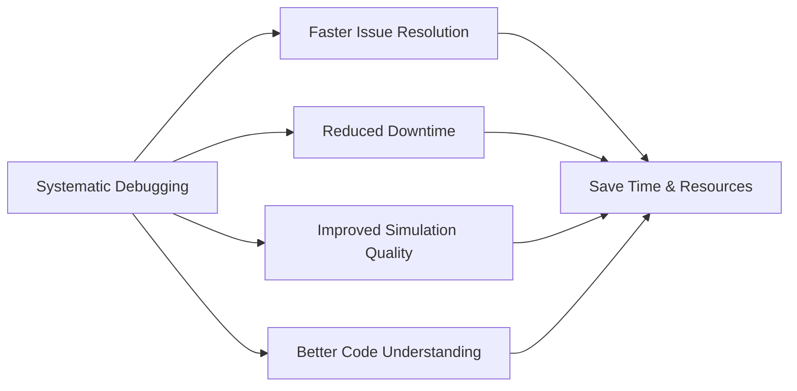
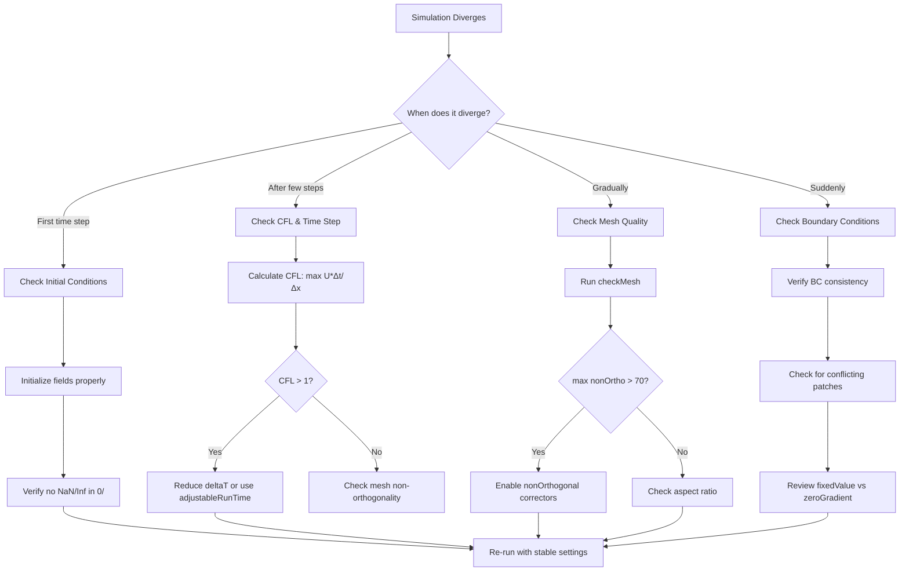
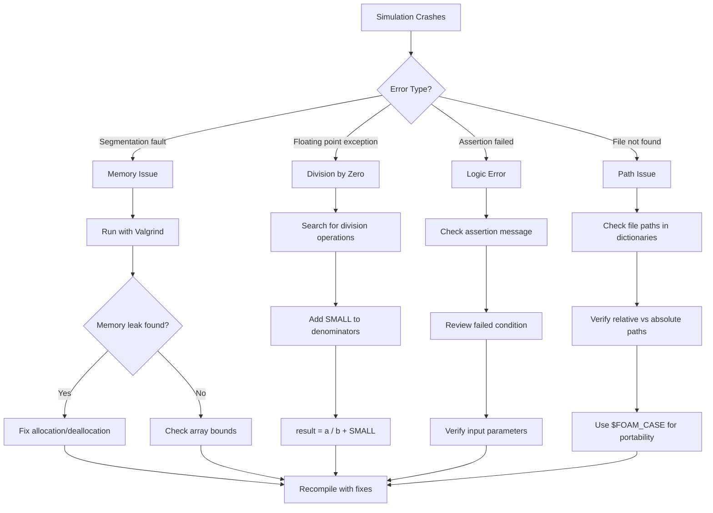
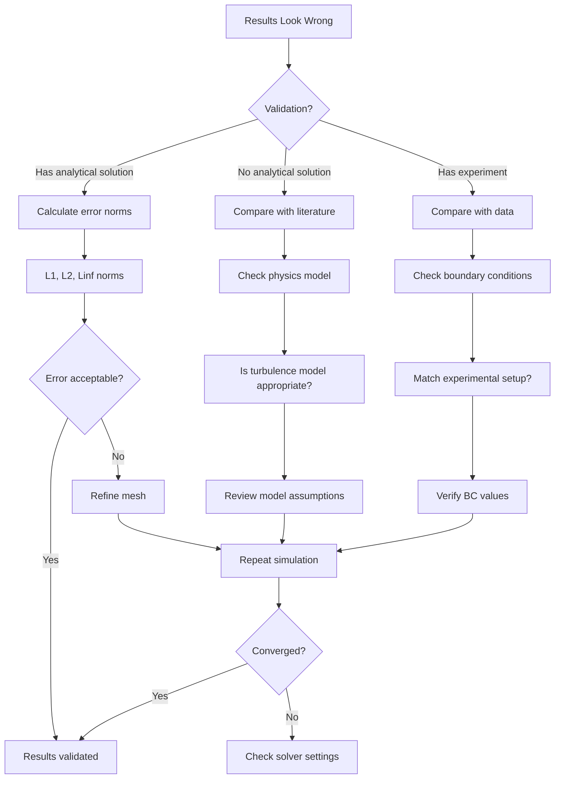
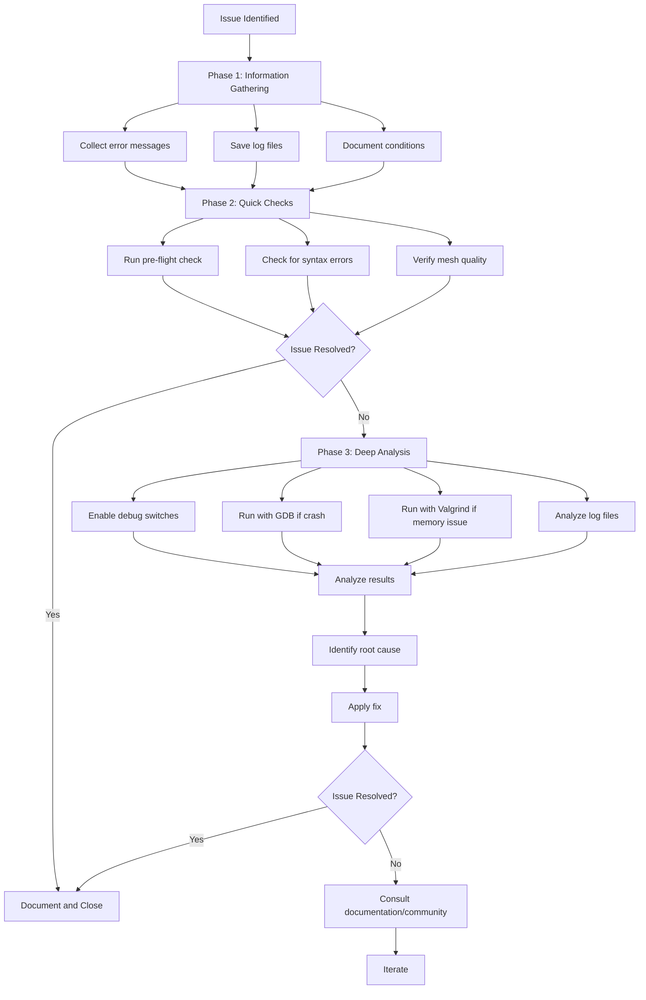

# Debugging and Troubleshooting

การ Debug และแก้ไขปัญหา

---

## Learning Objectives

**หลักการและเป้าหมายการเรียนรู้**

After completing this module, you will be able to:

| **Objective** | **Thai Translation** |
|---------------|---------------------|
| Identify systematic debugging workflows for OpenFOAM simulations | การระบุขั้นตอนการ debug อย่างเป็นระบบสำหรับการจำลอง OpenFOAM |
| Apply DebugSwitches for detailed solver diagnostics | การใช้ DebugSwitches สำหรับการวินิจฉัย solver ระดับละเอียด |
| Use GDB and Valgrind for memory and crash analysis | การใช้ GDB และ Valgrind สำหรับการวิเคราะห์ memory และ crash |
| Interpret log files and error messages effectively | การตีความ log files และ error messages อย่างมีประสิทธิภาพ |
| Implement pre-test checklists to prevent common issues | การนำ check list ก่อนทดสอบไปใช้เพื่อป้องกันปัญหาทั่วไป |

---

## Overview

> Systematic approach to **finding and fixing** issues

### What is Debugging and Troubleshooting? | การ Debug และแก้ไขปัญหาคืออะไร?

**Debugging** is the systematic process of identifying, isolating, and resolving errors in CFD simulations. **Troubleshooting** provides structured methodologies to diagnose simulation failures, convergence problems, and incorrect results.

**การ Debug** คือกระบวนการที่เป็นระบบในการระบุ แยกส่วน และแก้ไขข้อผิดพลาดในการจำลอง CFD **การแก้ไขปัญหา** มอบวิธีการที่เป็นโครงสร้างในการวินิจฉัยความล้มเหลวของการจำลอง ปัญหาการลู่เข้า และผลลัพธ์ที่ไม่ถูกต้อง

### Why is Systematic Debugging Essential? | ทำไมการ Debug อย่างเป็นระบบจึงสำคัญ?



**Benefits:**
- **Faster diagnosis** - Structured approach reduces trial-and-error
- **Preventive measures** - Learn patterns to avoid future issues
- **Skill development** - Deepens understanding of OpenFOAM internals

**ประโยชน์:**
- **การวินิจฉัยที่เร็วขึ้น** - แนวทางที่เป็นโครงสร้างลดการทดลองผิดพลาด
- **มาตรการป้องกัน** - เรียนรู้รูปแบบเพื่อหลีกเลี่ยงปัญหาในอนาคต
- **การพัฒนาทักษะ** - ทำความเข้าใจ OpenFOAM ระดับลึกซึ้งยิ่งขึ้น

### How to Debug Effectively? | การ Debug อย่างมีประสิทธิภาพ

The **3-Phase Debugging Framework**:

**กรอบการ Debug 3 ระยะ:**

1. **Preparation Phase** - Gather information, check prerequisites
2. **Diagnosis Phase** - Isolate the problem, identify root cause
3. **Resolution Phase** - Apply fix, verify solution, document findings

---

## 1. Pre-Test Checklist | รายการตรวจสอบก่อนทดสอบ

### 1.1 Essential Pre-Run Checks | การตรวจสอบพื้นฐานก่อนรัน

**Complete this checklist BEFORE running any simulation:**

**ทำรายการตรวจสอบนี้ให้ครบก่อนรันการจำลองใดๆ:**

```bash
#!/bin/bash
# preflight_check.sh - OpenFOAM Pre-Test Checklist

echo "=== OpenFOAM Pre-Test Checklist ==="

# 1. Check case directory structure
echo "[1/8] Checking directory structure..."
for dir in 0 constant system; do
    if [ ! -d "$dir" ]; then
        echo "❌ ERROR: Missing $dir/ directory"
        exit 1
    fi
done
echo "✓ Directory structure OK"

# 2. Check mesh quality
echo "[2/8] Checking mesh quality..."
if ! checkMesh > mesh_check.log 2>&1; then
    echo "⚠️  WARNING: Mesh issues detected"
    grep -E "Failed|Error" mesh_check.log || true
else
    echo "✓ Mesh OK"
fi

# 3. Check boundary conditions syntax
echo "[3/8] Checking boundary condition syntax..."
if ! foamDictionaryEntries 0/* > /dev/null 2>&1; then
    echo "❌ ERROR: BC syntax errors detected"
else
    echo "✓ BC syntax OK"
fi

# 4. Check fvSolution/fvSchemes
echo "[4/8] Checking numerics dictionaries..."
for file in system/fvSchemes system/fvSolution; do
    if [ ! -f "$file" ]; then
        echo "❌ ERROR: Missing $file"
    else
        echo "✓ Found $file"
    fi
done

# 5. Verify decomposePar (if parallel)
echo "[5/8] Checking parallel setup..."
if [ -f "system/decomposeParDict" ]; then
    nproc=$(foamDictionary -entry numberOfSubdomains -value system/decomposeParDict)
    echo "✓ Parallel: $nproc processors"
else
    echo "✓ Serial run"
fi

# 6. Check available memory
echo "[6/8] Checking memory..."
free_mem=$(free -h | awk '/^Mem:/{print $7}')
echo "Available memory: $free_mem"

# 7. Verify solver exists
echo "[7/8] Checking solver availability..."
solver=$(foamDictionary -entry application -value system/controlDict)
if ! command -v $solver &> /dev/null; then
    echo "⚠️  WARNING: Solver $solver not in PATH"
else
    echo "✓ Solver: $solver"
fi

# 8. Check disk space
echo "[8/8] Checking disk space..."
disk_free=$(df -h . | awk 'NR==2{print $4}')
echo "Available disk: $disk_free"

echo "=== Pre-flight check complete ==="
```

### 1.2 Common Pre-Run Issues | ปัญหาทั่วไปก่อนรัน

| **Check Item** | **Common Issue** | **Quick Fix** |
|----------------|------------------|---------------|
| Mesh quality | Non-orthogonality > 70° | Remesh or use non-orthogonal correctors |
| Time step | CFL > 1 in transient | Reduce `deltaT` or use adjustable time |
| Boundary conditions | Inconsistent patches | Verify all BCs are physically consistent |
| Initial conditions | Zero gradients everywhere | Initialize with reasonable field values |
| Memory | Insufficient RAM | Reduce mesh or run on more cores |

**Thai Translation:**

| **รายการตรวจสอบ** | **ปัญหาทั่วไป** | **การแก้ไขเบื้องต้น** |
|-------------------|-------------------|-------------------|
| คุณภาพ mesh | Non-orthogonality > 70° | สร้าง mesh ใหม่หรือใช้ non-orthogonal correctors |
| ขั้นเวลา | CFL > 1 ในการจำลองไม่คงที่ | ลด `deltaT` หรือใช้ adjustable time |
| เงื่อนไขขอบ | Patches ไม่สอดคล้องกัน | ตรวจสอบว่า BCs ทั้งหมดสอดคล้องทางฟิสิกส์ |
| เงื่อนไขเริ่มต้น | Gradient เป็นศูนย์ทั่วไป | กำหนดค่าเริ่มต้นด้วยค่า field ที่เหมาะสม |
| หน่วยความจำ | RAM ไม่เพียงพอ | ลด mesh หรือรันบน cores มากขึ้น |

---

## 2. DebugSwitches and Logging | DebugSwitches และ Logging

### 2.1 What are DebugSwitches? | DebugSwitches คืออะไร?

**DebugSwitches** control the verbosity of OpenFOAM output, enabling detailed logging of solver internals, matrix operations, and iterative solver behavior.

**DebugSwitches** ควบคุมความละเอียดของผลลัพธ์ OpenFOAM เปิดใช้งาน logging รายละเอียดของภายใน solver การดำเนินการเมทริกซ์ และพฤติกรรมของ iterative solver

### 2.2 Enabling DebugSwitches | การเปิดใช้งาน DebugSwitches

**Method 1: Environment Variables**

```bash
# Enable general debugging (0-3, higher = more verbose)
export FOAMSetNProcs=4  # For parallel debugging

# Enable specific debug levels
export DebugSwitch=1
```

**Method 2: `etc/controlDict`**

```cpp
// $WM_PROJECT/etc/controlDict
DebugSwitches
{
    // 0 = No debug (default)
    // 1 = Basic info
    // 2 = Detailed info
    // 3 = Maximum verbosity
    
    // General debugging
    DebugSwitch      2;
    
    // Specific module debugging
    lduMatrix        2;    // Matrix operations
    boundaryCondition 2;   // BC evaluation
    fvSchemes        1;    // Discretization schemes
    
    // Solvers
    GAMGSolver       1;    // GAMG solver details
    PBiCGStab        1;    // PBiCGStab solver details
    
    // Mesh
    polyMesh         1;    // Mesh operations
    
    // Parallel
    Pstream          1;    // Parallel communication
}
```

### 2.3 Practical DebugSwitch Examples | ตัวอย่างการใช้ DebugSwitches จริง

**Example 1: Debugging Convergence Issues**

```bash
# Enable solver debugging
export FOAM_WARNINGS=1
export FOAM_SIGFPE=1  # Catch floating point exceptions

# Run with detailed output
simpleFoam 2>&1 | tee debug_run.log

# Search for specific patterns
grep -i "solver\|residual\|iteration" debug_run.log
```

**Example 2: Matrix Operation Debugging**

```cpp
// In etc/controlDict
DebugSwitches
{
    lduMatrix        3;    // Maximum detail
    GAMGSolver       3;
}

// Output shows:
// - Matrix assembly details
// - Preconditioner setup
// - Iteration-by-iteration residuals
// - Agglomeration patterns
```

**Example 3: Boundary Condition Debugging**

```bash
# Enable BC debugging
foamDebug -boundaryConditions

# Run simulation
pimpleFoam

# Check BC evaluation
grep -A 5 "patch.*U" log.pimpleFoam
```

### 2.4 Log File Analysis Strategy | กลยุทธ์การวิเคราะห์ Log Files

```bash
#!/bin/bash
# log_analyzer.sh - Comprehensive log analysis

LOG_FILE=${1:-log.simpleFoam}

echo "=== OpenFOAM Log Analyzer ==="

# 1. Check for errors
echo "[1] Checking errors..."
grep -i "error\|fail\|fatal" $LOG_FILE | head -20

# 2. Check for warnings
echo "[2] Checking warnings..."
grep -i "warning" $LOG_FILE | head -20

# 3. Extract final residuals
echo "[3] Final residuals..."
grep "Final residual" $LOG_FILE | tail -10

# 4. Check time step info
echo "[4] Time step stats..."
grep "Time = " $LOG_FILE | head -5
grep "Time = " $LOG_FILE | tail -5

# 5. Execution time summary
echo "[5] Execution time..."
grep -E "ExecutionTime|ClockTime" $LOG_FILE | tail -5

# 6. Check for NaN/Inf
echo "[6] Checking for invalid values..."
grep -i "nan\|inf\|infinity" $LOG_FILE

# 7. Solver statistics
echo "[7] Solver iterations..."
grep "solver iterations" $LOG_FILE | tail -10
```

---

## 3. GDB Debugging | การ Debug ด้วย GDB

### 3.1 What is GDB? | GDB คืออะไร?

**GDB** (GNU Debugger) is a powerful tool for debugging compiled programs. It allows you to:
- Stop execution at breakpoints
- Examine variable values
- Step through code line-by-line
- Analyze crash locations and stack traces

**GDB** (GNU Debugger) เป็นเครื่องมือที่ทรงพลังสำหรับการ debug โปรแกรมที่คอมไพล์แล้ว ช่วยให้คุณ:
- หยุดการดำเนินการที่ breakpoints
- ตรวจสอบค่าตัวแปร
- ทำงานทีละบรรทัด
- วิเคราะห์ตำแหน่ง crash และ stack traces

### 3.2 Building for Debugging | การ Build สำหรับ Debugging

```bash
# Method 1: Set compile option
export WM_COMPILE_OPTION=Debug
wclean
wmake

# Method 2: Debug-specific build (more symbols, less optimization)
export WM_COMPILE_OPTION=Opt
export DEBUG=1
wmake

# Verify debug symbols
file $FOAM_APPBIN/simpleFoam
# Should show: "with debug_info" or "not stripped"
```

### 3.3 Basic GDB Workflow | ขั้นตอน GDB พื้นฐาน

**Scenario 1: Debugging a Crash**

```bash
# Run with GDB
gdb --args simpleFoam -case myCase

# Inside GDB:
(gdb) run                          # Start program
(gdb) bt                           # Show backtrace (call stack)
(gdb) frame 0                      # Go to crash frame
(gdb) list                         # Show source code
(gdb) print variable_name          # Print variable value
(gdb) info locals                  # Show all local variables
(gdb) quit                         # Exit GDB
```

**Scenario 2: Breakpoint Debugging**

```bash
gdb --args pimpleFoam

(gdb) break main                   # Set breakpoint at main
(gdb) break pimpleNoLoopControl.C:123  # Set at specific file:line
(gdb) condition 1 time > 0.5       # Conditional breakpoint

(gdb) run                          # Run until breakpoint
(gdb) next                         # Next line (step over)
(gdb) step                         # Next line (step into)
(gdb) continue                     # Continue to next breakpoint

(gdb) watch fieldName              # Watch variable changes
(gdb) display fieldName            # Show variable at each stop
```

### 3.4 Advanced GDB Techniques | เทคนิค GDB ขั้นสูง

**Core File Analysis (Post-Mortem Debugging)**

```bash
# Enable core dumps
ulimit -c unlimited

# Run until crash
simpleFoam

# Analyze core dump
gdb $FOAM_APPBIN/simpleFoam core

# Inside GDB:
(gdb) bt full                      # Full backtrace with local variables
(gdb) info threads                 # Show all threads
(gdb) thread apply all bt          # Backtrace all threads
```

**Parallel Debugging**

```bash
# Debug specific processor
mpirun -np 4 xterm -e gdb --args simpleFoam -parallel

# Or attach to running process
mpirun -np 4 simpleFoam -parallel &
ps aux | grep simpleFoam          # Find PID
gdb -p PID                         # Attach debugger
```

**Useful GDB Commands Summary**

| **Command** | **Description** | **Thai** |
|-------------|-----------------|----------|
| `run` or `r` | Start program | เริ่มโปรแกรม |
| `bt` or `where` | Show backtrace | แสดง backtrace |
| `frame N` | Switch to stack frame N | สลับไปยัง stack frame N |
| `up` / `down` | Move up/down stack | เลื่อนขึ้น/ลง stack |
| `print var` | Print variable value | แสดงค่าตัวแปร |
| `info locals` | Show local variables | แสดง local variables |
| `info args` | Show function arguments | แสดง arguments ของฟังก์ชัน |
| `list` | Show source code | แสดง source code |
| `break func` | Set breakpoint at function | ตั้ง breakpoint ที่ฟังก์ชัน |
| `condition N expr` | Conditional breakpoint | breakpoint แบบมีเงื่อนไข |
| `watch var` | Watch variable for changes | เฝ้าดูการเปลี่ยนแปลงของตัวแปร |
| `continue` or `c` | Continue execution | ดำเนินการต่อ |
| `next` or `n` | Next line (step over) | บรรทัดถัดไป (step over) |
| `step` or `s` | Next line (step into) | บรรทัดถัดไป (step into) |
| `finish` | Run until current function returns | รันจนกว่าฟังก์ชันจะ return |

---

## 4. Valgrind Memory Analysis | การวิเคราะห์ Memory ด้วย Valgrind

### 4.1 What is Valgrind? | Valgrind คืออะไร?

**Valgrind** is a memory debugging tool that detects:
- Memory leaks (allocated but not freed)
- Invalid memory access (out-of-bounds, use-after-free)
- Undefined values (uninitialized variables)
- Memory corruption

**Valgrind** เป็นเครื่องมือ debug memory ที่ตรวจจับ:
- Memory leaks (จองแต่ไม่คืน)
- การเข้าถึง memory ไม่ถูกต้อง (out-of-bounds, use-after-free)
- ค่าที่ไม่ได้กำหนด (uninitialized variables)
- ความเสียหายของ memory

### 4.2 Basic Valgrind Usage | การใช้งาน Valgrind พื้นฐาน

```bash
# Basic leak check
valgrind --leak-check=full \
         --show-leak-kinds=all \
         --track-origins=yes \
         --log-file=valgrind.log \
         simpleFoam -case myCase

# Analyze results
cat valgrind.log
```

**Output Interpretation:**

```
==12345== HEAP SUMMARY:
==12345==     in use at exit: 72,704 bytes in 1,023 blocks
==12345==   total heap usage: 1,234 allocs, 211 frees, 456,789 bytes allocated

==12345== 72,704 bytes in 1,023 blocks are definitely lost
==12345==    at 0x4C2DB8F: malloc (vg_replace_malloc.c:309)
==12345==    by 0x1234567: Foam::GeometricField<...>::GeometricField()
==12345==    by 0x2345678: main
```

### 4.3 Advanced Valgrind Tools | เครื่องมือ Valgrind ขั้นสูง

**Memcheck (Default)**

```bash
# Detect memory errors
valgrind --tool=memcheck \
         --leak-check=full \
         --show-reachable=yes \
         --suppressions=$FOAM_ETC/openfoam-valgrind.supp \
         interFoam
```

**Massif (Heap Profiling)**

```bash
# Profile memory usage over time
valgrind --tool=massif \
         --massif-out-file=massif.out \
         --time-unit=B \
         simpleFoam

# Visualize
ms_print massif.out | less
```

**Callgrind (Call Graph Profiler)**

```bash
# Profile function calls
valgrind --tool=callgrind \
         --callgrind-out-file=callgrind.out \
         pimpleFoam

# Analyze with KCachegrind (GUI)
kcachegrind callgrind.out
```

### 4.4 Interpreting Common Valgrind Errors | การตีความข้อผิดพลาด Valgrind ทั่วไป

| **Error Type** | **Meaning** | **Common Cause** | **Fix** |
|----------------|-------------|-------------------|---------|
| **Invalid read** | Reading from invalid memory | Out-of-bounds array access | Check array indices |
| **Invalid write** | Writing to invalid memory | Buffer overflow | Verify buffer sizes |
| **Definitely lost** | Memory leak | Allocated but not freed | Add delete/destructor |
| **Still reachable** | Memory not freed at exit | Global/static pointers | Usually OK, but check |
| **Conditional jump** | Depends on uninitialized value | Using uninitialized variable | Initialize all variables |
| **Use of uninit value** | Using uninitialized data | Uninitialized memory read | Initialize before use |

**Thai Translation:**

| **ประเภทข้อผิดพลาด** | **ความหมาย** | **สาเหตุทั่วไป** | **การแก้ไข** |
|---------------------|-------------------|---------------------|---------------------|
| **Invalid read** | อ่านจาก memory ไม่ถูกต้อง | เข้าถึง array เกินขอบเขต | ตรวจสอบ indices |
| **Invalid write** | เขียนไปยัง memory ไม่ถูกต้อง | Buffer overflow | ตรวจสอบขนาด buffer |
| **Definitely lost** | Memory leak | จองแต่ไม่คืน | เพิ่ม delete/destructor |
| **Still reachable** | Memory ไม่ถูกคืนเมื่อออก | Global/static pointers | ปกติ OK แต่ควรตรวจสอบ |
| **Conditional jump** | ขึ้นกับค่าที่ไม่ได้กำหนด | ใช้ตัวแปรที่ไม่ได้ initialize | Initialize ทุกตัวแปร |
| **Use of uninit value** | ใช้ข้อมูลที่ไม่ได้กำหนด | อ่าน uninit memory | Initialize ก่อนใช้ |

---

## 5. Troubleshooting Decision Trees | แผนผังการตัดสินใจแก้ปัญหา

### 5.1 Simulation Divergence Troubleshooting | การแก้ปัญหาการ Divergence



### 5.2 Crash and Segfault Troubleshooting | การแก้ปัญหา Crash และ Segfault



### 5.3 Wrong Results Troubleshooting | การแก้ปัญหาผลลัพธ์ผิด



---

## 6. Common Issues and Quick Fixes | ปัญหาทั่วไปและการแก้ไขเบื้องต้น

### 6.1 Issue Classification | การจำแนกปัญหา

| **Symptom** | **Likely Cause** | **Thai** |
|-------------|------------------|----------|
| Divergence | CFL, BC, mesh quality | Divergence | CFL, BC, คุณภาพ mesh |
| Wrong result | BC, scheme, model selection | ผลลัพธ์ผิด | BC, scheme, การเลือก model |
| Crash (segfault) | Memory error, divide by zero | Crash | ข้อผิดพลาด memory, หารด้วยศูนย์ |
| Slow convergence | Mesh, solver settings, relaxation | ลู่เข้าช้า | Mesh, การตั้งค่า solver, relaxation |
| Memory overflow | Mesh too large, inefficient storage | Memory ล้น | Mesh ใหญ่เกินไป, เก็บข้อมูลไม่มีประสิทธิภาพ |
| NaN results | Invalid operations, unstable numerics | ผลลัพธ์ NaN | การดำเนินการไม่ถูกต้อง, numerics ไม่เสถียร |

### 6.2 Divergence Fixes | การแก้ไข Divergence

**Symptoms:**
- Residuals increase instead of decreasing
- `NaN` or `inf` values in fields
- Solver exits with "continuity error"

**Quick Fixes:**

```cpp
// 1. Reduce relaxation factors (in system/fvSolution)
relaxationFactors
{
    fields
    {
        p   0.3;    // Reduce from 0.7
        rho 0.05;
    }
    equations
    {
        U   0.5;    // Reduce from 0.7
        k   0.5;
        epsilon 0.5;
    }
}

// 2. Add under-relaxation to equations
solvers
{
    p
    {
        solver          GAMG;
        tolerance       1e-06;
        relTol          0.1;    // Reduce from 0.01
    }
}

// 3. Enable bounded schemes
schemes
{
    div(phi,U)      bounded Gauss linearUpwindV grad(U);
}
```

### 6.3 Floating Point Exception Fixes | การแก้ไข Floating Point Exception

**Symptoms:**
- "Floating point exception" error
- Crash with SIGFPE signal
- Calculation produces `inf` or `NaN`

**Quick Fixes:**

```cpp
// 1. Add SMALL to divisions (OpenFOAM provides this constant)
result = a / (b + SMALL);

// 2. Protect against zero values
if (mag(b) < SMALL)
{
    result = 0.0;
}
else
{
    result = a / b;
}

// 3. Use max() to prevent negative values
positiveValue = max(calculatedValue, dimensionedScalar("zero", dimless, 0.0));

// 4. Clamp values
scalar val = ...;
val = min(max(val, 0.0), 1.0);  // Clamp to [0, 1]
```

### 6.4 Memory Error Fixes | การแก้ไขข้อผิดพลาด Memory

**Symptoms:**
- Segmentation fault (segfault)
- Out of memory error
- Slow performance due to swapping

**Quick Fixes:**

```bash
# 1. Reduce memory footprint
decomposePar                         # Use parallel
mpirun -np 4 simpleFoam -parallel

# 2. Check for memory leaks
valgrind --leak-check=full simpleFoam

# 3. Use more efficient solvers
// In system/fvSolution:
solvers
{
    p
    {
        solver          GAMG;       // More memory-efficient than ICCG
    }
}

# 4. Optimize mesh
refineMesh -overwrite               # Don't over-refine
checkMesh -writeAllRegions          # Identify problematic regions
```

---

## 7. Debugging Workflow Summary | สรุปขั้นตอน Debugging

### 7.1 Complete Debugging Checklist | รายการตรวจสอบ Debugging แบบครบถ้วน



### 7.2 Best Practices | แนวปฏิบัติที่ดีที่สุด

1. **Save Everything** - Keep logs, core dumps, case files
2. **Document Changes** - Track what you've tried
3. **Isolate Variables** - Change one thing at a time
4. **Use Version Control** - Git helps revert problematic changes
5. **Reproduce Issues** - Confirm bugs before attempting fixes
6. **Start Simple** - Verify on minimal case before complex simulations

**Thai:**

1. **บันทึกทุกอย่าง** - เก็บ logs, core dumps, case files
2. **บันทึกการเปลี่ยนแปลง** - ติดตามสิ่งที่คุณลอง
3. **แยกตัวแปร** - เปลี่ยนทีละอย่าง
4. **ใช้ version control** - Git ช่วย revert การเปลี่ยนแปลงที่มีปัญหา
5. **ทำซ้ำปัญหา** - ยืนยัน bugs ก่อนพยายามแก้ไข
6. **เริ่มต้นแบบง่าย** - ตรวจสอบบนกรณีขั้นต่ำก่อนการจำลองที่ซับซ้อน

---

## 8. OpenFOAM Context | บริบท OpenFOAM

### DebugSwitches Reference | อ้างอิง DebugSwitches

**Key DebugSwitch Locations:**
- `$WM_PROJECT/etc/controlDict` - Global settings
- `~/.OpenFOAM/$WM_PROJECT_VERSION/controlDict` - User settings
- `case/system/controlDict` - Case-specific settings

**Common DebugSwitch Values:**

| **Module** | **Switch** | **Purpose** |
|------------|------------|-------------|
| Matrix operations | `lduMatrix` | Debug solver iterations |
| Boundary conditions | `boundaryCondition` | Trace BC evaluation |
| Parallel communication | `Pstream` | Debug MPI transfers |
| Mesh operations | `polyMesh` | Track mesh changes |
| Discretization | `fvSchemes` | Debug scheme application |
| Time integration | `Time` | Debug time stepping |

### Common Debug Commands | คำสั่ง Debug ทั่วไป

```bash
# Check OpenFOAM environment
echo $WM_PROJECT_USER_DIR
echo $FOAM_RUN
echo $FOAM_TUTORIALS

# Find source code for a class
foamList -className=lduMatrix

# Check compiled symbols
nm -C $FOAM_APPBIN/simpleFoam | grep -i debug

# View library dependencies
ldd $FOAM_APPBIN/simpleFoam

# Check OpenFOAM version
echo $WM_PROJECT_VERSION
```

---

## Key Takeaways | สรุปสิ่งสำคัญ

**Essential Points to Remember:**

1. **Systematic Approach** - Follow the 3-phase framework: Preparation → Diagnosis → Resolution
2. **Pre-Flight Checks** - Always verify mesh, BCs, and settings before running
3. **Use DebugSwitches** - Enable detailed logging to understand solver internals
4. **GDB for Crashes** - Compile with Debug symbols and use GDB for crash analysis
5. **Valgrind for Memory** - Detect leaks and invalid memory access with Valgrind
6. **Document Everything** - Keep logs, track changes, and note what works
7. **Isolate Variables** - Change one parameter at a time to identify causes
8. **Check the Basics** - Many issues stem from mesh quality, CFL, and BC problems

**สรุปสิ่งสำคัญที่ต้องจำ:**

1. **แนวทางเป็นระบบ** - ทำตามกรอบ 3 ระยะ: การเตรียมการ → การวินิจฉัย → การแก้ไข
2. **การตรวจสอบก่อนรัน** - ตรวจสอบ mesh, BCs, และการตั้งค่าเสมอก่อนรัน
3. **ใช้ DebugSwitches** - เปิดใช้งาน logging รายละเอียดเพื่อเข้าใจภายใน solver
4. **GDB สำหรับ Crashes** - คอมไพล์ด้วย Debug symbols และใช้ GDB สำหรับการวิเคราะห์ crash
5. **Valgrind สำหรับ Memory** - ตรวจจับ leaks และการเข้าถึง memory ไม่ถูกต้องด้วย Valgrind
6. **บันทึกทุกอย่าง** - เก็บ logs, ติดตามการเปลี่ยนแปลง, และบันทึกสิ่งที่ใช้ได้
7. **แยกตัวแปร** - เปลี่ยนพารามิเตอร์ทีละตัวเพื่อระบุสาเหตุ
8. **ตรวจสอบพื้นฐาน** - ปัญหาหลายอย่างมาจากคุณภาพ mesh, CFL, และปัญหา BC

---

## Concept Check | ทบทวนแนวคิด

<details>
<summary><b>1. What are the three phases of systematic debugging?</b><br>การ debug อย่างเป็นระบบมีสามระยะคืออะไร?</summary>

**Answer:** The three phases are:
1. **Preparation Phase** - Gather information and check prerequisites
2. **Diagnosis Phase** - Isolate the problem and identify root cause
3. **Resolution Phase** - Apply fix, verify solution, and document findings

**คำตอบ:** สามระยะคือ:
1. **ระยะเตรียมการ** - รวบรวมข้อมูลและตรวจสอบข้อกำหนดเบื้องต้น
2. **ระยะวินิจฉัย** - แยกปัญหาและระบุสาเหตุหลัก
3. **ระยะแก้ไข** - ใช้การแก้ไข ตรวจสอบวิธีแก้ และบันทึกข้อค้นพบ
</details>

<details>
<summary><b>2. How do DebugSwitches help diagnose solver issues?</b><br>DebugSwitches ช่วยวินิจฉัยปัญหา solver อย่างไร?</summary>

**Answer:** DebugSwitches control the verbosity of OpenFOAM output. They enable detailed logging of:
- Matrix operations and solver iterations
- Boundary condition evaluation
- Mesh operations and changes
- Parallel communication
- Time stepping details

Set them in `$WM_PROJECT/etc/controlDict` with levels 0-3 (higher = more verbose).

**คำตอบ:** DebugSwitches ควบคุมความละเอียดของผลลัพธ์ OpenFOAM พวกมันเปิดใช้งาน logging รายละเอียดของ:
- การดำเนินการเมทริกซ์และการวนซ้ำ solver
- การประเมินเงื่อนไขขอบ
- การดำเนินการและการเปลี่ยนแปลง mesh
- การสื่อสารแบบขนาน
- รายละเอียดการก้าวเวลา

ตั้งค่าใน `$WM_PROJECT/etc/controlDict` ด้วยระดับ 0-3 (สูงกว่า = ละเอียดกว่า)
</details>

<details>
<summary><b>3. When should you use GDB vs. Valgrind?</b><br>ควรใช้ GDB เมื่อไหร่เทียบกับ Valgrind?</summary>

**Answer:**

- **GDB** is used for debugging crashes and segmentation faults. It helps identify:
  - Where the crash occurred (backtrace)
  - Variable values at crash time
  - Call stack leading to the error

- **Valgrind** is used for memory analysis. It detects:
  - Memory leaks (allocated but not freed)
  - Invalid memory access (out-of-bounds, use-after-free)
  - Uninitialized variable usage
  - Memory corruption

Use **GDB** for crashes, use **Valgrind** for memory issues.

**คำตอบ:**

- **GDB** ใช้สำหรับ debug crashes และ segmentation faults ช่วยระบุ:
  - ตำแหน่งที่เกิด crash (backtrace)
  - ค่าตัวแปรเมื่อเกิด crash
  - กอง call stack ที่นำไปสู่ข้อผิดพลาด

- **Valgrind** ใช้สำหรับการวิเคราะห์ memory ตรวจจับ:
  - Memory leaks (จองแต่ไม่คืน)
  - การเข้าถึง memory ไม่ถูกต้อง (out-of-bounds, use-after-free)
  - การใช้ตัวแปรที่ไม่ได้กำหนด
  - ความเสียหายของ memory

ใช้ **GDB** สำหรับ crashes ใช้ **Valgrind** สำหรับปัญหา memory
</details>

<details>
<summary><b>4. What are the top three causes of simulation divergence?</b><br>สาเหตุหลัก 3 อย่างของการ divergence ของการจำลองคืออะไร?</summary>

**Answer:**

1. **CFL Number Too High** - Time step too large for velocity/mesh resolution
2. **Poor Mesh Quality** - High non-orthogonality, skewness, or aspect ratio
3. **Inconsistent Boundary Conditions** - Conflicting or physically incorrect BCs

**Quick Fixes:**
- Reduce `deltaT` or use `adjustableRunTime`
- Remesh or enable non-orthogonal correctors
- Verify all BCs are physically consistent

**คำตอบ:**

1. **CFL Number สูงเกินไป** - ขั้นเวลาใหญ่เกินไปสำหรับความละเอียดความเร็ว/mesh
2. **คุณภาพ Mesh ไม่ดี** - Non-orthogonality, skewness, หรือ aspect ratio สูง
3. **เงื่อนไขขอบไม่สอดคล้องกัน** - BCs ขัดแย้งหรือผิดทางฟิสิกส์

**การแก้ไขเบื้องต้น:**
- ลด `deltaT` หรือใช้ `adjustableRunTime`
- สร้าง mesh ใหม่หรือเปิดใช้ non-orthogonal correctors
- ตรวจสอบว่า BCs ทั้งหมดสอดคล้องทางฟิสิกส์
</details>

<details>
<summary><b>5. How can you protect against floating point exceptions?</b><br>คุณสามารถป้องกัน floating point exceptions ได้อย่างไร?</summary>

**Answer:**

```cpp
// 1. Add SMALL to denominators (OpenFOAM constant)
result = a / (b + SMALL);

// 2. Check magnitude before division
if (mag(b) < SMALL)
{
    result = 0.0;
}
else
{
    result = a / b;
}

// 3. Use max() to prevent negative values
value = max(calculatedValue, dimensionedScalar("zero", dimless, 0.0));

// 4. Clamp values to valid range
value = min(max(value, 0.0), 1.0);

// 5. Use sqrt() with safety
scalar safeSqrt = sqrt(max(val, 0.0));
```

**คำตอบ:**

```cpp
// 1. เพิ่ม SMALL ในตัวหาร (ค่าคงที่ OpenFOAM)
result = a / (b + SMALL);

// 2. ตรวจสอบขนาดก่อนหาร
if (mag(b) < SMALL)
{
    result = 0.0;
}
else
{
    result = a / b;
}

// 3. ใช้ max() เพื่อป้องกันค่าลบ
value = max(calculatedValue, dimensionedScalar("zero", dimless, 0.0));

// 4. จำกัดค่าให้อยู่ในช่วงที่ถูกต้อง
value = min(max(value, 0.0), 1.0);

// 5. ใช้ sqrt() อย่างปลอดภัย
scalar safeSqrt = sqrt(max(val, 0.0));
```
</details>

---

## Related Documents | เอกสารที่เกี่ยวข้อง

### Within Module 08

- **ภาพรวม:** [../05_QA_AUTOMATION_PROFILING/00_Overview.md](../05_QA_AUTOMATION_PROFILING/00_Overview.md)
- **Performance Profiling:** [01_Performance_Profiling.md](01_Performance_Profiling.md)
- **Regression Testing:** [02_Regression_Testing.md](02_Regression_Testing.md)
- **Validation Benchmarks:** [../04_VALIDATION_BENCHMARKS/00_Overview.md](../04_VALIDATION_BENCHMARKS/00_Overview.md)

### Cross-Reference

- **Debugging Builds:** [../../07_UTILITIES_AUTOMATION/CONTENT/05_PROFESSIONAL_PRACTICE/05_Testing_and_QA.md](../../07_UTILITIES_AUTOMATION/CONTENT/05_PROFESSIONAL_PRACTICE/05_Testing_and_QA.md)
- **Solver Development:** [../../05_OPENFOAM_PROGRAMMING/CONTENT/02_CODE_STRUCTURE_DEVELOPMENT/00_Overview.md](../../05_OPENFOAM_PROGRAMMING/CONTENT/02_CODE_STRUCTURE_DEVELOPMENT/00_Overview.md)

---

**Document Version:** 1.0  
**Last Updated:** 2025-12-31  
**Status:** ✅ Refactored - Comprehensive bilingual content with detailed GDB/Valgrind workflows, DebugSwitches examples, and troubleshooting decision trees