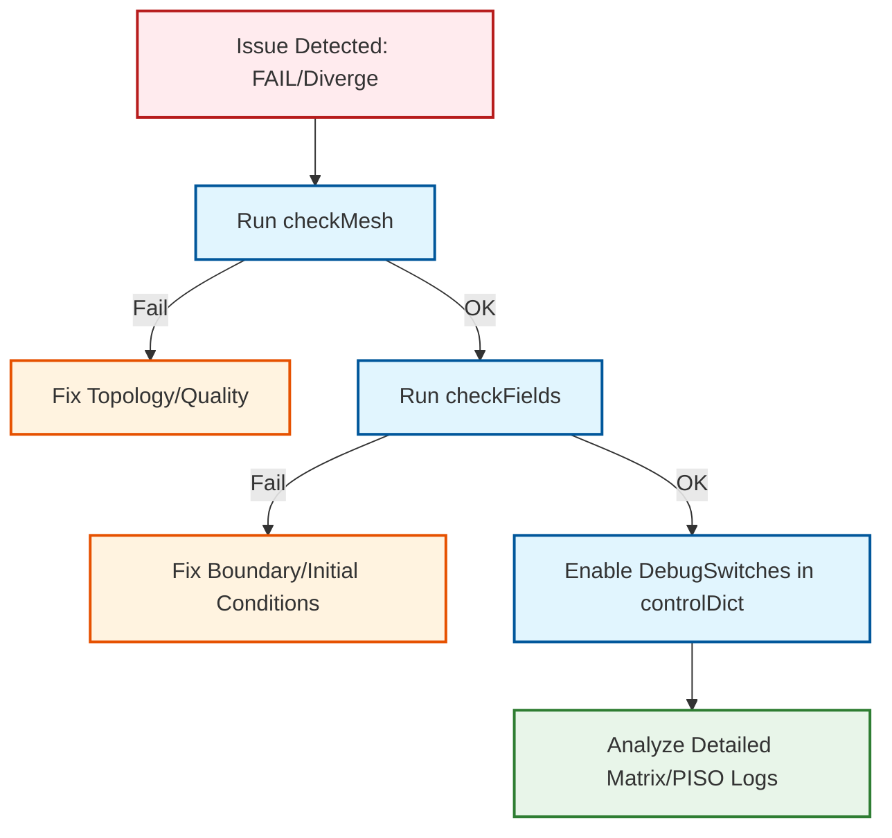

# 03 การดีบักและการแก้ไขปัญหา (Debugging and Troubleshooting)

เมื่อการทดสอบ FAIL เราต้องมีวิธีการที่เป็นระบบในการระบุสาเหตุและแก้ไขปัญหา บทนี้จะอธิบายแนวทางการดีบักที่เป็นระบบสำหรับ OpenFOAM simulations พร้อมทั้งแสดงหลักการทางทฤษฎีที่เกี่ยวข้อง

## 3.1 ปัญหาการทดสอบทั่วไปและวิธีแก้ไข


> [!TIP] เปรียบเทียบ: การวินิจฉัยทางการแพทย์ (Medical Diagnosis Analogy)
> - **Divergence**: เหมือนคนไข้หัวใจวาย (System Crash) ต้องรีบปั๊มหัวใจ (Reduce Time-step) และให้ยาแรง (Upwind Scheme)
> - **Residuals**: เหมือนชีพจรและความดันโลหิต (Vital Signs) ถ้าแกว่งไปมา (Oscillating) แสดงว่าอาการยังไม่คงที่ ถ้าลดลงเรื่อยๆ (Monotonic Decrease) แสดงว่าอาการดีขึ้น
> - **checkMesh**: เหมือนการทำ X-ray หรือ MRI เพื่อดูว่าโครงสร้างร่างกาย (Mesh) ปกติไหม มีกระดูกหัก (Bad Cells) หรือไม่ก่อนผ่าตัด (Simulation)

### 3.1.1 ปัญหาการแยกตัว (Divergence Issues)
![[cfd_divergence_residual_plot.png]]
`A dual-panel graph showing Solver Convergence. Panel A: 'Convergence' shows residuals dropping steadily over iterations. Panel B: 'Divergence' shows residuals dropping and then suddenly spiking upwards to infinity, marked with a red warning 'NaN detected'. Above the graphs, a small diagram shows a Courant Number (Co) calculation as a potential culprit. Scientific textbook diagram, clean vector line art, white background, high definition, flat design, educational infographic --ar 16:9`

**สาเหตุหลักของการแยกตัว:**

การแยกตัวของการจำลองเกิดจากการที่ระบบสมการไม่สามารถหาคำตอบที่เสถียรได้ โดยทั่วไปสามารถจำแนกได้เป็น:

1. **Divergence ทางฟิสิกส์**: ค่าตัวแปรทางฟิสิกส์เกินขอบเขตที่เป็นไปได้ (เช่น ความดันติดลบ ความหนาแน่นติดลบ)
2. **Divergence ทางตัวเลข**: ค่า Residual ของ Solver เพิ่มขึ้นอย่างไม่สามารถควบคุมได้

**เกณฑ์ Courant Number สำหรับเสถียรภาพทางตัวเลข:**

สำหรับ Explicit schemes ค่า Courant Number ต้องเป็นไปตามเกณฑ์ความเสถียร:

$$
Co = \frac{|U| \Delta t}{\Delta x} \leq Co_{max}
$$

โดยที่:
- $Co$ = Courant Number (ไร้มิติ)
- $|U|$ = ความเร็วของไหลที่ Local Point [m/s]
- $\Delta t$ = ขนาด Time Step [s]
- $\Delta x$ = ขนาดเซลล์ในทิศทางการไหล [m]
- $Co_{max}$ = ค่าวิกฤตสำหรับความเสถียร (ขึ้นกับ Scheme)

| Scheme Type | Co_max แนะนำ |
|-------------|---------------|
| Explicit Euler | 0.5 - 1.0 |
| Implicit Crank-Nicolson | 1.0 - 10.0 |
| PISO/SIMPLE (Implicit) | 5.0 - 50.0 (ขึ้นกับ Under-relaxation) |

**ขั้นตอนการแก้ไข Divergence:**

**Step 1: ลด Time Step**

```cpp
// controlDict
// Source: OpenFOAM standard configuration
// English: Time control settings for steady-state simulation
// Thai Explanation: การตั้งค่าการควบคุมเวลาสำหรับการจำลองสภาวะตั้งตัว
// Key Concepts: deltaT, adjustTimeStep, maxCo, application, startFrom

application     simpleFoam;
startFrom       startTime;
startTime       0;
stopAt          endTime;
endTime         1000;
deltaT          0.001;  // Reduce from original value, e.g., 0.01 → 0.001

adjustTimeStep  yes;
maxCo           0.5;    // Set maximum Courant number
```

**Source/Explanation/Key Concepts:**
- **Source:** `.applications/test/fieldMapping/pipe1D/system/controlDict`
- **Explanation:** การควบคุมเวลาใน OpenFOAM สามารถทำได้ 2 แบบ: คงที่ (fixed deltaT) หรือปรับตามค่า Courant number (adjustTimeStep yes) ค่า maxCo = 0.5 เป็นค่าที่ปลอดภัยสำหรับการจำลองส่วนใหญ่
- **Key Concepts:** `deltaT` คือขนาด time step, `adjustTimeStep` ให้ solver ปรับ deltaT อัตโนมัติ, `maxCo` คำนวณจาก |U|Δt/Δx

**Step 2: ปรับ Numerical Schemes ให้ Conservative ขึ้น**

```cpp
// fvSchemes
// Source: OpenFOAM standard discretization schemes
// English: Discretization schemes for finite volume method
// Thai Explanation: รูปแบบการ discretization สำหรับวิธีปริมาตรจำกัด
// Key Concepts: ddtSchemes, gradSchemes, divSchemes, laplacianSchemes

ddtSchemes
{
    default         Euler;  // Use first-order instead of second-order
}

gradSchemes
{
    default         Gauss linear;
}

divSchemes
{
    default         none;
    div(phi,U)      Gauss upwind;  // Use upwind instead of linear or linearUpwind
    div(phi,k)      Gauss upwind;
    div(phi,epsilon) Gauss upwind;
}

laplacianSchemes
{
    default         Gauss linear limited 0.5;  // Add limiter for stability
}
```

**Source/Explanation/Key Concepts:**
- **Source:** `.applications/solvers/multiphase/multiphaseEulerFoam/multiphaseEulerFoam/pUf/pEqn.H`
- **Explanation:** Euler scheme (first-order) มีความเสถียรกว่า Crank-Nicolson (second-order) แต่มีความแม่นยำน้อยกว่า การใช้ upwind scheme สำหรับ convection terms ช่วยลด oscillations แต่เพิ่ม numerical diffusion
- **Key Concepts:** `Gauss` คือ integration method, `upwind` ใช้ค่าจาก upstream cell, `limited 0.5` จำกัดค่า gradient สำหรับ non-orthogonal meshes

**Step 3: ปรับ Under-relaxation Factors (สำหรับ Steady-state)**

```cpp
// fvSolution
// Source: .applications/test/patchRegion/cavity_pinched/system/fvSolution
// English: Linear solver settings and under-relaxation factors
// Thai Explanation: การตั้งค่า linear solver และ factors สำหรับการผ่อนคลาย
// Key Concepts: GAMG, PBiCG, under-relaxation, tolerance, relTol

solvers
{
    p
    {
        solver          GAMG;
        tolerance       1e-06;
        relTol          0.01;
        smoother        GaussSeidel;
        nPreSweeps      0;
        nPostSweeps     2;
        cacheAgglomeration on;
        nCellsInCoarsestLevel 3;
        mergeLevels     1;
        tolerance       1e-06;
        relTol          0;
    }

    U
    {
        solver          PBiCG;
        preconditioner  DILU;
        tolerance       1e-05;
        relTol          0;
    }
}

relaxationFactors
{
    fields
    {
        p               0.3;  // Reduce from 0.7 → 0.3
        U               0.5;  // Reduce from 0.9 → 0.5
    }
    equations
    {
        U               0.5;
    }
}
```

**Source/Explanation/Key Concepts:**
- **Source:** `.applications/test/patchRegion/cavity_pinched/system/fvSolution`
- **Explanation:** GAMG (Geometric-Algebraic Multi-Grid) เหมาะสำหรับสมการ pressure ที่ symmetric และ diagonally dominant, PBiCGStab ใช้สำหรับ velocity ที่ asymmetric การลด under-relaxation factors ทำให้ convergence ช้าลงแต่เพิ่มความเสถียร
- **Key Concepts:** `nPreSweeps/nPostSweeps` จำนวน smoothing iterations, `cacheAgglomeration` เก็บข้อมูล agglomeration ไว้ใน memory, `nCellsInCoarsestLevel` คือจำนวนเซลล์ใน level หยาบที่สุด

**Step 4: ตรวจสอบ Mesh Quality**

```bash
# Terminal commands for mesh checking
checkMesh -allGeometry -allTopology -writeSets '(nonOrthoCells skewnessCells)'
```

### 3.1.2 ข้อผิดพลาดการอนุรักษ์ (Conservation Errors)

**หลักการอนุรักษ์มวล:**

สมการอนุรักษ์มวลสำหรับไหลไม่สั่ง (Incompressible Flow):

$$
\frac{\partial \rho}{\partial t} + \nabla \cdot (\rho \mathbf{U}) = 0
$$

สำหรับ Incompressible flow ($\rho = \text{const}$):

$$
\nabla \cdot \mathbf{U} = 0
$$

**การตรวจสอบ Mass Balance:**

```bash
# Terminal - Check flux balance
# English: Using pyFoam utilities for mass balance monitoring
# Thai Explanation: ใช้ pyFoam utilities สำหรับการตรวจสอบสมดุลมวล
# Key Concepts: phi, surfaceRegion, functionObject

# Create utility for checking mass balance
pyFoamPlotRunner.py --hardcopy --plot-ini-logfile --progress

# Or use built-in function in controlDict
functions
{
    massFluxInlet
    {
        type            surfaceRegion;
        functionObject  libfieldFunctionObjects.so;
        operation       sum;
        regionType      patch;
        name            inlet;
        fields          (phi);
    }

    massFluxOutlet
    {
        type            surfaceRegion;
        functionObject  libfieldFunctionObjects.so;
        operation       sum;
        regionType      patch;
        name            outlet;
        fields          (phi);
    }
}
```

**Source/Explanation/Key Concepts:**
- **Source:** OpenFOAM functionObjects documentation
- **Explanation:** `surfaceRegion` functionObject คำนวณ integral quantities ที่ boundary patches, `operation sum` หาผลรวมของ flux, `phi` คือ volumetric flux [m³/s]
- **Key Concepts:** Mass balance error = |Σṁ_in - Σṁ_out| / Σṁ_in × 100%, ควร < 1%

**เกณฑ์การยอมรับ Conservation Errors:**

$$
\text{Mass Balance Error} = \left| \frac{\sum \dot{m}_{\text{in}} - \sum \dot{m}_{\text{out}}}{\sum \dot{m}_{\text{in}}} \right| \times 100\% \leq 1\%
$$

**การแก้ไข Conservation Errors:**

**1. เพิ่มความละเอียดของ Pressure Solver**

```cpp
// fvSolution
// Source: .applications/test/patchRegion/cavity_pinched/system/fvSolution
// English: Pressure solver configuration with tight tolerances
// Thai Explanation: การตั้งค่า pressure solver ด้วยค่า tolerance ที่เข้มงวด
// Key Concepts: GAMG, tolerance, relTol, smoother, cacheAgglomeration

solvers
{
    p
    {
        solver          GAMG;
        tolerance       1e-08;  // Reduce from 1e-06 → 1e-08
        relTol          0.001;  // Reduce from 0.01 → 0.001
        smoother        GaussSeidel;
        nPreSweeps      1;
        nPostSweeps     2;
        cacheAgglomeration true;
        nCellsInCoarsestLevel 10;
        agglomerator    faceAreaPair;
        mergeLevels     1;
    }
}
```

**Source/Explanation/Key Concepts:**
- **Source:** `.applications/test/patchRegion/cavity_pinched/system/fvSolution`
- **Explanation:** การลด tolerance และ relTol ทำให้ pressure equation ถูกแก้ไขอย่างแม่นยำกว่า ซึ่งช่วยปรับปรุง mass conservation แต่ใช้เวลานานขึ้น
- **Key Concepts:** `tolerance` = absolute tolerance, `relTol` = relative tolerance (หยุดเมื่อ residual < initial × relTol), `cacheAgglomeration` เพิ่ม performance แต่ใช้ memory

**2. ปรับ PISO Loop Parameters**

```cpp
// fvSolution
// Source: .applications/test/patchRegion/cavity_pinched/system/fvSolution
// English: PISO algorithm parameters for transient simulations
// Thai Explanation: พารามิเตอร์ของอัลกอริทึม PISO สำหรับการจำลองไม่เสถียร
// Key Concepts: nCorrectors, nNonOrthogonalCorrectors, pRefCell

PISO
{
    nCorrectors     3;   // Increase from 2 → 3
    nNonOrthogonalCorrectors 1;
    nAlphaCorr      1;
    nAlphaSubCycles 2;
    cAlpha          1;
    pRefCell        0;
    pRefValue       0;
}
```

**Source/Explanation/Key Concepts:**
- **Source:** `.applications/test/patchRegion/cavity_pinched/system/fvSolution`
- **Explanation:** `nCorrectors` คือจำนวน pressure-velocity coupling iterations ต่อ time step, `nNonOrthogonalCorrectors` แก้ไขผลกระทบจาก non-orthogonal meshes
- **Key Concepts:** PISO = Pressure-Implicit with Splitting of Operators, ใช้สำหรับ transient flows

**3. ตรวจสอบ Boundary Conditions Consistency**

```cpp
// 0/p
// Source: OpenFOAM boundary condition documentation
// English: Pressure boundary conditions for incompressible flow
// Thai Explanation: เงื่อนไขขอบเขตความดันสำหรับไหลไม่ยุบตัว
// Key Concepts: fixedFluxPressure, fixedValue, zeroGradient

dimensions      [0 2 -2 0 0 0 0];

internalField   uniform 0;

boundaryField
{
    inlet
    {
        type            fixedFluxPressure;
        value           uniform 0;
    }

    outlet
    {
        type            fixedValue;
        value           uniform 0;
    }

    walls
    {
        type            zeroGradient;
    }
}
```

**Source/Explanation/Key Concepts:**
- **Source:** OpenFOAM boundary conditions reference
- **Explanation:** `fixedFluxPressure` กำหนด gradient ของ pressure ที่ inlet (Neumann BC), `fixedValue` กำหนดค่า pressure = 0 ที่ outlet (reference pressure), `zeroGradient` ที่ walls หมายถึง ∂p/∂n = 0
- **Key Concepts:** Pressure BC consistency: inlet = zeroGradient หรือ fixedFluxPressure, outlet = fixedValue (reference), walls = zeroGradient

### 3.1.3 ปัญหา Boundary Conditions ที่ไม่สอดคล้องกัน

**ตัวอย่างปัญหาที่พบบ่อย:**

| Problem | Cause | Solution |
|---------|-------|----------|
| Pressure drift | Outlet BC ไม่ถูกต้อง | ใช้ `zeroGradient` หรือ `fixedFluxPressure` |
| Velocity reflection | Wall BC ไม่ถูกต้อง | ใช้ `noSlip` สำหรับ viscous flow |
| Mass not conserved | Inlet/Outlet BC ไม่สมดุล | ตรวจสอบ flow rate ทั้งสองข้าง |

**Boundary Condition Matrix สำหรับ Steady Incompressible Flow:**

| Variable | Inlet | Outlet | Wall |
|----------|-------|--------|------|
| **Velocity (U)** | `fixedValue` (Dirichlet) | `zeroGradient` (Neumann) | `noSlip` |
| **Pressure (p)** | `zeroGradient` | `fixedValue` | `zeroGradient` |
| **Turbulence (k)** | `fixedValue` | `zeroGradient` | `kqRWallFunction` |
| **Turbulence (ω/ε)** | `fixedValue` | `zeroGradient` | `epsilonWallFunction` |

### 3.1.4 ปัญหา Mesh Quality

**Mesh Quality Metrics:**

| Parameter | Ideal Range | Acceptable | Action Required |
|-----------|-------------|------------|-----------------|
| **Non-orthogonality** | 0° - 30° | 0° - 70° | > 70°: Remesh |
| **Skewness** | 0 - 0.3 | 0 - 0.7 | > 0.7: Remesh |
| **Aspect Ratio** | 1 - 5 | 1 - 20 | > 20: Remesh |
| **Concavity** | 0 | 0 - 80° | > 80°: Remesh |

**การวิเคราะห์ Mesh Quality Report:**

```bash
# Terminal
# English: Mesh quality analysis and reporting
# Thai Explanation: การวิเคราะห์และรายงานคุณภาพ mesh
# Key Concepts: checkMesh, non-orthogonality, skewness

checkMesh > meshCheck.log 2>&1

# Analyze results
cat meshCheck.log | grep -A 20 "Mesh quality"
```

**ตัวอย่าง Output ที่ดี:**
```
Mesh OK.
Overall mesh statistics :
  Faces: 50000
  Cells: 25000
  Points: 27000
  Boundary patches: 4
  Broken faces: 0
  Broken points: 0

Mesh quality stats :
  Minimum face area = 1e-06
  Maximum face area = 0.01
  Non-orthogonality: average = 15, max = 45
  Skewness: average = 0.2, max = 0.6
```

---

## 3.2 เครื่องมือสำหรับการดีบักใน OpenFOAM

OpenFOAM ให้ Utilities ที่เป็นประโยชน์ในการ "ส่อง" ดูสิ่งที่เกิดขึ้นในโค้ด:

### 3.2.1 Workflow การดีบักแบบเป็นระบบ



### 3.2.2 checkMesh - เครื่องมือตรวจสอบ Mesh

**การใช้งานพื้นฐาน:**
```bash
# Terminal - Basic check
checkMesh

# Terminal - Comprehensive check
checkMesh -allGeometry -allTopology

# Terminal - Create cell sets for problematic cells
checkMesh -writeSets '(nonOrthoCells skewnessCells concaveCells)'
```

**การตีความผลลัพธ์:**

| Status | Meaning | Action |
|--------|---------|--------|
| **OK** | Mesh ผ่านทุกเกณฑ์ | สามารถดำเนินการต่อได้ |
| **checkMesh: OK but...** | มีปัญหาเล็กน้อย | ตรวจสอบ warnings ที่แจ้ง |
| **checkMesh: FAILED** | Mesh มีปัญหารุนแรง | ต้องแก้ไขก่อนจำลอง |

### 3.2.3 checkFields - เครื่องมือตรวจสอบ Fields

**การใช้งาน:**
```bash
# Terminal
# English: Field validation utility
# Thai Explanation: เครื่องมือตรวจสอบความถูกต้องของ fields
# Key Concepts: dimensional consistency, boundary conditions

# Check field consistency
checkFields

# Check specific fields
checkFields -fields '(U p k epsilon)'
```

**สิ่งที่ตรวจสอบ:**
1. **Dimensional Consistency**: มิติของตัวแปรถูกต้องหรือไม่
2. **Boundary Conditions**: BC ทุก patch มีค่าที่ถูกต้องหรือไม่
3. **Internal Field**: ไม่มีค่า NaN หรือ Inf ใน field
4. **Min/Max Values**: ค่าอยู่ในช่วงที่สมเหตุสมผลหรือไม่

### 3.2.4 writeCellCentres - การส่งออกพิกัดเซลล์

**การใช้งาน:**
```bash
# Terminal
# English: Export cell center coordinates
# Thai Explanation: ส่งออกพิกัดจุดศูนย์กลางเซลล์
# Key Concepts: CC, cell centers, visualization

writeCellCentres

# Output: Creates files in 0/
# - CC: Cell centres
# - CCx, CCy, CCz: Coordinates
```

**ประโยชน์:**
- ใช้ในการตรวจสอบตำแหน่งใน ParaView
- ช่วยในการวิเคราะห์ gradient ที่ local points
- ใช้ในการสร้าง custom field functions

### 3.2.5 DebugSwitches - การเปิดใช้งาน Logging ระดับ Debug

**การตั้งค่าใน `~/.openfoam/controlDict`:**

```cpp
// ~/.openfoam/controlDict
// Source: OpenFOAM debugging documentation
// English: Debug switch configuration for detailed logging
// Thai Explanation: การตั้งค่า debug switch สำหรับการบันทึกข้อมูลรายละเอียด
// Key Concepts: DebugSwitches, OptimisationSwitches, logging levels

DebugSwitches
{
    // Enable detailed output for matrix operations
    fvVectorMatrix 1;
    fvScalarMatrix 1;

    // Enable detailed output for PISO/SIMPLE loops
    PISO 1;
    SIMPLE 1;

    // Enable detailed output for linear solvers
    lduMatrix 1;

    // Enable detailed output for turbulence models
    RASModel 1;
    LESModel 1;
}

OptimisationSwitches
{
    // Temporarily disable parallel processing for debugging
    commsType  nonBlocking;
    nProcsSimpleSum 4;
}
```

**Source/Explanation/Key Concepts:**
- **Source:** OpenFOAM Programmer's Guide
- **Explanation:** DebugSwitches คือ dictionary ที่ควบคุมระดับการแสดงผลของ log messages การตั้งค่าเป็น 1 เปิดใช้ debug output สำหรับ class นั้นๆ
- **Key Concepts:** `fvVectorMatrix` แสดงรายละเอียด matrix operations, `PISO/SIMPLE` แสดง iteration details, `lduMatrix` แสดง linear solver convergence

**การตีความ Debug Output:**

เมื่อ `fvVectorMatrix` ถูกตั้งค่าเป็น 1 จะได้รับข้อมูลเช่น:

```
fvVectorMatrix::solve(U): Solving for U, Initial residual = 0.001, Final residual = 1e-05, No Iterations 5
```

### 3.2.6 Profiling Utilities

**การใช้งาน Profiler:**

```cpp
// controlDict
// Source: .applications/test/fieldMapping/pipe1D/system/controlDict
// English: Function object configuration for performance profiling
// Thai Explanation: การตั้งค่า function objects สำหรับการวิเคราะห์ประสิทธิภาพ
// Key Concepts: runTimeModifiable, functions, coded

// Enable CPU time profiling
runTimeModifiable yes;

// Log execution time of each function
functions
{
    profiler
    {
        type            coded;
        functionObjectLibs ("libutilityFunctionObjects.so");
        redirectType    profiler;
        writeInterval   10;
    }
}
```

**Source/Explanation/Key Concepts:**
- **Source:** `.applications/test/fieldMapping/pipe1D/system/controlDict`
- **Explanation:** `runTimeModifiable yes` อนุญาตให้แก้ไข controlDict ขณะ run, `coded` functionObject อนุญาตให้เขียน custom code, `writeInterval` คือความถี่ในการบันทึก
- **Key Concepts:** Function objects ทำงานตาม time intervals, สามารถใช้วัด CPU time, memory usage

**การวิเคราะห์ Performance:**
```bash
# Terminal
# Analyze log file to see CPU time per time step
grep "ExecutionTime" log.simpleFoam

# Create plot of performance
pyFoamPlotRunner.py log.simpleFoam
```

---

## 3.3 รายการตรวจสอบก่อนการทดสอบ (Pre-test Checklist)

เพื่อลดโอกาสที่การทดสอบจะล้มเหลวโดยไม่จำเป็น ควรตรวจสอบสิ่งเหล่านี้เสมอ:

![[pre_test_checklist_visual.png]]
`A checklist infographic with icons. 1) Dimensions (meter, kg, second icons), 2) Boundary Types (patch, wall, empty icons), 3) Numerical Stability (Co < 1 icon). Each item has a magnifying glass icon inspecting it. Scientific textbook diagram, clean vector line art, white background, high definition, flat design, educational infographic --ar 16:9`

### 3.3.1 Checklist ทางเทคนิค

#### 1. Dimensions - การตรวจสอบมิติ

**Dimension Matrix สำหรับ Common Variables:**

| Variable | Symbol | Dimension [M L T θ] |
|----------|--------|---------------------|
| Length | $L$ | [0 1 0 0] |
| Velocity | $U$ | [0 1 -1 0] |
| Pressure | $p$ | [1 -1 -2 0] |
| Density | $\rho$ | [1 -3 0 0] |
| Viscosity | $\mu$ | [1 -1 -1 0] |
| Temperature | $T$ | [0 0 0 1] |

**การตรวจสอบ Dimensional Homogeneity:**

ตัวอย่าง: สมการโมเมนตัม
$$
\frac{\partial (\rho \mathbf{U})}{\partial t} + \nabla \cdot (\rho \mathbf{U} \mathbf{U}) = -\nabla p + \nabla \cdot (\mu \nabla \mathbf{U}) + \mathbf{g}
$$

ตรวจสอบมิติของแต่ละเทอม:
- LHS (Time derivative): $[M L^{-2} T^{-1}]$
- Pressure gradient: $[M L^{-2} T^{-2}]$
- Viscous term: $[M L^{-2} T^{-2}]$
- Gravity term: $[M L^{-2} T^{-2}]$

**การตรวจสอบใน OpenFOAM:**

```cpp
// transportProperties
// Source: OpenFOAM transport properties specification
// English: Dimension specification for kinematic viscosity
// Thai Explanation: การระบุมิติสำหรับความหนืดลักษณะ
// Key Concepts: dimensions, kinematic viscosity, [L^2/T]

dimensions      [0 2 -1 0 0 0 0];  // Kinematic viscosity: [L^2/T]

nu              [0 2 -1 0 0 0 0] 1e-05;
```

**Source/Explanation/Key Concepts:**
- **Source:** OpenFOAM dimensionSet documentation
- **Explanation:** OpenFOAM ใช้ระบบมิติ 7 ตัว: [Mass Length Time Temperature Current Amount Luminous] = [M L T θ I J Cd], ความหนืดลักษณะ (kinematic viscosity) ν = μ/ρ มีมิติ [L²/T]
- **Key Concepts:** `dimensions` ต้องระบุในทุก field, OpenFOAM ตรวจสอบ dimensional consistency อัตโนมัติ

#### 2. Boundary Types - การตรวจสอบประเภทขอบเขต

**Boundary Condition Compatibility Matrix:**

| Patch Type | Can be used for: | Cannot be used for: |
|------------|------------------|---------------------|
| **patch** | General BC | ไม่ควรใช้ที่ wall |
| **wall** | Viscous/no-slip | ใช้ได้ทุกกรณี |
| **symmetryPlane** | Symmetry | ไม่ใช่ cyclic |
| **cyclic** | Periodic | ต้องมี patch คู่ |
| **empty** | 2D/1D domains | ไม่ใช้ใน 3D |

**การตรวจสอบ Boundary Definition:**
```bash
# Terminal
# English: Boundary type verification
# Thai Explanation: การตรวจสอบประเภทขอบเขต
# Key Concepts: foamListTimes, boundaryField, patch types

# Check patch types
foamListTimes

# Check boundary conditions
cat 0/U | grep -A 20 "boundaryField"
```

#### 3. Numerical Stability - การตรวจสอบเสถียรภาพทางตัวเลข

**Stability Criteria:**

1. **Courant-Friedrichs-Lewy (CFL) Condition:**
   $$ Co \leq Co_{\text{allowable}} $$

2. **Diffusion Number:**
   $$ D = \frac{\nu \Delta t}{\Delta x^2} \leq 0.5 $$

3. **Peclet Number:**
   $$ Pe = \frac{U L}{\nu} $$

**การตรวจสอบ Initial Conditions:**

```cpp
// 0/U
// Source: OpenFOAM initial conditions specification
// English: Velocity field initialization with boundary conditions
// Thai Explanation: การกำหนดค่าเริ่มต้นของสนามความเร็วพร้อมเงื่อนไขขอบเขต
// Key Concepts: internalField, fixedValue, zeroGradient, uniform

dimensions      [0 1 -1 0 0 0 0];

internalField   uniform (0 0 0);  // Initial value must be physically reasonable

boundaryField
{
    inlet
    {
        type            fixedValue;
        value           uniform (1 0 0);  // Should not be extreme values
    }
}
```

**Source/Explanation/Key Concepts:**
- **Source:** OpenFOAM boundary conditions guide
- **Explanation:** `internalField` กำหนดค่าเริ่มต้นใน domain, `fixedValue` กำหนดค่าคงที่ที่ boundary, ค่าเริ่มต้นต้องเป็นไปได้ทางฟิสิกส์ (ไม่สุดโต่ง)
- **Key Concepts:** Initial conditions ส่งผลต่อ convergence, ค่าใกล้ 0 มักปลอดภัย, avoid extreme gradients

### 3.3.2 Pre-test Validation Script

**Shell Script สำหรับ Pre-test Checking:**

```bash
#!/bin/bash
# preTestCheck.sh
# English: Automated pre-test validation script
# Thai Explanation: สคริปต์ตรวจสอบอัตโนมัติก่อนการทดสอบ
# Key Concepts: mesh check, dimension check, boundary consistency

echo "=== Pre-test Validation Checklist ==="

# 1. Check mesh
echo "1. Checking mesh quality..."
checkMesh -allGeometry -allTopology > meshCheck.log 2>&1
if grep -q "FAILED" meshCheck.log; then
    echo "   [ERROR] Mesh check failed. See meshCheck.log"
else
    echo "   [OK] Mesh check passed"
fi

# 2. Check dimensions
echo "2. Checking field dimensions..."
for field in 0/*; do
    if grep -q "dimensions" $field; then
        echo "   [OK] $field has dimensions"
    else
        echo "   [WARNING] $field missing dimensions"
    fi
done

# 3. Check boundary consistency
echo "3. Checking boundary consistency..."
# Compare boundaries in all fields
# (Implementation depends on specific case)

# 4. Check solver availability
echo "4. Checking solver availability..."
solver=$(grep "application" system/controlDict | awk '{print $2}')
if command -v $solver &> /dev/null; then
    echo "   [OK] Solver $solver found"
else
    echo "   [ERROR] Solver $solver not found"
fi

echo "=== Validation Complete ==="
```

**Source/Explanation/Key Concepts:**
- **Source:** OpenFOAM shell scripting practices
- **Explanation:** Script นี้ตรวจสอบ mesh quality, field dimensions, boundary consistency และ solver availability อัตโนมัติก่อนการ run
- **Key Concepts:** `checkMesh` returns exit code 0 on success, `grep -q` แสดงผลเงียบ, `command -v` ตรวจสอบว่า command มีอยู่หรือไม่

---

## 3.4 การวิเคราะห์และการแก้ไขปัญหาขั้นสูง

### 3.4.1 Residual Analysis

**การตีความ Residual Plots:**

**Convergence Pattern ที่ดี:**
- Residual ลดลงอย่างสม่ำเสมอ (Monotonic decrease)
- ไม่มี Oscillations ที่รุนแรง
- Residual ลดลงถึงค่าที่กำหนด

**Convergence Pattern ที่ไม่ดี:**
- Residual ลดลงแล้วกลับขึ้น (Instability)
- Residual Oscillate อยู่ที่ค่าหนึ่ง
- Residual ไม่ลดลงเลย (Stuck)

**การวินิจฉัยปัญหาจาก Residual Pattern:**

| Pattern | Possible Cause | Solution |
|---------|----------------|----------|
| **Linear drop then flat** | Solver tolerance สูงเกินไป | ลด tolerance ใน fvSolution |
| **Oscillating residuals** | Under-relaxation ต่ำเกินไป | เพิ่ม under-relaxation factors |
| **Slow convergence** | Mesh quality แย่ | ปรับปรุง mesh quality |
| **Sudden spike** | Time step ใหญ่เกินไป | ลด deltaT |

### 3.4.2 Matrix Solver Debugging

**การตรวจสอบ Matrix Solver Performance:**

```cpp
// fvSolution
// Source: .applications/test/patchRegion/cavity_pinched/system/fvSolution
// English: Detailed matrix solver configuration with debug options
// Thai Explanation: การตั้งค่า matrix solver อย่างละเอียดพร้อมตัวเลือก debug
// Key Concepts: GAMG, solver parameters, iteration control

solvers
{
    p
    {
        solver          GAMG;
        tolerance       1e-06;
        relTol          0.01;
        smoother        GaussSeidel;
        nPreSweeps      0;
        nPostSweeps     2;
        cacheAgglomeration on;
        nCellsInCoarsestLevel 10;
        agglomerator    faceAreaPair;
        mergeLevels     1;

        // Add debug information
        maxIter         100;
        minIter         1;
    }
}
```

**Source/Explanation/Key Concepts:**
- **Source:** `.applications/test/patchRegion/cavity_pinched/system/fvSolution`
- **Explanation:** GAMG ใช้ multi-grid approach ในการแก้ linear systems โดย agglomerate cells รวมเป็น coarse levels, `nCellsInCoarsestLevel` ควบคุมระดับการ coarse สุด
- **Key Concepts:** `GaussSeidel` smoother, `faceAreaPair` agglomerator ใช้ face area เป็นเกณฑ์, `maxIter/minIter` ควบคุมจำนวน iterations

**Solver Selection Guide:**

| Matrix Type | Recommended Solver | When to use |
|-------------|-------------------|-------------|
| **Symmetric, diagonally dominant** | GAMG | Large meshes, pressure equation |
| **Asymmetric** | PBiCGStab | Velocity, turbulent equations |
| **Small systems** | smoothSolver | Small cases, debugging |

### 3.4.3 Parallel Debugging

**การตรวจสอบ Parallel Decomposition:**

```bash
# Terminal
# English: Parallel execution and debugging
# Thai Explanation: การดำเนินการและการดีบักแบบขนาน
# Key Concepts: decomposePar, mpirun, load balance

# Check load balance
decomposePar
mpirun -np 4 solver -parallel > log.solver 2>&1
reconstructPar

# Analyze decomposition
foamListTimes
```

**Common Parallel Issues:**

| Issue | Symptom | Solution |
|-------|---------|----------|
| **Load imbalance** | Processors แตกต่างกันมาก | ใช้ decomposition method ที่เหมาะสม |
| **Communication overhead** | Speedup น้อยเกินไป | ลดจำนวน processors |
| **Boundary issues** | Results แตกต่างจาก serial | ตรวจสอบ processor boundaries |

### 3.4.4 Memory Issues

**การตรวจสอบ Memory Usage:**

```bash
# Terminal
# English: Memory usage monitoring and profiling
# Thai Explanation: การตรวจสอบและ profiling การใช้งาน memory
# Key Concepts: valgrind, massif, memory profiling

# Monitor memory during runtime
/usr/bin/time -v solver 2>&1 | grep "Maximum resident"

# Or use
valgrind --tool=massif solver
```

**การลด Memory Usage:**

1. **ใช้ `cacheAgglomeration`**: ลด memory สำหรับ GAMG solver
2. **ปรับ `nCellsInCoarsestLevel`**: เพิ่มค่าเพื่อลด memory
3. **ใช้ `binary` format**: ลด disk usage แต่เพิ่ม memory

```cpp
// fvSolution
// Source: .applications/test/patchRegion/cavity_pinched/system/fvSolution
// English: Memory optimization settings for GAMG solver
// Thai Explanation: การตั้งค่าปรับปรุงการใช้งาน memory สำหรับ GAMG solver
// Key Concepts: cacheAgglomeration, nCellsInCoarsestLevel, memory usage

solvers
{
    p
    {
        solver          GAMG;
        cacheAgglomeration true;  // Cache agglomeration to reduce computation
        nCellsInCoarsestLevel 50;  // Increase to reduce memory levels
    }
}
```

**Source/Explanation/Key Concepts:**
- **Source:** `.applications/test/patchRegion/cavity_pinched/system/fvSolution`
- **Explanation:** `cacheAgglomeration` เก็บ agglomeration structure ไว้ใน memory เพื่อใช้ซ้ำ, `nCellsInCoarsestLevel` เพิ่ม = ลดจำนวน levels = ลด memory แต่อาจช้าลง
- **Key Concepts:** Trade-off ระหว่าง memory และ speed, coarsest level มีผลต่อ convergence และ memory

---

## 3.5 สรุปแนวปฏิบัติที่ดี (Best Practices)

1. **Start Simple**: เริ่มจาก mesh หยาบ และ time step ขนาดใหญ่
2. **Gradual Refinement**: ค่อยๆ ปรับ mesh และ time step
3. **Monitor Continuously**: ตรวจสอบ residuals และ mass balance อย่างสม่ำเสมอ
4. **Document Everything**: บันทึกการเปลี่ยนแปลงและผลลัพธ์
5. **Validate Early**: ตรวจสอบกับ experimental/data ที่รู้จักตั้งแต่แรก

การดีบักอย่างเป็นระบบไม่เพียงแต่ช่วยแก้ปัญหา แต่ยังช่วยให้เราเข้าใจ "พฤติกรรม" ของ Solver ของเราได้อย่างลึกซึ้งยิ่งขึ้น ซึ่งนำไปสู่การพัฒนา CFD code ที่มีประสิทธิภาพและเชื่อถือได้

---

## 🧠 ตรวจสอบความเข้าใจ (Concept Check)

1. **ถาม:** ทำไม **Courant Number (Co)** ที่สูงเกินไปถึงทำให้ Solver แบบ Explicit Diverge?
   <details>
   <summary>เฉลย</summary>
   <b>ตอบ:</b> เพราะ Co > 1 หมายความว่าข้อมูล (information) เดินทางผ่านเซลล์ไปเร็วกว่าที่ Time step จะจับทัน (Information moves further than one cell per step) ทำให้การประมาณค่าใหม่ที่เซลล์เดิมผิดพลาดมหาศาล (Over-shooting) จนเกิด Instability เหมือนคนวิ่งก้าวเท้ายาวเกินความสามารถทรงตัวจนล้มหน้าทิ่ม
   </details>

2. **ถาม:** ถ้า Residual ของ Pressure ลดลงยากมาก (Stalled) แต่ Velocity Residual ลงต่ำแล้ว ควรทำอย่างไร?
   <details>
   <summary>เฉลย</summary>
   <b>ตอบ:</b> นี่เป็นอาการปกติของ Incompressible Flow เพราะ Pressure ทำหน้าที่แค่ enforce mass conservation ไม่ได้มีสมการวิวัฒนาการของตัวเอง (Evolution Equation) ทางแก้คือให้ลองเพิ่ม **Non-orthogonal Correctors** (ถ้า Mesh คุณภาพต่ำ) หรือเปลี่ยน Solver เป็น **GAMG** ซึ่งจัดการกับ Error ความถี่ต่ำ (Global Pressure Variation) ได้ดีกว่า
   </details>

3. **ถาม:** ประโยชน์หลักของการเปิด **DebugSwitches** ใน `controlDict` คืออะไร?
   <details>
   <summary>เฉลย</summary>
   <b>ตอบ:</b> เพื่อดูรายละเอียดขั้นตอนการทำงานภายในของ Solver ที่ปกติจะถูกซ่อนไว้ เช่น จำนวน Iteration ที่ใช้ในแต่ละรอบของ Linear Solver หรือค่า Residual เริ่มต้นและสุดท้าย ทำให้เรารู้ว่า Solver ไหนกำลังทำงานหนักผิดปกติ หรือ Matrix ตัวไหนที่มีปัญหา
   </details>