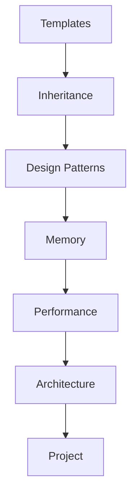

# 🗺️ Learning Navigator: Advanced Topics

> เส้นทางการเรียนรู้สำหรับ Advanced C++ Topics ใน OpenFOAM

---

## 📋 สารบัญ

1. [Template Programming](#1-template-programming)
2. [Inheritance & Polymorphism](#2-inheritance--polymorphism)
3. [Design Patterns](#3-design-patterns)
4. [Memory Management](#4-memory-management)
5. [Performance Optimization](#5-performance-optimization)
6. [Architecture & Extensibility](#6-architecture--extensibility)
7. [Practical Project](#7-practical-project)

---

## 1. Template Programming

> **Domain:** Generic Programming in C++

| เนื้อหา | คำอธิบาย |
|--------|----------|
| [CONTENT/01_TEMPLATE_PROGRAMMING/](CONTENT/01_TEMPLATE_PROGRAMMING/) | Template Metaprogramming |

---

## 2. Inheritance & Polymorphism

> **Domain:** OOP Concepts

| เนื้อหา | คำอธิบาย |
|--------|----------|
| [CONTENT/02_INHERITANCE_POLYMORPHISM/](CONTENT/02_INHERITANCE_POLYMORPHISM/) | Virtual Functions, RTS |

---

## 3. Design Patterns

> **Domain:** Software Architecture

| เนื้อหา | คำอธิบาย |
|--------|----------|
| [CONTENT/03_DESIGN_PATTERNS/](CONTENT/03_DESIGN_PATTERNS/) | Factory, Strategy, etc. |

---

## 4. Memory Management

> **Domain:** Smart Pointers, Resources

| เนื้อหา | คำอธิบาย |
|--------|----------|
| [CONTENT/04_MEMORY_MANAGEMENT/](CONTENT/04_MEMORY_MANAGEMENT/) | autoPtr, tmp, refCount |

---

## 5. Performance Optimization

> **Domain:** Expression Templates, Profiling

| เนื้อหา | คำอธิบาย |
|--------|----------|
| [CONTENT/05_PERFORMANCE_OPTIMIZATION/](CONTENT/05_PERFORMANCE_OPTIMIZATION/) | Expression Templates |

---

## 6. Architecture & Extensibility

> **Domain:** RTS, Plugin System

| เนื้อหา | คำอธิบาย |
|--------|----------|
| [CONTENT/06_ARCHITECTURE_EXTENSIBILITY/](CONTENT/06_ARCHITECTURE_EXTENSIBILITY/) | Run-Time Selection |

---

## 7. Practical Project

> **Domain:** Build Your Own Model

| เนื้อหา | คำอธิบาย |
|--------|----------|
| [CONTENT/07_PRACTICAL_PROJECT/](CONTENT/07_PRACTICAL_PROJECT/) | Custom Turbulence Model |

---

## 🎯 Learning Path

---

## 📚 Prerequisites

- C++ fundamentals
- OpenFOAM basics (Module 01-04)
- OpenFOAM Programming (Module 05)

---

*Last Updated: 2025-12-28*
