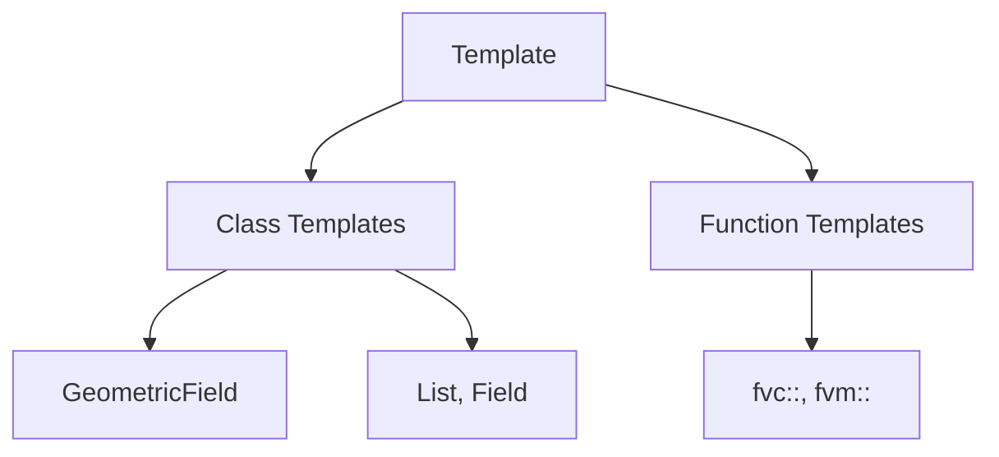

# Template Programming - Overview

ภาพรวม Template Programming

---

## Overview

> **Templates** = Generic programming ใน C++ สำหรับ type-safe code reuse



---

## 1. Why Templates?

| Benefit | Description |
|---------|-------------|
| **Code reuse** | Same logic for different types |
| **Type safety** | Compile-time type checking |
| **Zero overhead** | No runtime cost |
| **Specialization** | Custom behavior per type |

---

## 2. OpenFOAM Uses

### Class Templates

```cpp
// GeometricField template
template<class Type, template<class> class PatchField, class GeoMesh>
class GeometricField;

// Aliases
typedef GeometricField<scalar, fvPatchField, volMesh> volScalarField;
typedef GeometricField<vector, fvPatchField, volMesh> volVectorField;
```

### Function Templates

```cpp
// fvc operations
template<class Type>
tmp<GeometricField<Type, fvPatchField, volMesh>>
grad(const GeometricField<Type, fvPatchField, volMesh>& f);
```

---

## 3. Basic Syntax

### Class Template

```cpp
template<class Type>
class Container
{
    Type value_;
public:
    Container(const Type& val) : value_(val) {}
    const Type& value() const { return value_; }
};
```

### Function Template

```cpp
template<class Type>
Type maximum(const Type& a, const Type& b)
{
    return (a > b) ? a : b;
}
```

---

## 4. Module Contents

| File | Topic |
|------|-------|
| 01_Introduction | Basics |
| 02_Template_Syntax | Syntax details |
| 03_Internal_Mechanics | How it works |
| 04_Instantiation | Specialization |
| 05_Design_Patterns | Patterns |
| 06_Common_Errors | Debugging |
| 07_Practical_Exercise | Exercises |

---

## Quick Reference

| Concept | Example |
|---------|---------|
| Class template | `template<class T> class C` |
| Function template | `template<class T> T f(T)` |
| Type alias | `typedef C<T> Alias` |

---

## 🧠 Concept Check

<details>
<summary><b>1. Templates ทำงานเมื่อไหร่?</b></summary>

**Compile-time** — code generated for each used type
</details>

<details>
<summary><b>2. ทำไม OpenFOAM ใช้ templates?</b></summary>

**Code reuse** — same Field class for scalar, vector, tensor
</details>

<details>
<summary><b>3. template vs inheritance?</b></summary>

- **Template**: Compile-time polymorphism
- **Inheritance**: Runtime polymorphism
</details>

---

## 📖 เอกสารที่เกี่ยวข้อง

- **Introduction:** [01_Introduction.md](01_Introduction.md)
- **Syntax:** [02_Template_Syntax.md](02_Template_Syntax.md)