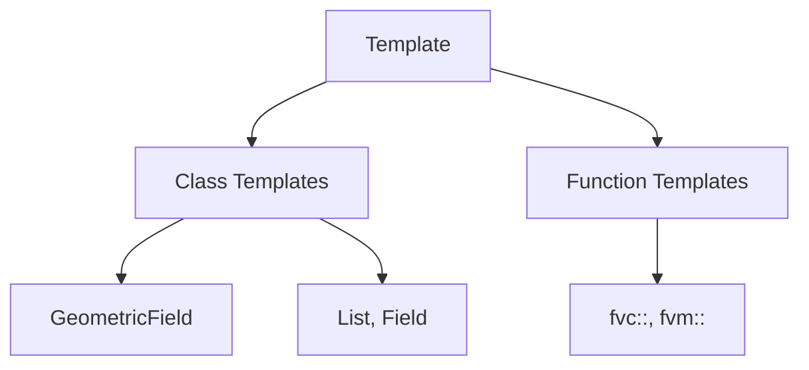
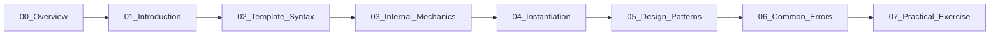
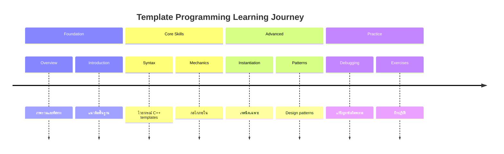

# Template Programming - Overview

ภาพรวม Template Programming

---

## 🎯 Learning Objectives

หลังจากอ่านบทนี้ คุณควรจะสามารถ:
- อธิบายแนวคิดของ Template Programming ใน C++
- ระบุประโยชน์และข้อดีของการใช้ templates
- ระบุการประยุกต์ใช้ templates ใน OpenFOAM
- แยกความแตกต่างระหว่าง compile-time และ runtime polymorphism
- เข้าใจโครงสร้างและการเรียนรู้ใน Module นี้

---

## Overview

> **Templates** = Generic programming ใน C++ สำหรับ type-safe code reuse



---

## What is Template Programming?

Template programming เป็นเทคนิคใน C++ ที่อนุญาตให้เขียนโค้ดทั่วไป (generic code) ซึ่งสามารถทำงานกับหลายประเภทข้อมูล (data types) โดยไม่ต้องเขียนซ้ำ คอมไพเลอร์จะสร้างโค้ดเฉพาะสำหรับแต่ละประเภทที่ใช้งานจริงในขั้นตอน compilation

---

## Why Templates?

| Benefit | Description |
|---------|-------------|
| **Code reuse** | Same logic for different types — เขียนครั้งเดียว ใช้กับ scalar, vector, tensor ได้หมด |
| **Type safety** | Compile-time type checking — ตรวจสอบประเภทขณะคอมไพล์ ลดข้อผิดพลาด runtime |
| **Zero overhead** | No runtime cost — ไม่มีค่าใช้จ่ายเพิ่มเติมเมื่อโปรแกรมทำงาน |
| **Specialization** | Custom behavior per type — ปรับแต่งพฤติกรรมเฉพาะสำหรับบางประเภท |

---

## How Templates Work in OpenFOAM

### Class Templates

OpenFOAM ใช้ class templates อย่างแพร่หลายสำหรับฟิลด์และคอนเทนเนอร์:

```cpp
// GeometricField template - หัวใจของ OpenFOAM fields
template<class Type, template<class> class PatchField, class GeoMesh>
class GeometricField;

// Type aliases สำหรับประเภทที่ใช้บ่อย
typedef GeometricField<scalar, fvPatchField, volMesh> volScalarField;
typedef GeometricField<vector, fvPatchField, volMesh> volVectorField;
typedef GeometricField<tensor, fvPatchField, volMesh> volTensorField;
```

### Function Templates

Operations ต่างๆ ใน `fvc` และ `fvm` ใช้ function templates:

```cpp
// fvc::grad ทำงานกับทุกประเภทฟิลด์
template<class Type>
tmp<GeometricField<Type, fvPatchField, volMesh>>
grad(const GeometricField<Type, fvPatchField, volMesh>& f);

// การเรียกใช้
grad(p)        // สำหรับ volScalarField p
grad(U)        // สำหรับ volVectorField U
```

---

## Learning Progression

เส้นทางการเรียนรู้ใน Module นี้:



### Module Contents

| File | Topic | Focus |
|------|-------|-------|
| 00_Overview | **This file** | ภาพรวมและทิศทางการเรียนรู้ |
| 01_Introduction | Basic Concepts | แนะนำแนวคิดพื้นฐาน |
| 02_Template_Syntax | Syntax Details | รายละเอียดไวยากรณ์ |
| 03_Internal_Mechanics | How it Works | กลไกภายในและ instantiation |
| 04_Instantiation | Specialization | เทคนิค specialization |
| 05_Design_Patterns | Patterns | Design patterns ใน OpenFOAM |
| 06_Common_Errors | Debugging | ข้อผิดพลาดที่พบบ่อย |
| 07_Practical_Exercise | Exercises | แบบฝึกหัดปฏิบัติ |

---

## Key Concepts Comparison

### Template vs Inheritance

| Aspect | Template | Inheritance |
|--------|----------|-------------|
| **Polymorphism type** | Compile-time | Runtime |
| **Performance** | No overhead | Virtual function cost |
| **Code size** | Larger (binary bloat) | Smaller |
| **Flexibility** | Type-specific | Interface-based |
| **OpenFOAM usage** | Fields, operations | Boundary conditions |

### Template Metaprogramming vs Regular Programming

```cpp
// Regular programming - runtime decisions
if (isScalar) {
    processScalarField(field);
} else if (isVector) {
    processVectorField(field);
}

// Template metaprogramming - compile-time decisions
template<class Type>
void process(const GeometricField<Type, ...>& field) {
    // Code generated for each Type at compile-time
}
```

---

## 📋 Key Takeaways

### Core Concepts

1. **Templates enable generic programming** — เขียนโค้ดครั้งเดียว ใช้กับหลายประเภท
2. **Compile-time mechanism** — คอมไพเลอร์สร้างโค้ดเฉพาะสำหรับแต่ละประเภท
3. **Zero runtime overhead** — ไม่มีค่าใช้จ่าย performance เมื่อโปรแกรมทำงาน
4. **Type-safe** — ตรวจสอบประเภทขณะคอมไพล์ ลดข้อผิดพลาด

### OpenFOAM Applications

- **GeometricField** — Foundation สำหรับทุกฟิลด์ใน OpenFOAM
- **fvc/fvm operations** — Function templates สำหรับ finite volume calculus
- **Type aliases** — `volScalarField`, `volVectorField`, etc.

### Learning Path



---

## 🧠 Concept Check

<details>
<summary><b>1. Templates ทำงานเมื่อไหร่?</b></summary>

**Compile-time** — คอมไพเลอร์สร้างโค้ดสำหรับแต่ละประเภทที่ใช้งานจริงเมื่อคอมไพล์ ไม่ใช่ runtime
</details>

<details>
<summary><b>2. ทำไม OpenFOAM ใช้ templates?</b></summary>

**Code reuse + Performance** — เขียน class เดียวสำหรับ GeometricField แล้วใช้กับ scalar, vector, tensor ได้ทั้งหมด โดยไม่สูญเสีย performance
</details>

<details>
<summary><b>3. Template vs Inheritance — เลือกอะไรเมื่อไหร่?</b></summary>

- **Template**: เมื่อต้องการ performance สูงและทราบประเภทขณะคอมไพล์ (เช่น fields)
- **Inheritance**: เมื่อต้องการ runtime flexibility ผ่าน interfaces (เช่น boundary conditions)
</details>

<details>
<summary><b>4. ข้อเสียของ templates?</b></summary>

- **Binary bloat** — โค้ดเพิ่มขึ้นเนื่องจากสร้างสำหรับแต่ละประเภท
- **Compile time** — เวลาคอมไพล์นานขึ้น
- **Error messages** — ข้อความ error ซับซ้อน
</details>

---

## 📖 เอกสารที่เกี่ยวข้อง

- **Introduction:** [01_Introduction.md](01_Introduction.md) — แนะนำแนวคิดเบื้องต้น
- **Syntax:** [02_Template_Syntax.md](02_Template_Syntax.md) — รายละเอียดไวยากรณ์
- **OpenFOAM Code:** `src/OpenFOAM/fields/GeometricField`

---

**Next:** [01_Introduction.md](01_Introduction.md) — เรียนรู้แนวคิดพื้นฐานของ Template Programming