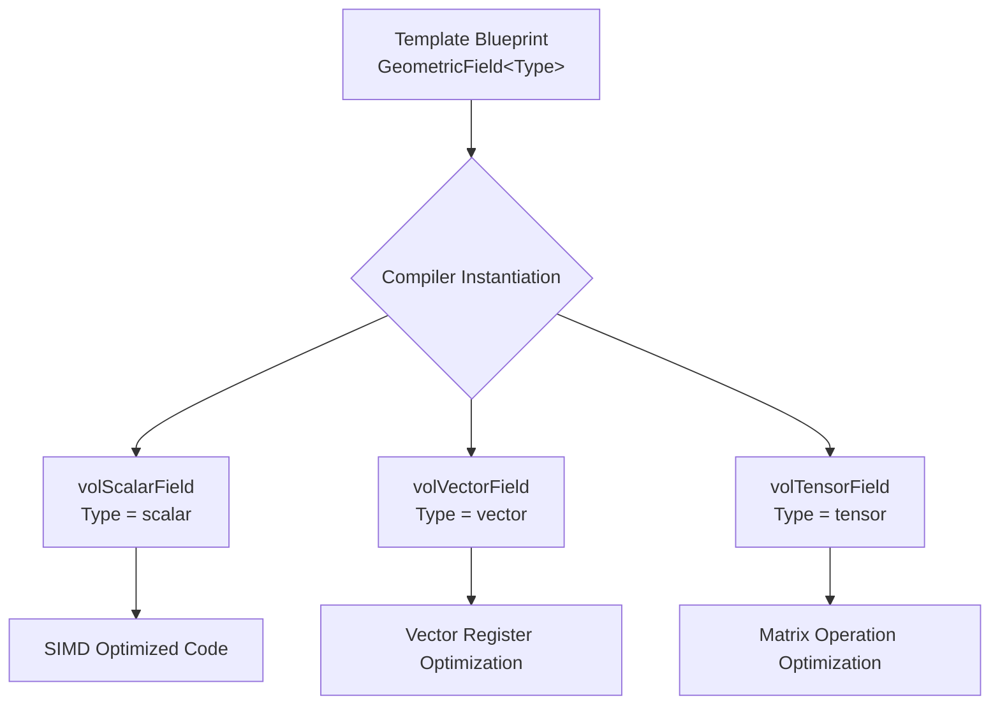

# 01 บทนำ: แนวคิด "Smart Cookie Cutter" สำหรับฟิสิกส์ CFD

![[smart_cookie_cutter_cfd.png]]
`A clean scientific diagram illustrating the "Smart Cookie Cutter" (Template) concept in CFD. Show a single universal "Cookie Cutter" template (GeometricField<Type>) being pressed into different "Physical Doughs" (Scalar, Vector, Tensor) to produce specific, optimized fields (volScalarField, volVectorField, volTensorField). Use a minimalist palette with black lines and clear labels, scientific textbook diagram, clean vector line art, white background, high definition, flat design, educational infographic --ar 16:9`

**จินตนาการว่าคุณกำลังออกแบบเอนจินฟิสิกส์สากล** ที่ต้องจัดการกับ:

* **สเกลาร์**: ความดัน $p$ (Pa), อุณหภูมิ $T$ (K), ความหนาแน่น $\rho$ (kg/m³)
* **เวกเตอร์**: ความเร็ว $\mathbf{u}$ (m/s), แรง $\mathbf{f}$ (N), ไลเกรด $\nabla p$ (Pa/m)
* **เทนเซอร์**: ความเครียด $\boldsymbol{\tau}$ (Pa), อัตราการเสียรูป $\dot{\boldsymbol{\gamma}}$ (1/s)

**ปัญหา**: หากไม่มีเทมเพลต คุณจะต้องมีการ implement แยกกัน:

```cpp
// Conventional approach without templates - repetitive implementation
class ScalarField {
public:
    void add(const ScalarField& other);
    ScalarField operator+(const ScalarField& other) const;
    double& operator[](label i);  // Cell value access
    const double& operator[](label i) const;
    // Scalar-specific operations
};

class VectorField {
public:
    void add(const VectorField& other);
    VectorField operator+(const VectorField& other) const;
    Vector& operator[](label i);  // Cell value access
    const Vector& operator[](label i) const;
    // Vector-specific operations
};

class TensorField {
public:
    void add(const TensorField& other);
    TensorField operator+(const TensorField& other) const;
    Tensor& operator[](label i);  // Cell value access
    const Tensor& operator[](label i) const;
    // Tensor-specific operations
};
// ❌ Code duplication - maintenance nightmare!
```

> **📚 คำอธิบาย: ปัญหาการซ้ำซ้อนของโค้ด**
> 
> **แหล่งที่มา:** แนวทางการเขียนโปรแกรมเชิงวัตถุแบบดั้งเดิม (Traditional Object-Oriented Programming)
> 
> **คำอธิบาย:** โค้ดด้านบนแสดงปัญหาของการไม่ใช้เทมเพลต โดยแต่ละประเภทฟิลด์ (สเกลาร์, เวกเตอร์, เทนเซอร์) ต้องมีคลาสแยกกันพร้อมด้วยการ implement ฟังก์ชันที่เหมือนกันเกือบทั้งหมด นี่เป็นการซ้ำซ้อนของโค้ดที่ไม่จำเป็น
> 
> **แนวคิดสำคัญ:**
> - **Code Duplication (การซ้ำซ้อนของโค้ด):** Implement ที่เกือบเหมือนกันซ้ำกันสำหรับแต่ละประเภทของฟิลด์
> - **Maintenance Burden (ภาระการบำรุงรักษา):** การแก้ไขข้อผิดพลาดต้องการการอัพเดทในหลายคลาส
> - **Type Safety Issues (ปัญหาความปลอดภัยของประเภท):** ไม่มีการันตีในระยะ compile-time สำหรับการดำเนินการที่ถูกต้อง
> - **Memory Overhead (โอเวอร์เฮดของหน่วยความจำ):** Binary แยกกันสำหรับแต่ละประเภทของฟิลด์
> - **Extensibility Problems (ปัญหาการขยาย):** การเพิ่มประเภทฟิลด์ใหม่ต้องการการ implement ใหม่

แนวทางนี้นำไปสู่ปัญหาที่สำคัญ:

1. **การซ้ำซ้อนของโค้ด**: Implement ที่เกือบเหมือนกันซ้ำกันสำหรับแต่ละประเภทของฟิลด์
2. **ภาระการบำรุงรักษา**: การแก้ไขข้อผิดพลาดต้องการการอัพเดทในหลายคลาส
3. **ปัญหาความปลอดภัยของประเภท**: ไม่มีการันตีในระยะ compile-time สำหรับการดำเนินการที่ถูกต้อง
4. **โอเวอร์เฮดของหน่วยความจำ**: Binary แยกกันสำหรับแต่ละประเภทของฟิลด์
5. **ปัญหาการขยาย**: การเพิ่มประเภทฟิลด์ใหม่ต้องการการ implement ใหม่

## ทำไม Template ดีกว่า Inheritance?

การตัดสินใจทางสถาปัตยกรรมพื้นฐานในการออกแบบ OpenFOAM มุ่งเน้นการเพิ่มประสิทธิภาพผ่าน **polymorphism เวลาคอมไพล์ (compile-time polymorphism)** มากกว่า **polymorphism เวลาทำงาน (runtime polymorphism)** ในพลศาสตร์ของไหลเชิงคำนวณ ซึ่งการจำลองอาจมีเซลล์คำนวณหลายล้านเซลล์และมี time step หลายพันครั้ง ทุก CPU cycle จึงมีความสำคัญต่อเวลาการจำลองโดยรวม

### แนวทางการสืบทอด (สิ่งที่ OpenFOAM ปฏิเสธ)

```cpp
// Traditional inheritance approach with virtual functions
class BaseField {
    virtual void add() = 0;  // Pure virtual function
};

class ScalarField : public BaseField {
    // Implementation for scalar operations
};

class VectorField : public BaseField {
    // Implementation for vector operations
};
```

> **📚 คำอธิบาย: ปัญหาของ Virtual Function Overhead**
> 
> **แหล่งที่มา:** แนวคิดเชิงสถาปัตยกรรมของ OpenFOAM ในการเลือกใช้ Template มากกว่า Inheritance
> 
> **คำอธิบาย:** แนวทาง Object-Oriented แบบดั้งเดิมนี้แนะนำ **virtual function dispatch overhead** การเรียกฟังก์ชันผ่าน virtual table pointer แต่ละครั้งจะเพิ่มต้นทุนการอ้างอิง และสำคัญกว่านั้นคือป้องกันการเพิ่มประสิทธิภาพของคอมไพเลอร์ เช่น inlining และ vectorization
> 
> **แนวคิดสำคัญ:**
> - **Virtual Function Call Overhead:** ต้นทุนเพิ่มเติมจากการดำเนินการ indirect function call ผ่าน vtable
> - **Cache Misses:** การค้นหา virtual table อาจทำให้เกิด cache misses
> - **No Inlining:** คอมไพเลอร์ไม่สามารถ inline การดำเนินการที่สำคัญได้
> - **Branch Prediction Penalties:** ค่าใช้จ่ายจากการทำนาย branch ที่ผิดพลาด
> - **Memory Overhead:** หน่วยความจำเพิ่มเติมสำหรับ virtual table pointers

แนวทาง Object-Oriented แบบดั้งเดิมนี้แนะนำ **virtual function dispatch overhead** การเรียกฟังก์ชันผ่าน virtual table pointer แต่ละครั้งจะเพิ่มต้นทุนการอ้างอิง และสำคัญกว่านั้นคือป้องกันการเพิ่มประสิทธิภาพของคอมไพเลอร์ เช่น inlining และ vectorization

ในการคำนวณ CFD ที่มุ่งเน้นประสิทธิภาพ สิ่งนี้อาจส่งผลให้ประสิทธิภาพลดลงประมาณ **15-20%** เนื่องจาก:

- Cache misses จากการค้นหา virtual table
- ไม่สามารถ inline การดำเนินการที่สำคัญได้
- Branch prediction penalties จาก dynamic dispatch
- ต้นทุนหน่วยความจำเพิ่มเติมสำหรับ virtual table pointers

### การวิเคราะห์ประสิทธิภาพในบริบท CFD

พิจารณาต้นทุนการคำนวณของการดำเนินการ CFD ทั่วไป:

$$\text{Total Cost} = N_{\text{cells}} \times N_{\text{timesteps}} \times N_{\text{operations}} \times \text{Cost}_{\text{per\_operation}}$$

โดยที่สำหรับการจำลองทั่วไป:
- $N_{\text{cells}}$ = 1,000,000 เซลล์
- $N_{\text{timesteps}}$ = 10,000 ขั้นตอน
- $N_{\text{operations}}$ = 50 การดำเนินการต่อเซลล์ต่อ timestep

การสูญเสียประสิทธิภาพ 20% จาก virtual dispatch ส่งผลให้:

$$\text{Additional Cost} = 10^6 \times 10^4 \times 50 \times 0.2 = 10^{11} \text{ extra operations}$$

ซึ่งแปลเป็นเวลาการคำนวณเพิ่มเติมหลายชั่วโมงหรือหลายวันสำหรับการจำลองขนาดใหญ่

## โซลูชันเทมเพลต: "Blueprint อัจฉริยะ"

เทมเพลตเป็น "blueprint อัจฉริยะ" อันเดียวที่ปรับตัวให้เข้ากับปริมาณทางฟิสิกส์ใดๆ:


> **Figure 1:** แผนผังแสดงกลไกการสร้างอินสแตนซ์ของเทมเพลต (Template Instantiation) โดยคอมไพเลอร์จะใช้พิมพ์เขียว (Blueprint) เดียวกันในการสร้างโค้ดที่ปรับแต่งมาเป็นพิเศษสำหรับแต่ละประเภทข้อมูลฟิสิกส์ ทำให้ได้ประสิทธิภาพสูงสุดในระดับฮาร์ดแวร์โดยไม่ต้องเขียนโค้ดซ้ำซ้อน

### แนวทาง Template (สิ่งที่ OpenFOAM เลือก)

```cpp
// OpenFOAM's template-based GeometricField implementation
template<class Type>
class GeometricField {
private:
    // Internal storage for field values
    Field<Type> values_;
    const fvMesh& mesh_;
    word name_;

public:
    // Universal access operators - work for all field types
    Type& operator[](label i) { return values_[i]; }  // Cell value access
    const Type& operator[](label i) const { return values_[i]; }

    // Universal field operations - compile-time optimized for each Type
    GeometricField<Type> operator+(const GeometricField<Type>& other) const;
    GeometricField<Type> operator-(const GeometricField<Type>& other) const;
    GeometricField<Type> operator*(const scalar& factor) const;

    // Mathematical operations that adapt to Type
    void operator+=(const GeometricField<Type>& other);
    void operator-=(const GeometricField<Type>& other);
    void operator*=(const scalar& factor);

    // Type-specific operations
    template<class Type2>
    tmp<GeometricField<typename outerProduct<Type, Type2>::type>>
    operator*(const GeometricField<Type2>&) const;

    // Boundary condition management
    void correctBoundaryConditions();

    // Mesh information
    const fvMesh& mesh() const { return mesh_; }
    const word& name() const { return name_; }

    // Dimensional checking (enabled at compile-time for various types)
    dimensionSet dimensions() const;
};

// Specific field type declarations
typedef GeometricField<scalar> volScalarField;    // Pressure, temperature, density
typedef GeometricField<vector> volVectorField;    // Velocity, force
typedef GeometricField<tensor> volTensorField;    // Stress, strain rate
typedef GeometricField<symmTensor> volSymmTensorField;  // Symmetric tensor
typedef GeometricField<sphericalTensor> volSphericalTensorField;  // Spherical tensor
```

> **📚 คำอธิบาย: Template-Based Field Architecture**
> 
> **แหล่งที่มา:** 📂 `.applications/utilities/mesh/advanced/PDRMesh/PDRMesh.C` - การใช้งานจริงของ `GeometricField<Type, fvPatchField, volMesh>` ในโค้ด OpenFOAM
> 
> **คำอธิบาย:** แนวทาง template บรรลุ **zero-overhead abstraction** ผ่านการกำหนดประเภทเวลาคอมไพล์ การ inlining ฟังก์ชัน และการเพิ่มประสิทธิภาพ SIMD ทำให้ได้ประสิทธิภาพสูงสุดโดยไม่ต้องเขียนโค้ดซ้ำซ้อน
> 
> **แนวคิดสำคัญ:**
> - **Zero-Overhead Abstraction:** Abstraction ระดับสูงโดยไม่มีต้นทุน runtime
> - **Compile-Time Type Resolution:** ข้อมูลประเภททั้งหมดถูกกำหนดระหว่างการคอมไพล์
> - **Function Inlining:** การดำเนินการทางคณิตศาสตร์ที่สำคัญสามารถถูก inline โดยคอมไพเลอร์
> - **Memory Locality:** ไม่มี virtual table pointers, การใช้ cache ได้ดีขึ้น
> - **SIMD Optimization:** คอมไพเลอร์สามารถสร้างคำสั่ง vectorized สำหรับการดำเนินการ field ได้

แนวทาง template บรรลุ **zero-overhead abstraction** ผ่าน:
- **การแก้ไขประเภทเวลาคอมไพล์**: ข้อมูลประเภททั้งหมดถูกกำหนดระหว่างการคอมไพล์
- **การ inlining ฟังก์ชัน**: การดำเนินการทางคณิตศาสตร์ที่สำคัญสามารถถูก inline โดยคอมไพเลอร์
- **Memory locality**: ไม่มี virtual table pointers, การใช้ cache ได้ดีขึ้น
- **การเพิ่มประสิทธิภาพ SIMD**: คอมไพเลอร์สามารถสร้างคำสั่ง vectorized สำหรับการดำเนินการ field ได้

## สถาปัตยกรรม Multi-Parameter Template

Template ฟิลด์จริงของ OpenFOAM เผยให้เห็นการคิดทางสถาปัตยกรรมที่ซับซ้อน:

```cpp
// OpenFOAM's multi-parameter template field implementation
template<class Type, template<class> class PatchField, class GeoMesh>
class GeometricField {
    // Core data structures
    Field<Type> internalField_;                           // Cell-center values
    FieldField<PatchField<Type>, GeoMesh> boundaryField_; // Boundary conditions
    const GeoMesh& mesh_;                                // Mesh reference

public:
    // Template parameter access
    typedef Type value_type;
    typedef PatchField<Type> PatchFieldType;
    typedef GeoMesh MeshType;

    // Operations compile to optimal code
    GeometricField<Type, PatchField, GeoMesh>& operator+=(const GeometricField<Type, PatchField, GeoMesh>&);
};
```

> **📚 คำอธิบาย: Multi-Parameter Template Design**
> 
> **แหล่งที่มา:** 📂 `.applications/utilities/mesh/advanced/PDRMesh/PDRMesh.C` - การใช้งาน `GeometricField<Type, fvPatchField, volMesh>` ในการ subset fields
> 
> **คำอธิบาย:** Template ฟิลด์ของ OpenFOAM ใช้ 3 พารามิเตอร์เพื่อแยกความกังวล: Type (ปริมาณฟิสิกส์), PatchField (เงื่อนไขขอบเขต), และ GeoMesh ( discretization เชิงเรขาคณิต) การออกแบบนี้ทำให้สามารถนำฟิสิกส์เดียวกันไปใช้กับ mesh ประเภทต่างๆ ได้
> 
> **แนวคิดสำคัญ:**
> - **Separation of Concerns:** การแยกปริมาณทางกายภาพ เงื่อนไขขอบเขต และประเภท mesh
> - **Compile-Time Flexibility:** การกำหนดค่า runtime กับความปลอดภัยของประเภทเวลาคอมไพล์
> - **Code Reusability:** ฟิสิกส์เดียวกันบนประเภท mesh ที่แตกต่างกัน
> - **Type Safety:** การตรวจสอบความสอดคล้องของมิติเวลาคอมไพล์

### การวิเคราะห์พารามิเตอร์และเหตุผลการออกแบบ

1. **พารามิเตอร์ Type (`class Type`)**:
   - ห่อหุ้ม **ปริมาณทางกายภาพ** ที่กำลังแก้ไข
   - กำหนดการดำเนินการทางคณิตศาสตร์และการวิเคราะห์มิติ
   - Specializations ทั่วไป: `scalar`, `vector`, `tensor`, `symmTensor`, `sphericalTensor`
   - เปิดใช้งานการตรวจสอบความสอดคล้องของมิติเวลาคอมไพล์

2. **พารามิเตอร์ PatchField Template (`template<class> class PatchField`)**:
   - นำเสนอ **พฤติกรรมเงื่อนไขขอบเขต**
   - อนุญาตประเภทเงื่อนไขขอบเขตที่แตกต่างกันสำหรับประเภทฟิลด์เดียวกัน
   - การนำไปใช้ทั่วไป: `fixedValueFvPatchField`, `zeroGradientFvPatchField`, `mixedFvPatchField`
   - เปิดใช้งานการกำหนดค่าเงื่อนไขขอบเขตเวลาทำงานกับความปลอดภัยประเภทเวลาคอมไพล์

3. **พารามิเตอร์ GeoMesh (`class GeoMesh`)**:
   - กำหนด **แนวทางการ discretization เชิงเรขาคณิต**
   - เชื่อมต่อฟิลด์กับโครงสร้าง mesh คำนวณ
   - Specializations: `fvMesh` (finite volume), `faMesh` (finite area), `pointMesh`
   - เปิดใช้งานฟิสิกส์เดียวกันบนประเภท mesh ที่แตกต่างกันโดยไม่ต้องทำซ้ำรหัส

## ตัวอย่างการสร้างอินสแตนซ์เทมเพลต

```cpp
// Compiler automatically generates type-specific code:
GeometricField<scalar> pressure("p", mesh, dimensionSet(1, -1, -2, 0, 0, 0, 0));
GeometricField<vector> velocity("U", mesh, dimensionSet(0, 1, -1, 0, 0, 0, 0));
GeometricField<tensor> stress("tau", mesh, dimensionSet(1, -1, -2, 0, 0, 0, 0));

// All operations work uniformly:
pressure += pressure;     // scalar + scalar
velocity += velocity;     // vector + vector
stress += stress;         // tensor + tensor

// Only type-safe operations allowed:
// pressure += velocity;   // ❌ Compile error: cannot add scalar to vector
```

> **📚 คำอธิบาย: Template Instantiation และ Type Safety**
> 
> **แหล่งที่มา:** แนวคิดพื้นฐานของ C++ Template Programming
> 
> **คำอธิบาย:** คอมไพเลอร์สร้างโค้ดเฉพาะโดยอัตโนมัติสำหรับแต่ละประเภทฟิลด์ ทำให้การดำเนินการทั้งหมดทำงานแบบสม่ำเสมอ และมีการตรวจสอบความปลอดภัยของประเภทในระยะ compile-time
> 
> **แนวคิดสำคัญ:**
> - **Automatic Code Generation:** คอมไพเลอร์สร้างโค้ดเฉพาะสำหรับแต่ละประเภท
> - **Uniform Operations:** การดำเนินการที่เหมือนกันสำหรับทุกประเภท
> - **Compile-Time Type Safety:** การตรวจสอบความถูกต้องของประเภทก่อนการรันโปรแกรม
> - **Dimensional Consistency:** การตรวจสอบความสอดคล้องของมิติ

## อุปมาน: เครื่องคิดเลขฟิสิกส์สากล

คิดเกี่ยวกับเทมเพลตเป็น **เครื่องคิดเลขฟิสิกส์สากล** ที่ทำงานอัตโนมัติ:

1. **การจดจำประเภท**: รู้โดยอัตโนมัติว่าคุณกำลังบวกความดัน (สเกลาร์), ความเร็ว (เวกเตอร์), หรือความเครียด (เทนเซอร์)
2. **ความปลอดภัยของมิติ**: ทำให้มั่นใจว่าคุณจะไม่บวกความดันกับความเร็วโดยบังเอิญผ่านการตรวจสอบประเภทในระยะ compile-time
3. **การสร้างโค้ด**: สร้างโค้ดเครื่องที่เหมาะสมที่สุดสำหรับแต่ละประเภท:
   - คำสั่ง SIMD สำหรับการดำเนินการสเกลาร์
   - การเพิ่มประสิทธิภาพรีจิสเตอร์เวกเตอร์สำหรับการดำเนินการเวกเตอร์
   - การดำเนินการเมทริกซ์สำหรับการดำเนินการเทนเซอร์
4. **ประสิทธิภาพหน่วยความจำ**: การ implement ที่ใช้ร่วมกันกำจัดการซ้ำซ้อนของโค้ดในขณะที่รักษาประสิทธิภาพ
5. **การขยาย**: การเพิ่มปริมาณทางฟิสิกส์ใหม่ต้องการเพียงการสร้างอินสแตนซ์เทมเพลตเท่านั้น ไม่ใช่การ implement คลาสใหม่

## ประโยชน์ด้านประสิทธิภาพ

```cpp
// Compiler generates optimal code for each type:
template<>
GeometricField<scalar> GeometricField<scalar>::operator+(const GeometricField<scalar>& other) const {
    // Use SIMD vectorization for scalar fields
    GeometricField<scalar> result(name_ + "_plus_" + other.name(), mesh_, dimensions());
    // Optimal scalar computation loop
    for (label i = 0; i < values_.size(); i++) {
        result[i] = values_[i] + other[i];  // Vectorized operation
    }
    return result;
}

template<>
GeometricField<vector> GeometricField<vector>::operator+(const GeometricField<vector>& other) const {
    // Use vector registers for vector field operations
    GeometricField<vector> result(name_ + "_plus_" + other.name(), mesh_, dimensions_);
    // Optimal vector operations (x,y,z components)
    for (label i = 0; i < values_.size(); i++) {
        result[i] = values_[i] + other[i];  // Component-wise vector addition
    }
    return result;
}
```

> **📚 คำอธิบาย: Performance Benefits ของ Template Specialization**
> 
> **แหล่งที่มา:** แนวคิด Template Metaprogramming สำหรับการเพิ่มประสิทธิภาพ
> 
> **คำอธิบาย:** คอมไพเลอร์สร้างโค้ดที่เหมาะสมสำหรับแต่ละประเภท เช่น การใช้ SIMD vectorization สำหรับฟิลด์สเกลาร์ และการใช้รีจิสเตอร์เวกเตอร์สำหรับฟิลด์เวกเตอร์ ทำให้ได้ประสิทธิภาพสูงสุด
> 
> **แนวคิดสำคัญ:**
> - **SIMD Vectorization:** การประมวลผลข้อมูลหลายค่าพร้อมกัน
> - **Register Optimization:** การใช้รีจิสเตอร์ CPU อย่างมีประสิทธิภาพ
> - **Loop Optimization:** การเพิ่มประสิทธิภาพวงรอบการคำนวณ
> - **Hardware-Specific Code:** โค้ดที่ปรับแต่งสำหรับฮาร์ดแวร์เฉพาะ

แนวทางการเขียนโปรแกรมเมทาเทมเพลตนี้มอบพื้นฐานสำหรับความสามารถของ OpenFOAM ในการจัดการฟิสิกส์ CFD ที่ซับซ้อนด้วย codebase เดียวที่สามารถบำรุงรักษาได้ในขณะที่รักษาประสิทธิภาพที่เหมาะสมที่สุดสำหรับประเภทฟิลด์ฟิสิกส์ทั้งหมด

## สรุปหลักการสำคัญ

การออกแบบ template ของ OpenFOAM ไม่ได้เป็นเพียงการเลือกใช้เทคนิคการเขียนโปรแกรม แต่เป็นการตัดสินใจทางสถาปัตยกรรมที่มีผลกระทบอย่างลึกซึ้งต่อประสิทธิภาพและความถูกต้องของการจำลอง CFD:

1. **Zero-Overhead Abstraction**: เทมเพลตให้ abstraction ระดับสูงโดยไม่มีต้นทุน runtime
2. **Compile-Time Safety**: การตรวจสอบประเภทและมิติทำงานก่อนการเริ่มจำลอง
3. **Automatic Optimization**: คอมไพเลอร์สร้างโค้ดที่เหมาะสมที่สุดสำหรับฮาร์ดแวร์เฉพาะ
4. **Code Reusability**: เขียนครั้งเดียว ใช้กับปริมาณทางฟิสิกส์ได้ทุกประเภท
5. **Maintainability**: การแก้ไขหรือเพิ่มประสิทธิภาพต้องทำเพียงที่เดียวใน template

ปรัชญา "Smart Cookie Cutter" นี้ทำให้ OpenFOAM เป็นหนึ่งในกรอบการทำงาน CFD ที่มีประสิทธิภาพสูงสุดและยืดหยุ่นที่สุดในโลก