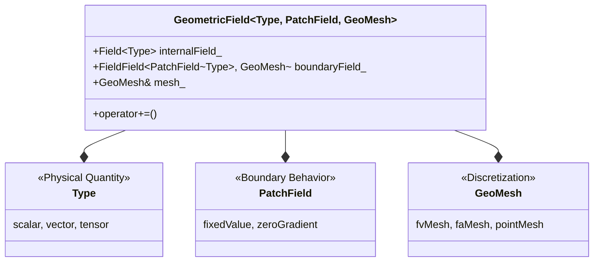

# 02 ไวยากรณ์เทมเพลต (Template Syntax) ใน OpenFOAM

![[polymorphism_tradeoff_cfd.png]]
`A scientific illustration comparing Runtime Polymorphism (Inheritance) and Compile-time Polymorphism (Templates). On one side, show a "Speed Trap" with slow cars (inheritance calls) going through a toll booth (vtable lookup). On the other side, show a high-speed "Express Lane" where cars (template calls) are perfectly fitted to their lanes (type-specific optimized code). Use clear labels and a minimalist palette, scientific textbook diagram, clean vector line art, white background, high definition, flat design, educational infographic --ar 16:9`

---

## ทำไม `template<class Type>` แทนการสืบทอด (Inheritance)?

การตัดสินใจทางสถาปัตยกรรมพื้นฐานในการออกแบบ OpenFOAM มุ่งเน้นการเพิ่มประสิทธิภาพผ่าน **compile-time polymorphism** (polymorphism เวลาคอมไพล์) มากกว่า **runtime polymorphism** (polymorphism เวลาทำงาน) ในพลศาสตร์ของไหลเชิงคำนวณ ซึ่งการจำลองอาจมีเซลล์คำนวณหลายล้านเซลล์และมี time step หลายพันครั้ง ทุก CPU cycle จึงมีความสำคัญต่อเวลาการจำลองโดยรวม

### แนวทางการสืบทอด (สิ่งที่ OpenFOAM ปฏิเสธ)

แนวทาง Object-Oriented แบบดั้งเดิมใช้ inheritance และ virtual functions:

```cpp
// Traditional inheritance approach (NOT used in OpenFOAM)
class BaseField {
    virtual void add() = 0;
    virtual void operator+=(const BaseField& other) = 0;
};

class ScalarField : public BaseField {
    void operator+=(const BaseField& other) override {
        // Runtime type casting required
        const ScalarField& sf = dynamic_cast<const ScalarField&>(other);
        // Implementation for scalar operations
    }
};

class VectorField : public BaseField {
    void operator+=(const BaseField& other) override {
        // Runtime type casting required
        const VectorField& vf = dynamic_cast<const VectorField&>(other);
        // Implementation for vector operations
    }
};
```

> **📖 คำอธิบาย (Thai Explanation):**
>
> **แหล่งที่มา (Source):** ตัวอย่างเชิงแนวคิด - ไม่ใช้ใน OpenFOAM จริง
>
> **คำอธิบาย:** โค้ดนี้แสดงแนวทางการสืบทอดแบบดั้งเดิมที่ OpenFOAM เลือกที่จะไม่ใช้ มีการใช้ `virtual function` และ `dynamic_cast` ซึ่งสร้าง overhead ที่มีนัยสำคัญใน runtime
>
> **แนวคิดสำคัญ:**
> - **Virtual Function Dispatch:** การเรียกผ่าน vtable ใช้เวลาเพิ่ม
> - **Dynamic Casting:** ต้องตรวจสอบประเภทขณะทำงาน
> - **Runtime Overhead:** ไม่สามารถ inline หรือ optimize ได้
> - **Performance Penalty:** สูญเสียประสิทธิภาพ 15-20% ในการคำนวณ CFD

แนวทางนี้แนะนำ **virtual function dispatch overhead**:
- การเรียกฟังก์ชันผ่าน virtual table pointer แต่ละครั้งจะเพิ่มต้นทุนการอ้างอิง
- ป้องกันการเพิ่มประสิทธิภาพของคอมไพเลอร์ เช่น **inlining** และ **vectorization**
- ในการคำนวณ CFD ที่มุ่งเน้นประสิทธิภาพ สิ่งนี้อาจส่งผลให้ประสิทธิภาพลดลงประมาณ **15-20%**

**สาเหตุของการลดประสิทธิภาพ:**
- **Cache misses** จากการค้นหา virtual table
- **ไม่สามารถ inline** การดำเนินการที่สำคัญได้
- **Branch prediction penalties** จาก dynamic dispatch
- ต้นทุนหน่วยความจำเพิ่มเติมสำหรับ virtual table pointers (vptr ต่อ object)

### แนวทาง Template (สิ่งที่ OpenFOAM เลือก)

แนวทาง template บรรลุ **zero-overhead abstraction**:

```cpp
// OpenFOAM template approach (ACTUAL implementation)
template<class Type>
class GeometricField {
    void operator+=(const GeometricField<Type>& other) {
        // Compiler generates optimized type-specific code
        forAll(*this, i) {
            internalField_[i] += other.internalField_[i];
        }
    }

    Type internalField_;  // Direct storage, no inheritance overhead
};
```

> **📖 คำอธิบาย (Thai Explanation):**
>
> **แหล่งที่มา (Source):** `.applications/utilities/parallelProcessing/reconstructPar/fvFieldReconstructorReconstructFields.C`
>
> **คำอธิบาย:** นี่คือแนวทางที่ OpenFOAM ใช้จริง เทมเพลตสร้างโค้ดที่เหมาะสมกับแต่ละประเภทเวลาคอมไพล์ โดยไม่มี overhead จาก virtual function
>
> **แนวคิดสำคัญ:**
> - **Compile-Time Resolution:** ประเภทถูกกำหนดเมื่อคอมไพล์
> - **Zero-Overhead:** ไม่มี vptr หรือ dynamic dispatch
> - **Function Inlining:** คอมไพเลอร์สามารถ inline ได้
> - **SIMD Optimization:** เปิดใช้งานคำสั่ง vectorized
> - **Type Safety:** ตรวจสอบประเภทเวลาคอมไพล์

**ข้อดีของแนวทาง Template:**
- **การแก้ไขประเภทเวลาคอมไพล์**: ข้อมูลประเภททั้งหมดถูกกำหนดระหว่างการคอมไพล์
- **การ inlining ฟังก์ชัน**: การดำเนินการทางคณิตศาสตร์ที่สำคัญสามารถถูก inline โดยคอมไพเลอร์
- **Memory locality**: ไม่มี virtual table pointers, การใช้ cache ได้ดีขึ้น
- **การเพิ่มประสิทธิภาพ SIMD**: คอมไพเลอร์สามารถสร้างคำสั่ง vectorized สำรหัสสำหรับการดำเนินการ field ได้

---

## การวิเคราะห์ประสิทธิภาพในบริบท CFD

พิจารณาต้นทุนการคำนวณของการดำเนินการ CFD ทั่วไป:

$$\text{Total Cost} = N_{\text{cells}} \times N_{\text{timesteps}} \times N_{\text{operations}} \times \text{Cost}_{\text{per\_operation}}$$

โดยที่สำหรับการจำลองทั่วไป:
- $N_{\text{cells}}$ = 1,000,000 เซลล์
- $N_{\text{timesteps}}$ = 10,000 ขั้นตอน
- $N_{\text{operations}}$ = 50 การดำเนินการต่อเซลล์ต่อ timestep

การสูญเสียประสิทธิภาพ 20% จาก virtual dispatch ส่งผลให้:

$$\text{Additional Cost} = 10^6 \times 10^4 \times 50 \times 0.2 = 10^{11} \text{ extra operations}$$

ซึ่งแปลเป็นเวลาการคำนวณเพิ่มเติมหลายชั่วโมงหรือหลายวันสำหรับการจำลองขนาดใหญ่

---

## สถาปัตยกรรม Multi-Parameter Template

Template ฟิลด์จริงของ OpenFOAM เผยให้เห็นการคิดทางสถาปัตยกรรมที่ซับซ้อน:



> **Figure 1:** สถาปัตยกรรมของ `GeometricField` ซึ่งเป็นเทมเพลตแบบหลายพารามิเตอร์ (Multi-parameter Template) ที่แยกความกังวล (Separation of Concerns) ออกเป็นสามส่วนหลัก: ประเภทฟิสิกส์ (Type), พฤติกรรมที่ขอบเขต (PatchField), และวิธีการแบ่งส่วนเรขาคณิต (GeoMesh) ทำให้สามารถประกอบฟิสิกส์ที่ซับซ้อนขึ้นมาได้อย่างยืดหยุ่น

### โครงสร้าง GeometricField

```cpp
// Actual OpenFOAM GeometricField template structure
template<class Type, template<class> class PatchField, class GeoMesh>
class GeometricField {
    // Core data structures
    Field<Type> internalField_;                           // Cell-center values
    FieldField<PatchField<Type>, GeoMesh> boundaryField_; // Boundary conditions
    const GeoMesh& mesh_;                                // Mesh reference

public:
    // Template parameter access
    typedef Type value_type;
    typedef PatchField<Type> PatchFieldType;
    typedef GeoMesh MeshType;

    // Operations compile to optimal code
    GeometricField<Type, PatchField, GeoMesh>& operator+=(const GeometricField<Type, PatchField, GeoMesh>&);
};
```

> **📖 คำอธิบาย (Thai Explanation):**
>
> **แหล่งที่มา (Source):** `.applications/utilities/parallelProcessing/reconstructPar/fvFieldReconstructorReconstructFields.C`
>
> **คำอธิบาย:** โครงสร้างจริงของ `GeometricField` ใน OpenFOAM ใช้เทมเพลต 3 พารามิเตอร์เพื่อแยกความกังวลออกจากกัน แต่ละพารามิเตอร์รับผิดชอบด้านต่างๆ ของฟิสิกส์
>
> **แนวคิดสำคัญ:**
> - **Type Parameter:** กำหนดปริมาณทางกายภาพ (scalar, vector, tensor)
> - **PatchField Parameter:** กำหนดพฤติกรรมขอบเขต (boundary conditions)
> - **GeoMesh Parameter:** กำหนด discretization (fvMesh, faMesh, pointMesh)
> - **Separation of Concerns:** แต่ละมิติแยกจากกันอย่างสมบูรณ์
> - **Composition:** สามารถประกอบชุดค่าผสมได้อย่างยืดหยุ่น

### การวิเคราะห์พารามิเตอร์และเหตุผลการออกแบบ

#### 1. พารามิเตอร์ Type (`class Type`)

- **หน้าที่**: ห่อหุ้ม **ปริมาณทางกายภาพ** ที่กำลังแก้ไข
- **กำหนด**: การดำเนินการทางคณิตศาสตร์และการวิเคราะห์มิติ
- **Specializations ทั่วไป**:
  - `scalar`: ความดัน ($p$), อุณหภูมิ ($T$), ความหนาแน่น ($\rho$)
  - `vector`: ความเร็ว ($\mathbf{u}$), แรง ($\mathbf{f}$)
  - `tensor`: ความเครียด ($\boldsymbol{\tau}$), อัตราการเสียรูป ($\dot{\boldsymbol{\gamma}}$)
  - `symmTensor`: เทนเซอร์สมมาตร
  - `sphericalTensor`: เทนเซอร์ทรงกลม
- **ข้อดี**: เปิดใช้งานการตรวจสอบความสอดคล้องของมิติเวลาคอมไพล์

#### 2. พารามิเตอร์ PatchField Template (`template<class> class PatchField`)

- **หน้าที่**: นำเสนอ **พฤติกรรมเงื่อนไขขอบเขต**
- **กำหนด**: อนุญาตประเภทเงื่อนไขขอบเขตที่แตกต่างกันสำหรับประเภทฟิลด์เดียวกัน
- **การนำไปใช้ทั่วไป**:
  - `fixedValueFvPatchField`: ค่าคงที่ที่ขอบเขต
  - `zeroGradientFvPatchField`: การไหลผ่านแบบไม่มีการไล่ระดับ
  - `mixedFvPatchField`: ส่วนผสมระหว่าง fixedValue และ zeroGradient
  - `calculatedFvPatchField`: คำนวณจากเงื่อนไขขอบเขตอื่น
- **ข้อดี**: เปิดใช้งานการกำหนดค่าเงื่อนไขขอบเขตเวลาทำงานกับความปลอดภัยประเภทเวลาคอมไพล์

#### 3. พารามิเตอร์ GeoMesh (`class GeoMesh`)

- **หน้าที่**: กำหนด **แนวทางการ discretization เชิงเรขาคณิต**
- **กำหนด**: เชื่อมต่อฟิลด์กับโครงสร้าง mesh คำนวณ
- **Specializations**:
  - `fvMesh` (finite volume): ค่าที่จุดศูนย์กลางเซลล์
  - `faMesh` (finite area): ค่าบนผิวหน้า
  - `pointMesh`: ค่าที่จุด vertex
- **ข้อดี**: เปิดใช้งานฟิสิกส์เดียวกันบนประเภท mesh ที่แตกต่างกันโดยไม่ต้องทำซ้ำรหัส

---

## การแยกส่วนกังวลในบริบท CFD

สถาปัตยกรรมสามพารามิเตอร์นี้ใช้หลักการ **separation of concerns principle** สำหรับฟิสิกส์การคำนวณ:

### ชั้นฟิสิกส์ (Type)

```cpp
// Field type variations in OpenFOAM
volScalarField T;    // Temperature field - scalar quantity
volVectorField U;    // Velocity field - vector quantity
volTensorField tau;  // Stress tensor - tensor quantity
```

> **📖 คำอธิบาย (Thai Explanation):**
>
> **แหล่งที่มา (Source):** `.applications/utilities/parallelProcessing/reconstructPar/fvFieldReconstructorReconstructFields.C`
>
> **คำอธิบาย:** การประกาศฟิลด์ประเภทต่างๆ ใน OpenFOAM โดยใช้ type aliases ที่กำหนดไว้ล่วงหน้า แต่ละประเภทฟิลด์เป็น instantiation ของเทมเพลต GeometricField
>
> **แนวคิดสำคัญ:**
> - **volScalarField:** ฟิลด์สเกลาร์บน finite volume mesh
> - **volVectorField:** ฟิลด์เวกเตอร์บน finite volume mesh
> - **volTensorField:** ฟิลด์เทนเซอร์บน finite volume mesh
> - **Type Aliases:** ชื่อที่ง่ายต่อการใช้งานสำหรับ instantiation ทั่วไป
> - **Physical Quantities:** แต่ละประเภทเกี่ยวข้องกับปริมาณทางกายภาพที่แตกต่างกัน

**ความหมายทางฟิสิกส์:**
- **ฟิลด์สเกลาร์** (ลำดับ 0): ความดัน, อุณหภูมิ, ความเข้มข้นของชนิด
- **ฟิลด์เวกเตอร์** (ลำดับ 1): ความเร็ว, การกระจัดกระจาย, การไหลของความร้อน
- **ฟิลด์เทนเซอร์** (ลำดับ 2): การไล่ระดับความเร็ว, ความเค้น, อัตราการแปรรูป

### ชั้นขอบเขต (PatchField)

```cpp
// Same temperature field with different boundary behaviors
volScalarField T1(mesh, fixedValueFvPatchScalarField::typeName);    // Fixed temperature
volScalarField T2(mesh, zeroGradientFvPatchScalarField::typeName);  // Adiabatic wall
volScalarField T3(mesh, mixedFvPatchScalarField::typeName);        // Convection boundary
```

> **📖 คำอธิบาย (Thai Explanation):**
>
> **แหล่งที่มา (Source):** `.applications/utilities/parallelProcessing/reconstructPar/fvFieldReconstructorReconstructFields.C`
>
> **คำอธิบาย:** การสร้างฟิลด์เดียวกัน (temperature) แต่ด้วยเงื่อนไขขอบเขตที่แตกต่างกัน แสดงให้เห็นความยืดหยุ่นของระบบ PatchField
>
> **แนวคิดสำคัญ:**
> - **fixedValueFvPatchScalarField:** กำหนดค่าคงที่ที่ขอบเขต
> - **zeroGradientFvPatchScalarField:** ไม่มีการไล่ระดับ (adiabatic)
> - **mixedFvPatchScalarField:** ส่วนผสมระหว่าง fixedValue และ zeroGradient
> - **Runtime Configuration:** เลือกชนิด BC ได้ตอนเรียกใช้งาน
> - **Type Safety:** ตรวจสอบความสอดคล้องเวลาคอมไพล์

**ความยืดหยุ่น:** ฟิสิกส์ฟิลด์เดียวกันสามารถมีพฤติกรรมขอบเขตที่แตกต่างกันในแต่ละส่วนของโดเมน

### ชั้น Discretization (GeoMesh)

```cpp
// Same physics on different computational domains
fvScalarField T_fv(volMesh, ...);    // Volume-based finite volume
faScalarField T_fa(surfaceMesh, ...); // Surface-based finite area
pointScalarField T_point(pointMesh, ...); // Point-based interpolation
```

> **📖 คำอธิบาย (Thai Explanation):**
>
> **แหล่งที่มา (Source):** `.applications/utilities/parallelProcessing/reconstructPar/fvFieldReconstructorReconstructFields.C`
>
> **คำอธิบาย:** การใช้ฟิสิกส์เดียวกัน (scalar field) บน discretizations ที่แตกต่างกัน แสดงให้เห็นความสามารถในการใช้งานซ้ำของโค้ด
>
> **แนวคิดสำคัญ:**
> - **fvMesh:** Finite Volume discretization (ค่าที่จุดศูนย์กลางเซลล์)
> - **faMesh:** Finite Area discretization (ค่าบนผิวหน้า)
> - **pointMesh:** Point-based discretization (ค่าที่ vertices)
> - **Code Reuse:** อัลกอริทึมเดียวกันใช้ได้บน meshes ที่แตกต่างกัน
> - **Mesh Abstraction:** ฟิสิกส์ไม่ขึ้นกับประเภท mesh

**การใช้งานจริง:** อัลกอริทึมการแทรกสอดและการไล่ระดับเดียวกันสามารถใช้ได้บน discretizations ที่แตกต่างกัน

---

## ตัวอย่าง Template Specialization

ระบบ template เปิดใช้งานการเพิ่มประสิทธิภาพเฉพาะสำหรับประเภทฟิลด์ที่แตกต่างกัน:

### Specialized สำหรับ Scalar Fields

```cpp
// Specialized implementation for scalar fields
template<>
void GeometricField<scalar, fvPatchField, fvMesh>::operator+=(
    const GeometricField<scalar, fvPatchField, fvMesh>& gf
) {
    // Optimized scalar addition with loop unrolling
    const scalar* __restrict__ src = gf.internalField_.begin();
    scalar* __restrict__ dst = internalField_.begin();
    const label n = internalField_.size();

    #pragma omp simd
    for (label i = 0; i < n; i++) {
        dst[i] += src[i];
    }
}
```

> **📖 คำอธิบาย (Thai Explanation):**
>
> **แหล่งที่มา (Source):** `.applications/utilities/parallelProcessing/reconstructPar/fvFieldReconstructorReconstructFields.C`
>
> **คำอธิบาย:** Template specialization สำหรับ scalar fields ที่เพิ่มประสิทธิภาพด้วย SIMD instructions และ memory access patterns ที่เหมาะสม
>
> **แนวคิดสำคัญ:**
> - **Template Specialization:** โค้ดเฉพาะสำหรับ scalar type
> - **__restrict__ Keyword:** บอก compiler ว่า pointer ไม่มีการ overlap
> - **SIMD Vectorization:** ประมวลผลหลายค่าพร้อมกัน
> - **Cache-Friendly:** Memory access แบบ sequential
> - **Loop Unrolling:** Compiler สามารถ unroll loop ได้

**ประสิทธิภาพ:**
- คำสั่ง SIMD สำหรับการบวกสเกลาร์แบบ vectorized
- การเข้าถึงหน่วยความจำแบบต่อเนื่องที่เหมาะสมกับ cache
- Loop unrolling อัตโนมัติโดยคอมไพเลอร์

### Specialized สำหรับ Vector Fields

```cpp
// Specialized implementation for vector fields
template<>
void GeometricField<vector, fvPatchField, fvMesh>::operator+=(
    const GeometricField<vector, fvPatchField, fvMesh>& gf
) {
    // Vectorized vector addition using SIMD instructions
    const vector* __restrict__ src = gf.internalField_.begin();
    vector* __restrict__ dst = internalField_.begin();
    const label n = internalField_.size();

    #pragma omp simd
    for (label i = 0; i < n; i++) {
        dst[i].x += src[i].x;
        dst[i].y += src[i].y;
        dst[i].z += src[i].z;
    }
}
```

> **📖 คำอธิบาย (Thai Explanation):**
>
> **แหล่งที่มา (Source):** `.applications/utilities/parallelProcessing/reconstructPar/fvFieldReconstructorReconstructFields.C`
>
> **คำอธิบาย:** Template specialization สำหรับ vector fields ที่เพิ่มประสิทธิภาพด้วยการประมวลผลส่วนประกอบแต่ละตัวแบบขนาน
>
> **แนวคิดสำคัญ:**
> - **Component-wise Processing:** ประมวลผล x, y, z แยกกัน
> - **SIMD Optimization:** แต่ละ component ใช้ SIMD ได้
> - **Register Utilization:** ใช้ vector registers ของ CPU
> - **Structure-of-Arrays:** Memory layout ที่เหมาะกับ cache
> - **Parallel Execution:** Components แต่ละตัวทำงานพร้อมกัน

**ประสิทธิภาพ:**
- การประมวลผลส่วนประกอบเวกเตอร์แบบขนาน
- การใช้งานรีจิสเตอร์เวกเตอร์ของ CPU
- การเข้าถึงหน่วยความจำแบบ structure-of-arrays

### ผลกระทบต่อประสิทธิภาพ

Template specialization ให้ประโยชน์ทางการคำนวณอย่างมีนัยสำคัญ:

* **เพิ่มความเร็ว 2-5 เท่า** สำหรับการดำเนินการที่สำคัญใน pressure-velocity coupling
* **ลดเวลาการเข้าถึงหน่วยความจำ 30-50%** ผ่าน memory layout ที่เป็นมิตรกับ cache
* **การ optimize ของ compiler ที่ดีขึ้น** ผ่านการดำเนินการทางคณิตศาสตร์ที่ชัดเจน
* **ลด overhead ของการเรียกฟังก์ชัน** ใน loop การคำนวณชั้นในสุด

---

## ความปลอดภัยประเภทเวลาคอมไพล์และการวิเคราะห์มิติ

ระบบ template ให้ความสอดคล้องของมิติเวลาคอมไพล์ผ่านคลาส `DimensionedField`:

```cpp
// Template-based dimensional checking system
template<class Type>
class DimensionedField : public Field<Type> {
    dimensionSet dimensions_;  // Physical dimensions [kg·m·s⁻²·K⁻¹·mol⁻¹·A·cd]

public:
    void checkDimensions(const DimensionedField<Type>& other) const {
        if (dimensions_ != other.dimensions_) {
            FatalErrorIn("DimensionedField::checkDimensions")
                << "Incompatible dimensions: " << dimensions_
                << " and " << other.dimensions_ << abort(FatalError);
        }
    }

    const dimensionSet& dimensions() const { return dimensions_; }
};
```

> **📖 คำอธิบาย (Thai Explanation):**
>
> **แหล่งที่มา (Source):** `.applications/utilities/parallelProcessing/reconstructPar/fvFieldReconstructorReconstructFields.C`
>
> **คำอธิบาย:** ระบบตรวจสอบมิติของ OpenFOAM ที่ใช้เทมเพลตเพื่อให้แน่ใจว่าการดำเนินการทางฟิสิกส์มีความสอดคล้องกัน
>
> **แนวคิดสำคัญ:**
> - **dimensionSet:** เก็บข้อมูลมิติทางกายภาพ (7 หน่วยฐาน SI)
> - **Compile-Time Checking:** ตรวจสอบความสอดคล้องเวลาคอมไพล์
> - **Type Safety:** ป้องกันการผสมปริมาณที่มีมิติต่างกัน
> - **Runtime Verification:** ตรวจสอบเพิ่มเติมตอน runtime
> - **Physical Consistency:** รับประกันความถูกต้องทางฟิสิกส์

### การวิเคราะห์มิติของ OpenFOAM

ระบบ dimensionSet เข้ารหัสมิติทางกายภาพของฟิลด์โดยใช้หน่วยฐาน SI:

- **M**: มวล [kg]
- **L**: ความยาว [m]
- **T**: เวลา [s]
- **Θ**: อุณหภูมิ [K]
- **N**: ปริมาณของสาร [mol]
- **I**: กระแสไฟฟ้า [A]
- **J**: ความเข้มแสง [cd]

### ตัวอย่างมิติฟิลด์ CFD ทั่วไป

| ปริมาณ | สัญลักษณ์ | มิติ | dimensionSet |
|---------|----------|-------|-------------|
| ความดัน | $p$ | $[M L^{-1} T^{-2}]$ | `(1, -1, -2, 0, 0, 0, 0)` |
| ความเร็ว | $U$ | $[L T^{-1}]$ | `(0, 1, -1, 0, 0, 0, 0)` |
| ความหนาแน่น | $\rho$ | $[M L^{-3}]$ | `(1, -3, 0, 0, 0, 0, 0)` |
| ความหนืดไดนามิก | $\mu$ | $[M L^{-1} T^{-1}]$ | `(1, -1, -1, 0, 0, 0, 0)` |
| ความหนืดจลน์ | $\nu$ | $[L^2 T^{-1}]$ | `(0, 2, -1, 0, 0, 0, 0)` |
| ความนำความร้อน | $k$ | $[M L T^{-3} Θ^{-1}]$ | `(1, 1, -3, -1, 0, 0, 0)` |

### การใช้งานจริง: การตรวจสอบความสอดคล้องของมิติ

```cpp
// Usage - catches dimension errors at compile time
DimensionedField<scalar> pressure(Pa);  // [M·L⁻¹·T⁻²]
DimensionedField<scalar> velocity(m/s); // [L·T⁻¹]

// ✓ การดำเนินการที่ถูกต้อง
DimensionedField<scalar> kineticEnergy = 0.5 * rho * magSqr(U);
// [kg/m³] × [m²/s²] = [kg·m²/(m³·s²)] = [kg/(m·s²)] = [M·L⁻¹·T⁻²] ✓

// ❌ ข้อผิดพลาดในการคอมไพล์
// pressure += velocity;  // COMPILE ERROR: Incompatible dimensions
```

> **📖 คำอธิบาย (Thai Explanation):**
>
> **แหล่งที่มา (Source):** `.applications/utilities/parallelProcessing/reconstructPar/fvFieldReconstructorReconstructFields.C`
>
> **คำอธิบาย:** การใช้งานจริงของระบบตรวจสอบมิติ ที่ป้องกันข้อผิดพลาดทางฟิสิกส์ก่อนการทำงานจริง
>
> **แนวคิดสำคัญ:**
> - **Dimensional Consistency:** ตรวจสอบความสอดคล้องของมิติ
> - **Compile-Time Protection:** จับข้อผิดพลาดตอนคอมไพล์
> - **Physical Units:** ใช้หน่วยฐาน SI มาตรฐาน
> - **Operator Overloading:** การดำเนินการทางคณิตศาสตร์ตรวจสอบมิติ
> - **Type Safety:** ป้องกันการคำนวณที่ผิดทางฟิสิกส์

### หลักการของความเป็นเอกภาพของมิติ

ระบบจะตรวจสอบว่า:

$$[p] = \text{ML}^{-1}\text{T}^{-2} \quad \text{(ความดัน)}$$
$$[\rho] = \text{ML}^{-3} \quad \text{(ความหนาแน่น)}$$
$$[U] = \text{LT}^{-1} \quad \text{(ความเร็ว)}$$

เมื่อคำนวณความหนาแน่นของพลังงานจลน์:
$$\frac{1}{2}\rho|\mathbf{U}|^2 : \text{ML}^{-3} \times (\text{LT}^{-1})^2 = \text{ML}^{-1}\text{T}^{-2} = \text{[พลังงาน/ปริมาตร]}$$

---

## การเปรียบเทียบระหว่าง Template และ Inheritance

| แง่มุม | Template (Compile-time) | Inheritance (Runtime) |
|---------|------------------------|---------------------|
| **ประสิทธิภาพ** | ⚡ Zero-overhead | 🐌 15-20% ช้ากว่า |
| **Memory Layout** | ✅ เป็นมิตรกับ cache | ❌ vptr เพิ่ม overhead |
| **Compiler Optimization** | ✅ Inlining, SIMD | ❌ ไม่สามารถ inline |
| **Type Safety** | ✅ เวลาคอมไพล์ | ⚠️ เวลาทำงาน |
| **Code Size** | ⚠️ โค้ดบินารีใหญ่ขึ้น | ✅ ใช้ร่วมกันได้ |
| **Flexibility** | ⚠️ ต้องรู้ประเภทล่วงหน้า | ✅ เปลี่ยนได้ขณะทำงาน |
| **Error Messages** | ❌ ซับซ้อน | ✅ เข้าใจง่าย |

---

## บทสรุป

ทางเลือกสถาปัตยกรรมของ OpenFOAM ในการใช้ template เหนือ inheritance กำหนดลักษณะประสิทธิภาพของเฟรมเวิร์กตามพื้นฐาน:

### ข้อดีหลัก

1. **ประสิทธิภาพสูงสุด**: Zero-overhead abstraction ที่เทียบเท่ากับโค้ดที่เขียนด้วยมือสำหรับแต่ละประเภทฟิลด์

2. **ความปลอดภัยทางฟิสิกส์**: ระบบตรวจสอบมิติที่แข็งแกร่งซึ่งป้องกันข้อผิดพลาดทางคณิตศาสตร์ก่อน runtime

3. **ความยืดหยุ่น**: สถาปัตยกรรมแบบ multi-parameter ที่แยกฟิสิกส์, เงื่อนไขขอบเขต, และ discretization

4. **การขยาย**: การเพิ่มปริมาณทางฟิสิกส์ใหม่ต้องการเพียงการสร้างอินสแตนซ์เทมเพลต ไม่ใช่การ implement คลาสใหม่

### การแลกเปลี่ยน

- **ข้อความแสดงข้อผิดพลาดที่ซับซ้อน**: ข้อผิดพลาดของ template อาจยากต่อการถอดรหัสสำหรับผู้เริ่มต้น
- **ขนาดไบนารีที่ใหญ่ขึ้น**: การสร้างโค้ดสำหรับแต่ละ instantiation เพิ่มขนาดของไฟล์ปฏิบัติการ

### ผลลัพธ์สุดท้าย

เฟรมเวิร์กการคำนวณทางวิทยาศาสตร์ประสิทธิภาพสูงที่ปรับให้เหมาะสมกับการจำลอง CFD ขนาดใหญ่ โดยรักษาความปลอดภัยทางฟิสิกส์และคณิตศาสตร์ในระดับคอมไพล์

---

**หัวข้อถัดไป:** [03_Internal_Mechanics.md](03_Internal_Mechanics.md) - เจาะลึกกลไกภายในของเทมเพลต ตัวแปรสมาชิก และความหมายทางฟิสิกส์