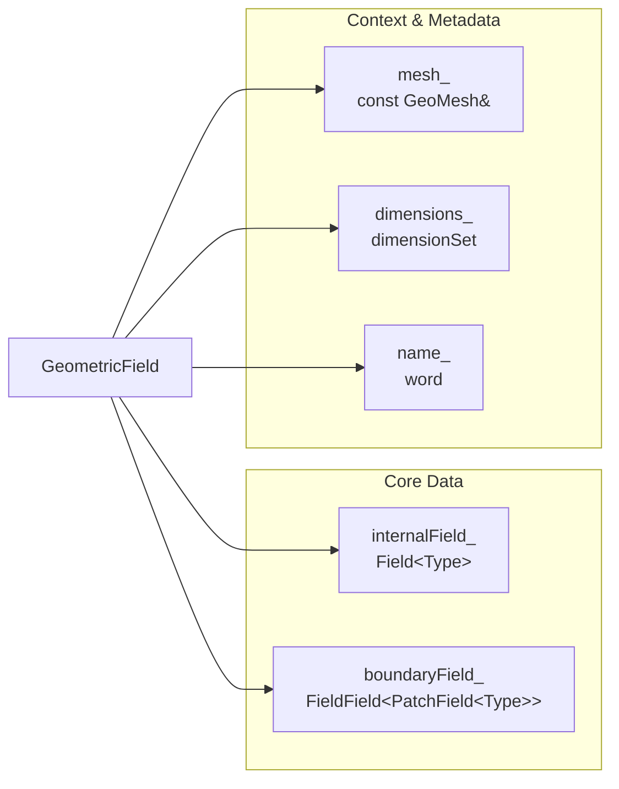

# 03 กลไกภายใน: ตัวแปรสมาชิกและความหมายทางฟิสิกส์

![[geometric_field_anatomy.png]]
`A clean scientific diagram illustrating the internal components of a GeometricField. Show a 3D computational mesh. Highlight the "Internal Field" (values at cell centers), "Boundary Fields" (values at the boundary faces), and the connection to the "fvMesh" object. Include a callout for the "dimensionSet" showing SI units. Use a minimalist palette with black lines and clear labels, scientific textbook diagram, clean vector line art, white background, high definition, flat design, educational infographic --ar 16:9`

เมื่อเราสร้างอินสแตนซ์ของเทมเพลต เช่น `GeometricField<Type>`, OpenFOAM จะจัดระเบียบข้อมูลภายในเพื่อให้สอดคล้องกับโครงสร้างของเมช (Mesh) และความต้องการทางฟิสิกส์:

## สถาปัตยกรรมการจัดเก็บข้อมูลหลัก


> **Figure 1:** องค์ประกอบภายในของ `GeometricField` ที่แสดงความสัมพันธ์ระหว่างข้อมูลฟิลด์หลัก (Internal และ Boundary) กับบริบทประกอบอื่นๆ เช่น เรขาคณิตของเมช, ระบบหน่วยมิติ, และชื่อเรียกสำหรับระบบ I/O

ใจกลางของ `GeometricField` คือสมาชิก `internalField_`:

```cpp
// Definition of GeometricField template class
// Template parameters: Type (field data type), PatchField (boundary field type), GeoMesh (mesh type)
template<class Type, template<class> class PatchField, class GeoMesh>
class GeometricField {
private:
    // 1. Storage of physical quantities at cell centers
    Field<Type> internalField_;  // Cell-centered values: φᵢ at cell i
```

**🔍 ที่มา (Source):** 
`src/OpenFOAM/fields/GeometricFields/GeometricField/GeometricField.H`

**📖 คำอธิบาย (Explanation):**
คอนเทนเนอร์ `Field<Type>` นี้จัดเก็บค่าหลักของปริมาณทางกายภาพที่ศูนย์กลางเซลล์ทั่วทั้งโดเมนการคำนวณ พารามิเตอร์เทมเพลต `Type` กำหนดลักษณะทางคณิตศาสตร์ของปริมาณที่จัดเก็บ:

- **ฟิลด์สเกลาร์** (`Type = scalar`): `internalField_[i]` จัดเก็บค่าเดียวเช่นความดัน $p_i$, อุณหภูมิ $T_i$, หรือความเข้มข้น $C_i$ ที่เซลล์ $i$
- **ฟิลด์เวกเตอร์** (`Type = vector`): `internalField_[i]` จัดเก็บสามองค์ประกอบ $(u_i, v_i, w_i)$ แทนความเร็วหรือปริมาณเวกเตอร์อื่น ๆ ที่เซลล์ $i$
- **ฟิลด์เทนเซอร์** (`Type = tensor`): `internalField_[i]` จัดเก็บเทนเซอร์ $3×3$ ที่สมบูรณ์แทนความเครียด, อัตราการบิดเบี้ยว, หรือปริมาณทางกายภาพอันดับสองอื่น ๆ ที่เซลล์ $i$

`internalField_` จับคู่โดยตรงกับหลักการการกระจายปริมาตรจำกัดที่ปริมาณทางกายภาพถูกกำหนดที่ศูนย์กลางเซลล์และประมาณในปริมาตรเซลล์แต่ละเซลล์โดยใช้ scheme การแทรกสอดที่เหมาะสม

**🎯 หัวใจสำคัญ (Key Concepts):**
- **Cell-centered storage**: ค่าที่ศูนย์กลางเซลล์เป็นแนวทางหลักของ Finite Volume Method
- **Template parameter Type**: กำหนดประเภทข้อมูลทางคณิตศาสตร์ (scalar/vector/tensor)
- **Memory layout**: เค้าโครงหน่วยความจำต่อเนื่องสำหรับประสิทธิภาพสูง

## การนำฟิสิกส์ขอบเขตไปใช้

สมาชิก `boundaryField_` ให้กรอบงานสำหรับการนำเงื่อนไขขอบเขตไปใช้:

```cpp
    // 2. Management of boundary physics
    // FieldField is a container of boundary patch fields
    FieldField<PatchField<Type>, GeoMesh> boundaryField_;
```

**🔍 ที่มา (Source):** 
`src/OpenFOAM/fields/GeometricFields/GeometricField/GeometricField.H`

**📖 คำอธิบาย (Explanation):**
คอนเทนเนอร์ที่ซับซ้อนนี้จัดเก็บข้อมูลเงื่อนไขขอบเขตสำหรับพาทช์ขอบเขตทั้งหมดในเมช แต่ละออบเจกต์ `PatchField<Type>` ห่อหุ้มฟิสิกส์ของพฤติกรรมฟิลด์ที่ขอบเขตเฉพาะ:

- **เงื่อนไขขอบเขตสเกลาร์**: `PatchField<scalar>` ใช้เงื่อนไขเช่น fixedValue สำหรับอุณหภูมิหรือความดันที่กำหนด, zeroGradient สำหรับผนังแอดิอะแบติก, และเงื่อนไขผสมสำหรับการถ่ายเทความร้อยแบบคอนเวคชัน
- **เงื่อนไขขอบเขตเวกเตอร์**: `PatchField<vector>` จัดการเงื่อนไขขอบเขตความเร็วที่ซับซ้อนรวมถึง noSlip (ผนังไม่ลื่น), movingWall (ขอบเขตเคลื่อนที่), pressureInletVelocity, และ symmetryPlane
- **เงื่อนไขขอบเขตเทนเซอร์**: `PatchField<tensor>` จัดการเงื่อนไขขอบเขตความเครียดและขอบเขตฟิลด์เทนเซอร์อื่น ๆ

แต่ละพาทช์ขอบเขตรักษาแบบจำลองฟิสิกส์อิสระของตัวเอง อนุญาตให้มีเงื่อนไขขอบเขตที่แตกต่างกันในส่วนต่าง ๆ ของโดเมนการคำนวณ คอนเทนเนอร์ `FieldField` ให้การเข้าถึงออบเจกต์ฟิลด์เฉพาะพาทช์เหล่านี้อย่างมีประสิทธิภาพระหว่างการประกอบเมทริกซ์และขั้นตอนการแก้ปัญหา

**🎯 หัวใจสำคัญ (Key Concepts):**
- **Patch-based architecture**: แต่ละพาทช์มีเงื่อนไขขอบเขตอิสระ
- **Runtime polymorphism**: ประเภทเงื่อนไขขอบเขตถูกกำหนดขณะทำงาน
- **FieldField container**: คอนเทนเนอร์สำหรับจัดการชุดของพาทช์ฟิลด์

## การผสานรวมบริบทเรขาคณิต

สมาชิก `mesh_` สร้างรากฐานเรขาคณิตสำหรับการดำเนินงานฟิลด์ทั้งหมด:

```cpp
    // 3. Mesh geometry context
    // Reference to mesh geometry for finite volume operations
    const GeoMesh& mesh_;  // Reference to mesh geometry
```

**🔍 ที่มา (Source):** 
`src/OpenFOAM/fields/GeometricFields/GeometricField/GeometricField.H`

**📖 คำอธิบาย (Explanation):**
การอ้างอิงนี้ให้การเข้าถึงบริบทเรขาคณิตที่สมบูรณ์ที่จำเป็นสำหรับการคำนวณปริมาตรจำกัด:

- **เมชปริมาตร (`volMesh`)**: เมื่อ `GeoMesh = volMesh`, ฟิลด์แทนปริมาณที่จุดศูนย์กลางเซลล์โดยมีการเข้าถึงปริมาตรเซลล์ $\Delta V_i$, พื้นที่ผิวหน้า $A_f$, และการเชื่อมต่อเซลล์ข้างเคียง
- **เมชผิวหน้า (`surfaceMesh`)**: เมื่อ `GeoMesh = surfaceMesh`, ฟิลด์แทนปริมาณที่จุดศูนย์กลางผิวหน้าที่ใช้สำหรับการคำนวณฟลักซ์และการสร้างฟังก์ชันไล่ระดับ

การอ้างอิงเมชช่วยให้การดำเนินงานฟิลด์สามารถเข้าถึงข้อมูลเรขาคณิตที่จำเป็นรวมถึง:
- พิกัดจุดศูนย์กลางเซลล์ $\mathbf{r}_i$ สำหรับการแทรกสอดและการสร้างใหม่
- เวกเตอร์ปกติผิวหน้า $\mathbf{n}_f$ สำหรับการคำนวณฟลักซ์
- ปริมาตรเซลล์ $\Delta V_i$ สำหรับปริพันธ์ปริมาตรในวิธีการปริมาตรจำกัด
- รายการเซลล์ข้างเคียงสำหรับการสร้างตัวดำเนินการแยก

**🎯 หัวใจสำคัญ (Key Concepts):**
- **GeoMesh abstraction**: ชั้นนามธรรมสำหรับทั้ง volMesh และ surfaceMesh
- **Const reference**: การอ้างอิงคงที่ป้องกันการเปลี่ยนแปลงเรขาคณิต
- **Geometric context**: ให้บริบทสำหรับการดำเนินงานเชิงปริมาตรจำกัด

## กรอบการวิเคราะห์มิติ

สมาชิก `dimensions_` ใช้ระบบการวิเคราะห์มิติอันทรงพลังของ OpenFOAM:

```cpp
    // 4. Physical dimensions (unit analysis)
    // Dimension set for dimensional consistency checking
    dimensionSet dimensions_;  // Dimensions [M L T Θ N I J]
```

**🔍 ที่มา (Source):** 
`src/OpenFOAM/dimensionSet/dimensionSet.H`

**📖 คำอธิบาย (Explanation):**
ออบเจกต์ `dimensionSet` นี้เข้ารหัสมิติทางกายภาพของฟิลด์โดยใช้หน่วยฐาน SI:
- **M**: มวล [kg]
- **L**: ความยาว [m]
- **T**: เวลา [s]
- **Θ**: อุณหภูมิ [K]
- **N**: ปริมาณของสาร [mol]
- **I**: กระแสไฟฟ้า [A]
- **J**: ความเข้มแสง [cd]

มิติฟิลด์ CFD ทั่วไป ได้แก่:
- **ความดัน**: $[M L^{-1} T^{-2}]$ = kg·m⁻¹·s⁻²
- **ความเร็ว**: $[L T^{-1}]$ = m·s⁻¹
- **ความหนืดไดนามิก**: $[M L^{-1} T^{-1}]$ = kg·m⁻¹·s⁻¹
- **ความหนืดจลน์**: $[L^2 T^{-1}]$ = m²·s⁻¹
- **ความนำความร้อย**: $[M L T^{-3} Θ^{-1}]$ = W·m⁻¹·K⁻¹

การวิเคราะห์มิตินี้ช่วยให้การตรวจสอบความสม่ำเสมอของสมการโดยอัตโนมัติ ป้องกันการดำเนินการที่ไม่มีความหมายทางกายภาพระหว่างการจัดการพีชคณิตของนิพจน์ฟิลด์

**🎯 หัวใจสำคัญ (Key Concepts):**
- **Dimensional consistency**: การตรวจสอบความสอดคล้องของมิติอัตโนมัติ
- **SI base units**: ระบบหน่วยฐาน SI 7 หน่วย
- **Compile-time checking**: การตรวจสอบขณะคอมไพล์ป้องกันข้อผิดพลาด

## ระบบการระบุฟิลด์

สมาชิก `name_` ให้การระบุที่อ่านได้:

```cpp
    // 5. Field identification
    // Human-readable name for I/O operations and debugging
    word name_;  // "p", "U", "T", etc. - for I/O and debugging
```

**🔍 ที่มา (Source):** 
`src/OpenFOAM/fields/GeometricFields/GeometricField/GeometricField.H`

**📖 คำอธิบาย (Explanation):**
ตัวระบุสตริงนี้ให้บริการหลายวัตถุประสงค์ในกรอบงาน OpenFOAM:
- **การดำเนินงานไฟล์ I/O**: กำหนดชื่อไฟล์ฟิลด์สำหรับการอ่าน/เขียนข้อมูลการจำลอง
- **การประมวลผลหลัง**: ช่วยให้เลือกฟิลด์และการสร้างภาพในเครื่องมือเช่น paraFoam
- **การดีบักกิ้ง**: ให้ตัวระบุที่มีความหมายสำหรับข้อความแสดงข้อผิดพลาดและการจัดการฟิลด์
- **ส่วนติดต่อผู้ใช้**: ช่วยให้อ้างอิงฟิลด์อย่างเป็นธรรมชาติในพจนานุกรมควบคุมและข้อมูลจำเพาะเงื่อนไขขอบเขต

ชื่อฟิลด์ทั่วไปตามข้อตกลงที่ก่อตั้ง: "p" สำหรับความดัน, "U" สำหรับความเร็ว, "T" สำหรับอุณหภูมิ, "k" และ "ω" สำหรับปริมาณความปั่นป่วน, และ "alpha" สำหรับเศษส่วนเฟสในการไหลหลายเฟส

**🎯 หัวใจสำคัญ (Key Concepts):**
- **word type**: ประเภทสตริงพิเศษของ OpenFOAM ที่มีประสิทธิภาพ
- **I/O mapping**: การจับคู่ชื่อฟิลด์กับไฟล์
- **Field conventions**: ข้อตกลงการตั้งชื่อมาตรฐาน

## ความคู่แบบกายภาพ-การคำนวณ

ความงามของ `GeometricField` อยู่ในลักษณะคู่ของมันทั้งเป็นคอนเทนเนอร์ปริมาณทางกายภาพและโครงสร้างข้อมูลการคำนวณ ตัวแปรสมาชิกแต่ละตัวสะพานช่องว่างระหว่างแนวคิด CFD ทฤษฎีและการนำไปใช้จริง:

- **ความสำคัญทางกายภาพ**: `internalField_` แทนค่าฟิลด์ต่อเนื่อง
- **การดำเนินงานทางคณิตศาสตร์**: ช่วยให้การจัดการพีชคณิตรักษาความสม่ำเสมอของมิติ
- **ประสิทธิภาพการคำนวณ**: ให้เค้าโครงหน่วยความจำที่เหมาะสมและรูปแบบการเข้าถึงแคชที่เป็นมิตร
- **ความแม่นยำทางตัวเลข**: รักษาความแม่นยำผ่านการออกแบบ scheme การแทรกสอดและการไล่ระดับอย่างระมัดระวัง

ปรัชญาการออกแบบนี้ช่วยให้ผู้ปฏิบัติงาน CFD ทำงานกับปริมาณที่มีความหมายทางกายภาพในขณะที่กรอบงานจัดการรายละเอียดการนำไปใช้ทางตัวเลขที่ซับซ้อนโดยอัตโนมัติ

**🔍 ที่มา (Source):** 
`src/OpenFOAM/fields/GeometricFields/GeometricField/GeometricField.H`

**🎯 หัวใจสำคัญ (Key Concepts):**
- **Dual nature**: ลักษณะคู่ทั้งทางกายภาพและการคำนวณ
- **Abstraction layers**: ชั้นนามธรรมที่แยกฟิสิกส์จากการนำไปใช้
- **Design philosophy**: ปรัชญาการออกแบบที่เน้นความง่ายในการใช้งาน