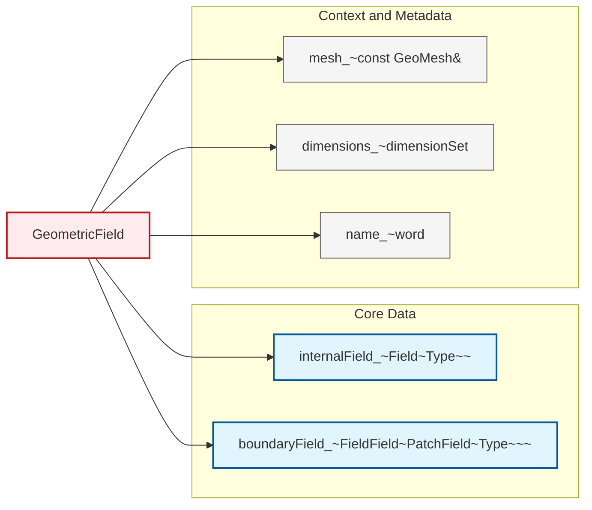

# 03 กลไกภายในของเทมเพลต: การสร้างตัวแปรและการแก้ปัญหาชื่อ

> [!TIP] ความสำคัญของ Template Instantiation
> ทำความเข้าใจกลไกภายในของการสร้างตัวแปรเทมเพลต (Template Instantiation) เป็นพื้นฐานสำคัญสำหรับการพัฒนาโค้ด OpenFOAM ขั้นสูง ช่วยให้เข้าใจว่าคอมไพเลอร์จัดการเทมเพลตอย่างไร เมื่อใดเกิดข้อผิดพลาด และเพื่อให้สามารถเขียนเทมเพลตที่ยืดหยุ่นและมีประสิทธิภาพได้

![[template_instantiation_process.png]]
`A clean technical diagram illustrating the C++ template instantiation process. Show source code with template definition, compiler processing with type substitution, and generated concrete class instances. Include callouts for "Two-Phase Lookup", "Name Resolution", and "Symbol Table". Use a minimalist palette with black lines and clear labels, scientific textbook diagram, clean vector line art, white background, high definition, flat design, educational infographic --ar 16:9`

เมื่อเราใช้เทมเพลตใน C++ และ OpenFOAM เช่น `GeometricField<scalar, fvPatchField, volMesh>` คอมไพเลอร์ต้องดำเนินการกระบวนการที่ซับซ้อนเพื่อแปลงเทมเพลตนี้เป็นโค้ดที่สามารถ execute ได้จริง

## Learning Objectives

หลังจากศึกษาบทนี้ คุณควรจะสามารถ:

1. **อธิบาย** ขั้นตอนของ Template Instantiation และความแตกต่างระหว่าง implicit และ explicit instantiation
2. **วิเคราะห์** กลไก Two-Phase Lookup ใน C++ และผลกระทบต่อการเขียนเทมเพลต
3. **จัดการ** ปัญหา Name Resolution และ dependent names ในเทมเพลต
4. **ประยุกต์** ความรู้เรื่อง instantiation กับ GeometricField และเทมเพลต OpenFOAM อื่นๆ
5. **ดีบัก** ข้อผิดพลาดที่เกิดจาก template instantiation อย่างมีประสิทธิภาพ

---

## สถาปัตยกรรมของ GeometricField

> [!NOTE] **📂 OpenFOAM Context**
> **Domain:** Coding/Customization (src/ directory)
> - **Source File:** `src/OpenFOAM/fields/GeometricFields/GeometricField/GeometricField.H`
> - **Key Classes:** `GeometricField`, `Field<Type>`, `DimensionedField`, `fvMesh`
> - **Usage:** เมื่อสร้างฟิลด์ใหม่ในโค้ด เช่น `volScalarField p(mesh, dimensionSet, ...)` คอมไพเลอร์จะ instantiate `GeometricField<scalar, fvPatchField, volMesh>`
> - **Memory Layout:** ข้อมูลภายในถูกจัดเก็บใน `internalField_` ซึ่งเป็นสมาชิกหลักที่เข้าถึงค่าที่ cell centers

ก่อนเจาะลึกกลไกการทำงานของเทมเพลต ให้เราทบทวนโครงสร้างภายในของ `GeometricField` ซึ่งเป็นเทมเพลตหลักที่ใช้จัดเก็บข้อมูลฟิสิกส์ใน OpenFOAM:



**Figure 1:** องค์ประกอบภายในของ `GeometricField<Type, PatchField, GeoMesh>` แสดงความสัมพันธ์ระหว่างข้อมูลหลัก บริบทเรขาคณิต และ metadata

### 1. Internal Field - การจัดเก็บค่าที่ Cell Centers

```cpp
// Template definition with three parameters
template<class Type, template<class> class PatchField, class GeoMesh>
class GeometricField {
private:
    // Main storage: cell-centered values
    Field<Type> internalField_;  // φᵢ at cell center i
```

**🔍 ที่มา (Source):** 
`src/OpenFOAM/fields/GeometricArrays/GeometricField/GeometricField.H:157`

**📖 คำอธิบาย (Explanation):**

เมื่อ instantiate `GeometricField<scalar, fvPatchField, volMesh>`:
- **Type = scalar**: `internalField_` จะเป็น `Field<scalar>` เก็บค่าเดียวต่อเซลล์ (เช่น ความดัน $p_i$, อุณหภูมิ $T_i$)
- **Type = vector**: `internalField_` จะเป็น `Field<vector>` เก็บ 3 components ต่อเซลล์ (เช่น ความเร็ว $(u_i, v_i, w_i)$)
- **Type = tensor**: `internalField_` จะเป็น `Field<tensor>` เก็บเทนเซอร์ $3×3$ ต่อเซลล์

คอมไพเลอร์สร้าง implementation ที่แตกต่างกันสำหรับแต่ละ `Type` ที่ใช้ ซึ่งเป็นรูปแบบพื้นฐานของ **template instantiation**

### 2. Boundary Field - การจัดการเงื่อนไขขอบเขต

```cpp
    // Boundary conditions management
    FieldField<PatchField<Type>, GeoMesh> boundaryField_;
```

**🔍 ที่มา (Source):** 
`src/OpenFOAM/fields/GeometricArrays/GeometricField/GeometricField.H:160`

**📖 คำอธิบาย (Explanation):**

เมื่อ instantiate ด้วย `PatchField = fvPatchField`:
- แต่ละ boundary patch จะมี `fvPatchField<scalar>` สำหรับ scalar field
- หรือ `fvPatchField<vector>` สำหรับ vector field
- Runtime polymorphism ผ่าน virtual functions ของ `PatchField` base class

---

## ขั้นตอน Template Instantiation

> [!NOTE] **📂 OpenFOAM Context**
> **Domain:** Compilation/Build (wmake/Make/)
> - **Build Process:** เมื่อรัน `wmake` คอมไพเลอร์จะ instantiate templates สำหรับทุก Type ที่ถูกใช้ใน solver
> - **Symbol Visibility:** Template code ถูก compile ใน translation unit แต่ละไฟล์ อาจเกิด symbol duplication ใน object files
> - **Explicit Instantiation:** OpenFOAM ใช้ explicit instantiation ใน `.C` files เพื่อลด compile time เช่นใน `src/OpenFOAM/fields/GeometricFields/GeometricField/GeometricField.C`

### Implicit Instantiation

เกิดเมื่อคอมไพเลอร์พบการใช้เทมเพลตกับ type ที่เฉพาะเจาะจง:

```cpp
// In your solver code
volScalarField p(mesh, dimensionSet(0, 2, -2, 0, 0, 0, 0), "p");
volVectorField U(mesh, dimensionSet(0, 1, -1, 0, 0, 0, 0), "U");

// Compiler implicitly instantiates:
// - GeometricField<scalar, fvPatchField, volMesh> for p
// - GeometricField<vector, fvPatchField, volMesh> for U
```

**ขั้นตอนการทำงาน:**

1. **Template Argument Deduction**: คอมไพเลอร์อนุมาน template arguments จาก types ของ arguments
2. **Type Substitution**: แทนที่ template parameters ด้วย concrete types
3. **Function Signature Generation**: สร้าง signature ที่สมบูรณ์สำหรับ instantiated function
4. **Compilation**: compile เทมเพลตที่ถูก instantiate นี้เป็น machine code

### Explicit Instantiation

บอกคอมไพเลอร์ล่วงหน้าว่าจะ instantiate เทมเพลตกับ types ใด:

```cpp
// In GeometricField.C
template class GeometricField<scalar, fvPatchField, volMesh>;
template class GeometricField<vector, fvPatchField, volMesh>;
template class GeometricField<tensor, fvPatchField, volMesh>;
template class GeometricField<symmTensor, fvPatchField, volMesh>;
```

**ประโยชน์:**
- ลด compile time เพราะ instantiate ครั้งเดียวในไฟล์ `.C`
- ลด object file size หลีกเลี่ยง code bloat
- ควบคุมได้ว่าจะสร้าง version ใดบ้าง

---

## Two-Phase Lookup

> [!NOTE] **📂 OpenFOAM Context**
> **Domain:** Coding/Customization (Template Library Design)
> - **Impact:** เมื่อเขียนเทมเพลตใหม่ ต้องระวัง dependent names ที่อาจไม่ถูกพบใน Phase 1
> - **Example:** ใน `GeometricField` การเรียก `mesh_.C()` (cell centers) ต้องใช้ `this->mesh_.C()` หรือ `this->mesh_.C()` ในบาง context

Two-Phase Lookup คือกลไกที่คอมไพเลอร์ C++ ใช้ค้นหา names (variables, functions, types) ภายใน template definitions:

### Phase 1: Template Definition Parsing

เกิดเมื่อคอมไพเลอร์ **อ่าน** template definition ครั้งแรก:

```cpp
template<class Type>
class GeometricField {
    const GeoMesh& mesh_;  // mesh_ ถูกบันทึก
    
    Type average() const {
        // mesh_.C() เป็น dependent name - ขึ้นกับ GeoMesh
        return sum(mesh_.C()) / mesh_.size();  // ❶ ไม่ตรวจสอบตอนนี้!
    }
};
```

ใน Phase 1 คอมไพเลอร์:
- ✅ ตรวจ **syntax** ว่าถูกต้อง
- ✅ ตรวจ **non-dependent names** (names ที่ไม่ขึ้นกับ template parameters)
- ❌ **ไม่ตรวจ** dependent names (เช่น `mesh_.C()`) เพราะยังไม่รู้ Type ของ `GeoMesh`

### Phase 2: Template Instantiation

เกิดเมื่อคอมไพเลอร์ **ใช้** template กับ concrete type:

```cpp
// ตอนนี้ GeoMesh = volMesh
GeometricField<scalar, fvPatchField, volMesh> field;
// คอมไพเลอร์ตรวจสอบว่า volMesh มีสมาชิก C() หรือไม่
```

ใน Phase 2 คอมไพเลอร์:
- ✅ แทนที่ `GeoMesh` ด้วย `volMesh`
- ✅ ตรวจสอบว่า `volMesh` มี method `C()` จริงๆ
- ✅ ตรวจสอบ return types และ function signatures

### Dependent vs Non-Dependent Names

| Name Type | Definition | Lookup Phase |
|-----------|------------|--------------|
| **Non-Dependent** | ไม่ขึ้นกับ template parameters | Phase 1 |
| **Dependent** | ขึ้นกับ template parameters | Phase 2 |

```cpp
template<class Type>
class MyClass {
    int x_;              // ❶ Non-dependent: Type รู้จักแล้ว
    Type value_;         // ❷ Dependent: ขึ้นกับ Type
    Type::iterator it_;  // ❸ Dependent: iterator อยู่ใน Type
    
    void method() {
        x_ = 5;          // ❶ OK: ตรวจสอบใน Phase 1
        value_ = 0;      // ❷ OK: ตรวจสอบใน Phase 2
        it_->begin();    // ❸ Needs: typename keyword (ดูด้านล่าง)
    }
};
```

### การแก้ปัญหา Dependent Names

ใช้ `typename` และ `template` keywords เพื่อบอกคอมไพเลอร์ว่าเป็น dependent names:

```cpp
template<class Type>
class GeometricField {
    // ใช้ typename เมื่อ dependent name เป็น type
    typedef typename Type::value_type value_type;
    
    // ใช้ template keyword เมื่อ dependent name เป็น template method
    template<class T>
    void callTemplateMethod(T& obj) {
        obj.template method<Type>();  // บอก compiler ว่า method เป็น template
    }
};
```

---

## Name Resolution ใน Templates

> [!NOTE] **📂 OpenFOAM Context**
> **Domain:** Debugging/Troubleshooting
> - **Common Error:** "no matching function call" เมื่อ instantiate template
> - **Cause:** Function ไม่ถูกพบใน Phase 1 เพราะเป็น dependent name
> - **Solution:** ใช้ `using` declarations, `this->` pointer, หรือ qualify names อย่างเต็มรูปแบบ

### ปัญหาที่พบบ่อย

```cpp
template<class Type>
class Base {
public:
    void interfaceMethod();
};

template<class Type>
class Derived : public Base<Type> {
public:
    void myMethod() {
        interfaceMethod();  // ❌ Error: not found in Phase 1
    }
};
```

**ทำไมไม่พบ?** `interfaceMethod` เป็น dependent name (อยู่ใน `Base<Type>`) ดังนั้นไม่ถูกค้นหาใน Phase 1

### ทางแก้ไข

**Option 1: Use `this->`**
```cpp
void myMethod() {
    this->interfaceMethod();  // ✅ OK: บอก compiler ว่าเป็น dependent name
}
```

**Option 2: Qualify with base class**
```cpp
void myMethod() {
    Base<Type>::interfaceMethod();  // ✅ OK: ระบุ source อย่างชัดเจน
}
```

**Option 3: Using declaration**
```cpp
template<class Type>
class Derived : public Base<Type> {
    using Base<Type>::interfaceMethod;  // นำเข้าสู่ scope
    
public:
    void myMethod() {
        interfaceMethod();  // ✅ OK: ถูกนำเข้าแล้ว
    }
};
```

---

## ตัวอย่างใน OpenFOAM: GeometricField Instantiation

> [!NOTE] **📂 OpenFOAM Context**
> **Domain:** Coding/Customization (Solver & Boundary Condition Development)
> - **Real Example:** ใน `src/finiteVolume/cfdTools/general/adjustPhi/adjustPhi.C`
> - **Usage:** Function template ที่รับ `GeometricField<Type>` และถูก instantiate สำหรับ scalar/vector

```cpp
// Template function in header
template<class Type>
Type calculateSum(const GeometricField<Type, fvPatchField, volMesh>& field) {
    Type sum = Zero;
    forAll(field, i) {
        sum += field.internalField()[i];
    }
    return sum;
}

// Explicit instantiation in .C file
template scalar calculateSum<scalar>(
    const GeometricField<scalar, fvPatchField, volMesh>&
);
template vector calculateSum<vector>(
    const GeometricField<vector, fvPatchField, volMesh>&
);
```

**ขั้นตอน instantiation:**

1. **Header included**: Template definition ถูกอ่านใน Phase 1
2. **Function called**: เมื่อเรียก `calculateSum(p)` โดยที่ `p` เป็น `volScalarField`
3. **Type deduction**: `Type` = `scalar`
4. **Instantiation**: สร้าง `calculateSum<scalar>` ที่ compile ได้จริง
5. **Linking**: Linker เชื่อมต่อกับ explicit instantiation ใน `.C` file

---

## การ Debug Template Instantiation Errors

> [!NOTE] **📂 OpenFOAM Context**
> **Domain:** Debugging/Troubleshooting
> - **Common Compiler:** GCC/Clang ด้วย `-std=c++11` หรือใหม่กว่า
> - **Error Messages:** มักยาวและซับซ้อนเพราะ expand template instantiation stack
> - **Tools:** `wmake |& grep -A 10 "error:"` เพื่อดู errors ที่เกี่ยวข้อง

### ประเภทข้อผิดพลาดทั่วไป

| Error Type | Cause | Solution |
|------------|-------|----------|
| **no type named 'X' in 'Y'** | Dependent type ไม่มี `typename` | เพิ่ม `typename` keyword |
| **no matching function** | Function ไม่ถูกพบใน Phase 1 | ใช้ `this->` หรือ qualify name |
| **template argument deduction failed** | Types ไม่ match | ตรวจสอบ template parameters |
| **undefined reference to** | Instantiation ไม่ถูก export | เพิ่ม explicit instantiation |

### เทคนิคการดีบัก

1. **Static Assert สำหรับ Type Checking**
```cpp
template<class Type>
void myFunction(const GeometricField<Type, ...>& field) {
    static_assert(std::is_same<Type, scalar>::value || 
                  std::is_same<Type, vector>::value,
                  "Type must be scalar or vector");
}
```

2. **Enable_if สำหรับ SFINAE**
```cpp
template<class Type, typename = typename std::enable_if<
    std::is_floating_point<Type>::value>::type>
void onlyForFloatingPoint(const GeometricField<Type, ...>& field);
```

3. **Type Traits สำหรับ Inspection**
```cpp
template<class Type>
constexpr bool isVectorField() {
    return std::is_same<Type, vector>::value;
}
```

---

## 🧠 Concept Check

<details>
<summary>1. Template Instantiation แตกต่างกันอย่างไรระหว่าง implicit และ explicit?</summary>

**คำตอบ:** 
- **Implicit**: เกิดอัตโนมัติเมื่อคอมไพเลอร์พบการใช้เทมเพลตกับ concrete type
- **Explicit**: โปรแกรมเมอร์ระบุไว้ล่วงหน้าด้วย `template class MyClass<Type>;` เพื่อควบคุมเวลาและที่ที่ instantiation เกิดขึ้น
</details>

<details>
<summary>2. Two-Phase Lookup ทำงานอย่างไรใน C++ templates?</summary>

**คำตอบ:**
- **Phase 1**: เมื่ออ่าน template definition ครั้งแรก - ตรวจ syntax และ non-dependent names
- **Phase 2**: เมื่อ instantiate กับ concrete type - ตรวจ dependent names และสร้าง code จริง
</details>

<details>
<summary>3. ทำไมต้องใช้ `typename` keyword สำหรับ dependent types?</summary>

**คำตอบ:** เพื่อบอกคอมไพเลอร์ว่า name นั้นเป็น type ไม่ใช่ static member หรือ function ซึ่ง compiler ไม่สามารถแยกแยะได้ใน Phase 1 เพราะยังไม่รู้ concrete type
</details>

<details>
<summary>4. Dependent names ใน OpenFOAM templates ส่งผลต่อการเขียนโค้ดอย่างไร?</summary>

**คำตอบ:** ต้องระวังเมื่อเรียก methods ของ template parameters (เช่น `mesh_.C()`) หรือเข้าถึง types ภายใน template parameters อาจต้องใช้ `this->`, qualify names อย่างเต็มรูปแบบ หรือเพิ่ม `typename` keyword
</details>

---

## 📖 เอกสารที่เกี่ยวข้อง

*   **ก่อนหน้า:** [02_Template_Syntax.md](02_Template_Syntax.md) - ไวยากรณ์เทมเพลตพื้นฐาน
*   **ถัดไป:** [04_Instantiation_and_Specialization.md](04_Instantiation_and_Specialization.md) - การสร้างตัวแปรขั้นสูงและ Template Specialization

---

## 🎯 Key Takeaways

1. **Template Instantiation** เป็นกระบวนการแปลงเทมเพลตเป็น code ที่สามารถ execute ได้ โดยคอมไพเลอร์ substitute template parameters ด้วย concrete types

2. **Two-Phase Lookup** แบ่งการตรวจสอบ names เป็น 2 ขั้นตอน: Phase 1 (ตรวจ non-dependent names) และ Phase 2 (ตรวจ dependent names หลัง instantiation)

3. **Dependent Names** คือ names ที่ขึ้นกับ template parameters ซึ่งต้องใช้ `typename`, `template` keywords หรือ `this->` pointer เพื่อช่วยคอมไพเลอร์ในการค้นหา

4. **GeometricField** ใช้ template instantiation เพื่อสร้าง versions ที่แตกต่างกันสำหรับ scalar, vector, tensor fields ซึ่งช่วยให้โค้ด reusable และ type-safe

5. **Debugging Template Errors** ต้องการความเข้าใจ instantiation stack และข้อความ error ที่ยาว สามารถใช้ static_assert, type traits และ SFINAE เพื่อช่วยในการ debug