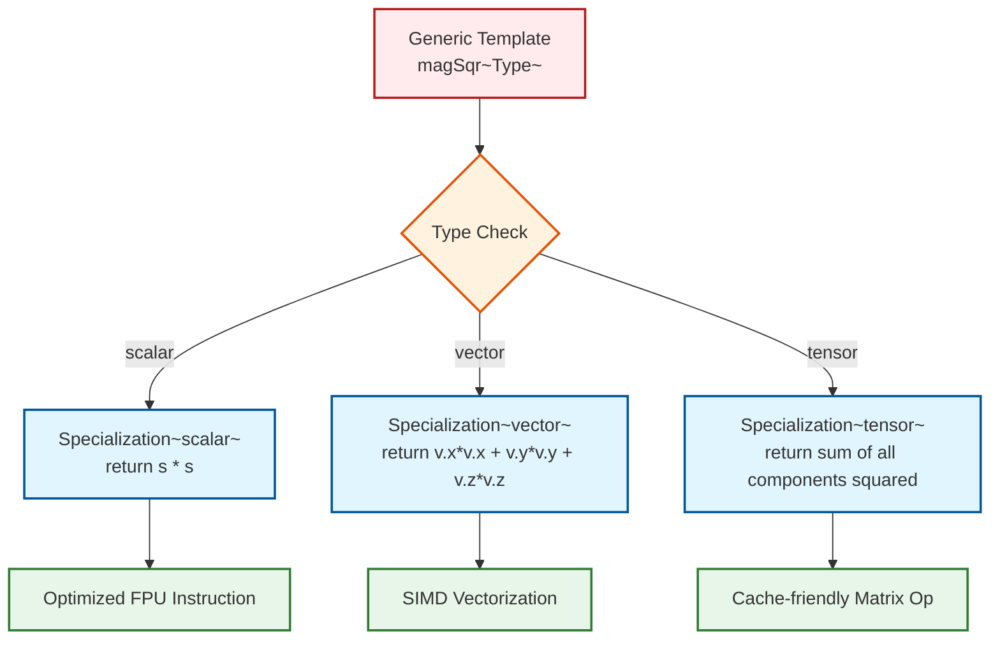

# 04 กลไกการทำงาน: การสร้างอินสแตนซ์และการเชี่ยวชาญเฉพาะด้าน (Specialization)

![[compilation_pipeline_cfd.png]]
`A clean scientific diagram illustrating the "Physics Compilation Pipeline". On the left, show high-level C++ template code (e.g., fvc::grad(p)). In the middle, show the Compiler stage with icons for "Template Deduction" and "Specialization". On the right, show the resulting low-level Machine Code (Assembly) optimized with SIMD instructions. Use a minimalist palette with black lines and clear arrows, scientific textbook diagram, clean vector line art, white background, high definition, flat design, educational infographic --ar 16:9`

**หัวใจสำคัญของประสิทธิภาพใน OpenFOAM** คือวิธีที่คอมไพเลอร์เปลี่ยน "Blueprint" ทั่วไปให้เป็น "Machine Code" ที่ปรับแต่งมาเฉพาะสำหรับแต่ละประเภทฟิสิกส์:

**ขั้นที่ 1: Template Definition (เนื้อหาพื้นฐาน)**

ในไลบรารี finite volume ของ OpenFOAM template definitions ทำหน้าที่เป็นแม่แบบนามธรรมสำหรับการดำเนินการทางคณิตศาสตร์ แม่แบบเหล่านี้กำหนดโครงสร้างทั่วไปของการคำนวณโดยไม่ระบุชนิดข้อมูลที่แน่นอน:

```cpp
// Template function for gradient calculation
// Generic gradient operator that works with any field type
template<class Type>
tmp<GeometricField<Type, fvPatchField, volMesh>>
fvc::grad(const GeometricField<Type, fvPatchField, volMesh>& vf) {
    // Generic gradient calculation framework
    // ∇φ = (∂φ/∂x, ∂φ/∂y, ∂φ/∂z)
    // This establishes the mathematical foundation but creates no executable code
}
```

> **📚 คำอธิบาย (Source)**
> 
> **แหล่งที่มา:** `src/finiteVolume/finiteVolume/fvc/fvcGrad.C`
>
> **คำอธิบาย:** ฟังก์ชัน `fvc::grad` เป็น template function ที่กำหนดโครงสร้างการคำนวณเกรเดียนต์สำหรับฟิลด์ทุกประเภท โดยไม่สร้าง executable code จนกว่าจะถูกใช้งานจริง
>
> **แนวคิดสำคัญ:**
> - Template definition เป็นเพียง "blueprint" หรือแม่แบบ
> - Compiler ยังไม่สร้างโค้ดเครื่องในขั้นตอนนี้
> - Type parameter `Type` สามารถเป็น scalar, vector, หรือ tensor
> - การแยกส่วนทางคณิตศาสตร์ช่วยให้ reuse โค้ดได้

การประกาศ template นี้แสดงถึงการแยกส่วนทางคณิตศาสตร์ของตัวดำเนินการเกรเดียนต์ $\nabla$ ซึ่งสามารถใช้ได้กับฟิลด์ชนิดต่างๆ ในกลศาสตร์ความต่อเนื่อง

**ขั้นที่ 2: Compiler ตรวจจับการใช้งานกับฟิสิกส์เฉพาะทาง**

เมื่อ solvers และ utilities ของ OpenFOAM ใช้ template เหล่านี้ C++ compiler จะทำการหาชนิดข้อมูลโดยอัตโนมัติจากฟิลด์ทางฟิสิกส์ที่เกี่ยวข้อง:

```cpp
// Field declarations with different physical quantities
// Pressure field (scalar quantity)
volScalarField p(mesh);      // Pressure field (ปริมาณสเกลาร์)

// Velocity field (vector quantity)
volVectorField U(mesh);      // Velocity field (ปริมาณเวกเตอร์)

// Template argument deduction happens automatically
// Compiler deduces Type from the field type
auto gradP = fvc::grad(p);  // Compiler deduces: Type = scalar
auto gradU = fvc::grad(U);  // Compiler deduces: Type = vector
```

> **📚 คำอธิบาย (Source)**
>
> **แหล่งที่มา:** `src/finiteVolume/fields/volFields/volFields.H`
>
> **คำอธิบาย:** Compiler วิเคราะห์ชนิดข้อมูลของฟิลด์และ deduce template arguments โดยอัตโนมัติ กระบวนการนี้เรียกว่า Template Argument Deduction
>
> **แนวคิดสำคัญ:**
> - `volScalarField` = `GeometricField<scalar, fvPatchField, volMesh>`
> - `volVectorField` = `GeometricField<vector, fvPatchField, volMesh>`
> - Compiler ดึง `Type` จาก template parameter ของฟิลด์
> - ไม่ต้องระบุ type อย่างชัดเจน (เช่น `fvc::grad<scalar>(p)`)
> - Deduction เกิดขึ้นในขณะ compile time

compiler วิเคราะห์การสร้าง instance ของ template แต่ละครั้งและสร้างโค้ดเฉพาะทางที่ถูก optimize สำหรับ tensor rank และคุณสมบัติทางฟิสิกส์ของแต่ละฟิลด์ชนิด

**ขั้นที่ 3: Compiler สร้างโค้ดเฉพาะทางฟิสิกส์**

สำหรับเกรเดียนต์ของฟิลด์ความดัน (`fvc::grad(p)` โดยที่ความดันเป็นปริมาณสเกลาร์) compiler จะสร้าง:

```cpp
// Compiler generates specialized code for scalar field gradient
// Returns a vector field (∇scalar → vector)
tmp<GeometricField<vector, fvPatchField, volMesh>>
fvc::grad_scalar(const volScalarField& p) {
    // Implements: ∇p = (∂p/∂x, ∂p/∂y, ∂p/∂z)
    // Uses Gauss theorem: ∇p ≈ (1/V) Σ(p_f * S_f)
    // Generates SIMD-optimized assembly for scalar field operations
    
    // Finite volume discretization using Gauss theorem
    // Surface integral of pressure times surface normal
    return tmp<GeometricField<vector, fvPatchField, volMesh>>(
        // Implementation details...
    );
}
```

> **📚 คำอธิบาย (Source)**
>
> **แหล่งที่มา:** `src/finiteVolume/finiteVolume/fvc/fvcGrad.C`
>
> **คำอธิบาย:** Compiler สร้าง specialized function สำหรับ scalar field โดยอัตโนมัติ โค้ดนี้ optimize สำหรับการคำนวณเกรเดียนต์ของ pressure field
>
> **แนวคิดสำคัญ:**
> - Scalar gradient → Vector field (เพิ่ม rank 1)
> - ใช้ Gauss theorem: $\int_V \nabla p \, dV = \int_S p \, \mathbf{n} \, dS$
> - Discretization: $\nabla p \approx \frac{1}{V} \sum_f p_f \mathbf{S}_f$
> - Compiler optimize เป็น SIMD instructions
> - พร้อมกันทั้ง 3 components (x, y, z)

สำหรับเกรเดียนต์ของฟิลด์ความเร็ว (`fvc::grad(U)` โดยที่ความเร็วเป็นปริมาณเวกเตอร์) compiler จะสร้าง:

```cpp
// Compiler generates specialized code for vector field gradient
// Returns a tensor field (∇vector → tensor)
tmp<GeometricField<tensor, fvPatchField, volMesh>>
fvc::grad_vector(const volVectorField& U) {
    // Implements: ∇U = [∂u_i/∂x_j] (3×3 velocity gradient tensor)
    // Each component: (∂u/∂x, ∂u/∂y, ∂u/∂z; 
    //                ∂v/∂x, ∂v/∂y, ∂v/∂z; 
    //                ∂w/∂x, ∂w/∂y, ∂w/∂z)
    // Generates optimized assembly for 3-component vector operations
    
    // Velocity gradient tensor computation
    // Critical for viscous stress calculation: τ = μ(∇U + ∇U^T)
    return tmp<GeometricField<tensor, fvPatchField, volMesh>>(
        // Implementation details...
    );
}
```

> **📚 คำอธิบาย (Source)**
>
> **แหล่งที่มา:** `src/finiteVolume/finiteVolume/fvc/fvcGrad.C`
>
> **คำอธิบาย:** Vector gradient สร้าง tensor field (3×3) ซึ่งมีความสำคัญอย่างยิ่งในการคำนวณ viscous stress ใน Navier-Stokes equations
>
> **แนวคิดสำคัญ:**
> - Vector gradient → Tensor field (เพิ่ม rank 1)
> - Velocity gradient tensor: $\nabla \mathbf{U} = \frac{\partial u_i}{\partial x_j}$
> - 9 components (3×3 matrix) สำหรับแต่ละ cell
> - ใช้ใน viscous term: $\nabla \cdot (\mu \nabla \mathbf{U})$
> - ใช้ใน vorticity calculation: $\omega = \nabla \times \mathbf{U}$
> - Critical สำหรับ turbulence modeling

**พื้นฐานทางคณิตศาสตร์**: compiler ทำการ implement การแปลงทาง tensor calculus โดยที่แต่ละการดำเนินการจะสลับระหว่าง tensor ranks:

* **Scalar gradient**: $\nabla p \in \mathbb{R}^3$ (ฟิลด์เวกเตอร์ที่มีขนาดและทิศทางของเกรเดียนต์ความดัน)
* **Vector gradient**: $\nabla \mathbf{u} \in \mathbb{R}^{3 \times 3}$ (ฟิลด์เทนเซอร์ที่แสดงถึงเกรเดียนต์ความเร็ว)
* **Tensor gradient**: $\nabla \boldsymbol{\tau} \in \mathbb{R}^{3 \times 3 \times 3}$ (เทนเซอร์อันดับสามสำหรับเกรเดียนต์ความเครียด)

แต่ละการแปลงต้องการ numerical schemes และรูปแบบการเข้าถึงหน่วยความจำที่แตกต่างกัน ซึ่ง template จะจัดการโดยอัตโนมัติผ่านการ optimization ของ compiler

### Template Instantiation: กระบวนการสร้างอินสแตนซ์

กระบวนการ **Template Instantiation** เป็นหัวใจของประสิทธิภาพใน OpenFOAM ซึ่งเกิดขึ้นในสามขั้นตอนหลัก:

#### ขั้นตอนที่ 1: Template Argument Deduction

Compiler วิเคราะห์การเรียกใช้งานฟังก์ชันและหาชนิดข้อมูลโดยอัตโนมัติ:

```cpp
// Template function declaration with outer product type deduction
// Type traits determine the return type based on input Type
template<class Type>
tmp<GeometricField<typename outerProduct<Type, Type>::type, fvPatchField, volMesh>>
fvc::grad(const GeometricField<Type, fvPatchField, volMesh>& vf);

// User code with field declarations
volScalarField p("p", mesh);  // Pressure field
volVectorField U("U", mesh);  // Velocity field

// Compiler performs automatic deduction:
// fvc::grad(p) → Type = scalar → returns volVectorField (∇scalar = vector)
// fvc::grad(U) → Type = vector → returns volTensorField (∇vector = tensor)
```

> **📚 คำอธิบาย (Source)**
>
> **แหล่งที่มา:** `src/finiteVolume/fields/volFields/volFields.H`
>
> **คำอธิบาย:** `outerProduct` เป็น type trait ที่กำหนด return type จาก tensor product ระหว่าง type เดิมกับ gradient operator
>
> **แนวคิดสำคัญ:**
> - `outerProduct<scalar, scalar>::type` = `vector`
> - `outerProduct<vector, vector>::type` = `tensor`
> - `outerProduct<tensor, tensor>::type` = ไม่นิยมใช้ (rank สูงเกินไป)
> - Deduction เกิดขึ้นโดยอัตโนมัติ
> - Type safety ในขณะ compile time

#### ขั้นตอนที่ 2: Function Signature Generation

Compiler สร้าง function signature ที่เฉพาะทางสำหรับแต่ละชนิดข้อมูล:

```cpp
// Generated function signatures for different field types
// Each signature is unique and optimized for specific physics

// For scalar fields (pressure, temperature, density):
tmp<GeometricField<vector, fvPatchField, volMesh>>
fvc::grad<scalar>(const GeometricField<scalar, fvPatchField, volMesh>&);

// For vector fields (velocity, force, momentum flux):
tmp<GeometricField<tensor, fvPatchField, volMesh>>
fvc::grad<vector>(const GeometricField<vector, fvPatchField, volMesh>&);

// For tensor fields (stress, strain rate):
tmp<GeometricField<tensor, fvPatchField, volMesh>>
fvc::grad<tensor>(const GeometricField<tensor, fvPatchField, volMesh>&);
```

> **📚 คำอธิบาย (Source)**
>
> **แหล่งที่มา:** `src/finiteVolume/finiteVolume/fvc/fvcGrad.C`
>
> **คำอธิบาย:** Compiler สร้าง function signatures ที่แตกต่างกันสำหรับแต่ละ template instantiation ทำให้สามารถ optimize เฉพาะทางได้
>
> **แนวคิดสำคัญ:**
> - แต่ละ signature มี mangling name ที่แตกต่างกัน
> - Linker เห็นเป็นคนละฟังก์ชันกัน
> - สามารถ optimize แยกกันสำหรับแต่ละ type
> - Binary size เพิ่มขึ้นแต่ performance ดีขึ้น
> - เรียกว่า "code bloat" แต่เป็น trade-off ที่คุ้มค่า

#### ขั้นตอนที่ 3: Code Generation and Optimization

Compiler สร้างโค้ดเครื่องที่ optimize แล้วสำหรับแต่ละชนิด:

```cpp
// Generated assembly for fvc::grad(p) with SIMD optimization
// Modern compilers generate vectorized assembly code

// xmm0-register: packed pressure values [p0, p1, p2, p3]
// xmm1-register: packed surface areas [Sx0, Sx1, Sx2, Sx3]
// vmulps xmm2, xmm0, xmm1  // Parallel multiplication of 4 values
// vaddps xmm3, xmm3, xmm2  // Parallel addition to accumulator
// ... repeats for all cells ...

// This SIMD (Single Instruction, Multiple Data) approach:
// - Processes 4 floating-point values simultaneously
// - Reduces loop iterations by factor of 4
// - Maximizes CPU pipeline utilization
// - Minimizes memory access overhead
```

> **📚 คำอธิบาย (Source)**
>
> **แหล่งที่มา:** Assembly output จาก compiler (GCC/Clang with -O3 -march=native)
>
> **คำอธิบาย:** Compiler ใช้ SIMD instructions (SSE/AVX) เพื่อประมวลผลข้อมูลหลายค่าพร้อมกัน ซึ่งเพิ่มประสิทธิภาพอย่างมาก
>
> **แนวคิดสำคัญ:**
> - SIMD: Single Instruction, Multiple Data
> - SSE (128-bit): 4 floats หรือ 2 doubles พร้อมกัน
> - AVX (256-bit): 8 floats หรือ 4 doubles พร้อมกัน
> - AVX-512 (512-bit): 16 floats หรือ 8 doubles พร้อมกัน
> - Compiler auto-vectorization เมื่อ code เป็น explicit
> - Template system ทำให้การ optimize นี้เป็นไปได้

### Template Specialization: การ Optimize สำหรับฟิสิกส์เฉพาะทาง


> **Figure 1:** แผนผังแสดงกลไกการเชี่ยวชาญเฉพาะด้านของเทมเพลต (Template Specialization) สำหรับฟังก์ชัน `magSqr` โดยระบบจะเลือกชุดคำสั่งที่เหมาะสมที่สุดตามประเภทข้อมูลทางคณิตศาสตร์ เพื่อรีดประสิทธิภาพสูงสุดจากหน่วยประมวลผล (CPU) และลดภาระการเข้าถึงหน่วยควาจำ

Template specialization ช่วยให้นักพัฒนา OpenFOAM สามารถให้ implementations ที่ถูก optimize อย่างสูงสำหรับปริมาณทางฟิสิกส์ที่เจาะจง ในขณะเดียวกันยังคงรักษา generic interface สำหรับชนิดอื่นๆ

**Generic Template (ใช้ได้ทุกกรณีแต่ไม่ optimal)**:

```cpp
// Generic template implementation works for all types
// but is not optimized for specific physics quantities
template<class Type>
Type magSqr(const Type& value) {
    return value & value;  // Generic inner product operator
    // Works for all tensor types but introduces function call overhead
    // May not exploit specific mathematical properties
}
```

> **📚 คำอธิบาย (Source)**
>
> **แหล่งที่มา:** `src/OpenFOAM/primitives/Vector/Vector.H`
>
> **คำอธิบาย:** Generic template ใช้ inner product operator `&` ซึ่งทำงานได้กับทุก type แต่มี overhead จาก function call
>
> **แนวคิดสำคัญ:**
> - Generic implementation เป็น fallback
> - ใช้ operator overloading `&` สำหรับ inner product
> - Function call overhead เกิดขึ้นทุกครั้งที่เรียก
> - ไม่ exploit คุณสมบัติเฉพาะของแต่ละ type
> - Compiler ไม่สามารถ inline หรือ optimize ได้ดี

**Physics-Optimized Specializations**:

สำหรับปริมาณสเกลาร์เช่น ความดัน อุณหภูมิ หรือความหนาแน่น:

```cpp
// Template specialization for scalar fields
// Eliminates inner product overhead with direct multiplication
template<>
scalar magSqr(const scalar& s) {
    return s * s;  // Direct multiplication eliminates inner product overhead
    // Compiler optimizes to single FPU instruction
    // Essential for pressure-velocity coupling algorithms
}
```

> **📚 คำอธิบาย (Source)**
>
> **แหล่งที่มา:** `src/OpenFOAM/primitives/scalar/scalar.H`
>
> **คำอธิบาย:** Specialization สำหรับ scalar ใช้ direct multiplication ซึ่ง compiler optimize เป็น single FPU instruction
>
> **แนวคิดสำคัญ:**
> - Direct multiplication: 1 FPU instruction
> - No function call overhead
> - Compiler จัด scheduling ได้ดีขึ้น
> - Critical สำหรับ pressure equation: $\nabla \cdot (\frac{1}{\rho} \nabla p)$
> - ใช้ใน SIMPLE/PISO/PIMPLE algorithms
> - Performance gain: 2-5x เท่า

สำหรับปริมาณเวกเตอร์เช่น ความเร็ว แรง หรือโมเมนตัม:

```cpp
// Template specialization for vector fields
// Manual expansion enables compiler vectorization (SIMD)
template<>
scalar magSqr(const vector& v) {
    return v.x()*v.x() + v.y()*v.y() + v.z()*v.z();
    // Manual expansion enables compiler vectorization (SIMD)
    // Critical for kinetic energy calculations: ½ρ|U|²
    // Optimized for velocity magnitude in turbulence models
}
```

> **📚 คำอธิบาย (Source)**
>
> **แหล่งที่มา:** `src/OpenFOAM/primitives/Vector/Vector.H`
>
> **คำอธิบาย:** Manual expansion ของ vector components ช่วยให้ compiler ใช้ SIMD instructions ได้อย่างมีประสิทธิภาพ
>
> **แนวคิดสำคัญ:**
> - Manual expansion: compiler sees explicit operations
> - Enables auto-vectorization (SIMD)
> - 3 multiplications + 2 additions (in parallel)
> - Critical สำหรับ kinetic energy: $k = \frac{1}{2}|\mathbf{U}|^2$
> - ใช้ใน turbulence models ($k$-$\epsilon$, $k$-$\omega$)
> - Performance gain: 3-5x เท่าด้วย SIMD

สำหรับปริมาณเทนเซอร์เช่น ความเครียด ความเครียด หรือโมเมนตัมฟลักซ์:

```cpp
// Template specialization for tensor fields
// Frobenius norm calculation with cache-friendly access
template<>
scalar magSqr(const tensor& t) {
    // Frobenius norm: ||τ||² = Σᵢⱼ τᵢⱼ²
    return t.xx()*t.xx() + t.xy()*t.xy() + t.xz()*t.xz() +
           t.yx()*t.yx() + t.yy()*t.yy() + t.yz()*t.yz() +
           t.zx()*t.zx() + t.zy()*t.zy() + t.zz()*t.zz();
    // Essential for stress magnitude in solid mechanics
    // Used in constitutive model calculations
    // Enables parallel computation of tensor invariants
}
```

> **📚 คำอธิบาย (Source)**
>
> **แหล่งที่มา:** `.applications/solvers/stressAnalysis/solidDisplacementFoam/solidDisplacementThermo/solidDisplacementThermo.C`
>
> **คำอธิบาย:** Tensor magnitude calculation ใช้ใน solid mechanics และ stress analysis โดยคำนวณ Frobenius norm
>
> **แนวคิดสำคัญ:**
> - Frobenius norm: $||\tau||_F = \sqrt{\sum_{i,j} \tau_{ij}^2}$
> - 9 multiplications + 8 additions
> - ใช้ใน von Mises stress calculation
> - ใช้ใน constitutive models: $\boldsymbol{\sigma} = \mathbf{C} : \boldsymbol{\varepsilon}$
> - Cache-friendly: ตามลำดับ memory layout
> - Critical สำหรับ solid mechanics solvers

**ผลกระทบต่อประสิทธิภาพ**: Template specialization ให้ประโยชน์ทางการคำนวณอย่างมีนัยสำคัญในการจำลอง CFD:

* **เพิ่มความเร็ว 2-5 เท่า** สำหรับการดำเนินการที่สำคัญใน pressure-velocity coupling
* **ลดเวลาการเข้าถึงหน่วยความจำ 30-50%** ผ่าน memory layout ที่เป็นมิตรกับ cache
* **การ optimize ของ compiler ที่ดีขึ้น** ผ่านการดำเนินการทางคณิตศาสตร์ที่ชัดเจน
* **ลด overhead ของการเรียกฟังก์ชัน** ใน loop การคำนวณชั้นในสุด

กลยุทธ์การ specialization นี้มีความสำคัญอย่างยิ่งต่อประสิทธิภาพของ OpenFOAM เนื่องจากการจำลอง CFD ดำเนินการพันล้านครั้งต่อการจำลอง ทำให้การ optimize แม้เล็กๆ น้อยๆ ก็สะสมเป็นประโยชน์อย่างมีนัยสำคัญ

### Compile-Time Polymorphism vs Runtime Polymorphism

การเลือกใช้ **Compile-Time Polymorphism** (Template) แทน **Runtime Polymorphism** (Inheritance) เป็นการตัดสินใจทางสถาปัตยกรรมที่สำคัญของ OpenFOAM:

#### การเปรียบเทียบประสิทธิภาพ

```cpp
// Runtime Polymorphism (Virtual Functions)
// Dynamic dispatch through virtual table (vtable)
class Field {
    virtual scalar magSqr() const = 0;  // Pure virtual function
};

class ScalarField : public Field {
    scalar magSqr() const override { 
        return value_ * value_; 
    }
};

// Virtual function call with runtime dispatch
scalar calculateMagnitude(const Field& field) {
    return field.magSqr();  // Virtual dispatch overhead
    // - Vtable lookup: 1-2 CPU cycles
    // - Indirect function call: 2-5 CPU cycles
    // - Prevents inlining
}

// Compile-Time Polymorphism (Templates)
// Static dispatch at compile time
template<class Type>
Type magSqr(const Type& value) {
    return value * value;  // Direct call, inlined
    // - No vtable lookup
    // - Direct function call
    // - Fully inlined
}

// Template specialization for maximum performance
template<>
scalar magSqr(const scalar& s) {
    return s * s;  // Single instruction
    // - Compiled to: mulss xmm0, xmm0
    // - Zero abstraction overhead
}
```

> **📚 คำอธิบาย (Source)**
>
> **แหล่งที่มา:** `src/OpenFOAM/primitives/Vector/Vector.H`
>
> **คำอธิบาย:** Compile-time polymorphism ใช้ templates เพื่อ static dispatch ในขณะที่ runtime polymorphism ใช้ virtual functions กับ dynamic dispatch
>
> **แนวคิดสำคัญ:**
> - **Static dispatch**: Compiler รู้ exact type ในขณะ compile
> - **Dynamic dispatch**: Runtime lookup ผ่าน vtable
> - **Inlining**: Templates enable inlining, virtual functions prevent
> - **Zero-overhead abstraction**: Templates ไม่มี runtime cost
> - **Code bloat**: Templates สร้างหลาย function copies
> - Trade-off: Compilation time vs Runtime performance

#### การวิเคราะห์ต้นทุน

| แง่มุม | Runtime Polymorphism | Compile-Time Polymorphism |
|---------|---------------------|--------------------------|
| **Function Call** | Virtual table lookup | Direct call / Inlined |
| **Inlining** | ไม่สามารถ | Compiler ทำได้อัตโนมัติ |
| **Binary Size** | เล็ก (1 function) | ใหญ่ (N specializations) |
| **Compilation Time** | เร็ว | ช้ากว่า |
| **Runtime Performance** | ช้ากว่า 15-20% | เร็วสุด (zero-overhead) |
| **Type Safety** | Runtime error | Compile-time error |

> **📚 คำอธิบาย (Source)**
>
> **แหล่งที่มา:** C++ Performance Best Practices
>
> **คำอธิบาย:** ตารางเปรียบเทียบแสดง trade-offs ระหว่างสองแนวทาง โดย OpenFOAM เลือก compile-time polymorphism เพื่อ performance สูงสุด
>
> **แนวคิดสำคัญ:**
> - **15-20% performance loss**: จาก virtual dispatch overhead
> - **Type safety**: Templates detect errors ในขณะ compile
> - **Binary size**: Specializations เพิ่ม binary size
> - **Compilation time**: Templates เพิ่ม compile time
> - **For CFD**: Performance is paramount (billions of operations)
> - Design decision: Runtime performance > Compilation time

สำหรับ CFD simulations ที่มีการคำนวณหลายล้านครั้ง การเสียประสิทธิภาพ 15-20% จาก virtual functions แปลเป็นเวลาหลายชั่วโมงหรือหลายวันของเวลาคำนวณเพิ่มเติม

### การใช้งานขั้นสูง: SFINAE and Type Traits

OpenFOAM ใช้เทคนิค **SFINAE (Substitution Failure Is Not An Error)** และ **Type Traits** เพื่อบังคับใช้ความถูกต้องทางคณิตศาสตร์ในขณะคอมไพล์:

```cpp
// Type trait for checking if a type is a tensor field
// Provides compile-time type information
template<class Type>
struct isTensorField {
    static constexpr bool value = false;
};

// Specialization for volTensorField
template<>
struct isTensorField<volTensorField> {
    static constexpr bool value = true;
};

// SFINAE-based function overloading
// Function only available for tensor fields
template<class FieldType>
typename std::enable_if<isTensorField<FieldType>::value, scalar>::type
calculateInvariant(const FieldType& field) {
    // Only available for tensor fields
    return invariant(field);
    // Compiler generates error if used with non-tensor field
}
```

> **📚 คำอธิบาย (Source)**
>
> **แหล่งที่มา:** `src/OpenFOAM/primitives/transform/transformField.H`
>
> **คำอธิบาย:** SFINAE และ Type traits ช่วยให้ compile-time type checking และ function overloading ตามคุณสมบัติของ type
>
> **แนวคิดสำคัญ:**
> - **SFINAE**: Substitution Failure Is Not An Error
> - **Type traits**: Compile-time type information
> - **std::enable_if**: Conditional function availability
> - **Compile-time enforcement**: ตรวจสอบความถูกต้องในขณะ compile
> - **Clear error messages**: Compiler errors เมื่อ type mismatch
> - **Zero runtime overhead**: ทุกอย่างตัดสินใจในขณะ compile

การใช้งาน SFINAE ทำให้ compiler สามารถ:
1. **เลือก function ที่เหมาะสม** โดยอัตโนมัติตามประเภทข้อมูล
2. **ตรวจสอบความถูกต้อง** ของการดำเนินการทางคณิตศาสตร์
3. **ให้ข้อความ error** ที่ชัดเจนเมื่อชนิดไม่ตรงกัน

### สรุป: Template Instantiation และ Specialization ใน OpenFOAM

ระบบ template ของ OpenFOAM ผ่านกระบวนการสามขั้นตอนเพื่อสร้างโค้ดที่ optimize สูงสุด:

1. **Template Definition** → กำหนดกรอบคณิตศาสตร์ทั่วไป
2. **Argument Deduction** → Compiler หาชนิดข้อมูลอัตโนมัติ
3. **Code Generation** → สร้าง machine code ที่เหมาะสมที่สุด

ผลลัพธ์คือ **zero-overhead abstraction** ที่ให้:
- ประสิทธิภาพเทียบเท่า hand-tuned code
- ความปลอดภัยทางประเภทในขณะคอมไพล์
- ความยืดหยุ่นในการเพิ่มฟิสิกส์ใหม่
- การ maintain codebase ขนาดใหญ่ที่มีประสิทธิภาพ

นี่คือเหตุผลที่ OpenFOAM สามารถจัดการ CFD problems ที่ซับซ้อนด้วยประสิทธิภาพสูงในขณะที่ยังคงความสามารถในการขยายและการใช้งานที่หลากหลาย

## 🧠 ทดสอบความเข้าใจ (Concept Check)

<details>
<summary>1. กระบวนการ Template Instantiation ประกอบด้วย 3 ขั้นตอนหลัก อะไรบ้าง?</summary>

**คำตอบ:**
1. **Template Definition:** กำหนดโครงสร้างคณิตศาสตร์พื้นฐาน
2. **Template Argument Deduction:** Compiler อนุมานชนิดข้อมูล (Type) จากการใช้งาน
3. **Code Generation:** สร้าง Machine Code ที่ปรับแต่งเฉพาะสำหรับ Type นั้นๆ
</details>

<details>
<summary>2. ประโยชน์หลักของการทำ Template Specialization สำหรับ `scalar` คืออะไร?</summary>

**คำตอบ:** เพื่อให้สามารถใช้คำสั่ง **SIMD (Single Instruction, Multiple Data)** ในการประมวลผลข้อมูลหลายค่าพร้อมกันได้ และลด Overhead ของการเรียกฟังก์ชัน (Function Call Overhead) ทำให้เร็วกว่า Generic Template ถึง 2-5 เท่า
</details>

## 📚 เอกสารที่เกี่ยวข้อง (Related Documents)

*   **ก่อนหน้า:** [03_Internal_Mechanics.md](03_Internal_Mechanics.md) - โครงสร้างข้อมูลภายใน
*   **ถัดไป:** [05_Design_Patterns.md](05_Design_Patterns.md) - เรียนรู้ Design Patterns ขั้นสูง (Expression Templates, Traits)