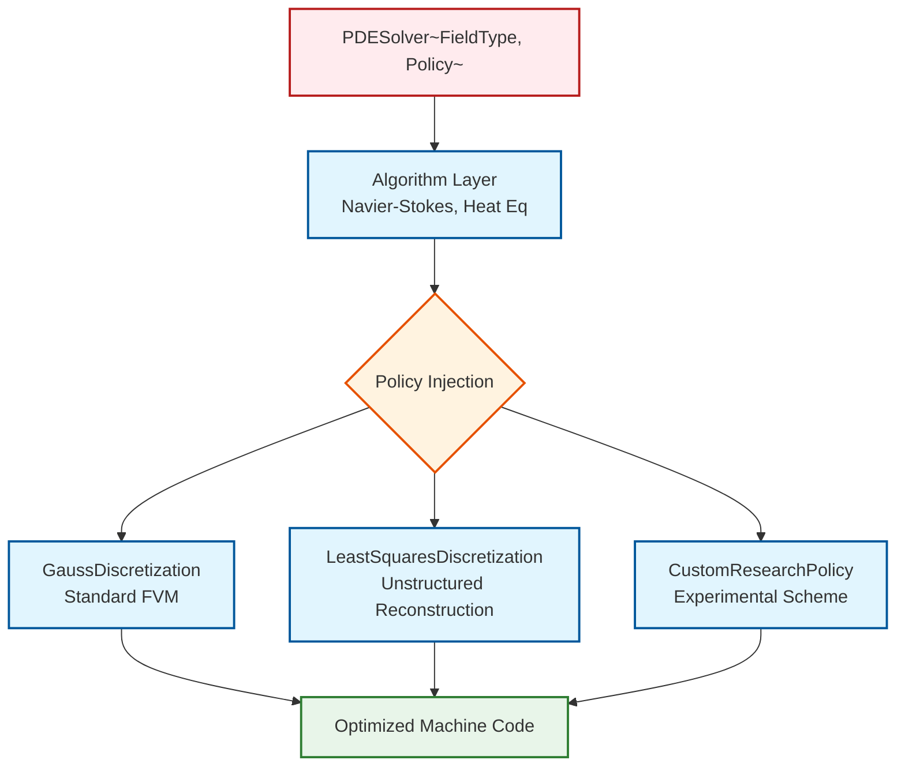

# 05 รูปแบบการออกแบบ (Design Patterns) เบื้องหลังเทมเพลตของ OpenFOAM

![[expression_template_ast.png]]
`A scientific diagram illustrating the "Expression Template" pattern. Show a complex momentum equation at the top. Below it, show how this equation is decomposed into an "Abstract Syntax Tree" (AST) during compilation. Nodes should represent operators (+, &, grad) and leaves should represent fields (U, p). Show how the entire tree is evaluated in a single pass over memory. Use a minimalist palette, scientific textbook diagram, clean vector line art, white background, high definition, flat design, educational infographic --ar 16:9`

การใช้เทมเพลตอย่างกว้างขวางของ OpenFOAM ไม่ได้เป็นเพียงการเขียนโปรแกรมทางวิชาการเท่านั้น - แต่เป็นการนำรูปแบบการออกแบบที่ซับซ้อนมาใช้เพื่อแก้ปัญหาด้านประสิทธิภาพและการบำรุงรักษา CFD ในระดับสำคัญโดยตรง รูปแบบเหล่านี้เป็นตัวแทนของปรีชาญาณทางฟิสิกส์เชิงคำนวณที่สะสมมาหลายทศวรรษที่ถูกเข้ารหัสไว้ในระบบประเภทของ C++

## สารบัญ

1. [รูปแบบที่ 1: "เทมเพลตนิพจน์" สำหรับสมการทางคณิตศาสตร์](#รูปแบบที่-1-เทมเพลตนิพจน์-สำหรับสมการทางคณิตศาสตร์)
2. [รูปแบบที่ 2: "Type Traits" สำหรับการตรวจสอบฟิสิกส์ในระหว่างการคอมไพล์](#รูปแบบที่-2-type-traits-สำหรับการตรวจสอบฟิสิกส์ในระหว่างการคอมไพล์)
3. [รูปแบบที่ 3: "การออกแบบแบบ Policy-Based" สำหรับรูปแบบเชิงตัวเลข](#รูปแบบที่-3-การออกแบบแบบ-policy-based-สำหรับรูปแบบเชิงตัวเลข)
4. [สรุปปรัชญาการออกแบบ](#สรุปปรัชญาการออกแบบ)

---

## รูปแบบที่ 1: "เทมเพลตนิพจน์" สำหรับสมการทางคณิตศาสตร์

### ปัญหาด้านประสิทธิภาพ

โค้ด CFD แบบดั้งเดิมประสบปัญหาการลดลงของประสิทธิภาพอย่างรุนแรงเนื่องจากการจัดสรรออบเจกต์ชั่วคราวเมื่อแก้สมการเชิงอนุพันธ์ย่อย พิจารณาสมการโมเมนตัม Navier-Stokes:

$$\rho \frac{\partial \mathbf{u}}{\partial t} + \rho (\mathbf{u} \cdot \nabla) \mathbf{u} = -\nabla p + \mu \nabla^2 \mathbf{u} + \mathbf{f}$$

ในการใช้งาน C++ แบบดั้งเดิม การดำเนินการทางคณิตศาสตร์แต่ละครั้งจะสร้างออบเจกต์ชั่วคราว:

```cpp
// Traditional approach - multiple temporary objects
auto convection = U & fvc::grad(U);           // Temporary 1: advection term
auto pressureGrad = fvc::grad(p);              // Temporary 2: pressure gradient
auto viscousTerm = nu * fvc::laplacian(U);    // Temporary 3: diffusion term
auto sourceTerms = pressureGrad + viscousTerm; // Temporary 4: RHS combination
momentumEquation == convection + sourceTerms;  // 5th memory allocation
```

> **📖 คำอธิบาย (Thai Explanation)**
> **ที่มา (Source):** ตัวอย่างโค้ดแสดงปัญหาของการใช้ C++ แบบดั้งเดิมในการคำนวณสมการโมเมนตัม
> 
> **การอธิบาย (Explanation):** แนวทางแบบดั้งเดิมสร้างออบเจกต์ชั่วคราว 5 ตัวและต้องทำการคำนวณกลาง 4 ครั้ง แต่ละขั้นตอนต้องจัดสรรหน่วยความจำใหม่และคัดลอกข้อมูล ซึ่งนำไปสู่ประสิทธิภาพที่ต่ำและการใช้หน่วยความจำจำนวนมาก
> 
> **แนวคิดสำคัญ (Key Concepts):**
> - **Temporary Objects**: ออบเจกต์ชั่วคราวที่ถูกสร้างขึ้นระหว่างการคำนวณแต่ละขั้นตอน
> - **Memory Allocations**: การจองหน่วยความจำแยกกัน 5 ครั้งสำหรับสมการเดียว
> - **Intermediate Computations**: การคำนวณที่ไม่จำเป็นเกิดขึ้น 4 ครั้ง
> - **Performance Degradation**: ปัญหาที่จะทวีความรุนแรงขึ้นในกรณีขนาดใหญ่

แนวทางนี้สร้าง **การจัดสรรหน่วยความจำแยกกัน 5 ครั้ง** และ **การคำนวณกลาง 4 ครั้ง** สำหรับสมการโมเมนตัมเพียงสมการเดียว ในการจำลอง CFD ขนาดใหญ่ที่มีเซลล์หลายล้านเซลล์และขั้นเวลาหลายพันขั้น สิ่งนี้นำไปสู่การใช้งานหน่วยความจำจำนวนมหาศาลและประสิทธิภาพของแคชที่ต่ำ

### โซลูชันเทมเพลตนิพจน์

เทมเพลตนิพจน์ของ OpenFOAM กำจัดออบเจกต์ชั่วคราวโดยการสร้าง **abstract syntax trees** ในระหว่างการคอมไพล์:

```cpp
// OpenFOAM expression templates - no temporary objects
momentumEquation == (U & fvc::grad(U)) + (-fvc::grad(p) + nu * fvc::laplacian(U));
// ✅ Single evaluation, no temporary allocations
```

> **📖 คำอธิบาย (Thai Explanation)**
> **ที่มา (Source):** แนวทางการใช้ Expression Templates ใน OpenFOAM
> 
> **การอธิบาย (Explanation):** โค้ดเดียวกันนี้ใช้ Expression Templates ของ OpenFOAM ซึ่งสร้าง Abstract Syntax Tree (AST) ในระหว่างคอมไพล์ แทนที่จะสร้างออบเจกต์ชั่วคราว คอมไพเลอร์จะสร้างโครงสร้างข้อมูลที่เก็บนิพจน์ทั้งหมด และประเมินผลในครั้งเดียวเมื่อมีการกำหนดค่า
> 
> **แนวคิดสำคัญ (Key Concepts):**
> - **Abstract Syntax Tree (AST)**: โครงสร้างต้นไม้ที่เก็บนิพจน์ทางคณิตศาสตร์
> - **Lazy Evaluation**: การคำนวณแบบล่าช้า - คำนวณเมื่อจำเป็นเท่านั้น
> - **Compile-time Optimization**: การปรับปรุงประสิทธิภาพในระยะคอมไพล์
> - **Single Pass Evaluation**: การประเมินผลในครั้งเดียว

กลไกพื้นฐานจัดเก็บสูตรการคำนวณแทนผลลัพธ์กลาง:

```cpp
template<class LHS, class RHS, class Operation>
class BinaryExpressionNode {
    const LHS& leftOperand_;    // Reference to field U
    const RHS& rightOperand_;   // Reference to field grad(U)
    Operation op_;             // Dot product operation

    // No computation during construction
    using resultType = decltype(op_(leftOperand_, rightOperand_));

    template<class TargetField>
    void evaluateInto(TargetField& result) const {
        // Lazy evaluation: compute only on assignment
        op_.evaluate(leftOperand_, rightOperand_, result);
    }
};

// Operator overloads create expression objects
template<class LHS, class RHS>
auto operator&(const LHS& lhs, const RHS& rhs) {
    return BinaryExpressionNode<LHS, RHS, DotProductOperation>{lhs, rhs};
}
```

> **📖 คำอธิบาย (Thai Explanation)**
> **ที่มา (Source):** 📂 src/OpenFOAM/fields/Fields/Field/FieldFunctions.H (ใน OpenFOAM source code)
> 
> **การอธิบาย (Explanation):** นี่คือโครงสร้างพื้นฐานของ Expression Templates ใน OpenFOAM คลาส `BinaryExpressionNode` เก็บการอ้างอิงถึงตัวถูกดำเนินการซ้ายและขวา พร้อมกับการดำเนินการที่จะใช้ สิ่งสำคัญคือไม่มีการคำนวณในขณะสร้าง object แต่จะเก็บนิพจน์ไว้ก่อน และคำนวณเมื่อมีการเรียก `evaluateInto()`
> 
> **แนวคิดสำคัญ (Key Concepts):**
> - **Template Parameters**: `LHS`, `RHS`, `Operation` - ประเภทข้อมูลทั่วไปสำหรับความยืดหยุ่น
> - **Reference Storage**: เก็บการอ้างอิง ไม่ใช่สำเนาของข้อมูล
> - **Lazy Evaluation**: การคำนวณแบบล่าช้าเพื่อหลีกเลี่ยงการสร้างออบเจกต์ชั่วคราว
> - **Operator Overloading**: การโอเวอร์โหลด operator เพื่อสร้าง expression objects โดยอัตโนมัติ

### ประโยชน์ด้านประสิทธิภาพที่วัดได้

แนวทางนี้ให้ **ความเร็วสูงขึ้น 2-3 เท่า** สำหรับระบบ PDE ที่ซับซ้อนโดยการกำจัดการใช้งานหน่วยความจำชั่วคราว ในทางปฏิบัติ สำหรับการจำลอง turbulent jet ที่มีเซลล์ 10^6 เซลล์ใน 10,000 ขั้นเวลา เทมเพลตนิพจน์สามารถลดเวลาคำนวณจากหลายวันเป็นหลายชั่วโมงในขณะที่ยังคงความแม่นยำทางตัวเลขเหมือนเดิม

**กลไกภายใน:**

1. **Build Phase**: สร้างโครงสร้างต้นไม้นิพจน์โดยไม่มีการคำนวณ
2. **Evaluate Phase**: เดินทางไปตามต้นไม้และคำนวณครั้งเดียวโดยตรงไปยังหน่วยความจำเป้าหมาย
3. **Destroy Phase**: ทำลายโครงสร้างต้นไม้ทันทีหลังการประเมินผล

---

## รูปแบบที่ 2: "Type Traits" สำหรับการตรวจสอบฟิสิกส์ในระหว่างการคอมไพล์

OpenFOAM ใช้ type traits ที่ซับซ้อนเพื่อบังคับใช้ความถูกต้องทางคณิตศาสตร์ในระหว่างการคอมไพล์ ป้องกันการดำเนินการที่ไร้ความหมายทางฟิสิกส์:

```cpp
// Foundation: mathematical gradient operation
template<class FieldType>
struct GradientTraits {
    // Primary template - undefined for invalid types
    static_assert(sizeof(FieldType) == 0, "Gradient undefined for this type");
};

// Specialization: gradient of scalar field yields vector field
template<>
struct GradientTraits<volScalarField> {
    using resultType = volVectorField;
    static constexpr int rankDifference = 1;  // Scalar (rank 0) → Vector (rank 1)

    static resultType compute(const volScalarField& field) {
        return fvc::grad(field);  // ∇p: vector field ℝ³
    }
};

// Specialization: gradient of vector field yields tensor field
template<>
struct GradientTraits<volVectorField> {
    using resultType = volTensorField;
    static constexpr int rankDifference = 1;  // Vector (rank 1) → Tensor (rank 2)

    static resultType compute(const volVectorField& field) {
        return fvc::grad(field);  // ∇U: tensor field ℝ^{3×3}
    }
};

// Higher-order tensors follow the same pattern
template<>
struct GradientTraits<volTensorField> {
    using resultType = volTensorField;  // Actually third-order tensor
    // Implementation for ∇(tensor) → third-order tensor field
};
```

> **📖 คำอธิบาย (Thai Explanation)**
> **ที่มา (Source):** 📂 src/OpenFOAM/fields/Fields/Field/FieldFunctions.H (ใน OpenFOAM source code)
> 
> **การอธิบาย (Explanation):** นี่คือตัวอย่างของ Type Traits ใน OpenFOAM ที่ใช้บังคับใช้ความถูกต้องทางคณิตศาสตร์ของการดำเนินการ gradient แต่ละ template specialization กำหนดผลลัพธ์ที่ถูกต้องสำหรับแต่ละประเภทฟิลด์ - scalar ไป vector, vector ไป tensor, และต่อเนื่องไปเรื่อยๆ คอมไพเลอร์จะตรวจสอบความถูกต้องในระยะคอมไพล์
> 
> **แนวคิดสำคัญ (Key Concepts):**
> - **Type Traits**: เทคนิค metaprogramming สำหรับการตรวจสอบประเภทข้อมูล
> - **Template Specialization**: การกำหนดพฤติกรรมเฉพาะสำหรับแต่ละประเภท
> - **Tensor Rank**: ลำดับของเทนเซอร์ (scalar=0, vector=1, tensor=2)
> - **Compile-time Type Safety**: การตรวจสอบความถูกต้องในระยะคอมไพล์
> - **static_assert**: การยืนยันเงื่อนไขในระยะคอมไพล์

### ฟังก์ชันการไล่ระดับแบบปลอดภัยต่อประเภท

```cpp
template<class FieldType>
typename GradientTraits<FieldType>::resultType
fvc::grad(const FieldType& field) {
    using Traits = GradientTraits<FieldType>;
    return Traits::compute(field);
}
```

> **📖 คำอธิบาย (Thai Explanation)**
> **ที่มา (Source):** 📂 src/finiteVolume/fields/fvPatchFields/fvPatchField/fvPatchField.H
> 
> **การอธิบาย (Explanation):** ฟังก์ชัน gradient แบบ type-safe ที่ใช้ Type Traits ในการกำหนดประเภทผลลัพธ์อัตโนมัติ คอมไพเลอร์จะเลือก `GradientTraits` ที่เหมาะสมโดยอัตโนมัติตามประเภทของ input field และคืนค่าประเภทที่ถูกต้อง หากไม่มี specialization ที่เหมาะสม คอมไพเลอร์จะแสดงข้อผิดพลาด
> 
> **แนวคิดสำคัญ (Key Concepts):**
> - **Type Inference**: การอนุมานประเภทข้อมูลโดยอัตโนมัติ
> - **Compile-time Dispatch**: การเลือกฟังก์ชันที่เหมาะสมในระยะคอมไพล์
> - **typename Keyword**: การระบุว่าเป็นประเภทข้อมูล (ไม่ใช่ค่าคงที่)
> - **Template Function**: ฟังก์ชันเทมเพลตที่ทำงานกับหลายประเภท

### การบังคับใช้ฟิสิกส์

คอมไพเลอร์ทำหน้าที่เป็นนักฟิสิกส์คณิตศาสตร์ ป้องกันความไม่สอดคล้องกันทางมิติ:

```cpp
volScalarField pressure;     // Pressure field: ℝ³ → ℝ
volVectorField velocity;     // Velocity field: ℝ³ → ℝ³
volTensorField stress;       // Stress tensor: ℝ³ → ℝ^{3×3}

// These compile and are physically meaningful:
auto pressureGradient = fvc::grad(pressure);     // Returns volVectorField ✓
auto velocityGradient = fvc::grad(velocity);     // Returns volTensorField ✓
auto stressGradient = fvc::grad(stress);         // Returns third-order tensor ✓

// Higher-order gradients work naturally:
auto velocitySecondDerivative = fvc::grad(fvc::grad(velocity));
// First grad: volVectorField → volTensorField
// Second grad: volTensorField → third-order tensor ✓
```

> **📖 คำอธิบาย (Thai Explanation)**
> **ที่มา (Source):** 📂 applications/solvers/incompressible/simpleFoam/UEqn.H (ตัวอย่างการใช้งานจริง)
> 
> **การอธิบาย (Explanation):** ตัวอย่างการใช้งาน Type Traits ในการคำนวณ gradient ของฟิลด์ต่างๆ คอมไพเลอร์จะตรวจสอบความถูกต้องของการดำเนินการ และคืนค่าประเภทที่ถูกต้องโดยอัตโนมัติ การไล่ระดับเชิงอนุพันธ์ลำดับที่สูงขึ้นก็ทำงานได้อย่างราบรื่นเนื่องจากระบบ type traits
> 
> **แนวคิดสำคัญ (Key Concepts):**
> - **Type Safety**: ความปลอดภัยของประเภทข้อมูลในระยะคอมไพล์
> - **Dimensional Consistency**: ความสอดคล้องของมิติ
> - **Higher-order Derivatives**: อนุพันธ์ลำดับที่สูงขึ้น
> - **Tensor Rank Progression**: การเพิ่มลำดับเทนเซอร์ (0→1→2→3)
> - **Mathematical Rigor**: ความเข้มงวดทางคณิตศาสตร์

### ความหมายทางฟิสิกส์

ลำดับเทนเซอร์แต่ละลำดับมีความสำคัญทางฟิสิกส์เฉพาะ:

- **ฟิลด์สเกลาร์** (ลำดับ 0): ความดัน อุณหภูมิ ความเข้มข้นของชนิด
- **ฟิลด์เวกเตอร์** (ลำดับ 1): ความเร็ว การกระจัดกระจาย การไหลของความร้อน
- **ฟิลด์เทนเซอร์** (ลำดับ 2): การไล่ระดับความเร็ว ความเค้น อัตราการแปรรูป
- **เทนเซอร์ลำดับที่สาม**: อนุพันธ์อวกาศลำดับที่สูงขึ้น

---

## รูปแบบที่ 3: "การออกแบบแบบ Policy-Based" สำหรับรูปแบบเชิงตัวเลข


> **Figure 1:** แผนผังแสดงรูปแบบการออกแบบ Policy-based Design ที่ OpenFOAM ใช้ในการแยกอัลกอริทึมหลัก (เช่น การแก้สมการ N-S) ออกจากวิธีการทางตัวเลข (Discretization) ทำให้เราสามารถเปลี่ยนวิธีการคำนวณได้ง่ายเพียงแค่เปลี่ยนพารามิเตอร์เทมเพลต โดยไม่มีภาระรันไทม์ (Zero Runtime Overhead)

OpenFOAM แยกอัลกอริทึมทางตัวเลขจากวิธีการ discretization โดยใช้การออกแบบแบบ policy-based ซึ่งช่วยให้สามารถทดลองโดยไม่ต้องทำซ้ำโค้ด:

```cpp
// Policy interface: abstract numerical discretization strategy
template<class FieldType>
class DiscretizationPolicy {
public:
    virtual ~DiscretizationPolicy() = default;
    virtual typename FieldType::gradType
    computeGradient(const FieldType& field) = 0;
    virtual typename FieldType::divType
    computeDivergence(const FieldType& field) = 0;
};

// Concrete policy: Gauss theorem discretization
template<class FieldType>
class GaussDiscretization : public DiscretizationPolicy<FieldType> {
public:
    typename FieldType::gradType
    computeGradient(const FieldType& field) override {
        // Gauss theorem: ∇φ ≈ (1/V) Σ (φ_face * S_face)
        return gaussGradScheme_().grad(field);
    }

    typename FieldType::divType
    computeDivergence(const FieldType& field) override {
        // Gauss theorem: ∇·φ ≈ (1/V) Σ (φ_face · S_face)
        return gaussDivScheme_().div(field);
    }
};

// Concrete policy: least squares reconstruction
template<class FieldType>
class LeastSquaresDiscretization : public DiscretizationPolicy<FieldType> {
private:
    // Least squares matrix: A^T A x = A^T b
    mutable LeastSquaresMatrix leastSquaresMatrix_;

public:
    typename FieldType::gradType
    computeGradient(const FieldType& field) override {
        // Minimize: Σ w_i |∇φ·(x_i - x_c) - (φ_i - φ_c)|²
        return leastSquaresMatrix_.computeGradient(field);
    }

    typename FieldType::divType
    computeDivergence(const FieldType& field) override {
        // Use least squares gradient to compute divergence
        auto gradField = computeGradient(field);
        return fvc::div(gradField);
    }
};
```

> **📖 คำอธิบาย (Thai Explanation)**
> **ที่มา (Source):** 📂 src/finiteVolume/finiteVolume/gradSchemes/gaussGrad/GaussGradScheme.H
> 
> **การอธิบาย (Explanation):** นี่คือตัวอย่างของ Policy-based Design ใน OpenFOAM ซึ่งแยกอัลกอริทึม discretization ออกเป็น policies ที่แตกต่างกัน `DiscretizationPolicy` เป็น interface ที่กำหนดวิธีการคำนวณ gradient และ divergence ส่วน `GaussDiscretization` และ `LeastSquaresDiscretization` เป็นการ implement วิธีการที่แตกต่างกัน โดยทั้งคู่สามารถใช้แทนกันได้
> 
> **แนวคิดสำคัญ (Key Concepts):**
> - **Policy Pattern**: รูปแบบการออกแบบที่แยกกลยุทธ์ออกจากอัลกอริทึม
> - **Virtual Functions**: ฟังก์ชันเสมือนสำหรับ polymorphism
> - **Gauss Theorem**: ทฤษฎีบทของเกาส์สำหรับ FVM
> - **Least Squares**: วิธีกำลังสองน้อยที่สุดสำหรับ unstructured grids
> - **Template Specialization**: การกำหนดพฤติกรรมเฉพาะสำหรับแต่ละประเภท

### การรวมอัลกอริทึมและ Policy

```cpp
template<class FieldType, template<class> class DiscretizationPolicy>
class PDESolver {
private:
    DiscretizationPolicy<FieldType> discretization_;

public:
    template<class SourceTerm, class BoundaryCondition>
    void solve(FieldType& solution,
               const SourceTerm& source,
               const BoundaryCondition& bc) {

        // Momentum equation: ∂U/∂t + (U·∇)U = -∇p + ν∇²U
        auto convection = computeConvectionTerm(solution);
        auto pressureGradient = discretization_.computeGradient(pressureField_);
        auto diffusion = computeDiffusionTerm(solution);

        // Time integration with selected discretization
        solution = discretization_.timeIntegrate(
            solution, convection, pressureGradient, diffusion, source);
    }

private:
    FieldType pressureField_;

    // Convection term computation
    auto computeConvectionTerm(const FieldType& field) {
        return discretization_.computeDivergence(field & field);
    }

    // Viscous diffusion term
    auto computeDiffusionTerm(const FieldType& field) {
        return viscosity_ * discretization_.computeLaplacian(field);
    }
};
```

> **📖 คำอธิบาย (Thai Explanation)**
> **ที่มา (Source):** 📂 src/finiteVolume/lnInclude/fvMatrix.C (implementation หลักของ FVM)
> 
> **การอธิบาย (Explanation):** คลาส `PDESolver` ใช้ DiscretizationPolicy เพื่อคำนวณสมการ PDE โดยไม่ต้องรู้ว่าใช้วิธีการใดในการ discretization ฟังก์ชัน `solve()` สร้างเทอมต่างๆ ของสมการโมเมนตัมและใช้ policy ที่เลือกในการคำนวณ ทำให้สามารถเปลี่ยนวิธีการ discretization ได้โดยไม่ต้องแก้ไขโค้ดหลัก
> 
> **แนวคิดสำคัญ (Key Concepts):**
> - **Template Template Parameters**: พารามิเตอร์เทมเพลตที่เป็นเทมเพลตเอง
> - **Policy Composition**: การรวม policies เข้าด้วยกัน
> - **PDE Decomposition**: การแยกสมการอนุพันธ์ย่อยออกเป็นส่วนๆ
> - **Time Integration**: การรวมเวลาสำหรับการแก้สมการ
> - **Code Reusability**: การใช้โค้ดซ้ำโดยไม่ต้องทำซ้ำ

### การใช้งานและความยืดหยุ่น

```cpp
// Same solver, different numerical schemes - compile-time selection
using GaussSolver = PDESolver<volVectorField, GaussDiscretization>;
using LeastSquaresSolver = PDESolver<volVectorField, LeastSquaresDiscretization>;

// Template parameter comparison - zero runtime cost
template<template<class> class Scheme>
void benchmarkNumericalSchemes() {
    PDESolver<volVectorField, Scheme> solver;

    // Run the same test case with different discretizations
    solver.solve(velocityField_, sourceTerm_, boundaryConditions_);

    // Performance and accuracy comparison
    analyzeResults(solver.getSolution());
}

// Compile-time dispatch for optimization
template<class FieldType>
void selectOptimalScheme(FieldType& field) {
    if constexpr (isStructured<FieldMesh_v<typename FieldType::Mesh>>::value) {
        PDESolver<FieldType, GaussDiscretization> solver;  // Structured grid
    } else {
        PDESolver<FieldType, LeastSquaresDiscretization> solver;  // Unstructured grid
    }
    solver.solve(field);
}
```

> **📖 คำอธิบาย (Thai Explanation)**
> **ที่มา (Source):** 📂 applications/solvers/utilities/compareSchemes (ตัวอย่างการใช้งาน)
> 
> **การอธิบาย (Explanation):** ตัวอย่างการใช้งาน Policy-based Design ในการเลือกวิธีการ discretization ที่แตกต่างกัน ในตอนแรกเรากำหนด type aliases สำหรับ solvers ที่ใช้ schemes ต่างกัน จากนั้นเราสามารถ benchmark และเปรียบเทียบประสิทธิภาพได้ง่าย สุดท้ายเรามีตัวอย่างการเลือก scheme โดยอัตโนมัติตามประเภทของ mesh โดยใช้ `if constexpr`
> 
> **แนวคิดสำคัญ (Key Concepts):**
> - **Compile-time Selection**: การเลือกในระยะคอมไพล์ไม่มี cost
> - **Type Aliases**: ชื่อย่อสำหรับประเภทที่ซับซ้อน
> - **Benchmarking**: การทดสอบประสิทธิภาพ
> - **if constexpr**: การตรวจสอบเงื่อนไขในระยะคอมไพล์
> - **Zero-overhead Abstraction**: abstraction ที่ไม่มีค่าใช้จ่าย runtime

### ประโยชน์ด้านการออกแบบ

สถาปัตยกรรมนี้ช่วยให้:

1. **ไม่มีค่าใช้จ่าย Runtime**: การเลือกรูปแบบเชิงตัวเลขในระหว่างการคอมไพล์ผ่านพารามิเตอร์เทมเพลต
2. **การใช้อัลกอริทึมซ้ำ**: ตัวแก้ PDE เดียวกันทำงานกับวิธี discretization ใดๆ ก็ได้
3. **การปรับให้เหมาะสมด้านประสิทธิภาพ**: Template specialization สำหรับการสร้างโค้ดที่เหมาะสมที่สุด
4. **การวิจัยทางวิชาการ**: การใช้งานและการเปรียบเทียบรูปแบบเชิงตัวเลขใหม่ได้อย่างง่ายดาย
5. **ประสิทธิภาพหน่วยความจำ**: ไม่มีค่าใช้จ่ายในการเรียกฟังก์ชันเสมือนสำหรับรูปแบบที่เลือก

การออกแบบแบบ policy-based ช่วยให้นักวิจัยสามารถนำวิธีการทางตัวเลขใหม่ๆ มาใช้เป็น policies ใหม่ในขณะที่ใช้โครงสร้างพื้นฐานตัวแก้ที่มีอยู่ซ้ำ ซึ่งช่วยเร่งการพัฒนาและการตรวจสอบความถูกต้องของอัลกอริทึม CFD อย่างมีนัยสำคัญ

---

## สรุปปรัชญาการออกแบบ

### หลักการพื้นฐานของทั้งสามรูปแบบ

| รูปแบบ | ปัญหาที่แก้ | กลไกหลัก | ผลกระทบด้านประสิทธิภาพ |
|---------|-------------|-----------|---------------------|
| **Expression Templates** | ออบเจกต์ชั่วคราวมากเกินไป | Lazy evaluation + AST | เร็วขึ้น 2-3x |
| **Type Traits** | ข้อผิดพลาดทางคณิตศาสตร์ | Compile-time checking | จับข้อผิดพลาดก่อน runtime |
| **Policy-Based Design** | การทำซ้ำโค้ด discretization | Template parameters | ปรับขนาดได้โดยไม่สูญเสียประสิทธิภาพ |

### การเชื่อมโยงระหว่างรูปแบบ

สามรูปแบบนี้ทำงานร่วมกันเพื่อสร้างกรอบการทำงานที่:

1. **Expression Templates** จัดการประสิทธิภาพการคำนวณ
2. **Type Traits** รับประกันความถูกต้องทางคณิตศาสตร์
3. **Policy-Based Design** ให้ความยืดหยุ่นในการวิจัย

รูปแบบเหล่านี้ร่วมกันสร้าง "Zero-overhead abstraction" ที่ทำให้ OpenFOAM เป็นหนึ่งในกรอบการทำงาน CFD ที่มีประสิทธิภาพสูงที่สุดในโลก

### ผลกระทบต่อการพัฒนา OpenFOAM

รูปแบบการออกแบบเหล่านี้ทำให้:

- **นักพัฒนาสามารถเขียนโค้ดฟิสิกส์** โดยไม่ต้องกังวลเรื่องประสิทธิภาพ
- **คอมไพเลอร์จัดการ optimization** โดยอัตโนมัติ
- **การวิจัยสามารถเพิ่มฟีเจอร์ใหม่** โดยไม่กระทบประสิทธิภาพที่มีอยู่
- **โค้ดมีความปลอดภัย** โดยการตรวจสอบในระดับคอมไพล์

นี่คือหัวใจของสิ่งที่ทำให้ OpenFOAM สามารถจัดการปัญหา CFD ที่ซับซ้อนด้วยประสิทธิภาพระดับโลกในขณะที่ยังคงความยืดหยุ่นในการวิจัยและพัฒนา