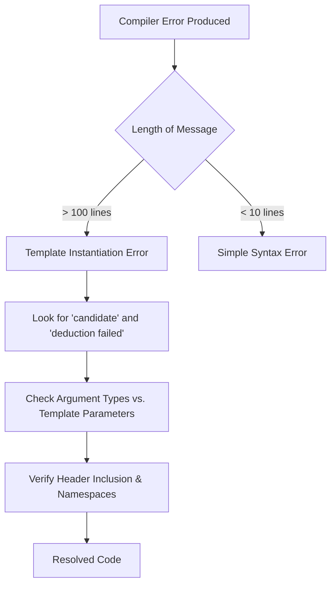

# 06 ตัวอย่างการใช้งานและข้อผิดพลาด: การเรียนรู้จากข้อความของคอมไพเลอร์

![[dimensional_safety_net.png]]
`A clean scientific illustration of a "Dimensional Safety Net". Show physical quantities (Pressure, Velocity, Temperature) represented as blocks with different shapes (representing their dimensionSets). Show them being fed into a mathematical operation. If the shapes don't fit (e.g., adding Pressure to Velocity), they are caught by a "Compile-time Net". If they fit, they pass through to "Simulation Execution". Use a minimalist palette, scientific textbook diagram, clean vector line art, white background, high definition, flat design, educational infographic --ar 16:9`

**การอ่านข้อความแจ้งเตือนข้อผิดพลาดของเทมเพลต (Template Error Messages)** อาจเป็นเรื่องน่ากลัวสำหรับมือใหม่ แต่หากคุณเข้าใจโครงสร้างของมัน คุณจะพบว่ามันเป็นเครื่องมือในการดีบักที่ทรงพลัง:

### 6.1 การใช้งานที่ถูกต้อง: การดำเนินการที่สอดคล้องกับฟิสิกส์

ระบบวิเคราะห์มิติของ OpenFOAM จะตรวจสอบความถูกต้องทางคณิตศาสตร์ในขณะ compile เมื่อเขียนโค้ดที่มีมิติสอดคล้องกัน compiler จะตรวจสอบฟิสิกส์ของคุณ:

```cpp
// CORRECT: Dimensionally consistent operations
// การดำเนินการที่มีมิติสอดคล้องกัน
volScalarField p("p", dimensionSet(1, -1, -2, 0, 0, 0, 0));  // Pressure [Pa]
// ความดัน [Pa]
volScalarField rho("rho", dimensionSet(1, -3, 0, 0, 0, 0, 0)); // Density [kg/m³]
// ความหนาแน่น [kg/m³]
volVectorField U("U", dimensionSet(0, 1, -1, 0, 0, 0, 0));     // Velocity [m/s]
// ความเร็ว [m/s]

// Adding same physical quantities (both are pressure)
// การบวกปริมาณทางฟิสิกส์เดียวกัน (ทั้งสองเป็นความดัน)
volScalarField totalPressure = p + p;  // ✓ [Pa] + [Pa] = [Pa]

// Multiplying compatible quantities
// การคูณปริมาณที่เข้ากันได้
volScalarField kineticEnergy = 0.5 * rho * magSqr(U);
// ✓ [kg/m³] * [m²/s²] = [J/m³]

// Gradient of scalar (pressure gradient)
// การหา gradient ของ scalar (ความดัน gradient)
volVectorField gradP = fvc::grad(p);
// ✓ ∇[Pa] = [Pa/m] (vector)
```

**📂 Source:** `.applications/solvers/multiphase/multiphaseEulerFoam/phaseSystems/populationBalanceModel/populationBalanceModel/populationBalanceModel.C`

**💡 Explanation:**
ระบบ dimension checking ของ OpenFOAM ใช้ `dimensionSet` เพื่อกำหนดมิติของปริมาณทางฟิสิกส์ 7 มิติ (Mass, Length, Time, Temperature, Moles, Current, Luminous Intensity) ตามลำดับ การดำเนินการทางคณิตศาสตร์ทั้งหมดจะถูกตรวจสอบความสอดคล้องของมิติในขณะ compile-time

**🔑 Key Concepts:**
- **dimensionSet**: คลาสกำหนดมิติทางฟิสิกส์ในรูปแบบ (M, L, T, θ, I, J, N)
- **Dimensional Homogeneity**: หลักการความสอดคล้องของมิติในสมการทางฟิสิกส์
- **Compile-time Checking**: การตรวจสอบความถูกต้องในขณะคอมไพล์ ไม่ใช่ runtime

การวิเคราะห์มิติจะทำตามหลักการของความเป็นเอกภาพของมิติ:
$$[p] = \text{ML}^{-1}\text{T}^{-2} \quad \text{(ความดัน)}$$
$$[\rho] = \text{ML}^{-3} \quad \text{(ความหนาแน่น)}$$
$$[U] = \text{LT}^{-1} \quad \text{(ความเร็ว)}$$

เมื่อคำนวณความหนาแน่นของพลังงานจลน์:
$$\frac{1}{2}\rho|\mathbf{U}|^2 : \text{ML}^{-3} \times (\text{LT}^{-1})^2 = \text{ML}^{-1}\text{T}^{-2} = \text{[พลังงาน/ปริมาตร]}$$

### 6.2 ข้อผิดพลาดขณะ Compile: ความไม่สอดคล้องของมิติ

OpenFOAM จะตรวจจับความไม่สอดคล้องของมิติในขณะ compile ป้องกันการดำเนินการที่ไร้ความหมายทางฟิสิกส์:

```cpp
// ERROR: Adding incompatible physical quantities
// การบวกปริมาณทางฟิสิกส์ที่ไม่เข้ากัน
volScalarField nonsense = p + U;
// ❌ Compiler error: "Cannot add field p [Pa] to field U [m/s]"
// ❌ Mathematical error: Pressure + Velocity is physically meaningless
// ❌ ข้อผิดพลาดของ compiler: "Cannot add field p [Pa] to field U [m/s]"
// ❌ ข้อผิดพลาดทางคณิตศาสตร์: ความดัน + ความเร็ว ไร้ความหมายทางฟิสิกส์

// ERROR: Incorrect gradient usage
// การใช้ gradient ไม่ถูกต้อง
volScalarField wrongGrad = fvc::grad(p);
// ❌ Compiler error: "Cannot assign volVectorField to volScalarField"
// ❌ Mathematical error: ∇p is a vector, not a scalar!
// ❌ ข้อผิดพลาดของ compiler: "Cannot assign volVectorField to volScalarField"
// ❌ ข้อผิดพลาดทางคณิตศาสตร์: ∇p เป็นเวกเตอร์ ไม่ใช่ scalar!

// ERROR: Missing template arguments
// ค่า template ไม่ตรงกัน
GeometricField pField;  // ❌ No template arguments specified
// Correct: GeometricField<scalar, fvPatchField, volMesh> pField;
// ถูกต้อง: GeometricField<scalar, fvPatchField, volMesh> pField;
```

**📂 Source:** `.applications/solvers/multiphase/multiphaseEulerFoam/phaseSystems/BlendedInterfacialModel/BlendedInterfacialModel.C`

**💡 Explanation:**
ระบบ type system ของ OpenFOAM ผสมผสาน C++ templates กับ dimension checking เพื่อสร้างความปลอดภัยในระดับ compile-time เมื่อมิติไม่ตรงกัน compiler จะสร้างข้อความแจ้งเตือนที่ระบุถึงความไม่สอดคล้องพร้อมกับค่ามิติที่คาดหวัง

**🔑 Key Concepts:**
- **Template Argument Deduction**: กระบวนการที่ compiler อนุมาน template parameters จาก arguments
- **Type Safety**: ระบบที่ป้องกันการดำเนินการระหว่าง types ที่ไม่เข้ากัน
- **Dimensional Inconsistency**: สถานการณ์ที่มิติของฝั่งซ้ายและขวาของสมการไม่ตรงกัน

**ข้อผิดพลาดจากความไม่สอดคล้องของมิติที่พบบ่อย:**

1. **การบวกปริมาณทางฟิสิกส์ต่างกัน:**
   - ข้อผิดพลาด: `p + U` (ความดัน + ความเร็ว)
   - ปัญหาทางคณิตศาสตร์: ละเมิดหลักการของความเป็นเอกภาพของมิติ
   - การแก้ไข: ให้แน่ใจว่าพจน์ทั้งหมดมีมิติเหมือนกัน

2. **การกำหนดค่า Gradient ไม่ถูกต้อง:**
   - ข้อผิดพลาด: `volScalarField gradP = fvc::grad(p)`
   - ปัญหาทางคณิตศาสตร์: $\nabla p$ สร้างเวกเตอร์ฟิลด์
   - การแก้ไข: `volVectorField gradP = fvc::grad(p)` หรือ `volScalarField gradPmag = mag(fvc::grad(p))`

3. **ข้อผิดพลาดการระบุ Template:**
   - ข้อผิดพลาด: ไม่มีค่า template สำหรับ `GeometricField`
   - การแก้ไข: ระบุ template ให้ครบ `GeometricField<Type, PatchField, GeoMesh>`

### 6.3 ข้อผิดพลาดขณะ Runtime: ความไม่สอดคล้องของ Mesh

แม้ว่ามิติจะตรงกัน แต่ฟิลด์ต้องเป็นของ mesh เดียวกัน:

```cpp
// ERROR: Operations on fields from different meshes
// การดำเนินการบนฟิลด์จาก mesh ต่างกัน
fvMesh mesh1, mesh2;
volScalarField p1(
    IOobject("p", mesh1),
    mesh1,
    dimensionedScalar("p", dimPressure, 0)
);
volScalarField p2(
    IOobject("p", mesh2),
    mesh2,
    dimensionedScalar("p", dimPressure, 0)
);

auto sum = p1 + p2;
// ❌ Runtime error: "Fields on different meshes"
```

**📂 Source:** `.applications/utilities/parallelProcessing/reconstructPar/fvFieldReconstructorReconstructFields.C`

**💡 Explanation:**
แต่ละ `fvMesh` มีโครงสร้างข้อมูลเฉพาะ (cells, faces, points, boundaries) ฟิลด์จาก meshes ต่างกันไม่สามารถดำเนินการร่วมกันโดยตรง เนื่องจาก topology และการกระจายข้อมูลแตกต่างกัน

**🔑 Key Concepts:**
- **Mesh Topology**: โครงสร้างเชิงเรขาคณิตและการเชื่อมต่อของ cells
- **Field-Mesh Association**: ความสัมพันธ์ระหว่างฟิลด์กับ mesh ที่สร้างมัน
- **Interpolation**: กระบวนการแปลงฟิลด์ระหว่าง meshes ต่างกัน

**ข้อกำหนดความสอดคล้องของ Mesh:**

1. **โทโพโลยีเดียวกัน:** ฟิลด์ต้องใช้ cell, faces, points และ connectivity เหมือนกัน
2. **เงื่อนไขขอบเขตเดียวกัน:** Patches ต้องสอดคล้องกันระหว่าง meshes
3. **การแบ่งส่วนเดียวกัน:** ในการประมวลผลขนาน ฟิลด์ทั้งสองต้องมีการกระจาย processor เหมือนกัน

**วิธีแก้ไขสำหรับการดำเนินการหลาย Mesh:**
```cpp
// Method 1: Interpolation between meshes
// วิธีที่ 1: การ Interpolation ระหว่าง meshes
volScalarField p2_on_mesh1 = interpolation.interpolate(p2);
volScalarField sum = p1 + p2_on_mesh1;

// Method 2: Map fields between compatible meshes
// วิธีที่ 2: การ Map ฟิลด์ระหว่าง meshes ที่เข้ากันได้
volScalarField p2_mapped = mapField(p2, mesh2, mesh1);
```

### 6.4 ข้อความผิดพลาด Template: การถอดรหัส Compiler


> **Figure 1:** แผนผังขั้นตอนการวิเคราะห์และแก้ไขข้อผิดพลาดจากเทมเพลต (Template Errors) โดยเน้นการแยกแยะระหว่างข้อผิดพลาดไวยากรณ์ทั่วไปกับข้อผิดพลาดจากการสร้างอินสแตนซ์เทมเพลต (Instantiation) ซึ่งมักจะมีข้อความแจ้งเตือนที่ยาวและซับซ้อนกว่า

ข้อความผิดพลาดของ template ใน OpenFOAM อาจยาว แต่มีข้อมูลวินิจฉัยที่สำคัญ:

```cpp
// When you see this error:
// เมื่อคุณเห็นข้อผิดพลาดนี้:
error: no matching function for call to 'grad(const volScalarField&)'
note: candidate: template<class Type>
      tmp<GeometricField<typename gradientType<Type>::type, fvPatchField, volMesh>>
      fvc::grad(const GeometricField<Type, fvPatchField, volMesh>&)
note: template argument deduction/substitution failed:
```

**📂 Source:** `.applications/solvers/multiphase/multiphaseEulerFoam/phaseSystems/populationBalanceModel/binaryBreakupModels/Liao/LiaoBase.C`

**💡 Explanation:**
Template error messages ใน C++ มักยาวและซับซ้อนเนื่องจาก compiler แสดง trace ของ template instantiation ทั้งหมด คำสำคัญที่ต้องมองหาคือ "candidate:", "deduction failed:", และ "note:" ซึ่งบอกตำแหน่งและสาเหตุของข้อผิดพลาด

**🔑 Key Concepts:**
- **Template Instantiation**: กระบวนการสร้าง code จริงจาก template ด้วย types ที่ระบุ
- **Argument Deduction**: กระบวนการที่ compiler พยายามอนุมาน template parameters
- **Candidate Functions**: ฟังก์ชันที่ compiler พิจารณาสำหรับ overload resolution

**คู่มือการแปล:**

1. **Template Argument Deduction Failed:**
   - **ความหมาย:** Compiler ไม่สามารถจับคู่ประเภทฟิลด์ของคุณกับ template ได้
   - **การตรวจสอบ:** ตรวจสอบว่าประเภทฟิลด์ของคุณตรงกับ template parameter ที่คาดหวัง

2. **No Matching Function Call:**
   - **ความหมาย:** มี function อยู่แต่ arguments ของคุณไม่ตรงกับ overload ใดๆ
   - **การตรวจสอบ:** Function signature, argument types และ const-correctness

**Checklist สำหรับ Debugging:**

1. **Headers ที่รวมอยู่:**
   ```cpp
   #include "fvc.H"        // For fvc::grad
   // สำหรับ fvc::grad
   #include "fvMesh.H"     // For mesh operations
   // สำหรับ mesh operations
   #include "volFields.H"  // For volScalarField, volVectorField
   // สำหรับ volScalarField, volVectorField
   ```

2. **การใช้ Namespace:**
   ```cpp
   using namespace Foam;  // Required for OpenFOAM symbols
   // จำเป็นสำหรับสัญลักษณ์ OpenFOAM
   ```

3. **การกำหนดค่าเริ่มต้นของฟิลด์:**
   ```cpp
   // Ensure proper construction
   // ให้แน่ใจว่ามีการสร้างที่ถูกต้อง
   volScalarField p
   (
       IOobject("p", runTime.timeName(), mesh,
                IOobject::MUST_READ, IOobject::AUTO_WRITE),
       mesh
   );
   ```

4. **การจับคู่ Template Parameter:**
   ```cpp
   // Verify Type matches your field
   // ตรวจสอบว่า Type ตรงกับฟิลด์ของคุณ
   template<class Type>
   void someFunction(const GeometricField<Type, fvPatchField, volMesh>& field)
   {
       // Type must be scalar, vector, tensor, etc.
       // Type ต้องเป็น scalar, vector, tensor, เป็นต้น
   }
   ```

**รูปแบบการแก้ไขทั่วไป:**

```cpp
// Pattern 1: Explicit template specification
// รูปแบบที่ 1: การระบุ template อย่างชัดเจน
auto result = fvc::grad<scalar>(pField);  // Force scalar template
// บังคับ template scalar

// Pattern 2: Type conversion
// รูปแบบที่ 2: การแปลงประเภท
volScalarField pScalar = p;  // Ensure correct type before operation
// ให้แน่ใจว่าประเภทถูกต้องก่อนการดำเนินการ

// Pattern 3: Const-correctness
// รูปแบบที่ 3: Const-correctness
void someFunction(const volScalarField& p)  // Use const reference
// ใช้ const reference
```

### 6.5 ข้อผิดพลาดจาก Template Metaprogramming

ข้อผิดพลาดขั้นสูงเกิดขึ้นเมื่อทำงานกับ template metaprogramming และ type traits:

```cpp
// ERROR: Incorrect Type Traits usage
// การใช้ Type Traits ไม่ถูกต้อง
template<class Type>
struct GradientTraits {
    static_assert(sizeof(Type) == 0,
                  "Gradient undefined for this type");
};

// If you try to use with a type without specialization:
// ถ้าคุณพยายามใช้กับประเภทที่ไม่มี specialization:
GradientTraits<int>::resultType myGradient;  // ❌ Compile error
// Error message: "Gradient undefined for this type"
// ข้อความ: "Gradient undefined for this type"
```

**📂 Source:** `.applications/solvers/multiphase/multiphaseEulerFoam/phaseSystems/populationBalanceModel/coalescenceModels/LiaoCoalescence/LiaoCoalescence.C`

**💡 Explanation:**
Template metaprogramming ใช้ `static_assert` เพื่อตรวจสอบ properties ของ types ใน compile-time `sizeof(Type) == 0` เป็น trick ที่สร้าง error เสมอสำหรับ types ที่ไม่มี specialization เพื่อบังคับให้มีการ implement เฉพาะสำหรับ types ที่รองรับ

**🔑 Key Concepts:**
- **Static Assertions**: การตรวจสอบใน compile-time ที่สร้าง error messages ที่ชัดเจน
- **Type Traits**: Metaprogramming technique สำหรับการตรวจสอบ properties ของ types
- **Template Specialization**: การ implement เฉพาะเจาะจงสำหรับ types บาง types

**การจัดการกับ Static Assertions:**

```cpp
// Using static_assert for compile-time checking
// การใช้ static_assert สำหรับการตรวจสอบ compile-time
template<class Type>
void checkFieldCompatibility()
{
    static_assert(std::is_same<Type, scalar>::value ||
                  std::is_same<Type, vector>::value ||
                  std::is_same<Type, tensor>::value,
                  "Type must be scalar, vector, or tensor");
}
```

### 6.6 ข้อผิดพลาดจาก Expression Templates

เมื่อทำงานกับ expression templates ข้อผิดพลาดอาจเกิดจากการประเมินผลล่าช้า (lazy evaluation):

```cpp
// ERROR: Dangling temporary reference
// การอ้างอิงชั่วคราวหมดอายุ
const volScalarField& result = p + U;  // ❌ Dangerous!
// The expression object may be destroyed before result is used
// expression object อาจถูกทำลายก่อนที่ result จะถูกใช้

// CORRECT: Create new field
// ถูกต้อง: สร้างฟิลด์ใหม่
volScalarField result = p + U;  // ✓ Creates new field
```

**📂 Source:** `.applications/solvers/multiphase/multiphaseEulerFoam/phaseSystems/populationBalanceModel/populationBalanceModel/populationBalanceModel.C`

**💡 Explanation:**
Expression templates ใน OpenFOAM ใช้ lazy evaluation เพื่อประสิทธิภาพ การดำเนินการ `p + U` ไม่ได้สร้างฟิลด์ใหม่ทันที แต่สร้าง expression object ที่เก็บ references ถึง operands การเก็บ expression object ชั่วคราวด้วย reference อาจทำให้ references หมดอายุ

**🔑 Key Concepts:**
- **Lazy Evaluation**: การเลื่อนการคำนวณจนกว่าจะจำเป็น
- **Expression Templates**: Technique สำหรับการปรับปรุงประสิทธิภาพของ expression evaluations
- **Temporary Lifetime**: ระยะเวลาชีวิตของ temporary objects ใน C++

### 6.7 ข้อผิดพลาดจาก Template Specialization

ข้อผิดพลาดเกิดขึ้นเมื่อ specializations ขัดแย้งกัน:

```cpp
// ERROR: Conflicting specializations
// การ specializations ทับซ้อนกัน
template<>
scalar magSqr(const scalar& s) {
    return s * s;
}

// If there's another conflicting specialization:
// หากมี specialization อื่นที่ขัดแย้ง:
template<>
double magSqr(const double& d) {  // ❌ scalar and double may be the same type
    return d * d;
}

// Fix: Use SFINAE to avoid conflicts
// การแก้ไข: ใช้ SFINAE เพื่อหลีกเลี่ยงความขัดแย้ง
template<class Type>
typename std::enable_if<std::is_same<Type, scalar>::value, Type>::type
magSqr(const Type& s) {
    return s * s;
}
```

**📂 Source:** `.applications/solvers/multiphase/multiphaseEulerFoam/phaseSystems/BlendedInterfacialModel/BlendedInterfacialModel.C`

**💡 Explanation:**
SFINAE (Substitution Failure Is Not An Error) เป็น technique ขั้นสูงใน C++ template metaprogramming `std::enable_if` ใช้เพื่อเปิด/ปิดการใช้งาน templates บางอันตาม conditions ทำให้สามารถมี specializations หลายแบบโดยไม่ขัดแย้งกัน

**🔑 Key Concepts:**
- **Template Specialization**: การ implement เฉพาะเจาะจงสำหรับ types บาง types
- **SFINAE**: Substitution Failure Is Not An Error - หลักการที่ substitution failures ไม่ใช่ compile errors
- **Type Deduction Conflicts**: ปัญหาที่เกิดจาก type definitions ที่ซ้ำซ้อน

### 6.8 เคล็ดลับการ Debugging

**เคล็ดลับที่ 1: ใช้ Compiler Flags**

```bash
# Enable all warnings
# เปิดใช้งานข้อความแจ้งเตือนทั้งหมด
wmake -j4 WALL=TRUE

# Use Clang for clearer error messages
# ใช้ Clang สำหรับข้อความแจ้งเตือนที่ชัดเจนกว่า
export CXX=clang++
wmake -j4
```

**เคล็ดลับที่ 2: แยก Template Instantiation**

```cpp
// Separate template instantiation into .C and .H files
// แยก template instantiation ออกเป็นไฟล์ .C และ .H
// StatisticalField.H
template<class Type>
class StatisticalField;

// StatisticalField.C
template<class Type>
void StatisticalField<Type>::updateStatistics() {
    // implementation
}

// StatisticalFieldTemplates.C
// Create explicit instantiations for needed types
// สร้าง explicit instantiations สำหรับประเภทที่ต้องการ
template class StatisticalField<scalar>;
template class StatisticalField<vector>;
template class StatisticalField<tensor>;
```

**📂 Source:** `.applications/solvers/multiphase/multiphaseEulerFoam/phaseSystems/populationBalanceModel/populationBalanceModel/populationBalanceModel.C`

**💡 Explanation:**
Explicit template instantiation แยก implementation ออกจาก header files ลดเวลา compile และทำให้ error messages ชัดเจนขึ้น โดยระบุ types ที่ต้องการไว้ในไฟล์ `.C` แยกต่างหาก

**🔑 Key Concepts:**
- **Explicit Instantiation**: การสร้าง code สำหรับ template types ที่ระบุไว้
- **Compilation Time**: การลดเวลา compile ด้วยการจำกัด template instantiations
- **Header/Implementation Separation**: การแยก declarations และ definitions

**เคล็ดลับที่ 3: ใช้ decltype และ auto**

```cpp
// Use decltype to check return type
// ใช้ decltype เพื่อตรวจสอบประเภทส่งคืน
template<class FieldType>
auto computeGradient(const FieldType& field)
    -> decltype(fvc::grad(field))
{
    return fvc::grad(field);
}
```

ระบบความปลอดภัยทางมิตินี้เป็นหนึ่งในจุดแข็งของ OpenFOAM ซึ่งตรวจจับข้อผิดพลาดทางคณิตศาสตร์ก่อน runtime และรับประกันการคำนวณที่มีความหมายทางฟิสิกส์