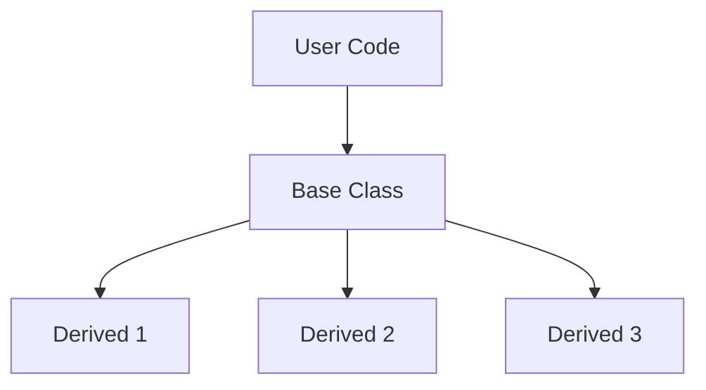

# Inheritance & Polymorphism - Overview

ภาพรวม Inheritance และ Polymorphism

---

## Overview



---

## 1. Key Concepts

| Concept | Purpose |
|---------|---------|
| **Inheritance** | Code reuse, type hierarchy |
| **Polymorphism** | Same interface, different behavior |
| **Virtual functions** | Runtime dispatch |
| **Abstract class** | Interface definition |

---

## 2. OpenFOAM Examples

### turbulenceModel

```cpp
turbulenceModel (abstract)
├── RASModel
│   ├── kEpsilon
│   └── kOmegaSST
└── LESModel
    └── Smagorinsky
```

### fvPatchField

```cpp
fvPatchField<Type> (abstract)
├── fixedValueFvPatchField
├── zeroGradientFvPatchField
└── mixedFvPatchField
```

---

## 3. Run-Time Selection

```cpp
// Create from dictionary
autoPtr<turbulenceModel> turb = turbulenceModel::New
(
    alpha, rho, U, phi, transport
);

// Use polymorphically
turb->correct();
```

---

## 4. Module Contents

| File | Topic |
|------|-------|
| 01_Introduction | Basics |
| 02_Interfaces | Abstract classes |
| 03_Hierarchies | Class trees |
| 04_RTS | Runtime selection |
| 05_Patterns | Design patterns |
| 06_Errors | Debugging |
| 07_Performance | Overhead |
| 08_Exercise | Practice |

---

## Quick Reference

| Concept | Syntax |
|---------|--------|
| Pure virtual | `virtual void f() = 0;` |
| Override | `void f() override;` |
| Factory | `Model::New(dict)` |

---

## 🧠 Concept Check

<details>
<summary><b>1. Inheritance vs Composition?</b></summary>

- **Inheritance**: "is-a" relationship
- **Composition**: "has-a" relationship
</details>

<details>
<summary><b>2. ทำไมใช้ abstract class?</b></summary>

**Define interface** ที่ derived classes ต้อง implement
</details>

<details>
<summary><b>3. RTS คืออะไร?</b></summary>

**Run-Time Selection** — create objects from dictionary at runtime
</details>

---

## 📖 เอกสารที่เกี่ยวข้อง

- **Introduction:** [01_Introduction.md](01_Introduction.md)
- **RTS:** [04_Run_Time_Selection_System.md](04_Run_Time_Selection_System.md)