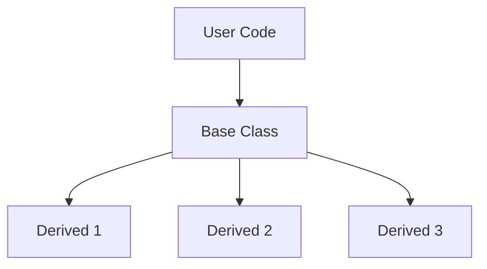

# Inheritance & Polymorphism - Overview

ภาพรวม Inheritance และ Polymorphism

---

## Learning Objectives

**By the end of this module, you will be able to:**

1. **Define and explain** inheritance and polymorphism concepts using the **What-Why-How framework**
2. **Identify** appropriate use cases for inheritance versus composition in OpenFOAM development
3. **Read and navigate** complex OpenFOAM class hierarchies (turbulenceModel, fvPatchField, etc.)
4. **Implement** abstract base classes with virtual functions and proper override syntax
5. **Apply** the Run-Time Selection (RTS) mechanism to create factory-based object instantiation
6. **Debug** common polymorphism-related errors (slicing, undefined virtual functions, improper casts)
7. **Evaluate** performance implications of virtual functions and optimize where necessary

---

## Prerequisites

**Before starting this module, you should have:**

| C++ Fundamental | Required Knowledge |
|-----------------|-------------------|
| **Classes & Objects** | Understanding of class definition, constructors, destructors, member access |
| **Pointers & References** | Pointer declaration, dereferencing, reference semantics, const correctness |
| **Memory Management** | Stack vs heap allocation, `new`/`delete`, smart pointers (`autoPtr`, `uniquePtr`) |
| **Basic C++ Syntax** | Functions, namespaces, header/source file organization |
| **OpenFOAM Basics** | Field types (`volScalarField`, `volVectorField`), dictionary files, case structure |

**If you need to review these topics**, refer to:
- **Module 02:** C++ Fundamentals for OpenFOAM
- **Module 03:** OpenFOAM Programming Basics

---

## Overview



---

## 1. Key Concepts

### 1.1 Inheritance (สืบทอด)

**What:** A mechanism where a derived class inherits members (data and functions) from a base class.

**Why:** 
- Promote **code reuse** by sharing common implementations
- Establish **type hierarchies** that model "is-a" relationships
- Enable **polymorphic behavior** through base class pointers/references

**How:**
```cpp
class Derived : public Base { ... };
```

---

### 1.2 Polymorphism (พหุรูปแบบ)

**What:** The ability of objects of different types to respond to the same function call in different ways.

**Why:**
- Write **flexible code** that works with multiple types through a common interface
- Enable **extensibility** without modifying existing code (Open-Closed Principle)
- Support **runtime dispatch** for dynamic behavior selection

**How:** Use virtual functions and base class pointers/references

---

### 1.3 Virtual Functions (ฟังก์ชันเสมือน)

**What:** Member functions declared with `virtual` keyword that enable runtime dispatch.

**Why:**
- Allow derived classes to **override base class implementations**
- Support **dynamic binding** where the actual function called depends on object type

**How:**
```cpp
virtual void correct() = 0;  // Pure virtual
void correct() override;      // Override in derived
```

---

### 1.4 Abstract Classes (คลาสนามธรรม)

**What:** Classes containing at least one pure virtual function (`= 0`), cannot be instantiated directly.

**Why:**
- **Define interfaces** that derived classes must implement
- Enforce **contracts** for polymorphic behavior
- Provide **partial implementations** with abstract methods

**How:**
```cpp
class AbstractBase {
public:
    virtual void mustImplement() = 0;  // Pure virtual
    virtual void canOverride() {}       // Optional override
};
```

---

### 1.5 Run-Time Selection (RTS)

**What:** OpenFOAM's factory pattern implementation that creates objects from dictionary entries at runtime.

**Why:**
- Enable **user-configurable models** without code recompilation
- Support **plugin architectures** for extending functionality
- Decouple **interface from implementation**

**How:**
```cpp
autoPtr<Model> obj = Model::New(dictionary);
```

---

## 2. OpenFOAM Examples

### 2.1 turbulenceModel Hierarchy

```cpp
turbulenceModel (abstract)
├── RASModel (abstract)
│   ├── kEpsilon
│   ├── kOmegaSST
│   └── SpalartAllmaras
└── LESModel (abstract)
    ├── Smagorinsky
    ├── kEqn
    └── dynamicKEqn
```

**In OpenFOAM dictionaries:**
```cpp
simulationType  RAS;  // Selects RASModel branch
RAS
{
    RASModel        kEpsilon;  // Selects kEpsilon leaf
    turbulence      on;
}
```

---

### 2.2 fvPatchField Hierarchy

```cpp
fvPatchField<Type> (abstract)
├── fixedValueFvPatchField
├── zeroGradientFvPatchField
├── mixedFvPatchField
├── calculatedFvPatchField
└── ...
```

**In boundary conditions:**
```
inlet
{
    type            fixedValue;      // Selects derived class
    value           uniform (0 0 0);
}
```

---

## 3. Run-Time Selection Example

**Creating turbulence models from dictionary:**

```cpp
// Factory method - creates appropriate model based on dictionary
autoPtr<turbulenceModel> turb = turbulenceModel::New
(
    alpha, rho, U, phi, transport
);

// Polymorphic usage - correct() behaves differently per model
turb->correct();
turb->divDevReff(U);
```

**What happens:**
1. `turbulenceModel::New()` reads `RASModel` entry from dictionary
2. Looks up `kEpsilon` in runtime table
3. Creates `kEpsilon` object using factory constructor
4. Returns `autoPtr<incompressible::turbulenceModel>` pointing to `kEpsilon`
5. Virtual dispatch calls `kEpsilon::correct()`

---

## 4. Module Contents

| File | Topic | Key Concepts Covered |
|------|-------|---------------------|
| 01_Introduction | Basics & Motivation | What-Why-How, inheritance vs composition, OpenFOAM motivation |
| 02_Interfaces | Abstract Classes | Pure virtual functions, interfaces, virtual destructors |
| 03_Hierarchies | Class Trees | Design principles, Liskov Substitution, TypeName macro |
| 04_RTS | Runtime Selection | Factory pattern, macro system, New() implementation |
| 05_Patterns | Design Patterns | Strategy, Template Method, Composite patterns in OpenFOAM |
| 06_Errors | Debugging | Slicing, undefined virtuals, improper casts, debugging tools |
| 07_Performance | Overhead | Virtual function cost, inlining, cache effects, optimization |
| 08_Exercise | Practice | Progressive exercises with solutions |

---

## Quick Reference

| Concept | Syntax | Purpose |
|---------|--------|---------|
| Pure virtual | `virtual void f() = 0;` | Force derived implementation |
| Override | `void f() override;` | Explicitly override base function |
| Final | `void f() final;` | Prevent further overriding |
| Virtual destructor | `virtual ~Base() {}` | Proper cleanup through base pointer |
| Factory | `Model::New(dict)` | Runtime object creation |
| TypeName | `TypeName("Model");` | RTS registration |

---

## 🧠 Concept Check

<details>
<summary><b>1. Inheritance vs Composition?</b></summary>

- **Inheritance**: "is-a" relationship (e.g., `kEpsilon` **is a** `RASModel`)
- **Composition**: "has-a" relationship (e.g., `kEpsilon` **has** `nut_` field)

**Use inheritance** for polymorphic interfaces
**Use composition** for code reuse and object ownership
</details>

<details>
<summary><b>2. Why use abstract classes?</b></summary>

**Define interfaces** that derived classes must implement, enabling:
- Polymorphic collections (base class pointers to derived objects)
- Enforcement of contracts (all derived implement required functions)
- Partial implementations (some functions provided, others must be implemented)
</details>

<details>
<summary><b>3. What is RTS?</b></summary>

**Run-Time Selection** — OpenFOAM's factory pattern implementation that:
- Creates objects from dictionary entries at **runtime** (no recompilation)
- Uses **macro-generated registration** to build type tables
- Supports **user-extensible** models through plugin libraries
</details>

---

## Key Takeaways

✓ **Inheritance** establishes "is-a" relationships and enables code reuse
✓ **Polymorphism** allows objects of different types to respond to the same interface differently
✓ **Virtual functions** enable runtime dispatch through base class pointers/references
✓ **Abstract classes** define interfaces that derived classes must implement
✓ **RTS** is OpenFOAM's factory pattern for runtime object creation from dictionaries
✓ **Proper design** requires understanding when to use inheritance vs composition
✓ **Performance implications** of virtual functions should be considered in critical paths

---

## 📖 Related Documents

- **Introduction:** [01_Introduction.md](01_Introduction.md) — Basics and motivation
- **Interfaces:** [02_Abstract_Interfaces.md](02_Abstract_Interfaces.md) — Abstract class design
- **Hierarchies:** [03_Inheritance_Hierarchies.md](03_Inheritance_Hierarchies.md) — Class tree design
- **RTS:** [04_Run_Time_Selection_System.md](04_Run_Time_Selection_System.md) — Factory implementation