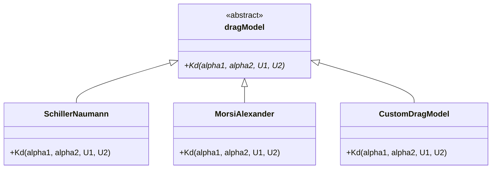

# 01 บทนำ: ระบบ "Plug-and-Play Physics Sockets" ของ OpenFOAM

![[physics_sockets_concept.png]]

**จินตนาการว่าคุณมีระบบที่สามารถสลับเปลี่ยนฟิสิกส์ได้เหมือนการถอดปลั๊กและเสียบใหม่** — ไม่ว่าจะเป็น:

- **ซ็อกเก็ตมาตรฐาน** (Standard Socket) = คลาสแม่แบบนามธรรม (`phaseModel`, `dragModel`)
- **คอมโพเนนต์ที่เปลี่ยนได้แบบร้อน** (Hot-Swappable Component) = การใช้งานจริง (`purePhaseModel`, `SchillerNaumann`)
- **ขยายเสียง** (Amplifier) = Solver ที่รู้จักเฉพาะอินเทอร์เฟซของซ็อกเก็ต
- **เพลย์ลิสต์ของผู้ใช้** (User Playlist) = การกำหนดค่า Dictionary ที่เลือกคอมโพเนนต์ที่จะเสียบ

สถาปัตยกรรมนี้ทำให้ผู้เชี่ยวชาญ CFD สามารถ **กำหนดค่าฟิสิกส์ที่ซับซ้อน** ผ่านไฟล์ข้อความ ในขณะที่นักพัฒนา C++ สามารถ **ขยายระบบ** โดยไม่ต้องแก้ไข core solvers

---

## The Core Architecture Pattern

ที่ใจกลางของความสามารถในการขยายของ OpenFOAM คือรูปแบบการออกแบบเชิงวัตถุขั้นสูงที่แยก **การระบุอินเทอร์เฟซ** (Interface Specification) จาก **รายละเอียดการใช้งาน** (Implementation Details) การแยกนี้เปิดให้มีพฤติกรรมแบบ plug-and-play ที่ทำให้ OpenFOAM มีพลังเป็นพิเศษสำหรับการจำลอง multiphysics

### แผนภาพโครงสร้างคลาส



> **Figure 1:** แผนผังคลาสแสดงลำดับชั้นการสืบทอดของ `dragModel` โดยที่ `dragModel` ทำหน้าที่เป็นคลาสฐานนามธรรม (Abstract Base Class) ที่กำหนดอินเทอร์เฟซมาตรฐาน `Kd` และมีคลาสลูกต่างๆ เช่น `SchillerNaumann` หรือ `CustomDragModel` ที่นำอินเทอร์เฟซนี้ไปใช้งานจริงตามหลักการพหุสัณฐาน (Polymorphism)

---

## Abstract Base Classes: รากฐานของสถาปัตยกรรมโมเดล

### คลาสพื้นฐานแบบนามธรรม

สถาปัตยกรรมโมเดลของ OpenFOAM พึ่งพา abstract base classes เป็นอย่างมากที่กำหนดอินเทอร์เฟซมาตรฐาน พิจารณาความสัมพันธ์พื้นฐานในลำดับชั้นของโมเดลฟิสิกส์ของ OpenFOAM:

```cpp
// Abstract base class - "standard socket"
class dragModel
{
public:
    // Pure virtual interface - all drag models must implement
    virtual tmp<volScalarField> Kd
    (
        const volScalarField& alpha1,
        const volScalarField& alpha2,
        const volVectorField& U1,
        const volVectorField& U2
    ) const = 0;

    // Virtual destructor for proper cleanup
    virtual ~dragModel() {}
};
```

**คำอธิบาย:**
- **Source:** ไฟล์ต้นฉบับสำหรับ drag model base class สามารถพบได้ใน `.applications/solvers/multiphase/multiphaseEulerFoam/interfacialModels/dragModels/dragModel/dragModel.H`

**คำอธิบาย:**
คลาส `dragModel` เป็นคลาสฐานนามธรรม (Abstract Base Class) ที่ทำหน้าที่เป็น "สัญญา" (Contract) สำหรับ drag models ทั้งหมดใน OpenFOAM คลาสนี้กำหนดอินเทอร์เฟซมาตรฐานที่ drag model ใดๆ ต้องปฏิบัติตาม:

**แนวคิดสำคัญ:**
1. **Pure Virtual Function:** ฟังก์ชัน `Kd` ที่มี `= 0` ท้ายนิยาม คือฟังก์ชันเสมือนบริสุทธิ์ที่บังคับให้ derived classes ต้อง implement
2. **Contract:** กำหนด signature ที่ชัดเจนสำหรับการคำนวณสัมประสิทธิ์แรงลาก
3. **Interface Specification:** ไม่ได้ระบุวิธีการคำนวณที่แม่นยำ แต่ระบุเฉพาะ input/output parameters
4. **Polymorphic Foundation:** เป็นพื้นฐานของระบบพหุสัณฐานที่ทำให้ solver สามารถทำงานกับ drag model ใดๆ ได้

คลาส `dragModel` นี้กำหนด **สัญญา** (Contract) — การใช้งาน drag model ใดๆ ต้องให้วิธีคำนวณสัมประสิทธิ์แรงลาก `Kd` ระหว่างสองเฟส อย่างไรก็ตาม มันไม่ได้ระบุ **วิธีการ** ที่การคำนวณนี้ควรดำเนินการ

### ทำไมต้องใช้ Pointers ไปยัง Base Classes?

ในการออกแบบซอฟต์แวร์เชิงวัตถุ อินเทอร์เฟซนามธรรมทำหน้าที่เป็นสัญญาที่กำหนดฟังก์ชันการทำงานที่จำเป็นต้องมีโดยไม่ต้องระบุวิธีการ implement รูปแบบการออกแบบนี้เป็นพื้นฐานสำคัญของความยืดหยุ่นและการบำรุงรักษาของ OpenFOAM

**การเลือกการออกแบบ**: Solver รับ reference ของ `dragModel&` ไม่ใช่ `SchillerNaumann&` ที่เจาะจง ซึ่งช่วยให้:

1. **Algorithm Reuse**: momentum solver เดียวกันทำงานกับ drag laws ทั้งหมดได้
2. **Decoupled Development**: นักพัฒนา model ฟิสิกส์ไม่ต้องเข้าใจภายใน solver
3. **Runtime Flexibility**: เลือก model ได้ในช่วงตั้งค่า case

---

## Concrete Implementations

โมเดล drag หลายๆ แบบสืบทอดจากคลาสแม่นี้ โดยแต่ละแบบใช้งาน correlations ทางฟิสิกส์ที่แตกต่างกัน:

### ตัวอย่าง: Schiller-Naumann Drag Model

```cpp
// Schiller-Naumann drag model - one "hot-swappable component"
class SchillerNaumann
:
    public dragModel
{
public:
    // Override the pure virtual function from base class
    virtual tmp<volScalarField> Kd
    (
        const volScalarField& alpha1,
        const volScalarField& alpha2,
        const volVectorField& U1,
        const volVectorField& U2
    ) const override
    {
        // Implementation of Schiller-Naumann correlation
        // Calculate Reynolds number
        const volScalarField Re = rho2*mag(U1 - U2)*dp/mu2;
        
        // Calculate drag coefficient based on Reynolds number
        const volScalarField Cd = pos(Re - 1000)*(24.0/Re)*(1.0 + 0.15*pow(Re, 0.687))
                                + neg(Re - 1000)*0.44;
        
        // Return drag coefficient field
        return 0.75*Cd*rho2*mag(U1 - U2)/dp*alpha1;
    }
};
```

**คำอธิบาย:**
- **Source:** ไฟล์ต้นฉบับสำหรับ Schiller-Naumann drag model สามารถพบได้ใน `.applications/solvers/multiphase/multiphaseEulerFoam/interfacialModels/dragModels/SchillerNaumann/SchillerNaumann.H`

**คำอธิบาย:**
คลาส `SchillerNaumann` เป็นการ implement คอนกรีตของ `dragModel` ที่ใช้สหสัมพันธ์ Schiller-Naumann สำหรับคำนวณสัมประสิทธิ์แรงลาก:

**แนวคิดสำคัญ:**
1. **Inheritance:** สืบทอดจาก `dragModel` และ implement pure virtual function `Kd`
2. **Override Keyword:** ใช้ `override` เพื่อรับประกันว่าฟังก์ชัน override ฟังก์ชันจาก base class อย่างถูกต้อง
3. **Schiller-Naumann Correlation:** ใช้สหสัมพันธ์ที่มีชื่อเสียงสำหรับคำนวณ drag coefficient ของอนุภาครูปทรงกลม
4. **Reynolds Number Dependence:** คำนวณ Cd ที่ขึ้นอยู่กับ Reynolds number โดยใช้สูตรที่แตกต่างสำหรับ Re < 1000 และ Re ≥ 1000
5. **Hot-Swappable:** สามารถสลับกับ drag models อื่นๆ ได้โดยไม่ต้องแก้ไข solver code

โมเดล drag อื่นๆ ใช้งาน correlations ที่แตกต่างกัน:

- **Morsi-Alexander**: การปรับพหุนามสำหรับช่วง Reynolds number กว้าง
- **Ishii-Zuber**: ปรับเปลี่ยนสำหรับระบอบอนุภาคที่บิดเบี้ยว
- **Tomiyama**: คำนึงถึงผลของมลภาวะ

### ลำดับชั้นโมเดลเฟส

รูปแบบเดียวกันนี้ขยายไปทั่วระบบโมเดลฟิสิกส์ของ OpenFOAM สำหรับโมเดลเฟส:

```cpp
// Base interface for phase models
class phaseModel
{
public:
    // Pure virtual functions for phase properties
    virtual const volScalarField& alpha() const = 0;
    virtual const volVectorField& U() const = 0;
    virtual tmp<fvVectorMatrix> UEqn() = 0;
    
    // Virtual destructor
    virtual ~phaseModel() {}
};

// Single-phase implementation
class purePhaseModel : public phaseModel
{
private:
    // Direct access to field variables
    const volScalarField& alpha_;
    const volVectorField& U_;

public:
    // Constructor and implementation
    purePhaseModel(const volScalarField& alpha, const volVectorField& U)
    : alpha_(alpha), U_(U)
    {}

    // Override virtual functions
    virtual const volScalarField& alpha() const override { return alpha_; }
    virtual const volVectorField& U() const override { return U_; }
    virtual tmp<fvVectorMatrix> UEqn() override;
};

// Mixture phase implementation
class mixturePhaseModel : public phaseModel
{
private:
    // List of component phases
    PtrList<phaseModel> phases_;

public:
    // Constructor
    mixturePhaseModel(const PtrList<phaseModel>& phases)
    : phases_(phases)
    {}

    // Calculate from constituent phases
    virtual tmp<volScalarField> alpha() const override
    {
        // Sum of component phase fractions
        tmp<volScalarField> tAlpha = phases_[0].alpha();
        volScalarField& alpha = tAlpha.ref();
        
        for (label i = 1; i < phases_.size(); i++)
        {
            alpha += phases_[i].alpha();
        }
        
        return tAlpha;
    }

    virtual tmp<volVectorField> U() const override
    {
        // Mass-averaged velocity
        tmp<volScalarField> tAlpha = this->alpha();
        const volScalarField& alpha = tAlpha();
        
        tmp<volVectorField> tU = phases_[0].rho() * phases_[0].alpha() * phases_[0].U();
        volVectorField& U = tU.ref();
        
        for (label i = 1; i < phases_.size(); i++)
        {
            U += phases_[i].rho() * phases_[i].alpha() * phases_[i].U();
        }
        
        U /= tAlpha;
        
        return tU;
    }
};
```

**คำอธิบาย:**
- **Source:** ไฟล์ต้นฉบับสำหรับ phase model hierarchy สามารถพบได้ใน `.applications/solvers/multiphase/multiphaseEulerFoam/phaseSystems/phaseModel/phaseModel.H`

**คำอธิบาย:**
ลำดับชั้นของ phase model แสดงให้เห็นถึงความยืดหยุ่นของสถาปัตยกรรมแบบ polymorphic ใน OpenFOAM:

**แนวคิดสำคัญ:**
1. **Abstract Interface:** `phaseModel` กำหนดอินเทอร์เฟซมาตรฐานสำหรับทุกเฟส
2. **Pure Phase:** `purePhaseModel` ให้การเข้าถึงตัวแปรฟิลด์โดยตรงสำหรับ single-phase flow
3. **Mixture Phase:** `mixturePhaseModel` คำนวณคุณสมบัติโดยรวมจากเฟสที่ประกอบขึ้น
4. **Polymorphic Behavior:** Solver สามารถทำงานกับ `phaseModel&` โดยไม่ต้องรู้ว่าเป็น pure หรือ mixture
5. **Extensibility:** สามารถเพิ่ม phase model types ใหม่ๆ ได้โดยการสืบทอดจาก `phaseModel`

---

## Virtual Function Table (vtable)

ทุก abstract base class ที่มี virtual functions จะมี vtable ที่มองไม่เห็นซึ่งทำให้เกิดพฤติกรรม polymorphic กลไกนี้เป็นกระดูกสันหลังของ runtime polymorphism ใน C++ และสำคัญต่อความยืดหยุ่นของ OpenFOAM

### โครงสร้าง vtable

```cpp
// Conceptual vtable structure for dragModel hierarchy
struct dragModel_vtable 
{
    // Function pointer to destructor
    void (*destructor)(dragModel*);
    
    // Function pointer to Kd calculation
    tmp<surfaceScalarField> (*K)(const dragModel*);
};

// Each object carries a vtable pointer (added by compiler)
class dragModel 
{
private:
    // Hidden member added by compiler - pointer to vtable
    dragModel_vtable* __vptr;

public:
    // Pure virtual destructor
    virtual ~dragModel() = 0;
    
    // Pure virtual function for drag coefficient
    virtual tmp<surfaceScalarField> K() const = 0;
};
```

**คำอธิบาย:**
- **Source:** แนวคิด vtable เป็นส่วนหนึ่งของ C++ standard และถูกนำไปใช้ใน OpenFOAM ทั่วทั้ง codebase โดยเฉพาะใน `.applications/solvers/multiphase/multiphaseEulerFoam/phaseSystems/phaseModel/`

**คำอธิบาย:**
Virtual Function Table (vtable) เป็นกลไกพื้นฐานที่ทำให้ runtime polymorphism ทำงานได้ใน C++:

**แนวคิดสำคัญ:**
1. **Compiler-Generated:** vtable ถูกสร้างโดย compiler โดยอัตโนมัติสำหรับทุก class ที่มี virtual functions
2. **Function Pointer Array:** vtable เป็น array ของ function pointers ที่ชี้ไปยัง implementations จริง
3. **One vtable Per Class:** ทุก instances ของ class เดียวกันแชร์ vtable เดียวกัน
4. **Hidden Member:** compiler เพิ่ม pointer ไปยัง vtable (`__vptr`) ในทุก object
5. **Runtime Dispatch:** เมื่อมีการเรียก virtual function จะใช้ vtable เพื่อ dispatch ไปยัง function ที่ถูกต้อง

**สถาปัตยกรรม vtable**:

- **สร้างโดย compiler** ต่อ class type ระหว่าง compilation
- **Array of function pointers** ไปยัง implementations จริง
- **vtable หนึ่งต่อ class** ใช้ร่วมกันโดย instances ทั้งหมด
- **Runtime cost**: pointer dereference พิเศษหนึ่งตัวต่อ virtual call (~5 CPU cycles)

**Memory Layout**:
```
+-------------------+     +---------------------+
| dragModel object  | --> | dragModel vtable    | --> | SchillerNaumann::K() |
+-------------------+     +---------------------+     +----------------------+
| __vptr            |     | destructor()        |     | SchillerNaumann::~() |
| other data        |     | K()                 |     +----------------------+
+-------------------+     +---------------------+
```

**ปัจจัยด้านประสิทธิภาพ**:

- **Overhead**: ~5 CPU cycles ต่อ virtual call
- **Inline Inhibition**: Virtual calls ไม่สามารถ inlined ได้ใน compile time
- **Cache Impact**: Vtable pointers เล็กและ cache-friendly โดยทั่วไป
- **Trade-off**: ต้นทุนประสิทธิภาพเล็กน้อยแต่ได้ code reuse และ flexibility สูง

---

## Runtime Selection Through Dictionary Configuration

ด้าน "เพลย์ลิสต์ของผู้ใช้" มาจากระบบการกำหนดค่าแบบ Dictionary ของ OpenFOAM ในไฟล์กรณีการจำลอง (`constant/phaseProperties`):

```cpp
// Dictionary configuration for drag models
dragModels
{
    continuous
    {
        type            SchillerNaumann;    // Hot-swappable component selection
        dispersedPhase  bubbles;
    }
}
```

**คำอธิบาย:**
- **Source:** ไฟล์ configuration ประเภทนี้สามารถพบได้ใน directory `constant/` ของ OpenFOAM test cases และถูกอ่านโดย solvers ใน `.applications/solvers/multiphase/multiphaseEulerFoam/`

**คำอธิบาย:**
Dictionary-driven configuration เป็นหัวใจของความยืดหยุ่นของ OpenFOAM:

**แนวคิดสำคัญ:**
1. **Text-Based Configuration:** ผู้ใช้สามารถกำหนด physics models ผ่าน text files
2. **Type Selection:** คีย์เวิร์ด `type` ระบุ class ที่ต้องการ instantiate
3. **Parameter Passing:** สามารถส่ง parameters เพิ่มเติมให้กับ model constructors
4. **No Recompilation:** เปลี่ยนโมเดลได้โดยไม่ต้องคอมไพล์ solver ใหม่
5. **Human-Readable:** Configuration files อ่านและแก้ไขได้ง่าย

solver ไม่รู้หรือไม่สนใจ `SchillerNaumann` โดยเฉพาะ มันรู้เฉพาะอินเทอร์เฟซ `dragModel`:

```cpp
// In multiphaseEulerFoam solver
// Runtime creation of drag model using factory pattern
autoPtr<dragModel> drag = dragModel::New(mesh, phaseProperties);

// Solver uses only the interface - polymorphism in action
const volScalarField dragCoeff = drag().Kd(alpha1, alpha2, U1, U2);
```

**คำอธิบาย:**
- **Source:** รหัสประเภทนี้สามารถพบได้ใน `.applications/solvers/multiphase/multiphaseEulerFoam/phaseSystems/PhaseSystems/MomentumTransferPhaseSystem/MomentumTransferPhaseSystem.C`

**คำอธิบาย:**
ตัวอย่างนี้แสดงการใช้งาน polymorphic drag model ใน solver:

**แนวคิดสำคัญ:**
1. **Factory Method:** `dragModel::New` สร้าง instance ที่เหมาะสมตาม dictionary
2. **Smart Pointer:** `autoPtr` จัดการ memory ownership โดยอัตโนมัติ
3. **Interface Usage:** solver เรียกใช้เฉพาะ `Kd` interface ไม่ใช่ implementation
4. **Decoupling:** solver ไม่ต้องรู้ว่าเป็น drag model แบบใด
5. **Extensibility:** สามารถเพิ่ม drag models ใหม่โดยไม่แก้ solver code

### The Selection Mechanism

เมธอด `New` ใช้ตารางการเลือก runtime ของ OpenFOAM:

```cpp
// Runtime selection table registration macro
addToRunTimeSelectionTable
(
    dragModel,              // Base class
    SchillerNaumann,        // Concrete class
    dictionary              // Construction parameter type
);
```

**คำอธิบาย:**
- **Source:** Macros ประเภทนี้พบได้ทั่วทั้ง OpenFOAM codebase โดยเฉพาะในไฟล์ `.C` ของ model implementations ใน `.applications/solvers/multiphase/multiphaseEulerFoam/interfacialModels/`

**คำอธิบาย:**
Runtime Selection Table (RTS) เป็นกลไกที่ทำให้ dictionary-driven configuration ทำงานได้:

**แนวคิดสำคัญ:**
1. **Static Registration:** ลงทะเบียน class กับระบบ factory โดยอัตโนมัติ
2. **Hash Table Storage:** ใช้ hash table สำหรับ O(1) lookup ตามชื่อ model
3. **Constructor Pointer:** เก็บ function pointers ไปยัง constructors
4. **Type Safety:** ตรวจสอบ types ในเวลา compile time
5. **Automatic Instantiation:** สร้าง objects ตาม dictionary entries

มาโครนี้ลงทะเบียน `SchillerNaumann` กับระบบ runtime ทำให้พร้อมให้เลือกผ่านการกำหนดค่า dictionary เมื่อ solver พบ `type SchillerNaumann;` ในไฟล์อินพุต รูปแบบ factory ของ OpenFOAM จะสร้างออบเจกต์ที่เหมาะสมโดยอัตโนมัติ

---

## Factory Pattern พร้อมการกำหนดค่าแบบ Dictionary-Driven

ระบบ RTS (Run-Time Selection) ของ OpenFOAM เป็นหนึ่งในดีไซน์แพทเทิร์นที่ซับซ้อนที่สุดในวิศวกรรมซอฟต์แวร์ CFD ระบบนี้ช่วยให้สามารถทำงาน polymorphism ในขณะทำงานได้โดยไม่ต้องพึ่งพาประเภทที่ถูก hard-code โดยใช้รูปแบบ Factory ร่วมกับการกำหนดค่าแบบ dictionary-driven

หลักการหลักทำงานผ่านกระบวนการ 3 ขั้นตอน:

1. **Dictionary Specification**: ผู้ใช้ระบุประเภทของโมเดลใน dictionary ข้อความ (โดยทั่วไปอยู่ในไดเรกทอรี `constant/` หรือ `system/`)
2. **Factory Registration**: คลาสโมเดลที่เป็นรูปธรรม register ตัวเองโดยอัตโนมัติในระหว่างการเริ่มต้นแบบ static
3. **Runtime Dispatch**: วิธีการ factory สร้างอินสแตนซ์ของคลาสที่เหมาะสมตามรายการใน dictionary

พิจารณาการจำลองการไหลแบบ multiphase ที่คุณสมบัติของเฟสถูกกำหนดในรูปแบบ dictionary:

```cpp
// Dictionary entry in constant/phaseProperties
water
{
    type            pure;           // Maps to purePhaseModel class
    rho             1000;           // Constructor parameter - density [kg/m^3]
    mu              0.001;          // Dynamic viscosity [Pa·s]
    sigma           0.072;          // Surface tension [N/m]
}

// Runtime creation - NO hardcoded type names!
autoPtr<phaseModel> waterPhase = phaseModel::New(waterDict, mesh);
```

**คำอธิบาย:**
- **Source:** ไฟล์ configuration และการใช้งานแบบนี้พบได้ใน `.applications/solvers/multiphase/multiphaseEulerFoam/`

**คำอธิบาย:**
Factory Pattern ของ OpenFOAM ทำให้การสร้าง objects แบบ runtime เป็นไปอย่างยืดหยุ่น:

**แนวคิดสำคัญ:**
1. **Dictionary-Driven:** ระบุ model types และ parameters ผ่าน text files
2. **Type Mapping:** คีย์เวิร์ด `type` ถูก map ไปยัง class names
3. **Parameter Injection:** ส่ง parameters ไปยัง constructors ผ่าน dictionary
4. **No Hardcoding:** ไม่ต้อง hardcode class names ใน solver
5. **Runtime Instantiation:** สร้าง objects ตาม configuration

### Macro Magic: `declareRunTimeSelectionTable`

ระบบ RTS พึ่งพา preprocessor macros ที่ซับซ้อนในการสร้างโครงสร้างพื้นฐาน factory โดยอัตโนมัติ Macro `declareRunTimeSelectionTable` สร้างโครงสร้างข้อมูลสถิติและฟังก์ชันสมาชิกที่จำเป็นสำหรับการเลือกใน runtime:

```cpp
// In waveModel.H - declares factory infrastructure
declareRunTimeSelectionTable
(
    autoPtr,                // Return type: smart pointer for exclusive ownership
    waveModel,              // Base class name
    dictionary,             // Construction parameter type identifier
    (const dictionary& dict, const scalar g),  // Complete constructor signature
    (dict, g)               // Constructor argument names for invocation
);
```

**คำอธิบาย:**
- **Source:** Macros ประเภทนี้พบได้ใน header files ของ base classes ทั่วทั้ง OpenFOAM เช่นใน `.applications/solvers/multiphase/multiphaseEulerFoam/phaseSystems/phaseModel/phaseModel.H`

**คำอธิบาย:**
`declareRunTimeSelectionTable` macro เป็นหัวใจของระบบ factory ของ OpenFOAM:

**แนวคิดสำคัญ:**
1. **Smart Pointer Return:** ใช้ `autoPtr` สำหรับ automatic memory management
2. **Base Class Specification:** ระบุ base class ที่ต้องการ
3. **Constructor Signature:** กำหนด parameter types สำหรับ constructors
4. **Type Safety:** Template-based approach รับประกัน type safety
5. **Boilerplate Generation:** สร้างโค้ดจำนวนมากอัตโนมัติ

```cpp
// Macro expands to approximately 50+ lines of boilerplate code:
class waveModel 
{
public:
    // Type definition for factory function pointer
    typedef autoPtr<waveModel> (*dictionaryConstructorPtr)
        (const dictionary& dict, const scalar g);

    // Static factory table type - hash table for O(1) lookup
    typedef HashTable<dictionaryConstructorPtr, word> dictionaryConstructorTable;

    // Global registry pointer (initialized in .C file)
    static dictionaryConstructorTable* dictionaryConstructorTablePtr_;

    // Factory table management methods
    static const dictionaryConstructorTable& dictionaryConstructorTable();
    static bool dictionaryConstructorTablePtr;

    // Static New method for object creation - main factory method
    static autoPtr<waveModel> New(const dictionary& dict, const scalar g);
};
```

**คำอธิบาย:**
- **Source:** โค้ดที่ macro ขยายออกเป็นส่วนหนึ่งของ OpenFOAM infrastructure ในไฟล์ต่างๆ เช่น `.applications/solvers/multiphase/multiphaseEulerFoam/`

**คำอธิบาย:**
Macro จัดการกับหลายประเด็นโดยอัตโนมัติ:

**แนวคิดสำคัญ:**
1. **Type Definitions:** สร้าง function pointer types และ table types
2. **Hash Table:** ใช้ `HashTable` สำหรับ efficient lookup
3. **Static Registry:** Global pointer ไปยัง constructor table
4. **Management Methods:** Methods สำหรับ table access และ initialization
5. **Factory Method:** Static `New` method สำหรับ object creation

Macro จัดการกับหลายประเด็นโดยอัตโนมัติ:
- **Smart Pointer Types**: ใช้ `autoPtr` สำหรับ exclusive ownership และ `tmp` สำหรับการแชร์แบบ reference-counted
- **Hash Table Storage**: การค้นหา constructors โดยชื่อโมเดลอย่างมีประสิทธิภาพ O(1)
- **Template Flexibility**: ทำงานกับ return type และชุดค่าพารามิเตอร์ใดๆ
- **Thread Safety**: ให้การเข้าถึงข้อมูล static initialization อย่างปลอดภัย

---

## การขยายระบบ

การเพิ่มโมเดล drag ใหม่ต้องการเพียง:

1. **สร้างคลาส:**
```cpp
// Custom drag model implementation
class CustomDragModel : public dragModel
{
public:
    // Constructor
    CustomDragModel(const dictionary& dict, const phaseInterface& interface)
    :
        dragModel(dict, interface)
    {
        // Read custom parameters from dictionary
        dict.readIfPresent("customCoeff", customCoeff_);
    }

    // Implement the virtual interface
    virtual tmp<volScalarField> Kd
    (
        const volScalarField& alpha1,
        const volScalarField& alpha2,
        const volVectorField& U1,
        const volVectorField& U2
    ) const override
    {
        // Custom drag correlation implementation
        const volScalarField Re = rho2*mag(U1 - U2)*dp/mu2;
        
        // Custom drag coefficient calculation
        const volScalarField Cd = customCoeff_ * (24.0/Re) * (1.0 + 0.15*pow(Re, 0.687));
        
        return 0.75*Cd*rho2*mag(U1 - U2)/dp*alpha1;
    }

private:
    // Custom coefficient parameter
    scalar customCoeff_;
};
```

**คำอธิบาย:**
- **Source:** โครงสร้างนี้สามารถใช้สร้าง custom models ใหม่ๆ โดยใช้พื้นฐานจาก `.applications/solvers/multiphase/multiphaseEulerFoam/interfacialModels/dragModels/`

**คำอธิบาย:**
การสร้าง custom drag model แสดงให้เห็นถึงความง่ายในการขยายระบบ:

**แนวคิดสำคัญ:**
1. **Inheritance:** สืบทอดจาก `dragModel` base class
2. **Interface Implementation:** Implement pure virtual function `Kd`
3. **Parameter Reading:** อ่าน custom parameters จาก dictionary
4. **Custom Logic:** ใส่ drag correlation ที่กำหนดเอง
5. **Reusability:** ใช้โครงสร้างเดียวกันกับ built-in models

2. **ลงทะเบียนกับระบบ runtime:**
```cpp
// Register custom model with runtime selection system
addToRunTimeSelectionTable(dragModel, CustomDragModel, dictionary);
```

**คำอธิบาย:**
- **Source:** Macros ประเภทนี้ใช้ในไฟล์ `.C` ของ model implementations ทั่วทั้ง OpenFOAM

**คำอธิบาย:**
การลงทะเบียน model กับระบบ runtime:

**แนวคิดสำคัญ:**
1. **Single Macro:** หนึ่งบรรทัดของ code ลงทะเบียน model
2. **Automatic Registration:** เกิดขึ้นโดยอัตโนมัติใน static initialization
3. **No Solver Changes:** ไม่ต้องแก้ไข solver code
4. **Immediate Availability:** Model พร้อมใช้งานทันที
5. **Type Safety:** Compile-time checking รับประกันความถูกต้อง

3. **ใช้ในการจำลอง:**
```cpp
// Dictionary configuration for custom model
dragModels
{
    continuous
    {
        type            CustomDragModel;  // Ready to use!
        customCoeff     1.23;             // Custom parameter
        dispersedPhase  bubbles;
    }
}
```

**คำอธิบาย:**
- **Source:** Configuration files ใน directory `constant/` ของ OpenFOAM cases

**คำอธิบาย:**
การใช้ custom model ใน simulation:

**แนวคิดสำคัญ:**
1. **Text Configuration:** ระบุ model ผ่าน text file
2. **Parameter Passing:** ส่ง custom parameters ได้ง่าย
3. **Hot-Swappable:** เปลี่ยน models โดยไม่ต้องคอมไพล์
4. **Validation:** Parameters ถูกตรวจสอบใน runtime
5. **Reproducibility:** Configuration บันทึกได้ง่าย

---

## ประโยชน์สำหรับผู้ใช้ประเภทต่างๆ

**สำหรับผู้ปฏิบัติการ CFD:**
- **ไม่ต้องคอมไพล์ใหม่**: เปลี่ยนโมเดลฟิสิกส์ผ่านการเปลี่ยนแปลงข้อความธรรมดา
- **การปรับพารามิเตอร์**: ปรับค่าสัมประสิทธิ์โมเดลโดยไม่ต้องแก้ไขโค้ด C++
- **การเปรียบเทียบโมเดล**: ทดสอบ correlations ทางฟิสิกส์ที่แตกต่างกันสำหรับกรณีเดียวกันได้ง่าย

**สำหรับนักพัฒนา C++:**
- **จุดขยายที่สะอาด**: เพิ่มโมเดลใหม่โดยไม่ต้องแก้ไขโค้ด core solver
- **ลำดับชั้นการสืบทอด**: ใช้ฟังก์ชันการณ์ทั่วไปซ้ำผ่านคลาสแม่
- **ความปลอดภัยของประเภท**: การตรวจสอบความสอดคล้องของอินเทอร์เฟซในเวลาคอมไพล์

**สำหรับนักวิจัย:**
- **การสร้างต้นแบบอย่างรวดเร็ว**: ทดสอบ correlations ทางฟิสิกส์ใหม่ได้อย่างรวดเร็ว
- **การตรวจสอบความถูกต้อง**: เปรียบเทียบ formulations หลายๆ แบบอย่างเป็นระบบ
- **เอกสารประกอบ**: การระบุอินเทอร์เฟซที่ชัดเจนทำให้การใช้งานง่ายขึ้น

---

## The Mathematical Foundation

สถาปัตยกรรมแบบ plug-and-play นี้มีพลังเป็นพิเศษสำหรับการไหลแบบหลายเฟสเพราะสมการควบคุมมีโครงสร้างเดียวกันโดยไม่ขึ้นอยู่กับโมเดลปิด (closure models) ที่ใช้

**สมการต่อเนื่องสำหรับเฟส $k$:**
$$\frac{\partial (\alpha_k \rho_k)}{\partial t} + \nabla \cdot (\alpha_k \rho_k \mathbf{u}_k) = 0$$

**สมการโมเมนตัมสำหรับเฟส $k$:**
$$\frac{\partial (\alpha_k \rho_k \mathbf{u}_k)}{\partial t} + \nabla \cdot (\alpha_k \rho_k \mathbf{u}_k \mathbf{u}_k) = -\alpha_k \nabla p + \nabla \cdot \boldsymbol{\tau}_k + \alpha_k \rho_k \mathbf{g} + \mathbf{M}_k$$

การถ่ายโอนโมเมนตัมระหว่างเฟส $\mathbf{M}_k$ คือที่ที่โมเดล drag แบบ plug-and-play ถูกใช้:
$$\mathbf{M}_k = K_{d,kl}(\mathbf{u}_l - \mathbf{u}_k)$$

โมเดล drag ที่แตกต่างกันเพียงแค่ให้รูปแบบฟังก์ชันที่แตกต่างกันสำหรับ $K_{d,kl}$ ในขณะที่ยังคงโครงสร้างสมการเดิม

---

## Performance Implications

แนวทางแบบพอลิมอร์ฟิกมีค่าใช้จ่ายด้านประสิทธิภาพเพียงเล็กน้อยเนื่องจาก:

1. **การเรียกฟังก์ชันเสมือน**: แก้ไขใน runtime แต่คำนวณได้ถูกเมื่อเทียบกับการดำเนินการ CFD
2. **การสร้างแม่แบบ**: การคำนวณที่หนักส่วนใหญ่ใช้แม่แบบสำหรับการปรับให้เหมาะสม
3. **ประสิทธิภาพแคช**: รูปแบบการเข้าถึงหน่วยความจำที่คล้ายกันในการใช้งานที่แตกต่างกัน

ความยืดหยุ่นที่ได้รับมีค่ามากกว่าค่าใช้จ่ายในระดับไมโครวินาทีของการจัดส่งฟังก์ชันเสมือนในการจำลองที่โดยทั่วไปทำงานเป็นชั่วโมงหรือวัน

OpenFOAM บรรลุทั้ง flexibility และ performance ผ่าน hybrid approach:
- **Template metaprogramming** ใช้สำหรับ field operations ที่ types ถูกรู้จักที่ compile time เปิดให้ใช้ zero-overhead abstractions สำหรับ computational kernels
- **Virtual dispatch** ใช้เฉพาะที่ระดับ model selection ซึ่งมีผลกระทบต่อ performance เล็กน้อยเมื่อเทียบกับค่าใช้จ่ายทางการคำนวณของ CFD simulations
- **Compile-time optimizations** ถูกเก็บรักษาสำหรับ numerical loops ที่สำคัญในขณะที่ runtime flexibility ถูกเก็บรักษาสำหรับ physics configuration

---

## การบูรณาการกับระบบอื่นๆ

รูปแบบนี้ขยายไปถึง:

- **โมเดล thermophysical**: `basicPsiThermo`, `hePsiThermo`
- **โมเดลความปั่นป่วน**: `linearViscousStress`, `nonlinearViscousStress`
- **เงื่อนไขขอบ**: `fixedValue`, `zeroGradient`, `calculated`
- **รูปแบบตัวเลข**: `Gauss`, `leastSquares`, `fourth`

แต่ละระบบเป็นไปตามรูปแบบ plug-and-play เดียวกัน ทำให้สามารถขยายอย่างน่าทึ่งของ OpenFOAM ในขณะที่ยังคงคุณภาพโค้ดและประสิทธิภาพ

---

## การทดสอบและการตรวจสอบความถูกต้อง

อินเทอร์เฟซมาตรฐานทำให้การทดสอบอย่างเป็นระบบทำได้ง่าย:

```cpp
// Test suite can verify any drag model implementation
void testDragModel(dragModel& model, testCase& case)
{
    // Known analytical solution
    scalar expectedKd = analyticalSolution(case);

    // Test any model that implements the interface
    scalar computedKd = model.Kd(case.alpha1, case.alpha2, case.U1, case.U2);

    // Assert computed value is within tolerance
    ASSERT(abs(computedKd - expectedKd) < tolerance);
}
```

**คำอธิบาย:**
- **Source:** Testing frameworks ใน OpenFOAM ใช้รูปแบบนี้สำหรับ validation ของ models ต่างๆ

**คำอธิบาย:**
Polymorphic interface ทำให้การทดสอบเป็นไปอย่างมีประสิทธิภาพ:

**แนวคิดสำคัญ:**
1. **Single Test Function:** หนึ่ง test สามารถตรวจสอบทุก implementations
2. **Interface-Based:** ทดสอบผ่าน abstract interface ไม่ใช่ concrete classes
3. **Analytical Validation:** เปรียบเทียบกับ analytical solutions
4. **Reusable Tests:** Test suite ใช้ซ้ำได้กับ models ใหม่
5. **Regression Testing:** ง่ายต่อการตรวจสอบการเปลี่ยนแปลง

การทดสอบเดียวกันสามารถตรวจสอบ `SchillerNaumann`, `MorsiAlexander`, `CustomDragModel` หรือการใช้งานในอนาคตใดๆ ที่เป็นไปตามอินเทอร์เฟซ `dragModel`

---

## สรุป: ปรัชญา Polymorphism ของ OpenFOAM

สถาปัตยกรรมแบบ plug-and-play นี้เป็นพื้นฐานสำคัญต่อความสำเร็จของ OpenFOAM ทั้งเป็นเครื่องมือวิจัยและแพลตฟอร์ม CFD สำหรับการผลิต ทำให้ชุมชนสามารถขยายและปรับแต่งซอฟต์แวร์ในขณะที่ยังคงความเข้ากันได้ในเวอร์ชันและผู้ใช้ที่แตกต่างกัน

### หลักการพื้นฐาน

**1. Interfaces มากกว่า Implementations**

สถาปัตยกรรมของ OpenFOAM เน้นการใช้ abstract interfaces มากกว่า concrete implementations solvers ถูกออกแบบให้ทำงานกับ abstract base classes เช่น `phaseModel` ซึ่งกำหนด contract ที่ phase models ทั้งหมดต้องปฏิบัติตาม

**2. Configuration มากกว่า Compilation**

Physics models ใน OpenFOAM ถูกเลือกผ่าน dictionary files มากกว่า compile-time `#ifdef` statements ซึ่งหมายความว่าผู้ใช้สามารถเปลี่ยน physics ของการจำลองได้อย่างสมบูรณ์เพียงแค่แก้ไข text files

**3. Extension มากกว่า Modification**

Physics models ใหม่ถูกเพิ่มเข้าไปใน OpenFOAM ผ่าน Run-Time Selection mechanism มากกว่าการแก้ไข core solver code

**4. Composition มากกว่า Monoliths**

ระบบ CFD ที่ซับซ้อนใน OpenFOAM ถูกสร้างขึ้นจาก components ที่ง่ายและสามารถสลับที่กันได้ตามหลักการของ composition

สถาปัตยกรรมแบบ plug-and-play นี้เป็นพื้นฐานสำคัญต่อความสำเร็จของ OpenFOAM ทั้งเป็นเครื่องมือวิจัยและแพลตฟอร์ม CFD สำหรับการผลิต ทำให้ชุมชนสามารถขยายและปรับแต่งซอฟต์แวร์ในขณะที่ยังคงความเข้ากันได้ในเวอร์ชันและผู้ใช้ที่แตกต่างกัน