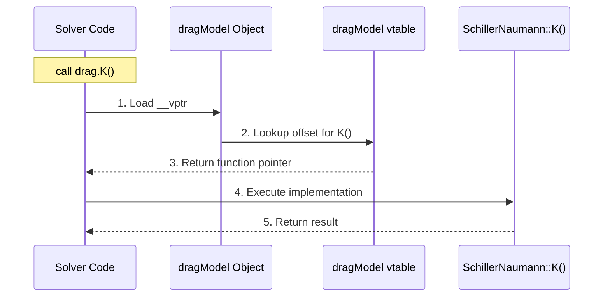

# 02 อินเทอร์เฟซนามธรรมในฐานะ "สัญญา" (Abstract Interfaces as Contracts)

**ในสถาปัตยกรรมของ OpenFOAM, Base Classes ไม่ใช่แค่ที่เก็บโค้ดส่วนกลาง** แต่เป็น **สัญญา (Contract)** ที่กำหนดว่าโมเดลทางฟิสิกส์จะต้อง "สื่อสาร" กับ Solver อย่างไร

---

## ทำไมต้องใช้ Pointers ไปยัง Base Classes?

ในการออกแบบซอฟต์แวร์เชิงวัตถุ อินเทอร์เฟซนามธรรมทำหน้าที่เป็นสัญญาที่กำหนดฟังก์ชันการทำงานที่จำเป็นต้องมีโดยไม่ต้องระบุวิธีการ implement รูปแบบการออกแบบนี้เป็นพื้นฐานสำคัญของความยืดหยุ่นและการบำรุงรักษาของ OpenFOAM

### Blueprint Pattern: Program กับ Interfaces ไม่ใช่ Implementations

```cpp
// Abstract base class - ข้อกำหนดของ socket นามธรรม
class dragModel
{
public:
    // Pure virtual function = รูปแบบ plug ที่ต้องการ
    virtual tmp<surfaceScalarField> K() const = 0;

    // Virtual destructor for proper cleanup
    virtual ~dragModel() = default;
};

// Client code ทำงานกับ drag model ใดๆ ก็ได้
void calculateMomentum(const dragModel& drag)
{
    // Use socket interface
    surfaceScalarField K = drag.K();
    
    // ... momentum calculation
}

// Concrete implementations ให้ฟิสิกส์จริง
class SchillerNaumann : public dragModel 
{
    tmp<surfaceScalarField> K() const override 
    {
        // Schiller-Naumann correlation implementation
    }
};

class Ergun : public dragModel 
{
    tmp<surfaceScalarField> K() const override 
    {
        // Ergun correlation implementation
    }
};
```

**📖 คำอธิบาย (Thai Explanation):**
โค้ดตัวอย่างนี้แสดงหลักการ "Dependency Inversion" จาก SOLID Principles ใน OpenFOAM โดย:

1. **Abstract Base Class (`dragModel`)**: ทำหน้าที่เป็น "Contract" หรือสัญญาที่กำหนดว่า drag models ทุกตัวต้องมีฟังก์ชัน `K()` สำหรับคำนวณสัมประสิทธิ์แรงต้าน การใช้ `pure virtual function (= 0)` บังคับให้ derived classes ต้อง implement ฟังก์ชันนี้

2. **Client Code (`calculateMomentum`)**: รับ parameter เป็น reference ของ base class (`const dragModel&`) ไม่ใช่ derived class ที่เจาะจง ทำให้ฟังก์ชันนี้สามารถทำงานกับ drag model ใดก็ได้ที่ inherit จาก `dragModel`

3. **Concrete Implementations**: แต่ละ class (`SchillerNaumann`, `Ergun`) ให้กลไกทางฟิสิกส์ที่แตกต่างกัน แต่มี interface เหมือนกัน ทำให้ solver ไม่ต้องรู้ว่ากำลังใช้ correlation แบบใด

**🔑 แนวคิดสำคัญ (Key Concepts):**
- **Pure Virtual Function**: ฟังก์ชันที่ไม่มีการ implement ใน base class แต่บังคับให้ derived classes ต้อง implement
- **Polymorphic Reference**: Reference หรือ pointer ของ base class สามารถชี้ไปยัง derived class ได้
- **Interface Segregation**: Base class กำหนด contract ที่เล็กและเฉพาะเจาะจง (เฉพาะ `K()` สำหรับ drag)

**📂 แหล่งที่มา (Source):** 
`.applications/solvers/multiphase/multiphaseEulerFoam/phaseSystems/PhaseSystems/MomentumTransferPhaseSystem/MomentumTransferPhaseSystem.C` (มีการใช้ `dragModel` และ models อื่นๆ ผ่าน abstract interface)

---

### การเลือกสถาปัตยกรรมที่ชาญฉลาด

Solver รับ reference ของ `dragModel&` ไม่ใช่ `SchillerNaumann&` ที่เจาะจง ซึ่งช่วยให้:

1. **Algorithm Reuse**: momentum solver เดียวกันทำงานกับ drag laws ทั้งหมดได้
2. **Decoupled Development**: นักพัฒนา model ฟิสิกส์ไม่ต้องเข้าใจภายใน solver
3. **Runtime Flexibility**: เลือก model ได้ในช่วงตั้งค่า case

### SOLID Principles ใน OpenFOAM

การเลือกสถาปัตยกรรมนี้ตาม **Dependency Inversion Principle** จากหลักการ SOLID:

> "High-level modules ไม่ควรพึ่งพา low-level modules แต่ทั้งสองควรพึ่งพา abstractions"

ใน OpenFOAM:
- **Solvers** (high-level) พึ่งพา abstract model interfaces
- **ไม่ได้พึ่งพา** concrete implementations ที่เจาะจง
- สามารถเพิ่ม drag models ใหม่ได้โดยไม่ต้องแก้ไข solver code

### Interface Segregation Principle

Abstract interfaces ให้สัญญาที่เล็กที่สุดและเฉพาะเจาะจง:

- แต่ละ physics model implement เฉพาะ methods ที่ต้องการ
- หลีกเลี่ยง "fat interface" problem
- Classes ไม่ถูกบังคับให้ implement methods ที่ไม่ได้ใช้

---

## Virtual Function Table (vtable) - แผนภูมิการเชื่อมต่อที่ซ่อนอยู่

![[vtable_architecture.png]]

ทุก abstract base class ที่มี virtual functions จะมี vtable ที่มองไม่เห็นซึ่งทำให้เกิดพฤติกรรม polymorphic กลไกนี้เป็นกระดูกสันหลังของ runtime polymorphism ใน C++ และสำคัญต่อความยืดหยุ่นของ OpenFOAM

### โครงสร้าง vtable ในระดับคอนเซ็ปต์

```cpp
// Conceptual vtable for dragModel hierarchy
struct dragModel_vtable 
{
    // Function pointer to destructor
    void (*destructor)(dragModel*);
    
    // Function pointer to K() method
    tmp<surfaceScalarField> (*K)(const dragModel*);
};

// Each object carries a vtable pointer (added by compiler)
class dragModel 
{
    // Hidden member added by compiler
    dragModel_vtable* __vptr;

public:
    // Pure virtual destructor
    virtual ~dragModel() = 0;
    
    // Pure virtual function for drag coefficient
    virtual tmp<surfaceScalarField> K() const = 0;
};
```

**📖 คำอธิบาย (Thai Explanation):**
โครงสร้าง vtable (Virtual Function Table) เป็นกลไกพื้นฐานที่ทำให้ C++ สามารถทำ Runtime Polymorphism ได้:

1. **vptr (Virtual Pointer)**: Compiler จะแทรก pointer นี้เข้าไปในทุก object ที่มี virtual functions โดยอัตโนมัติ pointer นี้ชี้ไปยัง vtable ของ class นั้นๆ

2. **vtable Structure**: เป็น static array ของ function pointers ที่ถูกสร้างขึ้นหนึ่งตัวต่อ class (ไม่ใช่ต่อ object) แต่ละ entry ใน vtable ชี้ไปยัง implementation ที่แท้จริงของ virtual function

3. **Runtime Dispatch**: เมื่อเรียก virtual function ผ่าน pointer/reference ของ base class compiler จะ:
   - โหลด vptr จาก object
   - ค้นหา function pointer ที่ถูกต้องใน vtable
   - เรียกใช้ function ผ่าน pointer นั้น

4. **Memory Layout**: ทุก instance ของ class เดียวกันใช้ vtable เดียวกัน (shared) แต่มี vptr ของตัวเอง

**🔑 แนวคิดสำคัญ (Key Concepts):**
- **vptr**: Pointer ที่ compiler แทรกให้โดยอัตโนมัติ ชี้ไปยัง vtable
- **vtable**: Static table ของ function pointers หนึ่งตัวต่อ class
- **Dynamic Binding**: การเลือก implementation ที่เหมาะสมเกิดขึ้นที่ runtime
- **Memory Overhead**: เพิ่ม pointer หนึ่งตัวต่อ object (~8 bytes บน 64-bit systems)

**📂 แหล่งที่มา (Source):**
เป็นกลไกพื้นฐานของ C++ Runtime ที่ใช้ใน OpenFOAM ทั้งหมด โดยเฉพาะใน polymorphic class hierarchies เช่น drag models, turbulence models, ฯลฯ

---

### สถาปัตยกรรม vtable

| คุณลักษณะ | คำอธิบาย |
|-----------|-----------|
| **สร้างโดย compiler** | ต่อ class type ระหว่าง compilation |
| **Array of function pointers** | ไปยัง implementations จริง |
| **vtable หนึ่งต่อ class** | ใช้ร่วมกันโดย instances ทั้งหมด |
| **Runtime cost** | pointer dereference พิเศษหนึ่งตัวต่อ virtual call (~5 CPU cycles) |

### Memory Layout ในระดับ Hardware

```
+-------------------+     +---------------------+     +----------------------+
| dragModel object  | --> | dragModel vtable    | --> | SchillerNaumann::K() |
+-------------------+     +---------------------+     +----------------------+
| __vptr            |     | destructor()        | --> | SchillerNaumann::~() |
| other data        |     | K()                 |     +----------------------+
+-------------------+     +---------------------+
```

### Polymorphic Dispatch Process



> **Figure 2:** ลำดับขั้นตอนการเรียกใช้งานฟังก์ชันผ่านกลไก Polymorphic Dispatch โดยเริ่มจาก Solver เรียกฟังก์ชันผ่านออบเจกต์ ซึ่งระบบจะไปค้นหาตำแหน่งของฟังก์ชันที่แท้จริงจาก vtable ก่อนจะกระโดดไปยังส่วนการทำงาน (Implementation) จริงของคลาสลูกที่ถูกต้อง

เมื่อเรียก `drag.K()` compiler สร้าง code เพื่อ:
1. Load vtable pointer จาก object (`drag.__vptr`)
2. หาตำแหน่งใน vtable สำหรับ function pointer `K()`
3. กระโดดไปยัง implementation function จริง

### ปัจจัยด้านประสิทธิภาพ

| ประเด็น | ผลกระทบ |
|---------|---------|
| **Overhead** | ~5 CPU cycles ต่อ virtual call |
| **Inline Inhibition** | Virtual calls ไม่สามารถ inlined ได้ใน compile time |
| **Cache Impact** | Vtable pointers เล็กและ cache-friendly โดยทั่วไป |
| **Trade-off** | ต้นทุนประสิทธิภาพเล็กน้อยแต่ได้ code reuse และ flexibility สูง |

### Template vs. Virtual Functions

OpenFOAM ใช้ hybrid approach อย่างชาญฉลาด:

| กลไก | ใช้เมื่อ | ข้อดี | ข้อเสีย |
|------|----------|--------|---------|
| **Templates** | Code ที่ต้องการประสิทธิภาพสูง | Compile-time polymorphism, zero runtime overhead | ต้อง compile ใหม่เมื่อเปลี่ยน type |
| **Virtual Functions** | Configurability ของ model | Runtime polymorphism, model selection ผ่าน input files | ~5 CPU cycles ต่อ call |

---

## ตัวอย่างใน OpenFOAM: ระบบ Turbulence Modeling

ระบบ turbulence modeling ใน OpenFOAM ใช้รูปแบบ abstract interface อย่างกว้างขวาง:

```cpp
// Abstract interface for turbulence models
class turbulenceModel 
{
public:
    // Pure virtual functions - contract that all turbulence models must fulfill
    
    // Return turbulent kinetic energy
    virtual const volScalarField& k() const = 0;
    
    // Return turbulence dissipation rate (or specific dissipation)
    virtual const volScalarField& epsilon() const = 0;
    
    // Return Reynolds stress tensor
    virtual tmp<volSymmTensorField> R() const = 0;

    // Correct/update turbulence fields
    virtual void correct() = 0;
    
    // Virtual destructor for proper cleanup
    virtual ~turbulenceModel() = default;
};

// Concrete implementation: k-epsilon model
class kEpsilon : public turbulenceModel 
{
    // Member variables storing turbulence fields
    volScalarField k_;
    volScalarField epsilon_;

public:
    // Override pure virtual functions
    const volScalarField& k() const override 
    { 
        return k_; 
    }
    
    const volScalarField& epsilon() const override 
    { 
        return epsilon_; 
    }
    
    tmp<volSymmTensorField> R() const override;
    
    void correct() override;
};

// Concrete implementation: k-omega SST model
class kOmegaSST : public turbulenceModel 
{
    volScalarField k_;
    volScalarField omega_;  // Note: uses omega instead of epsilon

public:
    const volScalarField& k() const override 
    { 
        return k_; 
    }
    
    // Returns omega as the second variable
    const volScalarField& epsilon() const override 
    { 
        return omega_; 
    }
    
    tmp<volSymmTensorField> R() const override;
    
    void correct() override;
};

// Concrete implementation: Spalart-Allmaras model
class SpalartAllmaras : public turbulenceModel 
{
    volScalarField nuTilda_;  // Modified turbulent viscosity

public:
    // k-epsilon models store k, but SA doesn't use it
    const volScalarField& k() const override;
    
    // epsilon() conceptually returns something else for SA
    const volScalarField& epsilon() const override;
    
    tmp<volSymmTensorField> R() const override;
    
    void correct() override;
};
```

**📖 คำอธิบาย (Thai Explanation):**
ตัวอย่างนี้แสดงวิธีที่ OpenFOAM ใช้ Abstract Interfaces เพื่อสนับสนุน Turbulence Models ที่หลากหลาย:

1. **Common Interface**: `turbulenceModel` กำหนด contract ที่รวมฟังก์ชันสำคัญ:
   - `k()`: คืนค่า turbulent kinetic energy
   - `epsilon()`: คืนค่า dissipation rate (หรือ specific dissipation สำหรับ k-ω)
   - `R()`: คืนค่า Reynolds stress tensor
   - `correct()`: อัปเดต turbulence fields

2. **Different Implementations**: แต่ละ model มีวิธีการเก็บข้อมูลและคำนวณที่แตกต่าง:
   - `kEpsilon`: เก็บ k และ epsilon แบบมาตรฐาน
   - `kOmegaSST`: เก็บ k และ omega (ใช้ omega แทน epsilon)
   - `SpalartAllmaras`: เก็บเพียง nuTilda (modified turbulent viscosity) และคำนวณ k/epsilon จากค่านี้

3. **Solver Independence**: Solver code ทำงานกับ `turbulenceModel&` ไม่ใช่ model ที่เจาะจง ทำให้สามารถเปลี่ยน model ได้โดยไม่ต้อง recompile

4. **Runtime Selection**: ผู้ใช้สามารถระบุ model ใน dictionary file และ solver จะสร้าง instance ที่เหมาะสมโดยอัตโนมัติ

**🔑 แนวคิดสำคัญ (Key Concepts):**
- **Pure Virtual Functions**: บังคับให้ derived classes implement ทุกฟังก์ชัน
- **Override Keyword**: ระบุอย่างชัดเจนว่าเป็นการ override ฟังก์ชันจาก base class
- **Polymorphic Behavior**: Pointer ของ base class สามารถเรียกใช้ implementation ที่ถูกต้อง
- **Encapsulation**: แต่ละ model จัดการ internal state ของตัวเอง (k_, epsilon_, omega_, ฯลฯ)

**📂 แหล่งที่มา (Source):**
`.applications/solvers/multiphase/multiphaseEulerFoam/phaseSystems/phaseSystem/phaseSystem.H` (แสดงรูปแบบการใช้ abstract interfaces สำหรับ physics models)

---

### Runtime Selection ผ่าน Abstract Interface

```cpp
// Runtime selection works through abstract interface
autoPtr<turbulenceModel> turbulence = turbulenceModel::New(mesh, phi, U);

// Solver ทำงานกับ interface ไม่ใช่ implementation
const volScalarField& turbulentKE = turbulence().k();
const volSymmTensorField& ReynoldsStress = turbulence().R();
turbulence().correct();
```

สถาปัตยกรรมนี้ทำให้ OpenFOAM รองรับ **turbulence models ได้หลายสิบรุ่น**:
- k-ε, k-ω, k-ω SST
- Spalart-Allmaras
- LES models (Smagorinsky, dynamic, etc.)
- DES models
- Reynolds Stress Models

ซึ่งสามารถเลือกได้ใน **runtime** ผ่าน dictionary entry `turbulenceModel` โดย **ไม่ต้อง recompile solver**

```cpp
// In constant/turbulenceProperties
simulationType  RAS;
RAS
{
    RASModel        kOmegaSST;  // เปลี่ยนได้โดยไม่ต้อง recompile
    turbulence      on;
    printCoeffs     on;
}
```

---

## สรุปปรัชญา Abstract Interfaces ใน OpenFOAM

### 1. Interface Segregation

แต่ละ abstract base class กำหนด contract ที่เฉพาะเจาะจงและเล็กที่สุด:

```cpp
// Drag model interface - specific to drag only
class dragModel 
{
public:
    // Return drag coefficient
    virtual tmp<surfaceScalarField> K() const = 0;
};

// Lift model interface - specific to lift only
class liftModel 
{
public:
    // Return lift force
    virtual tmp<volVectorField> F() const = 0;
};

// Turbulence model interface - specific to turbulence
class turbulenceModel 
{
public:
    // Return turbulent kinetic energy
    virtual const volScalarField& k() const = 0;
    
    // Return dissipation rate
    virtual const volScalarField& epsilon() const = 0;
};
```

**📖 คำอธิบาย (Thai Explanation):**
หลักการ Interface Segregation กำหนดว่า Classes ไม่ควรถูกบังคับให้ implement interfaces ที่ไม่ได้ใช้ ใน OpenFOAM แต่ละ physics model มี interface ที่เฉพาะเจาะจง:

1. **dragModel**: มีเพียง `K()` สำหรับสัมประสิทธิ์แรงต้าน ไม่มี methods อื่นปน
2. **liftModel`: มีเพียง `F()` สำหรับแรงลอยตัว
3. **turbulenceModel`: มีเฉพาะ methods ที่เกี่ยวข้องกับ turbulence

การออกแบบนี้หลีกเลี่ยงปัญหา "Fat Interface" ซึ่งจะบังคับให้ classes implement methods ที่ไม่จำเป็น

**🔑 แนวคิดสำคัญ (Key Concepts):**
- **Single Responsibility**: แต่ละ interface มีความรับผิดชอบเดียว
- **Cohesion**: Methods ที่เกี่ยวข้องกันถูกรวมไว้ด้วยกัน
- **Decoupling**: Interfaces ไม่พึ่งพากัน

**📂 แหล่งที่มา (Source):**
`.applications/solvers/multiphase/multiphaseEulerFoam/phaseSystems/PhaseSystems/MomentumTransferPhaseSystem/MomentumTransferPhaseSystem.C` (มีการใช้ dragModel, liftModel, virtualMassModel, ฯลฯ แยกกัน)

---

### 2. Dependency Inversion

Solvers พึ่งพา abstractions ไม่ใช่ concrete implementations:

```cpp
// ✅ GOOD - depends on abstraction
void solveMomentum(
    const dragModel& drag, 
    const turbulenceModel& turb
);

// ❌ BAD - depends on concrete implementation
void solveMomentum(
    const SchillerNaumann& drag, 
    const kEpsilon& turb
);
```

**📖 คำอธิบาย (Thai Explanation):**
Dependency Inversion Principle (DIP) เป็นหัวใจของสถาปัตยกรรม OpenFOAM:

1. **High-Level Modules (Solvers)**: ไม่ควรพึ่งพา Low-Level Modules (Concrete Implementations)
2. **ทั้งสองควรพึ่งพา Abstractions**: ทั้ง solvers และ models พึ่งพา abstract interfaces
3. **Abstractions ไม่พึ่งพา Details**: Interfaces ไม่ควรรู้จัก implementations

ในตัวอย่าง:
- ✅ `solveMomentum(const dragModel&)`: พึ่งพา abstraction สามารถใช้กับทุก drag models
- ❌ `solveMomentum(const SchillerNaumann&)`: พึ่งพา implementation เฉพาะ ไม่ยืดหยุ่น

**🔑 แนวคิดสำคัญ (Key Concepts):**
- **Dependency Inversion**: พึ่งพา abstractions ไม่ใช่ concretions
- **Loose Coupling**: Solvers และ models ไม่ผูกมัดกันแน่น
- **Flexibility**: สามารถเปลี่ยน implementations โดยไม่กระทบ solvers

**📂 แหล่งที่มา (Source):**
`.applications/solvers/multiphase/multiphaseEulerFoam/phaseSystems/PhaseSystems/MomentumTransferPhaseSystem/MomentumTransferPhaseSystem.C` (ใช้ abstract interfaces สำหรับทุก interfacial models)

---

### 3. Open/Closed Principle

Classes จะเปิดสำหรับการขยาย แต่ปิดสำหรับการแก้ไข:

```cpp
// Open for extension - add new models
class myCustomDragModel : public dragModel 
{
public:
    tmp<surfaceScalarField> K() const override 
    {
        // Custom physics implementation
        // Can use any correlation or experimental data
    }
};

// Closed for modification - solver code doesn't change
addToRunTimeSelectionTable(dragModel, myCustomDragModel, dictionary);
```

**📖 คำอธิบาย (Thai Explanation):**
Open/Closed Principle (OCP) กำหนดว่า Software entities ควร:
- **Open for Extension**: สามารถเพิ่ม behaviors ใหม่ได้
- **Closed for Modification**: ไม่ควรต้องแก้ไข existing code

ใน OpenFOAM:
1. **Open for Extension**: สามารถสร้าง drag model ใหม่โดยการ inherit จาก `dragModel` และ implement `K()`
2. **Closed for Modification**: Solver code ไม่ต้องถูกแก้ไขเมื่อมี models ใหม่
3. **Runtime Selection Table**: `addToRunTimeSelectionTable` ลงทะเบียน model ใหม่โดยไม่กระทบ existing code

ขั้นตอนการเพิ่ม model ใหม่:
1. Inherit จาก abstract base class
2. Implement pure virtual functions
3. ลงทะเบียนด้วย `addToRunTimeSelectionTable`
4. เลือกใช้ใน dictionary file

**🔑 แนวคิดสำคัญ (Key Concepts):**
- **Extension without Modification**: เพิ่มฟีเจอร์โดยไม่แก้โค้ดเดิม
- **Runtime Selection**: เลือก implementations ที่ runtime
- **Plugin Architecture**: Models ทำหน้าที่เป็น plugins

**📂 แหล่งที่มา (Source):**
`.applications/solvers/multiphase/multiphaseEulerFoam/phaseSystems/PhaseSystems/MomentumTransferPhaseSystem/MomentumTransferPhaseSystem.C` (ใช้ `generateInterfacialModels` และ runtime selection)

---

### 4. Liskov Substitution Principle

Derived classes สามารถแทนที่ base classes ได้โดยไม่ทำให้เกิดความผิดปกติ:

```cpp
// Works with ANY drag model - behavior is consistent
void calculateDragForce(const dragModel& drag) 
{
    // This call works identically for all derived classes
    auto K = drag.K();
    
    // ... force calculation
}

// Usable with all derived classes
calculateDragForce(SchillerNaumann(...));  // ✅ Works
calculateDragForce(Ergun(...));             // ✅ Works
calculateDragForce(WenYu(...));             // ✅ Works
```

**📖 คำอธิบาย (Thai Explanation):**
Liskov Substitution Principle (LSP) กำหนดว่า:
1. **Substitutability**: Derived classes สามารถแทนที่ base classes ได้
2. **Behavioral Consistency**: การทำงานควรสอดคล้องกับ contract ของ base class
3. **No Surprises**: การแทนที่ไม่ควรทำให้เกิดผลลัพธ์ที่ไม่คาดคิด

ในตัวอย่าง:
- `calculateDragForce` รับ `const dragModel&` ซึ่งเป็น base class
- ฟังก์ชันนี้สามารถทำงานกับทุก derived classes (`SchillerNaumann`, `Ergun`, `WenYu`)
- ทุก class เรียก `K()` ได้และคืนค่าประเภทเดียวกัน (`tmp<surfaceScalarField>`)
- ผู้เรียกไม่ต้องรู้ว่ากำลังใช้ implementation แบบใด

**🔑 แนวคิดสำคัญ (Key Concepts):**
- **Subtype Polymorphism**: Derived classes เป็น subtypes ของ base class
- **Contract Adherence**: Derived classes ปฏิบัติตาม contract ของ base class
- **Transparent Substitution**: การแทนที่เกิดขึ้นอย่างโปร่งใส

**📂 แหล่งที่มา (Source):**
`.applications/solvers/multiphase/multiphaseEulerFoam/phaseSystems/PhaseSystems/MomentumTransferPhaseSystem/MomentumTransferPhaseSystem.C` (ใช้ dragModels_ table ซึ่งเก็บ pointers ไปยังหลายประเภทของ drag models)

---

## ประโยชน์ทางสถาปัตยกรรมของ Abstract Interfaces

### สำหรับ CFD Experts

- **Physics-driven configuration**: มุ่งเน้นที่ physics มากกว่า programming
- **Rapid experimentation**: เปลี่ยน models ได้โดยไม่ต้อง recompile
- **Reproducibility**: แชร์ simulation setup ผ่าน dictionary files
- **Transparency**: ชัดเจนว่ากำลังใช้ physics models อะไร

### สำหรับ C++ Developers

- **Decoupled development**: พัฒนา models แยกจาก solvers
- **Type safety**: Compiler checks ของ interface compliance
- **Testability**: Unit test แต่ละ model ได้อย่างอิสระ
- **Maintainability**: แก้ไข model หนึ่งๆ โดยไม่กระทบอื่น

### Performance Characteristics

- **Minimal overhead**: ~5 CPU cycles ต่อ virtual call
- **Strategic usage**: Virtual functions ใช้ที่ model selection level เท่านั้น
- **Hot paths optimized**: Field computations ใช้ templates (zero overhead)
- **Cache-friendly**: Vtable pointers เล็กและ predictable

---

## สรุป: พลังของ Abstract Interfaces

Abstract interfaces ใน OpenFOAM ไม่ใช่แค่ technique ทางการเขียนโปรแกรม แต่เป็น **ปรัชญาทางสถาปัตยกรรม** ที่:

1. **แยก concerns**: Numerical algorithms จาก physics models
2. **เปิดโอกาส**: รองรับ models ใหม่โดยไม่แก้ solvers
3. **รักษา performance**: Hybrid approach ของ templates และ virtual functions
4. **ส่งเสริมการทดลอง**: Configuration-driven ทางวิทยาศาสตร์

การสืบทอดและ polymorphism ของ OpenFOAM เปลี่ยน CFD จาก **hardcoded physics** ไปสู่ **configurable science** ซึ่งเป็นการเปลี่ยนแปลงที่มีอิทธิพลอย่างลึกซึ้งต่องานวิจัยและการใช้งานจริง

## 🧠 ทดสอบความเข้าใจ (Concept Check)

<details>
<summary>1. ทำไม OpenFOAM ถึงเลือกใช้ Abstract Interfaces ตามหลักการ Dependency Inversion Principle (DIP)?</summary>

**คำตอบ:** เพื่อให้โมดูลระดับสูง (High-level) อย่าง Solver ไม่ต้องพึ่งพาโมดูลระดับต่ำ (Low-level) อย่าง Model Implementations เฉพาะเจาะจง แต่ให้ทั้งคู่พึ่งพาผ่านอินเทอร์เฟซนามธรรมแทน ทำให้สามารถเปลี่ยน Model ได้โดยไม่ต้องแก้โค้ด Solver
</details>

<details>
<summary>2. หลักการ Interface Segregation Principle ช่วยป้องกันปัญหา "Fat Interface" ได้อย่างไรใน OpenFOAM?</summary>

**คำตอบ:** โดยการแยกอินเทอร์เฟซให้เล็กและเฉพาะเจาะจง (เช่นแยก `dragModel` ออกจาก `liftModel`) ทำให้คลาสไม่ต้องถูกบังคับ Implementation ฟังก์ชันที่ไม่จำเป็นต้องใช้ เช่น Drag Model ไม่ต้องมีฟังก์ชันเกี่ยวกับ Lift
</details>

## 📚 เอกสารที่เกี่ยวข้อง (Related Documents)

*   **ก่อนหน้า:** [01_Introduction.md](01_Introduction.md) - บทนำเรื่องระบบ Plug-and-Play
*   **ถัดไป:** [03_Inheritance_Hierarchies.md](03_Inheritance_Hierarchies.md) - ลำดับชั้นการสืบทอดใน OpenFOAM