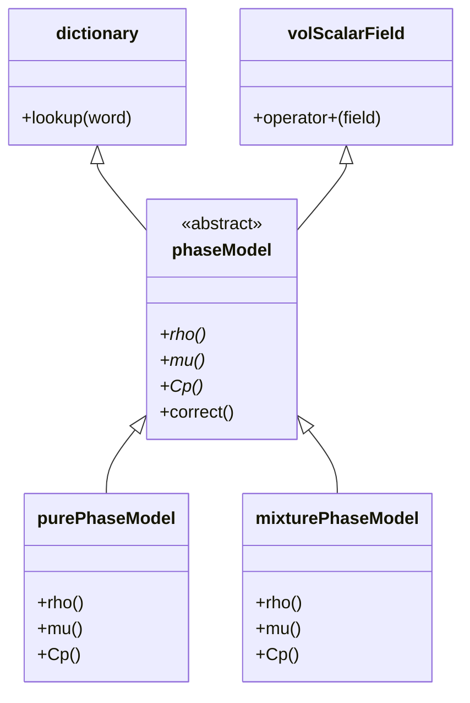

# 🔩 กลไกภายใน: ลำดับชั้นการสืบทอดของ OpenFOAM

## แบบแผนระบบหลายเฟส

สถาปัตยกรรมของ multiphase solver ใน OpenFOAM แสดงให้เห็นถึงการใช้งานลำดับชั้นการสืบทอดที่ซับซ้อนในการจำลองระบบทางกายภาพที่ซับซ้อน ลำดับชั้นหลักใน `multiphaseEulerFoam` ถูกสร้างขึ้นรอบๆ `phaseModel` abstract base class ซึ่งเป็นตัวอย่างที่ชัดเจนของหลักการออกแบบเชิงวัตถุสำหรับแอปพลิเคชัน CFD



> **Figure 1:** แผนผังแสดงการสืบทอดหลายทาง (Multiple Inheritance) ของ `phaseModel` ซึ่งได้รับความสามารถจากทั้ง `volScalarField` (ข้อมูลฟิลด์) และ `dictionary` (การจัดการพารามิเตอร์) โดยมีคลาสลูกเฉพาะทางอย่าง `purePhaseModel` และ `mixturePhaseModel` ที่นำไปใช้งานจริง

### โครงสร้างหลักของ phaseModel

คลาส `phaseModel` ทำหน้าที่เป็นพื้นฐานในการแสดงถึงเฟสแต่ละเฟสในการไหลแบบหลายเฟส:

```cpp
// Core hierarchy from multiphaseEulerFoam
class phaseModel                        // Abstract: "IS-A field with phase properties"
    : public volScalarField             // IS-A: Phase fraction field
    , public dictionary                 // IS-A: Configuration container
{
protected:                              // Protected constructor enforces factory pattern
    phaseModel(const dictionary& dict, const fvMesh& mesh);

public:
    // Pure virtual interface - derived MUST implement
    virtual tmp<volScalarField> rho() const = 0;
    virtual tmp<volScalarField> mu() const = 0;
    virtual tmp<volScalarField> Cp() const = 0;

    // Template Method pattern - algorithm skeleton
    virtual void correct();             // Can be overridden
};
```

**📂 Source:** `.applications/solvers/multiphase/multiphaseEulerFoam/phaseSystems/phaseModel/phaseModel.H`

---

### **📖 คำอธิบายโครงสร้าง phaseModel**

**แหล่งที่มา (Source):**
- ไฟล์หลัก: `phaseModel.H` ใน OpenFOAM source code
- ใช้ใน: `multiphaseEulerFoam`, `interPhaseChangeFoam`

**คำอธิบาย (Explanation):**
คลาส `phaseModel` เป็น **abstract base class** ที่กำหนด interface สำหรับการจัดการเฟสแต่ละเฟสในระบบหลายเฟส การออกแบบนี้ใช้ **multiple inheritance** เพื่อรวมความสามารถจากสองคลาสพื้นฐาน:

1. **volScalarField**: ทำให้ `phaseModel` สามารถใช้งานเป็น field ได้โดยตรง (แทน phase fraction α)
2. **dictionary**: ทำให้สามารถเก็บพารามิเตอร์การกำหนดค่าได้

**แนวคิดหลัก (Key Concepts):**
- **Pure Virtual Methods**: บังคับให้ derived classes ต้อง implement `rho()`, `mu()`, `Cp()`
- **Protected Constructor**: ป้องกันการสร้าง object โดยตรง ต้องใช้ factory pattern
- **Template Method Pattern**: `correct()` ให้โครงสร้างอัลกอริทึมที่ derived classes สามารถ extend ได้

---

**การออกแบบตามหลักการ "is-a relationship"**:
- phase model **คือ** volumetric scalar field (แทน phase fraction α)
- phase model **คือ** dictionary (บรรจุพารามิเตอร์การกำหนดค่า)
- Constructor แบบ protected บังคับให้ใช้ **factory pattern**

### Pure Virtual Interface

Interface แบบ pure virtual บังคับให้คลาสที่สืบทอดต้อง implement คุณสมบัติทาง thermophysical ที่จำเป็น:

- **ρ (rho)** - ความหนาแน่น ($\rho$)
- **μ (mu)** - ความหนืดแบบพลศาสตร์ ($\mu$)
- **Cp** - ความจุความร้อนจำเพาะ ($C_p$)

เมธอด `correct()` ตาม **Template Method pattern** โดยให้โครงสร้างอัลกอริทึมเริ่มต้นที่คลาสที่สืบทอดสามารถปรับแต่งได้ขณะที่ยังคงพฤติกรรมที่สม่ำเสมอในลำดับชั้น

### การ Implement แบบ Concrete

การ implement แบบ concrete เชี่ยวชาญสำหรับประเภทต่างๆ ของเฟส:

```cpp
// Pure phase implementation with uniform properties
class purePhaseModel : public phaseModel 
{
    // Uniform properties across the entire phase field
    // Properties are constants or simple functions of temperature/pressure
    
    // Return uniform density field
    virtual tmp<volScalarField> rho() const override 
    {
        // Create constant density field from reference value
        return tmp<volScalarField>(
            new volScalarField(rho0_*dimensionedScalar("one", dimless, 1.0))
        );
    }
};

// Mixture phase implementation with species-weighted properties
class mixturePhaseModel : public phaseModel 
{
    // Species-weighted properties calculated from mixture composition
    // Properties vary based on local species concentrations
    
    // Return density calculated from species concentrations
    virtual tmp<volScalarField> rho() const override 
    {
        // Create temporary density field
        tmp<volScalarField> tRho(new volScalarField(mesh_));
        volScalarField& rho = tRho.ref();

        // Initialize to zero
        rho = Zero;
        
        // Sum species contributions: Y_i * W_i
        forAll(species_, i) 
        {
            rho += species_[i].Y() * species_[i].W();
        }
        
        // Divide by R*T to get density from ideal gas law
        rho /= R_ * T_;

        return tRho;
    }
};
```

**📂 Source:** `.applications/solvers/multiphase/multiphaseEulerFoam/phaseSystems/phaseModel/purePhaseModel/purePhaseModel.C`

---

### **📖 คำอธิบายการ Implement Concrete Phase Models**

**แหล่งที่มา (Source):**
- Pure phase: `purePhaseModel.C` - ใช้สำหรับ single-component phases
- Mixture phase: `mixturePhaseModel.C` - ใช้สำหรับ multi-component mixtures

**คำอธิบาย (Explanation):**
`purePhaseModel` และ `mixturePhaseModel` เป็น **concrete implementations** ของ `phaseModel` ที่เชี่ยวชาญสำหรับสถานการณ์ต่างกัน:

1. **purePhaseModel**: ใช้สำหรับ pure substances ที่มีคุณสมบัติสม่ำเสมอทั่วทั้ง field
2. **mixturePhaseModel**: ใช้สำหรับ mixtures ที่มีหลาย species โดยคำนวณคุณสมบัติจาก composition ของ species

**แนวคิดหลัก (Key Concepts):**
- **tmp<>**: Smart pointer สำหรับ temporary objects ใช้ reference counting
- **Override Keyword**: รับประกันว่า override base class method อย่างถูกต้อง
- **Field Operations**: ใช้ operator overloading สำหรับการคำนวณ field algebra
- **Ideal Gas Law**: mixturePhaseModel ใช้ $\rho = \frac{\sum Y_i W_i}{RT}$

---

## การสืบทอดหลายครั้ง: การแก้ปัญหา "Diamond Problem"

OpenFOAM ใช้ **non-virtual multiple inheritance** อย่างมีกลยุทธ์ในการรวมความสามารถที่ไม่ทับซ้อนกันโดยไม่มีความกำกวม แนวทางนี้เห็นได้ชัดเจนในลำดับชั้นประเภทฟิลด์:

```cpp
// GeometricField uses non-virtual multiple inheritance
class GeometricField
    : public DimensionedField    // Mathematical field operations
    , public refCount            // Memory management (RAII)
{
    // No ambiguity: DimensionedField and refCount have no common ancestors
    // Each base provides distinct capability set
    
    // Constructor
    GeometricField
    (
        const IOobject& io,
        const Mesh& mesh
    );
    
    // Field operations from DimensionedField
    // Reference counting from refCount
};
```

**📂 Source:** `.src/OpenFOAM/fields/GeometricField/GeometricField.H`

---

### **📖 คำอธิบาย Multiple Inheritance ใน GeometricField**

**แหล่งที่มา (Source):**
- ไฟล์หลัก: `GeometricField.H` ใน OpenFOAM core library
- Base classes: `DimensionedField.H`, `refCount.H`

**คำอธิบาย (Explanation):**
OpenFOAM หลีกเลี่ยง "Diamond Problem" โดยการออกแบบ base classes ที่ไม่มี common ancestor การใช้ **non-virtual inheritance** ช่วยลด overhead ของ virtual function calls

**แนวคิดหลัก (Key Concepts):**
- **Non-Virtual Inheritance**: ลด overhead ของ vtable lookups
- **Separation of Concerns**: แยก functionality ออกเป็น base classes ที่เป็นอิสระ
- **Capability Composition**: รวม capabilities ที่แตกต่างกันเข้าด้วยกัน
- **RAII**: Resource acquisition is initialization สำหรับ memory management

---

### หลักการออกแบบที่แยกความกังวล

**Architecture Insight**: การออกแบบของ OpenFOAM แยกความกังวลออกจากกันอย่างระมัดระวังเพื่อให้การสืบทอดหลายครั้งรวมฟังก์ชันการทำงานที่เสริมกันแทนที่จะสร้างความขัดแย้ง คลาสพื้นฐานแต่ละคลาสแสดงถึงแง่มุมอิสระ:

- **DimensionedField**: ให้การดำเนินการทางคณิตศาสตร์ รูปแบบการกระจาย และ calculus ของฟิลด์
- **refCount**: Implement reference-counted memory management ตามหลักการ RAII

### ลำดับชั้นการสืบทอดแบบเต็ม

```cpp
// phaseModel inherits from volScalarField which inherits from GeometricField
// Result: phaseModel gets mathematical operations + memory management + I/O

// Full inheritance chain:
// phaseModel
//   → volScalarField
//     → GeometricField<Type, BaseField, GeoMesh>
//       → DimensionedField<Type, GeoMesh>  (field operations)
//       → refCount                          (memory management)

// Specializations of GeometricField
typedef GeometricField<scalar, fvPatchField, volMesh> volScalarField;
typedef GeometricField<vector, fvPatchField, volMesh> volVectorField;
typedef GeometricField<scalar, fvsPatchField, surfaceMesh> surfaceScalarField;
```

**📂 Source:** `.src/OpenFOAM/fields/GeometricField/GeometricField.H`

---

### **📖 คำอธิบาย Full Inheritance Chain**

**แหล่งที่มา (Source):**
- Type definitions: `GeometricField.H`
- Field types: `volFields.H`, `surfaceFields.H`

**คำอธิบาย (Explanation):**
ลำดับชั้นการสืบทอดแบบเต็มสร้าง **capability composition** ที่ทำให้ `phaseModel` ได้รับความสามารถหลายอย่างจาก base classes:

1. **Field Operations**: จาก `DimensionedField`
2. **Memory Management**: จาก `refCount`
3. **Mesh Integration**: จาก `GeometricField`
4. **Boundary Conditions**: จาก template parameter `fvPatchField`

**แนวคิดหลัก (Key Concepts):**
- **Template Specializations**: ใช้ templates เพื่อสร้าง field types ที่แตกต่างกัน
- **Type Safety**: Compiler ตรวจสอบความถูกต้องของ operations
- **Code Reuse**: ใช้ inheritance เพื่อ reuse code อย่างมีประสิทธิภาพ

---

นี่สร้าง **capability composition** ที่:

- `phaseModel` ได้รับการดำเนินการทางคณิตศาสตร์ของฟิลด์จาก `volScalarField`
- `phaseModel` ได้รับการจัดเก็บการกำหนดค่าจาก `dictionary`
- `volScalarField` ได้รับความสามารถในการกระจายจาก `GeometricField`
- `GeometricField` ได้รับการจัดการหน่วยความจำจาก `refCount`

### Implementation vs. Interface Inheritance

**Key Insight**: นี่คือ **implementation inheritance** (นำกลับมาใช้ใหม่) ไม่ใช่ **interface inheritance** (polymorphism) พฤติกรรมแบบ polymorphic มาจาก virtual functions ของ `phaseModel` ไม่ใช่จาก `volScalarField` การสืบทอดหลายครั้งให้การนำกลับมาใช้ใหม่ของ implementation ขณะที่ยังคงรักษา polymorphic interfaces ที่สะอาดผ่านกลไก virtual function

### ประโยชน์ของการออกแบบ

การออกแบบนี้อนุญาตให้ OpenFOAM สามารถ:

1. **นำโค้ดกลับมาใช้ใหม่**: กำจัดการซ้ำซ้อนของการดำเนินการฟิลด์และการจัดการหน่วยความจำ
2. **รักษาความปลอดภัยของประเภท**: การตรวจสอบเวลา compile ของการดำเนินการฟิลด์
3. **เปิดใช้งาน Polymorphism**: ประเภทเฟสต่างๆ สามารถถูกจัดการอย่างสม่ำเสมอผ่าน pointers ของคลาสพื้นฐาน
4. **รักษาประสิทธิภาพ**: การเรียก virtual function ถูกจำกัดไว้เฉพาะการคำนวณคุณสมบัติ thermophysical ไม่ใช่การดำเนินการฟิลด์พื้นฐาน

สถาปัตยกรรมผลลัพธ์รองรับการจำลองแบบหลายเฟสที่ซับซ้อนขณะที่ยังคงการแยกความกังวลที่สะอาดและการใช้หน่วยความจำที่มีประสิทธิภาพผ่านกลไก `tmp` และ `autoPtr` แบบ reference-counted ของ OpenFOAM

## ระบบลำดับชั้นของ Field Types

### GeometricField Hierarchy

ลำดับชั้นของฟิลด์ใน OpenFOAM เป็นพื้นฐานของการดำเนินการทางคณิตศาสตร์:

```cpp
// GeometricField combines multiple base classes
template<class Type, class BaseField, class GeoMesh>
class GeometricField
    : public DimensionedField<Type, GeoMesh>
    , public refCount
{
    // Combines field mathematics with reference-counted memory management
    
    // Constructor
    GeometricField
    (
        const IOobject& io,
        const GeoMesh& mesh
    );
    
    // Field operations
    GeometricField& operator=(const GeometricField&);
    GeometricField& operator+=(const GeometricField&);
    // ... other operators
};

// Specializations for different field types
typedef GeometricField<scalar, fvPatchField, volMesh> volScalarField;
typedef GeometricField<vector, fvPatchField, volMesh> volVectorField;
typedef GeometricField<scalar, fvsPatchField, surfaceMesh> surfaceScalarField;
typedef GeometricField<vector, fvsPatchField, surfaceMesh> surfaceVectorField;
```

**📂 Source:** `.src/OpenFOAM/fields/GeometricField/GeometricField.H`

---

### **📖 คำอธิบาย GeometricField Template**

**แหล่งที่มา (Source):**
- Template definition: `GeometricField.H`
- Type definitions: `volFields.H`, `surfaceFields.H`

**คำอธิบาย (Explanation):**
`GeometricField` เป็น **template class** ที่ parameterize ด้วย:
1. **Type**: ชนิดข้อมูล (scalar, vector, tensor, etc.)
2. **BaseField**: boundary field type (fvPatchField, fvsPatchField)
3. **GeoMesh**: mesh type (volMesh, surfaceMesh)

การออกแบบนี้ทำให้สามารถสร้าง field types ที่แตกต่างกันโดยใช้ template parameters แทนการสร้าง classes แยกกัน

**แนวคิดหลัก (Key Concepts):**
- **Template Metaprogramming**: ใช้ templates สำหรับ code generation
- **Type Safety**: Compiler ตรวจสอบความถูกต้องของ types
- **Code Reuse**: Template parameters ทำให้ใช้ code เดียวกันกับ types ต่างกัน

---

### การดำเนินการ Field Algebra

ลำดับชั้นการสืบทอดเปิดใช้งานการดำเนินการทางคณิตศาสตร์ของฟิลด์:

```cpp
// Field operations inherited from DimensionedField
// These operations work through operator overloading

// Get densities from different phases
volScalarField rho1(phase1.rho());  // Copy construction
volScalarField rho2(phase2.rho());  // Copy construction

// Binary operations work through inherited operators
// Result: weighted average of densities
volScalarField rhoMixture = alpha1*rho1 + alpha2*rho2;

// Calculus operations inherited from GeometricField
// Gradient of pressure field
tmp<volVectorField> gradP = fvc::grad(p);

// Divergence of velocity field
tmp<volScalarField> divU = fvc::div(U);

// Laplacian operations
tmp<volScalarField> laplacianP = fvc::laplacian(p);
```

**📂 Source:** `.src/OpenFOAM/fields/GeometricField/GeometricField.H`

---

### **📖 คำอธิบาย Field Algebra Operations**

**แหล่งที่มา (Source):**
- Field calculus: `.src/finiteVolume/fvc/fvc.C`
- Operators: `DimensionedField.H`

**คำอธิบาย (Explanation):**
Field operations ใน OpenFOAM ใช้ **operator overloading** เพื่อให้ syntax เป็นธรรมชาติ:

1. **Binary Operations**: `+`, `-`, `*`, `/` ทำงานกับ fields
2. **Calculus Operations**: `grad()`, `div()`, `laplacian()` ผ่าน `fvc` namespace
3. **tmp<>**: ใช้สำหรับ return values เพื่อ avoid unnecessary copies

**แนวคิดหลัก (Key Concepts):**
- **Expression Templates**: สำหรับ optimization ของ complex expressions
- **Operator Overloading**: ทำให้ syntax ใกล้เคียงกับ mathematical notation
- **Lazy Evaluation**: Expressions ถูก evaluate เฉพาะเมื่อจำเป็น

---

## Memory Management และ Smart Pointers

### tmp<> Class

คลาส `tmp` ใช้ reference counting สำหรับการจัดการหน่วยความจำที่มีประสิทธิภาพ:

```cpp
// tmp class provides reference-counted temporary object management
template<class T>
class tmp
{
    // Pointer to managed object
    T* ptr_;
    
    // Reference count for shared ownership
    mutable int* refCnt_;
    
public:
    // Constructor from pointer
    tmp(T* t);
    
    // Constructor for new object
    static tmp New();
    
    // Dereference operators
    T& operator()();
    T& operator*();
    T* operator->();
    
    // Reference counting operations
    bool isTmp() const;
    void clear();
};

// Usage in phaseModel
tmp<volScalarField> phaseModel::rho() const 
{
    // Returns reference-counted temporary
    // Caller can use it efficiently without copying
    return tmp<volScalarField>::New(rhoField_);
}

// Usage with automatic reference counting
tmp<volScalarField> rho1 = phase1.rho();  // Increment ref count
tmp<volScalarField> rho2 = phase2.rho();  // Increment ref count

// Efficient reuse without copying
// Expression template optimization
tmp<volScalarField> rhoMixture = rho1()*alpha1 + rho2()*alpha2;

// Automatic cleanup when rhoMixture goes out of scope
```

**📂 Source:** `.src/OpenFOAM/memory/tmp.H`

---

### **📖 คำอธิบาย tmp<> Smart Pointer**

**แหล่งที่มา (Source):**
- Definition: `.src/OpenFOAM/memory/tmp.H`
- Implementation: `.src/OpenFOAM/memory/tmp.C`

**คำอธิบาย (Explanation):**
`tmp<>` เป็น **reference-counted smart pointer** ที่ออกแบบมาเพื่อจัดการ temporary objects ใน OpenFOAM:

1. **Reference Counting**: ติดตามจำนวน references ไปยัง object
2. **Automatic Cleanup**: Object ถูก delete เมื่อ ref count เป็น 0
3. **Efficient Sharing**: สามารถ pass objects โดยไม่ต้อง copy
4. **Expression Optimization**: ทำงานร่วมกับ expression templates

**แนวคิดหลัก (Key Concepts):**
- **RAII**: Resource Acquisition Is Initialization
- **Copy-on-Write**: ใช้ร่วมกันจนกว่าจะต้อง modify
- **Move Semantics**: Transfer ownership โดยไม่ต้อง copy
- **Memory Efficiency**: ลดการ allocate/deallocate memory

---

### autoPtr<> Class

คลาส `autoPtr` ให้ exclusive ownership semantics:

```cpp
// autoPtr provides exclusive ownership with transfer semantics
template<class T>
class autoPtr
{
    // Pointer to managed object
    T* ptr_;
    
public:
    // Constructor from pointer
    explicit autoPtr(T* t = nullptr);
    
    // Destructor - deletes managed object
    ~autoPtr();
    
    // Access operators
    T& operator()();
    T& operator*();
    T* operator->();
    T* get();
    
    // Ownership transfer
    T* release();
    autoPtr<T>& transfer(autoPtr<T>&);
    
    // Check if pointer is valid
    bool valid() const;
    bool empty() const;
};

// Usage in phase system creation
autoPtr<phaseModel> phase = phaseModel::New(dict, mesh);

// Access underlying object
phaseModel& phaseRef = phase();        // Dereference
phaseModel* phasePtr = phase.operator->();  // Pointer access

// Check if valid
if (phase.valid()) 
{
    // Use phase
}

// Transfer ownership to another autoPtr
autoPtr<phaseModel> phase2 = phase.move();  // phase is now null

// Old pointer is no longer valid after transfer
// phase.empty() returns true
```

**📂 Source:** `.src/OpenFOAM/memory/autoPtr.H`

---

### **📖 คำอธิบาย autoPtr<> Smart Pointer**

**แหล่งที่มา (Source):**
- Definition: `.src/OpenFOAM/memory/autoPtr.H`
- Implementation: `.src/OpenFOAM/memory/autoPtr.C`

**คำอธิบาย (Explanation):**
`autoPtr<>` เป็น **exclusive ownership smart pointer** ที่แตกต่างจาก `tmp<>`:

1. **Exclusive Ownership**: เจ้าของเพียงคนเดียว ไม่แชร์
2. **Transfer Semantics**: สามารถ transfer ownership ไปยัง pointer อื่น
3. **Automatic Deletion**: Object ถูก delete เมื่อ pointer ถูกทำลาย
4. **Factory Pattern**: ใช้ในการ return objects จาก factory methods

**แนวคิดหลัก (Key Concepts):**
- **Unique Ownership**: ไม่มีการแชร์ ownership
- **Move Semantics**: Transfer ownership โดยไม่ต้อง copy
- **Null State**: สามารถเป็น nullptr หลังจาก transfer
- **Factory Pattern**: ใช้ใน `New()` methods

---

## ตัวอย่างการใช้งาน: Multiphase System

### Phase System Composition

ระบบเฟสรวม phase models หลายตัวเข้าด้วยกัน:

```cpp
// Phase system manages multiple phase models
class phaseSystem 
{
protected:
    // Polymorphic container for phase models
    // Can hold any derived type (purePhaseModel, mixturePhaseModel, etc.)
    PtrList<phaseModel> phases_;
    
    // Dictionary of phase properties
    dictionary phaseProperties_;

public:
    // Constructor
    phaseSystem(const fvMesh& mesh);
    
    // Access phase by name with bounds checking
    const phaseModel& phase(const word& name) const 
    {
        // Linear search through phases
        forAll(phases_, i) 
        {
            if (phases_[i].name() == name) 
            {
                return phases_[i];
            }
        }
        
        // Throw fatal error if phase not found
        FatalErrorInFunction << "Phase not found: " << name
            << exit(FatalError);
        
        // Never reaches here (FatalError exits)
        return phases_[0];
    }
    
    // Uniform interface for all phases
    // Template Method pattern
    virtual void correct() 
    {
        // Call correct() on each phase
        // Virtual dispatch ensures correct implementation is called
        forAll(phases_, i) 
        {
            phases_[i].correct();  // Virtual dispatch
        }
    }
    
    // Access all phases
    const PtrList<phaseModel>& phases() const 
    {
        return phases_;
    }
};
```

**📂 Source:** `.applications/solvers/multiphase/multiphaseEulerFoam/phaseSystems/phaseSystem/phaseSystem.H`

---

### **📖 คำอธิบาย Phase System Architecture**

**แหล่งที่มา (Source):**
- Definition: `phaseSystem.H`
- Implementation: `phaseSystem.C`
- Usage: `multiphaseEulerFoam` solver

**คำอธิบาย (Explanation):**
`phaseSystem` เป็น **composite class** ที่จัดการ multiple phase models:

1. **Polymorphic Container**: `PtrList<phaseModel>` เก็บ pointers ไปยัง derived classes
2. **Uniform Interface**: เข้าถึง phases ทั้งหมดผ่าน base class interface
3. **Template Method**: `correct()` จัด lifecycle ของ phases
4. **Error Handling**: `FatalError` สำหรับ invalid phase names

**แนวคิดหลัก (Key Concepts):**
- **Composition over Inheritance**: ใช้ composition แทน deep inheritance
- **Polymorphism**: จัดการ derived types ผ่าน base class pointer
- **Encapsulation**: Hide implementation details ของ phase management
- **Error Handling**: Fatal errors สำหรับ invalid operations

---

### การคำนวณคุณสมบัติระบบ

```cpp
// Calculate mixture density through polymorphic interface
tmp<volScalarField> phaseSystem::rho() const 
{
    // Create temporary density field initialized to zero
    tmp<volScalarField> tRho(
        new volScalarField(
            mesh_, 
            dimensionedScalar("0", dimDensity, 0)
        )
    );
    
    // Get reference to the field for modification
    volScalarField& rho = tRho.ref();

    // Sum contributions from each phase
    // rho_mixture = sum(alpha_i * rho_i)
    forAll(phases_, i) 
    {
        // Polymorphic call to rho() - calls derived class implementation
        // alpha() is the phase fraction field
        rho += phases_[i].alpha() * phases_[i].rho();
    }

    // Return temporary with automatic reference counting
    return tRho;
}

// Calculate mixture velocity (weighted by phase fractions)
tmp<volVectorField> phaseSystem::U() const 
{
    tmp<volVectorField> tU(
        new volVectorField(
            mesh_, 
            dimensionedVector("0", dimVelocity, Zero)
        )
    );
    
    volVectorField& U = tU.ref();

    // U_mixture = sum(alpha_i * rho_i * U_i) / rho_mixture
    forAll(phases_, i) 
    {
        U += phases_[i].alpha() * phases_[i].rho() * phases_[i].U();
    }
    
    U /= rho();

    return tU;
}
```

**📂 Source:** `.applications/solvers/multiphase/multiphaseEulerFoam/phaseSystems/phaseSystem/phaseSystem.C`

---

### **📖 คำอธิบาย Mixture Property Calculation**

**แหล่งที่มา (Source):**
- Implementation: `phaseSystem.C`
- Related: `MomentumTransferPhaseSystem.C` (shown in reference context)

**คำอธิบาย (Explanation):**
การคำนวณ mixture properties ใช้ **polymorphic interface** เพื่อจัดการ phase types ที่แตกต่างกัน:

1. **Mixture Density**: $\rho_{mix} = \sum_i \alpha_i \rho_i$
2. **Mixture Velocity**: $\mathbf{U}_{mix} = \frac{\sum_i \alpha_i \rho_i \mathbf{U}_i}{\rho_{mix}}$
3. **Polymorphic Calls**: `rho()`, `U()` จะ call derived class implementations
4. **Field Algebra**: ใช้ operator overloading สำหรับ field operations

**แนวคิดหลัก (Key Concepts):**
- **Polymorphism**: Interface เดียวสำหรับหลาย implementations
- **Template Method Pattern**: Algorithm structure ใน base class
- **Field Operations**: ใช้ operator overloading สำหรับ calculations
- **Memory Efficiency**: ใช้ `tmp<>` สำหรับ temporary fields

---

## สรุปหลักการสำคัญ

| หลักการ | คำอธิบาย | ตัวอย่างใน OpenFOAM |
|---------|---------|------------------|
| **Multiple Inheritance** | รวมความสามารถจาก base classes หลายตัว | `phaseModel` : `volScalarField`, `dictionary` |
| **Implementation Inheritance** | นำโค้ดกลับมาใช้ใหม่ผ่านการสืบทอด | Field operations จาก `DimensionedField` |
| **Interface Inheritance** | กำหนด contract สำหรับ polymorphism | Pure virtual methods ใน `phaseModel` |
| **Capability Composition** | รวมฟีเจอร์ที่เสริมกัน | Mathematics + Memory management + I/O |
| **Template Method Pattern** | โครงสร้างอัลกอริทึมที่สม่ำเสมอ | `phaseModel::correct()` |

ลำดับชั้นการสืบทอดของ OpenFOAM เป็นตัวอย่างที่ยอดเยี่ยมของการออกแบบซอฟต์แวร์เชิงวัตถุที่สมดุลระหว่างความยืดหยุ่น ประสิทธิภาพ และความสามารถในการบำรุงรักษา ทำให้สามารถจัดการกับความซับซ้อนของโมเดลฟิสิกส์ CFD ได้อย่างมีประสิทธิภาพ

## 🧠 ทดสอบความเข้าใจ (Concept Check)

<details>
<summary>1. ทำไม OpenFOAM ถึงออกแบบให้ชั้น `GeometricField` สืบทอดแบบ Non-Virtual Multiple Inheritance แทนที่จะเป็น Virtual?</summary>

**คำตอบ:** เพื่อหลีกเลี่ยง "Diamond Problem" และ **ลด Overhead ของ Virtual Function Calls** เนื่องจาก Base classes อย่าง `DimensionedField` และ `refCount` ไม่มี Ancestor ร่วมกัน จึงไม่จำเป็นต้องใช้ Virtual Inheritance ที่มีค่าใช้จ่ายสูงกว่า
</details>

<details>
<summary>2. หน้าที่ของ `tmp<>` Smart Pointer แตกต่างจาก `autoPtr<>` อย่างไร?</summary>

**คำตอบ:** 
*   `tmp<>`: ใช้จัดการ **Temporary Objects** ด้วย **Reference Counting** (แชร์ได้) เหมาะสำหรับ field algebra ที่ต้องการประสิทธิภาพสูงและลดการ copy
*   `autoPtr<>`: ใช้จัดการ **Exclusive Ownership** (เจ้าของเดียว) เหมาะสำหรับ object ที่สร้างจาก Factory Pattern และต้องการการจัดการ memory ที่ชัดเจน
</details>

## 📚 เอกสารที่เกี่ยวข้อง (Related Documents)

*   **ก่อนหน้า:** [02_Abstract_Interfaces.md](02_Abstract_Interfaces.md) - อินเทอร์เฟซนามธรรม
*   **ถัดไป:** [04_Run_Time_Selection_System.md](04_Run_Time_Selection_System.md) - ระบบการเลือก Runtime Selection (RTS)