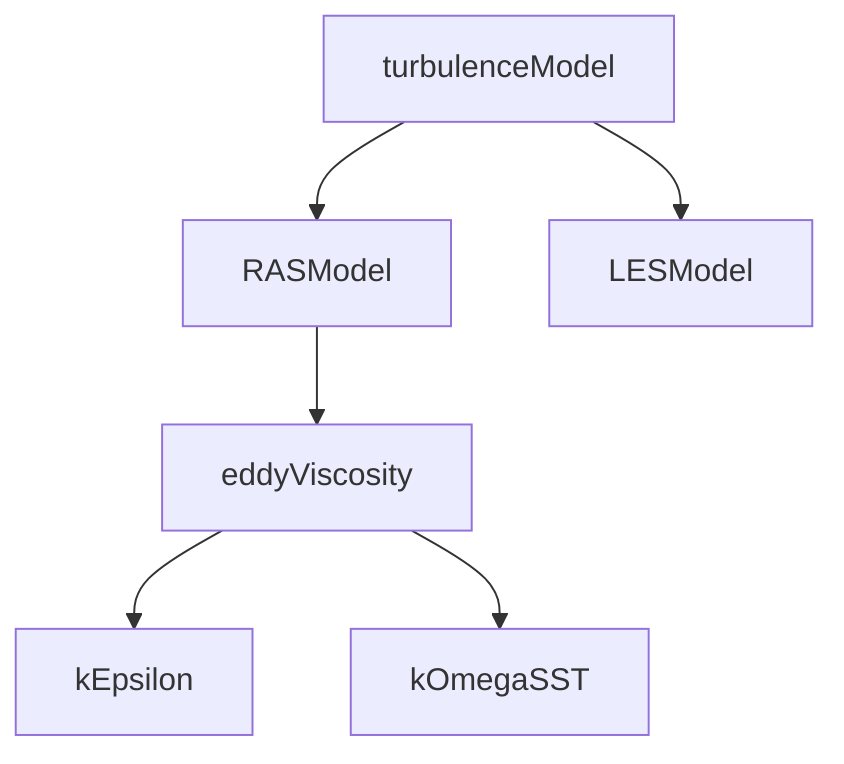

# Inheritance Hierarchies

ลำดับชั้นการสืบทอดใน OpenFOAM

---

## Overview

> OpenFOAM uses **deep inheritance** for physics model flexibility

---

## 1. Example: Turbulence Hierarchy



<!-- IMAGE: IMG_09_002 -->
<!-- 
Purpose: เพื่อแสดงโครงสร้าง Class Hierarchy ของ Turbulence Model. ภาพนี้ต้องโชว์การสืบทอดแบบ "Abstract $\rightarrow$ Concrete" โดยเริ่มจาก `turbulenceModel` ที่เป็นรากฐาน ไปสู่ `RASModel` และแตกกิ่งไปเป็นโมเดลที่ใช้งานจริง เช่น `kEpsilon`, `kOmegaSST`.
Prompt: "UML Class Diagram of OpenFOAM Turbulence Models. **Root:** `turbulenceModel` (Abstract Base). **Level 1:** `RASModel` and `LESModel`. **Level 2 (Concrete):** Under RASModel, show `kEpsilon`, `kOmegaSST`, `SpalartAllmaras`. Under LESModel, show `Smagorinsky`, `WALE`. **Key Methods:** Show `correct()`, `divDevReff()`, `nuEff()` in the Base Class to imply Polymorphism. STYLE: Professional Software Design Diagram, clear hierarchy tree."
-->


---

## 2. Base Class

```cpp
class turbulenceModel
{
protected:
    const volVectorField& U_;
    const surfaceScalarField& phi_;

public:
    TypeName("turbulenceModel");

    // Pure virtual interface
    virtual tmp<volScalarField> k() const = 0;
    virtual tmp<volScalarField> epsilon() const = 0;
    virtual void correct() = 0;
};
```

---

## 3. Intermediate Class

```cpp
template<class BasicTurbulenceModel>
class eddyViscosity : public BasicTurbulenceModel
{
protected:
    volScalarField nut_;  // Eddy viscosity

public:
    // Shared implementation
    virtual tmp<volScalarField> nuEff() const
    {
        return tmp<volScalarField>(nut_ + this->nu());
    }
};
```

---

## 4. Concrete Class

```cpp
class kEpsilon : public eddyViscosity<RASModel>
{
    volScalarField k_;
    volScalarField epsilon_;

public:
    TypeName("kEpsilon");

    virtual tmp<volScalarField> k() const { return k_; }
    virtual tmp<volScalarField> epsilon() const { return epsilon_; }
    virtual void correct();
};
```

---

## 5. Design Principles

| Principle | Implementation |
|-----------|---------------|
| **Interface** | Pure virtual in base |
| **Common code** | Intermediate classes |
| **Specific code** | Leaf classes |
| **Extensibility** | Add new leaf classes |

---

## 6. Boundary Condition Hierarchy

```cpp
fvPatchField<Type>           // Base
  ├── fixedValueFvPatchField
  ├── fixedGradientFvPatchField
  ├── mixedFvPatchField
  └── coupledFvPatchField
        └── processorFvPatchField
```

---

## Quick Reference

| Level | Purpose |
|-------|---------|
| Base | Interface definition |
| Intermediate | Shared code |
| Leaf | Specific implementation |

---

## 🧠 Concept Check

<details>
<summary><b>1. Pure virtual function คืออะไร?</b></summary>

Function ที่ **ต้อง implement** ใน derived class: `virtual void f() = 0;`
</details>

<details>
<summary><b>2. ทำไมต้องมี intermediate classes?</b></summary>

**Share common code** ระหว่าง related models
</details>

<details>
<summary><b>3. TypeName macro ทำอะไร?</b></summary>

**Register class** สำหรับ Run-Time Selection
</details>

---

## 📖 เอกสารที่เกี่ยวข้อง

- **ภาพรวม:** [00_Overview.md](00_Overview.md)
- **Interfaces:** [02_Abstract_Interfaces.md](02_Abstract_Interfaces.md)