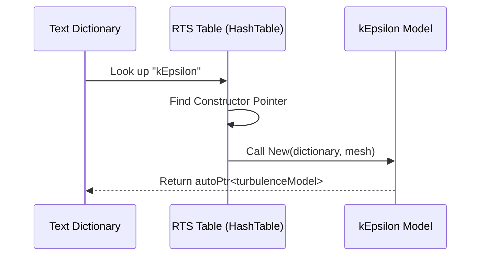

# Run-Time Selection System

ระบบ Run-Time Selection (RTS)

---

## Overview

> **RTS** = Create objects from dictionary strings at runtime

---

## 1. How It Works



---

## 2. Declaring RTS

```cpp
class turbulenceModel
{
public:
    TypeName("turbulenceModel");

    declareRunTimeSelectionTable
    (
        autoPtr,
        turbulenceModel,
        dictionary,
        (const dictionary& dict, const fvMesh& mesh),
        (dict, mesh)
    );

    static autoPtr<turbulenceModel> New
    (
        const dictionary& dict,
        const fvMesh& mesh
    );
};
```

---

## 3. Registering Model

```cpp
// In kEpsilon.C
defineTypeNameAndDebug(kEpsilon, 0);

addToRunTimeSelectionTable
(
    turbulenceModel,
    kEpsilon,
    dictionary
);
```

---

## 4. Factory Implementation

```cpp
// In turbulenceModel.C
autoPtr<turbulenceModel> turbulenceModel::New
(
    const dictionary& dict,
    const fvMesh& mesh
)
{
    word modelType(dict.lookup("type"));

    auto* ctorPtr = dictionaryConstructorTable(modelType);

    if (!ctorPtr)
    {
        FatalError << "Unknown type " << modelType;
    }

    return ctorPtr(dict, mesh);
}
```

---

## 5. Dictionary Usage

```cpp
// constant/turbulenceProperties
RAS
{
    model       kEpsilon;  // Selects kEpsilon class
    turbulence  on;
}
```

---

## 6. Macros Summary

| Macro | Purpose |
|-------|---------|
| `TypeName` | Register type name |
| `declareRunTimeSelectionTable` | Declare table |
| `defineRunTimeSelectionTable` | Define table |
| `addToRunTimeSelectionTable` | Register class |

---

## Quick Reference

```cpp
// Base class
TypeName("baseName");
declareRunTimeSelectionTable(...);

// Derived class
defineTypeNameAndDebug(Derived, 0);
addToRunTimeSelectionTable(...);
```

---

## 🧠 Concept Check

<details>
<summary><b>1. RTS ทำงานอย่างไร?</b></summary>

**Table lookup** — string → constructor function → create object
</details>

<details>
<summary><b>2. ทำไมต้องใช้ macros?</b></summary>

**Static initialization** — register at program start
</details>

<details>
<summary><b>3. autoPtr return ทำไม?</b></summary>

**Ownership transfer** — caller owns the object
</details>

---

## 📖 เอกสารที่เกี่ยวข้อง

- **ภาพรวม:** [00_Overview.md](00_Overview.md)
- **Patterns:** [05_Design_Patterns_in_Physics.md](05_Design_Patterns_in_Physics.md)