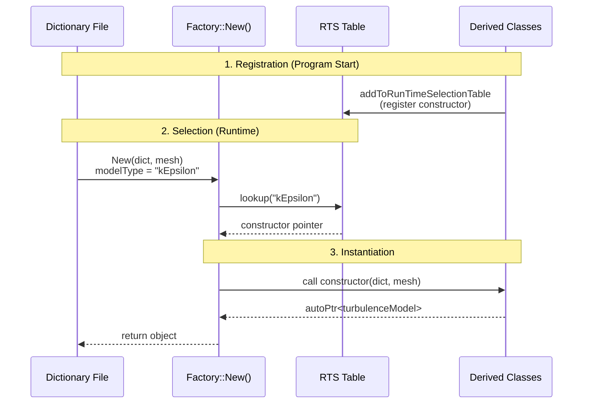

# Run-Time Selection System

ระบบ Run-Time Selection (RTS) ใน OpenFOAM

---

## Learning Objectives

หลังจากอ่านบทนี้ คุณจะสามารถ:
- **อธิบาย** หลักการทำงานของ Run-Time Selection System
- **ใช้งาน** Macros สำหรับการลงทะเบียนคลาสใน RTS
- **สร้าง** RTS-enabled class ใหม่ตั้งแต่ต้น
- **ดีบัก** ปัญหาที่เกิดขึ้นจากการใช้ RTS
- **ประยุกต์** RTS กับ custom physics models

---

## Overview

> **Run-Time Selection (RTS)** = ระบบที่ให้สร้าง object จาก string ใน dictionary ได้ที่ runtime

### What is RTS?

**RTS (Run-Time Selection)** เป็น design pattern ที่ให้ผู้ใช้เลือก class ที่ต้องการใช้งานผ่านการระบุชื่อใน text dictionary โดยไม่ต้องแก้โค้ดและ recompile

**ตัวอย่าง:** เลือก turbulence model ผ่าน dictionary:
```cpp
simulation
{
    turbulenceModel  kEpsilon;  // ใช้ kEpsilon class
}
```

### Why Use RTS?

| Benefits | Description |
|----------|-------------|
| **Flexibility** | เปลี่ยน model ได้โดยไม่ต้อง recompile |
| **Extensibility** | เพิ่ม model ใหม่ได้โดยไม่ต้องแก้ base code |
| **User-Friendly** | ผู้ใช้เลือก model ผ่าน dictionary ได้เลย |
| **Plug-in Architecture** | รองรับ third-party extensions |

### How RTS Works

**หลักการพื้นฐาน:**
1. **Registration Phase** - Class ลูกลงทะเบียน constructor ของตัวเองใน global table
2. **Selection Phase** - Factory method ค้นหา constructor จาก string
3. **Instantiation Phase** - เรียก constructor ที่พบเพื่อสร้าง object



---

## Part 1: Understanding RTS Macros

### What Do Macros Do?

Macros ใน OpenFOAM RTS ทำหน้าที่ **automate boilerplate code** สำหรับ:
- สร้าง static hash table สำหรับเก็บ constructor pointers
- สร้าง helper functions สำหรับ lookup
- จัดการ static initialization order

### Macro Breakdown

#### 1. TypeName Macro

```cpp
// ใน base class header
TypeName("turbulenceModel");
```

**What it generates:**
```cpp
static const ::Foam::word typeName;
virtual const ::Foam::word& type() const { return typeName; }
```

**Purpose:**
- กำหนดชื่อ class สำหรับ RTS
- ให้ method สำหรับ runtime type identification

---

#### 2. declareRunTimeSelectionTable Macro

```cpp
declareRunTimeSelectionTable
(
    autoPtr,              // Pointer type
    turbulenceModel,      // Base class
    dictionary,           // Selector type
    (const dictionary&, const fvMesh&),  // Constructor args (types)
    (dict, mesh)          // Constructor args (names)
);
```

**What it generates:**
```cpp
// Static hash table (declaration)
static HashTable<autoPtr (*)(const dictionary&, const fvMesh&), word>*
dictionaryConstructorTablePtr;

// Table access function
static HashTable<autoPtr (*)(const dictionary&, const fvMesh&), word>&
dictionaryConstructorTable();

// Constructor pointer typedef
typedef autoPtr (*)(const dictionary&, const fvMesh&) ConstructorTablePtr;

// Lookup function
static ConstructorTablePtr dictionaryConstructorTablePtr_(const word&);
```

**Parameters Explained:**
| Parameter | Meaning |
|-----------|---------|
| `autoPtr` | Smart pointer type ที่ return |
| `turbulenceModel` | Base class name |
| `dictionary` | Selection mechanism (type ของ selector) |
| `(const dictionary&, const fvMesh&)` | Parameter types ของ constructor |
| `(dict, mesh)` | Parameter names สำหรับ static cast |

**Selector Types:**
- `dictionary` - เลือกจาก dictionary entry
- `word` - เลือกจาก word string
- `wordRe` - เลือกจาก regular expression

---

#### 3. defineTypeNameAndDebug Macro

```cpp
// ใน derived class .C file
defineTypeNameAndDebug(kEpsilon, 0);
```

**What it generates:**
```cpp
const ::Foam::word kEpsilon::typeName("kEpsilon");
int kEpsilon::debug(0);
```

**Purpose:**
- Define type name string
- Define debug flag (สำหรับ logging)

---

#### 4. addToRunTimeSelectionTable Macro

```cpp
addToRunTimeSelectionTable
(
    turbulenceModel,    // Base class
    kEpsilon,          // Derived class
    dictionary         // Selector type
);
```

**What it generates:**
```cpp
// Anonymous namespace with static initializer
namespace
{
    // Constructor function wrapper
    autoPtr<kEpsilon> kEpsilon_dictionaryConstructorPtr
    (
        const dictionary& dict,
        const fvMesh& mesh
    )
    {
        return autoPtr<kEpsilon>(new kEpsilon(dict, mesh));
    }
    
    // Static registration class
    class kEpsilon_addToRunTimeSelectionTable
    {
    public:
        kEpsilon_addToRunTimeSelectionTable()
        {
            turbulenceModel::dictionaryConstructorTable()
                .insert("kEpsilon", kEpsilon_dictionaryConstructorPtr);
        }
    };
    
    // Global static instance (triggers registration)
    kEpsilon_addToRunTimeSelectionTable addkEpsilonToRunTimeSelectionTable_;
}
```

**Key Points:**
- Static object ถูกสร้างเมื่อ program start
- Constructor ของ static object เพิ่ม entry ลงใน table
- เกิดขึ้น **ก่อน main()** ด้วย static initialization

---

#### 5. defineRunTimeSelectionTable Macro

```cpp
// ใน base class .C file
defineRunTimeSelectionTable(turbulenceModel, dictionary);
```

**What it generates:**
```cpp
// Define the static table
HashTable<autoPtr (*)(const dictionary&, const fvMesh&), word>*
turbulenceModel::dictionaryConstructorTablePtr_(nullptr);

// Table accessor implementation
HashTable<autoPtr (*)(const dictionary&, const fvMesh&), word>&
turbulenceModel::dictionaryConstructorTable()
{
    if (!dictionaryConstructorTablePtr_)
    {
        dictionaryConstructorTablePtr_ = 
            new HashTable<autoPtr (*)(const dictionary&, const fvMesh&), word>();
    }
    return *dictionaryConstructorTablePtr_;
}
```

**Purpose:**
- Define static table storage
- Implement lazy initialization (singleton pattern)

---

## Part 2: Step-by-Step Tutorial

### Tutorial: Creating RTS-Enabled Physics Model

สร้าง system สำหรับเลือก heat transfer model แบบ runtime

#### Step 1: Design Base Class

**สร้าง `heatTransferModel.H`:**

```cpp
#ifndef heatTransferModel_H
#define heatTransferModel_H

#include "fvMesh.H"
#include "autoPtr.H"
#include "runTimeSelectionTables.H"

namespace Foam
{

// 1. Base class definition
class heatTransferModel
{
protected:
    // Protected data
    const fvMesh& mesh_;
    const dictionary& dict_;
    
public:
    // Runtime type information
    TypeName("heatTransferModel");
    
    // 2. Declare RTS table
    declareRunTimeSelectionTable
    (
        autoPtr,
        heatTransferModel,
        dictionary,
        (const dictionary& dict, const fvMesh& mesh),
        (dict, mesh)
    );
    
    // Constructors
    heatTransferModel(const dictionary& dict, const fvMesh& mesh);
    
    // Destructor
    virtual ~heatTransferModel() = default;
    
    // 3. Factory method
    static autoPtr<heatTransferModel> New
    (
        const dictionary& dict,
        const fvMesh& mesh
    );
    
    // Virtual interface
    virtual tmp<volScalarField> heatTransferCoeff() const = 0;
    virtual void correct() = 0;
};

} // End namespace Foam

#endif
```

**Key Elements:**
- `TypeName()` - Define type name for base class
- `declareRunTimeSelectionTable()` - Declare factory table
- `New()` - Static factory method

---

#### Step 2: Implement Factory Method

**สร้าง `heatTransferModel.C`:**

```cpp
#include "heatTransferModel.H"

// 4. Define RTS table
defineRunTimeSelectionTable(heatTransferModel, dictionary);

// Constructor
heatTransferModel::heatTransferModel
(
    const dictionary& dict,
    const fvMesh& mesh
)
:
    mesh_(mesh),
    dict_(dict)
{}

// 5. Implement factory method
autoPtr<heatTransferModel> heatTransferModel::New
(
    const dictionary& dict,
    const fvMesh& mesh
)
{
    // Read model type from dictionary
    word modelType;
    dict.readIfPresent("model", modelType);
    
    if (modelType.empty())
    {
        FatalErrorIn("heatTransferModel::New()")
            << "No heat transfer model specified" << nl
            << "Please add 'model <type>' to dictionary" << nl
            << abort(FatalError);
    }
    
    Info << "Selecting heat transfer model: " << modelType << endl;
    
    // 6. Lookup constructor
    auto* ctorPtr = dictionaryConstructorTable(modelType);
    
    if (!ctorPtr)
    {
        FatalErrorIn("heatTransferModel::New()")
            << "Unknown heat transfer model " << modelType << nl << nl
            << "Valid models are:" << nl
            << dictionaryConstructorTablePtr_->sortedToc() << nl
            << abort(FatalError);
    }
    
    // 7. Call constructor and return
    return ctorPtr(dict, mesh);
}
```

**Factory Method Logic:**
1. Read model type จาก dictionary
2. Validate ว่ามี type ถูก specify
3. Lookup constructor pointer จาก table
4. Validate ว่า type ถูกต้อง
5. Call constructor และ return autoPtr

---

#### Step 3: Create Derived Class

**สร้าง `constantHeatTransfer.H`:**

```cpp
#ifndef constantHeatTransfer_H
#define constantHeatTransfer_H

#include "heatTransferModel.H"

class constantHeatTransfer
:
    public heatTransferModel
{
    // Private data
    dimensionedScalar h_;
    
public:
    // Runtime type information
    TypeName("constant");
    
    // Constructor
    constantHeatTransfer
    (
        const dictionary& dict,
        const fvMesh& mesh
    );
    
    // Destructor
    virtual ~constantHeatTransfer() = default;
    
    // Virtual methods
    virtual tmp<volScalarField> heatTransferCoeff() const;
    virtual void correct();
};

#endif
```

---

**สร้าง `constantHeatTransfer.C`:**

```cpp
#include "constantHeatTransfer.H"

// 8. Define type name and debug
defineTypeNameAndDebug(constantHeatTransfer, 0);

// 9. Add to RTS table
addToRunTimeSelectionTable
(
    heatTransferModel,
    constantHeatTransfer,
    dictionary
);

// Constructor
constantHeatTransfer::constantHeatTransfer
(
    const dictionary& dict,
    const fvMesh& mesh
)
:
    heatTransferModel(dict, mesh),
    h_(dimensionedScalar::lookupOrDefault
    (
        "h",
        dict,
        dimensionSet(1, -2, -3, -1, 0, 0, 0),
        1000.0
    ))
{
    Info << "Creating constant heat transfer model: h = " << h_ << endl;
}

tmp<volScalarField> constantHeatTransfer::heatTransferCoeff() const
{
    return tmp<volScalarField>
    (
        new volScalarField
        (
            IOobject
            (
                "h",
                mesh_.time().timeName(),
                mesh_,
                IOobject::NO_READ,
                IOobject::NO_WRITE
            ),
            mesh_,
            h_
        )
    );
}

void constantHeatTransfer::correct()
{
    // Nothing to update for constant model
}
```

---

#### Step 4: Create Another Derived Class

**สร้าง `nusseltHeatTransfer.C`:**

```cpp
#include "nusseltHeatTransfer.H"

// Define and register
defineTypeNameAndDebug(nusseltHeatTransfer, 0);
addToRunTimeSelectionTable
(
    heatTransferModel,
    nusseltHeatTransfer,
    dictionary
);

nusseltHeatTransfer::nusseltHeatTransfer
(
    const dictionary& dict,
    const fvMesh& mesh
)
:
    heatTransferModel(dict, mesh),
    Pr_(dict.lookupOrDefault<scalar>("Pr", 0.71)),
    Re_(dict.lookupOrDefault<scalar>("Re", 10000.0))
{
    Info << "Creating Nusselt correlation model" << endl;
}

tmp<volScalarField> nusseltHeatTransfer::heatTransferCoeff() const
{
    // Nusselt number correlation
    scalar Nu = 0.023 * Foam::pow(Re_, 0.8) * Foam::pow(Pr_, 0.4);
    
    dimensionedScalar h
    (
        "h",
        dimMass/dimTime/dimLength/dimTemperature,
        Nu * 0.026  // thermal conductivity
    );
    
    return tmp<volScalarField>
    (
        new volScalarField
        (
            IOobject
            (
                "h",
                mesh_.time().timeName(),
                mesh_,
                IOobject::NO_READ,
                IOobject::NO_WRITE
            ),
            mesh_,
            h
        )
    );
}
```

---

#### Step 5: Usage in Application

```cpp
// In boundary condition or solver
#include "heatTransferModel.H"

// Read dictionary
IOdictionary htDict
(
    IOobject
    (
        "heatTransferProperties",
        mesh.time().constant(),
        mesh,
        IOobject::MUST_READ,
        IOobject::NO_WRITE
    )
);

// Create model via RTS
autoPtr<heatTransferModel> htModel = 
    heatTransferModel::New(htDict, mesh);

// Use model
volScalarField hCoeff = htModel->heatTransferCoeff();

// Update each timestep
htModel->correct();
```

---

#### Step 6: Dictionary Configuration

```cpp
// constant/heatTransferProperties
model      constant;     // Try "nusselt" or "constant"

constantCoeffs
{
    h         1500;      // W/m²K
}

nusseltCoeffs
{
    Pr        0.71;
    Re        10000;
}
```

---

### Complete File Structure

```
heatTransfer/
├── heatTransferModel/
│   ├── heatTransferModel.H      # Base class header
│   └── heatTransferModel.C      # Base class + factory
├── constantHeatTransfer/
│   ├── constantHeatTransfer.H   # Derived header
│   └── constantHeatTransfer.C   # Derived implementation
├── nusseltHeatTransfer/
│   ├── nusseltHeatTransfer.H
│   └── nusseltHeatTransfer.C
└── Make/
    └── files
```

**Make/files:**
```cpp
heatTransferModel.C
constantHeatTransfer.C
nusseltHeatTransfer.C

LIB = $(FOAM_USER_LIBBIN)/libheatTransferModels
```

---

## Part 3: Common Debugging Scenarios

### Scenario 1: "Unknown Type" Error

```
--> FOAM FATAL ERROR:
Unknown heat transfer model invalidModel

Valid models are:
constant
nusselt
```

**Causes:**
1. Typo in dictionary model name
2. Derived class not compiled
3. addToRunTimeSelectionTable macro missing
4. Library not linked

**Solutions:**

**Check 1: Verify model name matches TypeName**
```cpp
// In derived class .C
TypeName("constant");  // Must match dictionary exactly

// Dictionary
model Constant;  // ❌ Case-sensitive!
model constant;  // ✅ Correct
```

**Check 2: Verify registration macro**
```cpp
// Must be in .C file (not .H)
defineTypeNameAndDebug(constantHeatTransfer, 0);
addToRunTimeSelectionTable(heatTransferModel, constantHeatTransfer, dictionary);
```

**Check 3: Verify library linkage**
```bash
# Check if symbol exists in library
nm libheatTransferModels.so | grep constantHeatTransfer

# Should show:
# __ZN4Foam22constantHeatTransfer36addconstantHeatTransferToRunTimeSelectionTableE
```

**Check 4: Enable debug output**
```cpp
// At start of application
DebugVar(dictionaryConstructorTablePtr_->sortedToc());

// Output: 
// (constant nusselt)
```

---

### Scenario 2: Static Initialization Order Problem

**Symptoms:**
- Works in debug but fails in optimized build
- Fails intermittently
- Table appears empty when New() is called

**Root Cause:**
C++ static initialization order fiasco - derived class registration happens **before** base class table initialization

**Solution: Use Lazy Initialization**

```cpp
// In base class .C
HashTable<...>* heatTransferModel::dictionaryConstructorTablePtr_(nullptr);

HashTable<...>& heatTransferModel::dictionaryConstructorTable()
{
    if (!dictionaryConstructorTablePtr_)  // Lazy init
    {
        dictionaryConstructorTablePtr_ = 
            new HashTable<autoPtr (*)(...), word>();
    }
    return *dictionaryConstructorTablePtr_;
}
```

**Verification:**
```cpp
// Add to New() method
if (dictionaryConstructorTablePtr_->empty())
{
    WarningIn("heatTransferModel::New()")
        << "Constructor table is empty!" << nl
        << "This indicates static initialization order problem."
        << endl;
}
```

---

### Scenario 3: Constructor Signature Mismatch

```
error: no matching function for call to 'constantHeatTransfer::constantHeatTransfer(const Foam::dictionary&, const Foam::fvMesh&)
```

**Cause:** Constructor parameters don't match RTS declaration

**Check:**
```cpp
// Declaration must match exactly
declareRunTimeSelectionTable
(
    autoPtr,
    heatTransferModel,
    dictionary,
    (const dictionary& dict, const fvMesh& mesh),  // Types
    (dict, mesh)                                    // Names
);

// Derived constructor signature
constantHeatTransfer
(
    const dictionary& dict,   // ✅ Must be const reference
    const fvMesh& mesh        // ✅ Must be const reference
);
```

---

### Scenario 4: Multiple Definition Linker Error

```
multiple definition of 'Foam::constantHeatTransfer::typeName'
```

**Cause:** TypeName macro in header without inline protection

**Solution:**
```cpp
// ✅ Correct: Use TypeName macro (has inline)
TypeName("constant");

// ❌ Wrong: Manual definition in header
static const word typeName = "constant";  // Causes multiple definition
```

---

### Scenario 5: Table Lookup Returns NULL

```cpp
auto* ctorPtr = dictionaryConstructorTable(modelType);
if (!ctorPtr)  // Always enters this branch
{
    FatalError << "Constructor not found";
}
```

**Debug Steps:**

1. **Check table contents:**
```cpp
Info << "Available models: " 
     << dictionaryConstructorTablePtr_->sortedToc() << endl;
```

2. **Check exact string match:**
```cpp
Info << "Looking for: '" << modelType << "'" << endl;
Info << "Length: " << modelType.size() << endl;

// Check for hidden characters
forAll(modelType, i)
{
    Info << "char[" << i << "] = " 
         << label(modelType[i]) << endl;
}
```

3. **Verify table is initialized:**
```cpp
if (!dictionaryConstructorTablePtr_)
{
    FatalError << "Table pointer is null!" << endl;
}
```

---

## Part 4: Troubleshooting Checklist

### Pre-Compilation Checklist

- [ ] Base class has `TypeName()` macro
- [ ] Base class has `declareRunTimeSelectionTable()` in header
- [ ] Base class has `defineRunTimeSelectionTable()` in .C file
- [ ] Base class has `New()` factory method declared and implemented
- [ ] All derived classes have `TypeName()` with unique name
- [ ] All derived classes have `defineTypeNameAndDebug()` in .C file
- [ ] All derived classes have `addToRunTimeSelectionTable()` in .C file
- [ ] Constructor signatures match exactly between base and derived
- [ ] All derived classes are listed in Make/files
- [ ] Make/files has correct LIB path

### Runtime Checklist

- [ ] Dictionary specifies correct model name (case-sensitive)
- [ ] Library containing derived classes is loaded
- [ ] No duplicate TypeName values across classes
- [ ] Table lookup uses correct selector type
- [ ] Factory method called before any derived class usage
- [ ] mesh and dict objects are valid when passed to New()

### Debug Build Checklist

- [ ] Set debug flag on derived class:
  ```cpp
  defineTypeNameAndDebug(myClass, 1);  // 1 = debug on
  ```
- [ ] Set environment variable:
  ```bash
  export FOAM_DEBUG=1
  ```
- [ ] Add debug output to New():
  ```cpp
  Info << "Constructing table, size = " 
       << dictionaryConstructorTable().size() << endl;
  ```

### Common Error Messages Reference

| Error Message | Likely Cause | Fix |
|---------------|--------------|-----|
| `Unknown type X` | Model not registered | Check addToRunTimeSelectionTable macro |
| `Constructor table is empty` | Static init order | Use lazy initialization |
| `Multiple definition of typeName` | TypeName in .H file | Move to .C file or use macro |
| `No matching constructor` | Signature mismatch | Match constructor parameters |
| `Segmentation fault in New()` | Null table pointer | Check defineRunTimeSelectionTable |
| `library not loaded` | Missing dependency | Add to controlDict functions |

---

## Part 5: Advanced Patterns

### Pattern 1: Multiple Selection Tables

คลาสเดียวมีหลายวิธีในการสร้าง object

```cpp
class phaseModel
{
    // Selection by dictionary
    declareRunTimeSelectionTable
    (
        autoPtr,
        phaseModel,
        dictionary,
        (const dictionary& dict),
        (dict)
    );
    
    // Selection by word (no dictionary)
    declareRunTimeSelectionTable
    (
        autoPtr,
        phaseModel,
        word,
        (const word& phaseName),
        (phaseName)
    );
};
```

---

### Pattern 2: RTSTable with Custom Constructor

```cpp
// Custom selection based on mesh and field
declareRunTimeSelectionTable
(
    autoPtr,
    boundaryCondition,
        meshMapper,
        (const fvMesh& mesh, const fieldMapper& mapper),
        (mesh, mapper)
);

// Factory method
autoPtr<boundaryCondition> boundaryCondition::New
(
    const fvMesh& mesh,
    const fieldMapper& mapper
)
{
    word bcType = mapper.mapType();
    auto* ctorPtr = meshMapperConstructorTable(bcType);
    return ctorPtr ? ctorPtr(mesh, mapper) : nullptr;
}
```

---

### Pattern 3: Templated RTS

```cpp
template<class Type>
class NumericScheme
{
    declareRunTimeSelectionTable
    (
        autoPtr,
        NumericScheme,
        word,
        (const word& schemeName),
        (schemeName)
    );
};

// Usage in derived class
template<class Type>
class upwindScheme
:
    public NumericScheme<Type>
{
    TypeName("upwind");
    
    addToRunTimeSelectionTable
    (
        NumericScheme<Type>,
        upwindScheme<Type>,
        word
    );
};
```

---

## Part 6: Real OpenFOAM Examples

### Example 1: Turbulence Model

```cpp
// src/turbulenceModels/turbulenceModel/turbulenceModel.H
class turbulenceModel
{
    TypeName("turbulenceModel");
    
    declareRunTimeSelectionTable
    (
        autoPtr,
        turbulenceModel,
        dictionary,
        (const volScalarField& rho, const volVectorField& U, const surfaceScalarField& phi),
        (rho, U, phi)
    );
};

// src/turbulenceModels/compressible/kEpsilon/kEpsilon.C
defineTypeNameAndDebug(kEpsilon, 0);
addToRunTimeSelectionTable
(
    turbulenceModel,
    kEpsilon,
    dictionary
);
```

---

### Example 2: Boundary Condition

```cpp
// src/finiteVolume/fields/fvPatchFields/fvPatchField/fvPatchField.H
template<class Type>
class fvPatchField
{
    TypeName("fvPatchField");
    
    declareRunTimeSelectionTable
    (
        autoPtr,
        fvPatchField,
        patch,
        (const fvPatch& p, const Field<Type>& iF),
        (p, iF)
    );
};

// Derived BC
template<>
class fixedValueFvPatchField<scalar>
:
    public fvPatchField<scalar>
{
    TypeName("fixedValue");
    
    addToRunTimeSelectionTable
    (
        fvPatchField<scalar>,
        fixedValueFvPatchField<scalar>,
        patch
    );
};
```

---

## Part 7: Practical Exercises

### Exercise 1: Add Custom Model

เพิ่ม `logarithmicHeatTransfer` model ให้กับ heat transfer system

**Requirements:**
- Model คำนวณ h จาก logarithmic law: `h = C * log(Re)`
- C สามารถ set ได้จาก dictionary
- Re อ่านจาก dictionary

**Solution:**

```cpp
// logarithmicHeatTransfer.H
class logarithmicHeatTransfer
:
    public heatTransferModel
{
    dimensionedScalar C_;
    dimensionedScalar Re_;
    
public:
    TypeName("logarithmic");
    
    logarithmicHeatTransfer
    (
        const dictionary& dict,
        const fvMesh& mesh
    );
    
    virtual tmp<volScalarField> heatTransferCoeff() const;
    virtual void correct();
};

// logarithmicHeatTransfer.C
defineTypeNameAndDebug(logarithmicHeatTransfer, 0);
addToRunTimeSelectionTable
(
    heatTransferModel,
    logarithmicHeatTransfer,
    dictionary
);

logarithmicHeatTransfer::logarithmicHeatTransfer
(
    const dictionary& dict,
    const fvMesh& mesh
)
:
    heatTransferModel(dict, mesh),
    C_(dict.lookupOrDefault<scalar>("C", 10.0)),
    Re_(dict.lookupOrDefault<scalar>("Re", 10000.0))
{}

tmp<volScalarField> logarithmicHeatTransfer::heatTransferCoeff() const
{
    scalar h = C_.value() * std::log(Re_.value());
    
    return tmp<volScalarField>
    (
        new volScalarField
        (
            IOobject("h", mesh_.time().timeName(), mesh_),
            mesh_,
            dimensionedScalar("h", dimMass/dimTime/dimLength/dimTemperature, h)
        )
    );
}
```

---

### Exercise 2: Debug Broken RTS

Given this error:
```
Unknown model customModel
Valid models are: (none)
```

**Identify the bug:**

```cpp
// brokenModel.C
#include "brokenModel.H"

TypeName("brokenModel");  // ❌ Bug: Should be defineTypeNameAndDebug

addToRunTimeSelectionTable
(
    heatTransferModel,
    brokenModel,
    dictionary
);
```

**Fix:**
```cpp
// brokenModel.C
#include "brokenModel.H"

defineTypeNameAndDebug(brokenModel, 0);  // ✅ Correct

addToRunTimeSelectionTable
(
    heatTransferModel,
    brokenModel,
    dictionary
);
```

---

## Key Takeaways

### Essential Concepts

1. **RTS = Factory Pattern with Registry**
   - Base class defines factory table
   - Derived classes register themselves
   - Factory method creates objects from strings

2. **Macros Hide Complexity**
   - `TypeName` - Define runtime type info
   - `declareRunTimeSelectionTable` - Declare factory
   - `defineRunTimeSelectionTable` - Define storage
   - `addToRunTimeSelectionTable` - Register class

3. **Static Initialization is Key**
   - Registration happens at program start
   - Must use static/global objects
   - Order matters - use lazy initialization

4. **Debug Systematically**
   - Check table contents first
   - Verify macro placement (.H vs .C)
   - Match constructor signatures exactly
   - Use debug flags for visibility

### Common Pitfalls to Avoid

- ❌ TypeName in header without inline
- ❌ addToRunTimeSelectionTable in header
- ❌ Constructor signature mismatch
- ❌ Case-sensitive model name typos
- ❌ Missing library linkage
- ❌ Debugging without debug flags

### Best Practices

- ✅ Use macros exactly as specified
- ✅ Keep all RTS code in .C files (except declare)
- ✅ Validate model names in New() method
- ✅ Provide list of valid models in error messages
- ✅ Use lazy initialization for tables
- ✅ Add debug output for troubleshooting

---

## 📖 Related Documentation

- **Overview:** [00_Overview.md](00_Overview.md)
- **Design Patterns:** [05_Design_Patterns_in_Physics.md](05_Design_Patterns_in_Physics.md)
- **Inheritance:** [02_Inheritance_and_Polymorphism.md](02_Inheritance_and_Polymorphism.md)
- **Virtual Methods:** [03_Virtual_Methods_and_Interfaces.md](03_Virtual_Methods_and_Interfaces.md)

---

## 🧠 Self-Assessment

<details>
<summary><b>1. What is the purpose of Run-Time Selection?</b></summary>

**Answer:** RTS allows object creation from string names in dictionaries at runtime, enabling users to choose models without recompiling. It implements the Factory pattern with automatic registration.
</details>

<details>
<summary><b>2. Why must addToRunTimeSelectionTable be in a .C file, not .H?</b></summary>

**Answer:** Because it creates a static object for registration. If in a header included by multiple translation units, you'd get multiple definition errors. The .C file ensures a single registration point.
</details>

<details>
<summary><b>3. What does autoPtr return type indicate in RTS?</b></summary>

**Answer:** autoPtr shows automatic memory management - the factory transfers ownership of the created object to the caller, who is responsible for its lifecycle.
</details>

<details>
<summary><b>4. How does the static registration mechanism work?</b></summary>

**Answer:** Each derived class's addToRunTimeSelectionTable macro creates a static object whose constructor adds the class's constructor pointer to the base class's hash table. This happens before main() during static initialization.
</details>

<details>
<summary><b>5. What are the four required RTS macros and their purposes?</b></summary>

**Answer:** 
- `TypeName` - Define runtime type name
- `declareRunTimeSelectionTable` - Declare factory table in base class header
- `defineRunTimeSelectionTable` - Define table storage in base class .C
- `addToRunTimeSelectionTable` - Register derived class in derived .C
</details>