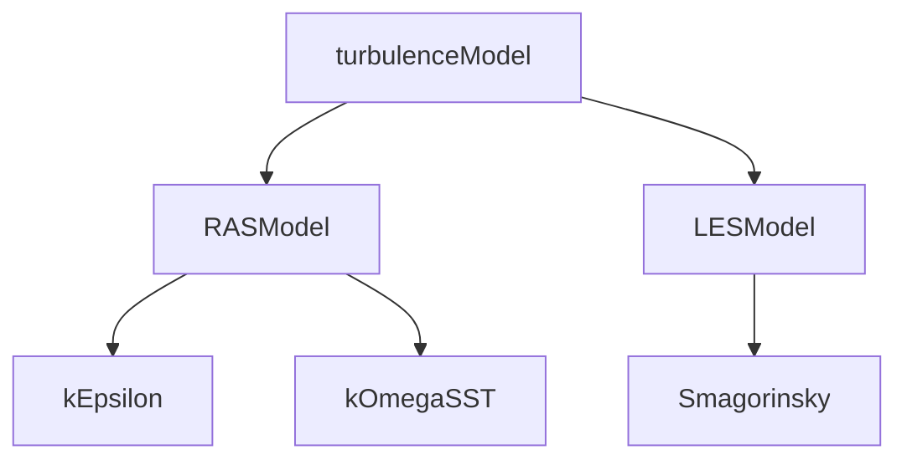

# Design Patterns in Physics Models

Design Patterns ใน Physics Models

---

## Overview

> OpenFOAM uses **polymorphism** for pluggable physics models

---

## 1. Run-Time Selection

```cpp
// Base class with RTS
class turbulenceModel
{
public:
    declareRunTimeSelectionTable
    (
        autoPtr, turbulenceModel, dictionary, (args), (args)
    );

    static autoPtr<turbulenceModel> New(const dictionary& dict);
};

// Usage
autoPtr<turbulenceModel> turb = turbulenceModel::New(dict);
```

---

## 2. Inheritance Pattern



---

## 3. Interface Definition

```cpp
class turbulenceModel
{
public:
    // Pure virtual - must be implemented
    virtual tmp<volScalarField> k() const = 0;
    virtual tmp<volScalarField> epsilon() const = 0;
    virtual tmp<volSymmTensorField> R() const = 0;

    // Virtual with default - can override
    virtual void correct();
};
```

---

## 4. Concrete Implementation

```cpp
class kEpsilon : public RASModel
{
    volScalarField k_;
    volScalarField epsilon_;

public:
    TypeName("kEpsilon");

    kEpsilon(const dictionary& dict);

    virtual tmp<volScalarField> k() const { return k_; }
    virtual tmp<volScalarField> epsilon() const { return epsilon_; }
    virtual void correct();
};
```

---

## 5. Dictionary Selection

```cpp
// constant/turbulenceProperties
simulationType  RAS;

RAS
{
    model           kEpsilon;
    turbulence      on;
    printCoeffs     on;
}
```

---

## 6. Factory Pattern

```cpp
// Create model based on dict
autoPtr<turbulenceModel> turbulence = turbulenceModel::New
(
    alpha, rho, U, phi, transport
);

// Use polymorphically
turbulence->correct();
```

---

## Quick Reference

| Pattern | OpenFOAM Use |
|---------|--------------|
| Factory | `Model::New()` |
| Strategy | Interchangeable models |
| Template Method | `correct()` in base |
| Polymorphism | Virtual functions |

---

## 🧠 Concept Check

<details>
<summary><b>1. Run-Time Selection ทำอะไร?</b></summary>

**Create objects from dictionary string** at runtime
</details>

<details>
<summary><b>2. ทำไมใช้ virtual functions?</b></summary>

**Polymorphism** — เปลี่ยน model ได้โดยไม่เปลี่ยน solver code
</details>

<details>
<summary><b>3. autoPtr ใช้ทำไม?</b></summary>

**Ownership management** — automatic deletion when not needed
</details>

---

## 📖 เอกสารที่เกี่ยวข้อง

- **ภาพรวม:** [00_Overview.md](00_Overview.md)
- **RTS:** [04_Run_Time_Selection_System.md](04_Run_Time_Selection_System.md)